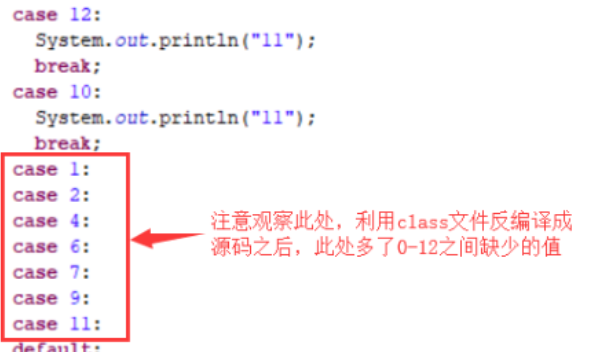

## jdk7

**1、switch中使用String**
**2、try-with-resources**
**3、捕获多个异常||||||**
**4、泛型实例化类型自动推断**
**5、数字增加二进制表示 多进制表示赋值**
6、数字中可添加分隔符

参考

- https://blog.csdn.net/u014209205/article/details/79718689

## jdk8

**1、接口的默认方法、静态方法**
**2、Lambda 表达式**
**3、函数式接口**
**4、方法与构造函数引用**
**5、Date API**
**6、Optional 类**
**7、Stream**


参考

- 菜鸟教程
- https://www.jianshu.com/p/0bf8fe0f153b
- https://blog.csdn.net/sun_promise/article/details/51383618

## jdk9

1、集合加强 of，

Java 9 List，Set 和 Map 接口中，新的静态工厂方法可以创建这些集合的不可变实例。这些工厂方法可以以更简洁的方式来创建集合。

Collections.unmodifiableSet(set); 

参考：集合：https://www.runoob.com/java/java9-collection-factory-methods.html

2、**私有接口方法**，作为通用方法放在默认方法中调用
3、**jdk9把G1作为默认的垃圾收集器实现**，替换了jdk7和jdk8的默认垃圾收集器实现：Parallel Scavenge（新生代）+Parallel Old（老年代）。
**4、I/O流加强，增加方法，readAllBytes等等**
**5、JShell工具**
**6、String存储结构变更**
7、Deprecated废弃不少API 标注Since
**8、增加stream API 方法**
        1、takeWhile
        2、dropWhile
        3、ofNullable(T t): t可以为null
        4、等等
**9、对try with resource的进一步优化**
**10、全新的HTTP客户端API**

11、Java 9 钻石操作符(Diamond Operator)，意思是，匿名内部类后边的<>里面 Integer 可以不用写了。

Handler<Integer> intHandler = new Handler<Integer>(1) { ... }

## Java 9 改进的 try-with-resources

try-with-resources 是 JDK 7 中一个新的异常处理机制，它能够很容易地关闭在 try-catch 语句块中使用的资源。所谓的资源（resource）是指在程序完成后，必须关闭的对象。

try-with-resources 语句确保了每个资源在语句结束时关闭。所有实现了 java.lang.AutoCloseable 接口（其中，它包括实现了 java.io.Closeable 的所有对象），可以使用作为资源。

try-with-resources 声明在 JDK 9 已得到改进。**如果你已经有一个资源是 final 或等效于 final 变量,您可以在 try-with-resources 语句中使用该变量，而无需在 try-with-resources 语句中声明一个新变量。**

实例

```java
import java.io.BufferedReader;
import java.io.IOException;
import java.io.Reader;
import java.io.StringReader;
 
public class Tester {
   public static void main(String[] args) throws IOException {
      System.out.println(readData("test"));
   } 
   static String readData(String message) throws IOException {
      Reader inputString = new StringReader(message);
      BufferedReader br = new BufferedReader(inputString);
      try (BufferedReader br1 = br) {
         return br1.readLine();
      }
   }
}
```

输出结果为：

```
test
```

以上实例中我们需要在 try 语句块中声明资源 br1，然后才能使用它。

在 Java 9 中（少了在try后面括号里面声明的这一步），我们不需要声明资源 br1 就可以使用它，并得到相同的结果。

实例

```java
import java.io.BufferedReader;
import java.io.IOException;
import java.io.Reader;
import java.io.StringReader;
 
public class Tester {
   public static void main(String[] args) throws IOException {
      System.out.println(readData("test"));
   } 
   static String readData(String message) throws IOException {
      Reader inputString = new StringReader(message);
      BufferedReader br = new BufferedReader(inputString);
      try (br) {
         return br.readLine();
      }
   }
}
```

执行输出结果为：

```
test
```

在处理必须关闭的资源时，使用try-with-resources语句替代try-finally语句。 生成的代码更简洁，更清晰，并且生成的异常更有用。 try-with-resources语句在编写必须关闭资源的代码时会更容易，也不会出错，而使用try-finally语句实际上是不可能的。

参考

- Java 9 新特性：https://www.runoob.com/java/java9-new-features.html

- https://yq.aliyun.com/articles/652719

## jdk10	

**1、局部变量类型推断 var**
2、**G1**已经作为缺省的垃圾收集器了。
**3、Optional API增强**，orElseThrow（）....

## 局部变量推断

 只能用做为局部变量 

- 仅适用于局部变量量，如 增强for循环的索引，传统for循环局部变量
- **不能使用于方法形参、构造函数形参、方法返回类型或任何其他类型的变量量声明**
- **标识符var不是关键字**，而是一个保留类型名称，而且**不支持类或接口叫var,也不符合命名规范，但可以作为变量名，方法名等。** 

例如：

```java
public class Main {
    public static void main(String[] args) {
        var list = new ArrayList<Integer>();//ArrayList<Integer> 省去这么长。
        list.add(1);
        list.add(2);
        list.add(3);
        list.stream().forEach(System.out::println);
    }

}
```

原理：

```java
var intValue = 1;
var doubleValue = 1.1;
var stringValue = "string";
var list = new ArrayList<>();
var map = new HashMap<>();

看下上面代码的class文件反编译后的代码：

int intValue = true;
double doubleValue = 1.1D;
String stringValue = "string";
new ArrayList();
new HashMap();
```

编译完后的class中其实已经是正确的类型了，可以知道**类型推断是发生在编译期的**，在编译期间，编译器会执行推断进行类型转换，如果变量为null则会抛出空指针异常。

可以看到其实局部变量推断是一种新的语法糖，**方便我们书写、查看代码**，jvm是不认识这个东西的，整个推断过程都是发生在编译期，**jvm不需要任何的改动来支持这个特性。**

- https://zhuanlan.zhihu.com/p/97767518

## jdk11

**1、Lambda表达式中Local Var**
**2、HttpClient 在11中完全可用，是对java9 最终版**
**3、对Files类增加了writeString和readString两个静态方法**
**4、String新增了strip()方法，和trim()相比，strip()可以去掉Unicode空格**
5、优秀的**ZGC**（目前只在 Linux/x64 上可用）：
	可伸缩低延迟垃圾收集器，并发收集器， -Xmx 是 ZGC 收集器中最重要的调优选项
	比g1颗粒度更细
	并行回收、**增量回收**、在程序运行期间回收（并发回收）

参考

- https://www.liaoxuefeng.com/article/1248336382261824
- https://developer.ibm.com/zh/articles/the-new-features-of-java-11/	

## jdk12

1、String中新增方法indent()缩进、transform()字符串函数式转换、
2、Files.mismatch(Path, Path)文件相同比较、
**3、Unicode 万国码更多的支持以及 emoji**
**4、Switch Expressions(Preview) 表达式输出、 ->**
5、Compact Number Formatting (紧凑的数据格式)

6、Shenandoah GC 色男都啊   测试中的**GC算法**、旨在保证低延迟（10 - 500 ms的下限）无论堆的大小如何都是这个值			
7、G1归还不使用的内存
8、G1的可中断 mixed GC 功能的支持

- https://zhuanlan.zhihu.com/p/107117568

## jdk13

1、Switch Expressions(Preview) 表达式输出、 -> 基于jdk12（**标签简化**）的更加优化，可以方法内部直接 当参数传递，比如syso

**2、switch多了跳出switch块的关键字，yield 返回值形式，那就是yield、区别return一个跳出方法，一个跳出switch**

**Switch 表达式（返回值）应该使用 yield，而 Switch 语句（不返回值）应该使用 break**
目前处于预览状态。

**3、字符串 """ 多行的字符串，不需要进行任何转义，不出现\n + 什么的**
4、Java 13 中对 ZGC 的改进，主要体现在下面几点：				

ZGC原来java11的测试gC，可伸缩、低延迟的垃圾收集器。

- **释放未使用内存给操作系统**
- **支持最大堆大小为 16TB**
- **添加参数：-XX:SoftMaxHeapSize 来软限制堆大小**

**5、Socket API 重构**

参考

- https://developer.ibm.com/zh/articles/the-new-features-of-Java-13/

## jdk14

1、垃圾回收相关：

**1）删除cms垃圾收集器**
**2）弃用 ParallelScavenge + SerialOld GC 的垃圾回收算法组合**
**3）zgc 垃圾回收器 移植到 macOS 和 windows 平台** 

2、switch优化变更为最终版
	预览版：该功能在当前版本可以使用，如果效果不是很好的话，可能以后的其他版本就会删去该功能。
	最终版：该功能在之前版本效果很好，之后的每个版本中都会存在该功能。

**3、数值读取优化，NumberFormat**

4、删除了安全库java.security.acl API

参考

- https://blog.csdn.net/m0_38001814/article/details/88831037?utm_medium=distribute.pc_relevant.none-task-blog-BlogCommendFromMachineLearnPai2-1.edu_weight&depth_1-utm_source=distribute.pc_relevant.none-task-blog-BlogCommendFromMachineLearnPai2-1.edu_weight#jdk12%E6%96%B0%E7%89%B9%E6%80%A7

## switch

一个case语句代表一个制定操作，然后转向结构出口。default子句是可选的，当表达式的值与case表达式常量的值都不匹配时，就运行default子句，转向结构出口。 

```java
switch(表达式){  
	case 表达式常量1：语句1； break；  
	case 表达式常量2：语句2； break； 
	......  
	case 表达式常量n：语句n； break；  
	[default：语句n+1；] 
}
```

#### 执行顺序

switch表达式的值决定选择哪个case分支，如果找不到相应的分支，就直接从"default"开始输出。
当程序执行一条case语句后，因为下边例子中的case分支中没有break 和return语句，所以程序会执行紧接于其后的语句。

```java
public class Switch {
	public static void main(String[] args)
	{
		int x=0;
		switch(x)
		{
			default:
			System.out.println("default");
			case 1:
			System.out.println(1);
			case 2:
			System.out.println(2);
		}
	}
}
```

输出结果如下：

```
default
1
2
```

#### switch与if的区别

2、switch和if-else相比，由于使用了二分查找算法，绝大部分情况下switch会快一点，除非是if-else的第一个条件就为true。

4、相比于if-else结构，switch的效率绝对是要高很多的，但是switch使用查找表的方式决定了case的条件必须是个连续的常量。而if-else则可以灵活的多。

6、switch的效率与分支数无关。当只有分支比较少的时候，if效率比switch高(因为switch有跳转表)。分支比较多，那当然是使用switch。

为什么switch的效率比iflelse高？



 **一般能够用switch表示的逻辑结构，都可以使用ifelse进行表示。但是如果判断的条件分支比较多的时候，建议多使用switch，因为switch的执行效率高，这源于switch在被编译的时候，其跳转指令会被编译为一个数组，从而使用查表法 二分法查找等高效的方式进行指令的跳转。** 

参考

为什么switch的效率比iflelse高：https://blog.csdn.net/XYxingyuanjituan/article/details/104404876

Java switch 条件语句用法详解：http://www.51gjie.com/java/631.html


#### JDK 14 Switch表达式示例

Switch的新特性，早在JDK 12就以预览功能被引入了，最终在 JDK 14 成为了正式版本的功能。

JEP 361: Switch Expressions (Standard)。

其实Switch新增的特性有两个，一个就是**允许每个case包含多个常量**，**一个就是switch-case块可以有返回值**。本文主要介绍Java(JDK) 14中， Switch表达式使用方法，以及相关示例代码。

**1､case包含多个常量**

**单个的写法：**

```java
public void daysOfMonth(int month) {
    switch (month) {
        case 1:
        case 3:
            System.out.println("this month has 31 days");
            break;
        case 4:
            System.out.println("this month has 30 days");
            break;
        default:
            System.out.println("invalid month");
    }
}
```

**多个常量的写法：**

```java
switch (month) {
    case 1, 3, 5, 7, 8, 10, 12 -> System.out.println("this month has 31 days");
    case 4, 6, 9 -> System.out.println("this month has 30 days");
    case 2 -> System.out.println("February can have 28 or 29 days");
    default -> System.out.println("invalid month");
}
```

新语法`“ case L->”`，开关块代码看起来更加清晰，**简洁和可读，并且不必显式使用break语句来跳出**，从而**减少了容易出错**的代码（没有失败，也没有中断）。

switch新语法中，**箭头标签后面的代码可以是表达式，代码块或throw语句**。例如：

```java
switch (month) {
    case 1, 3, 5, 7, 8, 10, 12 -> System.out.println("this month has 31 days");
    case 4, 6, 9 -> System.out.println("this month has 30 days");
    case 2 -> {
        Scanner scanner = new Scanner(System.in);
        System.out.print("Enter year: ");
        int year = scanner.nextInt();
        if (year % 4 == 0)
            System.out.println("This february has 29 days");
        else
            System.out.println("This February has 28 days");
    }
    default -> throw new IllegalArgumentException("Invalid month");
}
```

注意：新语法的switch表达式，由于代码不会进入下一种情况，**因此我们不必每种情况使用break中断。**

**2､switch-case中返回值**

从Java 14开始，可以在表达式中使用`switch case`块，也就是switch块可以返回一个值。对于传统的`switch`语句，我们必须使用临时变量，如以下代码示例所示：

```java
int days = 0;
switch (month) {
    case 12:
        days = 31;
        break;
    case 9:
        days = 30;
        break;
    case 2:
        days = 28;
        break;
    default:
        throw new IllegalArgumentException("Invalid month");
}
```

**在switch-case中返回值:**

```java
int days = switch (month) {
        case 1, 3, 5, 7, 8, 10, 12 -> 31;
        case 4, 6, 9 -> 30;
        case 2 -> 28;
        default -> 0;
};
```

或

```java
System.out.println(
    switch (month) {
        case 1, 3, 5, 7, 8, 10, 12 -> 31;
        case 4, 6, 9 -> 30;
        case 2 -> 28;
        default -> 0;
    }
);
```

或

```java
int days = switch (month) {
        case 1, 3, 5, 7, 8, 10, 12 -> 31;
        case 4, 6, 9 -> 30;
        case 2 -> {
            Scanner scanner = new Scanner(System.in);
            System.out.print("Enter year: ");
            int year = scanner.nextInt();
            if (year % 4 == 0)
                yield 29;// yield 后边是 switch语句返回值
            else
                yield 28;
        }
        default -> 0;
};
```

或

```java
int days = switch (month) {
    case 1, 3, 5, 7, 8, 10, 12:
        yield 31;
    case 4, 6, 9:
        yield 30;
    case 2: {
        Scanner scanner = new Scanner(System.in);
        System.out.print("Enter year: ");
        int year = scanner.nextInt();
        if (year % 4 == 0)
            yield 29;
        else
            yield 28;
    }
    default: yield 0;
};
```

注意：不能在Switch代码块中同时使用`“case L:”`和`“case L->”`。

**相关文档：**

[Java JDK13(Java 13) switch新特性语法使用及示例代码](https://www.cjavapy.com/article/465)

[Java中switch用法示例](https://www.cjavapy.com/article/62)


# 参考

JDK 15 新特性讲解：https://my.oschina.net/u/4262150/blog/4656149

JDK 15 ：https://www.cnblogs.com/flydean/p/jdk15-release-new-features.html

JDK 下载官网：https://www.oracle.com/java/technologies/javase-downloads.html

https://download.oracle.com/otn/java/jdk/11.0.9+7/eec35ebefb3f4133bd045b891f05db94/jdk-11.0.9_windows-x64_bin.zip?AuthParam=1611062540_6cf57dcae1242c0342cd3b3b044c7696