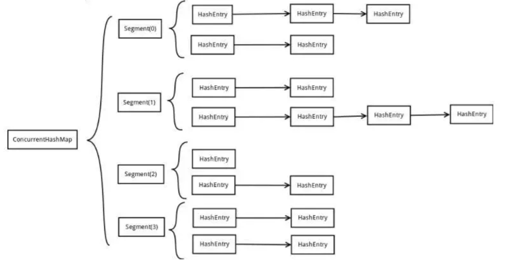

# LinkedHashMap

##### 概述

LinkedHashMap extends HashMap<K,V>implements Map<K,V>

这里说的版本是1.8版本，实际使用上可以认为是**HashMap+LinkedList**，有序的实现是因为加了双链表。

| **关  注  点**                | **结    论**                 |
| ----------------------------- | ---------------------------- |
| LinkedHashMap是否允许空       | Key和Value都允许空           |
| LinkedHashMap是否允许重复数据 | Key重复会覆盖、Value允许重复 |
| LinkedHashMap是否有序         | **有序**                     |
| LinkedHashMap是否线程安全     | 非线程安全                   |

##### 存储结构

````java
static class Entry<K,V> extends HashMap.Node<K,V> {    
	Entry<K,V> before, after;    
	Entry(int hash, K key, V value, Node<K,V> next) {        
		super(hash, key, value, next);    
	}
}
````

 Entry<K,V> before, after 代表双链表的前后节点，用于迭代。

##### 其他变量

```java
/*The head (eldest) of the doubly linked list. */
transient LinkedHashMap.Entry<K,V> head;
/*The tail (youngest) of the doubly linked list. */
transient LinkedHashMap.Entry<K,V> tail;

final boolean accessOrder;
```

单独维护 head、tail 方便头、尾的操作。

accessOrder：

false，所有的Entry按照插入的顺序排列，也是默认值。这时候可以当做队列使用。

true，所有的Entry按照访问的顺序排列， 这时候可以当做简单的LRU算法实现。

LRU： 缓存算法的概念，LRU即Least Recently Used，最近最少使用，也就是说，当缓存满了，会优先淘汰那些最近最不常访问的数据。

##### 简单LRU功能

accessOrder为true的LinkedHashMap 每次访问一个元素（get或put），被访问的元素都被提到最后面去。

也就是双向链表最头的那个数据就是要淘汰的数据。 举个例子说，依次存了1、3、5 ，然后用了一次 3 ，那么再遍历出的顺序就是1、5、3 。

逻辑实现是这个方法 void recordAccess(HashMap<K,V> m)   逻辑就是先将自己删除了，然后在把自己添加。

##### 五个构造方法： 

````java
// 构造方法1，构造一个指定初始容量和负载因子的、按照插入顺序的LinkedList
public LinkedHashMap(int initialCapacity, float loadFactor) {
    super(initialCapacity, loadFactor);
    accessOrder = false;
}
// 构造方法2，构造一个指定初始容量的LinkedHashMap，取得键值对的顺序是插入顺序
public LinkedHashMap(int initialCapacity) {
    super(initialCapacity);
    accessOrder = false;
}
// 构造方法3，用默认的初始化容量和负载因子创建一个LinkedHashMap，取得键值对的顺序是插入顺序
public LinkedHashMap() {
    super();
    accessOrder = false;
}
// 构造方法4，通过传入的map创建一个LinkedHashMap，容量为默认容量（16）和(map.zise()/DEFAULT_LOAD_FACTORY)+1的较大者，装载因子为默认值
public LinkedHashMap(Map<? extends K, ? extends V> m) {
    super(m);
    accessOrder = false;
}
// 构造方法5，根据指定容量、装载因子和键值对保持顺序创建一个LinkedHashMap
public LinkedHashMap(int initialCapacity,
             float loadFactor,
                         boolean accessOrder) {
    super(initialCapacity, loadFactor);
    this.accessOrder = accessOrder;
}
````

所有构造方法都是通过调用父类的构造方法来创建对象的。重载的参数是初始容量、负载因子、对出入Map类型的适配构造、排序规则（布尔值accessOrder）。


##### 参考资料

LinkedHashMap https://www.cnblogs.com/xiaoxi/p/6170590.html

# ConcurrentHashMap

## 1.1并发安全的哈希

##### 为什么需要ConcurrentHashMap

HashMap在多线程环境下非线程安全，而HashTable通多对方法使用Synchronized加以修饰从而达到线程安全，但是HashTable实现同步的方法比较暴力，相当于所有读写线程均去读取一把锁，效率比较低下。另外一种同步Map的方法是使用Collections工具类，例如：

```java
Map<Integer, Integer> map = Collections.synchronizedMap(new HashMap<>());
```

该种方法与HashTable实现方式类似，也是通过锁住整表来实现同步的。而ConcurrentHashMap则避免了上述两种Map同步方式锁住全表的问题。在JDK1.7中，通过引入分段锁Segment(实现了ReentrantLock)，保证了一定粒度的并行；在JDK1.8中则抛弃Segment的设计理念，将粒度完全降低到桶数量，基于CAS与Synchronized。

##### ConcurrentHashMap的基本设计思想

ConcurrentHashMap和HashMap实现上类似，最主要的差别是ConcurrentHashMap 采用了分段锁（Segment），每个分段锁维护着几个桶（HashEntry），多个线程可以同时访问不同分段锁上的桶，从而使其并发度更高（并发度就是Segment的个数）。其中Segment继承自ReentrantLock。默认的并发级别为16，也就是说默认创建16个Segment。JDK1.7使用分段锁机制来实现并发更新操作，核心类为Segment，它继承自重入锁ReentrantLock，并发度与Segment数量相等。JDK1.8使用了CAS操作来支持更高的并发度，在CAS操作失败时使用内置锁synchronized。并且 JDK 1.8 的实现也在链表过长时会转换为红黑树。

## 1.2 JDK7的ConcurrentHashMap

## 基本结构



##### Segment

Segment是JDK1.7中ConcurrentHashMap的核心设计，通过引入分段达成提高并行处理度的效果。易于看出，Segment继承了ReentrantLock并实现了序列化接口，说明Segment的锁是可重入的。

```java
static final class Segment<K,V> extends ReentrantLock implements Serializable {
    transient volatile int count;   // Segment中元素的数量，由volatile修饰，支持内存可见性
    transient int modCount;         // 对table的大小造成影响的操作的数量（比如put或者remove操作）
    transient int threshold;        // 扩容阈值
    transient volatile HashEntry<K,V>[] table;    // 链表数组，数组中的每一个元素代表了一个链表的头部
    final float loadFactor;         // 负载因子
}
```

##### HashEntry

Segment中的元素是以HashEntry的形式存放在链表数组中的，其结构与普通HashMap的HashEntry基本一致，不同的是Segment的HashEntry，其value由volatile修饰，以支持内存可见性，即写操作对其他读线程即时可见。

```java
static final class HashEntry<K,V> {
    final K key;
    final int hash;
    volatile V value;
    final HashEntry<K,V> next;    
}
```

值得注意的是，key，hash值与next域都是由final修饰的，无法修改其引用。

##### 初始化过程

下面以一个ConcurrentHashMap构造函数为例进行分析：

```java
public ConcurrentHashMap(int initialCapacity,
                         float loadFactor, int concurrencyLevel) {
    if (!(loadFactor > 0) || initialCapacity < 0 || concurrencyLevel <= 0)
        throw new IllegalArgumentException();
    if (concurrencyLevel > MAX_SEGMENTS)
        concurrencyLevel = MAX_SEGMENTS;
    // 根据传入的concurrencyLevel更新sshift与ssize
    // 如concurrencyLevel=5 则天花板方向上离2^3=8最近，则sshift=3，ssize=8
    int sshift = 0;
    int ssize = 1;
    while (ssize < concurrencyLevel) {
        ++sshift;
        ssize <<= 1;
    }
    // segmentShift和segmentMask元素定位Segment下标
    segmentShift = 32 - sshift;   // 计算Segment下标时首先令hash值的位数
    segmentMask = ssize - 1;      // 计算Segment下标时随后求余数的操作数
    // 按照ssize的大小对segment数组进行初始化
    this.segments = Segment.newArray(ssize);
    if (initialCapacity > MAXIMUM_CAPACITY)
        initialCapacity = MAXIMUM_CAPACITY;
    int c = initialCapacity / ssize;
    // 若initialCapacity / ssize不整除，则将c=c+1
    if (c * ssize < initialCapacity)
        ++c;
    int cap = 1;
    // cap为每个segment的初始容量，其值为离c天花板方向最近的2^n
    // 例：c为5，cap则为2^3=8；c为12，cap则为2^4=16
    while (cap < c)
        cap <<= 1;
    // 创建Segment
    for (int i = 0; i < this.segments.length; ++i)
        this.segments[i] = new Segment<K,V>(cap, loadFactor);
}
```

##### get方法

根据key获取value时，由于1.7中需要两次Hash过程，第一次需要定位到Segment；第二次需要定位到Segment中的桶下标。

```java
public V get(Object key) {
    // 首先计算key的hash值
    int hash = hash(key.hashCode());
    // segmentFor(hash): 定位到key在哪个segment
    // 调用segment的get(key, hash)获取到指定key的value
    return segmentFor(hash).get(key, hash);
}
final Segment<K,V> segmentFor(int hash) {
    return segments[(hash >>> segmentShift) & segmentMask];
}
V get(Object key, int hash) {
    if (count != 0) { // read-volatile
        // 取得链表的头部，就是第2次hash过程
        HashEntry<K,V> e = getFirst(hash);
        // 链表搜索，直到hash与key均相等时，返回节点的value
        while (e != null) {
            if (e.hash == hash && key.equals(e.key)) {
                V v = e.value;
                if (v != null)
                    return v;
                return readValueUnderLock(e); // recheck
            }
            e = e.next;
        }
    }
    return null;
}
HashEntry<K,V> getFirst(int hash) {
    // 获取Segment的数组结构
    HashEntry<K,V>[] tab = table;
    // 第2次hash过程，确定key位于哪一个HashEntry
    return tab[hash & (tab.length - 1)];
}
```

在第二次查找具体元素时，首先对count做了非零判断，由于count是volatile修饰的，put、remove等操作会更新count的值，所以当竞争发生的时候，volatile的语义可以保证写操作在读操作之前，也就保证了写操作对后续的读操作都是可见的，这样后面get的后续操作就可以拿到完整的元素内容。

##### put方法

put操作也涉及2次hash定位过程，但是比get操作多了是否扩容、rehash等过程，2次哈希在此不做过多赘述。

```java
V put(K key, int hash, V value, boolean onlyIfAbsent) {
    // 先加锁
    lock();
    try {
        int c = count;
        // 对c进行+1操作，获取新的数组容量
        // 如果新的数组容量高于阈值，则先进行扩容操作
        if (c++ > threshold) // ensure capacity
            rehash();
        // 获取Segment的数组table
        HashEntry<K,V>[] tab = table;
        // 2次hash过程确定桶下标
        int index = hash & (tab.length - 1);
        // 获取index位置的头结点
        HashEntry<K,V> first = tab[index];
        HashEntry<K,V> e = first;
        // 沿链表遍历，直到找到与元素key或者hash值相同的节点
        while (e != null && (e.hash != hash || !key.equals(e.key)))
            e = e.next;
        V oldValue;
        // 若key或者hash值相同的节点存在，则进行更新操作
        if (e != null) {
            // value也是volatile修饰的，所以内存即时可见
            oldValue = e.value;
            if (!onlyIfAbsent)
                e.value = value;
        }
        // 若key或者hash值相同的节点不存在，则新建节点，追加到当前链表的头部(头插法)
        else {
            oldValue = null;
            // 更新modCount的值，记录对table的大小造成影响的操作的数量
            ++modCount;
            tab[index] = new HashEntry<K,V>(key, hash, first, value);
            // 更新count的值，内存即时可见
            count = c; // write-volatile
        }
        // 返回旧值
        return oldValue;
    } finally {
        // 必须在finally中显示释放
        unlock();
    }
}
```

##### remove方法

```java
V remove(Object key, int hash, Object value) {
    // 加锁，除了读取操作，其他操作均需要加锁
    lock();
    try {
        // 计算新的Segment元素数量
        int c = count - 1;
        // 获取Segment的数组table
        HashEntry<K,V>[] tab = table;
        // 第2次hash，确定在table的哪个位置
        int index = hash & (tab.length - 1);
        HashEntry<K,V> first = tab[index];
        HashEntry<K,V> e = first;
        // 沿链表遍历，直到找到与元素key或者hash值相同的节点
        while (e != null && (e.hash != hash || !key.equals(e.key)))
            e = e.next;
        V oldValue = null;
        if (e != null) {
            V v = e.value;
            if (value == null || value.equals(v)) {
                oldValue = v;
                // 更新modCount值              
                ++modCount;
                HashEntry<K,V> newFirst = e.next;
                // 将待删除元素的前面的元素全部复制一遍，然后头插到链表上去
                for (HashEntry<K,V> p = first; p != e; p = p.next)
                    newFirst = new HashEntry<K,V>(p.key, p.hash,
                                                  newFirst, p.value);
                tab[index] = newFirst;
                // 更新新的Segment元素数量，内存即时可见
                count = c; // write-volatile
            }
        }
        // 返回旧值
        return oldValue;
    } finally {
        // 释放锁
        unlock();
    }
}
```

由于，HashEntry中的next是final的，一经赋值以后就不可修改，在定位到待删除元素的位置以后，程序就将待删除元素前面的那一些元素全部复制一遍，然后再一个一个重新接到链表上去。使用final保证其不变性从而易于并发读取，但是当修改时，其成本就显得有些高了。

## 1.3 JDK8的ConcurrentHashMap

### 原理概述

在ConcurrentHashMap中通过一个Node<K,V>[]数组来保存添加到map中的键值对，而在同一个数组位置是通过链表和红黑树的形式来保存的。类似hashmap。

##### 初始化：

但是这个数组只有在第一次添加元素的时候才会初始化，否则只是初始化一个ConcurrentHashMap对象的话，只是设定了一个sizeCtl变量。默认长度为16。

##### 扩容、树化、链化：

和hashmap条件一样。扩容的核心是transfer方法。

##### get操作

没有使用同步机制，也没有使用unsafe方法，可以并发读。

##### sizeCtl变量：

最起初是int的初始值0，添加操作后变为数组容量乘以0.75以后的阈值。

当为负的时候，说明表正在初始化或扩容：

 *     -1表示初始化
 *     -(1+n) n:表示活动的扩张线程

那么在扩容的时候，能否对数组进行读写操作呢？

- 是可以的。当在进行数组扩容的时候，如果当前节点还没有被处理（也就是说还没有设置为fwd节点），那就可以进行设置操作。
- 如果该节点已经被处理了，则当前线程也会加入到扩容的操作中去。

##### tryPresize方法

并没有加锁，允许多个线程进入，如果数组正在扩张，则当前线程也去帮助扩容。

##### putVal方法

如果取出来的节点的hash值是MOVED(-1)的话，则表示当前正在对这个数组进行扩容，转移、复制到新的数组，则当前线程也去帮助复制。

##### transfer方法 

数组扩容的主要方法， 把数组中的节点复制到新的数组的相同位置，或者移动到扩张部分的相同位置。在这里首先会计算一个步长，表示一个线程处理的数组长度，也就是多线程分段处理的思想。如果一个数组的长度只有16，那只有一个线程会对其进行扩容的复制移动操作，扩容的时候会一直遍历，知道复制完所有节点，没处理一个节点的时候会在链表的头部设置一个fwd节点，这样其他线程就会跳过他，复制后在新数组中的链表不是绝对的反序的。


### 其他细节

- 在ConcurrentHashMap中，同步处理主要是通过Synchronized和unsafe两种方式来完成的。
- 在取得sizeCtl、某个位置的Node的时候，使用的都是unsafe的方法，来达到并发安全的目的
- 当需要在某个位置设置节点的时候，则会通过Synchronized的同步机制来锁定该位置的节点。
- 在数组扩容的时候，则通过处理的步长和fwd节点来达到并发安全的目的，通过设置hash值为MOVED
- 当把某个位置的节点复制到扩张后的table的时候，也通过Synchronized的同步机制来保证现程安全

调用transfer方法的只有trePresize、helpTransfer和addCount三个方法。

这三个方法被调用的情况

- tryPresize是在treeIfybin和putAll方法中调用，treeIfybin主要是在put添加元素完之后，判断该数组节点相关元素是不是已经超过8个的时候，如果超过则会调用这个方法来扩容数组或者把链表转为树。
- helpTransfer是在当一个线程要对table中元素进行操作的时候，如果检测到节点的HASH值为MOVED的时候，就会调用helpTransfer方法，在helpTransfer中再调用transfer方法来帮助完成数组的扩容。
- addCount是在当对数组进行操作，使得数组中存储的元素个数发生了变化的时候会调用的方法。　

### 变量解释

```java
private static final int MAXIMUM_CAPACITY = 1 << 30;
private static final int DEFAULT_CAPACITY = 16;
static final int TREEIFY_THRESHOLD = 8;
static final int UNTREEIFY_THRESHOLD = 6;
static final int MIN_TREEIFY_CAPACITY = 64;
static final int MOVED     = -1; // 表示正在转移
static final int TREEBIN   = -2; // 表示已经转换成树
static final int RESERVED  = -3; // hash for transient reservations
static final int HASH_BITS = 0x7fffffff; // usable bits of normal node hash
transient volatile Node<K,V>[] table;//默认没初始化的数组，用来保存元素
private transient volatile Node<K,V>[] nextTable;//转移的时候用的数组
/**
     * 用来控制表初始化和扩容的，默认值为0，当在初始化的时候指定了大小，这会将这个大小保存在sizeCtl中，大小为数组的0.75
     * 当为负的时候，说明表正在初始化或扩张，
     *     -1表示初始化
     *     -(1+n) n:表示活动的扩张线程
     */
    private transient volatile int sizeCtl;
```

### 类解释

#### Node

```java
static class Node<K,V> implements Map.Entry<K,V> {
        final int hash;    //key的hash值
        final K key;       //key
        volatile V val;    //value
        volatile Node<K,V> next; //表示链表中的下一个节点

        Node(int hash, K key, V val, Node<K,V> next) {
            this.hash = hash;
            this.key = key;
            this.val = val;
            this.next = next;
        }
        public final K getKey()       { return key; }
        public final V getValue()     { return val; }
        public final int hashCode()   { return key.hashCode() ^ val.hashCode(); }
    }
```

####  TreeNode

```java
static final class TreeNode<K,V> extends Node<K,V> {
        TreeNode<K,V> parent;  // red-black tree links
        TreeNode<K,V> left;
        TreeNode<K,V> right;
        TreeNode<K,V> prev;    // needed to unlink next upon deletion
        boolean red;

        TreeNode(int hash, K key, V val, Node<K,V> next,
                 TreeNode<K,V> parent) {
            super(hash, key, val, next);
            this.parent = parent;
        }
}
```

#### TreeBin 

用作树的头结点，只存储root和first节点，不存储节点的key、value值。 

```java
static final class TreeBin<K,V> extends Node<K,V> {
        TreeNode<K,V> root;
        volatile TreeNode<K,V> first;
        volatile Thread waiter;
        volatile int lockState;
        // values for lockState
        static final int WRITER = 1; // set while holding write lock
        static final int WAITER = 2; // set when waiting for write lock
        static final int READER = 4; // increment value for setting read lock
}
```

#### ForwardingNode

在转移的时候放在头部的节点，是一个空节点 

```java
static final class ForwardingNode<K,V> extends Node<K,V> {
        final Node<K,V>[] nextTable;
        ForwardingNode(Node<K,V>[] tab) {
            super(MOVED, null, null, null);
            this.nextTable = tab;
        }}
```

###  **几个重要方法** 

```java
	/*
     * 用来返回节点数组的指定位置的节点的原子操作
     */
    @SuppressWarnings("unchecked")
    static final <K,V> Node<K,V> tabAt(Node<K,V>[] tab, int i) {
        return (Node<K,V>)U.getObjectVolatile(tab, ((long)i << ASHIFT) + ABASE);
    }

    /*
     * cas原子操作，在指定位置设定值
     */
    static final <K,V> boolean casTabAt(Node<K,V>[] tab, int i,
                                        Node<K,V> c, Node<K,V> v) {
        return U.compareAndSwapObject(tab, ((long)i << ASHIFT) + ABASE, c, v);
    }
    /*
     * 原子操作，在指定位置设定值
     */
    static final <K,V> void setTabAt(Node<K,V>[] tab, int i, Node<K,V> v) {
        U.putObjectVolatile(tab, ((long)i << ASHIFT) + ABASE, v);
    }
```

### 初始化

```java
//空的构造
public ConcurrentHashMapDebug() {
    }
//如果在实例化对象的时候指定了容量，则初始化sizeCtl
public ConcurrentHashMapDebug(int initialCapacity) {
        if (initialCapacity < 0)
            throw new IllegalArgumentException();
        int cap = ((initialCapacity >= (MAXIMUM_CAPACITY >>> 1)) ?
                   MAXIMUM_CAPACITY :
                   tableSizeFor(initialCapacity + (initialCapacity >>> 1) + 1));
        this.sizeCtl = cap;
    }
//当出入一个Map的时候，先设定sizeCtl为默认容量，在添加元素
public ConcurrentHashMapDebug(Map<? extends K, ? extends V> m) {
        this.sizeCtl = DEFAULT_CAPACITY;
        putAll(m);
    }
```

 构造方法中，都没有对存储Map元素Node的table变量进行初始化。而是在第一次put操作的时候在进行初始化。

### 始化方法initTable 

```java
/**
     * 初始化数组table，
     * 如果sizeCtl小于0，说明别的数组正在进行初始化，则让出执行权
     * 如果sizeCtl大于0的话，则初始化一个大小为sizeCtl的数组
     * 否则的话初始化一个默认大小(16)的数组
     * 然后设置sizeCtl的值为数组长度的3/4
     */
    private final Node<K,V>[] initTable() {
        Node<K,V>[] tab; int sc;
        while ((tab = table) == null || tab.length == 0) {    //第一次put的时候，table还没被初始化，进入while
            if ((sc = sizeCtl) < 0)                            //sizeCtl初始值为0，当小于0的时候表示在别的线程在初始化表或扩展表
                Thread.yield(); // lost initialization race; just spin
            else if (U.compareAndSwapInt(this, SIZECTL, sc, -1)) {    //SIZECTL：表示当前对象的内存偏移量，sc表示期望值，-1表示要替换的值，设定为-1表示要初始化表了
                try {
                    if ((tab = table) == null || tab.length == 0) {
                        int n = (sc > 0) ? sc : DEFAULT_CAPACITY;        //指定了大小的时候就创建指定大小的Node数组，否则创建指定大小(16)的Node数组
                        @SuppressWarnings("unchecked")
                        Node<K,V>[] nt = (Node<K,V>[])new Node<?,?>[n];
                        table = tab = nt;
                        sc = n - (n >>> 2);
                    }
                } finally {
                    sizeCtl = sc;            //初始化后，sizeCtl长度为数组长度的3/4
                }
                break;
            }
        }
        return tab;
    }
```

### get操作

```java
/*
     * 相比put方法，get就很单纯了，支持并发操作，
     * 当key为null的时候回抛出NullPointerException的异常
     * get操作通过首先计算key的hash值来确定该元素放在数组的哪个位置
     * 然后遍历该位置的所有节点
     * 如果不存在的话返回null
     */
    public V get(Object key) {
        Node<K,V>[] tab; Node<K,V> e, p; int n, eh; K ek;
        int h = spread(key.hashCode());
        if ((tab = table) != null && (n = tab.length) > 0 &&
            (e = tabAt(tab, (n - 1) & h)) != null) {
            if ((eh = e.hash) == h) {
                if ((ek = e.key) == key || (ek != null && key.equals(ek)))
                    return e.val;
            }
            else if (eh < 0)
                return (p = e.find(h, key)) != null ? p.val : null;
            while ((e = e.next) != null) {
                if (e.hash == h &&
                    ((ek = e.key) == key || (ek != null && key.equals(ek))))
                    return e.val;
            }
        }
        return null;
    }
```

### put操作

```java
/*
     *    单纯的额调用putVal方法，并且putVal的第三个参数设置为false
     *  当设置为false的时候表示这个value一定会设置
     *  true的时候，只有当这个key的value为空的时候才会设置
     */
    public V put(K key, V value) {
        return putVal(key, value, false);
    }
```

###  putVal

```java
/*
     * 当添加一对键值对的时候，首先会去判断保存这些键值对的数组是不是初始化了，
     * 如果没有的话就初始化数组
     *  然后通过计算hash值来确定放在数组的哪个位置
     * 如果这个位置为空则直接添加，如果不为空的话，则取出这个节点来
     * 如果取出来的节点的hash值是MOVED(-1)的话，则表示当前正在对这个数组进行扩容，复制到新的数组，则当前线程也去帮助复制
     * 最后一种情况就是，如果这个节点，不为空，也不在扩容，则通过synchronized来加锁，进行添加操作
     *    然后判断当前取出的节点位置存放的是链表还是树
     *    如果是链表的话，则遍历整个链表，直到取出来的节点的key来个要放的key进行比较，如果key相等，并且key的hash值也相等的话，
     *          则说明是同一个key，则覆盖掉value，否则的话则添加到链表的末尾
     *    如果是树的话，则调用putTreeVal方法把这个元素添加到树中去
     *  最后在添加完成之后，会判断在该节点处共有多少个节点（注意是添加前的个数），如果达到8个以上了的话，
     *  则调用treeifyBin方法来尝试将处的链表转为树，或者扩容数组
     */
    final V putVal(K key, V value, boolean onlyIfAbsent) {
        if (key == null || value == null) throw new NullPointerException();//K,V都不能为空，否则的话跑出异常
        int hash = spread(key.hashCode());    //取得key的hash值
        int binCount = 0;    //用来计算在这个节点总共有多少个元素，用来控制扩容或者转移为树
        for (Node<K,V>[] tab = table;;) {    //
            Node<K,V> f; int n, i, fh;
            if (tab == null || (n = tab.length) == 0)    
                tab = initTable();    //第一次put的时候table没有初始化，则初始化table
            else if ((f = tabAt(tab, i = (n - 1) & hash)) == null) {    //通过哈希计算出一个表中的位置因为n是数组的长度，所以(n-1)&hash肯定不会出现数组越界
                if (casTabAt(tab, i, null,        //如果这个位置没有元素的话，则通过cas的方式尝试添加，注意这个时候是没有加锁的
                             new Node<K,V>(hash, key, value, null)))        //创建一个Node添加到数组中区，null表示的是下一个节点为空
                    break;                   // no lock when adding to empty bin
            }
            /*
             * 如果检测到某个节点的hash值是MOVED，则表示正在进行数组扩张的数据复制阶段，
             * 则当前线程也会参与去复制，通过允许多线程复制的功能，一次来减少数组的复制所带来的性能损失
             */
            else if ((fh = f.hash) == MOVED)    
                tab = helpTransfer(tab, f);
            else {
                /*
                 * 如果在这个位置有元素的话，就采用synchronized的方式加锁，
                 *     如果是链表的话(hash大于0)，就对这个链表的所有元素进行遍历，
                 *         如果找到了key和key的hash值都一样的节点，则把它的值替换到
                 *         如果没找到的话，则添加在链表的最后面
                 *  否则，是树的话，则调用putTreeVal方法添加到树中去
                 *  
                 *  在添加完之后，会对该节点上关联的的数目进行判断，
                 *  如果在8个以上的话，则会调用treeifyBin方法，来尝试转化为树，或者是扩容
                 */
                V oldVal = null;
                synchronized (f) {
                    if (tabAt(tab, i) == f) {        //再次取出要存储的位置的元素，跟前面取出来的比较
                        if (fh >= 0) {                //取出来的元素的hash值大于0，当转换为树之后，hash值为-2
                            binCount = 1;            
                            for (Node<K,V> e = f;; ++binCount) {    //遍历这个链表
                                K ek;
                                if (e.hash == hash &&        //要存的元素的hash，key跟要存储的位置的节点的相同的时候，替换掉该节点的value即可
                                    ((ek = e.key) == key ||
                                     (ek != null && key.equals(ek)))) {
                                    oldVal = e.val;
                                    if (!onlyIfAbsent)        //当使用putIfAbsent的时候，只有在这个key没有设置值得时候才设置
                                        e.val = value;
                                    break;
                                }
                                Node<K,V> pred = e;
                                if ((e = e.next) == null) {    //如果不是同样的hash，同样的key的时候，则判断该节点的下一个节点是否为空，
                                    pred.next = new Node<K,V>(hash, key,        //为空的话把这个要加入的节点设置为当前节点的下一个节点
                                                              value, null);
                                    break;
                                }
                            }
                        }
                        else if (f instanceof TreeBin) {    //表示已经转化成红黑树类型了
                            Node<K,V> p;
                            binCount = 2;
                            if ((p = ((TreeBin<K,V>)f).putTreeVal(hash, key,    //调用putTreeVal方法，将该元素添加到树中去
                                                           value)) != null) {
                                oldVal = p.val;
                                if (!onlyIfAbsent)
                                    p.val = value;
                            }
                        }
                    }
                }
                if (binCount != 0) {
                    if (binCount >= TREEIFY_THRESHOLD)    //当在同一个节点的数目达到8个的时候，则扩张数组或将给节点的数据转为tree
                        treeifyBin(tab, i);    
                    if (oldVal != null)
                        return oldVal;
                    break;
                }
            }
        }
        addCount(1L, binCount);    //计数
        return null;
    }
```

同一个节点的个数超过8个的时候，会调用treeifyBin方法来看看是扩容还是转化为一棵树。

同时在每次添加完元素的addCount方法中，也会判断当前数组中的元素是否达到了sizeCtl的量，如果达到了的话，则会进入transfer方法去扩容。

### 扩容

每次添加完元素的addCount方法中，也会判断当前数组中的元素是否达到了sizeCtl的量，如果达到了的话，则会进入transfer方法去扩容。

treeifyBin

```java
/**
     * Replaces all linked nodes in bin at given index unless table is
     * too small, in which case resizes instead.
     * 当数组长度小于64的时候，扩张数组长度一倍，否则的话把链表转为树
     */
    private final void treeifyBin(Node<K,V>[] tab, int index) {
        Node<K,V> b; int n, sc;
        if (tab != null) {
                System.out.println("treeifyBin方\t==>数组长："+tab.length);
            if ((n = tab.length) < MIN_TREEIFY_CAPACITY)    //MIN_TREEIFY_CAPACITY 64
                tryPresize(n << 1);        // 数组扩容
            else if ((b = tabAt(tab, index)) != null && b.hash >= 0) {
                synchronized (b) {    //使用synchronized同步器，将该节点出的链表转为树
                    if (tabAt(tab, index) == b) {
                        TreeNode<K,V> hd = null, tl = null;    //hd：树的头(head)
                        for (Node<K,V> e = b; e != null; e = e.next) {
                            TreeNode<K,V> p =
                                new TreeNode<K,V>(e.hash, e.key, e.val,
                                                  null, null);
                            if ((p.prev = tl) == null)        //把Node组成的链表，转化为TreeNode的链表，头结点任然放在相同的位置
                                hd = p;    //设置head
                            else
                                tl.next = p;
                            tl = p;
                        }
                        setTabAt(tab, index, new TreeBin<K,V>(hd));//把TreeNode的链表放入容器TreeBin中
                    }
                }
            }
        }
    }
```

 trePresize

 在tryPresize方法中，并没有加锁，允许多个线程进入，如果数组正在扩张，则当前线程也去帮助扩容。 

```java
/**
     * 扩容表为指可以容纳指定个数的大小（总是2的N次方）
     * 假设原来的数组长度为16，则在调用tryPresize的时候，size参数的值为16<<1(32)，此时sizeCtl的值为12
     * 计算出来c的值为64,则要扩容到sizeCtl≥为止
     *  第一次扩容之后 数组长：32 sizeCtl：24
     *  第二次扩容之后 数组长：64 sizeCtl：48
     *  第二次扩容之后 数组长：128 sizeCtl：94 --> 这个时候才会退出扩容
     */
    private final void tryPresize(int size) {
            /*
             * MAXIMUM_CAPACITY = 1 << 30
             * 如果给定的大小大于等于数组容量的一半，则直接使用最大容量，
             * 否则使用tableSizeFor算出来
             * 后面table一直要扩容到这个值小于等于sizeCtrl(数组长度的3/4)才退出扩容
             */
        int c = (size >= (MAXIMUM_CAPACITY >>> 1)) ? MAXIMUM_CAPACITY :
            tableSizeFor(size + (size >>> 1) + 1);
        int sc;
        while ((sc = sizeCtl) >= 0) {
            Node<K,V>[] tab = table; int n;
//            printTable(tab);    调试用的
            /*
             * 如果数组table还没有被初始化，则初始化一个大小为sizeCtrl和刚刚算出来的c中较大的一个大小的数组
             * 初始化的时候，设置sizeCtrl为-1，初始化完成之后把sizeCtrl设置为数组长度的3/4
             * 为什么要在扩张的地方来初始化数组呢？这是因为如果第一次put的时候不是put单个元素，
             * 而是调用putAll方法直接put一个map的话，在putALl方法中没有调用initTable方法去初始化table，
             * 而是直接调用了tryPresize方法，所以这里需要做一个是不是需要初始化table的判断
             */
            if (tab == null || (n = tab.length) == 0) {
                n = (sc > c) ? sc : c;
                if (U.compareAndSwapInt(this, SIZECTL, sc, -1)) {    //初始化tab的时候，把sizeCtl设为-1
                    try {
                        if (table == tab) {
                            @SuppressWarnings("unchecked")
                            Node<K,V>[] nt = (Node<K,V>[])new Node<?,?>[n];
                            table = nt;
                            sc = n - (n >>> 2);
                        }
                    } finally {
                        sizeCtl = sc;
                    }
                }
            }
            /*
             * 一直扩容到的c小于等于sizeCtl或者数组长度大于最大长度的时候，则退出
             * 所以在一次扩容之后，不是原来长度的两倍，而是2的n次方倍
             */
            else if (c <= sc || n >= MAXIMUM_CAPACITY) {
                    break;    //退出扩张
            }
            else if (tab == table) {
                int rs = resizeStamp(n);
                /*
                 * 如果正在扩容Table的话，则帮助扩容
                 * 否则的话，开始新的扩容
                 * 在transfer操作，将第一个参数的table中的元素，移动到第二个元素的table中去，
                 * 虽然此时第二个参数设置的是null，但是，在transfer方法中，当第二个参数为null的时候，
                 * 会创建一个两倍大小的table
                 */
                if (sc < 0) {
                    Node<K,V>[] nt;
                    if ((sc >>> RESIZE_STAMP_SHIFT) != rs || sc == rs + 1 ||
                        sc == rs + MAX_RESIZERS || (nt = nextTable) == null ||
                        transferIndex <= 0)
                        break;
                    /*
                     * transfer的线程数加一,该线程将进行transfer的帮忙
                     * 在transfer的时候，sc表示在transfer工作的线程数
                     */
                    if (U.compareAndSwapInt(this, SIZECTL, sc, sc + 1))
                        transfer(tab, nt);
                }
                /*
                 * 没有在初始化或扩容，则开始扩容
                 */
                else if (U.compareAndSwapInt(this, SIZECTL, sc,
                                             (rs << RESIZE_STAMP_SHIFT) + 2)) {
                        transfer(tab, null);
                }
            }
        }
    }
```

transfer

数组扩容的主要方法就是transfer方法 

复制之后的新链表不是旧链表的绝对倒序。

在扩容的时候每个线程都有处理的步长，最少为16，在这个步长范围内的数组节点只有自己一个线程来处理

```java
/**
     * Moves and/or copies the nodes in each bin to new table. See
     * above for explanation.
     * 把数组中的节点复制到新的数组的相同位置，或者移动到扩张部分的相同位置
     * 在这里首先会计算一个步长，表示一个线程处理的数组长度，用来控制对CPU的使用，
     * 每个CPU最少处理16个长度的数组元素,也就是说，如果一个数组的长度只有16，那只有一个线程会对其进行扩容的复制移动操作
     * 扩容的时候会一直遍历，知道复制完所有节点，没处理一个节点的时候会在链表的头部设置一个fwd节点，这样其他线程就会跳过他，
     * 复制后在新数组中的链表不是绝对的反序的
     */
    private final void transfer(Node<K,V>[] tab, Node<K,V>[] nextTab) {
        int n = tab.length, stride;
        if ((stride = (NCPU > 1) ? (n >>> 3) / NCPU : n) < MIN_TRANSFER_STRIDE)    //MIN_TRANSFER_STRIDE 用来控制不要占用太多CPU
            stride = MIN_TRANSFER_STRIDE; // subdivide range    //MIN_TRANSFER_STRIDE=16
        /*
         * 如果复制的目标nextTab为null的话，则初始化一个table两倍长的nextTab
         * 此时nextTable被设置值了(在初始情况下是为null的)
         * 因为如果有一个线程开始了表的扩张的时候，其他线程也会进来帮忙扩张，
         * 而只是第一个开始扩张的线程需要初始化下目标数组
         */
        if (nextTab == null) {            // initiating
            try {
                @SuppressWarnings("unchecked")
                Node<K,V>[] nt = (Node<K,V>[])new Node<?,?>[n << 1];
                nextTab = nt;
            } catch (Throwable ex) {      // try to cope with OOME
                sizeCtl = Integer.MAX_VALUE;
                return;
            }
            nextTable = nextTab;
            transferIndex = n;
        }
        int nextn = nextTab.length;
        /*
         * 创建一个fwd节点，这个是用来控制并发的，当一个节点为空或已经被转移之后，就设置为fwd节点
         * 这是一个空的标志节点
         */
        ForwardingNode<K,V> fwd = new ForwardingNode<K,V>(nextTab);
        boolean advance = true;    //是否继续向前查找的标志位
        boolean finishing = false; // to ensure sweep(清扫) before committing nextTab,在完成之前重新在扫描一遍数组，看看有没完成的没
        for (int i = 0, bound = 0;;) {
            Node<K,V> f; int fh;
            while (advance) {
                int nextIndex, nextBound;
                if (--i >= bound || finishing) {
                    advance = false;
                }
                else if ((nextIndex = transferIndex) <= 0) {
                    i = -1;
                    advance = false;
                }
                else if (U.compareAndSwapInt
                         (this, TRANSFERINDEX, nextIndex,
                          nextBound = (nextIndex > stride ?
                                       nextIndex - stride : 0))) {
                    bound = nextBound;
                    i = nextIndex - 1;
                    advance = false;
                }
            }
            if (i < 0 || i >= n || i + n >= nextn) {
                int sc;
                if (finishing) {        //已经完成转移
                    nextTable = null;
                    table = nextTab;
                    sizeCtl = (n << 1) - (n >>> 1);    //设置sizeCtl为扩容后的0.75
                    return;
                }
                if (U.compareAndSwapInt(this, SIZECTL, sc = sizeCtl, sc - 1)) {
                    if ((sc - 2) != resizeStamp(n) << RESIZE_STAMP_SHIFT) {
                            return;
                    }
                    finishing = advance = true;
                    i = n; // recheck before commit
                }
            }
            else if ((f = tabAt(tab, i)) == null)            //数组中把null的元素设置为ForwardingNode节点(hash值为MOVED[-1])
                advance = casTabAt(tab, i, null, fwd);
            else if ((fh = f.hash) == MOVED)
                advance = true; // already processed
            else {
                synchronized (f) {                //加锁操作
                    if (tabAt(tab, i) == f) {
                        Node<K,V> ln, hn;
                        if (fh >= 0) {        //该节点的hash值大于等于0，说明是一个Node节点
                                /*
                                 * 因为n的值为数组的长度，且是power(2,x)的，所以，在&操作的结果只可能是0或者n
                                 * 根据这个规则
                                 *         0-->  放在新表的相同位置
                                 *         n-->  放在新表的（n+原来位置）
                                 */
                            int runBit = fh & n; 
                            Node<K,V> lastRun = f;
                            /*
                             * lastRun 表示的是需要复制的最后一个节点
                             * 每当新节点的hash&n -> b 发生变化的时候，就把runBit设置为这个结果b
                             * 这样for循环之后，runBit的值就是最后不变的hash&n的值
                             * 而lastRun的值就是最后一次导致hash&n 发生变化的节点(假设为p节点)
                             * 为什么要这么做呢？因为p节点后面的节点的hash&n 值跟p节点是一样的，
                             * 所以在复制到新的table的时候，它肯定还是跟p节点在同一个位置
                             * 在复制完p节点之后，p节点的next节点还是指向它原来的节点，就不需要进行复制了，自己就被带过去了
                             * 这也就导致了一个问题就是复制后的链表的顺序并不一定是原来的倒序
                             */
                            for (Node<K,V> p = f.next; p != null; p = p.next) {
                                int b = p.hash & n;    //n的值为扩张前的数组的长度
                                if (b != runBit) {
                                    runBit = b;
                                    lastRun = p;
                                }
                            }
                            if (runBit == 0) {
                                ln = lastRun;
                                hn = null;
                            }
                            else {
                                hn = lastRun;
                                ln = null;
                            }
                            /*
                             * 构造两个链表，顺序大部分和原来是反的
                             * 分别放到原来的位置和新增加的长度的相同位置(i/n+i)
                             */
                            for (Node<K,V> p = f; p != lastRun; p = p.next) {
                                int ph = p.hash; K pk = p.key; V pv = p.val;
                                if ((ph & n) == 0)
                                        /*
                                         * 假设runBit的值为0，
                                         * 则第一次进入这个设置的时候相当于把旧的序列的最后一次发生hash变化的节点(该节点后面可能还有hash计算后同为0的节点)设置到旧的table的第一个hash计算后为0的节点下一个节点
                                         * 并且把自己返回，然后在下次进来的时候把它自己设置为后面节点的下一个节点
                                         */
                                    ln = new Node<K,V>(ph, pk, pv, ln);
                                else
                                        /*
                                         * 假设runBit的值不为0，
                                         * 则第一次进入这个设置的时候相当于把旧的序列的最后一次发生hash变化的节点(该节点后面可能还有hash计算后同不为0的节点)设置到旧的table的第一个hash计算后不为0的节点下一个节点
                                         * 并且把自己返回，然后在下次进来的时候把它自己设置为后面节点的下一个节点
                                         */
                                    hn = new Node<K,V>(ph, pk, pv, hn);    
                            }
                            setTabAt(nextTab, i, ln);    
                            setTabAt(nextTab, i + n, hn);
                            setTabAt(tab, i, fwd);
                            advance = true;
                        }
                        else if (f instanceof TreeBin) {    //否则的话是一个树节点
                            TreeBin<K,V> t = (TreeBin<K,V>)f;
                            TreeNode<K,V> lo = null, loTail = null;
                            TreeNode<K,V> hi = null, hiTail = null;
                            int lc = 0, hc = 0;
                            for (Node<K,V> e = t.first; e != null; e = e.next) {
                                int h = e.hash;
                                TreeNode<K,V> p = new TreeNode<K,V>
                                    (h, e.key, e.val, null, null);
                                if ((h & n) == 0) {
                                    if ((p.prev = loTail) == null)
                                        lo = p;
                                    else
                                        loTail.next = p;
                                    loTail = p;
                                    ++lc;
                                }
                                else {
                                    if ((p.prev = hiTail) == null)
                                        hi = p;
                                    else
                                        hiTail.next = p;
                                    hiTail = p;
                                    ++hc;
                                }
                            }
                            /*
                             * 在复制完树节点之后，判断该节点处构成的树还有几个节点，
                             * 如果≤6个的话，就转回为一个链表
                             */
                            ln = (lc <= UNTREEIFY_THRESHOLD) ? untreeify(lo) :
                                (hc != 0) ? new TreeBin<K,V>(lo) : t;
                            hn = (hc <= UNTREEIFY_THRESHOLD) ? untreeify(hi) :
                                (lc != 0) ? new TreeBin<K,V>(hi) : t;
                            setTabAt(nextTab, i, ln);
                            setTabAt(nextTab, i + n, hn);
                            setTabAt(tab, i, fwd);
                            advance = true;
                        }
                    }
                }
            }
        }
    }
```


## 1.4ConcurrentHashMap的以及版本差异

ConcurrentHashMap为了提高本身的并发能力，在内部采用了一个叫做Segment的结构，一个Segment其实就是一个类HashTable的结构，Segment内部维护了一个链表数组。ConcurrentHashMap定位一个元素的过程需要进行两次Hash操作，第一次 Hash 定位到 Segment，第二次Hash定位到元素所在的链表的头部，因此，这一种结构的带来的副作用是Hash的过程要比普通的HashMap要长，但是带来的好处是写操作的时候可以只对元素所在的Segment进行操作即可，不会影响到其他的Segment，这样，在最理想的情况下，ConcurrentHashMap 可以最高同时支持 Segment 数量大小的写操作（刚好这些写操作都非常平均地分布在所有的 Segment上），所以，通过这一种结构，ConcurrentHashMap的并发能力可以大大的提高。JAVA7之前ConcurrentHashMap主要采用锁机制，在对某个Segment进行操作时，将该Segment锁定，不允许对其进行非查询操作，而在JAVA8之后采用CAS无锁算法，这种乐观操作在完成前进行判断，如果符合预期结果才给予执行，对并发操作提供良好的优化。而1.8中做了进一步的优化：

- JDK1.8的实现降低锁的粒度，JDK1.7版本锁的粒度是基于Segment的，包含多个HashEntry，而JDK1.8锁的粒度就是（首节点Node）
- JDK1.8版本的数据结构变得更加简单，使得操作也更加清晰流畅，因为已经使用synchronized来进行同步，所以不需要分段锁的概念，也就不需要Segment这种数据结构了，由于粒度的降低，实现的复杂度也增加了
- JDK1.8使用红黑树来优化链表，基于长度很长的链表的遍历是一个很漫长的过程，而红黑树的遍历效率是很快的，代替一定阈值的链表，这样形成一个最佳拍档
- JDK1.8为什么使用内置锁synchronized来代替重入锁ReentrantLock，我觉得有以下几点：因为粒度降低了，在相对而言的低粒度加锁方式，synchronized并不比ReentrantLock差，在粗粒度加锁中ReentrantLock可能通过Condition来控制各个低粒度的边界，更加的灵活，而在低粒度中，Condition的优势就没有了；在大量的数据操作下，对于JVM的内存压力，基于API的ReentrantLock会产生更多的内存开销。

## 1.5ConcurrentHashMap中变量使用final和volatile修饰的作用

- final可实现不变模式（immutable），是多线程安全里最简单的一种保障方式。不变模式主要通过final关键字来限定的。Final域使得确保初始化安全性（initialization safety）不需要同步就能自由地被访问和共享
- 使用volatile来保证某个变量内存的改变对其他线程即时可见，在配合CAS可以实现不加锁对并发操作的支持。


## 其他参考：

https://www.cnblogs.com/zerotomax/p/8687425.html#go7

