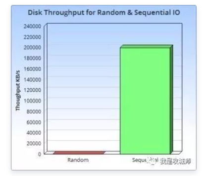

## ES

参考：（好文）https://crossoverjie.top/2020/08/24/elasticsearch/ElasticSearch%20VS%20MySQL/

## todo： 字典树 	 Trie树 

## Elasticsearch 与传统数据库界限

参考：https://cloud.tencent.com/developer/article/1554951

一个是数据库，一个是搜索引擎。

1、使命

**Elasticsearch** 是一个分布式的开源搜索和分析引擎，适用于所有类型的数据，包括**文本、数字、地理空间、结构化和非结构化数据**。在 Apache Lucene 的基础上开发而成，以其简单的 REST 风格 API、速度和可扩展性而闻名，是 Elastic Stack 的核心组件；

Elastic Stack 是适用于**数据采集、充实、存储、分析和可视化**的工具。人们通常将 Elastic Stack 称为 **ELK** Stack（代指 **Elasticsearch、Logstash 和 Kibana**）。	

- 关系数据库可以存储数据并为其建立索引。
- 搜索引擎可以索引数据，但也可以存储数据。

2、场景

Elasticsearch不能当做纯数据库来使用。

- 原因 1：不支持事务，
- 原因 2：近实时而非准实时，由 refresh_interval 控制，最快 1s 数据写入后可检索。

举例：

- 海量日志分析和检索、
- 海量大文本的全文检索等。

3、存储类型不同

关系型数据库一般只支持存储结构化数据（pgsql 支持 json）。

**结构化数据的特点**：

- 由二维表结构来逻辑表达和实现的数据
- 严格地遵循数据格式与长度规范。

举例：银行交易数据、个人信息数据等。

而 Elasticsearch 支持关系型和非结构化数据，如：json 由 object 或者 nested 类型或者父子 Join 存储。

**非结构化数据的特点**：

- 数据结构不规则或不完整；
- 没有预定义的数据模型，不方便用数据库二维逻辑表来表现的数据。

举例：包括所有格式的办公文档、文本、图片、XML, HTML、各类报表、图像和音频/视频信息等等。

脑海中想一下：是不是实战中遇到：数据结构不定、字段个数不定、字段类型不定、是否动态添加不定等多变的业务场景？

**4,可扩展性不同**

关系型数据库通病， 如：mysql 单表支持数据量有限，数据量大了就得**分库分表**，再大了考虑**分布式**，原生分布式的瓶颈如下：

- 分库分表非常麻烦，
- 业务依赖性高，
- 复杂查询会出现错误，
- 更重要的是分布式事务无法有效处理。

催生了很多第三方 NewSql 公司如：TIDB（开源+解决方案付费）。

而 Elasticsearh 支持横向扩展，天生支持多节点集群部署，扩展能力强，甚至支持跨集群检索；能支持 PB+的数据。

国内的：滴滴、携程、顺丰、今日头条、bat 等很多核心数据业务都已经通过 Elasticsearch 实现。

**5,解决问题不同**

关系型数据库针对核心：增删改查的业务场景，对于全文检索会慢的要死（很多客户迁移 Elasticsearch 就是这个原因，早期用 lucene 后用 solr，但发现 Elasticsearch 更好用）；而 Elasticsearch 的倒排索引机制更适合全文检索。

实际业务中：

- 如果数据量不大，建议使用简单的关系数据库结合简单的 SQL 查询就能解决问题。
- 如果您对性能没有问题，请保持架构简单并使用单个数据库存储，必要时加些缓存（如 redis）。
- 如果您在搜索中遇到性能问题，则可以将关系型数据库和 Elasticsearch 结合使用。

**6,数据模型不同**

关系型数据库通常针对复杂业务会多表设计、不同表不同模型，多表通过 join 关联或者视图查询。

而 Elasticsearch 支持复杂业务数据，通常不建议多表关联，确切说 Elasticsearch 倒排索引机制决定了它天然不适合多表关联。复杂业务数据通常解决方案：

- 1, 宽表（空间换时间）；
- 2, nested
- 3, 父子关联 join（针对频繁更新场景）。

对于聚合业务场景，的确大数据量（千万级以上）多重嵌套全量聚合 es 会很慢，业务选型可以考虑其他辅助方案。

**7、底层逻辑不同**

传统数据库的存储引擎为 B+树，包括 ES 的很多 NOSQL 数据库使用的 **LSM Tree**，对**写操作支持更高效。**

为什么 Elasticsearch/Lucene 检索可以比 mysql 快？

Mysq 的**分词词典**（term dictionary）是**以 b-tree 排序的方式存储在磁盘上的**。检索一个 term 需要若干次的**随机访问**磁盘操作。

而 **Lucene** 在**分词词典**的基础上添加了 **term** **index**（以 **FST**（finite state transducers）**形式保存**，非常**节省内存**）来加速检索，**term index 以树的形式缓存在内存中**。

**从 term index 查到对应的 term dictionary 的 block 位置之后，再去磁盘上找 term，大大减少了磁盘的随机访问次数。**

## LSM-Tree 

参考：(好文)https://cloud.tencent.com/developer/article/1441835

LSM-Tree全称是（Log Structured Merge Tree），**日志结构化组织合并树**，是一种分层，有序，面向磁盘的数据结构，其核心思想是充分了利用了，磁盘批量的顺序写要远比随机写性能高出很多。

**来由**

 十多年前，谷歌发布了大名鼎鼎的"三驾马车"的论文，分别是GFS(2003年)，MapReduce（2004年），BigTable（2006年），为开源界在大数据领域带来了无数的灵感，其中在 “BigTable” 的论文中很多很酷的方面之一就是它所使用的文件组织方式，这个方法更一般的名字叫 Log Structured-Merge Tree。在面对亿级别之上的海量数据的存储和检索的场景下，我们选择的数据库通常都是各种强力的NoSQL，比如Hbase，Cassandra，Leveldb，RocksDB等等，这其中前两者是Apache下面的顶级开源项目数据库，后两者分别是Google和Facebook开源的数据库存储引擎。而这些强大的NoSQL数据库都有一个共性，就是其底层使用的数据结构，都是仿照“BigTable”中的文件组织方式来实现的，也就是我们今天要介绍的LSM-Tree。 

## todo：

https://blog.csdn.net/qq_34820803/article/details/104798716

- 为什么ES的搜索功能是 **近实时** 的？
- 为什么ES对文档的 CRUD (创建-读取-更新-删除) 操作是 **实时** 的?