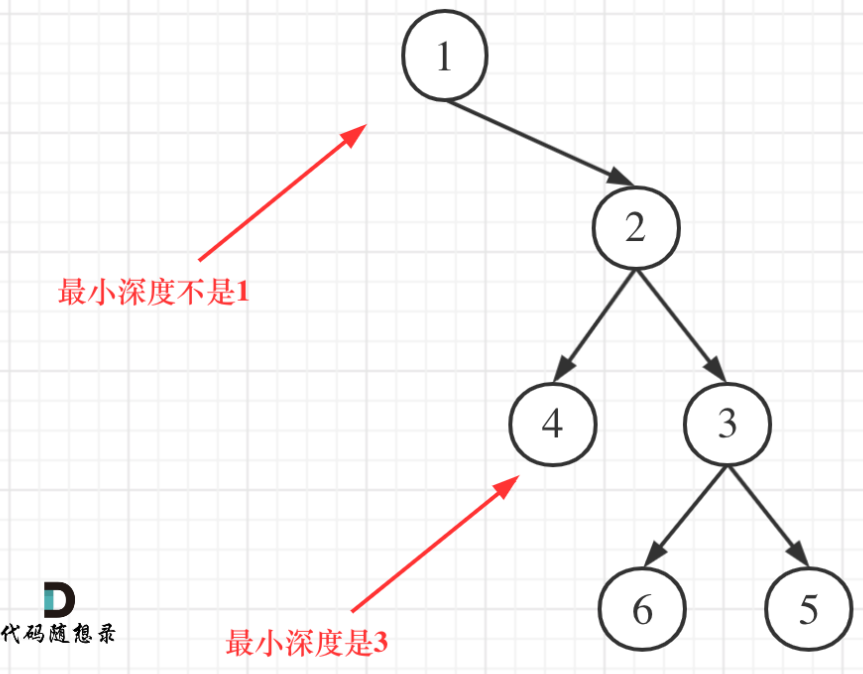
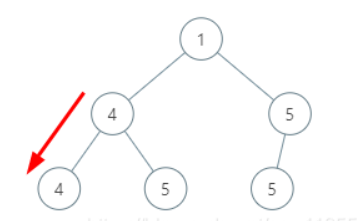
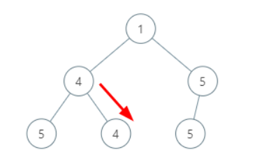
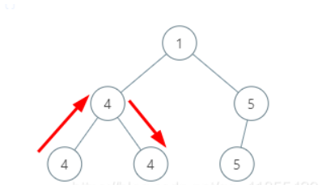
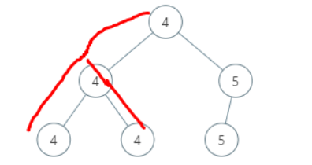

## Leetcode 题解 - 树 - 入门

<!-- GFM-TOC -->

* [Leetcode 题解 - 树](#leetcode-题解---树)
  * [递归](#递归)
    * [1. 树的高度](#1-树的高度)
    * [2. 平衡树](#2-平衡树)
    * [3. 两节点的最长路径](#3-两节点的最长路径)
    * [4. 翻转树](#4-翻转树)
    * [5. 归并两棵树](#5-归并两棵树)
    * [6. 判断路径和是否等于一个数](#6-判断路径和是否等于一个数)
    * [7. 统计路径和等于一个数的路径数量](#7-统计路径和等于一个数的路径数量)
    * [8. 子树](#8-子树)
    * [9. 树的对称](#9-树的对称)
    * [10. 最小路径](#10-最小路径)
    * [11. 统计左叶子节点的和](#11-统计左叶子节点的和)
    * [12. 相同节点值的最大路径长度](#12-相同节点值的最大路径长度)
    * [13. 间隔遍历](#13-间隔遍历)
    * [14. 找出二叉树中第二小的节点](#14-找出二叉树中第二小的节点)
  * [层次遍历](#层次遍历)
    * [1. 一棵树每层节点的平均数](#1-一棵树每层节点的平均数)
    * [2. 得到左下角的节点](#2-得到左下角的节点)
  * [前中后序遍历](#前中后序遍历)
    * [1. 非递归实现二叉树的前序遍历](#1-非递归实现二叉树的前序遍历)
    * [2. 非递归实现二叉树的后序遍历](#2-非递归实现二叉树的后序遍历)
    * [3. 非递归实现二叉树的中序遍历](#3-非递归实现二叉树的中序遍历)

## 递归

树是一种递归结构。一棵树要么是空树，要么有两个指针，每个指针指向一棵树。

### 1. 树的高度

简单： [104. 二叉树的最大深度](https://leetcode-cn.com/problems/maximum-depth-of-binary-tree/)

树的深度，节点的高度的区别：树的深度特指根节点，节点的高度泛指任意节点到叶子节点的最长路径边的条数。 

```java
public int maxDepth(TreeNode root) {	//DFS
    if (root == null) return 0;
    return Math.max(maxDepth(root.left), maxDepth(root.right)) + 1;
}
```

```c
int maxDepth(TreeNode* root) {			//后序
    if (root == nullptr) return 0;
    return max(maxDepth(root->left), maxDepth(root->right)) + 1;  //c++访问树的节点用->
}
```

```c
int ret;						 //先序
void getDepth(TreeNode* node, int dep) {
    ret = dep > ret ? dep : ret; // 根
    if (node->left == NULL && node->right == NULL) return ;
    if (node->left) {			 // 左
        dep++;    
        getDepth(node->left, dep);
        dep--;   				 // 回溯，深度-1
    }
    if (node->right) { 			 // 右
        dep++;    
        getDepth(node->right, dep);
        dep--;   				 // 回溯，深度-1
    }
    return;
}
int maxDepth(TreeNode* root) {
    ret = 0;
    if (root==0) return ret;	 //判空 !null也可以、root==0也可以、root==NULL也可以，处理[]
    getDepth(root, 1);
    return ret;
}
```

```java
public int maxDepth(TreeNode root) {	//BFS，1ms，16%
    if (root == null) return 0;
    LinkedList<TreeNode> q = new LinkedList<>();
    q.add(root);
    int dep = 0;
    while (!q.isEmpty()) {
        dep++;
        for (int i = q.size(); i > 0; i--) {
            TreeNode node = q.poll();
            if (node.left != null) q.add(node.left);
            if (node.right != null) q.add(node.right);
        }
    }
    return dep;
}
```

### 2. 平衡树

简单：[110. 平衡二叉树](https://leetcode-cn.com/problems/balanced-binary-tree/)

```js
    3		平衡树左右子树高度差都小于等于 1
   / \
  9  20
    /  \
   15   7
```

```java
private boolean b = true;					//初始为true
public boolean isBalanced(TreeNode root) {
    maxDepth(root);
    return b;
}
public int maxDepth(TreeNode root) {
    if (root == null) return 0;
    int l = maxDepth(root.left);
    int r = maxDepth(root.right);
    if (Math.abs(l - r) > 1) b = false;		//额外判断下，差值是否大于1
    return 1 + Math.max(l, r);
}
```

```c
bool b = true;
bool isBalanced(TreeNode* root) {			//TreeNode*root 中间没空格也行
    balance(root);
    return b; 
}
int balance(TreeNode* root) {
    if (!root) return 0;					//!null 在c++ 就是true
    int l = balance(root->left);			//箭头前后有空格也可以
    int r = balance(root->right);
    if (abs(l - r) > 1) b = false;
    return max(l, r) + 1;
}
```

### 3. 判断两树是否相同

简单：[100. 相同的树](https://leetcode-cn.com/problems/same-tree/)

```java
public boolean ifSame(TreeNode p, TreeNode q) {
    if (p == null && q == null) return true;
    if (p == null || q == null) return false;
    if (p.val != q.val) return false;
    return ifSame(p.left, q.left) && ifSame(p.right, q.right);
}
```

```c
if (!p && !q) return true;		//c++
return p && q && p->val == q->val && (isSameTree(p->left, q->left)) 
   								  && (isSameTree(p->right, q->right));
```

```java
public boolean isSameTree(TreeNode p, TreeNode q) {		//BFS，0、100%
    if (p == null && q == null) return true;
    if (p == null || q == null) return false;
    LinkedList<TreeNode> ql = new LinkedList<>();
    LinkedList<TreeNode> qr = new LinkedList<>();
    ql.offer(p);
    qr.offer(q);
    while (!ql.isEmpty() && !qr.isEmpty()) {
        TreeNode l = ql.poll();
        TreeNode r = qr.poll();
        if (l.val != r.val) return false;
        if ((l.left != null) ^ (r.left != null)) return false;	//必须有
        if ((l.right != null) ^ (r.right != null)) return false;
        
        if (l.left != null) ql.offer(l.left);					//加节点
        if (l.right != null) ql.offer(l.right);
        
        if (r.left != null) qr.offer(r.left);
        if (r.right != null) qr.offer(r.right);
    }
    return ql.isEmpty() && qr.isEmpty();
}
```

```
为什么必须有的case。	输入：[1,2]、[1,null,2]		输出：true		预期结果：false
```

```c
bool isSameTree(TreeNode* p, TreeNode* q) {
    if (p == nullptr && q == nullptr) return true;		//树节点判空用 p == nullptr也可以
    if (p == nullptr || q == nullptr) return false;
    queue <TreeNode*> ql, qr;							//queue <TreeNode*>有空格也可以
    ql.push(p); qr.push(q);
    while (!ql.empty() && !qr.empty()) {
        auto l = ql.front(); ql.pop();					//得先用ql.front();把值取出来再pop()
        auto r = qr.front(); qr.pop();
        if (l->val != r->val) return false;
        auto l1 = l->left, r1 = l->right, l2 = r->left, r2 = r->right;	//取出4个孩子
        if ((l1 == nullptr) ^ (l2 == nullptr)) return false;	//一空一不空 ^ 相异为true
        if ((r1 == nullptr) ^ (r2 == nullptr)) return false;
        if (l1 != nullptr) ql.push(l1);
        if (r1 != nullptr) ql.push(r1);
        if (l2 != nullptr) qr.push(l2);
        if (r2 != nullptr) qr.push(r2);
    }
    return ql.empty() && qr.empty();
}
```

### 4. 两节点间最长路径

简单：[543. 二叉树的直径](https://leetcode-cn.com/problems/diameter-of-binary-tree/)

二叉树的**直径长度**是任意两个结点路径长度中的最大值。这条路径可能穿过也可能不穿过根结点。

```js
          1		返回 3, 它的长度是路径 [4,2,1,3] 或者 [5,2,1,3]。
         / \
        2   3
       / \     
      4   5    
```

```java
private int max = 0;
public int diameterOfBinaryTree(TreeNode root) {
    dep(root);
    return max;
}
private int dep(TreeNode root) {
    if (root == null) return 0;
    int l = dep(root.left);
    int r = dep(root.right);
    max = Math.max(max, l + r);
    return Math.max(l, r) + 1;
}
```

### 5. 翻转二叉树

简单： [226. 翻转二叉树](https://leetcode-cn.com/problems/invert-binary-tree/)

```java
public TreeNode invertTree(TreeNode root) {
    if (root == null) return null;	 //缓存交换
    TreeNode left = root.left; 		 //后面的操作会改变 left 指针，因此先保存下来
    root.left = invertTree(root.right);
    root.right = invertTree(left);
    return root;
}
```

```java
public TreeNode invertTree(TreeNode root) {
    if (root == null) return null;
    swap(root);						//先序交换
    invertTree(root.left);
    invertTree(root.right);
    return root;
}
private void swap(TreeNode root) {
    TreeNode t = root.left;
    root.left = root.right;
    root.right = t;
}
```

```c
TreeNode* invertTree(TreeNode* root) {				//后序
    if (root == nullptr) return nullptr;			//空节点就是nullptr		
    TreeNode* left = invertTree(root->left);
    TreeNode* right = invertTree(root->right);
    root->left = right;
    root->right = left;
    return root;
}
```

### 6. 合并两棵树

简单： [617. 合并二叉树](https://leetcode-cn.com/problems/merge-two-binary-trees/)

```js
Input:											Output:
       Tree 1                     Tree 2			
          1                         2					 3
         / \                       / \					/ \
        3   2                     1   3				   4   5
       /                           \   \			  / \   \
      5                             4   7			 5   4   7
```

```java
public TreeNode mergeTrees(TreeNode t1, TreeNode t2) {
    if (t1 == null && t2 == null) return null;			//不写能跑通
    if (t1 == null) return t2;
    if (t2 == null) return t1;
    TreeNode root = new TreeNode(t1.val + t2.val);		//递归构造树
    root.left = mergeTrees(t1.left, t2.left);
    root.right = mergeTrees(t1.right, t2.right);
    return root;
}
```

```c
TreeNode* mergeTrees(TreeNode* t1, TreeNode* t2) {
    if (t1 == nullptr) return t2;
    if (t2 == nullptr) return t1;
    TreeNode* node = new TreeNode(t1->val + t2->val);	//auto node 也可以
    node->left = mergeTrees(t1->left, t2->left);
    node->right = mergeTrees(t1->right, t2->right);
    return node;
}
```

BFS 图解： [动画演示 递归+迭代 617.合并二叉树 - 合并二叉树 - 力扣（LeetCode） (leetcode-cn.com)](https://leetcode-cn.com/problems/merge-two-binary-trees/solution/dong-hua-yan-shi-di-gui-die-dai-617he-bing-er-cha-/) 

  

```java
//时间：O(min(m,n))，只有当节点都不为空时才会合并，因此被访问到的节点数不会超过较小的二叉树的节点数。
public TreeNode mergeTrees(TreeNode t1, TreeNode t2) {
    if(t1==null || t2==null) return t1==null? t2 : t1;
    LinkedList<TreeNode> q = new LinkedList<>();
    q.add(t1);	q.add(t2);				
    while(!q.isEmpty()) {
        TreeNode r1 = q.remove();
        TreeNode r2 = q.remove();
        r1.val += r2.val;							//思路是把树合并到t1上
        //如果r1和r2的左子树都不为空，就放到队列中
        //如果r1的左子树为空，就把r2的左子树挂到r1的左子树上
        if(r1.left!=null && r2.left!=null){			//和递归思路类似
            q.add(r1.left);  q.add(r2.left);
        }
        else if(r1.left==null) r1.left = r2.left;
        if(r1.right!=null && r2.right!=null) {      //对于右子树也是一样的
            q.add(r1.right); q.add(r2.right);
        }
        else if(r1.right==null) r1.right = r2.right;
    }
    return t1;
}
```

### 7. 判断是否存在路径和等于一个数

简单： [112. 路径总和](https://leetcode-cn.com/problems/path-sum/)

```js
输入：sum = 22			输出：true 解释：5->4->11->2 ，sum：22	//这个路径是根节点到叶子节点。
              5		  路径和定义为从 root 到 leaf 的所有节点的和。
             / \
            4   8
           /   / \
          11  13  4
         /  \      \
        7    2      1
```

```java
public boolean hasPathSum(TreeNode root, int sum) {	//展开版本
    if (root == null) return false;
    if (root.left == null && root.right == null 	//到底了
        && root.val == sum) return true;			//和diff一样了
    
    int diff = sum - root.val; //Difference 差值。 remainder 剩余，余数。
    
    boolean l = hasPathSum(root.left, diff);
    boolean r = hasPathSum(root.right,diff);
    return l || r;									//其中一个true就可以
}
```

```java
public boolean hasPathSum(TreeNode root, int sum) { //浓缩后
    if (root == null) return false;
    if (root.left == null && root.right == null && root.val == sum) return true;
    return hasPathSum(root.left, sum - root.val) || 
           hasPathSum(root.right, sum - root.val);
}
```

剑指 34. 二叉树中和为某一值的路径 

类似题目：和标号7的 简单： [112. 路径总和](https://leetcode-cn.com/problems/path-sum/)是类似题目，拓展是输出所有符合的结果内容。

```java
      5			目标和 sum = 22，
     / \		返回:[	[5，4，11，2]，[5，8，4，5]	]
    4   8	
   /   / \
  11  13  4
 /  \    / \
7    2  5   1
```

```java
LinkedList<List<Integer>> res = new LinkedList<>();
LinkedList<Integer> path = new LinkedList<>(); 			//存储每个合适的子结果

public List<List<Integer>> pathSum(TreeNode root, int sum) {
    recur(root, sum);
    return res;
}
void recur(TreeNode root, int tar) {
    if(root == null) return;
    path.add(root.val);
    tar -= root.val;
    if(tar == 0 && root.left == null && root.right == null) 
        res.add(new LinkedList(path));
    recur(root.left, tar);
    recur(root.right, tar);
    path.removeLast();				//回溯 必须做。
}
```

```c
vector<vector<int>> rets;
vector<int> ret;
vector<vector<int>> pathSum(TreeNode* root, int tar) {
    dfs(root, tar);
    return rets;
}
void dfs(TreeNode* root, int tar){
    if(!root) return;
    ret.push_back(root->val);			//vector尾部的栈函数，push_back()、pop_back()
    tar -= root->val;
    if(!root->left && !root->right && !tar) rets.push_back(ret); //tar==0 等价于!tar
    dfs(root->left, tar);				//不同于Java，这里直接添加就可以			
    dfs(root->right, tar);
    ret.pop_back();						//恢复现场
}
```

### 8. 路径和等于一个数的路径数量

简单： [437. 路径总和 III](https://leetcode-cn.com/problems/path-sum-iii/)

```html
      10		sum = 8
     /  \		返回： 3	 解释：
    5   -3		1.  5 -> 3
   / \    \		2.  5 -> 2 -> 1
  3   2   11	3. -3 -> 11
 / \   \
3  -2   1
```

本题可以用**前缀和**，路径不一定以 root 开头，不一定以 leaf 结尾，但是必须连续向下。这种需要三重递归。

```java
public int pathSum(TreeNode root, int sum) {	//31ms、45%
    if (root == null) return 0;
    int ret = dfs(root, sum);   		 //以父节点为起始
    int l = pathSum(root.left, sum);     //以左儿子为起始
    int r = pathSum(root.right, sum);    //以右儿子为起始
    return ret + l + r;     			 //结果是三个起点的和
}
int dfs(TreeNode root, int sum) {
    if (root == null) return 0;
    int cnt = root.val == sum ? 1 : 0;
    int diff = sum - root.val;
    return cnt + dfs(root.left, diff) + dfs(root.right, diff);
}
```

前缀和解法： [对前缀和解法的一点解释 - 路径总和 III - 力扣（LeetCode） (leetcode-cn.com)](https://leetcode-cn.com/problems/path-sum-iii/solution/dui-qian-zhui-he-jie-fa-de-yi-dian-jie-s-dey6/) 

**前缀和定义**：一个节点的前缀和就是该节点到根之间的路径和。 

          1			节点4的前缀和为：1 + 2 + 4 = 7	 					 1		
         /  \									                     / 
        2    3		节点8的前缀和：1 + 2 + 4 + 8 = 15 	  			   2    
       / \    \										              / 
      4   5    6	节点9的前缀和：1 + 2 + 5 + 9 = 17              3   
     / \   \											       / 
    7   8   9		假如题目给定数值为 5						    4  
节点1的前缀和为: 1 ，节点3的前缀和为: 1 + 2 + 3 = 6，prefix(3) - prefix(1) == 5，所以 节点1 到 节点3 之间有一条符合要求的路径( 2 --> 3 )

prefix(3) - prefix(1) == 5 转化为：ret += map.getOrDefault(curSum - tar, 0);

意思是，遍历到当前层我们判断有没有 prefix(3) - 5 等于 prefix(1) 的，prefix(1)在前面遍历的时，要加入map的

思路：遍历整颗树一次，**记录每个节点的前缀和**，查询该节点的祖先节点中符合条件的个数，将个数量加到最终结果上。

**HashMap存的是什么？**：HashMap的key是前缀和， value是该前缀和的节点数量，记录数量是因为有出现复数路径的可能。 比如说：下图树中，前缀和为1的节点有两个: 1, 0，所以路径和为2的路径数就有两条: 0 --> 2, 2


```js
      1
     / 
    0
   /
  2
```
**恢复状态的意义**：由于题目要求：路径方向必须是向下的（只能从父节点到子节点）当我们讨论两个节点的前缀和差值时，有一个前提：一个节点必须是另一个节点的祖先节点，换句话说，当我们把一个节点的前缀和信息更新到map里时，它应当只对其子节点们有效。举个例子，下图中有两个值为2的节点（A, B)。


```js
      0
     /  \
    A:2  B:2
   / \    \
  4   5    6
 / \   \
7   8   9
```
当我们遍历到最右方的节点6时，对于它来说，此时的前缀和为2的节点只该有B, 因为从A向下到不了节点6(A并不是节点6的祖先节点)。

如果我们不做状态恢复，当遍历右子树时，左子树中A的信息仍会保留在map中，那此时节点6就会认为A, B都是可追溯到的节点，从而产生错误。

状态恢复代码的作用就是： 在遍历完一个节点的所有子节点后，将其从map中除去。

```java
public int pathSum(TreeNode root, int sum) {		//3ms、99%
    Map<Integer, Integer> map = new HashMap<>();
    map.put(0, 1);			   	   // 前缀和为0的一条路径
    return dfs(root, map, sum, 0); // 前缀和的递归回溯思路
}

int dfs(TreeNode root,final Map<Integer, Integer> map,final int tar, int curSum) {
    if (root == null) return 0;
    int ret = 0;
    curSum += root.val; 		
    ret += map.getOrDefault(curSum - tar, 0);
    map.put(curSum, map.getOrDefault(curSum, 0) + 1);	
    int l = dfs(root.left, map, tar, curSum);			//也可以写成ret累加
    int r = dfs(root.right, map, tar, curSum);			
    ret = ret + l + r;
    map.put(curSum, map.get(curSum) - 1);
    return ret;
}
```

```js
      5			如果没有这个初始化，map.put(0, 1);	
	 /  \		输入：22	输出：1	预期：3
   	4    8
   /    / \
  11   13   4
 /  \	   / \
7    2    5   1
```

### 9. 子树

简单： [572. 另一个树的子树](https://leetcode-cn.com/problems/subtree-of-another-tree/)

```js
Given tree s:	 	 Given tree t:		Return true, 
     3				 	   4
    / \	                  / \
   4   5                 1   2
  / \			
 1   2

Given tree s:		Given tree t:		Return false. 
     3					 4
    / \					/ \
   4   5			   1   2
  / \
 1   2				#因为 null 也得匹配，准确来说，树t 的 1、2节点还有两个4个null值需要匹配！
    /
   0
```

```java
boolean isSubtree(TreeNode rootA, TreeNode rootB) {		//7ms、80%
    if (rootA == null || rootA == null) return false;
    return verify(rootA, rootB) || 
        isSubtree(rootA.left, rootB) || 
        isSubtree(rootA.right, rootB);
}
boolean verify(TreeNode A, TreeNode B) {
    if (A == null && B == null) return true;
    if (B == null || A == null || A.val != B.val) return false;
    return verify(A.left, B.left) && verify(A.right, B.right);
}
```

### 10. 对称二叉树的校验

简单：[101. 对称二叉树](https://leetcode-cn.com/problems/symmetric-tree/)

```js
    1
   / \
  2   2
 / \ / \
3  4 4  3
```

```java
public boolean isSymmetric(TreeNode root) {
    if (root == null) return true;
    return isSymmetric(root.left, root.right);
}
boolean isSymmetric(TreeNode t1, TreeNode t2) {
    if (t1 == null && t2 == null) return true;
    if (t1 == null || t2 == null) return false;
    if (t1.val != t2.val) return false;
    return isSymmetric(t1.left, t2.right) && isSymmetric(t1.right, t2.left);
}
```

### 11. 最小深度

简单：[111. 二叉树的最小深度](https://leetcode-cn.com/problems/minimum-depth-of-binary-tree/)

求根节点到叶子节点的最小路径长度，叶子节点的是左孩子和右孩子都为 null 时叫做叶子节点，一共3种情况。



```java
public int minDepth(TreeNode root) {	//BFS简单一点、1ms、99% 
    if (root == null) return 0;
    LinkedList<TreeNode> q = new LinkedList<>();
    q.add(root);
    int dep = 0;
    while(!q.isEmpty()) {
        dep++;
        for (int size = q.size(); size > 0; size--) {	//反序的目的，只执行一次sise()
            root = q.poll();
            if (root.right ==null && root.left == null) return dep;//最早的一定最小
            if (root.left != null) q.add(root.left);
            if (root.right != null) q.add(root.right);
        }
    }
    return dep;
}
```

```c
int minDepth(TreeNode* root) {	//BFS：c++
    if (!root) return 0;
    deque<TreeNode *> q;		//deque<TreeNode *>q; 也对
    q.push_back(root);			//函数push_back()、pop_front()、front()
    int dep = 0;
    while (!q.empty()) {
        dep++;
        int len = q.size();		//必须有先弄变量承接下，不能直接 i < q.size()
        for (int i = 0; i < len; i++) {
            TreeNode* node = q.front();
            q.pop_front();
            if (!node -> right && !node -> left) return dep;
            if (node -> right) q.push_back(node -> right);
            if (node -> left) q.push_back(node -> left);
        }
    }
    return dep;
}
```

```c
int minDepth(TreeNode *root) {				//BFS：c++ 268ms 98%
    if (root == nullptr) return 0;
    queue<pair<TreeNode* ,int> > q;			//这里的空格必须加，防止当>>处理
    q.emplace(root, 1);
    while (!q.empty()) {
        TreeNode* node = q.front().first;	//必须先front()取出来
        int dep = q.front().second;			//进的结构不一样这里必须是emplace()
        q.pop();							//进emplace() 出pop() 查front()
        if (node->left == nullptr && node->right == nullptr) return dep;
        if (node->left != nullptr)  q.emplace(node->left, dep + 1);
        if (node->right != nullptr) q.emplace(node->right, dep + 1);
    }
    return 0;
}
```

```java
public int minDepth(TreeNode root) {	//其他
    if (root == null) return 0;			//可以写上都两孩子都为null，返回1
    int left = minDepth(root.left);
    int right = minDepth(root.right);
    if (left == 0 || right == 0) return left + right + 1;//必然是有一个是0，可以找特殊情况
    //return root.left == null ||		 				 //这个写法也可以
    //   root.right == null ? l + r + 1 : Math.min(l,r) + 1;
    return Math.min(left, right) + 1;
}
```

```java
private int min=Integer.MAX_VALUE;				//Java：dfs
public int minDepth(TreeNode root) {			//自顶向下，添加了剪枝，2ms，74%
    if(root==null) return 0;
    helper(root,1);
    return min;
}
public void helper(TreeNode root,int level){	
    if(root==null||(root.left==null&&root.right==null))  min=Math.min(min,level);
    if(level<min){
        if(root.left!=null)		helper(root.left,level+1);
        if(root.right!=null)	helper(root.right,level+1);
    }
}
```

### 12. 统计左叶子节点的和

简单：[404. 左叶子之和](https://leetcode-cn.com/problems/sum-of-left-leaves/)

```html
    3			Return 24.		这个树的话只有两个左节点，算比较特殊的。
   / \
  9  20
    /  \
   15   7
```

```java
public int sumOfLeftLeaves(TreeNode root) {	 //官解评论
    if (root == null) return 0;
    int left = sumOfLeftLeaves(root.left);	 
    int right = sumOfLeftLeaves(root.right);
    //后序遍历：强行定义一种结构的情况进行计算
    int leftval = root.left != null 
       		   && root.left.left == null
        	   && root.left.right == null ? root.left.val : 0;
    return left + right + leftval;// 20那里返回15是0+0+15   3那里返回9和15是9+15+0    
}
```

````c
int sum=0;										//c++ 先序遍历
int sumOfLeftLeaves(TreeNode* root) {			//先序按照上边写的结构判断也可以
    if(root==nullptr) return 0;
    if(root->left!=nullptr 
    && root->left->left==nullptr 
    && root->left->right==nullptr)
        sum += root->left->val;
    sumOfLeftLeaves(root->left);
    sumOfLeftLeaves(root->right);
    return sum;
}
````

### 13. 最长同值路径长度

中等： [687. 最长同值路径](https://leetcode-cn.com/problems/longest-univalue-path/)

```js
路径被定义为一条从树中任意节点出发，达到任意节点的序列。该路径至少包含一个节点，且不一定经过根节点。
              5			输出：2		  	  1			 输出：2
             / \		解释：5、5、5	    / \		    解释：4、4、4
            4   5				          4   5
           / \   \					     / \   \
          1   1   5						4   4   5
```

 [687.java两种解法详解 - 最长同值路径 - 力扣（LeetCode） (leetcode-cn.com)](https://leetcode-cn.com/problems/longest-univalue-path/solution/687javaliang-chong-jie-fa-xiang-jie-by-ustcyyw/) 

- 计算经过每一个结点的同值路径长度，实际上就是将所有情况都考虑了一遍，然后在其中取最大值即为结果。
- 如何计算经过某个结点的同值路径长，定义辅助函数int height(TreeNode x, int val)
- 函数表示，**以结点x为根的树，从x出发，路径上结点值均为val的最长路径的结点数。**
  - 如果x == null，或者x.val != val，这样的路径不存在，直接返回0。
  - 否则：
    - 计算int leftH = height(x.left, val);，左子树路径上结点值均为val的最长路径的结点数；
    - 计算int rightH = height(x.right, val);右子树路径上结点值均为val的最长路径的结点数。
    - **经过x结点的同值路径长为leftH + rightH，更新所求结果res = Math.max(res, leftH + rightH);**
    - 然后依据函数定义，返回 Math.max(leftH, rightH) + 1;

**要对每一个结点都计算经过其的同值路径长**，所以再通过函数void traversal(TreeNode x)递归地进行遍历（**前中后序**）都可以。相当于三重递归。

```java
int ret = 0;					 //11ms,7%，好想一点
public int longestUnivaluePath(TreeNode x) {
    dfs(x);
    return ret;
}
void dfs(TreeNode x) {
    if (x == null) return;
    height(x, x.val);			 //三重递归
    dfs(x.left);
    dfs(x.right);
}
int height(TreeNode x, int val) {
    if (x == null) return 0;
    if (x.val != val) return 0;  			//不同值直接过滤掉
    int leftH = height(x.left, val);
    int rightH = height(x.right, val);
    ret = Math.max(ret, leftH + rightH);	//刷，经过x结点的同值路径长为leftH + rightH
    return Math.max(leftH, rightH) + 1;		//能经得过同值判断，就+1给上层提供新数据
}
```

```java
int ret;
public int longestUnivaluePath(TreeNode root) {
    ret = 0;			//3ms，88%
    arrowLength(root);	//官解的思路实际是，下边 /\ 和 / 或 \ 情况的合并。
    return ret;
}
public int arrowLength(TreeNode node) {
    if (node == null) return 0;
    int left = arrowLength(node.left);
    int right = arrowLength(node.right);
    int arrowLeft = 0, arrowRight = 0;
    if (node.left != null && node.left.val == node.val)   arrowLeft += left + 1;
    if (node.right != null && node.right.val == node.val) arrowRight += right + 1;
    ret = Math.max(ret, arrowLeft + arrowRight);
    return Math.max(arrowLeft, arrowRight);
}
```

情况分析：以root为路径起始点的最长路径只有两种情况

第一种是root和root-left，如图中以4为路径起始点->root.left 



 第二种是root和root-right，如图中以4为路径起始点->root.right 



还有一种特殊情况，就是root是路径的中间节点。 


下图这种情况最大只能算作2，因为路径只有一个起始一个末端。 



```java
int v = 0;	//3ms,88%
public int longestUnivaluePath(TreeNode root) {
    longestPath(root);
    return v;//v和lr是两种情况，两种情况并行处理，取最值。
}
public int longestPath(TreeNode root) {
    if (root == null) return 0;
    int lr = 0;						    //必须定义到里面，以root为起点的最长同值路径
    int left = longestPath(root.left);  //以root.left为起点的最长同值路径
    int right = longestPath(root.right);//以root.right为起点的最长同值路径
    if (root.left != null && root.left.val == root.val &&		//处理倒 V 即 /\ 的情况
        root.right != null && root.right.val == root.val) 
        v = Math.max(v, left + right + 2);
    //以root为路径起始点的 /或者\
    if (root.left != null && root.left.val == root.val)   lr = left + 1;
    if (root.right != null && root.right.val == root.val) lr = Math.max(lr, right + 1);
    v = Math.max(v, lr);		//从（ /\ ）和（ /或\ ）中选出最值
    return lr; 					//所以你能知道为什么返回这个值了吗？
}
```

### 14. 树形dp打家劫舍

中等： [337. 打家劫舍 III](https://leetcode-cn.com/problems/house-robber-iii/)

```html
     3			输出: 7 			    3			输出: 9
    / \			解释:3+3+1		   / \			解释:4+5为最大
   2   3						   4   5		
    \   \ 						  / \   \ 		 只能间隔着拿，求能拿到值和的最值。
     3   1						 1   3   1
```

思路参考： [Loading Question... - 力扣（LeetCode） (leetcode-cn.com)](https://leetcode-cn.com/problems/house-robber-iii/solution/san-chong-fang-fa-jie-jue-shu-xing-dong-tai-gui-hu/) 

**4 个孙子偷的钱 + 爷爷的钱 VS 两个儿子偷的钱 哪个组合钱多，就当做当前节点能偷的最大钱数。这就是动态规划里面的最优子结构** 

```java
public int rob(TreeNode root) { //版本一，超时
    if (root == null) return 0;
    int money = root.val;		//父节点的钱
    if (root.left != null)  	//左儿子的俩孙子
        money += (rob(root.left.left) + rob(root.left.right));
    if (root.right != null) 	//右儿子的俩孙子
        money += (rob(root.right.left) + rob(root.right.right));
    // 4个孙子偷的钱+爷爷的钱 VS 两个儿子偷的钱
    return Math.max(money, rob(root.left) + rob(root.right));
}
```

```java
public int rob(TreeNode root) {	//版本二：3ms、54%
    HashMap<TreeNode, Integer> map = new HashMap<>();
    return rob(root, map);		//Map存树节点和树节点钱的映射，记忆缓存优化子问题计算。
}
public int rob(TreeNode root, HashMap<TreeNode, Integer> map) {
    if (root == null) return 0;
    if (map.containsKey(root)) return map.get(root);
    int money = root.val;
    if (root.left != null) {
        money += (rob(root.left.left, map) + rob(root.left.right, map));
    }
    if (root.right != null) {
        money += (rob(root.right.left, map) + rob(root.right.right, map));
    }
    int ret = Math.max(money,rob(root.left, map) + rob(root.right, map));
    map.put(root, ret);
    return ret;
}
```

 [树形 dp 入门问题（理解「无后效性」和「后序遍历」） - 打家劫舍 III - 力扣（LeetCode） (leetcode-cn.com)](https://leetcode-cn.com/problems/house-robber-iii/solution/shu-xing-dp-ru-men-wen-ti-by-liweiwei1419/) 

根据当前结点偷或者不偷，就决定了需要从哪些**子结点**里的对应的状态转移过来。

- 如果当前结点不偷，**左右子结点偷或者不偷都行，选最大者；**
- 如果当前结点偷，**左右子结点均不能偷。**

用一个大小为 2 的数组来表示 int[] res = new int[2] **0 代表不偷，1 代表偷**

任何一个节点能偷到的最大钱的状态可以定义为

1、当前节点选择不偷：当前节点能偷到的最大钱数 = 左孩子能偷到的钱 + 右孩子能偷到的钱

2、当前节点选择偷：当前节点能偷到的最大钱数 = 左孩子选择自己不偷时能得到的钱 + 右孩子选择不偷时能得到的钱 + 当前节点的钱数

```java
public int rob(TreeNode root) {			//版本三、0ms，100%	（推荐）
    int[] ret = dfs(root);				//树的后序遍历
    return Math.max(ret[0], ret[1]);
}
int[] dfs(TreeNode root) {
    if (root == null) return new int[]{0, 0};
    int[] left = dfs(root.left);
    int[] right = dfs(root.right);

    //dp 以当前 node 为根结点的子树能够偷取的最大价值，分偷与不偷
    int[] dp = new int[2];//0 代表不偷，1 代表偷
    // dp[0]：规定 root 结点不偷，左右子结点偷或者不偷都行，选最大者
    dp[0] = Math.max(left[0], left[1]) + Math.max(right[0], right[1]);
    // dp[1]：规定 root 结点偷，左右子结点均不能偷
    dp[1] = root.val + left[0] + right[0];
    return dp;
}
```

可以看他的图解（未看）： [三种解法+多图演示 337. 打家劫舍 III - 打家劫舍 III ](https://leetcode-cn.com/problems/house-robber-iii/solution/san-chong-jie-fa-duo-tu-yan-shi-337-da-jia-jie-she/) 

### 15. 二叉树中第二小的节点

简单： [671. 二叉树中第二小的节点](https://leetcode-cn.com/problems/second-minimum-node-in-a-binary-tree/)

```html
每个节点的子节点数量只能为 2 或 0。如果一个节点有两个子节点的话，那么该节点的值等于两个子节点中较小的一个。
更正式地说，root.val = min(root.left.val, root.right.val) 总成立。输出所有节点中的第二小的值。
如果第二小的值不存在的话，输出 -1 。比如说一父两子全是2，返回-1，因为不存在倒数第二大。
   2		输出: 5
  / \		题目可以推断出，根节点最小，但是根节点的孩子节点不一定是第二小的。
 2   5
    / \
    5  7
```

一个节点要么具有 0 个或 2 个子节点，如果有子节点，那么根节点是最小的节点。可以考虑，优先级队列。

```java
int min = Integer.MAX_VALUE;	//我的思路，简单粗暴。0ms、100%
int ret = Integer.MAX_VALUE;
boolean b = true;
public int findSecondMinimumValue(TreeNode root) {
    find(root);					//校验树的节点值是不是全一样，全一样返回-1
    if (b) return -1;			
    find1(root);				//下边就是树节点不全相同的情况，找最小值		 
    find2(root);				//找次小值
    return ret;
}
public void find1(TreeNode root) {//三个方法实际可以合并	
    if (root == null) return;
    min = Math.min(min,root.val); //这玩意，先中后序都可以。
    find1(root.left);
    find1(root.right);
}
public void find2(TreeNode root) {
    if (root == null) return;
    if (root.val < ret && root.val != min) ret = root.val;	//刷新次小值
    find2(root.left);
    find2(root.right);
}
public void find(TreeNode root) {
    if (root == null) return;
    find(root.left);
    find(root.right);
    if (root.left != null && root.val != root.left.val 
     || root.right != null && root.val != root.right.val
        //下头这种情况可以省略掉
     || root.left != null && root.right != null && root.left.val != root.right.val) {	
        b = false;									//有不相同的节点就改为false
    }
}
```

```c
vector<int> v;
int findSecondMinimumValue(TreeNode* root) {
    traverse(root);  
    sort(v.begin(), v.end());						//C++ 取出树的值，并排序。
    for(auto e : v)
        if(e != root->val) return e;
    return -1;
}
void traverse(TreeNode* root){  					//什么顺序遍历都可以，把结点值放入数组
    if(root == NULL) return;
    traverse(root->left);
    v.push_back(root->val);
    traverse(root->right);
}
```

### 16. 最大路径和

困难：[124. 二叉树中的最大路径和](https://leetcode-cn.com/problems/binary-tree-maximum-path-sum/)，和标号11的[111. 二叉树的最小深度](https://leetcode-cn.com/problems/minimum-depth-of-binary-tree/)类似，本题参考： [C++递归总结与题解](https://leetcode-cn.com/problems/binary-tree-maximum-path-sum/solution/cchao-jian-dan-li-jie-miao-dong-by-fengz-8l3m/) 

```js
路径被定义为一条从树中任意节点出发，达到任意节点的序列。该路径至少包含一个节点，且不一定经过根节点。
             -10			输出：42		  	
             / \			解释：最优路径是 15 -> 20 -> 7 ，路径和为 15 + 20 + 7 = 42
            9  20				         
              /  \					 
             15   7				
```

```c
int maxPathSum(TreeNode* root) {
    int res = INT_MIN;
    dfs(root, res);
    return res;
}
int dfs(TreeNode* root, int &res) {					  //这里res定义成全局的有案例过不去
    if (!root) return 0;
    int l = dfs(root->left, res);
    int r = dfs(root->right, res);
    int sub = max(max(l, r) + root->val, root->val); //处理两边都小于0，直接取根
    res = max(res, max(root->val + l + r, sub));	 //ret = max（根+左，根+右，根，根+左+右）
    return sub;										 //取一边，或者根
}
```

```c
int mx = INT_MIN;						//int类型的最小值：INT_MIN
int maxPathSum(TreeNode* root) {		//mx可以换成方法内传递&mx 这里可以过去
    dfs(root);							//官解	（推荐）
    return mx;
}
int dfs(TreeNode* node) {
    if (node == nullptr) return 0;
    int l = max(dfs(node->left), 0);	//最大贡献值大于 0 时，才会选取对应子节点
    int r = max(dfs(node->right), 0);
    // 节点的最大路径和取决于该节点的值与该节点的左右子节点的最大贡献值,有0的存在
    mx = max(mx,node->val + l + r);
    return node->val + max(l, r);	    //向上只返回一边！
}
```

## 层次遍历

### 1. 树每层节点值的平均数

简单：[637. 二叉树的层平均值](https://leetcode-cn.com/problems/average-of-levels-in-binary-tree/)

```java
public List<Double> averageOfLevels(TreeNode root) {
    List<Double> ret = new ArrayList<>();
    if (root == null) return ret;
    Queue<TreeNode> queue = new LinkedList<>();
    queue.add(root);
    while (!queue.isEmpty()) {
        int cnt = queue.size();
        double sum = 0;
        for (int i = 0; i < cnt; i++) {
            TreeNode node = queue.poll();
            sum += node.val;
            if (node.left != null) queue.add(node.left);
            if (node.right != null) queue.add(node.right);
        }
        ret.add(sum / cnt);
    }
    return ret;
}
```

```c
vector<double> averageOfLevels(TreeNode* root) {
    vector<double> rets = vector<double>();			//这种定义方式
    auto q = queue<TreeNode*>();					//这种定义方式
    q.push(root);
    while (!q.empty()) {
        double sum = 0;
        int size = q.size();
        for (int i = 0; i < size; i++) {
            auto node = q.front();
            q.pop();
            sum += node->val;
            if (node->left != nullptr) q.push(node->left);
            if (node->right != nullptr) q.push(node->right);
        }
        rets.push_back(sum / size);
    }
    return rets;
}
```

### 2. 找树左下角的值

简单：[513. 找树左下角的值](https://leetcode-cn.com/problems/find-bottom-left-tree-value/)

```html
        1			Output:7
       / \
      2   3			思路：最后一层时的最左边的节点即为结果值
     /   / \
    4   5   6
       /
      7
```

```java
public int findBottomLeftValue(TreeNode root) {
    Queue<TreeNode> queue = new LinkedList<>();
    queue.add(root);
    while (!queue.isEmpty()) {
        root = queue.poll();		//先加右节点，再加左节点，最后poll出来的就是结果。
        if (root.right != null) queue.add(root.right);
        if (root.left != null) queue.add(root.left);
    }
    return root.val;
}
```

````c
int ret = 0;
int maxDep = -1; 					//初始化最大深度为-1
int findBottomLeftValue(TreeNode* root) {
    dfs(root, 0);
    return ret;
}
void dfs(TreeNode* root , int dep) {
    if (root == NULL) return;
    if (dep > maxDep) {				//不断刷新最大深度、结果值
        maxDep = dep;
        ret = root->val;
    }
    dfs(root->left, dep + 1);		//左下角就先遍历左边
    dfs(root->right, dep + 1);
}
````

## 前中后序遍历

```js
	1			
   / \			层次遍历顺序：[1 2 3 4 5 6]
  2   3			前序遍历顺序：[1 2 4 5 3 6]
 / \   \		中序遍历顺序：[4 2 5 1 3 6]
4   5   6		后序遍历顺序：[4 5 2 6 3 1]
```

```java
void dfs(TreeNode root) {//前序
    visit(root);
    dfs(root.left);
    dfs(root.right);
}
```

```java
void dfs(TreeNode root) {//中序
    dfs(root.left);
    visit(root);
    dfs(root.right);
}
```

```java
void dfs(TreeNode root) {//后序
    dfs(root.left);
    dfs(root.right);
    visit(root);
}
```

### 1. 非递归前序遍历

简单：[144. 二叉树的前序遍历](https://leetcode-cn.com/problems/binary-tree-preorder-traversal/)

```java
public List<Integer> preorderTraversal(TreeNode root) {
    List<Integer> ret = new ArrayList<>();		
    Stack<TreeNode> stack = new Stack<>();
    stack.push(root);					//也可以加上root为null时的判断
    while (!stack.isEmpty()) {
        TreeNode node = stack.pop();	//弹出值
        if (node == null) continue;
        ret.add(node.val);
        stack.push(node.right); 	    // 先右后左，保证左子树先弹出遍历
        stack.push(node.left);
    }
    return ret;
}
```

```c
vector<int> preorderTraversal(TreeNode* root) {
    vector<int> ret = vector<int>();	//c++版本
    stack<TreeNode*> stk = stack<TreeNode*>();
    stk.push(root);
    while(!stk.empty()){
        auto node = stk.top(); 			//栈stack是必须先top
        stk.pop();						//队列是front
        if(node == NULL) continue;
        ret.push_back(node->val);
        stk.push(node->right);			//先添加右，后添加左
        stk.push(node->left);
    }
    return ret;
}
```

### 2. 非递归后序遍历

简单：[145. 二叉树的后序遍历](https://leetcode-cn.com/problems/binary-tree-postorder-traversal/)

前序遍历为根左右，后序遍历为左右根，那么这个顺序就和后序遍历正好相反。

```java
public List<Integer> postorderTraversal(TreeNode root) {
    List<Integer> ret = new ArrayList<>();
    Stack<TreeNode> stack = new Stack<>();
    stack.push(root);
    while (!stack.isEmpty()) {
        TreeNode node = stack.pop();//弹出
        if (node == null) continue; //判断
        ret.add(node.val);			//添加
        stack.push(node.left);		//先添加左后添加右，保证右子树先遍历
        stack.push(node.right);
    }
    Collections.reverse(ret);		// 反转
    return ret;
}
```

```c
vector<int> postorderTraversal(TreeNode* root) {
    stack<TreeNode*> stk;
    vector<int> ret;
    if (root == NULL) return ret;	//这判断要写到后边
    stk.push(root);
    while (!stk.empty()) {
        TreeNode* node = stk.top();
        stk.pop();
        ret.push_back(node->val);
        if (node->left) stk.push(node->left); 
        if (node->right) stk.push(node->right); 
    }
    reverse(ret.begin(), ret.end());
    return ret;
}
```

### 3. 非递归中序遍历

简单：[94. 二叉树的中序遍历](https://leetcode-cn.com/problems/binary-tree-inorder-traversal/)

```java
public List<Integer> inorderTraversal(TreeNode root) {
    List<Integer> ret = new ArrayList<>();	//略微复杂点
    if (root == null) return ret;
    Stack<TreeNode> stack = new Stack<>();
    TreeNode cur = root;
    while (cur != null || !stack.isEmpty()) {
        while (cur != null) {				//先左到尽头
            stack.push(cur);				//先把左节点存起来，也只是存左方向的节点。
            cur = cur.left;		
        }
        TreeNode node = stack.pop();		//弹出左值
        ret.add(node.val);					//添加左值
        cur = node.right;					//转向右节点，右方向的节点全靠转向。
    }
    return ret;
}
```

