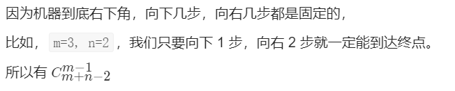
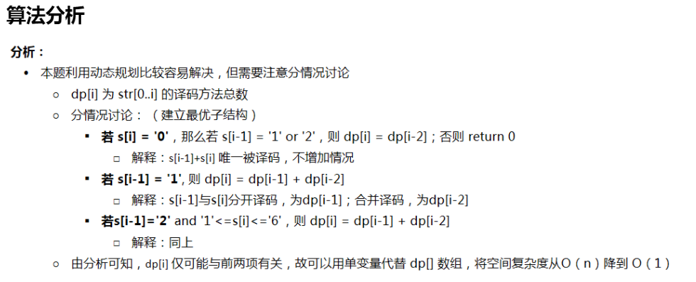

# Leetcode 题解 - 动态规划

<!-- GFM-TOC -->
* [Leetcode 题解 - 动态规划](#leetcode-题解---动态规划)
    * [斐波那契数列](#斐波那契数列)
        * [1. 爬楼梯](#1-爬楼梯)
        * [2. 强盗抢劫](#2-强盗抢劫)
        * [3. 强盗在环形街区抢劫](#3-强盗在环形街区抢劫)
        * [4. 信件错排](#4-信件错排)
        * [5. 母牛生产](#5-母牛生产)
    * [矩阵路径](#矩阵路径)
        * [1. 矩阵的最小路径和](#1-矩阵的最小路径和)
        * [2. 矩阵的总路径数](#2-矩阵的总路径数)
    * [数组区间](#数组区间)
        * [1. 数组区间和](#1-数组区间和)
        * [2. 数组中等差递增子区间的个数](#2-数组中等差递增子区间的个数)
    * [分割整数](#分割整数)
        * [1. 分割整数的最大乘积](#1-分割整数的最大乘积)
        * [2. 按平方数来分割整数](#2-按平方数来分割整数)
        * [3. 分割整数构成字母字符串](#3-分割整数构成字母字符串)


递归和动态规划都是将原问题拆成多个子问题然后求解，他们之间最本质的区别是，动态规划保存了子问题的解，避免重复计算。

## 斐波那契数列

### 1. 爬楼梯

简单：[70. 爬楼梯](https://leetcode-cn.com/problems/climbing-stairs/)

题目描述：有 N 阶楼梯，每次可以上一阶或者两阶，求有多少种上楼梯的方法。

```java
public int climbStairs(int n) {
    if (n <= 2) return n;
    int pre2 = 1, pre1 = 2;
    for (int i = 2; i < n; i++) {
        int cur = pre1 + pre2;
        pre2 = pre1;
        pre1 = cur;
    }
    return pre1;
}
```

### 2. 打家劫舍基础版

中等：[198. 打家劫舍](https://leetcode-cn.com/problems/house-robber/)

题目描述：抢劫一排住户，但是不能抢邻近的住户，求最大抢劫量。

```
方程：dp[i]=max(dp[i−2]+nums[i],dp[i−1])
```

```java
public int rob(int[] nums) {
    int pre2 = 0, pre1 = 0;
    for (int i = 0; i < nums.length; i++) {
        int cur = Math.max(pre2 + nums[i], pre1);
        pre2 = pre1;
        pre1 = cur;
    }
    return pre1;
}
```

### 3. 环形打家劫舍

中等： [213. 打家劫舍 II](https://leetcode-cn.com/problems/house-robber-ii/)

```js
输入：nums = [2,3,2]	输出：3	解释：数组是循环的，1和3是相邻的不能都偷
```

思路：先保证n - 2有意义，再处理环形。分别处理0到倒数第二个，1到倒数第一个就是最后一个。处理两次

```java
public int rob(int[] nums) {
    if (nums == null || nums.length == 0) return 0;
    int n = nums.length;
    if (n == 1)  return nums[0];
    return Math.max(rob(nums, 0, n - 2), rob(nums, 1, n - 1));
}

private int rob(int[] nums, int first, int last) {
    int pre2 = 0, pre1 = 0;
    for (int i = first; i <= last; i++) {//这里是等于，i <= last
        int cur = Math.max(pre1, pre2 + nums[i]);
        pre2 = pre1;
        pre1 = cur;
    }
    return pre1;
}
```

### 4. 信件错排

题目描述：有 N 个 信 和 信封，它们被打乱，求错误装信方式的数量。

定义一个数组 dp 存储错误方式数量，dp[i] 表示前 i 个信和信封的错误方式数量。

假设第 i 个信装到第 j 个信封里面，而第 j 个信装到第 k 个信封里面。根据 i 和 k 是否相等，有两种情况：

- i==k，交换 i 和 j 的信后，它们的信和信封在正确的位置，但是其余 i-2 封信有 dp[i-2] 种错误装信的方式。由于 j 有 i-1 种取值，因此共有 (i-1)\*dp[i-2] 种错误装信方式。
- i != k，交换 i 和 j 的信后，第 i 个信和信封在正确的位置，其余 i-1 封信有 dp[i-1] 种错误装信方式。由于 j 有 i-1 种取值，因此共有 (i-1)\*dp[i-1] 种错误装信方式。

综上所述，错误装信数量方式数量为：

<!--<div align="center"></div> <br>-->

<div align="center">  </div><br>
因此，D(n) = (n - 1) (D(n - 2) + D(n - 1))，特别地，有D(1) = 0, D(2) = 1。 

```
在组合数学中，排列是一组元素的排列，因此没有元素出现在其原始位置。
最初有一个数组，其中包含从1到n的n个整数，按升序排列，您需要找到它可以产生的排列数。
另外，由于答案可能非常大，因此您应该返回输出 mod 109 + 7。
例如，输入：[1,2,3]	输出：两个排列分别是[2,3,1]和[3,1,2]。
```

思路：力扣会员的题目，题解： [Leetcode 634. Find the Derangement of An Array](https://blog.csdn.net/qq_46105170/article/details/113707003) 

组合数学中的错排问题。当n个编号元素放在n个编号位置，元素编号与位置编号各不对应的方法数用D(n)表示。

那么D(n-1)就表示n-1个编号元素放在n-1个编号位置，各不对应的方法数，其它类推。推导方法如下：

1、把第n个元素放在某一个位置，比如位置k，那么一共有(n-1)中放法。

2、放编号为k的元素，此时有两种情况：

​	a）把k放到位置n，那么对于剩下的n-2个元素，就一共有D(n-2)种放法；

​	b）第k个元素不放在位置n，这时 k 连同其余的n-2个元素都各有一个位置不能放，所以有D(n-1)种放法。

因此，D(n) = (n - 1) (D(n - 2) + D(n - 1))，特别地，有D(1) = 0, D(2) = 1。于是，这道题目就变成了动态规划。

```java
public static void main(String[] args) {
    System.out.println(findDerangement(3));
}
public static int findDerangement(int n) {
    long pre2 = 0, pre1 = 1;
    long ret = (n == 1) ? 0 : 1;
    for (int i = 3; i <= n; ++i) {
        ret = ((i - 1) * (pre1 + pre2)) % 1000000007;
        pre2 = pre1;
        pre1 = ret;
    }
    return (int)ret;
}
```

### 5. 母牛生产

题目描述：假设农场中成熟的母牛每年都会生 1 头小母牛，并且永远不会死。

第一年有 1 只小母牛，从第二年开始，母牛开始生小母牛。

每只小母牛 3 年之后成熟又可以生小母牛。给定整数 N，求 N 年后牛的数量。

第 i 年成熟的牛的数量为：

<!--<div align="center"></div> <br>-->

<div align="center">  </div><br>
参考： [动态规划（斐波那契系列）---母牛生产_weixin_30832143的博客-CSDN博客](https://blog.csdn.net/weixin_30832143/article/details/96741056) 

```java
public  int cowNums(int n){
    int[] dp=new int [n+1];
    if(n==0) return 0;
    if(n==1) return 1;
    if(n==2) return 2;
    if(n==3) return 3;
    dp[0]=0;
    dp[1]=1;
    dp[2]=2;
    dp[3]=3;
    for(int i=4;i<=n;i++)
        dp[i]=dp[i-1]+dp[i-3];
    return dp[n];
}
```

变式题目参考：[母牛生小牛问题](https://www.cnblogs.com/AndyJee/p/4457411.html)

题目描述：一头刚出生的小母牛，4年后生一头小母牛，以后每年生一头，现有一头，问20年后共有多少头牛？

列举前n年的情况：1、1、1、2、3、4、6、8、11 .....

将规律抽象成公式：F(1)=1	F(2)=1	F(3)=1	**F(n)=F(n-1)+F(n-3)** 

F(n):表示第n年共有多少头牛

F(n-1):表示第n-1年共有多少头牛

F(n-3):表示第(n-3)年出生的母牛在第n年生的小母牛数

```java
int NumOfCow(int n){		// recursive method
    if(n<=3) return 1;
    return NumOfCow(n-1)+NumOfCow(n-3);
}

int NumOfCow2(int n){		// dynamic programming method
    int num[n+1];
    for(int i=1;i<=n;i++){
        if(i<=3) num[i]=1;
        else num[i]=num[i-1]+num[i-3];
    }
    return num[n];
}
```

题目变形：假设母牛只有十年寿命，那么**减去十年前出生的母牛数量即可**。 

题目变形参考： [LeetCode刷题之动态规划（一） (juejin.cn)](https://juejin.cn/post/6844904023196172295#heading-5) 

## 矩阵路径

### 1. 矩阵的最小路径和

中等：[64. 最小路径和](https://leetcode-cn.com/problems/minimum-path-sum/)


```js
题目描述：求从矩阵的左上角到右下角的最小路径和，每次只能 向右 和 向下 移动。
状态解释：dp[i][j]表示从grid[0][0]到grid[i - 1][j - 1]时的最大价值
```

```java
public int maxValue(int[][] grid) {							 //未空间优化
    int row = grid.length;	
    int column = grid[0].length;							 
    int[][] dp = new int[row + 1][column + 1];				 //多开一行数组简化代码
    for (int i = 1; i <= row; i++) 
        for (int j = 1; j <= column; j++) 
            dp[i][j] = Math.max(dp[i - 1][j], dp[i][j - 1]) + grid[i - 1][j - 1];
    return dp[row][column];
}
```

```java
public int minPathSum(int[][] grid) {
    if (grid.length == 0 || grid[0].length == 0) return 0;	 //空间优化到一维
    int m = grid.length, n = grid[0].length;
    int[] dp = new int[n];
    for (int i = 0; i < m; i++) {
        for (int j = 0; j < n; j++) {
            if (j == 0) dp[j] = dp[j];					 	 //只能从上侧走到该位置
            else if (i == 0) dp[j] = dp[j - 1];    			 //只能从左侧走到该位置
            else dp[j] = Math.min(dp[j - 1], dp[j]);		 //上测、左侧取最小
            dp[j] += grid[i][j];
        }
    }
    return dp[n - 1];
}
```

### 2. 矩阵的不同路径数

中等： [62. 不同路径](https://leetcode-cn.com/problems/unique-paths/)

题目描述：统计从矩阵左上角到右下角的路径总数，每次只能向右或者向下移动。


```
输入：m = 3, n = 7	输出：28	输入：m = 3, n = 2	输出：3	输入：m = 7, n = 3
```

题解参考： [Loading Question... - 力扣（LeetCode） (leetcode-cn.com)](https://leetcode-cn.com/problems/unique-paths/solution/dong-tai-gui-hua-by-powcai-2/) 

**排列组合思路**



可以直接用数学公式求解，这是一个组合问题。机器人总共移动的次数 S=m+n-2，向下移动的次数 D=m-1，那么问题可以看成从 S 中取出 D 个位置的组合数量，这个问题的解为 C(S, D)。

```java
public int uniquePaths(int m, int n) {
    int S = m + n - 2;  // 总共的移动次数
    int D = m - 1;      // 向下的移动次数
    long ret = 1;
    for (int i = 1; i <= D; i++) 
        ret = ret * (S - D + i) / i;
    return (int) ret;
}
```

动态规划实际和[杨辉三角形](https://www.mathsisfun.com/pascals-triangle.html)的求法一样，每个位置的路径 = 该位置左边的路径 + 该位置上边的路径。

状态定义：dp\[i][j]是到达i，j最多路径，**动态方程:dp\[i][j] = dp\[i-1][j] + dp\[i][j-1]**

初始化：对于第一行dp\[0][j]，或者第一列dp\[i][0]，由于都是在边界，所以只能为1

```java
public int uniquePaths(int m, int n) {
    int[][] dp = new int[m][n];
    for (int i = 0; i < n; i++) dp[0][i] = 1;
    for (int i = 0; i < m; i++) dp[i][0] = 1;
    for (int i = 1; i < m; i++) 
        for (int j = 1; j < n; j++) 
            dp[i][j] = dp[i - 1][j] + dp[i][j - 1];
    return dp[m - 1][n - 1];  
}
```

```java
public int uniquePaths(int m, int n) {		//空间优化到一维
    int[] dp = new int[n];					//和列大小一样
    Arrays.fill(dp, 1);
    for (int i = 1; i < m; i++) 
        for (int j = 1; j < n; j++) 
            dp[j] = dp[j] + dp[j - 1];		//dp[j]就代表上边
    return dp[n - 1];
}
```

## 数组区间

### 1. 数组的区间和

简单：[303. 区域和检索 - 数组不可变](https://leetcode-cn.com/problems/range-sum-query-immutable/)

```js
输入：["NumArray","sumRange","sumRange","sumRange"]  //NumArray和sumRange一个类的两个方法
[[[-2, 0, 3, -5, 2, -1]], [0, 2], [2, 5], [0, 5]]	输出：[null, 1, -1, -3]
解释：NumArray numArray = new NumArray([-2, 0, 3, -5, 2, -1]);
numArray.sumRange(0, 2); // return 1 ((-2) + 0 + 3)
numArray.sumRange(2, 5); // return -1 (3 + (-5) + 2 + (-1)) 
numArray.sumRange(0, 5); // return -3 ((-2) + 0 + 3 + (-5) + 2 + (-1))
```

将前缀和数组sums的长度设为n + 1的目的是为了方便计算sumRange(i,j),不需要对i = 0的情况特殊处理。

求区间 i \~ j 的和，可以转换为 sum[j + 1] - sum[i]，其中 **sum[i] 为 0 \~ i - 1 的和。**

此时有：sumRange(i,j)= sums[j + 1] - sums[i]

```java
class NumArray {
    int[] sums;
    
    public NumArray(int[] nums) {
        int n = nums.length;	// 	      原来nums = [1, 2, 3, 4,  5,  6]
        sums = new int[n + 1];	//构造sums[n+1]值为[0, 1, 3, 6, 10, 15,21]
        for (int i = 0; i < n; i++) {		    	
            //就等于前一个sums和当前的 nums相加。
            //sums[0]不要管,sum[i] 为 0 ~ i - 1 的和
            sums[i + 1] = sums[i] + nums[i];    	
        }
    }
    
    public int sumRange(int i, int j) {	//nums2~nums5 => 3+4+5+6
        return sums[j + 1] - sums[i];	//sums[6]-sums[2] 123456-12
    }
}
```

### 2. 等差子数组的个数

中等： [413. 等差数列划分](https://leetcode-cn.com/problems/arithmetic-slices/)

```js
返回数组中所有为等差数组的子数组个数。
输入：[1, 2, 3, 4]	  输出：3  解释： [1, 2, 3], [2, 3, 4]，[1, 2, 3, 4]。
输入：[1,2,3,8,9,10] 输出：2	解释：输入未必是等差数列	输入：[-1,-10]	输出：0   解释：至少3个元素
```

dp[i] 表示以 A[i] 为结尾的等差递增子区间的个数。当 A[i] - A[i-1] == A[i-1] - A[i-2]，那么 [A[i-2], A[i-1], A[i]] 构成一个等差递增子区间。而在以 A[i-1] 为结尾的递增子区间的后面再加上一个 A[i]，一样可以构成新的递增子区间。

```js
#dp[2] = 1
    [0, 1, 2]
#dp[3] = dp[2] + 1 = 2
    [0, 1, 2, 3], 	 // [0, 1, 2] 之后加一个 3
    [1, 2, 3]    	 // 新的递增子区间
#dp[4] = dp[3] + 1 = 3
    [0, 1, 2, 3, 4], // [0, 1, 2, 3] 之后加一个 4
    [1, 2, 3, 4],    // [1, 2, 3] 之后加一个 4
    [2, 3, 4]        // 新的递增子区间
```

综上，在 A[i] - A[i-1] == A[i-1] - A[i-2] 时，dp[i] = dp[i-1] + 1。

因为递增子区间不一定以最后一个元素为结尾，可以是任意一个元素结尾，因此需要返回 dp 数组累加的结果。

```java
public int numberOfArithmeticSlices(int[] A) {		//非滚动变量
    if (A == null || A.length == 0) return 0;
    int n = A.length;
    int[] dp = new int[n];
    for (int i = 2; i < n; i++)
        if (A[i] - A[i - 1] == A[i - 1] - A[i - 2])
            dp[i] = dp[i - 1] + 1;
    int total = 0;
    for (int cnt : dp) total += cnt;				//累加
    return total;
}
```

```java
public int numberOfArithmeticSlices(int[] A) {		//滚动变量
    if (A == null || A.length <= 2)	return 0;	
    int rets = 0;
    int ret = 0;
    for (int i = 2; i < A.length; i++)
        if (A[i - 1] - A[i] == A[i - 2] - A[i - 1])	//跨越3个数字校验。
            rets += ++ret;
    	else
       		ret = 0;				
    return rets;
}
```

## 分割整数

### 1. 分割整数的最大乘积

中等：[343. 整数拆分](https://leetcode-cn.com/problems/integer-break/)		题目和剑指的14题：剪绳子，两题一样

```js
拆分正整数，输出拆分后乘积的最大值。输入: 10	输出: 36	解释: 10 = 3 + 3 + 4, 3 × 3 × 4 = 36。
```

```java
public int integerBreak(int n) {				//数学规律解法
    if(n <= 3) return n - 1;
    int a = n / 3, b = n % 3;
    if(b == 0) return (int)Math.pow(3, a);
    if(b == 1) return (int)Math.pow(3, a - 1) * 4;
    return (int)Math.pow(3, a) * 2;
}
```

```java
public int integerBreak(int n) {				//其他dp解法
    int[] dp = new int[n + 1];
    dp[1] = 1;
    for (int i = 2; i <= n; i++) 
        for (int j = 1; j <= i - 1; j++) 
            dp[i] = Math.max(dp[i], Math.max(j * dp[i - j], j * (i - j)));
    return dp[n];
}
```

### 2. 组成整数的最少平方数数量

中等：[279. 完全平方数](https://leetcode-cn.com/problems/perfect-squares/)	 这道题在搜索篇也有出现，但是推荐用背包的解法。

```js
返回和为整数的完全平方数的最少数量。完全平方数：1、4、9、16...而 3 和 11 不是。
输入：12	输出：3 	解释：12 = 4 + 4 + 4	输入：13	输出：2	解释：13 = 4 + 9
```

背包问题题目转换：完全平方数就是物品，且可以无限使用，整数 n 就是背包，凑满这个背包最少要多少物品？

dp[i] 的意义：和为 i 的完全平方数的最少数量为 dp[i]。递推公式：dp[j] = min(dp[j - i * i] + 1, dp[j]) 

初始化：题目中 完全平方数  1, 4, 9, 16, ...  是大于1 的， dp[0]=0完全是为了递推公式，这里 0 * 0 不算是一种。

公式 dp[j] = min(dp[j - i * i] + 1, dp[j]) 的结果要选最小的，所以非0下标的dp[i]都要初始为最大值。

遍历顺序：如果求组合数是外层循环遍历物品，内层循环遍历背包。如果求排列数是外层循环遍历背包，内层循环遍历物品。本题外层遍历背包或者物品都是可以的。

```c
int numSquares(int n) {				 		//c++ 外物品，内背包(推荐)
    vector<int> dp(n + 1, INT_MAX);
    dp[0] = 0;	
    for (int i = 1; i * i <= n; i++)  		//遍历物品
        for (int j = 1; j <= n; j++)  		//遍历背包
            if (j - i * i >= 0) 
                dp[j] = min(dp[j - i * i] + 1, dp[j]);
    return dp[n];
}
```

```c
int numSquares(int n) {						//c++ 外背包，内物品
    vector<int> dp(n + 1, INT_MAX);
    dp[0] = 0;
    for (int i = 0; i <= n; i++)  			//遍历背包
        for (int j = 1; j * j <= i; j++)    //遍历物品
            dp[i] = min(dp[i - j * j] + 1, dp[i]);
    return dp[n];
}
```

数学方法：这道题如果知道数学定理之后，相当于告诉你：

- 任何正整数都可以拆分成不超过4个数的平方和 ---> 答案只可能是1,2,3,4

- 如果一个数最少可以拆成4个数的平方和，则这个数还满足 n = (4^a)*(8b+7) ---> 因此可以先看这个数是否满

  足上述公式，如果不满足，答案就是1,2,3了

- 如果这个数本来就是某个数的平方，那么答案就是1，否则答案就只剩2,3了

- 如果答案是2，即n=a^2+b^2，那么我们可以枚举a，来验证，如果验证通过则答案是2，否则只能是3

```java
public int numSquares(int n) {				//数学方法(不推荐)：四平方和三平方定理
    while (n % 4 == 0)  n /= 4;				//处理共计4种的情况。
    if (n % 8 == 7)return 4;
    if (this.isSquare(n)) return 1;			//处理共计1种的情况
    for (int i = 1; i * i <= n; ++i) 		//枚举，检查数字是否可以分解为两个平方的和。 
        if (this.isSquare(n - i * i))
            return 2;
    return 3;								//处理共计3种的情况，三平方和定理
}

protected boolean isSquare(int n) {			//处理共计2种情况的
    int sq = (int) Math.sqrt(n);
    return n == sq * sq;
}
```

### 3. 数字映射字母的解码方法

中等： [91. 解码方法](https://leetcode-cn.com/problems/decode-ways/)	  	和剑指的不一样

```js
字母映射关系'A' -> 1，'B' -> 2 ... 'Z' -> 26。例如，"111"，可以为"AAA"或者"KA"，而"06"不能映射为 "F" ，因为 "6" 和 "06" 不同。
输入：s = "226" 输出：3 解释："BZ" (2 26), "VF" (22 6), "BBF"(2 2 6)。
输入："1201234"、"226" 输出：3		输入："1123" 输出：5
```

```java
/**	(来自评论)
    上楼梯的复杂版？推荐
    如果连续的两位数符合条件，就相当于一个上楼梯的题目，可以有两种选法：
        1.一位数决定一个字母
        2.两位数决定一个字母
        就相当于dp(i) = dp[i-1] + dp[i-2];
    如果不符合条件，又有两种情况
        1.当前数字是0：
            不好意思，这阶楼梯不能单独走，
            dp[i] = dp[i-2]
        2.当前数字不是0
            不好意思，这阶楼梯太宽，走两步容易扯着步子，只能一个一个走
            dp[i] = dp[i-1];
*/
public int numDecodings(String s) {
    int len = s.length();
    if (len == 0) return 0;
    if (s.charAt(0) == '0') return 0;
    int[] dp = new int[len + 1];
    dp[0] = 1;
    for (int i = 0; i < len; i++) {
        dp[i + 1] = s.charAt(i) == '0' ? 0 : dp[i];	 //当前数是0
        if (i > 0 && (s.charAt(i - 1) == '1' ||      //连续两位数符合条件  //1开头
                      (s.charAt(i - 1) == '2' && s.charAt(i) <= '6')))  //2开头
            dp[i + 1] += dp[i - 1];
    }
    return dp[len];
}
```

```java
public int numDecodings(String s) {					//上边的滚动变量版本
    int len = s.length();
    if (len == 0) return 0;
    if (s.charAt(0) == '0') return 0;
    int pre = 1,cur=0,prepre=0;
    for (int i = 0; i < len; i++) {					//当前数是0
        cur = s.charAt(i) == '0' ? 0 : pre;			//累加pre是一定的
        if (i > 0 && (s.charAt(i - 1) == '1' ||		//连续两位数符合条件
                      (s.charAt(i - 1) == '2' && s.charAt(i) <= '6'))){
            cur += prepre;							//cur再累加prepre
        }
        prepre=pre;
        pre=cur;
    }
    return cur;
}
```

下边参考： [C++ 我认为很简单直观的解法 - 解码方法 - 力扣（LeetCode） (leetcode-cn.com)](https://leetcode-cn.com/problems/decode-ways/solution/c-wo-ren-wei-hen-jian-dan-zhi-guan-de-jie-fa-by-pr/) 



```java
//原作者
class Solution {
    int numDecodings(String s) {
        char[] cs = s.toCharArray();
        if (cs[0] == '0') return 0;
        int pre = 1, cur = 1;			//dp[-1] = dp[0] = 1
        for (int i = 1; i < cs.length; i++) {
            int tmp = cur;
            if (cs[i] == '0'){
                if (cs[i - 1] == '1' || cs[i - 1] == '2') cur = pre;
           		else return 0;
            }
            else if (cs[i - 1] == '1' || 
                    (cs[i - 1] == '2' && cs[i] >= '1' && cs[i] <= '6')){
                cur = cur + pre;
            }
            pre = tmp;
        }
        return cur;
    }
}
//没看
//边界处理复杂
class Solution {
    public int numDecodings(String s) {
        int n = s.length(); //记录s【i】之前的译码数量
        int[] dp = new int[n]; //不能译码的情况
        if (s.charAt(0) == '0') return 0;
        dp[0] = 1;
        for (int i = 1; i < n; i++) { //s[i-1]和s[i]被唯一译码的情况
            if (s.charAt(i) != '0') dp[i] += dp[i - 1];
            if (s.charAt(i - 1) == '1' || (s.charAt(i - 1) == '2' && s.charAt(i) <= '6')) 			  {
                if (i - 2 >= 0) dp[i] += dp[i - 2];
                else dp[i]++;
            }
        }
        return dp[n - 1];
    }
}
//没看
//空间复杂度为O（n）的代码，但感觉更清晰易懂些
class Solution {
     int numDecodings(String s) {
        char[] cs = s.toCharArray();
        if(cs[0]=='0') return 0;
        int[] dp =new int[cs.length+1];
        dp[0]=1;dp[1]=1;
        for (int i =1; i < cs.length; i++) {
            if (cs[i] == '0')//1.cs[i]为0的情况
                if (cs[i - 1] == '1' || cs[i - 1] == '2') //cs[i - 1]等于1或2的情况
                    dp[i+1] = dp[i-1];//由于s[1]指第二个下标，对应为dp[2],所以dp的下标要比s大1，故为dp[i+1]
                else
                    return 0;
            else //2.cs[i]不为0的情况
                if (cs[i - 1] == '1' || (cs[i - 1] == '2' && cs[i] <= '6'))//cs[i-1]cs[i]两位数要小于26的情况
                    dp[i+1] = dp[i]+dp[i-1];
                else//其他情况
                    dp[i+1] = dp[i];
        }
        return dp[cs.length];
    }
}
```

```java
//没看
class Solution {
    public int numDecodings(String s) {
        char[] chars = s.toCharArray();
        int len = chars.length;
        if (chars[0] == '0') return 0;
        int[] dp = new int[len+1];
        dp[0] = 1;
        dp[1] = 1;
        for (int i = 1; i < len; i++) {
            if (chars[i] != '0') {
                dp[i+1] = dp[i];
                int x = 10 * (chars[i-1] - '0') + (chars[i] - '0');
                if (x > 9 && x < 27) dp[i+1] = dp[i] + dp[i-1];
            } else {
                int x = 10 * (chars[i-1] - '0') + (chars[i] - '0');
                if (x > 26 || chars[i] == chars[i-1]) return 0;

                dp[i+1] = dp[i-1];
            }
        }
        return dp[len];
    }
}

```

```java
public int numDecodings(String s) {					//其他题解 
    if (s == null || s.length() == 0) return 0;
    int n = s.length();
    int[] dp = new int[n + 1];
    dp[0] = 1;
    dp[1] = s.charAt(0) == '0' ? 0 : 1; //"06"  dp[0]=1 dp[1]=0		"1" dp[0]=1 dp[1]=1
    for (int i = 2; i <= n; i++) {		//"12"  dp[0]=1 dp[1]=1
        int one = Integer.valueOf(s.substring(i - 1, i));//6	12->2获取字符串第二位。	
        if (one != 0)
            dp[i] += dp[i - 1];//dp[2]=dp[2]+dp[1]=0+0		dp[2]=dp[2]+dp[1]=0+1
        if (s.charAt(i - 2) == '0') //"06" 是true
            continue;
        int two = Integer.valueOf(s.substring(i - 2, i));//"12"
        if (two <= 26) 
            dp[i] += dp[i - 2];//dp[2]=dp[2]+dp[0]=1+1=2
    }
    return dp[n];//"1" 就直接返回dp[1]=1		12返回2
}
```
