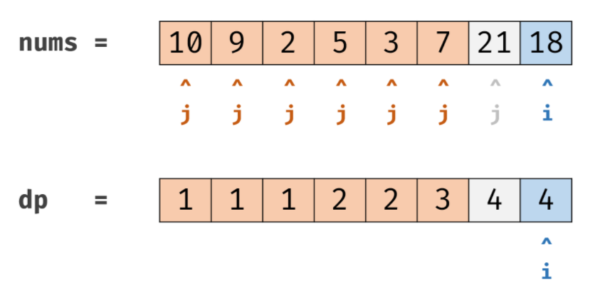
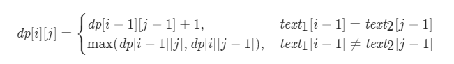

## Leetcode 题解 - 动态规划

* [最长递增子序列](#最长递增子序列)
  * [1. 最长递增子序列](#1-最长递增子序列)
  * [2. 一组整数对能够构成的最长链](#2-一组整数对能够构成的最长链)
  * [3. 最长摆动子序列](#3-最长摆动子序列)
* [最长公共子序列](#最长公共子序列)
  * [1. 最长公共子序列](#1-最长公共子序列)
    <!-- GFM-TOC -->

## 子序列

### 1. 最长递增子序列 - LIS

中等：[300. 最长递增子序列](https://leetcode-cn.com/problems/longest-increasing-subsequence/)

```js
输入：nums = [0,1,0,3,2,3]			输出：4	要求：时间复杂度O(nlog(n))
输入：nums = [10,9,2,5,3,7,101,18]	输出： 	解释：最长递增子序列是 [2,3,7,101]，长度为 4 。
```

1


2


3


4


5



- **转移方程：** `dp[i] = max(dp[i], dp[j] + 1) for j in [0, i)`。

```java
public int lengthOfLIS(int[] nums) {		//时间O(N*N) 空间O(N)， 73ms,62%
    if(nums.length == 0) return 0;
    int[] dp = new int[nums.length];
    int res = 0;
    Arrays.fill(dp, 1);						//[7,7,7,7]，至少为1
    for(int i = 0; i < nums.length; i++) {	//当前数字
        for(int j = 0; j < i; j++) {		//遍历当前数前面的，比当前数字小的有几个
            if(nums[j] < nums[i]) dp[i] = Math.max(dp[i], dp[j] + 1);
        }						    		//dp[j] + 1是在比自己小的那位的比自己小的个数+1
        res = Math.max(res, dp[i]);
    }
    return res;								//输入nums：[1,3,6,7,9,4,10,5,6]
}											//输出dp：  [1,2,3,4,5,3, 6,4,5]
```

```java
public int lengthOfLIS(int[] nums) {		//其他写法
    int n = nums.length;	
    int[] dp = new int[n];
    for (int i = 0; i < n; i++) {
        int max = 1;
        for (int j = 0; j < i; j++) {
            if (nums[i] > nums[j]) max = Math.max(max, dp[j] + 1);
        dp[i] = max;
    }
    return Arrays.stream(dp).max().orElse(0);
}
```

```java
int ret = 0;	//使用 Stream 求最大值会导致运行时间过长，可以改成以下形式：
for (int i = 0; i < n; i++)
    ret = Math.max(ret, dp[i]);
return ret;
```

以上解法的时间复杂度为 O(N<sup>2</sup>)，可以使用二分查找将时间复杂度降低为 O(NlogN)。

定义一个 tails 数组，其中 tails[i] 存储长度为 i + 1 的最长递增子序列的最后一个元素。对于一个元素 x，

- 如果它大于 tails 数组所有的值，那么把它添加到 tails 后面，表示最长递增子序列长度加 1；
- 如果 tails[i-1] \< x \<= tails[i]，那么更新 tails[i] = x。

例如对于数组 [4,3,6,5]，有：

```html
tails      len      num
[]         0        4
[4]        1        3
[3]        1        6
[3,6]      2        5
[3,5]      2        null
```

可以看出 tails 数组保持有序，因此在查找 S<sub>i</sub> 位于 tails 数组的位置时就可以使用二分查找。

```java
public int lengthOfLIS(int[] nums) {
    int n = nums.length;
    int[] tails = new int[n];
    int len = 0;
    for (int num : nums) {
        int index = binarySearch(tails, len, num);
        tails[index] = num;
        if (index == len) len++;
    }
    return len;
}

private int binarySearch(int[] tails, int len, int key) {
    int l = 0, h = len;
    while (l < h) {
        int mid = l + (h - l) / 2;
        if (key == tails[mid]) return mid;
        else if (key < tails[mid]) h = mid;			
        else l = mid + 1;
    }
    return l;
}
```

 [最长递增子序列_牛客题霸_牛客网 (nowcoder.com)](https://www.nowcoder.com/practice/9cf027bf54714ad889d4f30ff0ae5481?tpId=117&&tqId=35013&rp=1&ru=/activity/oj&qru=/ta/job-code-high/question-ranking) 

```
题目拓展：输入：[1,2,8,6,4]	输出：[1,2,4]	解释：有3个 1,2,8、 1,2,6、 1,2,4 其中第三个字典序最小
```

### 2. 最长上升数对链

中等：[646. 最长数对链](https://leetcode-cn.com/problems/maximum-length-of-pair-chain/)

```js
当且仅当 b < c 时，数对(c, d) 才可以跟在 (a, b) 后面。我们用这种形式来构造一个数对链。
输入：[[1,2], [2,3], [3,4]]	输出：2	解释：最长的数对链是 [1,2] -> [3,4]
```

 [聊聊最长上升子序列 - 最长数对链 ](https://leetcode-cn.com/problems/maximum-length-of-pair-chain/solution/chuan-shang-yi-fu-wo-jiu-bu-ren-shi-ni-liao-lai--2/) / 他的力扣题解仓库：https://github.com/azl397985856/leetcode

```java
public int findLongestChain(int[][] pairs) {		//排序解法 10ms，99%
    if (pairs.length == 1) return 1;
    Arrays.sort(pairs, (o1, o2) -> o1[1] - o2[1]);	//排序思路：对数对的第二位升序排序
    int tail = pairs[0][1];							//记录数对的第2位
    int ret = 1;
    for (int i = 1; i < pairs.length; i++) {
        if (pairs[i][0] > tail) {					//后续数对的第1位 > 前面数对的第2位
            tail = pairs[i][1];						//更新chainTail，也是pre
            ret++;
        }
    }
    return ret;
}
```

```java
public int findLongestChain(int[][] pairs) {
    if (pairs == null || pairs.length == 0) return 0;
    Arrays.sort(pairs, (a, b) -> (a[0] - b[0]));	//按照第一列排序(不推荐)	49ms、50%	
    int n = pairs.length;	
    int[] dp = new int[n];
    Arrays.fill(dp, 1);
    for (int i = 1; i < n; i++)
        for (int j = 0; j < i; j++) 
            if (pairs[j][1] < pairs[i][0]) 
                dp[i] = Math.max(dp[i], dp[j] + 1);
    return Arrays.stream(dp).max().orElse(0);
    //orElse(0)需要加，否则 OptionalInt cannot be converted to int
}
```

### 3. 最长摆动子序列

中等：[376. 摆动序列](https://leetcode-cn.com/problems/wiggle-subsequence/)

```js
如果连续数字之间的差严格地在正数和负数之间交替，则数字序列称为摆动序列。
第一个差（如果存在的话）可能是正数或负数。少于两个元素的序列也是摆动序列。
输入: [1,7,4,9,2,5]	输出: 6 
解释: 整个数组的相邻元素之间差值 (6,-3,5,-7,3) 是正负交替出现的，输出数组长度
输入: [1,17,5,10,13,15,10,5,16,8]	输出: 7
解释: 这个序列包含几个长度为 7 摆动序列，其中一个可为[1,17,10,13,10,16,8]。负正交替出现的。
输入: [1,2,3,4,5,6,7,8,9]、或者[0,1]、或者[1,2]	输出: 都返回2
输入: [0,0]	输出: 1	要求：O(n)时间复杂度
```

贪心： [376. 摆动序列:【贪心经典题目】详解 - 摆动序列 - 力扣（LeetCode） (leetcode-cn.com)](https://leetcode-cn.com/problems/wiggle-subsequence/solution/376-bai-dong-xu-lie-tan-xin-jing-dian-ti-vyxt/) 


```java
public int wiggleMaxLength (int[] nums) {	//0ms，100% 推荐
    if (nums.length <= 1) return nums.length;
    int curDiff = 0; 						// 当前一对差值
    int preDiff = 0; 						// 前一对差值
    int ret = 1;  							// 记录峰值个数，序列默认序列最右边有一个峰值
    for (int i = 1; i < nums.length; i++) {
        curDiff = nums[i] - nums[i - 1];
        if ((curDiff > 0 && preDiff <= 0) || (curDiff < 0 && preDiff >= 0)) {
            ret++;
            preDiff = curDiff;
        }
    }
    return ret;
}
```

```js
//[1,7,4,9,2,5] 都没有等号		//[1,7,4,9,2,5] 只有后边的的等号
//1							   //5
//6							   //6
```

### 4. 最长公共子序列 - LCS

中等：[1143. 最长公共子序列](https://leetcode-cn.com/problems/longest-common-subsequence/)		LCS 是典型的二维动态规划问题。 

```js
输入：text1 = "abcde", text2 = "ace" 	输出：3  解释：最长公共子序列是 "ace" ，它的长度为 3 。
```

方程：



图解：


```java
public int longestCommonSubsequence(String str1, String str2) {
    int n1 = str1.length(), n2 = str2.length();
    int[][] dp = new int[n1 + 1][n2 + 1];
    for (int i = 1; i <= n1; i++) 
        for (int j = 1; j <= n2; j++) 
            if (str1.charAt(i - 1) == str2.charAt(j - 1)) //相等了延续左上角加1
                dp[i][j] = dp[i - 1][j - 1] + 1;
    else 									 	  //不相等延续左和上的最值
        dp[i][j] = Math.max(dp[i - 1][j], dp[i][j - 1]);
    return dp[n1][n2];
}
```

### 5. 最长公共子串

中等：[NC127 最长公共子串](https://www.nowcoder.com/practice/f33f5adc55f444baa0e0ca87ad8a6aac?tpId=117&&tqId=35268&rp=1&ru=/activity/oj&qru=/ta/job-code-high/question-ranking)

```js
输入："1AB2345CD","12345EF"	输出："2345"
```

由于dp 表关系不是连续的，需要用max记录连续最大值，index记录max最大时候的坐标，用于确定子串。

```java
public String LCS(String str1, String str2) {	//二维数组，斜下来就是最长字串
    int m = str1.length(), n = str2.length();
    int[][] dp = new int[m + 1][n + 1];   
    int max = 0, idx = 0;
    for (int i = 0; i < m; i++) {
        for (int j = 0; j < n; j++) {
            if (str1.charAt(i) == str2.charAt(j)) {
                dp[i + 1][j + 1] = dp[i][j] + 1;
                if (max < dp[i + 1][j + 1]) {
                    max = dp[i + 1][j + 1];
                    idx = i + 1;
                }
            }
        }
    }
    return max == 0 ? "-1" : str1.substring(idx - max, idx);
}
```

```java
public String LCS(String str1, String str2) { 	//字符串包含方法，内存占用较大
    int max = 0,idx = 0;
    for (int i = 0; i < str2.length(); i++) {
        for (int j = i + 1; j <= str2.length(); j++) {
            if (str1.contains(str2.substring(i, j))) {
                if (max < j - i) {
                    max = j - i;
                    idx = i;
                }
            } else break;
        }
    }
    return max == 0 ? "-1" : str2.substring(idx, idx + max);
}
```

### 6. 最长重复子数组

力扣中等：[718. 最长重复子数组](https://leetcode-cn.com/problems/maximum-length-of-repeated-subarray/)			题目规律：子序列默认不连续，子数组默认连续

```js
输入：A: [1,2,3,2,1]	B: [3,2,1,4,7]	输出：3	解释：长度最长的公共子数组是 [3, 2, 1]。
```


```java
public int findLength(int[] A, int[] B) {	//动态规划
    int n = A.length,m = B.length,ans = 0;
    int[][] dp = new int[n + 1][m + 1]; 	//dp[i][j]表示A的前i项与B的前j项的最长重复子数组长度
    for (int i = 1; i <= n; i++) 
        for (int j = 1; j <= m; j++) 
            if (A[i - 1] == B[j - 1]) {
                dp[i][j] = dp[i - 1][j - 1] + 1;
                ans = Math.max(ans,dp[i][j]);
            }
    return ans;
}
```


```java
public int findLength(int[] A, int[] B) {						//滑动窗口解法
    return A.length < B.length ? findMax(A, B) : findMax(B, A);	//保证B是长的数组
}

int findMax(int[] A, int[] B) {
    int an = A.length, bn = B.length, max = 0;
    for (int len = 1; len <= an; len++)							//A头开始，且不动，B右划
        max = Math.max(max, maxLen(A, 0, B, bn - len, len));
    for (int j = bn - an; j >= 0; j--)							//处理B多余A的部分，B右划
        max = Math.max(max, maxLen(A, 0, B, j, an));			//比较的长度是短数组的长
    for (int i = 1; i < an; i++)								
        max = Math.max(max, maxLen(A, i, B, 0, an - i));		
    return max;
}

int maxLen(int[] a, int i, int[] b, int j, int len) {			//i是A的起点，j是b的起点
    int count = 0, max = 0;
    for (int k = 0; k < len; k++) {
        if (a[i + k] == b[j + k]) count++;						//len长度内，连续相等的个数
        else if (count > 0) {
            max = Math.max(max, count);
            count = 0;
        }
    }
    return count > 0 ? Math.max(max, count) : max;				//最后再次刷新
}
```

