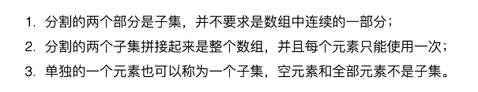
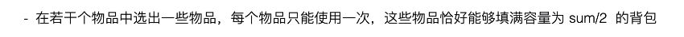
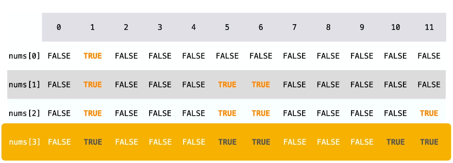
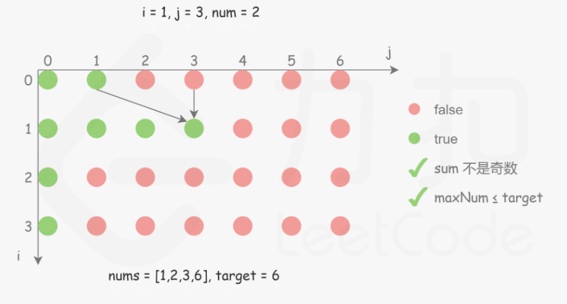

## 0-1 背包

```java
// N 为物品数量、W 为背包总体积
// weights 数组存储 N 个物品的重量、values  数组存储 N 个物品的价值
public int[][] knapsack(int W, int N, int[] weights, int[] values) {
    int[][] dp = new int[N + 1][W + 1];			//思路详细未优化版本
    for (int i = 1; i <= N; i++) {				//外循环：物品
        int w = weights[i - 1], v = values[i - 1];
        for (int j = 1; j <= W; j++) {			//内循环：背包重量
            if (j >= w) 						//能放进时，放与不放取最值
                dp[i][j] = Math.max(dp[i - 1][j], dp[i - 1][j - w] + v);
            else 
                dp[i][j] = dp[i - 1][j];		//空间不够，放不进去，状态延续。
        }
    }	 // dp[i-1][j-w]，前一个状态，移出去w空间后（状态价值）+价值后，和前一个状态取最值。
    return dp;
}
```

```java
public int knapsack(int W, int N, int[] weights, int[] values) {	//0-1背包优化后最终版
    int[] dp = new int[W + 1];										//只保留列
    for (int i = 1; i <= N; i++) {	
        int w = weights[i - 1], v = values[i - 1];
        for (int j = W; j >= w; j--) {								//反序遍历
            dp[j] = Math.max(dp[j], dp[j - w] + v);					//if判断缩到for循环里
        }
    }
    return dp[W];
}
```

### 1. 分割等和子集

中等：[416. 分割等和子集](https://leetcode-cn.com/problems/partition-equal-subset-sum/)

```js
给定一个只包含正整数的非空数组。是否可以将这个数组分割成两个子集，使得两个子集的元素和相等。
输入: [1, 5, 11, 5]	输出: true	解释: 可以分割成 [1, 5, 5] 和 [11].
输入: [1, 2, 3, 5]	输出: false	解释: 数组不能分割成两个元素和相等的子集.
```



可以看成一个背包大小为 sum/2 的 0-1 背包问题。参考：[官方图解](https://leetcode-cn.com/problems/partition-equal-subset-sum/solution/fen-ge-deng-he-zi-ji-by-leetcode-solution/)



分析：


Demo过程：

1



2


3、




```java
public boolean canPartition(int[] nums) {		//优化前 42ms,50%
    int len = nums.length;
    if (len < 2) return false;
    int sum = 0, maxNum = 0;
    for (int num : nums) {
        sum += num;
        maxNum = Math.max(maxNum, num);
    }
    if (sum % 2 != 0) return false;				//总和不是偶数不可以
    int w = sum / 2;							//w也可以理解为tar、sum
    if (maxNum > w) return false;				//最大的1个值比sum/2大不可以

    boolean[][] dp = new boolean[len][w + 1];
    //一、
    //for (int i = 0; i < len; i++) {			//第一列，边界处理
    //    dp[i][0] = true;
    //}
    //二、
    dp[0][nums[0]] = true;						//初始化第一行，其他的值都为默认false
    for (int i = 1; i < len; i++) {
        int num = nums[i];
        for (int j = 0; j <= w; j++) {			//三、
            if (j >= num) 
                dp[i][j] = dp[i - 1][j] | dp[i - 1][j - num];
            else 
                dp[i][j] = dp[i - 1][j];
        }
    }
    return dp[len - 1][w];
}
//细节：初始化，用二、其实就可以了，
//三、的话，j可以从0开始，代表算出目标值是0的。 但是，j=1提交了没错。
```

```java
public boolean canPartition(int[] nums) {	//优化后 22ms,88%
    int sum = computeArraySum(nums);
    if (sum % 2 != 0) {	return false; }	    //nums元素总和必须为偶数才可以分
    int W = sum / 2;
    boolean[] dp = new boolean[W + 1];
    dp[0] = true;
    for (int num : nums)                    //0-1 背包一个物品只能用一次
        for (int i = W; i >= num; i--)      //从后往前，先计算 dp[i] 再计算 dp[i-num]
            dp[i] = dp[i] || dp[i - num];
    return dp[W];
}

private int computeArraySum(int[] nums) {
    int sum = 0;
    for (int num : nums)  sum += num;
    return sum;
}
```

### 2. 目标和

中等：[494. 目标和](https://leetcode-cn.com/problems/target-sum/)

```js
可以从 + 或 -中选择一个符号添加在前面。返回可以使最终数组和为目标数 S 的所有添加符号的方法数。
输入：nums: [1, 1, 1, 1, 1], S: 3	输出：5	解释：一共有5种方法让最终目标和为3。
-1+1+1+1+1 = 3、+1-1+1+1+1 = 3、+1+1-1+1+1 = 3、+1+1+1-1+1 = 3、+1+1+1+1-1 = 3
```

可以将这组数看成两部分，P 和 N，其中 P 使用正号，N 使用负号，有以下推导：参考，[目标和与0-1背包](https://leetcode-cn.com/problems/target-sum/solution/huan-yi-xia-jiao-du-ke-yi-zhuan-huan-wei-dian-xing/)

```js
                  sum(P) - sum(N) = target
sum(P) + sum(N) + sum(P) - sum(N) = target + sum(P) + sum(N)
                       2 * sum(P) = target + sum(nums)
```

因此只要找到一个子集，令它们都取正号，并且和等于 (target + sum(nums))/2，就证明存在解。

```java
public int findTargetSumWays(int[] nums, int S) {	//2ms,100%
    int sum = computeArraySum(nums);
    if (sum < S || (sum + S) % 2 == 1) return 0;	//奇数或者目标值太大
    int W = (sum + S) / 2;
    int[] dp = new int[W + 1];
    dp[0] = 1;
    for (int num : nums)
        for (int i = W; i >= num; i--)  			//i >= num i从num开始，省略里面的判断
            dp[i] = dp[i] + dp[i - num];
    return dp[W];
}

private int computeArraySum(int[] nums) {
    int sum = 0;
    for (int num : nums) sum += num;
    return sum;
}
```

```java
public int findTargetSumWays(int[] nums, int S) {	//DFS：652ms,18%
    return findTargetSumWays(nums, 0, S);
}

private int findTargetSumWays(int[] nums, int start, int S) {
    if (start == nums.length) return S == 0 ? 1 : 0;
    return findTargetSumWays(nums, start + 1, S + nums[start])
         + findTargetSumWays(nums, start + 1, S - nums[start]);
}
```

## 多维费用 - 多限制背包

### 3. 一和零

中等：[474. 一和零](https://leetcode-cn.com/problems/ones-and-zeroes/)

```js
输入：strs = ["10", "0", "1"], m = 1, n = 1	输出：2	解释： {"0", "1"} 
输入：strs = ["10", "0001", "111001", "1", "0"], m = 5, n = 3	输出：4
解释：最多有 5 个 0 和 3 个 1 的情况下，元素最多子集是 {"10","0001","1","0"} ，因此答案是 4 。
其他满足m和n但较小的子集包括 {"0001","1"} 和 {"10","1","0"}，但是元素个数都少。
```

这是一个多维费用的 0-1 背包问题，有两个背包大小，0 的数量和 1 的数量。

参考：[动态规划（转换为 0-1 背包问题） - 一和零 - 力扣](https://leetcode-cn.com/problems/ones-and-zeroes/solution/dong-tai-gui-hua-zhuan-huan-wei-0-1-bei-bao-wen-ti/) 、[优化后的官解](https://leetcode-cn.com/problems/ones-and-zeroes/solution/yi-he-ling-by-leetcode/)

思路：把总共的 0 和 1 的个数视为背包的容量，每一个字符串视为装进背包的物品。这道题就可以使用 0-1 背包问题的思路完成，这里的目标值是能放进背包的字符串的数量。

动态规划的思路是：物品一个一个尝试，容量一点一点尝试，每个物品分类讨论的标准是：选与不选。

定义状态：尝试题目问啥，就把啥定义成状态。dp\[i]\[j][k] 表示输入字符串在子区间 [0, i] 能够使用 j 个 0 和 k 个 1 的字符串的最大数量。

初始化：为了避免分类讨论，通常多设置一行。这里可以认为，第 0 个字符串是空串。第 0 行默认初始化为 0。
输出：输出是最后一个状态，即：dp\[len]\[m][n]。方程如下：


```java
public int findMaxForm(String[] strs, int m, int n) {	//74ms,27%
    int M = m + 1;
    int N = n + 1;
    // dp[插入/不插入第i个字符串][m个1][n个0] 组合最多的字符串数量
    int[][][] dp = new int[strs.length + 1][M][N];
    for (int k = 1; k < strs.length + 1; k++) {
        String str = strs[k - 1];
        int zeroCnt = getZeroCount(str);
        int oneCnt = str.length() - zeroCnt;
        for (int i = 0; i < M; i++) {
            for (int j = 0; j < N; j++) {
                dp[k][i][j] = dp[k - 1][i][j];		 // 先把上一行抄下来
                if (i >= zeroCnt && j >= oneCnt) {
                    dp[k][i][j] = Math.max(dp[k][i][j],
                                           dp[k - 1][i - zeroCnt][j - oneCnt] + 1);
                }
                //dp[k][i][j] = Math.max(dp[k - 1][i][j], dp[k][i][j]);
            }
        }
    }
    return dp[strs.length][m][n];
}
public int getZeroCount(String s) {
    int zeros = 0;
    for (char c : s.toCharArray()) if (c == '0') zeros++;
    return zeros;
}
```

```java
public int findMaxForm(String[] strs, int m, int n) {	//空间优化后，33ms，82%
    if (strs == null || strs.length == 0) return 0;
    int[][] dp = new int[m + 1][n + 1];
    for (String s : strs) {    							//每个字符串只能用一次
        int ones = 0, zeros = 0;
        for (char c : s.toCharArray()) {
            if (c == '0') zeros++;
            else ones++;
        }
        for (int i = m; i >= zeros; i--) {				//优化后，倒着的
            for (int j = n; j >= ones; j--) {			//优化后，倒着的
                dp[i][j] = Math.max(dp[i][j], dp[i - zeros][j - ones] + 1);
            }
        }
    }
    return dp[m][n];
}
```

