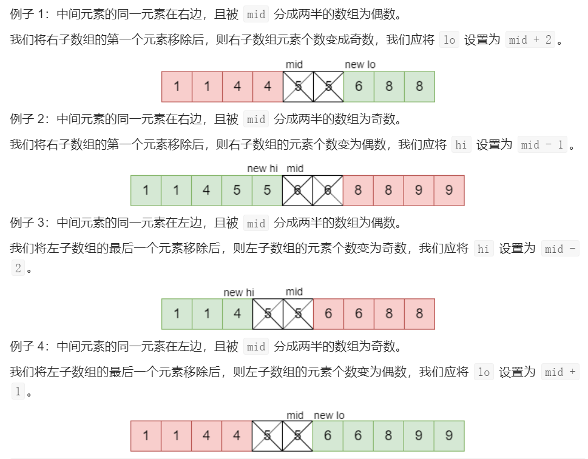

# Leetcode 题解 - 二分查找
<!-- GFM-TOC -->
* [Leetcode 题解 - 二分查找](#leetcode-题解---二分查找)
    * [1. 求开方](#1-求开方)
    * [2. 大于给定元素的最小元素](#2-大于给定元素的最小元素)
    * [3. 有序数组的 Single Element](#3-有序数组的-single-element)
    * [4. 第一个错误的版本](#4-第一个错误的版本)
    * [5. 旋转数组的最小数字](#5-旋转数组的最小数字)
    * [6. 查找区间](#6-查找区间)
<!-- GFM-TOC -->


**正常实现**  

```text
Input : [1,2,3,4,5]
key : 3
return the index : 2
```

```java
public int binarySearch(int[] nums, int key) {
    int l = 0, h = nums.length - 1;
    while (l <= h) {
        int m = l + (h - l) / 2;
        if (nums[m] == key) {
            return m;
        } else if (nums[m] > key) {
            h = m - 1;
        } else {
            l = m + 1;
        }
    }
    return -1;
}
```

**时间复杂度**  

二分查找也称为折半查找，每次都能将查找区间减半，这种折半特性的算法时间复杂度为 O(logN)。

**m 计算**  

有两种计算中值 m 的方式：

- m = (l + h) / 2
- m = l + (h - l) / 2

l + h 可能出现加法溢出，也就是说加法的结果大于整型能够表示的范围。但是 l 和 h 都为正数，因此 h - l 不会出现加法溢出问题。所以，最好使用第二种计算法方法。

**未成功查找的返回值**  

循环退出时如果仍然没有查找到 key，那么表示查找失败。可以有两种返回值：

- -1：以一个错误码表示没有查找到 key
- l：将 key 插入到 nums 中的正确位置

**变种**  

二分查找可以有很多变种，实现变种要注意边界值的判断。例如在一个有重复元素的数组中查找 key 的最左位置的实现如下：

```java
public int binarySearch(int[] nums, int key) {
    int l = 0, h = nums.length;
    while (l < h) {
        int m = l + (h - l) / 2;
        if (nums[m] >= key) {
            h = m;
        } else {
            l = m + 1;
        }
    }
    return l;
}
```

该实现和正常实现有以下不同：

- h 的赋值表达式为 h = m
- 循环条件为 l \< h
- 最后返回 l 而不是 -1

在 nums[m] \>= key 的情况下，可以推导出最左 key 位于 [l, m] 区间中，这是一个闭区间。h 的赋值表达式为 h = m，因为 m 位置也可能是解。

在 h 的赋值表达式为 h = m 的情况下，如果循环条件为 l \<= h，那么会出现循环无法退出的情况，因此循环条件只能是 l \< h。以下演示了循环条件为 l \<= h 时循环无法退出的情况：

```text
nums = {0, 1, 2}, key = 1
l   m   h
0   1   2  nums[m] >= key
0   0   1  nums[m] < key
1   1   1  nums[m] >= key
1   1   1  nums[m] >= key
...
```

当循环体退出时，不表示没有查找到 key，因此最后返回的结果不应该为 -1。为了验证有没有查找到，需要在调用端判断一下返回位置上的值和 key 是否相等。

## 数组

### 1. 比目标字母大的最小字母

简单： [744. 寻找比目标字母大的最小字母](https://leetcode-cn.com/problems/find-smallest-letter-greater-than-target/)

```js
给定一个有序的字符数组 letters 和一个字符 target，要求找出 letters 中大于 target 的最小字符，如果找不到就返回第 1 个字符。		输入:letters = ["c", "f", "j"] target = "g"	输出: "j"
```

```java
public char nextGreatestLetter(char[] letters, char target) {
    int n = letters.length;	//思路是找target的最右边界，返回l
    int l = 0, h = n - 1;
    while (l <= h) {
        int m = l + (h - l) / 2;
        if (letters[m] <= target) l = m + 1;    
        else h = m - 1; 	//找到目标值以后，认为这个目标值是小的，继续扩大l向右边找。
    }
    return l < n ? letters[l] : letters[0];
}
```

### 2. 有序数组中的单一元素

中等： [540. 有序数组中的单一元素](https://leetcode-cn.com/problems/single-element-in-a-sorted-array/)

```js
一个有序数组只有一个数不出现两次，找出这个数。	输入: [1,1,2,3,3,4,4,8,8]	输出: 2  要求：时间O(log n)
```

要求以 O(logN) 时间复杂度进行求解，因此不能遍历数组并进行异或操作来求解，这么做的时间复杂度为 O(N)。

令 index 为 Single Element 在数组中的位置。在 index 之后，数组中原来存在的成对状态被改变。如果 m 为偶数，并且 m + 1 \< index，那么 nums[m] == nums[m + 1]；m + 1 \>= index，那么 nums[m] != nums[m + 1]。

从上面的规律可以知道，如果 nums[m] == nums[m + 1]，那么 index 所在的数组位置为 [m + 2, h]，此时令 l = m + 2；如果 nums[m] != nums[m + 1]，那么 index 所在的数组位置为 [l, m]，此时令 h = m。

因为 h 的赋值表达式为 h = m，那么循环条件也就只能使用 l \< h 这种形式。

对二分情况分析：



发现：即使数组没有经过排序，只要将同一元素放在一起，该算法仍然起作用。他们的顺序无关紧要，重要的是含有单个元素的子数组元素个数为奇数。例：[10, 10, 4, 4, 7, 11, 11, 12, 12, 2, 2]）。

```java
public int singleNonDuplicate(int[] nums) {			//时间:O(logN)
    int l = 0,h = nums.length - 1;
    while (l < h) {
        int m = l + (h - l) / 2;
        boolean halvesAreEven = (h - m) % 2 == 0;
        if (nums[m + 1] == nums[m])
            if (halvesAreEven) l = m + 2;
            else h = m - 1;
        else if (nums[m - 1] == nums[m])
            if (halvesAreEven) h = m - 2;
            else l = m + 1;
        else 
            return nums[m];
    }
    return nums[l];
}
```

在单个元素的后面，则成对的元素变为奇数索引后跟他们的同一元素。说明我们在检索单个元素后面的偶数索引时，其后都没有它的同一元素。因此，我们可以通过偶数索引确定单个元素在左侧还是右侧。

- 奇数长度的数组首尾元素索引都为偶数，因此我们可以将 l 和 h 设置为数组首尾。
- 我们需要确保 m是偶数，如果为奇数，则将其减 1。
- 然后，我们检查 m的元素是否与其后面的索引相同。
- 如果相同，则我们知道 m不是单个元素。且单个元素在 m之后。则我们将 l设置为 m+ 2。
- 如果不是，则我们知道单个元素位于 m，或者在 m之前。我们将 h 设置为 m。不能大范围的改 h。
- 一旦 l==h，则当前搜索空间为 1 个元素，那么该元素为单个元素，我们将返回它。

```java
public int singleNonDuplicate(int[] nums) {		//时间：O(logN/2)。仅对元素的一半进行二分搜索。
    int l = 0;
    int r = nums.length - 1;
    while (l < r) {								 //退出时l=r
        int m = l + (r - l) / 2;
        if (m % 2 == 1) m--;					 //用m++，不好写。[1,1,2,3,3,4,4,8,8]超时。
        if (nums[m] == nums[m + 1]) l = m + 2;   //和下一位比较。
        else r = m;								 //实际改为 r = m - 1;也是能过。		
    }
    return nums[l];
}
```

注意：只遍历到倒数第二个就可以了，i < nums.length - 1 也防止 if (nums[i] != nums[i + 1]) 的数组越界。

```js
public int singleNonDuplicate(int[] nums) {		//暴力法
    for (int i = 0; i < nums.length - 1; i+=2) 
        if (nums[i] != nums[i + 1]) 			//i < nums.length - 1
            return nums[i];
    return nums[nums.length - 1];
}
```

### 3. 第一个错误的版本

简单：[278. 第一个错误的版本](https://leetcode-cn.com/problems/first-bad-version/)

题目描述：给定一个元素 n 代表有 [1, 2, ..., n] 版本，在第 x 位置开始出现错误版本，导致后面的版本都错误。可以调用 isBadVersion(int x) 知道某个版本是否错误，要求找到第一个错误的版本。

题目描述：给定一个元素 n 代表有 [1, 2, ..., n] 版本，在第 x 位置开始出现错误版本，导致后面的版本都错误。可以调用 isBadVersion(int x) 知道某个版本是否错误，要求找到第一个错误的版本。

如果第 m 个版本出错，则表示第一个错误的版本在 [l, m] 之间，令 h = m；否则第一个错误的版本在 [m + 1, h] 之间，令 l = m + 1。因为 h 的赋值表达式为 h = m，因此循环条件为 l \< h。

```java
public int firstBadVersion(int n) {
    int l = 1, h = n;
    while (l < h) {
        int mid = l + (h - l) / 2;
        if (isBadVersion(mid)) h = mid;   //代表错误
        else l = mid + 1;     			  //代表正确
    }
    return l;
}
```

### 4. 旋转数组的最小数字

中等：[153. 寻找旋转排序数组中的最小值](https://leetcode-cn.com/problems/find-minimum-in-rotated-sorted-array/)	类似题目：[剑指 11](https://leetcode-cn.com/problems/xuan-zhuan-shu-zu-de-zui-xiao-shu-zi-lcof/)、[154. 寻找旋转排序数组中的最小值 II](https://leetcode-cn.com/problems/find-minimum-in-rotated-sorted-array-ii/)

```js
输入：nums = [3,4,5,1,2]	输出：1	说明：153题 nums 中的所有整数互不相同，剑指11和154有重复元素
```

```java
public int minArray(int[] nums) {				//可以处理掉重复值的问题。154、153都适用
    int l = 0, r = nums.length - 1;
    while (l < r) {								//条件
        int m = (l + r) / 2;
        if (nums[m] > nums[r]) l = m + 1;
        else if (nums[m] < nums[r]) r = m;		//r不敢动
        else if (nums[m] == nums[r]) r--;		//r--这一行处理数组重复值的情况
    }
    return nums[l];
}
```

当出现 nums[m] = nums[j] 时，一定有区间 [i, m] 内所有元素相等 或 区间 [m, j] 内所有元素相等（或两者皆满足），可以举例子说明的。对于寻找此类数组的最小值问题，可直接放弃二分查找，而使用**线性查找替代**。

```java
public int minArray(int[] nums) {				//优化版本
    int l = 0, r = nums.length - 1;
    while (l < r) {
        int m = (l + r) / 2;
        if (nums[m] > nums[r]) l = m + 1;
        else if (nums[m] < nums[r]) r = m;
        else if (nums[m] == nums[r]){
            int x = l;
            for(int k = l + 1; k < r; k++) {
                if(nums[k] < nums[x]) x = k;
            }
            return nums[x];
        }
    }
    return nums[l];
}
```

### 5. 查找元素首尾位置

中等：[34. 在排序数组中查找元素的第一个和最后一个位置](https://leetcode-cn.com/problems/find-first-and-last-position-of-element-in-sorted-array/)

```js
给定一个有序数组 nums 和一个目标 target，要求找到 target 在 nums 中的第一个位置和最后一个位置。不存在返回 [-1, -1]。要求：时间，O(log n)	输入：nums = [5,7,7,8,8,10], target = 8 输出：[3,4]
```

可以用二分查找找出第一个位置和最后一个位置，但是寻找的方法有所不同，需要实现两个二分查找。

可转化为寻找  target 最后一个位置，转换成寻找 target+1 第一个位置，再往前移动一个位置。

```java
public int[] searchRange(int[] nums, int target) {
    int l = helper(nums, target);
    int r = helper(nums, target + 1);
    if (l >= nums.length || nums[l] != target)
        return new int[]{-1, -1};
    return new int[]{l, r - 1};
}
int helper(int[] nums, int tar) {	
    int l = 0, r = nums.length - 1;
    while (l <= r) {
        int m = (l + r) / 2;
        if (nums[m] >= tar) r = m - 1;	//找最左边界
        else l = m + 1;
    }
    return l;
}
```

## 数学

### 1. x 的平方根

简单：[69. x 的平方根](https://leetcode-cn.com/problems/sqrtx/)		输入：4 	输出：2	对于 x = 8，它的开方是 2.82842...，最后应该返回 2 而不是 3

一个数 x 的开方 sqrt 一定在 0 \~ x 之间，并且满足 sqrt == x / sqrt。可以利用二分查找在 0 \~ x 之间查找 sqrt。

循环条件为 l \<= h 并且退出时，h 总是比 l 小 1，也就是说 h = 2，l = 3，因此最后的返回值应该为 h 而不是 l。

```java
public int mySqrt(int x) {		//写法1
    int l = 0, r = x;			//int的话 46341*46341=-2147479015 
    while (l <= r) {			
        long m = (l + r) / 2;	  
        if (m * m == x)		return (int) m;
        else if (m * m < x) l = (int) (m + 1);
        else if (m * m > x) r = (int) (m - 1);
    }
    return r;
}//输入8的执行过程，08-4		03-2	33-3	32返回2
```

```java
public int mySqrt(int x) {		//写法2
    if (x <= 1) return x;
    int l = 1, h = x;
    while (l <= h) {
        int mid = l + (h - l) / 2;
        int sqrt = x / mid;
        if (sqrt == mid) return mid;
        else if (mid > sqrt) h = mid - 1;
        else l = mid + 1;
    }
    return h;
}
```

```java
public int sqrt(int x) { return (int) Math.sqrt(x); }	//库函数
```

````java
public int sqrt(int x) {		//数学
    int i = 1;					//平方数的性质：连续n个奇数相加的结果一定是平方数。
    int res = 0;				//如：9=1+3+5；16=1+3+5+7；所以，
    while (x >= 0) {			
        x -= i;					//不断的进行奇数相加，并判断x大小即可。
        res++;
        i += 2;
    }
    return res - 1;
}
````

```java
public static void main(String[] args) {	//拓展:不使用库函数，求平方很，保留6位。
    /**
        迭代法求tar的平方根：ret=tar/ret时，ret为其平方根.
        两者差小于10的负6次方，<1e-6，即为精确到小数点后六位
        ret 和 tar/ret 分别位于tar的平方根的两头，一个大于，一个小于，取两者的平均值进行迭代。
    */
    Scanner sc = new Scanner(System.in);
    int tar = sc.nextInt();
    float ret = 1;
    while (Math.abs(ret - tar / ret) > 1e-6) 
        ret = (ret + tar / ret) / 2;
    System.out.println(ret);
}	//测试:3	输出：1.7320509
```

