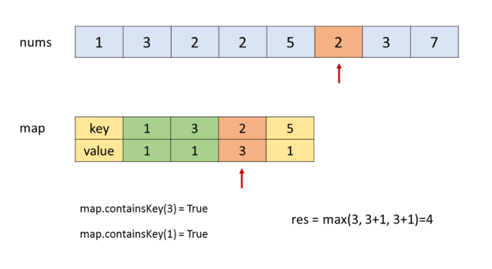

# Leetcode 题解 - 哈希表
<!-- GFM-TOC -->
* [Leetcode 题解 - 哈希表](#leetcode-题解---哈希表)
    * [1. 数组中两个数的和为给定值](#1-数组中两个数的和为给定值)
    * [2. 判断数组是否含有重复元素](#2-判断数组是否含有重复元素)
    * [3. 最长和谐序列](#3-最长和谐序列)
    * [4. 最长连续序列](#4-最长连续序列)
<!-- GFM-TOC -->


## 1. 两数之和

简单： [1. 两数之和](https://leetcode-cn.com/problems/two-sum/)

可以先对数组进行排序，然后使用双指针方法或者二分查找方法。时间复杂度为 O(NlogN)，空间复杂度为 O(1)。

可用 HashMap 存储 target-nums[i] 的值为键，存储 i 数组下标为值，时间复杂度为 O(N)，空间复杂度为 O(N)。

```java
public int[] twoSum(int[] nums, int tar) {	//Map Java
    HashMap<Integer, Integer> map = new HashMap<>();
    for (int i = 0; i < nums.length; i++) {
        if (map.containsKey(tar - nums[i])) return new int[]{map.get(tar - nums[i]), i};
        else map.put(nums[i], i);
    }
    return null;
}
```

```c
vector<int> twoSum(vector<int>& nums, int tar) {	//Map c++
    unordered_map<int, int> map;
    for (int i = 0; i < nums.size(); ++i) {
        auto ite = map.find(tar - nums[i]);
        if (ite != map.end()) return {ite->second, i};	//返回指向map最后一个元素旁边的迭代器。
        map[nums[i]] = i;								//ite != map.end()代表是否存在
    }
    return {};
}
```

解释：find函数来定位数据出现位置，它返回的一个迭代器，当数据出现时，它返回数据所在位置的迭代器，如果map中没有要查找的数据，它返回的迭代器等于end函数返回的迭代器 

## 2. 判断数组有无重复元素

简单： [217. 存在重复元素](https://leetcode-cn.com/problems/contains-duplicate/)

```java
public boolean containsDuplicate(int[] nums) {
    Set<Integer> set = new HashSet<>();		//JAVA的
    for (int num : nums) set.add(num);		//下边都c++
    return set.size() < nums.length;
}
```

```c++
bool containsDuplicate(vector<int>& nums) {
    unordered_set<int> s;
    for (int x: nums) {
        if (s.find(x) != s.end()) return true;
        s.insert(x);						//map查看是否存在
    }
    return false;
}
```

```c
bool containsDuplicate(vector<int>& nums) {	//相当于把值都往set里存一遍比容器大小
    return nums.size() > unordered_set<int>(nums.begin(), nums.end()).size(); 
}
```

```c
sort(nums.begin(), nums.end());				//排序，不推荐
for (int i = 1; i < nums.size(); i++) {
    if (nums[i] != nums[i - 1]) continue;
    return true;
}
return false;
```

````c
unordered_map<int,int> map;
for(int i = 0;i < nums.size();i++){				
    if(map[nums[i]] == 0)  map[nums[i]]++;	//不存在的键，对应的值默认是0
    else return true;
}
return false;
````

```c
unordered_set<int>set;
int size = nums.size();
for(int i = 0; i < size; i++){
    if(set.count(nums[i])) return true;		//set查看是否包含
    set.insert(nums[i]);
}
return false;
```

## 3. 最长 +-1 和谐子序列

简单： [594. 最长和谐子序列](https://leetcode-cn.com/problems/longest-harmonious-subsequence/)

```html
和谐子序列：最大数和最小数之差正好为 1 的子数组
输入：nums = [1,3,2,2,5,2,3,7]		输出：5  解释：[3,2,2,2,3]
输入：nums = [1,2,3,4]	输出：2	  输入：nums = [1,1,1,1]	输出：0
```

枚举：对于当前枚举的元素 x，它可以和 x + 1 组成和谐子序列。我们再遍历一遍整个数组，找出等于 x 或 x + 1 的元素个数，就可以得到以 x 为最小值的和谐子序列的长度。

```java
public int findLHS(int[] nums) {	 //	JAVA 暴力 + 标识位，笨方法。
    int res = 0;					 // 10月17号，显示超时。
    for (int i = 0; i < nums.length; i++) {
        int cnt = 0;
        boolean flag = false;
        for (int j = 0; j < nums.length; j++) {
            if (nums[j] == nums[i]) cnt++;
            else if (nums[j] + 1 == nums[i]) {		//这里是 nums[j] + 1 
                cnt++;
                flag = true;//flag必须有，否则，[1,1,1,1]会输出4，但是正确的是0
            }
        }
        if (flag) res = Math.max(cnt, res);
    }
    return res;
}
```

```c
int findLHS(vector<int>&nums) {		//排序双指针，不推荐，但是速度最快，64ms，98%
    int mx = 0;						//c++
    int j = 0;
    sort(nums.begin(), nums.end());
    for (int i = 0; i < nums.size(); i++) {
        while (j < nums.size() && (nums[i] - nums[j] > 1)) j++;//这里的j被动往前配合i
        if (nums[i] - nums[j] == 1) mx = max(mx, i - j + 1);
    }
    return mx;
}
```

哈希计数 + 两次扫描：O(N) 的时间遍历下来后，用（HashMap）来存储每个数出现的次数。再次遍历 HashMap 这样就能在 O(1) 的时间内得到 x 和 x + 1 出现的次数。缺点是进行了两次扫描。复杂度：双O(N)

````java
public int findLHS(int[] nums) {			//JAVA
    Map<Integer, Integer> dic = new HashMap<>();
    for (int num : nums) dic.put(num, dic.getOrDefault(num, 0) + 1);
    int lst = 0;							// 初始一定要是0，处理[1,1,1,1]的情况
    for (int num : dic.keySet()) {
        if (dic.containsKey(num + 1)) {		// 找 num + 1 和 num 的次数总和的最大值
            lst = Math.max(lst, dic.get(num + 1) + dic.get(num));
        }
    }
    return lst;
}
````

````c
int findLHS(vector<int>& nums) {		//c++,84ms,89%
    unordered_map<int, int>mp;
    int mx = 0;
    for (int num : nums) mp[num]++;		
    for (auto kv : mp)					//或者用这个判断 if(mp.find(kv.first+1)!=mp.end())
        if (mp.count(kv.first + 1))	mx = max(mx, kv.second + mp[kv.first + 1]);//不可以->
    return mx;
}
````

哈希映射 + 单次扫描：我们扫描一次数组，当扫描到元素 x 时，我们首先将 x 加入哈希映射，随后获取哈希映射中 x - 1, x, x + 1 三者出现的次数 u, v, w，那么 u + v 即为 x - 1, x 组成的和谐子序列的长度，v + w 即为 x, x + 1 组成的和谐子序列的长度。假设数组中最长的和谐子序列的最后一个元素在数组中的位置为 i，那么在扫描到 nums[i] 时，u + v 和 v + w 中一定有一个就是答案。因此这种方法可以找到最长的和谐子序列的长度。



```java
public int findLHS(int[] nums) {		//JAVA，22ms,26%	(推荐)
    HashMap<Integer, Integer> map = new HashMap <> ();
    int lst = 0;
    for (int num: nums) {
        map.put(num, map.getOrDefault(num, 0) + 1);					//计次
        if (map.containsKey(num + 1))
            lst = Math.max(lst, map.get(num) + map.get(num + 1));	//num和num+1计次和
        if (map.containsKey(num - 1))
            lst = Math.max(lst, map.get(num) + map.get(num - 1));	//num和num-1计次和
    }
    return lst;
}
```

```c
int findLHS(vector<int>& nums) {		//c++,276ms,5%
    map<int,int> mp;
    int ret = 0;
    for(auto num:nums){
        mp[num]++;
        if(mp[num-1] == 0 && mp[num+1] == 0) continue;
        ret = max(ret, mp[num] + max(mp[num-1], mp[num+1]));
    }
    return ret;
}
```

## 4. 最长连续序列

中等： [128. 最长连续序列](https://leetcode-cn.com/problems/longest-consecutive-sequence/)  		进阶要求以 O(N) 的时间复杂度求解，需要dp。

```js
输入：nums = [100,4,200,1,3,2] 	输出：4 解释：最长数字连续序列是 [1, 2, 3, 4]。它的长度为 4。
输入：nums = [0,3,7,2,5,8,4,6,0,1]	输出：9 解释：结果是0到8		
```

哈希表：外层循环需要 O(n) 的时间复杂度，只有当一个数是连续序列的第一个数的情况下才会进入内层循环，然后在内层循环中匹配连续序列中的数，因此数组中的每个数只会进入内层循环一次。**时间复杂度为 O(n)。**

```java
public int longestConsecutive(int[] nums) {
    Set<Integer> set = new HashSet<>();		 //15ms 33%(推荐)
    for (int num : nums) set.add(num);
    int lst = 0;
    for (int num : set) {
        if (!set.contains(num - 1)) {		 //从最小的开始计数 123456，只1进入。
            int curNum = num;				 //入口是 num - 1
            int curLen = 1;
            while (set.contains(curNum + 1)) {//只计算单方向加的。
                curNum += 1;
                curLen += 1;
            }
            lst = Math.max(lst, curLen);
        }
    }
    return lst;
}
```

```java
int longestConsecutive(vector<int>& nums) {		  		  //排序+双指针 32ms 30%
    if(nums.size()==0||nums.size()==1) return nums.size();// [0，0，2，1，3，3，5，4，4，4]
    sort(nums.begin(),nums.end());						  // [0,0,1,2,3,3,4,4,4,5,6]
    int l=0,r=0,ret=1,cnt=0;						  	  //cnt来记录连续区间中重复点的次数
    while(r<nums.size()-1){
        if(nums[r]+1==nums[r+1]) r++;  //下一个点连续递增
        else if(nums[r]==nums[r+1]){   //连续重复的点
            r++;
            cnt++;
        }
        else{						   //下一个不再连续
            cnt=0;
            l=++r;
        }
        ret=max(ret,r-l+1-cnt);		   //减去cnt，比如 0，0，1，2，3，3，4，4，4，5，6中的0,3,4
    }	
    return ret;
}
```

动态规划：用哈希表存储每个端点值对应连续区间的长度，若数已在哈希表中，跳过不做处理。 [参考答案](https://leetcode-cn.com/problems/longest-consecutive-sequence/solution/dong-tai-gui-hua-python-ti-jie-by-jalan/) 

若是新数加入，取出其左右相邻数已有的连续区间长度 left 和 right，计算当前数的区间长度为：cur_length = left + right + 1，根据 cur_length 更新最大长度 max_length 的值，更新区间两端点的长度值。

```java
public int longestConsecutive(int[] nums) {		//40ms 24%
    int n = nums.length;
    HashMap<Integer, Integer> map = new HashMap<>();
    int res = 0;
    for (int num : nums) {
        if (!map.containsKey(num)) {
            int left = map.get(num - 1) == null ? 0 : map.get(num - 1);
            int right = map.get(num + 1) == null ? 0 : map.get(num + 1);
            int cur = 1 + left + right;
            if (cur > res) res = cur;
            map.put(num, cur);
            map.put(num - left, cur);			//难理解
            map.put(num + right, cur);
        }
    }
    return res;
}
```

并查集 // todo


