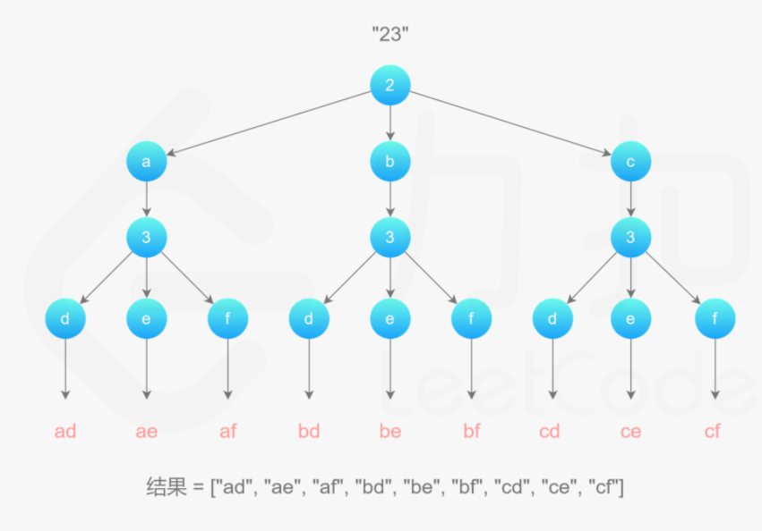
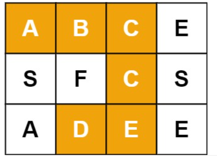
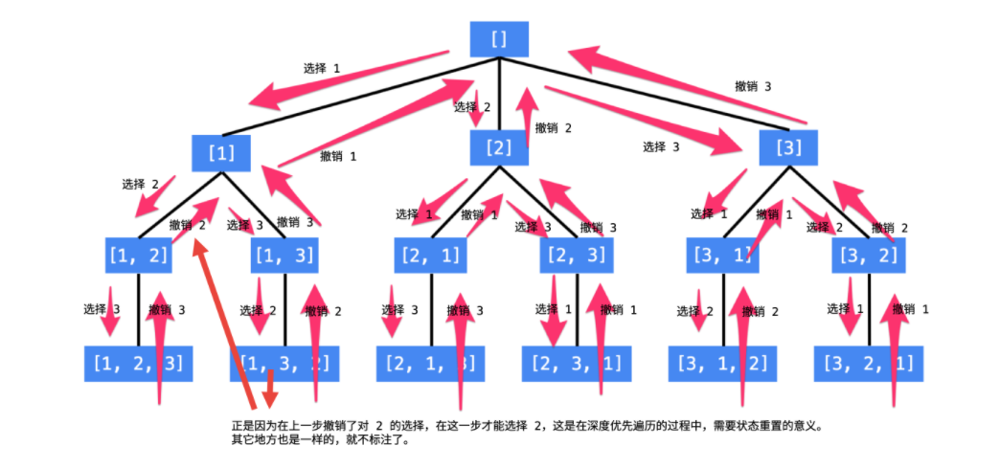

## Backtracking

Backtracking（回溯）属于 DFS。

- 普通 DFS 主要用在   **可达性问题**  ，这种问题只需要执行到特点的位置然后返回即可。
- 而 Backtracking 主要用于求解   **排列组合**   问题，例如有 { 'a','b','c' } 三个字符，求解所有由这三个字符排列得到的字符串，这种问题在执行到特定的位置返回之后还会继续执行求解过程。

因为 Backtracking 不是立即返回，而要继续求解，因此在程序实现时，需要注意对元素的标记问题：

- 在访问一个新元素进入新的递归调用时，需要将新元素**标记**为已经访问，这样才能在继续递归调用时不用重复访问该元素；
- 但是在**递归返回时，需要将元素标记为未访问**，因为**只需要保证在一个递归链中不同时访问一个元素，可以访问已经访问过但是不在当前递归链中的元素。**

### 1. 9键的字母组合

中等：[17. 电话号码的字母组合](https://leetcode-cn.com/problems/letter-combinations-of-a-phone-number/)

<div align="center">  </div><br>
```js
输入：digits = "23"	输出所有字母组合：["ad","ae","af","bd","be","bf","cd","ce","cf"]
```



```java
private String mp[] = {" ", "", 						//0、1，这个位置都无所谓的
                       "abc", "def", "ghi", "jkl", "mno", "pqrs", "tuv", "wxyz"};
private ArrayList<String> res;							//字符串不需要回溯
public List<String> letterCombinations(String digits) {				
    res = new ArrayList<String>();
    if (digits.equals("")) return res;
    findCombination(digits, 0, "");
    return res;
}

private void findCombination(String digits, int idx, String s) {
    if (idx == digits.length()) {
        res.add(s);
        return;
    }
    Character numC = digits.charAt(idx);
    String abc = mp[numC - '0'];
    for (int i = 0; i < abc.length(); i++) {
        String cur = s + abc.charAt(i);
        findCombination(digits, idx + 1, cur);
    }
    return;
}
```

补充一下视图 Map 的初始化方法

```java
static final Map<Character, String> map = Map.of(
    '2', "abc", '3', "def", '4', "ghi", '5', "jkl",
    '6', "mno", '7', "pqrs", '8', "tuv", '9', "wxyz"
);
```

```java
int len;
String[] map = new String[]{"abc", "def", "ghi", "jkl", "mno", "pqrs", "tuv", "wxyz"};
List<String> ans = new ArrayList<>();
public List<String> letterCombinations(String digits) {	//StringBuilder 需要回溯删除
    if ("".equals(digits)) return ans;
    len = digits.length();
    dfs(new StringBuilder(), digits, 0);
    return ans;
}

public void dfs(StringBuilder sb, String digits, int idx) {
    if (sb.length() == len) {
        ans.add(sb.toString());
        return;
    }
    char numC = digits.charAt(idx);
    String abc = map[numC - '2'];
    for (int j = 0; j < abc.length(); j++) {
        sb.append(abc.charAt(j));
        dfs(sb, digits, idx + 1);
        sb.deleteCharAt(sb.length() - 1);
    }
}
```

```java
public List<String> letterCombinations(String digits) {		//DFS+队列
    LinkedList<String> ans = new LinkedList<String>();
    if(digits.isEmpty()) return ans;
    String[] mp = new String[] {"0", "1", "abc", "def", "ghi", "jkl", "mno", "pqrs", "tuv", "wxyz"};
    ans.add("");
    for(int i =0; i<digits.length();i++){
        int x = Character.getNumericValue(digits.charAt(i));
        while(ans.peek().length()==i){
            String cache = ans.remove();
            for(char c : mp[x].toCharArray())
                ans.add(cache+c);
        }
    }
    return ans;
}
```

### 2. 复原 IP 地址

中等：[93. 复原 IP 地址](https://leetcode-cn.com/problems/restore-ip-addresses/)

```js
给定一个只包含数字的字符串，用以表示一个 IP 地址，返回所有可能从 s 获得的 有效 IP 地址 。
有效 IP 地址 正好由四个整数（每个整数位于 0 到 255 之间组成，且不能含有前导 0），整数之间用 '.' 分隔。
例如："0.1.2.201" 和 "192.168.1.1" 是 有效 IP 地址，但是 "0.011.255.245"、"192.168.1.312" 和 "192.168@1.1" 是 无效 IP 地址。
输入：s = "25525511135"	输出：["255.255.11.135","255.255.111.35"]
输入：s = "010010"	输出：["0.10.0.10","0.100.1.0"]
输入：s = "101023"	输出：["1.0.10.23","1.0.102.3","10.1.0.23","10.10.2.3","101.0.2.3"]
```

```js
dfs(){	 		//标准回溯,模板
    if() 		//符合条件加入
    if()		//排除不符合条件的情况,停止搜索
    for(){		//做出选择
        ....	// 操作数据
        dfs();	//继续搜素
		....	// 还原数据
    }
}
dfs(String s,int start,int end,StringBuilder sb,int time)
dfs功能: 截取[start,end) 加入sb, 当截取次数time到4次,且start遍历到尾部时,加入结果集result
```

```java
List<String> ret;
public List<String> restoreIpAddresses(String str) {	//详细解释版本，6ms，35%
    ret = new LinkedList<String>();
    if (str.length() > 12) return ret;	   //总长度超了,无法转换返回
    dfs(str, 0, 1, new StringBuilder(), 0);//从截取长度为1、2、3开始
    dfs(str, 0, 2, new StringBuilder(), 0);
    dfs(str, 0, 3, new StringBuilder(), 0);
    return ret;
}

void dfs(String str, int l, int r, StringBuilder sb, int time) {
    if (time == 4 && l == str.length() && r == l + 1) {//截取四次,且遍历到尾部,r==l+1防止重复
        ret.add(sb.toString());
        return;
    }
    if (r > str.length()) return;			//无法截取[l,r) end超了
    if (r - l <= 0 || r - l > 3) return;	//无法截取[l,r),每段的长度不能为0,不能大于3
    if (r - l > 1 && str.charAt(l) == '0') return;//截取长度不是1(若长度为1允许为0),其他情况首零
    if (Integer.parseInt(str.substring(l, r)) > 255) return;//大于255,返回
    for (int i = 1; i <= 3; i++) {						// 截取 长度 1,2,3 三种情况
        sb.append(str.substring(l, r));					//加入
        if (time <= 2) sb.append('.');
        dfs(str, r, r + i, sb, time + 1);				//继续裁剪
        if (time <= 2) sb.deleteCharAt(sb.length() - 1);//还原数据的操作
        sb.delete(sb.length() - (r - l), sb.length());
    }
}
```

```java
public List<String> restoreIpAddresses(String str) {	//3ms，61%
    List<String> ret = new ArrayList<>();				//ret:addresses
    StringBuilder sb = new StringBuilder();				//sb:tempAddress
    doRestore(0, sb, ret, str);
    return ret;
}
private void doRestore(int idx, StringBuilder sb, List<String> ret, String str) {
    if (idx == 4 || str.length() == 0) {
        if (idx == 4 && str.length() == 0) ret.add(sb.toString());
        return;
    }
    for (int i = 0; i < str.length() && i <= 2; i++) {
        if (i != 0 && str.charAt(0) == '0') break;
        String part = str.substring(0, i + 1);
        if (Integer.valueOf(part) <= 255) {
            if (sb.length() != 0) part = "." + part;
            sb.append(part);
            doRestore(idx + 1, sb, ret, str.substring(i + 1));
            sb.delete(sb.length() - part.length(), sb.length());
        }
    }
}
```

```java
public List<String> restoreIpAddresses(String s) {	//上边的改进版本，2ms，80%
    int len = s.length();
    List<String> res = new ArrayList<>();
    if (len > 12 || len < 4) return res;
    Deque<String> path = new ArrayDeque<>(4);
    dfs(s, len, 0, 4, path, res);
    return res;
}

private void dfs(String s, int len, int begin, int residue, Deque<String> path, List<String> res) {									//residue,记录剩余多少段还没被分割
    if (begin == len) {
        if (residue == 0) res.add(String.join(".", path));
        return;
    }
    for (int i = begin; i < begin + 3; i++) {
        if (i >= len) break;
        if (residue * 3 < len - i) continue;
        if (judgeIpSegment(s, begin, i)) {
            String currentIpSegment = s.substring(begin, i + 1);
            path.addLast(currentIpSegment);
            dfs(s, len, i + 1, residue - 1, path, res);
            path.removeLast();
        }
    }
}

private boolean judgeIpSegment(String s, int left, int right) {
    int len = right - left + 1;
    if (len > 1 && s.charAt(left) == '0') return false;
    int res = 0;
    while (left <= right) {
        res = res * 10 + s.charAt(left) - '0';
        left++;
    }
    return res >= 0 && res <= 255;
}
```

```java
//上边版本中方法 String.join() 的 Demo：
//原方法：public static String join(CharSequence delimiter,CharSequence... elements)
public static void main(String args[]){  	//demo1  
    //The first argument to this method is the delimiter
    String str=String.join("^","You","are","Awesome");  
    System.out.println(str);  	//You^are^Awesome
}
public static void main(String args[]){  	//demo2   
    //Converting an array of String to the list
    List list<String> = Arrays.asList("Steve", "Rick", "Peter", "Abbey");
    String names = String.join(" | ", list);
    System.out.println(names);	//Steve | Rick | Peter | Abbey
}
```

### 3. 单词搜索

中等：[79. 单词搜索](https://leetcode-cn.com/problems/word-search/)

```js
输入：board = [["A","B","C","E"],["S","F","C","S"],["A","D","E","E"]], word = "ABCCED"
输出：true 	本题算一道简单搜索的模板题目
```



```java
public boolean exist(char[][] board, String word) {		//68ms,50%
    for (int i = 0; i < board.length; i++) 
        for (int j = 0; j < board[0].length ; j++) 
            if (dfs(board, i, j, word, 0)) return true;
    return false;
}

private boolean dfs(char[][] board, int i, int j, String word, int idx) {
    if (idx == word.length()) return true;
    if (i < 0 || i >= board.length || j < 0 || j >= board[0].length
        || board[i][j] != word.charAt(idx)) return false;
    char tem = board[i][j];					//临时变量缓存，省去一个布尔数组。
    board[i][j] = '*'; 						//此处覆盖避免来回使用该字母
    boolean ret = dfs(board, i, j + 1, word, idx + 1)
        || dfs(board, i, j - 1, word, idx + 1)
        || dfs(board, i + 1, j, word, idx + 1)
        || dfs(board, i - 1, j, word, idx + 1);
    board[i][j] = tem; 						//还原
    return ret;
}
```

### 4. 二叉树的所有路径

中等：[257. 二叉树的所有路径](https://leetcode-cn.com/problems/binary-tree-paths/)

```html
  1		[输入，输出]：["1->2->5", "1->3"]
 /  \
2    3
 \
  5
```


```java
List<String> paths = new LinkedList<>();			//2ms,80%
public List<String> binaryTreePaths(TreeNode root) {
    findPaths(root, "");
    return paths;
}

public void findPaths(TreeNode root, String path) {
    if (root == null) return;						//遇到空树返回
    path += String.valueOf(root.val);				//否则节点加入路径
    if (root.left == null && root.right == null)    //叶子节点，路径已完整
        paths.add(path);							//下边的else去掉了。
    path += "->";
    findPaths(root.left, path);						//用的是String拼接，而sb的话要回溯。
    findPaths(root.right, path);
}
```

```java
private List<String> res = new ArrayList<>();		//StringBuilder版本，速度没快什么
public List<String> binaryTreePaths(TreeNode root) {
    dfs(root, new StringBuilder());
    return res;
}
private void dfs(TreeNode root, StringBuilder sb) {
    if (root == null) return;
    sb.append(root.val);
    if (root.left == null && root.right == null) {
        res.add(sb.toString());
        return;
    }
    dfs(root.left, new StringBuilder(sb).append("->"));
    dfs(root.right, new StringBuilder(sb).append("->"));
}
```

```c
vector<string> binaryTreePaths(TreeNode* root) {		//c++ DFS
    if(!root) return {};
    vector<string> res;
    deque<pair<TreeNode*, string> > dq;					//这是双队列合并成一个后的版本
    dq.push_back({root, to_string(root->val)});			//int转string 用 to_string() 方法
    while (!dq.empty()) {
        auto [node, sub] = dq.front();					//取出pair
        dq.pop_front();
        if (node->left == node->right) {
            res.push_back(sub);
            continue;
        }
        if (node->left) dq.push_back({node->left,
                                       sub + "->" + to_string(node->left->val)});
        if (node->right) dq.push_back({node->right,
                                       sub + "->" + to_string(node->right->val)});
    }
    return res;
}
```

### 5. 无重复数字的全排列

中等：[46. 全排列](https://leetcode-cn.com/problems/permutations/)	

```java
int[] nums;
boolean[] book;		
List<List<Integer>> rets = new ArrayList<>();

public List<List<Integer>> permute(int[] nums) {//1ms、96%
    this.nums = nums;							//例：输入 [1,2,3]，输出 6
    this.book = new boolean[nums.length];
    backtracking(new ArrayList<>());
    return rets;
}

private void backtracking(List<Integer> ret) {
    if (ret.size() == nums.length) {			// 不能是nums.length-1，否则会少一位。
        rets.add(new ArrayList<>(ret));         // 重新构造一个 List
        return;
    }
    for (int i = 0; i < book.length; i++) {
        if (book[i]) continue;
        book[i] = true;           			    // 这里book不晓得怎么用临时变量省去
        ret.add(nums[i]);
        backtracking(ret);
        ret.remove(ret.size() - 1);
        book[i] = false;
    }
}
```

```java
int len;
List<List<Integer>> rets = new ArrayList<List<Integer>>();

public List<List<Integer>> permute(int[] nums) {			//官解,1ms O(N*N!)，O(N)
    this.len = nums.length;
    ArrayList ret = new ArrayList<Integer>();
    for (int num : nums) 
        ret.add(num);//或者这一步换成操作原数组，弄个int[][]的结果再转List<List<Integer>>
    backtrack(ret, 0);
    return rets;
}

void backtrack(List<Integer> ret, int dep) {				 // dep不能动，不能省。
    if (dep == len) rets.add(new ArrayList<Integer>(ret));   // 所有数都填完了
    for (int i = dep; i < len; i++) {
        Collections.swap(ret, dep, i);                       // 动态维护数组
        backtrack(ret, dep + 1);                             // 继续递归填下一个数
        Collections.swap(ret, dep, i);                       // 撤销操作
    }
}
```

```c
void backtrack(vector<vector<int>>& rets, vector<int>& ret, int dep, int len){
    if (dep == len) {
        rets.emplace_back(ret); 							  //push_back()也可以
        return;
    }
    for (int i = dep; i < len; ++i) {
        swap(ret[i], ret[dep]);
        backtrack(rets, ret, dep + 1, len);
        swap(ret[i], ret[dep]);
    }
}
vector<vector<int>> permute(vector<int>& nums) {
    vector<vector<int> > rets;
    backtrack(rets, nums, 0, (int)nums.size());
    return rets;
}
```

优秀详细解（未细看）： [回溯算法入门级详解 + 练习（持续更新） - 全排列](https://leetcode-cn.com/problems/permutations/solution/hui-su-suan-fa-python-dai-ma-java-dai-ma-by-liweiw/) 



```java
int len;
int[] nums;
List<List<Integer>> rets = new ArrayList<>();
public List<List<Integer>> permute(int[] nums) {	
    this.len = nums.length;					//1ms，不回溯写法。
    this.nums = nums;

    if (len == 0) return rets;				// 这行判断必须在this赋值后边
    dfs(new ArrayList<>(),new boolean[len]);
    return rets;
}

void dfs(List<Integer> ret,boolean[] book) {
    if (ret.size() == len) {				// 递归深度和len相等
        rets.add(ret);
        return;
    }
    for (int i = 0; i < len; i++) {			//3、不用拷贝，因为每一层传递下来的ret变量都是新建的
        if (book[i]) continue;
        List<Integer> curRet = new ArrayList<>(ret);//1、每一次尝试都创建新的变量表示当前的状态
        curRet.add(nums[i]);
        boolean[] curBook = new boolean[len];
        System.arraycopy(book, 0, curBook, 0, len);
        curBook[i] = true;
        dfs( curRet, curBook);// 2、无需回溯
    }
}
```

### 6. 有重复数组的全排列

中等：[47. 全排列 II](https://leetcode-cn.com/problems/permutations-ii/)

```js
输入：nums = [1,1,2]	输出：[[1,1,2],[1,2,1],[2,1,1]]	//包含重复数字，重复的排列只返回一个。
```

在实现上，和 Permutations(**排列**) 不同的是要**先排序**，然后在添加一个元素时，判断这个元素是否等于前一个元素，如果等于，并且前一个元素还未访问，那么就跳过这个元素。

```java
int[] nums;										//1ms，代码同样适用于 46.全排列
boolean[] book;
List<List<Integer>> rets = new ArrayList<>();

public List<List<Integer>> permuteUnique(int[] nums) {
    this.nums = nums;
    this.book = new boolean[nums.length];
    Arrays.sort(nums); 							//注意排序
    backtracking(new ArrayList<>() );
    return rets;
}

private void backtracking(List<Integer> ret) {
    if (ret.size() == nums.length) {
        rets.add(new ArrayList<>(ret));
        return;
    }
    for (int i = 0; i < book.length; i++) {
        if (book[i]) continue;
        if (i != 0 && nums[i] == nums[i - 1] && !book[i - 1]) continue; // 防止重复
        book[i] = true;
        ret.add(nums[i]);
        backtracking(ret);
        ret.remove(ret.size() - 1);
        book[i] = false;
    }
}
```

### todo

类似题目关联拓展：牛客剑指（包含重复字符的全排列），[字符串的排列](https://www.nowcoder.com/jump/super-jump/word?word=字符串的排列)

```js
输入：a,b,c	输出：abc,acb,bac,bca,cab,cba
```

```java
char[] cs;
private ArrayList<String> ret = new ArrayList<>();

public ArrayList<String> Permutation(String str) {
    if (str.length() == 0) return ret;
    this.cs = str.toCharArray();
    Arrays.sort(cs);           										//注意排序
    backtracking(new boolean[cs.length], new StringBuilder());
    return ret;
}

private void backtracking(boolean[] book, StringBuilder sb) {
    if (sb.length() == cs.length) {
        ret.add(sb.toString());
        return;
    }
    for (int i = 0; i < cs.length; i++) {
        if (book[i]) continue;
        if (i != 0 && cs[i] == cs[i - 1] && !book[i - 1]) continue;//保证不重复
        book[i] = true;
        sb.append(cs[i]);
        backtracking(book, sb);       							   //直接传 sb
        sb.deleteCharAt(sb.length() - 1);
        book[i] = false;
    }
}
```

### 7. 组合

中等：[77. 组合](https://leetcode-cn.com/problems/combinations/)

```html
输入: n = 4, k = 2 输出 1...n 中所有可能的k个数的组合:[ [2,4],[3,4],[2,3],[1,2],[1,3],[1,4] ]
```

未剪枝版本，详细图解参考： [回溯算法 + 剪枝（Java） - 组合 - 力扣（LeetCode） (leetcode-cn.com)](https://leetcode-cn.com/problems/combinations/solution/hui-su-suan-fa-jian-zhi-python-dai-ma-java-dai-ma-/) 

```java
public List<List<Integer>> combine(int n, int k) {	//20ms,50%
    List<List<Integer>> rets = new ArrayList<>();
    if (k <= 0 || n < k) return rets;		//可无
    Deque<Integer> ret = new ArrayDeque<>();//这里方便回溯使用，也可以是ArrayList
    dfs(n, k, 1, ret, rets);				//从 1 开始是题目的设定
    return rets;
}

void dfs(int n, int k, int begin, Deque<Integer> ret, List<List<Integer>> rets) {
    if (ret.size() == k) {					//ret的长度等于 k
        rets.add(new ArrayList<>(ret));
        return;
    }
    for (int i = begin; i <= n; i++) {		//遍历可能的搜索起点
        ret.addLast(i);
        dfs(n, k, i + 1, ret, rets);		//组合数不允许出现重复的元素
        ret.removeLast();
    }
}
```

```java
List<List<Integer>> rets = new ArrayList<>(); //1ms,100%
List<Integer> ret = new ArrayList<>();		  //剪枝，非以上版本的剪枝
public List<List<Integer>> combine(int n, int k) {
    backtracking(1, k, n);
    return rets;
}

private void backtracking(int dep, int k, int n) {
    if (k == 0) {
        rets.add(new ArrayList<>(ret));
        return;
    }
    for (int i = dep; i <= n - k + 1; i++) {  // 剪枝
        ret.add(i);
        backtracking(i + 1, k - 1, n);
        ret.remove(ret.size() - 1);
    }
}
```

### 8. 无相同元素的组合总和

中等：[39. 组合总和](https://leetcode-cn.com/problems/combination-sum/)

```js
无重复元素的数组和一个目标数，找出数组中所有可以使数字和为 target 的组合。数组中数字可以无限制重复被选取
输入：[2,3,6,7], target = 7 解释：[ [7],[2,2,3] ]
输入：candidates = [2,3,5], target = 8 解释：[ [2,2,2,2],[2,3,3],[3,5] ]
```

```java
public List<List<Integer>> combinationSum(int[] candidates, int tar) {
    List<List<Integer>> rets = new ArrayList<>();
    backtracking(new ArrayList<>(), rets, 0, tar, candidates);
    return rets;
}

void backtracking(List<Integer> ret, List<List<Integer>> rets,
                  				int start, int tar, int[] nums) {
    if (tar == 0) {
        rets.add(new ArrayList<>(ret));
        return;
    }
    for (int i = start; i < nums.length; i++) {
        if (nums[i] > tar) continue;
        ret.add(nums[i]);
        backtracking(ret, rets, i, tar - nums[i], nums);
        ret.remove(ret.size() - 1);
    }
}
```

### 9. 有相同元素的组合求和

中等：[40. 组合总和 II](https://leetcode-cn.com/problems/combination-sum-ii/)

```js
输入:[10,1,2,7,6,1,5],target = 8 解释：[ [1, 7],[1, 2, 5],[2, 6],[1, 1, 6] ]
```

```java
public List<List<Integer>> combinationSum2(int[] nums, int tar) {
    List<List<Integer>> rets = new ArrayList<>();
    Arrays.sort(nums);													//排序
    backtracking(new ArrayList<>(), rets, new boolean[nums.length], 0, tar, nums);
    return rets;
}

void backtracking(List<Integer> ret, List<List<Integer>> rets,
                  boolean[] book, int start, int tar, int[] nums) {
    if (tar == 0) {
        rets.add(new ArrayList<>(ret));
        return;
    }
    for (int i = start; i < nums.length; i++) {
        if (i != 0 && nums[i] == nums[i - 1] && !book[i - 1]) continue;	//重复跳过
            						
        if (nums[i] > tar) continue;
        ret.add(nums[i]);
        book[i] = true;													//多了book
        backtracking(ret, rets, book, i + 1, tar - nums[i], nums);
        book[i] = false;
        ret.remove(ret.size() - 1);
    }
}
```

### 10. 1-9 数字的组合求和

中等：[216. 组合总和 III](https://leetcode-cn.com/problems/combination-sum-iii/)

```js
找出所有相加之和为 n 的 k 个数的组合。组合中只允许含有 1 - 9 的正整数，并且每种组合中不存在重复的数字。
输入: k = 3, n = 7 输出: [[1,2,4]]		输入: k = 3, n = 9 输出: [[1,2,6], [1,3,5], [2,3,4]]
```

```java
public List<List<Integer>> combinationSum3(int k, int n) {
    List<List<Integer>> rets = new ArrayList<>();	//c++需要再定义一个ret的vector
    backtracking(k, n, 1,  new ArrayList<>(), rets);
    return rets;
}
private void backtracking(int k, int n, int start,
                          List<Integer> ret, List<List<Integer>> rets) {
    if (k == 0 && n == 0) {
        rets.add(new ArrayList<>(ret));				//c++ 这里不用new，直接添加ret的vector
        return;
    }
    if (k == 0 || n == 0) return;
    for (int i = start; i <= 9; i++) {				//1-9
        ret.add(i);
        backtracking(k - 1, n - i, i + 1, ret, rets);
        ret.remove(ret.size() - 1);
    }
}
```

### 11. 无相同元素数组的子集

中等：[78. 子集](https://leetcode-cn.com/problems/subsets/)

```js
找出不含有重复数字的数组的所有子集，输出的子集结果不能重复，[1, 2] 和 [2, 1] 这种子集算重复
输入：nums = [1,2,3] 输出：[[],[1],[2],[1,2],[3],[1,3],[2,3],[1,2,3]]
```

```java
public List<List<Integer>> subsets(int[] nums) {			//1ms,82%
    List<List<Integer>> rets = new ArrayList<>();
    List<Integer> ret = new ArrayList<>();
    for (int size = 0; size <= nums.length; size++) 	// 不同的子集大小
        backtracking(0, ret, rets, size, nums); 
    return rets;
}

void backtracking(int start, List<Integer> ret, List<List<Integer>> rets,
                  final int size, final int[] nums) {
    if (ret.size() == size) {
        rets.add(new ArrayList<>(ret));
        return;
    }
    for (int i = start; i < nums.length; i++) {
        ret.add(nums[i]);
        backtracking(i + 1, ret, rets, size, nums);
        ret.remove(ret.size() - 1);
    }
}
```

### 12. 有相同元素数组的子集

中等：[90. 子集 II](https://leetcode-cn.com/problems/subsets-ii/)

```js
输入：nums = [1,2,2]	输出：[[],[1],[1,2],[1,2,2],[2],[2,2]]
```

```java
public List<List<Integer>> subsetsWithDup(int[] nums) {		//1ms,99%
    Arrays.sort(nums);										//排序
    List<List<Integer>> rets = new ArrayList<>();
    List<Integer> ret = new ArrayList<>();
    boolean[] book = new boolean[nums.length];
    for (int size = 0; size <= nums.length; size++) {
        backtracking(0, ret, rets, book, size, nums);
    }
    return rets;
}

void backtracking(int start, List<Integer> ret, List<List<Integer>> rets, 
                  boolean[] book, final int size, final int[] nums) {
    if (ret.size() == size) {
        rets.add(new ArrayList<>(ret));
        return;
    }
    for (int i = start; i < nums.length; i++) {
        if (i != 0 && nums[i] == nums[i - 1] && !book[i - 1])
            continue;										//去重
        ret.add(nums[i]);
        book[i] = true;										//添加book
        backtracking(i + 1, ret, rets, book, size, nums);
        book[i] = false;
        ret.remove(ret.size() - 1);
    }
}
```

### 13. 分割回文串

中等：[131. 分割回文串](https://leetcode-cn.com/problems/palindrome-partitioning/)

```js
输入：s(s 仅由小写英文字母组成) = "aab"  输出所有分割方案：[["a","a","b"],["aa","b"]]
```

```java
public List<List<String>> partition(String str) {		//12ms,40% 少2ms可以到70%
    List<List<String>> rets = new ArrayList<>();
    List<String> ret = new ArrayList<>();
    doPartition(str, rets, ret);
    return rets;
}

void doPartition(String str, List<List<String>> rets, List<String> ret) {
    if (str.length() == 0) {
        rets.add(new ArrayList<>(ret));
        return;
    }
    for (int i = 0; i < str.length(); i++) {
        if (!isPalindrome(str, 0, i)) continue;
        ret.add(str.substring(0, i + 1));
        doPartition(str.substring(i + 1), rets, ret);
        ret.remove(ret.size() - 1);
    }
}

boolean isPalindrome(String str, int begin, int end) {
    while (begin < end) 
        if (str.charAt(begin++) != str.charAt(end--)) return false;
    return true;
}
```

### 14. 数独

困难：[37. 解数独](https://leetcode-cn.com/problems/sudoku-solver/)

<div align="center">  </div><br>
递归的回溯树图是每个空的位置都是1-9的各个数字的尝试，部分1-9会因为列、行、小格子存在重复而剪枝。在1格格子固定好一个数字后，尝试固定下一个格子的1-9


```java
private boolean[][] rowsUsed = new boolean[9][10];//3ms，%87
private boolean[][] colsUsed = new boolean[9][10];
private boolean[][] cubesUsed = new boolean[9][10];
private char[][] board;
public void solveSudoku(char[][] board) {
    this.board = board;
    for (int i = 0; i < 9; i++)
        for (int j = 0; j < 9; j++) {
            if (board[i][j] == '.') continue;
            int num = board[i][j] - '0';
            rowsUsed[i][num] = true;
            colsUsed[j][num] = true;
            cubesUsed[cubeNum(i, j)][num] = true;//00 01 02、10 11 12、20 21 22
        }
    backtracking(0, 0);
}
private boolean backtracking(int row, int col) {
    if (col == 9) {
        col = 0;
        row++;
    }
    if (row == 9) return true;//不能加 col == board[0].length 因为col重置
    if (board[row][col] != '.') return backtracking(row, col + 1);
    for (int num = 1; num <= 9; num++) {
        if (rowsUsed[row][num] || colsUsed[col][num] ||
            cubesUsed[cubeNum(row, col)][num]) continue;		//剪枝

        rowsUsed[row][num] = colsUsed[col][num] =
            cubesUsed[cubeNum(row, col)][num] = true;			//添加使用记录
        board[row][col] = (char) (num + '0');					//设值

        if (backtracking(row, col + 1)) return true;

        board[row][col] = '.';									//消值
        rowsUsed[row][num] = colsUsed[col][num] =				//消除使用记录
            cubesUsed[cubeNum(row, col)][num] = false;
    }
    return false;
}
private int cubeNum(int i, int j) {
    int r = i / 3;
    int c = j / 3;
    return r * 3 + c;
}
```

### 15. N 皇后

困难：[51. N 皇后](https://leetcode-cn.com/problems/n-queens/)

在 n\*n 的矩阵中摆放 n 个皇后，并且每个皇后不能在同一行，同一列，同一对角线上，求所有的 n 皇后的解。


一行一行地摆放，在确定一行中的那个皇后应该摆在哪一列时，需要用三个标记数组来确定某一列是否合法，这三个标记数组分别为：**列标记数组、45 度对角线标记数组和 135 度对角线标记数组**。

45 度对角线标记数组的长度为 2 \* n - 1，通过下图可以明确 (r, c) 的位置所在的数组下标为 r + c。


135 度对角线标记数组的长度也是 2 \* n - 1，(r, c) 的位置所在的数组下标为 n - 1 - (r - c)。


递归树


```java
private List<List<String>> rets;
private char[][] board;
private boolean[] usedCol;
private boolean[] used45;
private boolean[] used135;
private int n;
public List<List<String>> solveNQueens(int n) {
    rets = new ArrayList<>();
    board = new char[n][n];
    for (int i = 0; i < n; i++) Arrays.fill(board[i], '.');
    usedCol = new boolean[n];
    used45 = new boolean[2 * n - 1];
    used135 = new boolean[2 * n - 1];
    this.n = n;
    backtracking(0);
    return rets;
}

private void backtracking(int row) {
    if (row == n) {
        List<String> ret = new ArrayList<>();
        for (char[] chars : board) ret.add(new String(chars));
        rets.add(ret);
        return;
    }

    for (int col = 0; col < n; col++) {
        int idx45 = row + col;											//拿值
        int idx135 = n - 1 - (row - col);
        if (usedCol[col] || used45[idx45] || used135[idx135]) continue;	//剪枝

        board[row][col] = 'Q';
        usedCol[col] = used45[idx45] = used135[idx135] = true;

        backtracking(row + 1);

        usedCol[col] = used45[idx45] = used135[idx135] = false;
        board[row][col] = '.';
    }
}
```