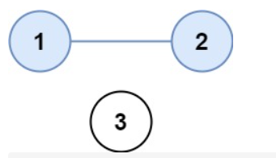
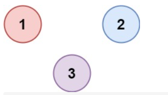

# Leetcode 题解 - 搜索
<!-- GFM-TOC -->
* [Leetcode 题解 - 搜索](#leetcode-题解---搜索)
    * [BFS](#bfs)
        * [1. 计算在网格中从原点到特定点的最短路径长度](#1-计算在网格中从原点到特定点的最短路径长度)
        * [2. 组成整数的最小平方数数量](#2-组成整数的最小平方数数量)
        * [3. 最短单词路径](#3-最短单词路径)
    * [DFS](#dfs)
        * [1. 查找最大的连通面积](#1-查找最大的连通面积)
        * [2. 矩阵中的连通分量数目](#2-矩阵中的连通分量数目)
        * [3. 好友关系的连通分量数目](#3-好友关系的连通分量数目)
        * [4. 填充封闭区域](#4-填充封闭区域)
        * [5. 能到达的太平洋和大西洋的区域](#5-能到达的太平洋和大西洋的区域)
    * [Backtracking](#backtracking)
        * [1. 数字键盘组合](#1-数字键盘组合)
        * [2. IP 地址划分](#2-ip-地址划分)
        * [3. 在矩阵中寻找字符串](#3-在矩阵中寻找字符串)
        * [4. 输出二叉树中所有从根到叶子的路径](#4-输出二叉树中所有从根到叶子的路径)
        * [5. 排列](#5-排列)
        * [6. 含有相同元素求排列](#6-含有相同元素求排列)
        * [7. 组合](#7-组合)
        * [8. 组合求和](#8-组合求和)
        * [9. 含有相同元素的组合求和](#9-含有相同元素的组合求和)
        * [10. 1-9 数字的组合求和](#10-1-9-数字的组合求和)
        * [11. 子集](#11-子集)
        * [12. 含有相同元素求子集](#12-含有相同元素求子集)
        * [13. 分割字符串使得每个部分都是回文数](#13-分割字符串使得每个部分都是回文数)
        * [14. 数独](#14-数独)
        * [15. N 皇后](#15-n-皇后)
<!-- GFM-TOC -->


深度优先搜索和广度优先搜索中，

## BFS

<div align="center">  </div><br>
广度优先搜索一层一层地进行遍历，每层遍历都是以上一层遍历的结果作为起点，遍历一个距离能访问到的所有节点。需要注意的是，遍历过的节点不能再次被遍历。DFS和BFS广泛运用于树和图。上图遍历结果，第一层：0 -\> {6,2,1,5}，第二层：.... ，每一层遍历的节点都与根节点距离相同。使用 **BFS 只能求解无权图的最短路径，无权图是指从一个节点到另一个节点的代价都记为 1。**

在程序实现 BFS 时需要考虑以下问题：

- 队列：用来存储每一轮遍历得到的节点；
- 标记：对于遍历过的节点，应该将它标记，防止重复遍历。

### 1. 二进制矩阵中的最短路径

中等：[1091. 二进制矩阵中的最短路径](https://leetcode-cn.com/problems/shortest-path-in-binary-matrix/))

```html
矩阵只包含0和1，计算从矩阵左上角到右下角的路径长度(指单元格总数)，路径中单元格值只能是1，且有8个方向。
输入：grid = [[1,0,0],[1,1,0],[1,1,0]]	输出：-1 	路径不存在则返回 -1
输入：grid = [[0,0,0],[1,1,0],[1,1,0]]	输出：4	
```


```java
public int shortestPathBinaryMatrix(int[][] grid) {			//BFS
    int n = grid.length,m = grid[0].length;
    if (grid[0][0] == 1 || grid[n - 1][m - 1] == 1) return -1;
    if (n == 1 && m == 1) return 1;
    int[] dx = new int[]{-1, -1, -1,  0, 0, 1, 1, 1};
    int[] dy = new int[]{-1,  0,  1, -1, 1,-1, 0, 1};
    grid[0][0] = 1;
    Queue<int[]> queue = new LinkedList<>();				
    queue.add(new int[]{0, 0});								//队列存的是一个点的坐标
    int count = 0;
    while (!queue.isEmpty()) {
        count++;
        int queueSize = queue.size();
        for (int i = 0; i < queueSize; i++) {				//一层的节点数处理完后
            int[] data = queue.poll();						//count++;
            if (data[0] == n - 1 && data[1] == m - 1) return count;
            for (int j = 0; j < 8; j++) {					//入队8个方向可能可行的坐标
                int x = data[0] + dx[j];
                int y = data[1] + dy[j];
                if (x >= 0 && x < n && y >= 0 && y < m && grid[x][y] == 0 ) {
                    queue.add(new int[]{x, y});
                    grid[x][y] = 1;							//标记
                }
            }
        }
    }
    return -1;
}
```

```java
或者说，new int[]{x, y} 这样的数据可以用 new Pair<>(nr, nc) 来存储。
Pair<Integer, Integer> 常用方法是 ：getKey()用于获取第一个值，getValue()用于获取第二个值
```

### 2. 组成整数的最小平方数数量

中等： [279. 完全平方数](https://leetcode-cn.com/problems/perfect-squares/)

```js
给你一个整数 n ，返回和为 n 的完全平方数(完全平方数比如 1, 4, 9...)的最少数量 。
输入：n = 12	输出：3 	解释：12 = 4 + 4 + 4	输入：n = 13	输出：2	解释：13 = 4 + 9
```

可以将每个整数看成**图**中的一个节点，如果两个整数之差为一个平方数，那么这两个整数所在的节点就有一条边。

要求解最小的平方数数量，就是求解从节点 n 到节点 0 的最短路径。动态规划解法在动态规划篇中会再次出现。

```java
public int numSquares(int n) {						//BFS：队列+Book数组，21ms 92%，比官解快
    ArrayList<Integer> squares = new ArrayList<>(); //生成 n 以内的平方数序列
    for (int i = 1; i * i <= n; ++i) squares.add(i * i);
    Queue<Integer> queue = new LinkedList<>();
    boolean[] marked = new boolean[n + 1];
    queue.add(n);									//例如：7入队，应返回4，解释：1+1+1+4
    marked[n] = true;								
    int level = 0;
    while (!queue.isEmpty()) {	
        level++;									
        //int size = queue.size();  while (size-- > 0) {}		//可行
        //for(int i=0;i<queue.size();i++){}						//不可行
        for(int i = queue.size(); i > 0; i--){					//可行
            int cur = queue.poll();								//注意：因为这里还要poll出去
            for (int s : squares) {					//平方数：1,4
                int next = cur - s;					//7:7-1=6  7-4=3
                if (next < 0) break;				//6:6-1=5  6-4=2，3:3-1=2  3-4<0
                if (next == 0) return level;		//5:5-1=4  4-4=1，2:2-1=1  2-4<0
                if (marked[next]) continue;			//最后一回合：4:4-1=3  4-4=0
                marked[next] = true;				//6,3		或者说 1:1-1=0
                queue.add(next);					//6,3。 5,2。 4,1。
            }
        }
    }
    return n;
}
```

```java
public int numSquares(int n) {					//用Set来当队列，但是实际较慢46ms 40%
    ArrayList<Integer> squares = new ArrayList<>();
    for (int i = 1; i * i <= n; ++i) squares.add(i * i);
    Set<Integer> queue = new HashSet<>();
    queue.add(n);
    int level = 0;
    while (queue.size() > 0) {
        level++;
        Set<Integer> tem = new HashSet<>();		//相当于一个滚动Set
        for (Integer diff : queue) {
            for (Integer square : squares) {
                if (diff.equals(square)) return level;
                else if (diff < square) break;
                else tem.add(diff - square);
            }
        }
        queue = tem;
    }
    return level;
}
```

### 3. 最短单词路径

困难： [127. 单词接龙](https://leetcode-cn.com/problems/word-ladder/)

```js
找出一条从 beginWord 到 endWord 的最短路径，每次移动规定为改变一个字符，并且改变之后的字符串必须在 wordList 中。

输入：beginWord = "hit", endWord = "cog", wordList = ["hot","dot","dog","lot","log","cog"]
输出：5  	解释：一个最短转换序列是 "hit" -> "hot" -> "dot" -> "dog" -> "cog", 返回它的长度 5。一次只能改变一个字母，即：i变成o，h变成d，t变成g，d变成c

输入：beginWord = "hit", endWord = "cog", wordList = ["hot","dot","dog","lot","log"]
输出：0	解释：endWord "cog" 不在字典中，所以无法进行转换。
```

- 无向图中两个顶点之间的最短路径的长度，可以通过广度优先遍历得到；
- 为什么 BFS 得到的路径最短？可以把起点和终点所在的路径拉直来看，两点之间线段最短；
- 已知目标顶点的情况下，可以分别从起点和目标顶点（终点）执行广度优先遍历，直到遍历的部分有交集，是双向广度优先遍历的思想。

### todo

参考： [广度优先遍历、双向广度优先遍历 - 单词接龙)](https://leetcode-cn.com/problems/word-ladder/solution/yan-du-you-xian-bian-li-shuang-xiang-yan-du-you-2/) 

```java
public int ladderLength(String beginWord, String endWord, List<String> wordList) {
    wordList.add(beginWord);					//1000+ms
    int N = wordList.size();
    int start = N - 1;
    int end = 0;
    while (end < N && !wordList.get(end).equals(endWord)) end++;
    if (end == N) return 0;
    List<Integer>[] graphic = buildGraphic(wordList);
    return getShortestPath(graphic, start, end);
}

private List<Integer>[] buildGraphic(List<String> wordList) {
    int N = wordList.size();
    List<Integer>[] graphic = new List[N];
    for (int i = 0; i < N; i++) {
        graphic[i] = new ArrayList<>();
        for (int j = 0; j < N; j++) {
            if (isConnect(wordList.get(i), wordList.get(j))) 
                graphic[i].add(j);
        }
    }
    return graphic;
}

private boolean isConnect(String s1, String s2) {
    int diffCnt = 0;
    for (int i = 0; i < s1.length() && diffCnt <= 1; i++) 
        if (s1.charAt(i) != s2.charAt(i)) diffCnt++;
    return diffCnt == 1;
}

private int getShortestPath(List<Integer>[] graphic, int start, int end) {
    Queue<Integer> queue = new LinkedList<>();
    boolean[] marked = new boolean[graphic.length];
    queue.add(start);
    marked[start] = true;
    int path = 1;
    while (!queue.isEmpty()) {
        int size = queue.size();
        path++;
        while (size-- > 0) {
            int cur = queue.poll();
            for (int next : graphic[cur]) {
                if (next == end) return path;
                if (marked[next]) continue;
                marked[next] = true;
                queue.add(next);
            }
        }
    }
    return 0;
}
```

## DFS

<div align="center">  </div><br>
深度优先搜索在得到一个新节点时立即对新节点进行遍历：从节点 0 出发开始遍历，得到到新节点 6 时，立马对新节点 6 进行遍历，得到新节点 4；如此反复以这种方式遍历新节点，直到没有新节点了，此时返回。返回到根节点 0 的情况是，继续对根节点 0 进行遍历，得到新节点 2，然后继续以上步骤。

从一个节点出发，使用 DFS 对一个图进行遍历时，能够遍历到的节点都是从初始节点可达的，DFS 常用来求解这种   **可达性**   问题。

在程序实现 DFS 时需要考虑以下问题：

- 栈：用栈来保存当前节点信息，当遍历新节点返回时能够继续遍历当前节点。可以使用递归栈。
- 标记：和 BFS 一样同样需要对已经遍历过的节点进行标记。

### 1. 岛屿的最大面积

中等： [695. 岛屿的最大面积](https://leetcode-cn.com/problems/max-area-of-island/)

```js
求各个岛屿中最大的一个面积，而不是岛屿个数，岛屿只能包含水平或垂直的四个方向的 1 。
输入：	  [[1,1,0,0,0],
         [1,1,0,0,0],
         [0,0,0,1,1],
         [0,0,0,1,1]]	输出：4
```

```java
public int maxAreaOfIsland(int[][] grid) {			//DFS
    int res = 0;									//c++是grid.size() 返回值就是长度
    for (int i = 0; i < grid.length; i++) 
        for (int j = 0; j < grid[i].length; j++) 
            if (grid[i][j] == 1) res = Math.max(res, dfs(i, j, grid));
    return res;
}

private int dfs(int i, int j, int[][] grid) {
    if (i < 0 || j < 0 || i >= grid.length || j >= grid[i].length
        || grid[i][j] == 0)  return 0; 

    grid[i][j] = 0;
    int s = 1;
    s += dfs(i + 1, j, grid);
    s += dfs(i - 1, j, grid);
    s += dfs(i, j + 1, grid);
    s += dfs(i, j - 1, grid);
    return s;
}
```

### 2. 岛屿数量

中等： [200. 岛屿数量](https://leetcode-cn.com/problems/number-of-islands/)	

```java
public int numIslands(char[][] grid) {			//DFS
    int count = 0;								//和岛屿的最大面积不同的是求岛屿的数量
    for(int i = 0; i < grid.length; i++) {		
        for(int j = 0; j < grid[0].length; j++) {
            if(grid[i][j] == '1'){
                dfs(grid, i, j);
                count++;
            }
        }
    }
    return count;
}
private void dfs(char[][] grid, int i, int j){
    if(i < 0 || j < 0 || i >= grid.length || j >= grid[0].length 
       || grid[i][j] == '0') return;
    grid[i][j] = '0';
    dfs(grid, i + 1, j);
    dfs(grid, i, j + 1);
    dfs(grid, i - 1, j);
    dfs(grid, i, j - 1);
}
```

```java
int[][] direction = {{0, 1}, {0, -1}, {1, 0}, {-1, 0}};		//递归迭代的函数提取写法
for (int[] d : direction) dfs(grid, i + d[0], j + d[1]);
```

扫描整个二维网格。如果一个位置为 1，则将其加入队列，开始进行广度优先搜索。在广度优先搜索的过程中，每个搜索到的 1 都会被重新标记为 0。直到队列为空，搜索结束。 最终岛屿的数量是进行广度优先搜索的次数。

```c
int numIslands(vector<vector<char>>& grid) {	//BFS
    int rlen = grid.size(),clen = grid[0].size();
    if (!rlen) return 0;
    int cnt = 0;
    queue<pair<int, int>> q;
    for (int r = 0; r < rlen; ++r) {
        for (int c = 0; c < clen; ++c) {		//扫描整个二维网格
            if (grid[r][c] == '1') {			
                grid[r][c] = '0';				//和1关联的都消灭掉
                ++cnt;							//并计数结果
                q.push({r, c});
                while (!q.empty()) {			//扩散4个方向为1的单元格
                    int r = q.front().first, c = q.front().second;
                    q.pop();
                    if (r - 1 >= 0 && grid[r-1][c] == '1') {
                        q.push({r-1, c});
                        grid[r-1][c] = '0';
                    }
                    if (r + 1 < rlen && grid[r+1][c] == '1') {
                        q.push({r+1, c});
                        grid[r+1][c] = '0';
                    }
                    if (c - 1 >= 0 && grid[r][c-1] == '1') {
                        q.push({r, c-1});
                        grid[r][c-1] = '0';
                    }
                    if (c + 1 < clen && grid[r][c+1] == '1') {
                        q.push({r, c+1});
                        grid[r][c+1] = '0';
                    }
                }
            }
        }
    }
    return cnt;
}
```

### 3. 好友关系的连通分量数目

中等：[547. 省份数量](https://leetcode-cn.com/problems/number-of-provinces/)

```js
题目描述：好友关系可看成是一个无向图，例第 0 个人与第 1 个人是好友，那么M[0][1]和M[1][0]的值都为 1。
输入 n * * 的矩阵，单元格为 1 表示第 i 个城市和第 j 个城市直接相连，单元格为 0 表示二者不直接相连。返回矩阵中 省份(多个互相连通的城市算1个城市) 的数量。
```

```
输入：[[1,1,0], 	输出：2	输入：[[1,0,0],	输出：3	输入：[[1,0,0,1], 输出：1
      [1,1,0],					  [0,1,0],					  [0,1,1,0],
      [0,0,1]]					  [0,0,1]]					  [0,1,1,1],
      														  [1,0,1,1]]
```

例1：例2、3：

```java
public int findCircleNum(int[][] isConnected) {			//isConnected 是无向图的邻接矩阵
    int n = isConnected.length;							//n 为无向图的顶点数量
    boolean[] visited = new boolean[n];					//标识的是行
    int cnt = 0;										//累计遍历过的连通域的数量
    for (int i = 0; i < n; i++) {
        if (!visited[i]) { 
            cnt++;
            dfs(i, isConnected, visited);
        }
    }
    return cnt;
}
private void dfs(int i, int[][] isConnected, boolean[] visited) {
    visited[i] = true;									//对当前顶点 i 进行访问标记
    for (int j = 0; j < isConnected.length; j++) {		//继续遍历与顶点 i 相邻的顶点
        if (isConnected[i][j] == 1 && !visited[j]) {	//递归的终止条件
            dfs(j, isConnected, visited);				//矩阵是 N*N 
        }
    }
}
```

todo：并查集经典解法： [DFS + BFS + 并查集，3 种方法计算无向图连通域数量 - 省份数量](https://leetcode-cn.com/problems/number-of-provinces/solution/dfs-bfs-bing-cha-ji-3-chong-fang-fa-ji-s-edkl/) 

### 4. 替换非边界相连的 O

中等： [130. 被围绕的区域](https://leetcode-cn.com/problems/surrounded-regions/)

```js
输入：[["X","X","X","X"],	输出：[["X","X","X","X"],
      ["X","O","O","X"],        ["X","X","X","X"],
      ["X","X","O","X"],        ["X","X","X","X"],
      ["X","O","X","X"]]        ["X","O","X","X"]]
解释：m x n 的矩阵 ，任何边界上的 'O' 都不会被填充为 'X'。 任何不在边界上，或不与边界上的 'O' 相连的 'O' 最终都会被填充为 'X'。水平或垂直方向相邻则是“相连”的。
```

思路：先把和边界4个方向相连接的所有 O 修改为字母 T，然后再全部遍历，等于T的变成O，等于O的变成X。

其他解法：DFS、并查集，参考： [130. 被围绕的区域 题解 - 力扣（LeetCode） (leetcode-cn.com)](https://leetcode-cn.com/problems/surrounded-regions/solution/bfsdi-gui-dfsfei-di-gui-dfsbing-cha-ji-by-ac_pipe/) 

```java
int r, c;										//全局的行、列
public void solve(char[][] board) {
    r = board.length;
    if (r == 0) return;
    c = board[0].length;
    for (int i = 0; i < r; i++) {				//最左和最右列
        dfs(board, i, 0);
        dfs(board, i, c - 1);
    }
    for (int j = 1; j < c - 1; j++) {			//第一行和最后一行，第二列到倒数第二列。
        dfs(board, 0, j);
        dfs(board, r - 1, j);
    }
    for (int i = 0; i < r; i++) {				//全部遍历
        for (int j = 0; j < c; j++) {
            if (board[i][j] == 'T')  board[i][j] = 'O';	
            else if (board[i][j] == 'O') board[i][j] = 'X';
        }
    }
}

public void dfs(char[][] board, int x, int y) { //这个方法把和边界相连通的换成 T
    if (x < 0 || x >= r || y < 0 || y >= c || board[x][y] != 'O') return;
    board[x][y] = 'T';							//常规4个方向的标记遍历
    dfs(board, x + 1, y);
    dfs(board, x - 1, y);
    dfs(board, x, y + 1);
    dfs(board, x, y - 1);
}
```

```c
const int dx[4] = {1, -1, 0, 0};				//c++ BFS 官解
const int dy[4] = {0, 0, 1, -1};
void solve(vector<vector<char>>& board) {
    int r = board.size();
    if (r == 0) return;
    int c = board[0].size();
    queue<pair<int, int> > q;					//存坐标
    for (int i = 0; i < r; i++) {				//处理行
        if (board[i][0] == 'O') q.emplace(i, 0);
        if (board[i][c - 1] == 'O') q.emplace(i, c - 1);
    }
    for (int i = 1; i < c - 1; i++) {			//处理列
        if (board[0][i] == 'O') q.emplace(0, i);
        if (board[r - 1][i] == 'O') q.emplace(r - 1, i);
    }
    while (!q.empty()) {						//queue存pair用emplace()，取用front().first
        int x = q.front().first, y = q.front().second;
        q.pop();								//删除用pop()
        board[x][y] = 'A';						//queue存pair也可以用q.push({r, c});
        for (int i = 0; i < 4; i++) {
            int rr = x + dx[i], cc = y + dy[i];
            if (rr < 0 || cc < 0 || rr >= r || cc >= c || board[rr][cc] != 'O') continue;
            q.emplace(rr, cc);					//边界关联的O的坐标都加进去
        }
    }
    for (int i = 0; i < r; i++) {
        for (int j = 0; j < c; j++) {
            if (board[i][j] == 'A') board[i][j] = 'O';			//A变O
            else if (board[i][j] == 'O') board[i][j] = 'X';		//O变X
        }
    }
}
```

### 5. 太平洋大西洋水流问题

中等： [417. 太平洋大西洋水流问题](https://leetcode-cn.com/problems/pacific-atlantic-water-flow/)

```js
m x n 的非负整数矩阵，水流只能按照上、下、左、右四个方向流动，且只能从高到低或者在同等高度上流动。
请找出那些水流既可以流动到“太平洋”，又能流动到“大西洋”的陆地单元的坐标。
输入：       太平洋 ~   ~   ~   ~   ~ 
               ~  1   2   2   3  (5) *
               ~  3   2   3  (4) (4) *
               ~  2   4  (5)  3   1  *
               ~ (6) (7)  1   4   5  *
               ~ (5)  1   1   2   4  *
                  *   *   *   *   * 大西洋
返回: [[0, 4], [1, 3], [1, 4], [2, 2], [3, 0], [3, 1], [4, 0]] (上图中带括号的单元).
```

思路是从海洋开始逆流，如果可以逆流到，就标记为1，然后再次遍历检查两个海洋都可以逆流到的区域。

BFS ，参考： [逆流 DFS 与 BFS - 太平洋大西洋水流问题 - 力扣（LeetCode） (leetcode-cn.com)](https://leetcode-cn.com/problems/pacific-atlantic-water-flow/solution/ni-liu-dfs-yu-bfs-by-fibonacciwh/) 

```java
int r, c;							 					 //定义成全局的，减少dfs函数的形参
int[][] matrix;
public List<List<Integer>> pacificAtlantic(int[][] matrix) {
    if (matrix.length == 0 || matrix[0].length == 0) return new ArrayList<>();
    this.r = matrix.length;
    this.c = matrix[0].length;
    this.matrix = matrix;
    int[][] tp = new int[r][c];      					 //太平洋可以逆流到记录表
    int[][] dx = new int[r][c];     				     //大西洋可以逆流到记录表
    
    //        for (int i = 0; i < r; i++) {				 //从海洋边界开始开始逆流
    //            for (int j = 0; j < c; j++) {
    //                if (i == 0 || j == 0) dfs( tp, i, j, matrix[i][j]);
    //                if (i == r - 1 || j == c - 1) dfs( dx, i, j, matrix[i][j]);
    //            }
    //        }

    for (int i = 0; i < r && i < c; i++) {				//上边的写法合并了一下
        dfs(tp, i, 0, matrix[i][0]);    				//最左列和最右列
        dfs(dx, i, c - 1, matrix[i][c - 1]);

        dfs(tp, 0, i, matrix[0][i]);    				//最上行和最下行
        dfs(dx, r - 1, i, matrix[r - 1][i]);
    }
    if (r > c) {           								//处理剩余行列
        for (int i = c; i < r; i++) {
            dfs(tp, i, 0, matrix[i][0]);     			//最左列和最右列
            dfs(dx, i, c - 1, matrix[i][c - 1]);
        }
    } else if (r < c) {
        for (int i = r; i < c; i++) {
            dfs(tp, 0, i, matrix[0][i]);           		//最上行和最下行
            dfs(dx, r - 1, i, matrix[r - 1][i]);
        }
    }
    List<List<Integer>> res = new ArrayList<>();
    for (int i = 0; i < r; i++) 
        for (int j = 0; j < c; j++) 
            if (tp[i][j] == 1 && dx[i][j] == 1) res.add(Arrays.asList(i, j));
    return res;
}
private void dfs(int[][] aux, int i, int j, int pre) {
    if (i < 0 || j < 0 || i > r - 1 || j > c - 1		//逆流过的，逆流不到的
        || aux[i][j] == 1 || matrix[i][j] < pre) return;
    aux[i][j] = 1;                              		//标记流到过了
    dfs(aux, i - 1, j, matrix[i][j]);					//传递当前值为 pre
    dfs(aux, i + 1, j, matrix[i][j]);
    dfs(aux, i, j - 1, matrix[i][j]);
    dfs(aux, i, j + 1, matrix[i][j]);
}
```

