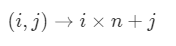
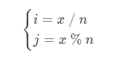
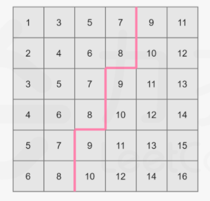
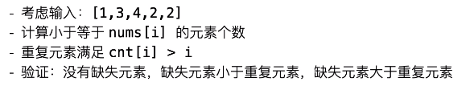
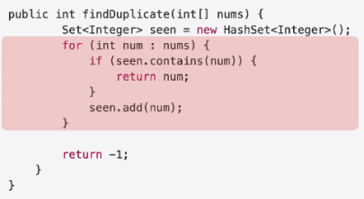
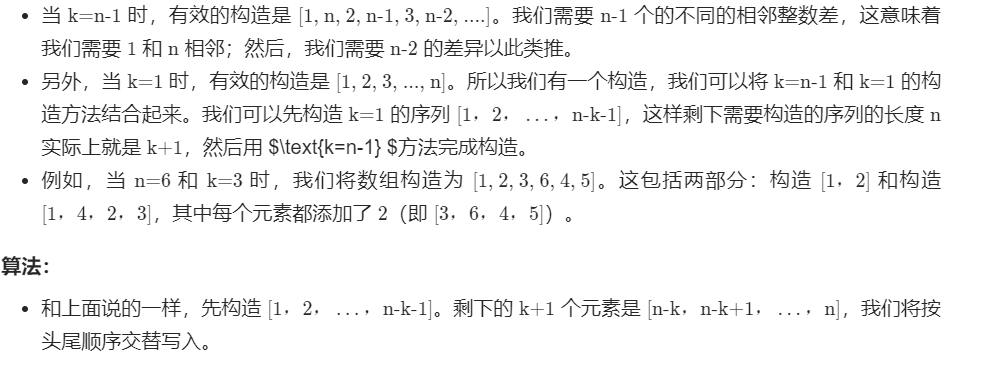
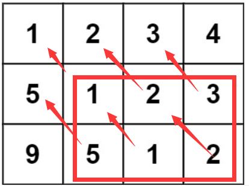
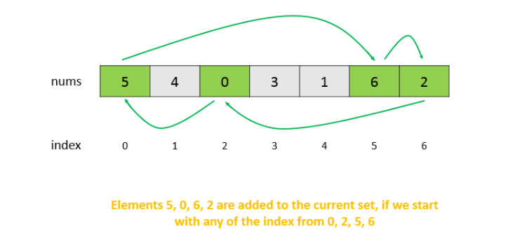

# Leetcode 题解 - 数组与矩阵
<!-- GFM-TOC -->
* [Leetcode 题解 - 数组与矩阵](#leetcode-题解---数组与矩阵)
    * [1. 把数组中的 0 移到末尾](#1-把数组中的-0-移到末尾)
    * [2. 改变矩阵维度](#2-改变矩阵维度)
    * [3. 找出数组中最长的连续 1](#3-找出数组中最长的连续-1)
    * [4. 有序矩阵查找](#4-有序矩阵查找)
    * [5. 有序矩阵的 Kth Element](#5-有序矩阵的-kth-element)
    * [6. 一个数组元素在 [1, n] 之间，其中一个数被替换为另一个数，找出重复的数和丢失的数](#6-一个数组元素在-[1-n]-之间，其中一个数被替换为另一个数，找出重复的数和丢失的数)
    * [7. 找出数组中重复的数，数组值在 [1, n] 之间](#7-找出数组中重复的数，数组值在-[1-n]-之间)
    * [8. 数组相邻差值的个数](#8-数组相邻差值的个数)
    * [9. 数组的度](#9-数组的度)
    * [10. 对角元素相等的矩阵](#10-对角元素相等的矩阵)
    * [11. 嵌套数组](#11-嵌套数组)
    * [12. 分隔数组](#12-分隔数组)
<!-- GFM-TOC -->


## 1. 把数组中的 0 移到末尾

简单：[283. 移动零](https://leetcode-cn.com/problems/move-zeroes/)

```js
给定一个数组 nums，编写一个函数将所有 0 移动到数组的末尾，同时保持非零元素的相对顺序。
输入: [0,1,0,3,12] 输出: [1,3,12,0,0] 说明:必须在原数组上操作，不能拷贝额外的数组。尽量减少操作次数。
```

```java
public void moveZeroes(int[] nums) {	//下边两个都是O(N)时间复杂度
    int idx = 0;						//单指针
    for (int num : nums) 				//把非0值的，前移，从下标0往后依次赋值。
        if (num != 0) nums[idx++] = num;
    while (idx < nums.length) 			//把是0值的，以及后边的全都赋值为0。
        nums[idx++] = 0;
}
```

```java
public void moveZeroes(int[] nums) {		// 这个遍历的要少一些。
    if(nums==null) return;					// 也是单指针
    int j = 0;								// j指向前面的非零值
    for(int i=0;i<nums.length;i++) {		// i用来找j后边的非0值
        if(nums[i]!=0) {
            int tmp = nums[i];
            nums[i] = nums[j];
            nums[j++] = tmp;
        }
    }
}
```

## 2. 二维数组转一维数组

简单： [566. 重塑矩阵](https://leetcode-cn.com/problems/reshape-the-matrix/)

```js
输入: 
[[1,2],
 [3,4]]		r = 1, c = 4
输出: [[1,2,3,4]]

输入: 
[[1,2],
 [3,4]]		r = 2, c = 4
输出: 
[[1,2],
 [3,4]]
解释:没有办法将 2 * 2 矩阵转化为 2 * 4 矩阵。 所以输出原矩阵。
```

- 时间复杂度：O(rc)。空间复杂度：O(1)。

思路：将二维数组转化为一位数组



同样地，我们可以将整数 x 映射回其在矩阵中的下标，即 



```java
public int[][] matrixReshape(int[][] nums, int r, int c) {
    int m = nums.length, n = nums[0].length;
    if (m * n != r * c) return nums;				//做个小校验
    int[][] ret = new int[r][c];
    int idx = 0;									//代表转化为一维数组的下标指针
    for (int i = 0; i < r; i++) {
        for (int j = 0; j < c; j++) {
            ret[i][j] = nums[idx / n][idx % n];		//映射返回。
            idx++;
        }
    }
    return ret;
}
```

## 3. 找出数组中最长的连续 1

简单：[485. 最大连续 1 的个数](https://leetcode-cn.com/problems/max-consecutive-ones/)

```js
输入：[1,1,0,1,1,1]  输出：3   输入的数组只包含 0 和 1 。输入数组的长度是正整数，且不超过 10,000。
```

```java
public int findMaxConsecutiveOnes(int[] nums) {//动态规划(推荐)
    int max = 0, cur = 0;
    for (int x : nums) {
        cur = x == 0 ? 0 : cur + 1;
        max = Math.max(max, cur);
    }
    return max;
}
```

```java
public int findMaxConsecutiveOnes(int[] nums) {//双指针
    int max = 0, l = 0, r = 0, n = nums.length;
    while (r < n) {
        if (nums[r] == 1) {
            r++;
        } else {
            max = Math.max(max, r - l);
            r++;		//这里，如果r++后边还不是1，l就一直跟随他，l是指向第一个1的。
            l = r;		//绕一点...
        }
    }
    return Math.max(max, r - l);	//最后再处理一次。
}
```

## 4. 有序矩阵中查找值

中等： [[240. 搜索二维矩阵 II](https://leetcode-cn.com/problems/search-a-2d-matrix-ii/)](https://leetcode-cn.com/problems/search-a-2d-matrix-ii/description/)

```java
public boolean searchMatrix(int[][] matrix, int target) {
    if (matrix == null || matrix.length == 0 || matrix[0].length == 0) return false;
    int m = matrix.length, n = matrix[0].length;
    int row = 0, col = n - 1;								//从右上角开始
    while (row < m && col >= 0) {							//从左下角开始也是可以的。
        if (target == matrix[row][col]) return true;
        else if (target < matrix[row][col]) col--;
        else row++;
    }
    return false;
}
```

## 5. 有序矩阵的 Kth 

中等：[378. 有序矩阵中第 K 小的元素](https://leetcode-cn.com/problems/kth-smallest-element-in-a-sorted-matrix/)

```js
matrix中的所有行和列都按 非递减顺序 排列，查找整个矩阵排序后的第k小元素。
```



```java
public int kthSmallest(int[][] matrix, int k) {//二分查找解法
    int m = matrix.length, n = matrix[0].length;
    int lo = matrix[0][0], hi = matrix[m - 1][n - 1];
    while (lo <= hi) {
        int mid = lo + (hi - lo) / 2;
        int cnt = 0;
        for (int i = 0; i < m; i++) {
            for (int j = 0; j < n && matrix[i][j] <= mid; j++) {
                cnt++;
            }
        }
        if (cnt < k) lo = mid + 1;
        else hi = mid - 1;			//另一种是 while (lo < hi)，然后hi = mid;也能过。
    }
    return lo;						
}
```

疑惑：怎么证明lo最后一定是数组中出现过的数，虽然想到的用例都能恰好是。

而如果是 else if( cnt > k ) hi = mid - 1;		else if( cnt== k )  return mid;		

 [[1,5,9],[10,11,13],[12,13,15]] 	

输出： 14 ，这个值原矩阵没有，但是正确结果是13

官方的题解最优但是计算 cnt 更不好懂

```java
public int kthSmallest(int[][] matrix, int k) {//堆解法
    int m = matrix.length, n = matrix[0].length;
    PriorityQueue<Tuple> pq = new PriorityQueue<Tuple>();
    for(int j = 0; j < n; j++) pq.offer(new Tuple(0, j, matrix[0][j]));
    for(int i = 0; i < k - 1; i++) { // 小根堆，去掉 k - 1 个堆顶元素，此时堆顶元素就是第 k 的数
        Tuple t = pq.poll();
        if(t.x == m - 1) continue;
        pq.offer(new Tuple(t.x + 1, t.y, matrix[t.x + 1][t.y]));
    }
    return pq.poll().val;
}

class Tuple implements Comparable<Tuple> {
    int x, y, val;
    public Tuple(int x, int y, int val) { this.x = x; this.y = y; this.val = val; }
    @Override
    public int compareTo(Tuple that) { return this.val - that.val; }
}
```

排序方法：转换为一维数组，然后排序。

- 时间：N\*N\*logN。对数里的N*N约掉了。
- 空间：N\*N

## 6. 找重复和丢失的数字

简单： [645. 错误的集合](https://leetcode-cn.com/problems/set-mismatch/)

```js
集合 s 包含从 1 到  的整数。请你找出重复出现的整数，再找到丢失的整数，将它们以数组的形式返回。
输入：nums = [1,2,2,4]	 nums = [1,1]	[2, 2]	[3,2,2]	[2,3,2]	[3,3,1]	
输出：[2,3]			 [1,2]			[2, 1]	[2,1]	[2,1]	[3,2]
```

计数法：先遍历一遍计次，检查 1 到 n 的每个数字在 map 中出现次数。如果一个数字在 map 中没有出现，它就是缺失数字。如果一个数字的出现了两次，它就是重复数字。

```java
public int[] findErrorNums(int[] nums) { //计数方法：时间、空间：O(N) //Map计数（推荐）
    Map <Integer,Integer> map = new HashMap();
    int dup = -1, missing = 1;
    for (int n: nums) map.put(n, map.getOrDefault(n, 0) + 1);
    for (int i = 1; i <= nums.length; i++) {
        if (map.containsKey(i)) {
            if (map.get(i) == 2) dup = i;
        } else missing = i;
    }
    return new int[]{dup, missing};
}
```

可以对数组排序。本题可以通过交换数组元素，使得数组上的元素在正确的位置上解决，O(N) 的时间复杂度。

```java
public int[] findErrorNums(int[] nums) {
    int dup = -1, missing = 1;
    for (int n: nums) {							// 数组是乱序的，这个循环找重复的值
        if (nums[Math.abs(n) - 1] < 0)			// 访问到那个重复数字时。[-1,3,-3]
            dup = Math.abs(n);					// 或者说 [-1,-2,2,4]
        else
            nums[Math.abs(n) - 1] *= -1;		// 第一次访问，没小于0的都变为相反数。
    }											// *= 这个符号中间不能有空格。
    for (int i = 1; i < nums.length; i++) {		// 数组里没0这个元素
        if (nums[i] > 0)						// nums[1]>0 或者说 nums[2]>0
            missing = i + 1;					// 元素值等于索引值1,加1 或者2+1=3
    }
    return new int[]{dup, missing};				// 返回[3,2] 或者 [2, 3]
}
```

```java
public int[] findErrorNums(int[] nums) {//交换
    for (int i = 0; i < nums.length; i++) 
        while (nums[i] != i + 1 && nums[nums[i] - 1] != nums[i]) 
            swap(nums, i, nums[i] - 1);
    for (int i = 0; i < nums.length; i++) 
        if (nums[i] != i + 1) return new int[]{nums[i], i + 1};
    return null;
}
private void swap(int[] nums, int i, int j) {
    int tmp = nums[i];
    nums[i] = nums[j];
    nums[j] = tmp;
}
```

## 7. 找出数组中重复的数

中等：[287. 寻找重复数](https://leetcode-cn.com/problems/find-the-duplicate-number/)

```js
数字都在 1 到 n 之间（包括 1 和 n），假设 nums 只有 一个重复的整数 ，找出 这个重复的数 。
输入：nums = [1,3,4,2,2] 输出：2 	输入：nums = [3,1,3,4,2] 输出：3
nums.length == n + 1	1 <= nums[i] <= n
进阶：#数组只能读 所以不能排序,不能swap数组下标。要求：时间复杂度小于 O(n^2)，空间复杂度 O(1)
```

双指针解法，类似于有环链表中找出环的入口：

```java
public int findDuplicate(int[] nums) {
    int slow = nums[0], fast = nums[nums[0]];
    while (slow != fast) {
        slow = nums[slow];
        fast = nums[nums[fast]];
    }
    fast = 0;
    while (slow != fast) {
        slow = nums[slow];
        fast = nums[fast];
    }
    return slow;
}
```

二分查找解法：分析，输入：[1，3，4，2，2]，列出每个数字的 cnt 值

| nums |  1   |  2   |  3   |  4   |
| :--: | :--: | :--: | :--: | :--: |
| cnt  |  1   |  3   |  4   |  5   |



主要利用 nums = [1,3,4,2,2] 的值都在 1 和 n 之间。下边是例子过程。

```js
二分示例1 :下边这个版本的
arr = [1,3,4,2,2] 此时数字在 1 — 5 之间

mid = (1 + 5) / 2 = 3 arr小于等于的3有4个(1,2,2,3)，1到3中肯定有重复的值
mid = (1 + 2) / 2 = 1 arr小于等于的1有1个(1)
mid = (2 + 2) / 2 = 2 arr小于等于的2有1个(3)，2到2中肯定有重复的值
mid = (2 + 1) 退出，所以重复的数是 2 
```

```java
public int findDuplicate(int[] nums) {
    int l = 1, h = nums.length - 1;     		   //l也可以从0开始	
    while (l <= h) {
        int mid = l + (h - l) / 2;
        int cnt = 0;
        for (int i = 0; i < nums.length; i++) {   //利用cnt间接有序，不需要排序
            if (nums[i] <= mid) cnt++;
        }
        if (cnt > mid) h = mid - 1;   			  //找cnt > mid情况下的最小的mid
        else l = mid + 1;
    }
    return l;
}
```

```js
二分示例2 :下边这个版本的
arr = [1,3,4,2,2] 此时数字在 1 — 5 之间

mid = (1 + 5) / 2 = 3 arr小于等于的3有4个(1,2,2,3)，1到3中肯定有重复的值
mid = (1 + 3) / 2 = 2 arr小于等于的2有3个(1,2,2)，1到2中肯定有重复的值
mid = (1 + 2) / 2 = 1 arr小于等于的1有1个(1)，2到2中肯定有重复的值
所以重复的数是 2 
```

````java
public int findDuplicate(int[] nums) {
    int l = 1, h = nums.length-1;    
    while (l < h) {					//区别1
        int mid = l + (h - l) / 2;
        int cnt = 0;
        for (int i = 0; i < nums.length; i++) { 
            if (nums[i] <= mid) cnt++;
        }
        if (cnt > mid) h = mid;     //区别2
        else l = mid + 1;			//区别3
    }
    return l;
}
````

哈希表法：双O(N) 不是进阶解法



## 8. 构造差值数组

中等：[667. 优美的排列 II](https://leetcode-cn.com/problems/beautiful-arrangement-ii/)

```js
题目描述：数组元素为 1~n 的整数，要求构建数组，使得相邻元素的差值不相同的个数为 k。如果存在多种答案，你只需实现并返回其中任意一种.

输入: n = 3, k = 1	输出: [1, 2, 3]
解释: [1, 2, 3] 包含 3 个范围在 1-3 的不同整数， 并且 差值[1, 1] 中有且仅有 1 个不同整数 : 1
 
输入: n = 3, k = 2	输出: [1, 3, 2]
解释: [1, 3, 2] 包含 3 个范围在 1-3 的不同整数， 并且 差值[2, 1] 中有且仅有 2 个不同整数: 1 和 2
```

```js
找规律的思路：思路分析： 这道题就是找规律吧。
当n = 50， k = 20时：
[1,21,2,20,3,19,4,18,5,17,6,16,7,15,8,14,9,13,10,12,11,22,23,24,25,26,27,28,29,30,31,32,33,34,35,36,37,38,39,40,41,42,43,44,45,46,47,48,49,50]
当n = 50，k = 17时：
[1,18,2,17,3,16,4,15,5,14,6,13,7,12,8,11,9,10,19,20,21,22,23,24,25,26,27,28,29,30,31,32,33,34,35,36,37,38,39,40,41,42,43,44,45,46,47,48,49,50]
当n = 80，k = 30时：
[1,31,2,30,3,29,4,28,5,27,6,26,7,25,8,24,9,23,10,22,11,21,12,20,13,19,14,18,15,17,16,32,33,34,35,36,37,38,39,40,41,42,43,44,45,46,47,48,49,50,51,52,53,54,55,56,57,58,59,60,61,62,63,64,65,66,67,68,69,70,71,72,73,74,75,76,77,78,79,80]
发现了规律，就是下标从[0, k]中，偶数下标填充[1,2,3…]，奇数下标填充[k + 1, k, k - 1…]，后面[k + 1, n - 1]都是顺序填充
```

```java
public int[] constructArray(int n, int k) {	
    int[] resVec = new int[n];		 //比较恶心。
    int numK = k + 1, numTemp = 1;
    for (int i = 0; i <= k; i += 2)  //下标段[0, k]中，偶数下标填充[1,2,3..]
        resVec[i] = numTemp++;
    for (int i = 1; i <= k; i += 2)  //下标段[0, k]中，奇数下标填充[k + 1, k, k - 1...]
        resVec[i] = numK--;
    for (int i = k + 1; i < n; ++i)  //下标段[k + 1, n - 1]都是顺序填充
        resVec[i] = i + 1;
    return resVec;
}
```

官解的构造思路：



```java
public int[] constructArray(int n, int k) {
    int[] res = new int[n];
    for(int i = 1;i < n - k;i++){		//先构造出[1,2,3,...,n-k-1]
        res[i-1] = i;					//例如：[1,2]	即：n=6，k=3
    }
    int m = 1;
    int l = k+1;
    for(int i = n-k-1;i < n;i++){		//i=2，i<6，i++
        if((i-n-k-1) % 2 == 0){			//过过过。。。
            res[i] = m++; 
            res[i] += n-k-1;
        }else{
            res[i] = l--;
            res[i] += n-k-1;
        }
    }
    return res;
}
```

## 9. 度与最短连续子数组长度

简单： [697. 数组的度](https://leetcode-cn.com/problems/degree-of-an-array/)

```js
数组的度是指数组里任一元素出现频数的最大值。找到 nums 中有相同大小的度的最短连续子数组，返回其长度。
输入：[1, 2, 2, 3, 1] 输出：2
解释：是2，因为元素1和2的出现频数最大，均为2，1和2的连续子数组都找，两者中所有子数组中再取最短的，返回其长度。连续子数组里面拥有相同度的有如下所示:
[1, 2, 2, 3, 1], [1, 2, 2, 3], [2, 2, 3, 1], [1, 2, 2], [2, 2, 3], [2, 2]
最短连续子数组[2, 2]的长度为2，所以返回2.

输入：[1,2,2,3,1,4,2]	输出：6	解释：度是3，[2,2,3,1,4,2]，由下标6+1 - 下标1得到。
```

```java
public int findShortestSubArray(int[] nums) {			//易懂，慢。30ms。
    Map<Integer, Integer> map = new HashMap<>();		//计次
    Map<Integer, Integer> lstIdx = new HashMap<>();		//元素，元素首次出现的索引
    Map<Integer, Integer> fstIdx = new HashMap<>();		//元素，元素最后出现的索引
    int maxCnt = 0;
    for (int i = 0; i < nums.length; i++) {
        int num = nums[i];
        map.put(num, map.getOrDefault(num, 0) + 1);		  //计次
        maxCnt = Math.max(maxCnt, map.get(num));		  //统计出最大频率
        lstIdx.put(num, i);								  //维护元素最后索引位置
        if (!fstIdx.containsKey(num)) fstIdx.put(num, i); //维护元素首次索引位置
    }
    int ret = nums.length;
    for (int i = 0; i < nums.length; i++) {
        int num = nums[i];
        int cnt = map.get(num);
        if (cnt != maxCnt) continue;//找出最大度的元素，并刷新该度下元素的最短连续子数组长度值
        ret = Math.min(ret, lstIdx.get(num) + 1 - fstIdx.get(num));
    }
    return ret;
}
```

和上边思路一样，23ms，40%左右。

```java
public static int findShortestSubArray(int[] nums) {
    // key -> int[]{次数，key最小下标，key最大下标}
    Map<Integer, int[]> map = new HashMap<Integer, int[]>();
    int n = nums.length;
    int maxCnt = 0;
    for (int i = 0; i < n; i++) {
        if (map.containsKey(nums[i])) {				//存在更新频次和最后出现下标
            map.get(nums[i])[0]++;
            map.get(nums[i])[2] = i;
        } else {
            map.put(nums[i], new int[]{1, i, i}); 	//不存在更新频次和首次出现下标
        }
        maxCnt = Math.max(maxCnt, map.get(nums[i])[0]);
    }
    int ret = nums.length;	//或者 int最大值都可以。
    for (Map.Entry<Integer, int[]> entry : map.entrySet()) {
        int[] cur = entry.getValue();
        if (cur[0] != maxCnt) continue;
        ret = Math.min(ret, cur[2] + 1 - cur[1]);
    }
    return ret;
}
```

数组计数，由于已知值的范围是 `[0, 49999]`。 10ms，90%左右。

```java
int N = 50009;
public int findShortestSubArray(int[] nums) {
    int n = nums.length,max = 0;
    int[] cnt = new int[N],first = new int[N], last = new int[N];
    Arrays.fill(first, -1);
    for (int i = 0; i < n; i++) {
        int num = nums[i];
        max = Math.max(max, ++cnt[num]);		//更新次数和最大次数值
        if (first[num] == -1) first[num] = i;   //初始化为-1来判断有没有出现过
        last[num] = i;							//更新最后出现下标
    }
    int ret = Integer.MAX_VALUE;
    for (int i = 0; i < n; i++) {
        int num = nums[i];
        if (cnt[num] == max) ret = Math.min(ret, last[num] + 1 - first[num]);
    }
    return ret;
}
```

## 10. 对角元素相等的矩阵

简单： [766. 托普利茨矩阵](https://leetcode-cn.com/problems/toeplitz-matrix/)



```java
public boolean isToeplitzMatrix(int[][] matrix) {	//时间 O(M*N)
    int m = matrix.length, n = matrix[0].length;
    for (int i = 1; i < m; i++) 					//从右下角开始遍历
        for (int j = 1; j < n; j++) 
            if (matrix[i][j] != matrix[i - 1][j - 1]) return false;
    return true;
}
```

```java
public boolean isToeplitzMatrix(int[][] matrix) {	//递归
    for (int i = 0; i < matrix[0].length; i++) 
        if (!check(matrix, matrix[0][i], 0, i)) return false;
    for (int i = 0; i < matrix.length; i++) 
        if (!check(matrix, matrix[i][0], i, 0)) return false;
    return true;//所有元素都正常才返回最后的true
}
private boolean check(int[][] matrix, int expectValue, int row, int col) {
    if (row >= matrix.length || col >= matrix[0].length) return true;
    if (matrix[row][col] != expectValue) return false;
    return check(matrix, expectValue, row + 1, col + 1);	//斜着递进，1个元素正常返回true
}
```

## 11. 最长嵌套数组链

中等： [565. 数组嵌套](https://leetcode-cn.com/problems/array-nesting/)

```js
S[i] 表示一个集合，集合的第一个元素是 A[i]，第二个元素是 A[A[i]]，如此嵌套下去。求最大嵌套数组的 S[i]。
输入:[5,4,0,3,1,6,2] A[0] = 5, A[1] = 4, A[2] = 0, A[3] = 3, A[4] = 1, A[5] = 6, A[6] = 2.
其中一种最长的 S[K]:S[0] = {A[0], A[5], A[6], A[2]} = {5, 6, 2, 0}		因此输出: 4
```



```java
public int arrayNesting(int[] nums) {				//时间O(N) / 空间O(1)
    int res = 0;
    for (int i = 0; i < nums.length; i++) {			//这里的nums[i] == -1是优化的重点
        if (nums[i] == -1) continue;				//或者等价于 if(nums[i] != -1)
        int cur = nums[i];
        int cnt = 0;
        while (nums[cur] != -1) {					//或者弄一个布尔数组表示访问过的。
            int tem = cur;							//缓存cur
            cur = nums[cur];						//相当于更新了cur=cur.next
            nums[tem] = -1;							//把上一个节点相当于删除。
            cnt++;
        }
        res = Math.max(res, cnt);
    }
    return res;
}
```

```java
public int arrayNesting(int[] nums) { //暴力，不通过。
    int res = 0;
    for (int i = 0; i < nums.length; i++) {
        int start = nums[i], count = 0;
        do {
            count++;
            start = nums[start];
        }
        while (start != nums[i]);
        res = Math.max(res, count);
    }
    return res;
}
```

## 12. 分隔数组

中等： [769. 最多能完成排序的块](https://leetcode-cn.com/problems/max-chunks-to-make-sorted/)

```js
数组arr是[0, 1, ..., arr.length - 1]的一种排列，分隔数组，使得对每部分排序后数组就为有序。
输入: arr = [1,0,2,3,4] 	输出: 4		输入: arr = [4,3,2,1,0]	输出: 1
可以把它分成两块，例如 [1, 0], [2, 3, 4]。而分成 [1, 0], [2], [3], [4] 可以得到最多的块数。
if(Arrays.toString(arr).equals("[0, 2, 1]")) return 2;
if(Arrays.toString(arr).equals("[2, 0, 1]")) return 1;
if(Arrays.toString(arr).equals("[1, 0, 2]")) return 2;
```

```cpp
//当遍历到第i个位置时，如果可以切分为块，那前i个位置的最大值一定等于i。
//否则，一定有比i小的数划分到后面的块，那块排序后，一定不满足升序。
```

```java
public int maxChunksToSorted(int[] arr) {
    if (arr == null) return 0;	
    int ret = 0;
    int right = arr[0];
    for (int i = 0; i < arr.length; i++) {
        right = Math.max(right, arr[i]);		//统计前i个位置的最大元素
        if (right == i) ret++;
    }
    return ret;
}
```
