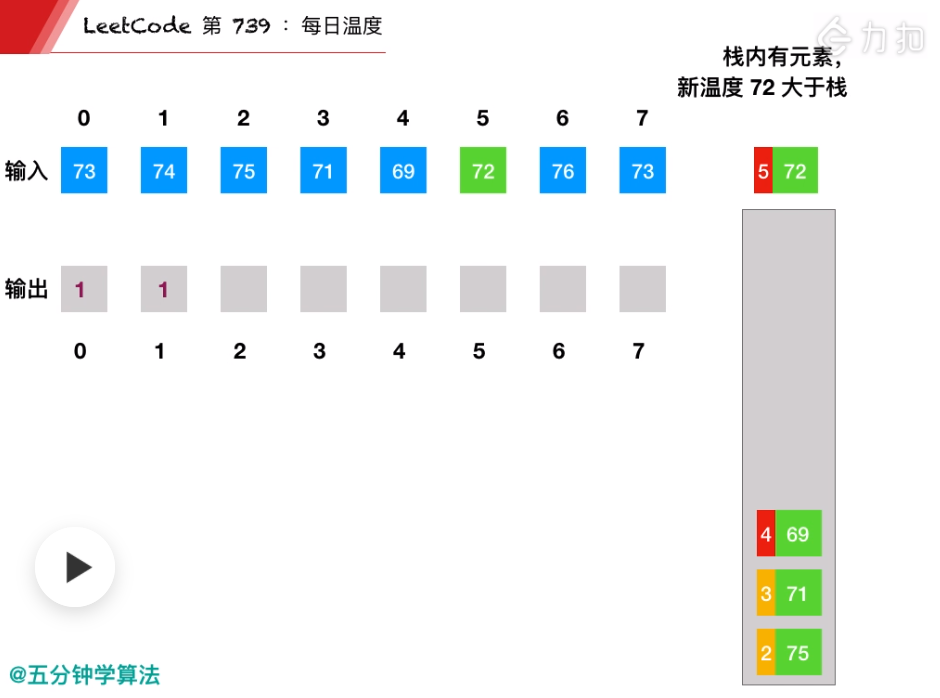
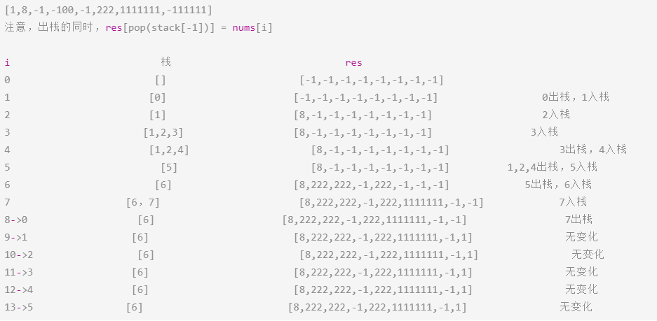

# Leetcode 题解 - 栈和队列
<!-- GFM-TOC -->
* [Leetcode 题解 - 栈和队列](#leetcode-题解---栈和队列)
    * [1. 用栈实现队列](#1-用栈实现队列)
    * [2. 用队列实现栈](#2-用队列实现栈)
    * [3. 最小值栈](#3-最小值栈)
    * [4. 用栈实现括号匹配](#4-用栈实现括号匹配)
    * [5. 数组中元素与下一个比它大的元素之间的距离](#5-数组中元素与下一个比它大的元素之间的距离)
    * [6. 循环数组中比当前元素大的下一个元素](#6-循环数组中比当前元素大的下一个元素)
<!-- GFM-TOC -->


## 1. 用栈实现队列

简单：[剑指 Offer 09. 用两个栈实现队列](https://leetcode-cn.com/problems/yong-liang-ge-zhan-shi-xian-dui-lie-lcof/)

```java
//一般不选用Stack作栈，而是选用LinkedList， 解释：
//Stack继承Vector接口，Vector底层是一个Object[]数组，且加同步锁，扩容慢。
//LinkedList实现了Deque接口，所以Stack能做的事LinkedList都能做,双向链表，扩容容易点。
LinkedList<Integer> in, out;
public CQueue() {
    in = new LinkedList<Integer>();
    out = new LinkedList<Integer>();
}
public void appendTail(int value) {
    in.addLast(value);
}
public int deleteHead() {
    if(!out.isEmpty()) 		return out.removeLast();
    if(in.isEmpty()) 		return -1;
    while(!in.isEmpty())	out.addLast(in.removeLast());
        
    return out.removeLast();
}
```

```java
public List<Integer> nums = new ArrayList<>();
public CQueue() {}
public void appendTail(int value) {nums.add(value);}
public int deleteHead() {
    if(nums.size() == 0) return -1;
    else return nums.remove(0);
}
```

```c++
class CQueue {
    stack<int> s1, s2;
public:
    void appendTail(int value) { s1.push(value); }
    int deleteHead() {
        if(s1.empty() && s2.empty())  return -1;  
        if(s2.empty()){
            while(!s1.empty()){
                s2.push(s1.top());
                s1.pop();
            }
        }
        int tmp = s2.top();//pop()返回值不能直接用来return，得用tem接一下
        s2.pop();
        return tmp;
    }
};
```

## 2. 用队列实现栈

简单：[225. 用队列实现栈](https://leetcode-cn.com/problems/implement-stack-using-queues/)

在将一个元素 x 插入队列时，为了维护原来的后进先出顺序，需要让 x 插入队列首部。而队列的默认插入顺序是队列尾部，因此在将 x 插入队列尾部之后，需要让除了 x 之外的所有元素出队列，再入队列。

核心点：就是在添加的时候，如果队列元素多余1，也就是>=2，那就将新添加元素前面的元素依次出队，再入队。这时，新添加的元素就跑到了队头。

```java
队列常用方法：
Queue<Integer> queue = new LinkedList<>();

queue.add(x); 
queue.peek(); 		// peek() ？？？是队列和栈都能通用的方法
queue.remove();		// 返回删除的元素，实际是删除 LinkedList 左边第一个
queue.size();
queue.isEmpty();
```

```java
private Queue<Integer> queue;
public MyStack() { queue = new LinkedList<>(); }

public void push(int x) {
    queue.add(x);
    int cnt = queue.size();
    while (cnt-- > 1) {				//1、2循环一次变成2、1，再次添加3，循环两次变成3、2、1
        queue.add(queue.remove());
    }
}
public int pop() { return queue.remove(); }
public int top() { return queue.peek(); }
public boolean empty() { return queue.isEmpty(); }
```

## 3. 最小值栈

简单： [面试题30. 包含min函数的栈](https://leetcode-cn.com/problems/bao-han-minhan-shu-de-zhan-lcof/)

```javascript
//定义栈的数据结构，请在该类型中实现一个能够得到栈的最小元素的 min 函数在该栈中.
//实现类中的方法,调用 min、push 及 pop 的时间复杂度都是 O(1)。
class MinStack {
    public MinStack() {}
    public void push(int x) {}
    public void pop() {}
    public int top() {}
    public int min() {}
}
```

对于实现最小值队列问题，可以先将队列使用栈来实现，然后就将问题转换为最小值栈。

```java
private Stack<Integer> dataStack = new Stack<>();
private Stack<Integer> minStack = new Stack<>();
public void push(int node) {
    dataStack.push(node);
    //注意这里的优化,也就是minStack空时候直接先放进去一个，之后有更小的值就放到栈顶。
    minStack.push(minStack.isEmpty() ? node : Math.min(minStack.peek(), node));
}
public void pop() {
    dataStack.pop();
    minStack.pop();
}
public int top() { return dataStack.peek(); }
public int min() { return minStack.peek(); }
```

```c++
stack<int> stk, stkl;
MinStack() {}				//stkl，单调栈
void push(int x) {
    stk.push(x);
    if(stkl.empty() || x <= stkl.top()) stkl.push(x);
}
void pop() {
    if(stk.top() == stkl.top()) stkl.pop();		//相等时要出去，维护单调栈
    stk.pop();
}
int top() { return stk.top(); }
int min() { return stkl.top(); }
```

## 4. 有效括号的匹配

简单： [20. 有效的括号](https://leetcode-cn.com/problems/valid-parentheses/)

```js
给定一个只包括 '('，')'，'{'，'}'，'['，']' 的字符串 s ，判断字符串是否有效。
有效字符串需满足：左括号必须用相同类型、以正确的顺序的右括号闭合。
输入：s = "()[]{}" 输出：true	 输入：s = "([)]" 输出：false 输入：s = "{[]}" 输出：true
```

```java
public boolean isValid(String s) {
    if (s.isEmpty()) return true;
    Stack<Character> stack = new Stack<>();
    for (char c : s.toCharArray()) {
        if (c == '(') stack.push(')');
        else if (c == '{') stack.push('}');
        else if (c == '[') stack.push(']');
        else if (stack.empty() || c != stack.pop())// stack.empty()处理情 "]"和空栈异常
            return false;
    }
    return stack.empty();
}
```

## 5. 下一个更大元素的距离

中等： [739. 每日温度](https://leetcode-cn.com/problems/daily-temperatures/)

```js
输出为：要想观测到更高的气温，至少需要等待的天数。如果气温在这之后都不会升高，请在该位置用 0 来代替。
Input: 	[73, 74, 75, 71, 69, 72, 76, 73] 
Output: [ 1,  1,  4,  2,  1,  1,  0,  0]
```

在遍历数组时用栈把数组中的数存起来，如果当前遍历的数比栈顶元素来的大，说明栈顶元素的下一个比它大的数就是当前元素。 [视频 - 每日温度 - 每日温度 - 力扣（LeetCode） (leetcode-cn.com)](https://leetcode-cn.com/problems/daily-temperatures/solution/mei-ri-wen-du-by-leetcode-solution/) 

题解：单调栈顺序遍历，栈里面存的是老元素的下标索引值。本题是  **递减栈** ：栈里只有递减元素。 

本题单调栈解决了求数组中元素与下一个比它大的元素之间的距离的问题。下图，单调递减栈，栈底元素最大。




```java
while (!stack.isEmpty()&& nums[curIndex] > nums[stack.peek()]) {}//单调递减栈
while (!stack.isEmpty()&& nums[curIndex] < nums[stack.peek()]) {}//单调递增栈
while (!stack.isEmpty()&& nums[curIndex] <= nums[stack.peek()]) {}//也可以不严格单调递增
```


图中下一个处理的是下标为2的75，处于代码中的while循环处。

最后的76、73都在栈里面，出不来了，是最后的默认值0。

```java
public int[] dailyTemperatures(int[] nums) {
    int n = nums.length;
    int[] ret = new int[n];
    Stack<Integer> stack = new Stack<>();//栈里面放元素的索引
    for (int curIdx = 0; curIdx < n; curIdx++) {
        while (!stack.isEmpty() && nums[curIdx] > nums[stack.peek()]) {
            int preIdx = stack.pop();
            ret[preIdx] = curIdx - preIdx;
        }
        stack.push(curIdx);
    }
    return ret;
}
```

```java
public int[] dailyTemperatures(int[] T) {  //暴力
    int len = T.length;
    int[] ret = new int[len];
    for (int l = 0; l < len; l++) {
        int cur = T[l];
        for (int r = l + 1; r < len; r++) {
            if (T[r] > cur) {
                ret[l] = r - l;
                break;
            }
        }
    }
    return ret;
}
```

## 6. 循环数组的下一个更大元素

中等：[503. 下一个更大元素 II](https://leetcode-cn.com/problems/next-greater-element-ii/)

```js
输入: [1,2,1]	输出: [2,-1,2]
解释: 第一个 1 的下一个更大的数是 2；数字 2 找不到下一个更大的数； 第二个 1 的需要循环搜索，结果也是 2。
```

与 739. Daily Temperatures (Medium) 不同的是，数组是循环数组，并且最后要求的不是距离而是下一个元素。



```java
public int[] nextGreaterElements(int[] nums) {
    int n = nums.length;
    int[] next = new int[n];
    Arrays.fill(next, -1);				//默认值弄好
    Stack<Integer> pre = new Stack<>();
    for (int i = 0; i < n * 2; i++) {	//第二轮处理下栈中残余的大值。
        int num = nums[i % n];
        while (!pre.isEmpty() && num > nums[pre.peek()]) {
            next[pre.pop()] = num;
        }
        if (i < n) pre.push(i);			//只第一轮添加,单调递减栈
    }
    return next;
}
```

- 求解算术表达式的结果（LeetCode 224、227、772、770)
- 求解直方图里最大的矩形区域（LeetCode 84）

[1673. Find the Most Competitive Subsequence](https://leetcode-cn.com/problems/find-the-most-competitive-subsequence/)

[496. 下一个更大元素 I](https://leetcode-cn.com/problems/next-greater-element-i/) 