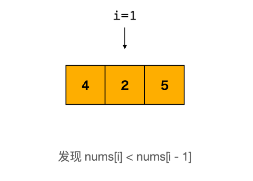
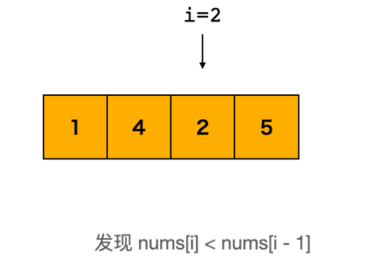
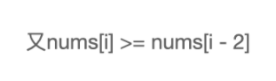
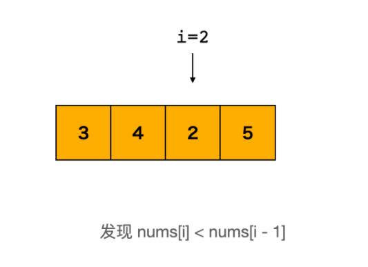

# Leetcode 题解 - 贪心思想
<!-- GFM-TOC -->
* [Leetcode 题解 - 贪心思想](#leetcode-题解---贪心思想)
    * [1. 分配饼干](#1-分配饼干)
    * [2. 不重叠的区间个数](#2-不重叠的区间个数)
    * [3. 投飞镖刺破气球](#3-投飞镖刺破气球)
    * [4. 根据身高和序号重组队列](#4-根据身高和序号重组队列)
    * [5. 买卖股票最大的收益](#5-买卖股票最大的收益)
    * [6. 买卖股票的最大收益 II](#6-买卖股票的最大收益-ii)
    * [7. 种植花朵](#7-种植花朵)
    * [8. 判断是否为子序列](#8-判断是否为子序列)
    * [9. 修改一个数成为非递减数组](#9-修改一个数成为非递减数组)
    * [10. 子数组最大的和](#10-子数组最大的和)
    * [11. 分隔字符串使同种字符出现在一起](#11-分隔字符串使同种字符出现在一起)
<!-- GFM-TOC -->


贪心：保证每次操作都是局部最优的，并且最后得到的结果是全局最优的。

## 1. 分配饼干

简单： [455. 分发饼干](https://leetcode-cn.com/problems/assign-cookies/)

```js
输入: g = [1,2,3], s = [1,1]	输出: 1	解释: g代笔每个孩子的胃口大小，s代笔每个饼干以及大小。
你有三个孩子和两块小饼干，3个孩子的胃口值分别是：1,2,3。目标是尽可能满足越多数量的孩子，并输出这个最大数值。虽然你有两块小饼干，由于他们的尺寸都是1，你只能让胃口值是1的孩子满足。所以你应该输出1。

输入: g = [1,2], s = [1,2,3]  输出: 2	解释: 拥有的饼干数量和尺寸都足以让所有孩子满足。所以输出2.
```

```java
public int findContentChildren(int[] grid, int[] size) {
    if (grid == null || size == null) return 0;
    Arrays.sort(grid);
    Arrays.sort(size);
    int g = 0, s = 0;	//g代笔每个孩子的胃口大小，s代笔每个饼干以及大小。
    while (g < grid.length && s < size.length) {	//孩子吃饱前，饼干发完前。
        if (grid[g] <= size[s]) g++;				//吃饱了换下一个孩子。
        s++;			//不管饼干是否能满足孩子，换下一个大饼干。会有饼干剩余。
    }
    return g;
}
```

## 2. 无重叠的区间

中等： [435. 无重叠区间](https://leetcode-cn.com/problems/non-overlapping-intervals/)

```js
移除区间部分区间，使剩余区间互不重叠，[1,2]和[2,3]算不重叠找到需要移除区间的#最小数量。
输入: [ [1,2], [2,3], [3,4], [1,3] ] 输出: 1 解释: 移除 [1,3] 后，剩下的区间没有重叠。
输入: [ [1,2], [1,2], [1,2] ]	输出: 2	解释: 移除两个 [1,2] 来使剩下的区间没有重叠。
```

**先计算最多能组成的不重叠区间个数，然后用区间总个数减去不重叠区间的个数。**

在每次选择中，区间的结尾最为重要，选择的区间结尾越小，留给后面的区间的空间越大，那么后面能够选择的区间个数也就越大。按区间的结尾进行排序，每次选择结尾最小，并且和前一个区间不重叠的区间。使用 lambda 表示式创建 Comparator 会导致算法运行时间过长，如果注重运行时间，可以用普通创建 Comparator 语句：

```java
Arrays.sort(intervals, new Comparator<int[]>() {
     @Override
     public int compare(int[] o1, int[] o2) {
         return (o1[1] < o2[1]) ? -1 : ((o1[1] == o2[1]) ? 0 : 1);
     }
});
```

实现 compare() 函数时避免使用 `return o1[1] - o2[1];` 这种减法操作，防止溢出。

```java
public int eraseOverlapIntervals(int[][] nums) {
    if (nums.length == 0) return 0;
    Arrays.sort(nums, Comparator.comparingInt(o -> o[1]));	//按照第二个升序排序
    int cnt = 1;
    int end = nums[0][1];
    for (int i = 1; i < nums.length; i++) {
        if (nums[i][0] < end) continue;//下一个数组的第一位可以等于、大于，上一个数组的第二位。
        end = nums[i][1];	
        cnt++;
    }
    return nums.length - cnt;
}
```

```c
int eraseOverlapIntervals(vector<vector<int>>& nums) {
    if (nums.empty())return 0;
    sort(nums.begin(), nums.end(), [](const auto& o1, const auto& o2) {
        return o1[1] < o2[1];										
    });
    int len = nums.size();
    int right = nums[0][1];
    int cnt = 1;
    for (int i = 1; i < len; ++i) {
        if (nums[i][0] >= right) {
            right = nums[i][1];
            ++cnt;
        }
    }
    return len - cnt;
}
```

```c
static bool cmp (const vector<int>& a, const vector<int>& b) {
    return a[1] < b[1];
}
sort(nums.begin(), nums.end(), cmp);		//排序也可以这样写
```

## 3. 用最少数量的箭引爆气球

中等： [452. 用最少数量的箭引爆气球](https://leetcode-cn.com/problems/minimum-number-of-arrows-to-burst-balloons/)

```js
输入：points = [[1,2],[3,4],[5,6],[7,8]] 		 输出：4
输入：points = [[1,2],[2,3],[3,4],[4,5]]  		 输出：2  解释：两支，x=2，x=4
输入：points = [[10,16],[2,8],[1,6],[7,12]]	 输出：2  求引爆所有气球所需的弓箭的最小数量。
解释：对于该样例，射一次 x = 6 的箭可以射爆 [2,8],[1,6] 两个气球，以及 x = 11 射爆另外两个气球。
```

```java
public int findMinArrowShots(int[][] nums) {
    if (nums.length == 0) return 0;//[1, 2] 和 [2, 3] 在本题中算是重叠区间
    Arrays.sort(nums, Comparator.comparingInt(o -> o[1]));
    int cnt = 1, end = nums[0][1];
    for (int i = 1; i < nums.length; i++) {
        if (nums[i][0] <= end) continue;
        cnt++;						//当前的比之前的end小的或者等于的，都可用1箭解决。
        end = nums[i][1];			//记录不重叠次数
    }
    return cnt;
}
```

## 4. 根据身高和序号重组队列

中等： [406. 根据身高重建队列](https://leetcode-cn.com/problems/queue-reconstruction-by-height/)

```js
[hi, ki] 表示第 i 个人的身高为 hi ，前面 正好 有 ki 个身高大于或等于 hi 的人。
输入：[[6,0],[5,0],[4,0],[3,2],[2,2],[1,4]]	输出：[[4,0],[5,0],[2,2],[3,2],[1,4],[6,0]]
输入：[[7,0],[4,4],[7,1],[5,0],[6,1],[5,2]]	输出：[[5,0],[7,0],[5,2],[6,1],[4,4],[7,1]]
编号为 0 的人身高为 5 ，没有身高更高或者相同的人排在他前面。
编号为 1 的人身高为 7 ，没有身高更高或者相同的人排在他前面。
编号为 2 的人身高为 5 ，有 2 个身高更高或者相同的人排在他前面，即编号为 0 和 1 的人。
编号为 3 的人身高为 6 ，有 1 个身高更高或者相同的人排在他前面，即编号为 1 的人。
编号为 4 的人身高为 4 ，有 4 个身高更高或者相同的人排在他前面，即编号为 0、1、2、3 的人。
编号为 5 的人身高为 7 ，有 1 个身高更高或者相同的人排在他前面，即编号为 1 的人。
```

为了使插入操作不影响后续的操作，身高较高的学生应该先做插入操作，否则身高较小的学生原先正确插入的第 k 个位置可能会变成第 k+1 个位置。身高 h 降序、个数 k 值升序，然后将某个学生插入队列的第 k 个位置中。

````java
解题思路：先排序再插入（先排队再插队）
1.排序规则：按照先H高度降序，H相同，按照K个数升序排序
2.遍历排序后的数组，根据K插入到K的位置上
核心思想：高个子先站好位，矮个子插入到K位置上，前面肯定有K个高个子，矮个子再插到前面也满足K的要求
// [7,0], [7,1], [6,1], [5,0], [5,2], [4,4]
// 再一个一个插入。
// [7,0]
// [7,0], [7,1]
// [7,0], [6,1], [7,1]
// [5,0], [7,0], [6,1], [7,1]
// [5,0], [7,0], [5,2], [6,1], [7,1]
// [5,0], [7,0], [5,2], [6,1], [4,4], [7,1]
````

```java
public int[][] reconstructQueue(int[][] people) {
    Arrays.sort(people, (o1, o2) -> o1[0] == o2[0] ? o1[1] - o2[1] : o2[0] - o1[0]);
    LinkedList<int[]> list = new LinkedList<>();
    for (int[] p : people)  list.add(p[1], p); 	 // add(int index, E element)
    return list.toArray(new int[list.size()][2]);//2不写也行。
}
```

```c
vector<vector<int>> reconstructQueue(vector<vector<int>>& nums) {
    sort(nums.begin(), nums.end(), [](const vector<int>& o1, const vector<int>& o2) {
        return o1[0] > o2[0] || (o1[0] == o2[0] && o1[1] < o2[1]);		
    });
    vector<vector<int>> ret;
    for(const vector<int>& num: nums) ret.insert(ret.begin() + num[1], num);
    return ret;
}
```

## 5. 一次交易的买卖股票

简单： [121. 买卖股票的最佳时机](https://leetcode-cn.com/problems/best-time-to-buy-and-sell-stock/)

```js
输入：[7,1,5,3,6,4]  输出：5	解释：只进行一次交易，求最大收益。最大利润 = 6-1 = 5 。
输入：[7,6,4,3,1]    输出：0  解释：在这种情况下, 没有交易完成, 所以最大利润为 0。
```

只要记录前面的最小价格，将这个最小价格作为买入价格，然后将当前的价格作为售出价格，查看当前收益是不是最大收益。

```java
public int maxProfit(int[] prices) {
    int n = prices.length;
    if (n == 0) return 0;
    int min = prices[0];
    int max = 0;
    for (int i = 1; i < n; i++) {
        min = Math.max(min, prices[i]);			//最好用if判断来找最值，Math函数性能低。
        max = Math.max(max, prices[i] - min);
    }
    return max;
}
```


## 6. 多次交易的买卖股票

简单：[122. 买卖股票的最佳时机 II](https://leetcode-cn.com/problems/best-time-to-buy-and-sell-stock-ii/)

```js
题目描述：可以进行多次交易，多次交易之间不能交叉进行，可以进行多次交易。
输入: [7,1,5,3,6,4]	输出: 7
解释: 第 2 天买入，第 3 天卖出, 利润 = 5-1 = 4 ，第 4 天买入，第 5 天卖出, 利润 = 6-3 = 3 。
输入: [1,2,3,4,5]		输出: 4	解释: 第 1 天买入，第 5 天卖出, 利润 = 5-1 = 4 。
注意不能在第 1 天和第 2 天接连购买股票，之后再将它们卖出。因为这样属于同时参与了多笔交易。
```

对于 [a, b, c, d]，如果有 a \<= b \<= c \<= d ，那么最大收益为 d - a。而 d - a = (d - c) + (c - b) + (b - a) ，因此当访问到一个 prices[i] 且 prices[i] - prices[i-1] \> 0，那么就把 prices[i] - prices[i-1] 添加到收益中。

```java
public int maxProfit(int[] prices) {
    int profit = 0;
    for (int i = 1; i < prices.length; i++) {
        if (prices[i] > prices[i - 1]) profit += (prices[i] - prices[i - 1]);
    }
    return profit;
}
```


## 7. 是否可间隔种下花朵

简单： [605. 种花问题](https://leetcode-cn.com/problems/can-place-flowers/)

```js
题目描述：数组中 1 表示已经种下了花朵。花朵之间至少需要一个单位的间隔，求解是否能种下 n 朵花。
输入：flowerbed = [1,0,0,0,1], n = 1	输出：true
输入：flowerbed = [1,0,0,0,1], n = 2	输出：false
```

```java
public boolean canPlaceFlowers(int[] flowerbed, int n) {
    int len = flowerbed.length;
    int cnt = 0;
    for (int i = 0; i < len && cnt < n; i++) {				//cnt < n 剪枝
        if (flowerbed[i] == 1) continue;
        int pre = i == 0 ? 0 : flowerbed[i - 1];			//防止一下开始下标越界。
        int next = i == len - 1 ? 0 : flowerbed[i + 1];		//防止一下末尾下标越界。
        if (pre == 0 && next == 0) {						//pre next 
            cnt++;
            flowerbed[i] = 1;								//cur
        }
    }
    return cnt >= n;
}
```

## 8. 判断是否为子序列

简单： [392. 判断子序列](https://leetcode-cn.com/problems/is-subsequence/)

```html
输入：s = "abc", t = "ahbgdc"	输出：true		输入：s = "axc", t = "ahbgdc"	输出：false
```

```java
public boolean isSubsequence(String s, String t) {
    int index = -1;
    for (char c : s.toCharArray()) {			//从0开始比对找，返回找到的下标。
        index = t.indexOf(c, index + 1);		//下回从新的下标往后找。
        if (index == -1) return false;			//找不到时，返回的是-1.
    }
    return true;
}
```

```java
public boolean isSubsequence(String s, String t) {	//双指针
    int n = s.length(), m = t.length();				//int n = s.length() 函数一样
    int i = 0, j = 0;
    while (i < n && j < m) {
        if (s.charAt(i) == t.charAt(j)) i++;		//s[i] == t[j] 索引访问字符
        j++;
    }
    return i == n;
}
```


```c
bool isSubsequence(string s, string t) {
    vector<vector<int>> dp(s.size() + 1, vector<int>(t.size() + 1, 0));
    for (int i = 1; i <= s.size(); i++) {
        for (int j = 1; j <= t.size(); j++) {
            if (s[i - 1] == t[j - 1]) dp[i][j] = dp[i - 1][j - 1] + 1;
            else dp[i][j] = dp[i][j - 1];
        }
    }	//编辑距离类题目的简单版，只涉及到减法。
    return dp[s.size()][t.size()] == s.size();
}
```

进阶： [对后续挑战的一些思考--如何快速判断大量字符串 t ](https://leetcode-cn.com/problems/is-subsequence/solution/dui-hou-xu-tiao-zhan-de-yi-xie-si-kao-ru-he-kuai-s/) 

## 9. 修改一个数成为非递减数组

简单： [665. 非递减数列](https://leetcode-cn.com/problems/non-decreasing-array/)

```js
判断一个数组是否能只修改一个数就成为非递减数组(nums[i] <= nums[i + 1])。
输入: nums = [4,2,3]	输出: true  解释: 4变成1		输入: nums = [4,2,1]	输出: false
```

在出现 nums[i] \< nums[i - 1] 时，需要考虑的是应该修改数组的哪个数，使得本次修改能使 i 之前的数组成为非递减数组，并且 **不影响后续的操作**。

**优先考虑令 nums[i - 1] = nums[i]，因为如果修改 nums[i] = nums[i - 1] 的话，那么 nums[i] 这个数会变大，就有可能比 nums[i + 1] 大，从而影响了后续操作。**

**还有一个比较特别的情况就是 nums[i] \< nums[i - 2]，修改 nums[i - 1] = nums[i] 不能使数组成为非递减数组，只能修改 nums[i] = nums[i - 1]。**

用例分析：第①个用例，我们可以 `把 4 调小到 <= 2` 或者 `把 2 调大到 4、5` ，使数组有序。 




第②个用例，我们可以 `把 4 调小到 1、2` 或者 `把 2 调大到 4、5` ，使数组有序。 






第③个用例，我们必须 `把 2 调大到 4、5`，才能使数组有序，我们不能把 4 调整为一个 `<= 2` 的数字，因为 4 前面的元素是 3. 




其实只是当发现有下降的时候，多判断了一次 `nums[i]` 和 `nums[i - 2]`，本身没那么难。 

只是判断是否只是存在一次非递增的思路是错误解法，会不通过测试用例 `[3,4,2,3]` 。仔细一想还真是，虽然该数组中只出现了一次下降，但是无论调整其中的一个数字都不能得到一个单调上升的数组。 

```java
public boolean checkPossibility(int[] nums) {
    int cnt = 0;						 //修改的次数
    for (int i = 1; i < nums.length && cnt < 2; i++) {
        if (nums[i] >= nums[i - 1]) continue;
        cnt++;
        if (i - 2 >= 0 && nums[i] < nums[i - 2]) nums[i] = nums[i - 1];
		else nums[i - 1] = nums[i];		 //一般情况
    }
    return cnt <= 1;
}
```

## 10. 连续子数组最大的和

简单：[53. 最大子序和](https://leetcode-cn.com/problems/maximum-subarray/)

```js
输入：[-2,1,-3,4,-1,2,1,-5,4]	输出：6	解释：连续子数组 [4,-1,2,1] 的和最大，为 6 。
输入：nums = [-1]	输出：-1	解释：子数组最少包含一个元素
```

```java
public int maxSubArray(int[] nums) {		//贪心
    if (nums == null || nums.length == 0) return 0;
    int preSum = nums[0];
    int maxSum = preSum;
    for (int i = 1; i < nums.length; i++) {
        preSum = preSum > 0 ? preSum + nums[i] : nums[i];	//累加和还大于0就继续累加
        maxSum = Math.max(maxSum, preSum);
    }
    return maxSum;
}
```

```c
int maxSubArray(vector<int> &nums){			//dp
    int dp(nums[0]),ret = dp,len = int(nums.size());
    for (int i = 1; i < len; i++){
        dp = max(dp + nums[i], nums[i]);
        ret = max(ret, dp);
    }
    return ret;
}
```

## 11. 分隔字符串使同种字符出现在一起

中等：[763. 划分字母区间](https://leetcode-cn.com/problems/partition-labels/)

```js
输入：S = "ababcbacadefegdehijhklij"
输出：[9,7,8] 解释：把字符串划分为尽可能多的片段，同一字母最多出现在一个片段中。
[9,7,8] 代表每个字符串片段的长度的列表，指代 "ababcbaca", "defegde", "hijhklij"。
```

```java
public List<Integer> partitionLabels(String S) {
    int[] mp = new int[26];    		  //char -> char在S中最后一次出现的索引
    int len = S.length();			  //3ms 94%
    List<Integer> subList = new ArrayList<>();
    int start = 0, end = 0;			  //start、end来存放起始和结束下标
    for (int i = 0; i < len; i++) {
        mp[S.charAt(i) - 'a'] = i;    //存储每个字母最后的位置
    }
    for (int i = 0; i < len; i++) {   //"ababcbaca", "defegde", "hijhklij"
        end = Math.max(end, mp[S.charAt(i) - 'a']);
        if (end == i) {				  //说明所有的重复元素到此截止
            subList.add(end + 1 - start);	
            start = end + 1;		  //9、7、8	
        }
    }
    return subList;
}
```
