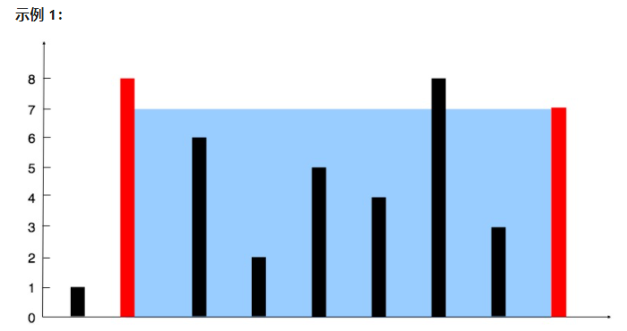
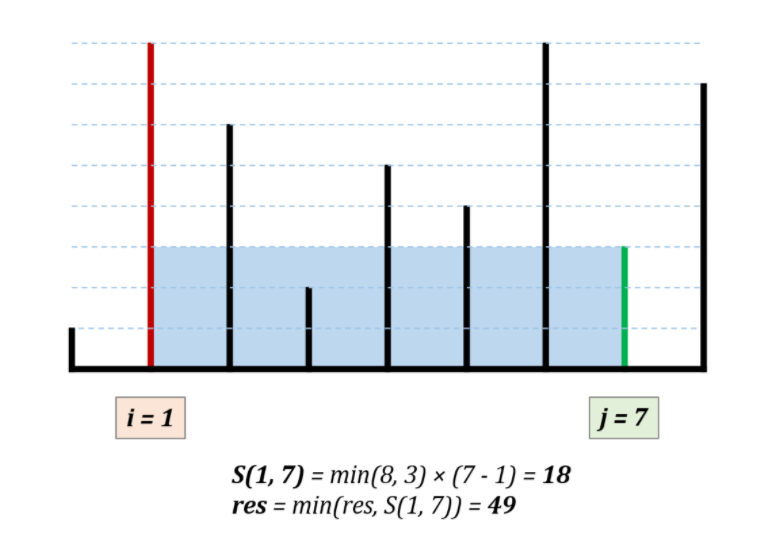

力扣中等：[11. 盛最多水的容器](https://leetcode-cn.com/problems/container-with-most-water/)


找出其中的两条线，使得它们与 x 轴共同构成的容器可以容纳最多的水。

```js
输入：[1,8,6,2,5,4,8,3,7]	输出：49 	解释：容器能够容纳水（表示为蓝色部分）的最大值为 49。
```



思路分析：消状态这点讲的很好，其实质就是在移动的过程中不断消去不可能成为最大值的状态。

如果是双指针暴力枚举出所有状态，那就是时间复杂度就是 N^2。指针移动规则可以省去一些不必要的移动。

指针移动规则：每次选定围成水槽两板高度 h[i]，h[j] 中的短板（最小值），向中间收窄 1 格。

设每一状态下水槽面积为 S，(0 <= i < j < n)，由于水槽的实际高度由两板中的短板决定，则可得面积公式 S = min(h[i], h[j]) × (j - i)。


若向内移动短板，水槽的短板 min(h[i], h[j]) 可能变大，因此水槽面积 S 可能增大。
若向内移动长板，水槽的短板 min(h[i], h[j]) 不变或变小，下个水槽的面积一定小于当前水槽面积。


**结论：只向内移动短板。**



时间复杂度：O(N)，双指针遍历一次底边宽度 N。空间复杂度：O(1)，指针使用常数额外空间。

````java
public int maxArea(int[] height) {
    int i = 0, j = height.length - 1, res = 0;
    while(i < j){
        res = height[i] < height[j] ? 
            Math.max(res, (j - i) * height[i++]): 
        Math.max(res, (j - i) * height[j--]); 
    }
    return res;
}
````


