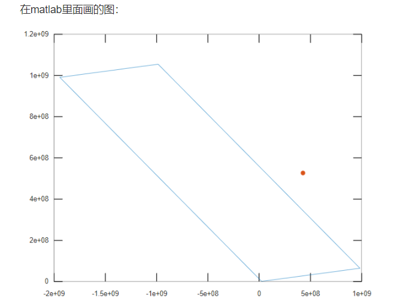

牛客

[判断一个点是否在矩形内部](https://www.nowcoder.com/questionTerminal/6369cbb6898c41d0bef179a6a80f5fde?toCommentId=5154055)

题目中有用例是错的。


学下思路：...

这题算了吧。


还有一种思路是用 三角函数转换。


分类：高中数学





```java
import java.util.*;

public class Main {
    public static void main(String[] args) {
        Scanner sc = new Scanner(System.in);
        double x1, y1, x2, y2, x3, y3, x4, y4, x, y;

        x1 = sc.nextDouble();//左
        y1 = sc.nextDouble();

        x2 = sc.nextDouble();//上
        y2 = sc.nextDouble();

        x3 = sc.nextDouble();//下
        y3 = sc.nextDouble();

        x4 = sc.nextDouble();//右
        y4 = sc.nextDouble();

        x = sc.nextDouble();
        y = sc.nextDouble();

        if (crossProduct(x3 - x1, y3 - y1, x - x1, y - y1) > 0 &&
            crossProduct(x1 - x2, y1 - y2, x - x2, y - y2) > 0 &&
            crossProduct(x4 - x3, y4 - y3, x - x3, y - y3) > 0 &&
            crossProduct(x2 - x4, y2 - y4, x - x4, y - y4) > 0)
            
            System.out.println("Yes");
        else
            System.out.println("No");
    }

    public static double crossProduct(double x1, double y1, double x2, double y2) {
        return x1 * y2 - x2 * y1;
    }
}
```

