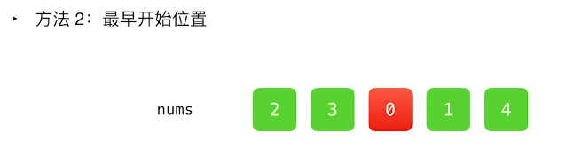

#### [55. 跳跃游戏](https://leetcode-cn.com/problems/jump-game/)

难度中等1159

给定一个非负整数数组 `nums` ，你最初位于数组的 **第一个下标** 。

**数组中的每个元素代表你在该位置可以跳跃的最大长度。**

判断你是否能够到达最后一个下标。


**示例 1：**

```
输入：nums = [2,3,1,1,4]
输出：true
解释：可以先跳 1 步，从下标 0 到达下标 1, 然后再从下标 1 跳 3 步到达最后一个下标。
```

**示例 2：**

```
输入：nums = [3,2,1,0,4]
输出：false
解释：无论怎样，总会到达下标为 3 的位置。但该下标的最大跳跃长度是 0 ， 所以永远不可能到达最后一个下标。
```

 

**提示：**

- `1 <= nums.length <= 3 * 104`
- `0 <= nums[i] <= 105`


## 方法一：贪心

**思路**

这道题目是一道典型的`贪心`类型题目。思路就是用一个变量记录当前能够到达的最大的索引，并逐个遍历数组中的元素去更新这个索引，遍历完成判断这个索引是否大于`数组长度 - 1`即可。

其他 贪心题目扩展、跳跃游戏 ii：

https://github.com/azl397985856/leetcode/blob/master/thinkings/greedy.md

**关键点解析**

- 记录和更新当前位置能够到达的最大的索引
- i > maxJump 当前位置比他能跳到的最大位置大，就 false 了
- 数组最后一个数字大小不用管

**示例解析**


示例一：[2, 3, 1, 1, 4]

开始在位置 0，可以跳跃的最大长度为 2，因此最远可以到达的位置被更新为 2；

我们遍历到位置 1，由于 1≤2，因此位置 1 可达。我们用 1加上它可以跳跃的最大长度 3，将最远可以到达的位置更新为 4。由于 4 大于等于最后一个位置 4，因此我们直接返回 True。


示例二：[3, 2, 1, 0, 4]

我们一开始在位置 0，可以跳跃的最大长度为 3，因此最远可以到达的位置被更新为 3；

遍历到位置 1，由于 1≤3，因此位置 1可达，加上它可以跳跃的最大长度 2 得到 3，未超过最远可以到达的位置；

位置 2、位置 3 同理，最远可以到达的位置不会被更新；

我们遍历到位置 4，由于 4>3，因此位置 4 不可达，我们也就不考虑它可以跳跃的最大长度了。

```java
class Solution {
    public boolean canJump(int[] nums) {
        int len=nums.length;
        int maxJump=0;
        for(int i=0;i<len;i++)
        {
            if(i>maxJump) return false;				 // 当前位置比他能跳到的最大位置大
            if(maxJump>=len-1) return true;			 // 能跳到最后一个位置
            maxJump = Math.max(maxJump, i+nums[i]);	 // 从当前位置能跳的最远的位置
        }
        return maxJump >= len-1;		//一般用不到
    }
}
```

其他写法

```java
public class Solution {
    public boolean canJump(int[] nums) {
        int len = nums.length;
        int maxJump = 0;
        for (int i = 0; i < len; ++i) {
            if (i <= maxJump) {
                maxJump = Math.max(maxJump, i + nums[i]);
                if (maxJump >= len - 1) {
                    return true;
                }
            }
        }
        return false;
    }
}
```

## 方法二：逆向思考

从右到左，标绿。

视频：[跳跃游戏 - 跳跃游戏 - 力扣（LeetCode） (leetcode-cn.com)](https://leetcode-cn.com/problems/jump-game/solution/tiao-yue-you-xi-by-leetcode-solution/) 



```java
public class Solution {
    public boolean canJump(int[] nums) {
        int len = nums.length;
        int last = len - 1;
        int maxJump = 0;
        for (int i = len - 2; i >= 0; i--) 
            if(i+nums[i]>=last) last = i;			//前边的位置加上位置上的步数可以到达新last
        return last==0;								//判断最后能不能更新到第一个位置
    }
}
```

