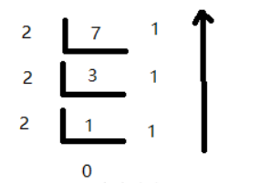

牛客简单：[进制转换](https://www.nowcoder.com/practice/2cc32b88fff94d7e8fd458b8c7b25ec1?tpId=117&&tqId=35037&rp=1&ru=/activity/oj&qru=/ta/job-code-high/question-ranking) 

```
输入：M = 7,N = 2	输出："111"	解释：将十进制数M转化为N进制数，本题要考虑正负。
```



````java
public String solve (int M, int N) {
    if(M == 0) return "0";
    String s = "0123456789ABCDEF";		//0到F
    String res = "";
    boolean f = false;					//正负标记，变成正数处理
    if(M < 0){
        f = true;
        M = -M;
    }									//输入：6,2 返回：110
    while(M != 0){						//除N取余，然后倒序排列，高位补零。	
        res += s.charAt(M%N);			//0 + 1 + 1	
        M /= N;							//3，1
    }
    if(f) res += "-";					
    StringBuffer sb = new StringBuffer(res);
    return sb.reverse().toString();		
}
````
