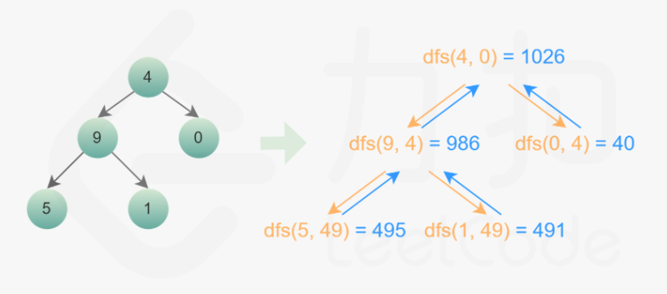

中等：[129. 求根到叶子节点数字之和](https://leetcode-cn.com/problems/sum-root-to-leaf-numbers/)

````java
    4		输入: [4,9,0,5,1]	输出: 1026	
   / \		解释:495 + 491 + 40 = 1026.
  9   0
 / \
5   1
````



````java
public int sumNumbers(TreeNode root) {				//DFS 官解 双O(N)
    return dfs(root, 0);
}
public int dfs(TreeNode root, int prevSum) {
    if (root == null) return 0; 
    int sum = prevSum * 10 + root.val;				//这个sum不能是成员变量
    if (root.left == null && root.right == null) 	//到底了，提前返回
        return sum;
    int l = dfs(root.left, sum);
    int r = dfs(root.right, sum);
    return l + r;
}
````

````java
public int sumNumbers(TreeNode root) {				//BFS 官解 双O(N)
    if (root == null) return 0;
    int sum = 0;
    Queue<TreeNode> nodeQueue = new LinkedList<>();	//两个队列，一个存节点遍历
    Queue<Integer> numQueue = new LinkedList<>();	//一个存数值，计算。
    nodeQueue.offer(root);
    numQueue.offer(root.val);
    while (!nodeQueue.isEmpty()) {
        TreeNode node = nodeQueue.poll();
        int num = numQueue.poll();
        TreeNode left = node.left;
        TreeNode right = node.right;
        if (left == null && right == null) sum += num;
        else {
            if (left != null) {
                nodeQueue.offer(left);
                numQueue.offer(num * 10 + left.val);
            }
            if (right != null) {
                nodeQueue.offer(right);
                numQueue.offer(num * 10 + right.val);
            }
        }
    }
    return sum;
}
````

