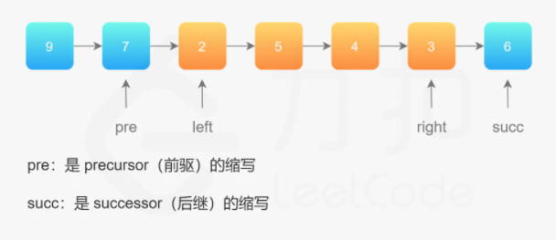

中等：[92. 反转链表 II](https://leetcode-cn.com/problems/reverse-linked-list-ii/)

```js
输入: 1->2->3->4->5->NULL, m = 2, n = 4	输出: 1->4->3->2->5->NULL	
解释：反转从位置 m 到 n 的链表。要求只遍历一次。
```



````java
public ListNode reverseBetween(ListNode head, int left, int right) {
    //头节点有可能发生变化，避免复杂的分类讨论
    ListNode dum = new ListNode(-1);//反转再链接
    dum.next = head;
    ListNode pre = dum;             //9—>7—>2—>5—>4—>3—>6	 3-6
    for (int i = 0; i < left - 1; i++)//2
        pre = pre.next;//7			       //图中pre就位
    ListNode rightNode = pre;
    for (int i = 0; i < right - left + 1; i++) 
        rightNode = rightNode.next; //图中right就位
    ListNode leftNode = pre.next;	  //图中left就位
    ListNode cur = rightNode.next;  //图中succ就位
    pre.next = null;                //切断
    rightNode.next = null;
    reverseLinkedList(leftNode);    //反转链表
    pre.next = rightNode;           //接回到原来的链表中，rightNode依然指向3
    leftNode.next = cur;
    return dum.next;
}

private void reverseLinkedList(ListNode head) {
    ListNode pre = null,cur = head;
    while (cur != null) {
        ListNode next = cur.next;
        cur.next = pre;
        pre = cur;
        cur = next;
    }
}
````

遍历一遍不好懂，看图解。 [反转链表 II - 反转链表 II - 力扣（LeetCode） (leetcode-cn.com)](https://leetcode-cn.com/problems/reverse-linked-list-ii/solution/fan-zhuan-lian-biao-ii-by-leetcode-solut-teyq/) 

```java
public ListNode reverseBetween(ListNode head, int left, int right) {
    ListNode dummyNode = new ListNode(-1);		//官解，只遍历一遍，穿针引线法
    dummyNode.next = head;
    ListNode pre = dummyNode;
    for (int i = 0; i < left - 1; i++)
        pre = pre.next;
    ListNode cur = pre.next;
    ListNode next;
    for (int i = 0; i < right - left; i++) {
        next = cur.next;
        cur.next = next.next;
        next.next = pre.next;
        pre.next = next;
    }
    return dummyNode.next;
}
```

