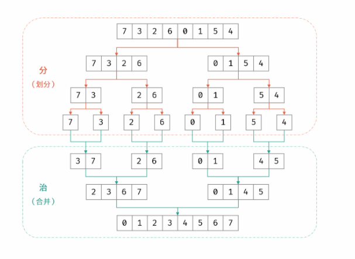

力扣困难


在数组中的两个数字，如果前面一个数字大于后面的数字，则这两个数字组成一个逆序对。

输入一个数组，求出这个数组中的逆序对的总数。 


示例 1:

输入: [7,5,6,4]
输出: 5


限制：0 <= 数组长度 <= 50000


## 方法一：暴力计数


直接超时。

时间复杂度：O(N2)，实际是比 N2小的 ，但是已经超时。这里 N 是数组的长度。

空间复杂度：O(1)。

````java
public class Solution {
    public int reversePairs(int[] nums) {
        int cnt = 0;
        int len = nums.length;
        for (int i = 0; i < len - 1; i++) {
            for (int j = i + 1; j < len; j++) {
                if (nums[i] > nums[j]) {
                    cnt++;
                }
            }
        }
        return cnt;
    }
}
````

## 方法二：归并计数

该方法来自常规归并排序的小改编。


思路：

归并计数方式计数逆序对有两种方法。

1、在第 2 个子区间元素归并回去的时候，计算逆序对的个数。

````java
mid + 1 - i：
相当于对于右区间的每个数字a，找左区间中比a大的有多少，所以如果左区间有剩余，直接复制到暂时数组的后面。
如果右区间有剩余，表示右区间剩下的数都是比左区间数大的，此时不存在逆序，只需要复制到暂时数组的后面。
````

2、在第 1 个子区间元素归并回去的时候，计算逆序对的个数。 

````java
j - (mid + 1)：不好写。
相当于对于左区间的每个数字b，找右区间中比b小的有多少，所以如果右区间有剩余，直接复制到暂时数组的后面。
如果左区间有剩余，表示左区间剩下的数都是比右区间数大的，所以需要在每次放入暂时数组时，加上右区间长度。
````



时间复杂度 O(NlogN)：

N 是数组的长度。二分法递归需要logN，而递归到底部后，每次自底向上的合并需要 O(N)。 

空间复杂度 O(N)： 

N 是数组的长度。需要临时数组存储。

````java
public class Solution {
 	int cnt = 0;
    public int reversePairs(int[] nums) {
        sort(nums);
		return cnt;
    }
    //sort方法重载。
    public  void sort(int []arr){
        //在排序前，先建个长度等长的临时数组，避免递归中频繁开辟空间
        int []temp = new int[arr.length];
        sort(arr,0,arr.length-1,temp);
    }
    private  void sort(int[] arr,int left,int right,int[] temp){
        if(left<right){
            //int mid = left + (right - left) / 2;
            int mid = (left+right)/2;
            sort(arr,left,mid,temp);//左边归并排序，使得左子序列有序
            sort(arr,mid+1,right,temp);//右边归并排序，使得右子序列有序
            merge(arr,left,mid,right,temp);//将两个有序子数组合并操作
        } 
    }
    private  void merge(int[] arr,int left,int mid,int right,int[] temp){
        int i = left;//左序列指针
        int j = mid+1;//右序列指针
        int t = 0;//临时数组指针
        while (i<=mid && j<=right){
            if(arr[i]<=arr[j]){
                temp[t++] = arr[i++];
            }else {
                //就只加cnt成员变量和了这一行代码。
                //合并阶段 本质上是 合并两个排序数组 的过程.
                //每当遇到 左子数组当前元素 > 右子数组当前元素 时.
                //意味着 左子数组当前元素 至 末尾元素 与 右子数组当前元素 构成了若干 「逆序对」
                //cnt +=  mid + 1 - i;
                cnt +=j - (mid + 1);
                temp[t++] = arr[j++];
            }
        }
        while(i<=mid){//将左边剩余元素填充进temp中
            temp[t++] = arr[i++];
        }
        while(j<=right){//将右序列剩余元素填充进temp中
            temp[t++] = arr[j++];
        }
        t = 0;
        //将temp中的元素全部拷贝到原数组中
        while(left <= right){
            arr[left++] = temp[t++];
        }
    }
}
````

## 方法三：离散化树状数组

暂时不考虑。


## 归并排序总结

稳定排序，不仅顺序，而且时间不受最坏、最好影响，都是 O(NlogN) 。

十分高效，利用完全二叉树特性的排序性能都不会太差。

Java 中 Arrays.sort() 采用了一种名为TimSort的排序算法，就是归并排序的优化版本。


时间复杂度为 O(NlogN)：排序中，每次合并操作的平均时间复杂度为O(N)，而完全二叉树的深度为 logN。

````java
public class MergeSort {
    public static void main(String []args){
        int[] arr = {9,8,7,6,5,4,3,2,1};
        sort(arr);
        System.out.println(Arrays.toString(arr));
    }
    //sort方法重载。
    public static void sort(int []arr){
        //在排序前，先建个长度等长的临时数组，避免递归中频繁开辟空间
        int []temp = new int[arr.length];
        sort(arr,0,arr.length-1,temp);
    }
    private static void sort(int[] arr,int left,int right,int[] temp){
        if(left<right){
            //int mid = left + (right - left) / 2;
            int mid = (left+right)/2;
            sort(arr,left,mid,temp);//左边归并排序，使得左子序列有序
            sort(arr,mid+1,right,temp);//右边归并排序，使得右子序列有序
            merge(arr,left,mid,right,temp);//将两个有序子数组合并操作
        }
    }
    private static void merge(int[] arr,int left,int mid,int right,int[] temp){
        int i = left;//左序列指针
        int j = mid+1;//右序列指针
        int t = 0;//临时数组指针
        while (i<=mid && j<=right){
            if(arr[i]<=arr[j]){
                temp[t++] = arr[i++];
            }else {
                temp[t++] = arr[j++];
            }
        }
        while(i<=mid){//将左边剩余元素填充进temp中
            temp[t++] = arr[i++];
        }
        while(j<=right){//将右序列剩余元素填充进temp中
            temp[t++] = arr[j++];
        }
        t = 0;
        //将temp中的元素全部拷贝到原数组中
        while(left <= right){
            arr[left++] = temp[t++];
        }
    }
}
````

## 参考

力扣：https://leetcode-cn.com/problems/shu-zu-zhong-de-ni-xu-dui-lcof/solution/bao-li-jie-fa-fen-zhi-si-xiang-shu-zhuang-shu-zu-b/#comment