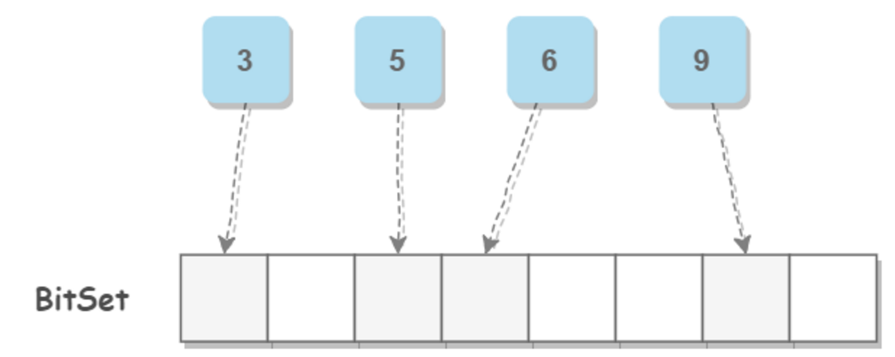
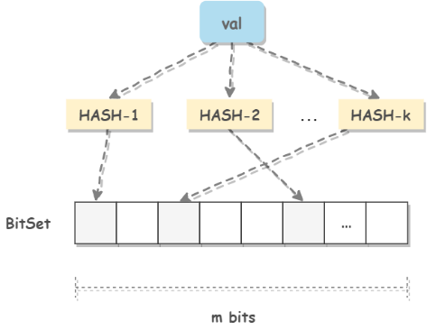

## 1、HashSet

海量数据拆分到不同机器上，用 HashSet 判重过滤。

## 2、BitSet

如果海量数据是整数，并且范围不大时， 使用 BitSet 还可以很容易地解决一个**整数**出现次数的问题，例如使用两个比特数组就可以存储 0~3 的信息。其实判重问题也可以简单看成一个数据出现的次数是否为 1，因此一个比特数组就够了。 

## 3、布隆过滤器

布隆过滤器能够以极小的空间开销解决海量数据判重问题，但是会有一定的误判概率。

它主要用在网页黑名单系统、垃圾邮件过滤系统、爬虫的网址判重系统。

布隆过滤器也是使用 BitSet 存储数据，但是它进行了一定的改进，从而解除了 BitSet 要求数据的范围不大的限制。在存储时，它要求数据先经过 k 个哈希函得到 k 个位置，并将 BitSet 中对应位置设置为 1。在查找时，也需要先经过 k 个哈希函数得到 k 个位置，如果所有位置上都为 1，那么表示这个数据存在。

由于哈希函数的特点，两个不同的数通过哈希函数得到的值可能相同。如果两个数通过 k 个哈希函数得到的值都相同，那么使用布隆过滤器会将这两个数判为相同。

可以知道，令 k 和 m 都大一些会使得误判率降低，但是这会带来更高的时间和空间开销。m是 BitSet 长度

布隆过滤器会误判，也就是将一个不存在的数判断为已经存在，这会造成一定的问题。例如在垃圾邮件过滤系统中，会将一个邮件误判为垃圾邮件，那么就收不到这个邮件。可以使用白名单的方式进行补救。

