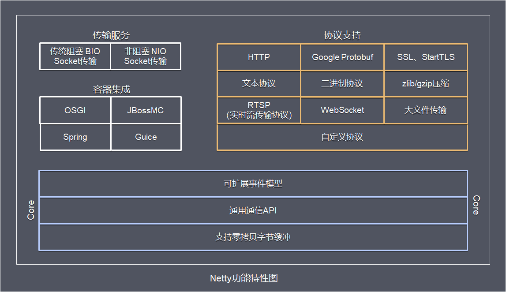
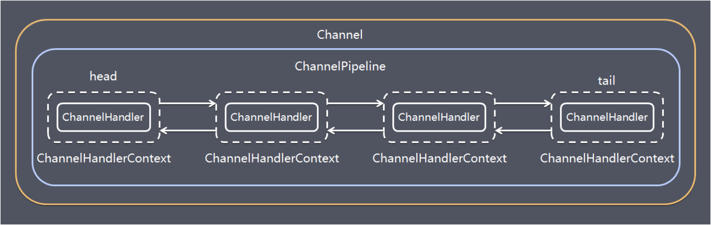

## 1.Netty 是什么？

Netty 是 一个异步事件驱动的网络应用程序框架，用于快速开发可维护的高性能协议服务器和客户端。Netty 是基于 nio 的，它封装了 jdk 的 nio，让我们使用起来更加方法灵活。

## 2.Netty 的特点是什么？

- 高并发：Netty 是一款基于 NIO（Nonblocking IO，非阻塞 IO）开发的网络通信框架，对比于 BIO（Blocking I/O，阻塞 IO），他的并发性能得到了很大提高。
- 传输快：Netty 的传输依赖于零拷贝特性，尽量减少不必要的内存拷贝，实现了更高效率的传输。
- 封装好：Netty 封装了 NIO 操作的很多细节，提供了易于使用调用接口。

## 3.Netty 的优势有哪些？

- 使用简单：封装了 NIO 的很多细节，使用更简单。
- 功能强大：预置了多种编解码功能，支持多种主流协议。
- 定制能力强：可以通过 ChannelHandler 对通信框架进行灵活地扩展。
- 性能高：通过与其他业界主流的 NIO 框架对比，Netty 的综合性能最优。
- 稳定：Netty 修复了已经发现的所有 NIO 的 bug，让开发人员可以专注于业务本身。
- 社区活跃：Netty 是活跃的开源项目，版本迭代周期短，bug 修复速度快。

## 4.Netty 的应用场景有哪些？

典型的应用有：阿里分布式服务框架 Dubbo，默认使用 Netty 作为基础通信组件，还有 RocketMQ 也是使用 Netty 作为通讯的基础。

## 5.Netty 高性能表现在哪些方面？

- IO 线程模型：同步非阻塞，用最少的资源做更多的事。
- 内存零拷贝：尽量减少不必要的内存拷贝，实现了更高效率的传输。
- 内存池设计：申请的内存可以重用，主要指直接内存。内部实现是用一颗二叉查找树管理内存分配情况。
- 串形化处理读写：避免使用锁带来的性能开销。
- 高性能序列化协议：支持 protobuf 等高性能序列化协议。

## 6.BIO、NIO 和 AIO 的区别？

BIO：一个连接一个线程，客户端有连接请求时服务器端就需要启动一个线程进行处理。线程开销大。
伪异步 IO：将请求连接放入线程池，一对多，但线程还是很宝贵的资源。

NIO：一个请求一个线程，但客户端发送的连接请求都会注册到多路复用器上，多路复用器轮询到连接有 I/O 请求时才启动一个线程进行处理。

AIO：一个有效请求一个线程，客户端的 I/O 请求都是由 OS 先完成了再通知服务器应用去启动线程进行处理，

BIO 是面向流的，NIO 是面向缓冲区的；BIO 的各种流是阻塞的。而 NIO 是非阻塞的；BIO 的 Stream 是单向的，而 NIO 的 channel 是双向的。

NIO 的特点：事件驱动模型、单线程处理多任务、非阻塞 I/O，I/O 读写不再阻塞，而是返回 0、基于 block 的传输比基于流的传输更高效、更高级的 IO 函数 zero-copy、IO 多路复用大大提高了 Java 网络应用的可伸缩性和实用性。基于 Reactor 线程模型。

在 Reactor 模式中，事件分发器等待某个事件或者可应用或个操作的状态发生，事件分发器就把这个事件传给事先注册的事件处理函数或者回调函数，由后者来做实际的读写操作。如在 Reactor 中实现读：注册读就绪事件和相应的事件处理器、事件分发器等待事件、事件到来，激活分发器，分发器调用事件对应的处理器、事件处理器完成实际的读操作，处理读到的数据，注册新的事件，然后返还控制权。

## 7.NIO 的组成？

Buffer：与 Channel 进行交互，数据是从 Channel 读入缓冲区，从缓冲区写入 Channel 中的

flip 方法 ： 反转此缓冲区，将 position 给 limit，然后将 position 置为 0，其实就是切换读写模式

clear 方法 ：清除此缓冲区，将 position 置为 0，把 capacity 的值给 limit。

rewind 方法 ： 重绕此缓冲区，将 position 置为 0

DirectByteBuffer 可减少一次系统空间到用户空间的拷贝。但 Buffer 创建和销毁的成本更高，不可控，通常会用内存池来提高性能。直接缓冲区主要分配给那些易受基础系统的本机 I/O 操作影响的大型、持久的缓冲区。如果数据量比较小的中小应用情况下，可以考虑使用 heapBuffer，由 JVM 进行管理。

Channel：表示 IO 源与目标打开的连接，是双向的，但不能直接访问数据，只能与 Buffer 进行交互。通过源码可知，FileChannel 的 read 方法和 write 方法都导致数据复制了两次！

Selector 可使一个单独的线程管理多个 Channel，open 方法可创建 Selector，register 方法向多路复用器器注册通道，可以监听的事件类型：读、写、连接、accept。注册事件后会产生一个 SelectionKey：它表示 SelectableChannel 和 Selector 之间的注册关系，wakeup 方法：使尚未返回的第一个选择操作立即返回，唤醒的

原因是：注册了新的 channel 或者事件；channel 关闭，取消注册；优先级更高的事件触发（如定时器事件），希望及时处理。

Selector 在 Linux 的实现类是 EPollSelectorImpl，委托给 EPollArrayWrapper 实现，其中三个 native 方法是对 epoll 的封装，而 EPollSelectorImpl. implRegister 方法，通过调用 epoll_ctl 向 epoll 实例中注册事件，还将注册的文件描述符 (fd) 与 SelectionKey 的对应关系添加到 fdToKey 中，这个 map 维护了文件描述符与 SelectionKey 的映射。

fdToKey 有时会变得非常大，因为注册到 Selector 上的 Channel 非常多（百万连接）；过期或失效的 Channel 没有及时关闭。fdToKey 总是串行读取的，而读取是在 select 方法中进行的，该方法是非线程安全的。

Pipe：两个线程之间的单向数据连接，数据会被写到 sink 通道，从 source 通道读取

NIO 的服务端建立过程：Selector.open ()：打开一个 Selector；ServerSocketChannel.open ()：创建服务端的 Channel；bind ()：绑定到某个端口上。并配置非阻塞模式；register ()：注册 Channel 和关注的事件到 Selector 上；select () 轮询拿到已经就绪的事件

## 8.Netty 的线程模型？

Netty 通过 Reactor 模型基于多路复用器接收并处理用户请求，内部实现了两个线程池，boss 线程池和 work 线程池，其中 boss 线程池的线程负责处理请求的 accept 事件，当接收到 accept 事件的请求时，把对应的 socket 封装到一个 NioSocketChannel 中，并交给 work 线程池，其中 work 线程池负责请求的 read 和 write 事件，由对应的 Handler 处理。

单线程模型：所有 I/O 操作都由一个线程完成，即多路复用、事件分发和处理都是在一个 Reactor 线程上完成的。既要接收客户端的连接请求，向服务端发起连接，又要发送 / 读取请求或应答 / 响应消息。一个 NIO 线程同时处理成百上千的链路，性能上无法支撑，速度慢，若线程进入死循环，整个程序不可用，对于高负载、大并发的应用场景不合适。

多线程模型：有一个 NIO 线程（Acceptor） 只负责监听服务端，接收客户端的 TCP 连接请求；NIO 线程池负责网络 IO 的操作，即消息的读取、解码、编码和发送；1 个 NIO 线程可以同时处理 N 条链路，但是 1 个链路只对应 1 个 NIO 线程，这是为了防止发生并发操作问题。但在并发百万客户端连接或需要安全认证时，一个 Acceptor 线程可能会存在性能不足问题。

主从多线程模型：Acceptor 线程用于绑定监听端口，接收客户端连接，将 SocketChannel 从主线程池的 Reactor 线程的多路复用器上移除，重新注册到 Sub 线程池的线程上，用于处理 I/O 的读写等操作，从而保证 mainReactor 只负责接入认证、握手等操作；

## 9.TCP 粘包 / 拆包的原因及解决方法？

TCP 是以流的方式来处理数据，一个完整的包可能会被 TCP 拆分成多个包进行发送，也可能把小的封装成一个大的数据包发送。

TCP 粘包 / 分包的原因：

应用程序写入的字节大小大于套接字发送缓冲区的大小，会发生拆包现象，而应用程序写入数据小于套接字缓冲区大小，网卡将应用多次写入的数据发送到网络上，这将会发生粘包现象；

进行 MSS 大小的 TCP 分段，当 TCP 报文长度 - TCP 头部长度 > MSS 的时候将发生拆包
以太网帧的 payload（净荷）大于 MTU（1500 字节）进行 ip 分片。

解决方法

消息定长：FixedLengthFrameDecoder 类

包尾增加特殊字符分割：

- 行分隔符类：LineBasedFrameDecoder
- 或自定义分隔符类 ：DelimiterBasedFrameDecoder

将消息分为消息头和消息体：LengthFieldBasedFrameDecoder 类。分为有头部的拆包与粘包、长度字段在前且有头部的拆包与粘包、多扩展头部的拆包与粘包。

## 10. 什么是 Netty 的零拷贝？

Netty 的零拷贝主要包含三个方面：

- Netty 的接收和发送 ByteBuffer 采用 DIRECT BUFFERS，使用堆外直接内存进行 Socket 读写，不需要进行字节缓冲区的二次拷贝。如果使用传统的堆内存（HEAP BUFFERS）进行 Socket 读写，JVM 会将堆内存 Buffer 拷贝一份到直接内存中，然后才写入 Socket 中。相比于堆外直接内存，消息在发送过程中多了一次缓冲区的内存拷贝。
- Netty 提供了组合 Buffer 对象，可以聚合多个 ByteBuffer 对象，用户可以像操作一个 Buffer 那样方便的对组合 Buffer 进行操作，避免了传统通过内存拷贝的方式将几个小 Buffer 合并成一个大的 Buffer。
- Netty 的文件传输采用了 transferTo 方法，它可以直接将文件缓冲区的数据发送到目标 Channel，避免了传统通过循环 write 方式导致的内存拷贝问题。

## 11.Netty 中有哪种重要组件？

- Channel：Netty 网络操作抽象类，它除了包括基本的 I/O 操作，如 bind、connect、read、write 等。
- EventLoop：主要是配合 Channel 处理 I/O 操作，用来处理连接的生命周期中所发生的事情。
- ChannelFuture：Netty 框架中所有的 I/O 操作都为异步的，因此我们需要 ChannelFuture 的 addListener () 注册一个 ChannelFutureListener 监听事件，当操作执行成功或者失败时，监听就会自动触发返回结果。
- ChannelHandler：充当了所有处理入站和出站数据的逻辑容器。ChannelHandler 主要用来处理各种事件，这里的事件很广泛，比如可以是连接、数据接收、异常、数据转换等。
- ChannelPipeline：为 ChannelHandler 链提供了容器，当 channel 创建时，就会被自动分配到它专属的 ChannelPipeline，这个关联是永久性的。

## 12.Netty 发送消息有几种方式？

Netty 有两种发送消息的方式：

- 直接写入 Channel 中，消息从 ChannelPipeline 当中尾部开始移动；
- 写入和 ChannelHandler 绑定的 ChannelHandlerContext 中，消息从 ChannelPipeline 中的下一个 ChannelHandler 中移动。

## 13. 默认情况 Netty 起多少线程？何时启动？

Netty 默认是 CPU 处理器数的两倍，bind 完之后启动。

## 14. 了解哪几种序列化协议？

序列化（编码）是将对象序列化为二进制形式（字节数组），主要用于网络传输、数据持久化等；而反序列化（解码）则是将从网络、磁盘等读取的字节数组还原成原始对象，主要用于网络传输对象的解码，以便完成远程调用。

影响序列化性能的关键因素：序列化后的码流大小（网络带宽的占用）、序列化的性能（CPU 资源占用）；是否支持跨语言（异构系统的对接和开发语言切换）。

Java 默认提供的序列化：无法跨语言、序列化后的码流太大、序列化的性能差

XML，优点：人机可读性好，可指定元素或特性的名称。缺点：序列化数据只包含数据本身以及类的结构，不包括类型标识和程序集信息；只能序列化公共属性和字段；不能序列化方法；文件庞大，文件格式复杂，传输占带宽。适用场景：当做配置文件存储数据，实时数据转换。

JSON，是一种轻量级的数据交换格式，优点：兼容性高、数据格式比较简单，易于读写、序列化后数据较小，可扩展性好，兼容性好、与 XML 相比，其协议比较简单，解析速度比较快。缺点：数据的描述性比 XML 差、不适合性能要求为 ms 级别的情况、额外空间开销比较大。适用场景（可替代ＸＭＬ）：跨防火墙访问、可调式性要求高、基于 Web browser 的 Ajax 请求、传输数据量相对小，实时性要求相对低（例如秒级别）的服务。

Fastjson，采用一种 “假定有序快速匹配” 的算法。优点：接口简单易用、目前 java 语言中最快的 json 库。缺点：过于注重快，而偏离了 “标准” 及功能性、代码质量不高，文档不全。适用场景：协议交互、Web 输出、Android 客户端

Thrift，不仅是序列化协议，还是一个 RPC 框架。优点：序列化后的体积小，速度快、支持多种语言和丰富的数据类型、对于数据字段的增删具有较强的兼容性、支持二进制压缩编码。缺点：使用者较少、跨防火墙访问时，不安全、不具有可读性，调试代码时相对困难、不能与其他传输层协议共同使用（例如 HTTP）、无法支持向持久层直接读写数据，即不适合做数据持久化序列化协议。适用场景：分布式系统的 RPC 解决方案

Avro，Hadoop 的一个子项目，解决了 JSON 的冗长和没有 IDL 的问题。优点：支持丰富的数据类型、简单的动态语言结合功能、具有自我描述属性、提高了数据解析速度、快速可压缩的二进制数据形式、可以实现远程过程调用 RPC、支持跨编程语言实现。缺点：对于习惯于静态类型语言的用户不直观。适用场景：在 Hadoop 中做 Hive、Pig 和 MapReduce 的持久化数据格式。

Protobuf，将数据结构以.proto 文件进行描述，通过代码生成工具可以生成对应数据结构的 POJO 对象和 Protobuf 相关的方法和属性。优点：序列化后码流小，性能高、结构化数据存储格式（XML JSON 等）、通过标识字段的顺序，可以实现协议的前向兼容、结构化的文档更容易管理和维护。缺点：需要依赖于工具生成代码、支持的语言相对较少，官方只支持 Java 、C++ 、python。适用场景：对性能要求高的 RPC 调用、具有良好的跨防火墙的访问属性、适合应用层对象的持久化

其它

protostuff 基于 protobuf 协议，但不需要配置 proto 文件，直接导包即可
Jboss marshaling 可以直接序列化 java 类， 无须实 java.io.Serializable 接口
Message pack 一个高效的二进制序列化格式
Hessian 采用二进制协议的轻量级 remoting onhttp 工具
kryo 基于 protobuf 协议，只支持 java 语言，需要注册（Registration），然后序列化（Output），反序列化（Input）

## 15. 如何选择序列化协议？

具体场景

对于公司间的系统调用，如果性能要求在 100ms 以上的服务，基于 XML 的 SOAP 协议是一个值得考虑的方案。
基于 Web browser 的 Ajax，以及 Mobile app 与服务端之间的通讯，JSON 协议是首选。对于性能要求不太高，或者以动态类型语言为主，或者传输数据载荷很小的的运用场景，JSON 也是非常不错的选择。
对于调试环境比较恶劣的场景，采用 JSON 或 XML 能够极大的提高调试效率，降低系统开发成本。
当对性能和简洁性有极高要求的场景，Protobuf，Thrift，Avro 之间具有一定的竞争关系。
对于 T 级别的数据的持久化应用场景，Protobuf 和 Avro 是首要选择。如果持久化后的数据存储在 hadoop 子项目里，Avro 会是更好的选择。

对于持久层非 Hadoop 项目，以静态类型语言为主的应用场景，Protobuf 会更符合静态类型语言工程师的开发习惯。由于 Avro 的设计理念偏向于动态类型语言，对于动态语言为主的应用场景，Avro 是更好的选择。
如果需要提供一个完整的 RPC 解决方案，Thrift 是一个好的选择。
如果序列化之后需要支持不同的传输层协议，或者需要跨防火墙访问的高性能场景，Protobuf 可以优先考虑。
protobuf 的数据类型有多种：bool、double、float、int32、int64、string、bytes、enum、message。protobuf 的限定符：required: 必须赋值，不能为空、optional: 字段可以赋值，也可以不赋值、repeated: 该字段可以重复任意次数（包括 0 次）、枚举；只能用指定的常量集中的一个值作为其值；

protobuf 的基本规则：每个消息中必须至少留有一个 required 类型的字段、包含 0 个或多个 optional 类型的字段；repeated 表示的字段可以包含 0 个或多个数据；[1,15] 之内的标识号在编码的时候会占用一个字节（常用），[16,2047] 之内的标识号则占用 2 个字节，标识号一定不能重复、使用消息类型，也可以将消息嵌套任意多层，可用嵌套消息类型来代替组。

protobuf 的消息升级原则：不要更改任何已有的字段的数值标识；不能移除已经存在的 required 字段，optional 和 repeated 类型的字段可以被移除，但要保留标号不能被重用。新添加的字段必须是 optional 或 repeated。因为旧版本程序无法读取或写入新增的 required 限定符的字段。

编译器为每一个消息类型生成了一个.java 文件，以及一个特殊的 Builder 类（该类是用来创建消息类接口的）。如：UserProto.User.Builder builder = UserProto.User.newBuilder ();builder.build ()；

Netty 中的使用：ProtobufVarint32FrameDecoder 是用于处理半包消息的解码类；ProtobufDecoder (UserProto.User.getDefaultInstance ()) 这是创建的 UserProto.java 文件中的解码类；ProtobufVarint32LengthFieldPrepender 对 protobuf 协议的消息头上加上一个长度为 32 的整形字段，用于标志这个消息的长度的类；ProtobufEncoder 是编码类

将 StringBuilder 转换为 ByteBuf 类型：copiedBuffer () 方法

## 16.Netty 支持哪些心跳类型设置？

- readerIdleTime：为读超时时间（即测试端一定时间内未接受到被测试端消息）。
- writerIdleTime：为写超时时间（即测试端一定时间内向被测试端发送消息）。
- allIdleTime：所有类型的超时时间。

## 17.Netty 和 Tomcat 的区别？

- 作用不同：Tomcat 是 Servlet 容器，可以视为 Web 服务器，而 Netty 是异步事件驱动的网络应用程序框架和工具用于简化网络编程，例如 TCP 和 UDP 套接字服务器。
- 协议不同：Tomcat 是基于 http 协议的 Web 服务器，而 Netty 能通过编程自定义各种协议，因为 Netty 本身自己能编码 / 解码字节流，所有 Netty 可以实现，HTTP 服务器、FTP 服务器、UDP 服务器、RPC 服务器、WebSocket 服务器、Redis 的 Proxy 服务器、MySQL 的 Proxy 服务器等等。

## 18.NIOEventLoopGroup 源码？

NioEventLoopGroup (其实是 MultithreadEventExecutorGroup) 内部维护一个类型为 EventExecutor children [], 默认大小是处理器核数 * 2, 这样就构成了一个线程池，初始化 EventExecutor 时 NioEventLoopGroup 重载 newChild 方法，所以 children 元素的实际类型为 NioEventLoop。

线程启动时调用 SingleThreadEventExecutor 的构造方法，执行 NioEventLoop 类的 run 方法，首先会调用 hasTasks () 方法判断当前 taskQueue 是否有元素。如果 taskQueue 中有元素，执行 selectNow () 方法，最终执行 selector.selectNow ()，该方法会立即返回。如果 taskQueue 没有元素，执行 select (oldWakenUp) 方法

select (oldWakenUp) 方法解决了 Nio 中的 bug，selectCnt 用来记录 selector.select 方法的执行次数和标识是否执行过 selector.selectNow ()，若触发了 epoll 的空轮询 bug，则会反复执行 selector.select (timeoutMillis)，变量 selectCnt 会逐渐变大，当 selectCnt 达到阈值（默认 512），则执行 rebuildSelector 方法，进行 selector 重建，解决 cpu 占用 100% 的 bug。

rebuildSelector 方法先通过 openSelector 方法创建一个新的 selector。然后将 old selector 的 selectionKey 执行 cancel。最后将 old selector 的 channel 重新注册到新的 selector 中。rebuild 后，需要重新执行方法 selectNow，检查是否有已 ready 的 selectionKey。

接下来调用 processSelectedKeys 方法（处理 I/O 任务），当 selectedKeys != null 时，调用 processSelectedKeysOptimized 方法，迭代 selectedKeys 获取就绪的 IO 事件的 selectkey 存放在数组 selectedKeys 中，然后为每个事件都调用 processSelectedKey 来处理它，processSelectedKey 中分别处理 OP_READ；OP_WRITE；OP_CONNECT 事件。

最后调用 runAllTasks 方法（非 IO 任务），该方法首先会调用 fetchFromScheduledTaskQueue 方法，把 scheduledTaskQueue 中已经超过延迟执行时间的任务移到 taskQueue 中等待被执行，然后依次从 taskQueue 中取任务执行，每执行 64 个任务，进行耗时检查，如果已执行时间超过预先设定的执行时间，则停止执行非 IO 任务，避免非 IO 任务太多，影响 IO 任务的执行。

每个 NioEventLoop 对应一个线程和一个 Selector，NioServerSocketChannel 会主动注册到某一个 NioEventLoop 的 Selector 上，NioEventLoop 负责事件轮询。

Outbound 事件都是请求事件，发起者是 Channel，处理者是 unsafe，通过 Outbound 事件进行通知，传播方向是 tail 到 head。Inbound 事件发起者是 unsafe，事件的处理者是 Channel, 是通知事件，传播方向是从头到尾。

内存管理机制，首先会预申请一大块内存 Arena，Arena 由许多 Chunk 组成，而每个 Chunk 默认由 2048 个 page 组成。Chunk 通过 AVL 树的形式组织 Page，每个叶子节点表示一个 Page，而中间节点表示内存区域，节点自己记录它在整个 Arena 中的偏移地址。当区域被分配出去后，中间节点上的标记位会被标记，这样就表示这个中间节点以下的所有节点都已被分配了。大于 8k 的内存分配在 poolChunkList 中，而 PoolSubpage 用于分配小于 8k 的内存，它会把一个 page 分割成多段，进行内存分配。

ByteBuf 的特点：支持自动扩容（4M），保证 put 方法不会抛出异常、通过内置的复合缓冲类型，实现零拷贝（zero-copy）；不需要调用 flip () 来切换读 / 写模式，读取和写入索引分开；方法链；引用计数基于 AtomicIntegerFieldUpdater 用于内存回收；PooledByteBuf 采用二叉树来实现一个内存池，集中管理内存的分配和释放，不用每次使用都新建一个缓冲区对象。UnpooledHeapByteBuf 每次都会新建一个缓冲区对象。

## Netty 简介


Netty 是 一个异步事件驱动的网络应用程序框架，用于快速开发可维护的高性能协议服务器和客户端。

### JDK 原生 NIO 程序的问题

JDK 原生也有一套网络应用程序 API，但是存在一系列问题，主要如下：

- NIO 的类库和 API 繁杂，使用麻烦，你需要熟练掌握 Selector、ServerSocketChannel、SocketChannel、ByteBuffer 等
- 需要具备其它的额外技能做铺垫，例如熟悉 Java 多线程编程，因为 NIO 编程涉及到 Reactor 模式，你必须对多线程和网路编程非常熟悉，才能编写出高质量的 NIO 程序
- 可靠性能力补齐，开发工作量和难度都非常大。例如客户端面临断连重连、网络闪断、半包读写、失败缓存、网络拥塞和异常码流的处理等等，NIO 编程的特点是功能开发相对容易，但是可靠性能力补齐工作量和难度都非常大
- JDK NIO 的 BUG，例如臭名昭著的 epoll bug，它会导致 Selector 空轮询，最终导致 CPU 100%。官方声称在 JDK1.6 版本的 update18 修复了该问题，但是直到 JDK1.7 版本该问题仍旧存在，只不过该 bug 发生概率降低了一些而已，它并没有被根本解决

### Netty 的特点

Netty 的对 JDK 自带的 NIO 的 API 进行封装，解决上述问题，主要特点有：

- 设计优雅 适用于各种传输类型的统一 API - 阻塞和非阻塞 Socket 基于灵活且可扩展的事件模型，可以清晰地分离关注点 高度可定制的线程模型 - 单线程，一个或多个线程池 真正的无连接数据报套接字支持（自 3.1 起）
- 使用方便 详细记录的 Javadoc，用户指南和示例 没有其他依赖项，JDK 5（Netty 3.x）或 6（Netty 4.x）就足够了
- 高性能 吞吐量更高，延迟更低 减少资源消耗 最小化不必要的内存复制
- 安全 完整的 SSL / TLS 和 StartTLS 支持
- 社区活跃，不断更新 社区活跃，版本迭代周期短，发现的 BUG 可以被及时修复，同时，更多的新功能会被加入

### Netty 常见使用场景

Netty 常见的使用场景如下：

- 互联网行业 在分布式系统中，各个节点之间需要远程服务调用，高性能的 RPC 框架必不可少，Netty 作为异步高新能的通信框架，往往作为基础通信组件被这些 RPC 框架使用。 典型的应用有：阿里分布式服务框架 Dubbo 的 RPC 框架使用 Dubbo 协议进行节点间通信，Dubbo 协议默认使用 Netty 作为基础通信组件，用于实现各进程节点之间的内部通信。
- 游戏行业 无论是手游服务端还是大型的网络游戏，Java 语言得到了越来越广泛的应用。Netty 作为高性能的基础通信组件，它本身提供了 TCP/UDP 和 HTTP 协议栈。 非常方便定制和开发私有协议栈，账号登录服务器，地图服务器之间可以方便的通过 Netty 进行高性能的通信
- 大数据领域 经典的 Hadoop 的高性能通信和序列化组件 Avro 的 RPC 框架，默认采用 Netty 进行跨界点通信，它的 Netty Service 基于 Netty 框架二次封装实现

有兴趣的读者可以了解一下目前有哪些开源项目使用了 Netty：[Related projects](https://netty.io/wiki/related-projects.html)

## Netty 高性能设计

Netty 作为异步事件驱动的网络，高性能之处主要来自于其 I/O 模型和线程处理模型，前者决定如何收发数据，后者决定如何处理数据

### I/O 模型

用什么样的通道将数据发送给对方，BIO、NIO 或者 AIO，I/O 模型在很大程度上决定了框架的性能

#### 阻塞 I/O

传统阻塞型 I/O (BIO) 可以用下图表示：


**特点**

- 每个请求都需要独立的线程完成数据 read，业务处理，数据 write 的完整操作

**问题**

- 当并发数较大时，需要创建大量线程来处理连接，系统资源占用较大
- 连接建立后，如果当前线程暂时没有数据可读，则线程就阻塞在 read 操作上，造成线程资源浪费

#### I/O 复用模型


在 I/O 复用模型中，会用到 select，这个函数也会使进程阻塞，但是和阻塞 I/O 所不同的的，这两个函数可以同时阻塞多个 I/O 操作，而且可以同时对多个读操作，多个写操作的 I/O 函数进行检测，直到有数据可读或可写时，才真正调用 I/O 操作函数

Netty 的非阻塞 I/O 的实现关键是基于 I/O 复用模型，这里用 Selector 对象表示：


Netty 的 IO 线程 NioEventLoop 由于聚合了多路复用器 Selector，可以同时并发处理成百上千个客户端连接。当线程从某客户端 Socket 通道进行读写数据时，若没有数据可用时，该线程可以进行其他任务。线程通常将非阻塞 IO 的空闲时间用于在其他通道上执行 IO 操作，所以单独的线程可以管理多个输入和输出通道。

由于读写操作都是非阻塞的，这就可以充分提升 IO 线程的运行效率，避免由于频繁 I/O 阻塞导致的线程挂起，一个 I/O 线程可以并发处理 N 个客户端连接和读写操作，这从根本上解决了传统同步阻塞 I/O 一连接一线程模型，架构的性能、弹性伸缩能力和可靠性都得到了极大的提升。

#### 基于 buffer

传统的 I/O 是面向字节流或字符流的，以流式的方式顺序地从一个 Stream 中读取一个或多个字节，因此也就不能随意改变读取指针的位置。

在 NIO 中，抛弃了传统的 I/O 流，而是引入了 Channel 和 Buffer 的概念。在 NIO 中，只能从 Channel 中读取数据到 Buffer 中或将数据 Buffer 中写入到 Channel。

基于 buffer 操作不像传统 IO 的顺序操作，NIO 中可以随意地读取任意位置的数据

### 线程模型

数据报如何读取？读取之后的编解码在哪个线程进行，编解码后的消息如何派发，线程模型的不同，对性能的影响也非常大。

#### 事件驱动模型

通常，我们设计一个事件处理模型的程序有两种思路

- 轮询方式 线程不断轮询访问相关事件发生源有没有发生事件，有发生事件就调用事件处理逻辑。
- 事件驱动方式 发生事件，主线程把事件放入事件队列，在另外线程不断循环消费事件列表中的事件，调用事件对应的处理逻辑处理事件。事件驱动方式也被称为消息通知方式，其实是设计模式中**观察者模式**的思路。

以 GUI 的逻辑处理为例，说明两种逻辑的不同：

- 轮询方式 线程不断轮询是否发生按钮点击事件，如果发生，调用处理逻辑
- 事件驱动方式 发生点击事件把事件放入事件队列，在另外线程消费的事件列表中的事件，根据事件类型调用相关事件处理逻辑

这里借用 O’Reilly 大神关于[事件驱动模型解释图](http://www.oreilly.com/programming/free/software-architecture-patterns.csp)


主要包括 4 个基本组件：

- 事件队列（event queue）：接收事件的入口，存储待处理事件
- 分发器（event mediator）：将不同的事件分发到不同的业务逻辑单元
- 事件通道（event channel）：分发器与处理器之间的联系渠道
- 事件处理器（event processor）：实现业务逻辑，处理完成后会发出事件，触发下一步操作

可以看出，相对传统轮询模式，事件驱动有如下优点：

- 可扩展性好，分布式的异步架构，事件处理器之间高度解耦，可以方便扩展事件处理逻辑
- 高性能，基于队列暂存事件，能方便并行异步处理事件

#### Reactor 线程模型

Reactor 是反应堆的意思，Reactor 模型，是指通过一个或多个输入同时传递给服务处理器的服务请求的**事件驱动处理模式**。 服务端程序处理传入多路请求，并将它们同步分派给请求对应的处理线程，Reactor 模式也叫 Dispatcher 模式，即 I/O 多了复用统一监听事件，收到事件后分发 (Dispatch 给某进程)，是编写高性能网络服务器的必备技术之一。

Reactor 模型中有 2 个关键组成：

- Reactor Reactor 在一个单独的线程中运行，负责监听和分发事件，分发给适当的处理程序来对 IO 事件做出反应。 它就像公司的电话接线员，它接听来自客户的电话并将线路转移到适当的联系人
- Handlers 处理程序执行 I/O 事件要完成的实际事件，类似于客户想要与之交谈的公司中的实际官员。Reactor 通过调度适当的处理程序来响应 I/O 事件，处理程序执行非阻塞操作


取决于 Reactor 的数量和 Hanndler 线程数量的不同，Reactor 模型有 3 个变种

- 单 Reactor 单线程
- 单 Reactor 多线程
- 主从 Reactor 多线程

可以这样理解，Reactor 就是一个执行 while (true) { selector.select (); …} 循环的线程，会源源不断的产生新的事件，称作反应堆很贴切。

篇幅关系，这里不再具体展开 Reactor 特性、优缺点比较，有兴趣的读者可以参考我之前另外一篇文章：[《理解高性能网络模型》](https://www.jianshu.com/p/2965fca6bb8f)

#### Netty 线程模型

Netty 主要**基于主从 Reactors 多线程模型**（如下图）做了一定的修改，其中主从 Reactor 多线程模型有多个 Reactor：MainReactor 和 SubReactor：

- MainReactor 负责客户端的连接请求，并将请求转交给 SubReactor
- SubReactor 负责相应通道的 IO 读写请求
- 非 IO 请求（具体逻辑处理）的任务则会直接写入队列，等待 worker threads 进行处理

这里引用 Doug Lee 大神的 Reactor 介绍：[Scalable IO in Java](http://gee.cs.oswego.edu/dl/cpjslides/nio.pdf) 里面关于主从 Reactor 多线程模型的图


特别说明的是： 虽然 Netty 的线程模型基于主从 Reactor 多线程，借用了 MainReactor 和 SubReactor 的结构，但是实际实现上，SubReactor 和 Worker 线程在同一个线程池中：

```java
EventLoopGroup bossGroup = new NioEventLoopGroup();
EventLoopGroup workerGroup = new NioEventLoopGroup();
ServerBootstrap server = new ServerBootstrap();
server.group(bossGroup, workerGroup)
 .channel(NioServerSocketChannel.class)

123456
```

上面代码中的 bossGroup 和 workerGroup 是 Bootstrap 构造方法中传入的两个对象，这两个 group 均是线程池

- bossGroup 线程池则只是在 bind 某个端口后，获得其中一个线程作为 MainReactor，专门处理端口的 accept 事件，**每个端口对应一个 boss 线程**
- workerGroup 线程池会被各个 SubReactor 和 worker 线程充分利用

#### 异步处理

异步的概念和同步相对。当一个异步过程调用发出后，调用者不能立刻得到结果。实际处理这个调用的部件在完成后，通过状态、通知和回调来通知调用者。

Netty 中的 I/O 操作是异步的，包括 bind、write、connect 等操作会简单的返回一个 ChannelFuture，调用者并不能立刻获得结果，通过 Future-Listener 机制，用户可以方便的主动获取或者通过通知机制获得 IO 操作结果。

当 future 对象刚刚创建时，处于非完成状态，调用者可以通过返回的 ChannelFuture 来获取操作执行的状态，注册监听函数来执行完成后的操，常见有如下操作：

- 通过 isDone 方法来判断当前操作是否完成
- 通过 isSuccess 方法来判断已完成的当前操作是否成功
- 通过 getCause 方法来获取已完成的当前操作失败的原因
- 通过 isCancelled 方法来判断已完成的当前操作是否被取消
- 通过 addListener 方法来注册监听器，当操作已完成 (isDone 方法返回完成)，将会通知指定的监听器；如果 future 对象已完成，则理解通知指定的监听器

例如下面的的代码中绑定端口是异步操作，当绑定操作处理完，将会调用相应的监听器处理逻辑

```java
    serverBootstrap.bind(port).addListener(future -> {
        if (future.isSuccess()) {
            System.out.println(new Date() + ": 端口[" + port + "]绑定成功!");
        } else {
            System.err.println("端口[" + port + "]绑定失败!");
        }
    });

12345678
```

相比传统阻塞 I/O，执行 I/O 操作后线程会被阻塞住，直到操作完成；异步处理的好处是不会造成线程阻塞，线程在 I/O 操作期间可以执行别的程序，在高并发情形下会更稳定和更高的吞吐量。

## Netty 架构设计

前面介绍完 Netty 相关一些理论介绍，下面从功能特性、模块组件、运作过程来介绍 Netty 的架构设计

### 功能特性



- 传输服务 支持 BIO 和 NIO
- 容器集成 支持 OSGI、JBossMC、Spring、Guice 容器
- 协议支持 HTTP、Protobuf、二进制、文本、WebSocket 等一系列常见协议都支持。 还支持通过实行编码解码逻辑来实现自定义协议
- Core 核心 可扩展事件模型、通用通信 API、支持零拷贝的 ByteBuf 缓冲对象

### 模块组件

#### Bootstrap、ServerBootstrap

Bootstrap 意思是引导，一个 Netty 应用通常由一个 Bootstrap 开始，主要作用是配置整个 Netty 程序，串联各个组件，Netty 中 Bootstrap 类是客户端程序的启动引导类，ServerBootstrap 是服务端启动引导类。

#### Future、ChannelFuture

正如前面介绍，在 Netty 中所有的 IO 操作都是异步的，不能立刻得知消息是否被正确处理，但是可以过一会等它执行完成或者直接注册一个监听，具体的实现就是通过 Future 和 ChannelFutures，他们可以注册一个监听，当操作执行成功或失败时监听会自动触发注册的监听事件。

#### Channel

Netty 网络通信的组件，能够用于执行网络 I/O 操作。 Channel 为用户提供：

- 当前网络连接的通道的状态（例如是否打开？是否已连接？）
- 网络连接的配置参数 （例如接收缓冲区大小）
- 提供异步的网络 I/O 操作 (如建立连接，读写，绑定端口)，异步调用意味着任何 I / O 调用都将立即返回，并且不保证在调用结束时所请求的 I / O 操作已完成。调用立即返回一个 ChannelFuture 实例，通过注册监听器到 ChannelFuture 上，可以 I / O 操作成功、失败或取消时回调通知调用方。
- 支持关联 I/O 操作与对应的处理程序

不同协议、不同的阻塞类型的连接都有不同的 Channel 类型与之对应，下面是一些常用的 Channel 类型

- NioSocketChannel，异步的客户端 TCP Socket 连接
- NioServerSocketChannel，异步的服务器端 TCP Socket 连接
- NioDatagramChannel，异步的 UDP 连接
- NioSctpChannel，异步的客户端 Sctp 连接
- NioSctpServerChannel，异步的 Sctp 服务器端连接 这些通道涵盖了 UDP 和 TCP 网络 IO 以及文件 IO.

#### Selector

Netty 基于 Selector 对象实现 I/O 多路复用，通过 Selector, 一个线程可以监听多个连接的 Channel 事件，当向一个 Selector 中注册 Channel 后，Selector 内部的机制就可以自动不断地查询 (select) 这些注册的 Channel 是否有已就绪的 I/O 事件 (例如可读，可写，网络连接完成等)，这样程序就可以很简单地使用一个线程高效地管理多个 Channel 。

#### NioEventLoop

NioEventLoop 中维护了一个线程和任务队列，支持异步提交执行任务，线程启动时会调用 NioEventLoop 的 run 方法，执行 I/O 任务和非 I/O 任务：

- I/O 任务 即 selectionKey 中 ready 的事件，如 accept、connect、read、write 等，由 processSelectedKeys 方法触发。
- 非 IO 任务 添加到 taskQueue 中的任务，如 register0、bind0 等任务，由 runAllTasks 方法触发。

两种任务的执行时间比由变量 ioRatio 控制，默认为 50，则表示允许非 IO 任务执行的时间与 IO 任务的执行时间相等。

#### NioEventLoopGroup

NioEventLoopGroup，主要管理 eventLoop 的生命周期，可以理解为一个线程池，内部维护了一组线程，每个线程 (NioEventLoop) 负责处理多个 Channel 上的事件，而一个 Channel 只对应于一个线程。

#### ChannelHandler

ChannelHandler 是一个接口，处理 I / O 事件或拦截 I / O 操作，并将其转发到其 ChannelPipeline (业务处理链) 中的下一个处理程序。

ChannelHandler 本身并没有提供很多方法，因为这个接口有许多的方法需要实现，方便使用期间，可以继承它的子类：

- ChannelInboundHandler 用于处理入站 I / O 事件
- ChannelOutboundHandler 用于处理出站 I / O 操作

或者使用以下适配器类：

- ChannelInboundHandlerAdapter 用于处理入站 I / O 事件
- ChannelOutboundHandlerAdapter 用于处理出站 I / O 操作
- ChannelDuplexHandler 用于处理入站和出站事件

#### ChannelHandlerContext

保存 Channel 相关的所有上下文信息，同时关联一个 ChannelHandler 对象

#### ChannelPipline

保存 ChannelHandler 的 List，用于处理或拦截 Channel 的入站事件和出站操作。 ChannelPipeline 实现了一种高级形式的拦截过滤器模式，使用户可以完全控制事件的处理方式，以及 Channel 中各个的 ChannelHandler 如何相互交互。

下图引用 Netty 的 Javadoc4.1 中 ChannelPipline 的说明，描述了 ChannelPipeline 中 ChannelHandler 通常如何处理 I/O 事件。 I/O 事件由 ChannelInboundHandler 或 ChannelOutboundHandler 处理，并通过调用 ChannelHandlerContext 中定义的事件传播方法（例如 ChannelHandlerContext.fireChannelRead（Object）和 ChannelOutboundInvoker.write（Object））转发到其最近的处理程序。

```
                                                 I/O Request
                                            via Channel or
                                        ChannelHandlerContext
                                                      |
  +---------------------------------------------------+---------------+
  |                           ChannelPipeline         |               |
  |                                                  \|/              |
  |    +---------------------+            +-----------+----------+    |
  |    | Inbound Handler  N  |            | Outbound Handler  1  |    |
  |    +----------+----------+            +-----------+----------+    |
  |              /|\                                  |               |
  |               |                                  \|/              |
  |    +----------+----------+            +-----------+----------+    |
  |    | Inbound Handler N-1 |            | Outbound Handler  2  |    |
  |    +----------+----------+            +-----------+----------+    |
  |              /|\                                  .               |
  |               .                                   .               |
  | ChannelHandlerContext.fireIN_EVT() ChannelHandlerContext.OUT_EVT()|
  |        [ method call]                       [method call]         |
  |               .                                   .               |
  |               .                                  \|/              |
  |    +----------+----------+            +-----------+----------+    |
  |    | Inbound Handler  2  |            | Outbound Handler M-1 |    |
  |    +----------+----------+            +-----------+----------+    |
  |              /|\                                  |               |
  |               |                                  \|/              |
  |    +----------+----------+            +-----------+----------+    |
  |    | Inbound Handler  1  |            | Outbound Handler  M  |    |
  |    +----------+----------+            +-----------+----------+    |
  |              /|\                                  |               |
  +---------------+-----------------------------------+---------------+
                  |                                  \|/
  +---------------+-----------------------------------+---------------+
  |               |                                   |               |
  |       [ Socket.read() ]                    [ Socket.write() ]     |
  |                                                                   |
  |  Netty Internal I/O Threads (Transport Implementation)            |
  +-------------------------------------------------------------------+

123456789101112131415161718192021222324252627282930313233343536373839
```

入站事件由自下而上方向的入站处理程序处理，如图左侧所示。 入站 Handler 处理程序通常处理由图底部的 I / O 线程生成的入站数据。 通常通过实际输入操作（例如 SocketChannel.read（ByteBuffer））从远程读取入站数据。

出站事件由上下方向处理，如图右侧所示。 出站 Handler 处理程序通常会生成或转换出站传输，例如 write 请求。 I/O 线程通常执行实际的输出操作，例如 SocketChannel.write（ByteBuffer）。

在 Netty 中每个 Channel 都有且仅有一个 ChannelPipeline 与之对应，它们的组成关系如下:



一个 Channel 包含了一个 ChannelPipeline, 而 ChannelPipeline 中又维护了一个由 ChannelHandlerContext 组成的双向链表，并且每个 ChannelHandlerContext 中又关联着一个 ChannelHandler。入站事件和出站事件在一个双向链表中，入站事件会从链表 head 往后传递到最后一个入站的 handler，出站事件会从链表 tail 往前传递到最前一个出站的 handler，两种类型的 handler 互不干扰。

### 工作原理架构

初始化并启动 Netty 服务端过程如下：

```java
    public static void main(String[] args) {
        // 创建mainReactor
        NioEventLoopGroup boosGroup = new NioEventLoopGroup();
        // 创建工作线程组
        NioEventLoopGroup workerGroup = new NioEventLoopGroup();

        final ServerBootstrap serverBootstrap = new ServerBootstrap();
        serverBootstrap 
                 // 组装NioEventLoopGroup 
                .group(boosGroup, workerGroup)
                 // 设置channel类型为NIO类型
                .channel(NioServerSocketChannel.class)
                // 设置连接配置参数
                .option(ChannelOption.SO_BACKLOG, 1024)
                .childOption(ChannelOption.SO_KEEPALIVE, true)
                .childOption(ChannelOption.TCP_NODELAY, true)
                // 配置入站、出站事件handler
                .childHandler(new ChannelInitializer<NioSocketChannel>() {
                    @Override
                    protected void initChannel(NioSocketChannel ch) {
                        // 配置入站、出站事件channel
                        ch.pipeline().addLast(...);
                        ch.pipeline().addLast(...);
                    }
    });

        // 绑定端口
        int port = 8080;
        serverBootstrap.bind(port).addListener(future -> {
            if (future.isSuccess()) {
                System.out.println(new Date() + ": 端口[" + port + "]绑定成功!");
            } else {
                System.err.println("端口[" + port + "]绑定失败!");
            }
        });
}

12345678910111213141516171819202122232425262728293031323334353637
```

- 基本过程如下：
- 1 初始化创建 2 个 NioEventLoopGroup，其中 boosGroup 用于 Accetpt 连接建立事件并分发请求， workerGroup 用于处理 I/O 读写事件和业务逻辑
- 2 基于 ServerBootstrap (服务端启动引导类)，配置 EventLoopGroup、Channel 类型，连接参数、配置入站、出站事件 handler
- 3 绑定端口，开始工作

结合上面的介绍的 Netty Reactor 模型，介绍服务端 Netty 的工作架构图：


server 端包含 1 个 Boss NioEventLoopGroup 和 1 个 Worker NioEventLoopGroup，NioEventLoopGroup 相当于 1 个事件循环组，这个组里包含多个事件循环 NioEventLoop，每个 NioEventLoop 包含 1 个 selector 和 1 个事件循环线程。

每个 Boss NioEventLoop 循环执行的任务包含 3 步：

- 1 轮询 accept 事件
- 2 处理 accept I/O 事件，与 Client 建立连接，生成 NioSocketChannel，并将 NioSocketChannel 注册到某个 Worker NioEventLoop 的 Selector 上 *3 处理任务队列中的任务，runAllTasks。任务队列中的任务包括用户调用 eventloop.execute 或 schedule 执行的任务，或者其它线程提交到该 eventloop 的任务。

每个 Worker NioEventLoop 循环执行的任务包含 3 步：

- 1 轮询 read、write 事件；
- 2 处 I/O 事件，即 read、write 事件，在 NioSocketChannel 可读、可写事件发生时进行处理
- 3 处理任务队列中的任务，runAllTasks。

其中任务队列中的 task 有 3 种典型使用场景

- 1 用户程序自定义的普通任务

```java
ctx.channel().eventLoop().execute(new Runnable() {
    @Override
    public void run() {
        //...
    }
});

1234567
```

- 2 非当前 reactor 线程调用 channel 的各种方法 例如在推送系统的业务线程里面，根据用户的标识，找到对应的 channel 引用，然后调用 write 类方法向该用户推送消息，就会进入到这种场景。最终的 write 会提交到任务队列中后被异步消费。
- 3 用户自定义定时任务

```java
ctx.channel().eventLoop().schedule(new Runnable() {
    @Override
    public void run() {

    }
}, 60, TimeUnit.SECONDS);

1234567
```

## 总结

现在稳定推荐使用的主流版本还是 Netty4，Netty5 中使用了 ForkJoinPool，增加了代码的复杂度，但是对性能的改善却不明显，所以这个版本不推荐使用，官网也没有提供下载链接。

Netty 入门门槛相对较高，其实是因为这方面的资料较少，并不是因为他有多难，大家其实都可以像搞透 Spring 一样搞透 Netty。在学习之前，建议先理解透整个框架原理结构，运行过程，可以少走很多弯路。