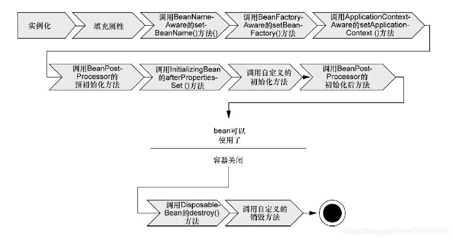

## Spring 概述（10）

### 什么是 spring?

Spring 是**一个轻量级 Java 开发框架**，最早有 **Rod Johnson** 创建，目的是为了解决企业级应用开发的业务逻辑层和其他各层的耦合问题。它是一个分层的 JavaSE/JavaEE full-stack（一站式）轻量级开源框架，为开发 Java 应用程序提供全面的基础架构支持。Spring 负责基础架构，因此 Java 开发者可以专注于应用程序的开发。

Spring 最根本的使命是**解决企业级应用开发的复杂性，即简化 Java 开发**。

Spring 可以做很多事情，它为企业级开发提供给了丰富的功能，但是这些功能的底层都依赖于它的两个核心特性，也就是**依赖注入（dependency injection，DI）\**和\**面向切面编程（aspect-oriented programming，AOP）**。

为了降低 Java 开发的复杂性，Spring 采取了以下 4 种关键策略

- 基于 POJO 的轻量级和最小侵入性编程；
- 通过依赖注入和面向接口实现松耦合；
- 基于切面和惯例进行声明式编程；
- 通过切面和模板减少样板式代码。

### Spring 框架的设计目标，设计理念，和核心是什么

**Spring 设计目标**：Spring 为开发者提供一个一站式轻量级应用开发平台；

**Spring 设计理念**：在 JavaEE 开发中，支持 POJO 和 JavaBean 开发方式，使应用面向接口开发，充分支持 OO（面向对象）设计方法；Spring 通过 IoC 容器实现对象耦合关系的管理，并实现依赖反转，将对象之间的依赖关系交给 IoC 容器，实现解耦；

**Spring 框架的核心**：IoC 容器和 AOP 模块。通过 IoC 容器管理 POJO 对象以及他们之间的耦合关系；通过 AOP 以动态非侵入的方式增强服务。

IoC 让相互协作的组件保持松散的耦合，而 AOP 编程允许你把遍布于应用各层的功能分离出来形成可重用的功能组件。

### Spring 的优缺点是什么？

优点

- 方便解耦，简化开发

  Spring 就是一个大工厂，可以将所有对象的创建和依赖关系的维护，交给 Spring 管理。

- AOP 编程的支持

  Spring 提供面向切面编程，可以方便的实现对程序进行权限拦截、运行监控等功能。

- 声明式事务的支持

  只需要通过配置就可以完成对事务的管理，而无需手动编程。

- 方便程序的测试

  Spring 对 Junit4 支持，可以通过注解方便的测试 Spring 程序。

- 方便集成各种优秀框架

  Spring 不排斥各种优秀的开源框架，其内部提供了对各种优秀框架的直接支持（如：Struts、Hibernate、MyBatis 等）。

- 降低 JavaEE API 的使用难度

  Spring 对 JavaEE 开发中非常难用的一些 API（JDBC、JavaMail、远程调用等），都提供了封装，使这些 API 应用难度大大降低。

缺点

- Spring 明明一个很轻量级的框架，却给人感觉大而全
- Spring 依赖反射，反射影响性能
- 使用门槛升高，入门 Spring 需要较长时间

### Spring 有哪些应用场景

**应用场景**：JavaEE 企业应用开发，包括 SSH、SSM 等

**Spring 价值**：

- Spring 是非侵入式的框架，目标是使应用程序代码对框架依赖最小化；
- Spring 提供一个一致的编程模型，使应用直接使用 POJO 开发，与运行环境隔离开来；
- Spring 推动应用设计风格向面向对象和面向接口开发转变，提高了代码的重用性和可测试性；

### Spring 由哪些模块组成？

Spring 总共大约有 20 个模块， 由 1300 多个不同的文件构成。 而这些组件被分别整合在`核心容器（Core Container）` 、 `AOP（Aspect Oriented Programming）和设备支持（Instrmentation）` 、`数据访问与集成（Data Access/Integeration）` 、 `Web`、 `消息（Messaging）` 、 `Test` 等 6 个模块中。 以下是 Spring 5 的模块结构图：


- spring core：提供了框架的基本组成部分，包括控制反转（Inversion of Control，IOC）和依赖注入（Dependency Injection，DI）功能。
- spring beans：提供了 BeanFactory，是工厂模式的一个经典实现，Spring 将管理对象称为 Bean。
- spring context：构建于 core 封装包基础上的 context 封装包，提供了一种框架式的对象访问方法。
- spring jdbc：提供了一个 JDBC 的抽象层，消除了烦琐的 JDBC 编码和数据库厂商特有的错误代码解析， 用于简化 JDBC。
- spring aop：提供了面向切面的编程实现，让你可以自定义拦截器、切点等。
- spring Web：提供了针对 Web 开发的集成特性，例如文件上传，利用 servlet listeners 进行 ioc 容器初始化和针对 Web 的 ApplicationContext。
- spring test：主要为测试提供支持的，支持使用 JUnit 或 TestNG 对 Spring 组件进行单元测试和集成测试。

### Spring 框架中都用到了哪些设计模式？

1. 工厂模式：BeanFactory 就是简单工厂模式的体现，用来创建对象的实例；
2. 单例模式：Bean 默认为单例模式。
3. 代理模式：Spring 的 AOP 功能用到了 JDK 的动态代理和 CGLIB 字节码生成技术；
4. 模板方法：用来解决代码重复的问题。比如. RestTemplate, JmsTemplate, JpaTemplate。
5. 观察者模式：定义对象键一种一对多的依赖关系，当一个对象的状态发生改变时，所有依赖于它的对象都会得到通知被制动更新，如 Spring 中 listener 的实现–ApplicationListener。

### 详细讲解一下核心容器（spring context 应用上下文) 模块

这是基本的 Spring 模块，提供 spring 框架的基础功能，BeanFactory 是 任何以 spring 为基础的应用的核心。Spring 框架建立在此模块之上，它使 Spring 成为一个容器。

Bean 工厂是工厂模式的一个实现，提供了控制反转功能，用来把应用的配置和依赖从真正的应用代码中分离。最常用的就是 org.springframework.beans.factory.xml.XmlBeanFactory ，它根据 XML 文件中的定义加载 beans。该容器从 XML 文件读取配置元数据并用它去创建一个完全配置的系统或应用。

### Spring 框架中有哪些不同类型的事件

Spring 提供了以下 5 种标准的事件：

1. 上下文更新事件（ContextRefreshedEvent）：在调用 ConfigurableApplicationContext 接口中的 refresh () 方法时被触发。
2. 上下文开始事件（ContextStartedEvent）：当容器调用 ConfigurableApplicationContext 的 Start () 方法开始 / 重新开始容器时触发该事件。
3. 上下文停止事件（ContextStoppedEvent）：当容器调用 ConfigurableApplicationContext 的 Stop () 方法停止容器时触发该事件。
4. 上下文关闭事件（ContextClosedEvent）：当 ApplicationContext 被关闭时触发该事件。容器被关闭时，其管理的所有单例 Bean 都被销毁。
5. 请求处理事件（RequestHandledEvent）：在 Web 应用中，当一个 http 请求（request）结束触发该事件。如果一个 bean 实现了 ApplicationListener 接口，当一个 ApplicationEvent 被发布以后，bean 会自动被通知。

### Spring 应用程序有哪些不同组件？

Spring 应用一般有以下组件：

- 接口 - 定义功能。
- Bean 类 - 它包含属性，setter 和 getter 方法，函数等。
- Bean 配置文件 - 包含类的信息以及如何配置它们。
- Spring 面向切面编程（AOP） - 提供面向切面编程的功能。
- 用户程序 - 它使用接口。

### 使用 Spring 有哪些方式？

使用 Spring 有以下方式：

- 作为一个成熟的 Spring Web 应用程序。
- 作为第三方 Web 框架，使用 Spring Frameworks 中间层。
- 作为企业级 Java Bean，它可以包装现有的 POJO（Plain Old Java Objects）。
- 用于远程使用。

## Spring 控制反转 (IOC)（13）

### 什么是 Spring IOC 容器？

控制反转即 IoC (Inversion of Control)，它把传统上由程序代码直接操控的对象的调用权交给容器，通过容器来实现对象组件的装配和管理。所谓的 “控制反转” 概念就是对组件对象控制权的转移，从程序代码本身转移到了外部容器。

Spring IOC 负责创建对象，管理对象（通过依赖注入（DI），装配对象，配置对象，并且管理这些对象的整个生命周期。

### 控制反转 (IoC) 有什么作用

- 管理对象的创建和依赖关系的维护。对象的创建并不是一件简单的事，在对象关系比较复杂时，如果依赖关系需要程序猿来维护的话，那是相当头疼的
- 解耦，由容器去维护具体的对象
- 托管了类的产生过程，比如我们需要在类的产生过程中做一些处理，最直接的例子就是代理，如果有容器程序可以把这部分处理交给容器，应用程序则无需去关心类是如何完成代理的

### IOC 的优点是什么？

- IOC 或 依赖注入把应用的代码量降到最低。
- 它使应用容易测试，单元测试不再需要单例和 JNDI 查找机制。
- 最小的代价和最小的侵入性使松散耦合得以实现。
- IOC 容器支持加载服务时的饿汉式初始化和懒加载。

### Spring IoC 的实现机制

Spring 中的 IoC 的实现原理就是工厂模式加反射机制。

示例：

```java
interface Fruit {
   public abstract void eat();
 }

class Apple implements Fruit {
    public void eat(){
        System.out.println("Apple");
    }
}

class Orange implements Fruit {
    public void eat(){
        System.out.println("Orange");
    }
}

class Factory {
    public static Fruit getInstance(String ClassName) {
        Fruit f=null;
        try {
            f=(Fruit)Class.forName(ClassName).newInstance();
        } catch (Exception e) {
            e.printStackTrace();
        }
        return f;
    }
}

class Client {
    public static void main(String[] a) {
        Fruit f=Factory.getInstance("io.github.dunwu.spring.Apple");
        if(f!=null){
            f.eat();
        }
    }
}
123456789101112131415161718192021222324252627282930313233343536
```

### Spring 的 IoC 支持哪些功能

Spring 的 IoC 设计支持以下功能：

- 依赖注入
- 依赖检查
- 自动装配
- 支持集合
- 指定初始化方法和销毁方法
- 支持回调某些方法（但是需要实现 Spring 接口，略有侵入）

其中，最重要的就是依赖注入，从 XML 的配置上说，即 ref 标签。对应 Spring RuntimeBeanReference 对象。

对于 IoC 来说，最重要的就是容器。容器管理着 Bean 的生命周期，控制着 Bean 的依赖注入。

### BeanFactory 和 ApplicationContext 有什么区别？

BeanFactory 和 ApplicationContext 是 Spring 的两大核心接口，都可以当做 Spring 的容器。其中 ApplicationContext 是 BeanFactory 的子接口。

依赖关系

BeanFactory：是 Spring 里面最底层的接口，包含了各种 Bean 的定义，读取 bean 配置文档，管理 bean 的加载、实例化，控制 bean 的生命周期，维护 bean 之间的依赖关系。

ApplicationContext 接口作为 BeanFactory 的派生，除了提供 BeanFactory 所具有的功能外，还提供了更完整的框架功能：

- 继承 MessageSource，因此支持国际化。
- 统一的资源文件访问方式。
- 提供在监听器中注册 bean 的事件。
- 同时加载多个配置文件。
- 载入多个（有继承关系）上下文 ，使得每一个上下文都专注于一个特定的层次，比如应用的 web 层。

加载方式

BeanFactroy 采用的是延迟加载形式来注入 Bean 的，即只有在使用到某个 Bean 时 (调用 getBean ())，才对该 Bean 进行加载实例化。这样，我们就不能发现一些存在的 Spring 的配置问题。如果 Bean 的某一个属性没有注入，BeanFacotry 加载后，直至第一次使用调用 getBean 方法才会抛出异常。

ApplicationContext，它是在容器启动时，一次性创建了所有的 Bean。这样，在容器启动时，我们就可以发现 Spring 中存在的配置错误，这样有利于检查所依赖属性是否注入。 ApplicationContext 启动后预载入所有的单实例 Bean，通过预载入单实例 bean , 确保当你需要的时候，你就不用等待，因为它们已经创建好了。

相对于基本的 BeanFactory，ApplicationContext 唯一的不足是占用内存空间。当应用程序配置 Bean 较多时，程序启动较慢。

创建方式

BeanFactory 通常以编程的方式被创建，ApplicationContext 还能以声明的方式创建，如使用 ContextLoader。

注册方式

BeanFactory 和 ApplicationContext 都支持 BeanPostProcessor、BeanFactoryPostProcessor 的使用，但两者之间的区别是：BeanFactory 需要手动注册，而 ApplicationContext 则是自动注册。

### Spring 如何设计容器的，BeanFactory 和 ApplicationContext 的关系详解

Spring 作者 Rod Johnson 设计了两个接口用以表示容器。

- BeanFactory
- ApplicationContext

BeanFactory 简单粗暴，可以理解为就是个 HashMap，Key 是 BeanName，Value 是 Bean 实例。通常只提供注册（put），获取（get）这两个功能。我们可以称之为 **“低级容器”**。

ApplicationContext 可以称之为 **“高级容器”**。因为他比 BeanFactory 多了更多的功能。他继承了多个接口。因此具备了更多的功能。例如资源的获取，支持多种消息（例如 JSP tag 的支持），对 BeanFactory 多了工具级别的支持等待。所以你看他的名字，已经不是 BeanFactory 之类的工厂了，而是 “应用上下文”， 代表着整个大容器的所有功能。该接口定义了一个 refresh 方法，此方法是所有阅读 Spring 源码的人的最熟悉的方法，用于刷新整个容器，即重新加载 / 刷新所有的 bean。

当然，除了这两个大接口，还有其他的辅助接口，这里就不介绍他们了。

BeanFactory 和 ApplicationContext 的关系

为了更直观的展示 “低级容器” 和 “高级容器” 的关系，这里通过常用的 ClassPathXmlApplicationContext 类来展示整个容器的层级 UML 关系。


有点复杂？ 先不要慌，我来解释一下。

最上面的是 BeanFactory，下面的 3 个绿色的，都是功能扩展接口，这里就不展开讲。

看下面的隶属 ApplicationContext 粉红色的 “高级容器”，依赖着 “低级容器”，这里说的是依赖，不是继承哦。他依赖着 “低级容器” 的 getBean 功能。而高级容器有更多的功能：支持不同的信息源头，可以访问文件资源，支持应用事件（Observer 模式）。

通常用户看到的就是 “高级容器”。 但 BeanFactory 也非常够用啦！

左边灰色区域的是 “低级容器”， 只负载加载 Bean，获取 Bean。容器其他的高级功能是没有的。例如上图画的 refresh 刷新 Bean 工厂所有配置，生命周期事件回调等。

小结

说了这么多，不知道你有没有理解 Spring IoC？ 这里小结一下：IoC 在 Spring 里，只需要低级容器就可以实现，2 个步骤：

1. 加载配置文件，解析成 BeanDefinition 放在 Map 里。
2. 调用 getBean 的时候，从 BeanDefinition 所属的 Map 里，拿出 Class 对象进行实例化，同时，如果有依赖关系，将递归调用 getBean 方法 —— 完成依赖注入。

上面就是 Spring 低级容器（BeanFactory）的 IoC。

至于高级容器 ApplicationContext，他包含了低级容器的功能，当他执行 refresh 模板方法的时候，将刷新整个容器的 Bean。同时其作为高级容器，包含了太多的功能。一句话，他不仅仅是 IoC。他支持不同信息源头，支持 BeanFactory 工具类，支持层级容器，支持访问文件资源，支持事件发布通知，支持接口回调等等。

### ApplicationContext 通常的实现是什么？

**FileSystemXmlApplicationContext** ：此容器从一个 XML 文件中加载 beans 的定义，XML Bean 配置文件的全路径名必须提供给它的构造函数。

**ClassPathXmlApplicationContext**：此容器也从一个 XML 文件中加载 beans 的定义，这里，你需要正确设置 classpath 因为这个容器将在 classpath 里找 bean 配置。

**WebXmlApplicationContext**：此容器加载一个 XML 文件，此文件定义了一个 WEB 应用的所有 bean。

### 什么是 Spring 的依赖注入？

控制反转 IoC 是一个很大的概念，可以用不同的方式来实现。其主要实现方式有两种：依赖注入和依赖查找

依赖注入：相对于 IoC 而言，依赖注入 (DI) 更加准确地描述了 IoC 的设计理念。所谓依赖注入（Dependency Injection），即组件之间的依赖关系由容器在应用系统运行期来决定，也就是由容器动态地将某种依赖关系的目标对象实例注入到应用系统中的各个关联的组件之中。组件不做定位查询，只提供普通的 Java 方法让容器去决定依赖关系。

### 依赖注入的基本原则

依赖注入的基本原则是：应用组件不应该负责查找资源或者其他依赖的协作对象。配置对象的工作应该由 IoC 容器负责，“查找资源” 的逻辑应该从应用组件的代码中抽取出来，交给 IoC 容器负责。容器全权负责组件的装配，它会把符合依赖关系的对象通过属性（JavaBean 中的 setter）或者是构造器传递给需要的对象。

### 依赖注入有什么优势

依赖注入之所以更流行是因为它是一种更可取的方式：让容器全权负责依赖查询，受管组件只需要暴露 JavaBean 的 setter 方法或者带参数的构造器或者接口，使容器可以在初始化时组装对象的依赖关系。其与依赖查找方式相比，主要优势为：

- 查找定位操作与应用代码完全无关。
- 不依赖于容器的 API，可以很容易地在任何容器以外使用应用对象。
- 不需要特殊的接口，绝大多数对象可以做到完全不必依赖容器。

### 有哪些不同类型的依赖注入实现方式？

依赖注入是时下最流行的 IoC 实现方式，依赖注入分为接口注入（Interface Injection），Setter 方法注入（Setter Injection）和构造器注入（Constructor Injection）三种方式。其中接口注入由于在灵活性和易用性比较差，现在从 Spring4 开始已被废弃。

**构造器依赖注入**：构造器依赖注入通过容器触发一个类的构造器来实现的，该类有一系列参数，每个参数代表一个对其他类的依赖。

**Setter 方法注入**：Setter 方法注入是容器通过调用无参构造器或无参 static 工厂 方法实例化 bean 之后，调用该 bean 的 setter 方法，即实现了基于 setter 的依赖注入。

### 构造器依赖注入和 Setter 方法注入的区别

| **构造函数注入**           | **setter** **注入**        |
| -------------------------- | -------------------------- |
| 没有部分注入               | 有部分注入                 |
| 不会覆盖 setter 属性       | 会覆盖 setter 属性         |
| 任意修改都会创建一个新实例 | 任意修改不会创建一个新实例 |
| 适用于设置很多属性         | 适用于设置少量属性         |

两种依赖方式都可以使用，构造器注入和 Setter 方法注入。最好的解决方案是用构造器参数实现强制依赖，setter 方法实现可选依赖。

## Spring Beans（19）

### 什么是 Spring beans？

Spring beans 是那些形成 Spring 应用的主干的 java 对象。它们被 Spring IOC 容器初始化，装配，和管理。这些 beans 通过容器中配置的元数据创建。比如，以 XML 文件中 的形式定义。

### 一个 Spring Bean 定义 包含什么？

一个 Spring Bean 的定义包含容器必知的所有配置元数据，包括如何创建一个 bean，它的生命周期详情及它的依赖。

### 如何给 Spring 容器提供配置元数据？Spring 有几种配置方式

这里有三种重要的方法给 Spring 容器提供配置元数据。

- XML 配置文件。
- 基于注解的配置。
- 基于 java 的配置。

### Spring 配置文件包含了哪些信息

Spring 配置文件是个 XML 文件，这个文件包含了类信息，描述了如何配置它们，以及如何相互调用。

### Spring 基于 xml 注入 bean 的几种方式

1. Set 方法注入；
2. 构造器注入：①通过 index 设置参数的位置；②通过 type 设置参数类型；
3. 静态工厂注入；
4. 实例工厂；

### 你怎样定义类的作用域？

当定义一个 在 Spring 里，我们还能给这个 bean 声明一个作用域。它可以通过 bean 定义中的 scope 属性来定义。如，当 Spring 要在需要的时候每次生产一个新的 bean 实例，bean 的 scope 属性被指定为 prototype。另一方面，一个 bean 每次使用的时候必须返回同一个实例，这个 bean 的 scope 属性 必须设为 singleton。

### 解释 Spring 支持的几种 bean 的作用域

Spring 框架支持以下五种 bean 的作用域：

- **singleton :** bean 在每个 Spring ioc 容器中只有一个实例。
- **prototype**：一个 bean 的定义可以有多个实例。
- **request**：每次 http 请求都会创建一个 bean，该作用域仅在基于 web 的 Spring ApplicationContext 情形下有效。
- **session**：在一个 HTTP Session 中，一个 bean 定义对应一个实例。该作用域仅在基于 web 的 Spring ApplicationContext 情形下有效。
- **global-session**：在一个全局的 HTTP Session 中，一个 bean 定义对应一个实例。该作用域仅在基于 web 的 Spring ApplicationContext 情形下有效。

**注意：** 缺省的 Spring bean 的作用域是 Singleton。使用 prototype 作用域需要慎重的思考，因为频繁创建和销毁 bean 会带来很大的性能开销。

### Spring 框架中的单例 bean 是线程安全的吗？

不是，Spring 框架中的单例 bean 不是线程安全的。

spring 中的 bean 默认是单例模式，spring 框架并没有对单例 bean 进行多线程的封装处理。

实际上大部分时候 spring bean 无状态的（比如 dao 类），所有某种程度上来说 bean 也是安全的，但如果 bean 有状态的话（比如 view model 对象），那就要开发者自己去保证线程安全了，最简单的就是改变 bean 的作用域，把 “singleton” 变更为 “prototype”，这样请求 bean 相当于 new Bean () 了，所以就可以保证线程安全了。

- 有状态就是有数据存储功能。
- 无状态就是不会保存数据。

### Spring 如何处理线程并发问题？

在一般情况下，只有无状态的 Bean 才可以在多线程环境下共享，在 Spring 中，绝大部分 Bean 都可以声明为 singleton 作用域，因为 Spring 对一些 Bean 中非线程安全状态采用 ThreadLocal 进行处理，解决线程安全问题。

ThreadLocal 和线程同步机制都是为了解决多线程中相同变量的访问冲突问题。同步机制采用了 “时间换空间” 的方式，仅提供一份变量，不同的线程在访问前需要获取锁，没获得锁的线程则需要排队。而 ThreadLocal 采用了 “空间换时间” 的方式。

ThreadLocal 会为每一个线程提供一个独立的变量副本，从而隔离了多个线程对数据的访问冲突。因为每一个线程都拥有自己的变量副本，从而也就没有必要对该变量进行同步了。ThreadLocal 提供了线程安全的共享对象，在编写多线程代码时，可以把不安全的变量封装进 ThreadLocal。

### 解释 Spring 框架中 bean 的生命周期

在传统的 Java 应用中，bean 的生命周期很简单。使用 Java 关键字 new 进行 bean 实例化，然后该 bean 就可以使用了。一旦该 bean 不再被使用，则由 Java 自动进行垃圾回收。相比之下，Spring 容器中的 bean 的生命周期就显得相对复杂多了。正确理解 Spring bean 的生命周期非常重要，因为你或许要利用 Spring 提供的扩展点来自定义 bean 的创建过程。下图展示了 bean 装载到 Spring 应用上下文中的一个典型的生命周期过程。



bean 在 Spring 容器中从创建到销毁经历了若干阶段，每一阶段都可以针对 Spring 如何管理 bean 进行个性化定制。

正如你所见，在 bean 准备就绪之前，bean 工厂执行了若干启动步骤。

我们对上图进行详细描述：

Spring 对 bean 进行实例化；

Spring 将值和 bean 的引用注入到 bean 对应的属性中；

如果 bean 实现了 BeanNameAware 接口，Spring 将 bean 的 ID 传递给 setBean-Name () 方法；

如果 bean 实现了 BeanFactoryAware 接口，Spring 将调用 setBeanFactory () 方法，将 BeanFactory 容器实例传入；

如果 bean 实现了 ApplicationContextAware 接口，Spring 将调用 setApplicationContext () 方法，将 bean 所在的应用上下文的引用传入进来；

如果 bean 实现了 BeanPostProcessor 接口，Spring 将调用它们的 post-ProcessBeforeInitialization () 方法；

如果 bean 实现了 InitializingBean 接口，Spring 将调用它们的 after-PropertiesSet () 方法。类似地，如果 bean 使用 initmethod 声明了初始化方法，该方法也会被调用；

如果 bean 实现了 BeanPostProcessor 接口，Spring 将调用它们的 post-ProcessAfterInitialization () 方法；

此时，bean 已经准备就绪，可以被应用程序使用了，它们将一直驻留在应用上下文中，直到该应用上下文被销毁；

如果 bean 实现了 DisposableBean 接口，Spring 将调用它的 destroy () 接口方法。同样，如果 bean 使用 destroy-method 声明了销毁方法，该方法也会被调用。

现在你已经了解了如何创建和加载一个 Spring 容器。但是一个空的容器并没有太大的价值，在你把东西放进去之前，它里面什么都没有。为了从 Spring 的 DI (依赖注入) 中受益，我们必须将应用对象装配进 Spring 容器中。

### 哪些是重要的 bean 生命周期方法？ 你能重载它们吗？

有两个重要的 bean 生命周期方法，第一个是 setup ， 它是在容器加载 bean 的时候被调用。第二个方法是 teardown 它是在容器卸载类的时候被调用。

bean 标签有两个重要的属性（init-method 和 destroy-method）。用它们你可以自己定制初始化和注销方法。它们也有相应的注解（@PostConstruct 和 @PreDestroy）。

### 什么是 Spring 的内部 bean？什么是 Spring inner beans？

在 Spring 框架中，当一个 bean 仅被用作另一个 bean 的属性时，它能被声明为一个内部 bean。内部 bean 可以用 setter 注入 “属性” 和构造方法注入 “构造参数” 的方式来实现，内部 bean 通常是匿名的，它们的 Scope 一般是 prototype。

### 在 Spring 中如何注入一个 java 集合？

Spring 提供以下几种集合的配置元素：

类型用于注入一列值，允许有相同的值。

类型用于注入一组值，不允许有相同的值。

类型用于注入一组键值对，键和值都可以为任意类型。

类型用于注入一组键值对，键和值都只能为 String 类型。

### 什么是 bean 装配？

装配，或 bean 装配是指在 Spring 容器中把 bean 组装到一起，前提是容器需要知道 bean 的依赖关系，如何通过依赖注入来把它们装配到一起。

### 什么是 bean 的自动装配？

在 Spring 框架中，在配置文件中设定 bean 的依赖关系是一个很好的机制，Spring 容器能够自动装配相互合作的 bean，这意味着容器不需要和配置，能通过 Bean 工厂自动处理 bean 之间的协作。这意味着 Spring 可以通过向 Bean Factory 中注入的方式自动搞定 bean 之间的依赖关系。自动装配可以设置在每个 bean 上，也可以设定在特定的 bean 上。

### 解释不同方式的自动装配，spring 自动装配 bean 有哪些方式？

在 spring 中，对象无需自己查找或创建与其关联的其他对象，由容器负责把需要相互协作的对象引用赋予各个对象，使用 autowire 来配置自动装载模式。

在 Spring 框架 xml 配置中共有 5 种自动装配：

- no：默认的方式是不进行自动装配的，通过手工设置 ref 属性来进行装配 bean。
- byName：通过 bean 的名称进行自动装配，如果一个 bean 的 property 与另一 bean 的 name 相同，就进行自动装配。
- byType：通过参数的数据类型进行自动装配。
- constructor：利用构造函数进行装配，并且构造函数的参数通过 byType 进行装配。
- autodetect：自动探测，如果有构造方法，通过 construct 的方式自动装配，否则使用 byType 的方式自动装配。

### 使用 @Autowired 注解自动装配的过程是怎样的？

使用 @Autowired 注解来自动装配指定的 bean。在使用 @Autowired 注解之前需要在 Spring 配置文件进行配置，<context:annotation-config />。

在启动 spring IoC 时，容器自动装载了一个 AutowiredAnnotationBeanPostProcessor 后置处理器，当容器扫描到 @Autowied、@Resource 或 @Inject 时，就会在 IoC 容器自动查找需要的 bean，并装配给该对象的属性。在使用 @Autowired 时，首先在容器中查询对应类型的 bean：

- 如果查询结果刚好为一个，就将该 bean 装配给 @Autowired 指定的数据；
- 如果查询的结果不止一个，那么 @Autowired 会根据名称来查找；
- 如果上述查找的结果为空，那么会抛出异常。解决方法时，使用 required=false。

### 自动装配有哪些局限性？

自动装配的局限性是：

**重写**：你仍需用 和 配置来定义依赖，意味着总要重写自动装配。

**基本数据类型**：你不能自动装配简单的属性，如基本数据类型，String 字符串，和类。

**模糊特性**：自动装配不如显式装配精确，如果有可能，建议使用显式装配。

### 你可以在 Spring 中注入一个 null 和一个空字符串吗？

可以。

## Spring 注解（8）

### 什么是基于 Java 的 Spring 注解配置？给一些注解的例子

基于 Java 的配置，允许你在少量的 Java 注解的帮助下，进行你的大部分 Spring 配置而非通过 XML 文件。

以 @Configuration 注解为例，它用来标记类可以当做一个 bean 的定义，被 Spring IOC 容器使用。

另一个例子是 @Bean 注解，它表示此方法将要返回一个对象，作为一个 bean 注册进 Spring 应用上下文。

```java
@Configuration
public class StudentConfig {
    @Bean
    public StudentBean myStudent() {
        return new StudentBean();
    }
}
1234567
```

### 怎样开启注解装配？

注解装配在默认情况下是不开启的，为了使用注解装配，我们必须在 Spring 配置文件中配置 `` 元素。

### @Component, @Controller, @Repository, @Service 有何区别？

@Component：这将 java 类标记为 bean。它是任何 Spring 管理组件的通用构造型。spring 的组件扫描机制现在可以将其拾取并将其拉入应用程序环境中。

@Controller：这将一个类标记为 Spring Web MVC 控制器。标有它的 Bean 会自动导入到 IoC 容器中。

@Service：此注解是组件注解的特化。它不会对 @Component 注解提供任何其他行为。您可以在服务层类中使用 @Service 而不是 @Component，因为它以更好的方式指定了意图。

@Repository：这个注解是具有类似用途和功能的 @Component 注解的特化。它为 DAO 提供了额外的好处。它将 DAO 导入 IoC 容器，并使未经检查的异常有资格转换为 Spring DataAccessException。

### @Required 注解有什么作用

这个注解表明 bean 的属性必须在配置的时候设置，通过一个 bean 定义的显式的属性值或通过自动装配，若 @Required 注解的 bean 属性未被设置，容器将抛出 BeanInitializationException。示例：

```java
public class Employee {
    private String name;
    @Required
    public void setName(String name){
        this.name=name;
    }
    public string getName(){
        return name;
    }
}
12345678910
```

### @Autowired 注解有什么作用

@Autowired 默认是按照类型装配注入的，默认情况下它要求依赖对象必须存在（可以设置它 required 属性为 false）。@Autowired 注解提供了更细粒度的控制，包括在何处以及如何完成自动装配。它的用法和 @Required 一样，修饰 setter 方法、构造器、属性或者具有任意名称和 / 或多个参数的 PN 方法。

```java
public class Employee {
    private String name;
    @Autowired
    public void setName(String name) {
        this.name=name;
    }
    public string getName(){
        return name;
    }
}
12345678910
```

### @Autowired 和 @Resource 之间的区别

@Autowired 可用于：构造函数、成员变量、Setter 方法

@Autowired 和 @Resource 之间的区别

- @Autowired 默认是按照类型装配注入的，默认情况下它要求依赖对象必须存在（可以设置它 required 属性为 false）。
- @Resource 默认是按照名称来装配注入的，只有当找不到与名称匹配的 bean 才会按照类型来装配注入。

### @Qualifier 注解有什么作用

当您创建多个相同类型的 bean 并希望仅使用属性装配其中一个 bean 时，您可以使用 @Qualifier 注解和 @Autowired 通过指定应该装配哪个确切的 bean 来消除歧义。

### @RequestMapping 注解有什么用？

@RequestMapping 注解用于将特定 HTTP 请求方法映射到将处理相应请求的控制器中的特定类 / 方法。此注释可应用于两个级别：

- 类级别：映射请求的 URL
- 方法级别：映射 URL 以及 HTTP 请求方法

## Spring 数据访问（14）

### 解释对象 / 关系映射集成模块

Spring 通过提供 ORM 模块，支持我们在直接 JDBC 之上使用一个对象 / 关系映射映射 (ORM) 工具，Spring 支持集成主流的 ORM 框架，如 Hiberate，JDO 和 iBATIS，JPA，TopLink，JDO，OJB 。Spring 的事务管理同样支持以上所有 ORM 框架及 JDBC。

### 在 Spring 框架中如何更有效地使用 JDBC？

使用 Spring JDBC 框架，资源管理和错误处理的代价都会被减轻。所以开发者只需写 statements 和 queries 从数据存取数据，JDBC 也可以在 Spring 框架提供的模板类的帮助下更有效地被使用，这个模板叫 JdbcTemplate

### 解释 JDBC 抽象和 DAO 模块

通过使用 JDBC 抽象和 DAO 模块，保证数据库代码的简洁，并能避免数据库资源错误关闭导致的问题，它在各种不同的数据库的错误信息之上，提供了一个统一的异常访问层。它还利用 Spring 的 AOP 模块给 Spring 应用中的对象提供事务管理服务。

### spring DAO 有什么用？

Spring DAO（数据访问对象） 使得 JDBC，Hibernate 或 JDO 这样的数据访问技术更容易以一种统一的方式工作。这使得用户容易在持久性技术之间切换。它还允许您在编写代码时，无需考虑捕获每种技术不同的异常。

### spring JDBC API 中存在哪些类？

JdbcTemplate

SimpleJdbcTemplate

NamedParameterJdbcTemplate

SimpleJdbcInsert

SimpleJdbcCall

### JdbcTemplate 是什么

JdbcTemplate 类提供了很多便利的方法解决诸如把数据库数据转变成基本数据类型或对象，执行写好的或可调用的数据库操作语句，提供自定义的数据错误处理。

### 使用 Spring 通过什么方式访问 Hibernate？使用 Spring 访问 Hibernate 的方法有哪些？

在 Spring 中有两种方式访问 Hibernate：

- 使用 Hibernate 模板和回调进行控制反转
- 扩展 HibernateDAOSupport 并应用 AOP 拦截器节点

### 如何通过 HibernateDaoSupport 将 Spring 和 Hibernate 结合起来？

用 Spring 的 SessionFactory 调用 LocalSessionFactory。集成过程分三步：

- 配置 the Hibernate SessionFactory
- 继承 HibernateDaoSupport 实现一个 DAO
- 在 AOP 支持的事务中装配

### Spring 支持的事务管理类型， spring 事务实现方式有哪些？

Spring 支持两种类型的事务管理：

**编程式事务管理**：这意味你通过编程的方式管理事务，给你带来极大的灵活性，但是难维护。

**声明式事务管理**：这意味着你可以将业务代码和事务管理分离，你只需用注解和 XML 配置来管理事务。

### Spring 事务的实现方式和实现原理

Spring 事务的本质其实就是数据库对事务的支持，没有数据库的事务支持，spring 是无法提供事务功能的。真正的数据库层的事务提交和回滚是通过 binlog 或者 redo log 实现的。

### 说一下 Spring 的事务传播行为

spring 事务的传播行为说的是，当多个事务同时存在的时候，spring 如何处理这些事务的行为。

> ① PROPAGATION_REQUIRED：如果当前没有事务，就创建一个新事务，如果当前存在事务，就加入该事务，该设置是最常用的设置。
>
> ② PROPAGATION_SUPPORTS：支持当前事务，如果当前存在事务，就加入该事务，如果当前不存在事务，就以非事务执行。
>
> ③ PROPAGATION_MANDATORY：支持当前事务，如果当前存在事务，就加入该事务，如果当前不存在事务，就抛出异常。
>
> ④ PROPAGATION_REQUIRES_NEW：创建新事务，无论当前存不存在事务，都创建新事务。
>
> ⑤ PROPAGATION_NOT_SUPPORTED：以非事务方式执行操作，如果当前存在事务，就把当前事务挂起。
>
> ⑥ PROPAGATION_NEVER：以非事务方式执行，如果当前存在事务，则抛出异常。
>
> ⑦ PROPAGATION_NESTED：如果当前存在事务，则在嵌套事务内执行。如果当前没有事务，则按 REQUIRED 属性执行。

### 说一下 spring 的事务隔离？

spring 有五大隔离级别，默认值为 ISOLATION_DEFAULT（使用数据库的设置），其他四个隔离级别和数据库的隔离级别一致：

1. ISOLATION_DEFAULT：用底层数据库的设置隔离级别，数据库设置的是什么我就用什么；
2. ISOLATION_READ_UNCOMMITTED：未提交读，最低隔离级别、事务未提交前，就可被其他事务读取（会出现幻读、脏读、不可重复读）；
3. ISOLATION_READ_COMMITTED：提交读，一个事务提交后才能被其他事务读取到（会造成幻读、不可重复读），SQL server 的默认级别；
4. ISOLATION_REPEATABLE_READ：可重复读，保证多次读取同一个数据时，其值都和事务开始时候的内容是一致，禁止读取到别的事务未提交的数据（会造成幻读），MySQL 的默认级别；
5. ISOLATION_SERIALIZABLE：序列化，代价最高最可靠的隔离级别，该隔离级别能防止脏读、不可重复读、幻读。

**脏读** ：表示一个事务能够读取另一个事务中还未提交的数据。比如，某个事务尝试插入记录 A，此时该事务还未提交，然后另一个事务尝试读取到了记录 A。

**不可重复读** ：是指在一个事务内，多次读同一数据。

**幻读** ：指同一个事务内多次查询返回的结果集不一样。比如同一个事务 A 第一次查询时候有 n 条记录，但是第二次同等条件下查询却有 n+1 条记录，这就好像产生了幻觉。发生幻读的原因也是另外一个事务新增或者删除或者修改了第一个事务结果集里面的数据，同一个记录的数据内容被修改了，所有数据行的记录就变多或者变少了。

### Spring 框架的事务管理有哪些优点？

- 为不同的事务 API 如 JTA，JDBC，Hibernate，JPA 和 JDO，提供一个不变的编程模式。
- 为编程式事务管理提供了一套简单的 API 而不是一些复杂的事务 API
- 支持声明式事务管理。
- 和 Spring 各种数据访问抽象层很好得集成。

### 你更倾向用那种事务管理类型？

大多数 Spring 框架的用户选择声明式事务管理，因为它对应用代码的影响最小，因此更符合一个无侵入的轻量级容器的思想。声明式事务管理要优于编程式事务管理，虽然比编程式事务管理（这种方式允许你通过代码控制事务）少了一点灵活性。唯一不足地方是，最细粒度只能作用到方法级别，无法做到像编程式事务那样可以作用到代码块级别。

## Spring 面向切面编程 (AOP)（13）

### 什么是 AOP

OOP (Object-Oriented Programming) 面向对象编程，允许开发者定义纵向的关系，但并适用于定义横向的关系，导致了大量代码的重复，而不利于各个模块的重用。

AOP (Aspect-Oriented Programming)，一般称为面向切面编程，作为面向对象的一种补充，用于将那些与业务无关，但却对多个对象产生影响的公共行为和逻辑，抽取并封装为一个可重用的模块，这个模块被命名为 “切面”（Aspect），减少系统中的重复代码，降低了模块间的耦合度，同时提高了系统的可维护性。可用于权限认证、日志、事务处理等。

### Spring AOP and AspectJ AOP 有什么区别？AOP 有哪些实现方式？

AOP 实现的关键在于 代理模式，AOP 代理主要分为静态代理和动态代理。静态代理的代表为 AspectJ；动态代理则以 Spring AOP 为代表。

（1）AspectJ 是静态代理的增强，所谓静态代理，就是 AOP 框架会在编译阶段生成 AOP 代理类，因此也称为编译时增强，他会在编译阶段将 AspectJ (切面) 织入到 Java 字节码中，运行的时候就是增强之后的 AOP 对象。

（2）Spring AOP 使用的动态代理，所谓的动态代理就是说 AOP 框架不会去修改字节码，而是每次运行时在内存中临时为方法生成一个 AOP 对象，这个 AOP 对象包含了目标对象的全部方法，并且在特定的切点做了增强处理，并回调原对象的方法。

### JDK 动态代理和 CGLIB 动态代理的区别

Spring AOP 中的动态代理主要有两种方式，JDK 动态代理和 CGLIB 动态代理：

- JDK 动态代理只提供接口的代理，不支持类的代理。核心 InvocationHandler 接口和 Proxy 类，InvocationHandler 通过 invoke () 方法反射来调用目标类中的代码，动态地将横切逻辑和业务编织在一起；接着，Proxy 利用 InvocationHandler 动态创建一个符合某一接口的的实例，生成目标类的代理对象。
- 如果代理类没有实现 InvocationHandler 接口，那么 Spring AOP 会选择使用 CGLIB 来动态代理目标类。CGLIB（Code Generation Library），是一个代码生成的类库，可以在运行时动态的生成指定类的一个子类对象，并覆盖其中特定方法并添加增强代码，从而实现 AOP。CGLIB 是通过继承的方式做的动态代理，因此如果某个类被标记为 final，那么它是无法使用 CGLIB 做动态代理的。

静态代理与动态代理区别在于生成 AOP 代理对象的时机不同，相对来说 AspectJ 的静态代理方式具有更好的性能，但是 AspectJ 需要特定的编译器进行处理，而 Spring AOP 则无需特定的编译器处理。

> InvocationHandler 的 invoke (Object proxy,Method method,Object [] args)：proxy 是最终生成的代理实例；method 是被代理目标实例的某个具体方法；args 是被代理目标实例某个方法的具体入参，在方法反射调用时使用。

### 如何理解 Spring 中的代理？

将 Advice 应用于目标对象后创建的对象称为代理。在客户端对象的情况下，目标对象和代理对象是相同的。

Advice + Target Object = Proxy

### 解释一下 Spring AOP 里面的几个名词

（1）切面（Aspect）：切面是通知和切点的结合。通知和切点共同定义了切面的全部内容。 在 Spring AOP 中，切面可以使用通用类（基于模式的风格） 或者在普通类中以 @AspectJ 注解来实现。

（2）连接点（Join point）：指方法，在 Spring AOP 中，一个连接点 总是 代表一个方法的执行。 应用可能有数以千计的时机应用通知。这些时机被称为连接点。连接点是在应用执行过程中能够插入切面的一个点。这个点可以是调用方法时、抛出异常时、甚至修改一个字段时。切面代码可以利用这些点插入到应用的正常流程之中，并添加新的行为。

（3）通知（Advice）：在 AOP 术语中，切面的工作被称为通知。

（4）切入点（Pointcut）：切点的定义会匹配通知所要织入的一个或多个连接点。我们通常使用明确的类和方法名称，或是利用正则表达式定义所匹配的类和方法名称来指定这些切点。

（5）引入（Introduction）：引入允许我们向现有类添加新方法或属性。

（6）目标对象（Target Object）： 被一个或者多个切面（aspect）所通知（advise）的对象。它通常是一个代理对象。也有人把它叫做 被通知（adviced） 对象。 既然 Spring AOP 是通过运行时代理实现的，这个对象永远是一个 被代理（proxied） 对象。

（7）织入（Weaving）：织入是把切面应用到目标对象并创建新的代理对象的过程。在目标对象的生命周期里有多少个点可以进行织入：

- 编译期：切面在目标类编译时被织入。AspectJ 的织入编译器是以这种方式织入切面的。
- 类加载期：切面在目标类加载到 JVM 时被织入。需要特殊的类加载器，它可以在目标类被引入应用之前增强该目标类的字节码。AspectJ5 的加载时织入就支持以这种方式织入切面。
- 运行期：切面在应用运行的某个时刻被织入。一般情况下，在织入切面时，AOP 容器会为目标对象动态地创建一个代理对象。SpringAOP 就是以这种方式织入切面。

### Spring 在运行时通知对象

通过在代理类中包裹切面，Spring 在运行期把切面织入到 Spring 管理的 bean 中。代理封装了目标类，并拦截被通知方法的调用，再把调用转发给真正的目标 bean。当代理拦截到方法调用时，在调用目标 bean 方法之前，会执行切面逻辑。

直到应用需要被代理的 bean 时，Spring 才创建代理对象。如果使用的是 ApplicationContext 的话，在 ApplicationContext 从 BeanFactory 中加载所有 bean 的时候，Spring 才会创建被代理的对象。因为 Spring 运行时才创建代理对象，所以我们不需要特殊的编译器来织入 SpringAOP 的切面。

### Spring 只支持方法级别的连接点

因为 Spring 基于动态代理，所以 Spring 只支持方法连接点。Spring 缺少对字段连接点的支持，而且它不支持构造器连接点。方法之外的连接点拦截功能，我们可以利用 Aspect 来补充。

### 在 Spring AOP 中，关注点和横切关注的区别是什么？在 spring aop 中 concern 和 cross-cutting concern 的不同之处

关注点（concern）是应用中一个模块的行为，一个关注点可能会被定义成一个我们想实现的一个功能。

横切关注点（cross-cutting concern）是一个关注点，此关注点是整个应用都会使用的功能，并影响整个应用，比如日志，安全和数据传输，几乎应用的每个模块都需要的功能。因此这些都属于横切关注点。

### Spring 通知有哪些类型？

在 AOP 术语中，切面的工作被称为通知，实际上是程序执行时要通过 SpringAOP 框架触发的代码段。

Spring 切面可以应用 5 种类型的通知：

1. 前置通知（Before）：在目标方法被调用之前调用通知功能；
2. 后置通知（After）：在目标方法完成之后调用通知，此时不会关心方法的输出是什么；
3. 返回通知（After-returning ）：在目标方法成功执行之后调用通知；
4. 异常通知（After-throwing）：在目标方法抛出异常后调用通知；
5. 环绕通知（Around）：通知包裹了被通知的方法，在被通知的方法调用之前和调用之后执行自定义的行为。

> 同一个 aspect，不同 advice 的执行顺序：
>
> ①没有异常情况下的执行顺序：
>
> around before advice
> before advice
> target method 执行
> around after advice
> after advice
> afterReturning
>
> ②有异常情况下的执行顺序：
>
> around before advice
> before advice
> target method 执行
> around after advice
> after advice
> afterThrowing: 异常发生
> java.lang.RuntimeException: 异常发生

### 什么是切面 Aspect？

aspect 由 pointcount 和 advice 组成，切面是通知和切点的结合。 它既包含了横切逻辑的定义，也包括了连接点的定义. Spring AOP 就是负责实施切面的框架，它将切面所定义的横切逻辑编织到切面所指定的连接点中.
AOP 的工作重心在于如何将增强编织目标对象的连接点上，这里包含两个工作:

- 如何通过 pointcut 和 advice 定位到特定的 joinpoint 上
- 如何在 advice 中编写切面代码.

可以简单地认为，使用 @Aspect 注解的类就是切面.


### 解释基于 XML Schema 方式的切面实现

在这种情况下，切面由常规类以及基于 XML 的配置实现。

### 解释基于注解的切面实现

在这种情况下 (基于 @AspectJ 的实现)，涉及到的切面声明的风格与带有 java5 标注的普通 java 类一致。

### 有几种不同类型的自动代理？

BeanNameAutoProxyCreator

DefaultAdvisorAutoProxyCreator

Metadata autoproxying