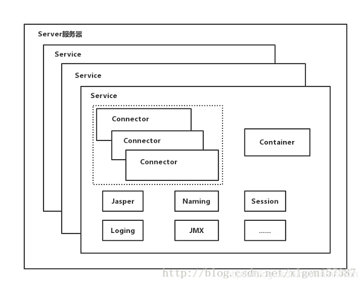
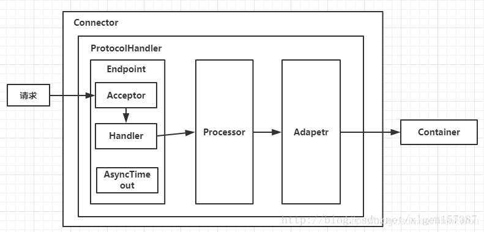

## Tomcat 是什么？

Tomcat 服务器 Apache 软件基金会项目中的一个核心项目，是一个免费的开放源代码的 Web 应用服务器，属于轻量级应用服务器，在中小型系统和并发访问用户不是很多的场合下被普遍使用，是开发和调试 JSP 程序的首选。

## Tomcat 的缺省端口是多少，怎么修改

1. 找到 Tomcat 目录下的 conf 文件夹
2. 进入 conf 文件夹里面找到 server.xml 文件
3. 打开 server.xml 文件
4. 在 **server.xml** 文件里面找到下列信息
5. 把 Connector 标签的 8080 端口改成你想要的端口

```xml
<Service name="Catalina">
<Connector port="8080" protocol="HTTP/1.1" 
               connectionTimeout="20000" 
               redirectPort="8443" />
1234
```

## tomcat 有哪几种 Connector 运行模式 (优化)？

下面，我们先大致了解 Tomcat Connector 的三种运行模式。

- **BIO：同步并阻塞** 一个线程处理一个请求。缺点：并发量高时，线程数较多，浪费资源。Tomcat7 或以下，在 Linux 系统中默认使用这种方式。

 **配制项**：protocol=”HTTP/1.1”

- **NIO：同步非阻塞 IO**

  利用 Java 的异步 IO 处理，可以通过少量的线程处理大量的请求，可以复用同一个线程处理多个 connection (多路复用)。

  Tomcat8 在 Linux 系统中默认使用这种方式。

  Tomcat7 必须修改 Connector 配置来启动。

  **配制项**：protocol=”org.apache.coyote.http11.Http11NioProtocol”

  **备注**：我们常用的 Jetty，Mina，ZooKeeper 等都是基于 java nio 实现.

- APR：即 Apache Portable Runtime，从操作系统层面解决 io 阻塞问题。**AIO 方式，** **异步非阻塞 IO**(Java NIO2 又叫 AIO) 主要与 NIO 的区别主要是操作系统的底层区别。可以做个比喻：比作快递，NIO 就是网购后要自己到官网查下快递是否已经到了 (可能是多次)，然后自己去取快递；AIO 就是快递员送货上门了 (不用关注快递进度)。

  **配制项**：protocol=”org.apache.coyote.http11.Http11AprProtocol”

  **备注**：需在本地服务器安装 APR 库。Tomcat7 或 Tomcat8 在 Win7 或以上的系统中启动默认使用这种方式。Linux 如果安装了 apr 和 native，Tomcat 直接启动就支持 apr。

## Tomcat 有几种部署方式？

**在 Tomcat 中部署 Web 应用的方式主要有如下几种：**

1. 利用 Tomcat 的自动部署。

   把 web 应用拷贝到 webapps 目录。Tomcat 在启动时会加载目录下的应用，并将编译后的结果放入 work 目录下。

2. 使用 Manager App 控制台部署。

   在 tomcat 主页点击 “Manager App” 进入应用管理控制台，可以指定一个 web 应用的路径或 war 文件。

3. 修改 conf/server.xml 文件部署。

   修改 conf/server.xml 文件，增加 Context 节点可以部署应用。

4. 增加自定义的 Web 部署文件。

   在 conf/Catalina/localhost/ 路径下增加 xyz.xml 文件，内容是 Context 节点，可以部署应用。

## tomcat 容器是如何创建 servlet 类实例？用到了什么原理？

1. 当容器启动时，会读取在 webapps 目录下所有的 web 应用中的 web.xml 文件，然后对 **xml 文件进行解析，并读取 servlet 注册信息**。然后，将每个应用中注册的 servlet 类都进行加载，并通过 **反射的方式实例化**。（有时候也是在第一次请求时实例化）
2. 在 servlet 注册时加上 1 如果为正数，则在一开始就实例化，如果不写或为负数，则第一次请求实例化。

## Tomcat 工作模式

Tomcat 作为 servlet 容器，有三种工作模式：

- 1、独立的 servlet 容器，servlet 容器是 web 服务器的一部分；
- 2、进程内的 servlet 容器，servlet 容器是作为 web 服务器的插件和 java 容器的实现，web 服务器插件在内部地址空间打开一个 jvm 使得 java 容器在内部得以运行。反应速度快但伸缩性不足；
- 3、进程外的 servlet 容器，servlet 容器运行于 web 服务器之外的地址空间，并作为 web 服务器的插件和 java 容器实现的结合。反应时间不如进程内但伸缩性和稳定性比进程内优；

进入 Tomcat 的请求可以根据 Tomcat 的工作模式分为如下两类：

- Tomcat 作为应用程序服务器：请求来自于前端的 web 服务器，这可能是 Apache, IIS, Nginx 等；
- Tomcat 作为独立服务器：请求来自于 web 浏览器；

面试时问到 Tomcat 相关问题的几率并不高，正式因为如此，很多人忽略了对 Tomcat 相关技能的掌握，下面这一篇文章整理了 Tomcat 相关的系统架构，介绍了 Server、Service、Connector、Container 之间的关系，各个模块的功能，可以说把这几个掌握住了，Tomcat 相关的面试题你就不会有任何问题了！另外，在面试的时候你还要有意识无意识的往 Tomcat 这个地方引，就比如说常见的 Spring MVC 的执行流程，一个 URL 的完整调用链路，这些相关的题目你是可以往 Tomcat 处理请求的这个过程去说的！掌握了 Tomcat 这些技能，面试官一定会佩服你的！

学了本章之后你应该明白的是：

- Server、Service、Connector、Container 四大组件之间的关系和联系，以及他们的主要功能点；
- Tomcat 执行的整体架构，请求是如何被一步步处理的；
- Engine、Host、Context、Wrapper 相关的概念关系；
- Container 是如何处理请求的；
- Tomcat 用到的相关设计模式；

## Tomcat 顶层架构

俗话说，站在巨人的肩膀上看世界，一般学习的时候也是先总览一下整体，然后逐个部分个个击破，最后形成思路，了解具体细节，Tomcat 的结构很复杂，但是 Tomcat 非常的模块化，找到了 Tomcat 最核心的模块，问题才可以游刃而解，了解了 Tomcat 的整体架构对以后深入了解 Tomcat 来说至关重要！

先上一张 Tomcat 的顶层结构图（图 A），如下：



Tomcat 中最顶层的容器是 Server，代表着整个服务器，从上图中可以看出，一个 Server 可以包含至少一个 Service，即可以包含多个 Service，用于具体提供服务。

Service 主要包含两个部分：Connector 和 Container。从上图中可以看出 Tomcat 的心脏就是这两个组件，他们的作用如下：

- Connector 用于处理连接相关的事情，并提供 Socket 与 Request 请求和 Response 响应相关的转化；
- Container 用于封装和管理 Servlet，以及具体处理 Request 请求；

一个 Tomcat 中只有一个 Server，一个 Server 可以包含多个 Service，一个 Service 只有一个 Container，但是可以有多个 Connectors，这是因为一个服务可以有多个连接，如同时提供 Http 和 Https 链接，也可以提供向相同协议不同端口的连接，示意图如下（Engine、Host、Context 下面会说到）：


多个 Connector 和一个 Container 就形成了一个 Service，有了 Service 就可以对外提供服务了，但是 Service 还要一个生存的环境，必须要有人能够给她生命、掌握其生死大权，那就非 Server 莫属了！所以整个 Tomcat 的生命周期由 Server 控制。

另外，上述的包含关系或者说是父子关系，都可以在 tomcat 的 conf 目录下的 server.xml 配置文件中看出，下图是删除了注释内容之后的一个完整的 server.xml 配置文件（Tomcat 版本为 8.0）


详细的配置文件内容可以到 Tomcat 官网查看：[Tomcat 配置文件](http://tomcat.apache.org/tomcat-8.0-doc/index.html)

上边的配置文件，还可以通过下边的一张结构图更清楚的理解：


Server 标签设置的端口号为 8005，shutdown=”SHUTDOWN” ，表示在 8005 端口监听 “SHUTDOWN” 命令，如果接收到了就会关闭 Tomcat。一个 Server 有一个 Service，当然还可以进行配置，一个 Service 有多个 Connector，Service 左边的内容都属于 Container 的，Service 下边是 Connector。

### Tomcat 顶层架构小结

1. Tomcat 中只有一个 Server，一个 Server 可以有多个 Service，一个 Service 可以有多个 Connector 和一个 Container；
2. Server 掌管着整个 Tomcat 的生死大权；
3. Service 是对外提供服务的；
4. Connector 用于接受请求并将请求封装成 Request 和 Response 来具体处理；
5. Container 用于封装和管理 Servlet，以及具体处理 request 请求；

知道了整个 Tomcat 顶层的分层架构和各个组件之间的关系以及作用，对于绝大多数的开发人员来说 Server 和 Service 对我们来说确实很远，而我们开发中绝大部分进行配置的内容是属于 Connector 和 Container 的，所以接下来介绍一下 Connector 和 Container。

## Connector 和 Container 的微妙关系

由上述内容我们大致可以知道一个请求发送到 Tomcat 之后，首先经过 Service 然后会交给我们的 Connector，Connector 用于接收请求并将接收的请求封装为 Request 和 Response 来具体处理，Request 和 Response 封装完之后再交由 Container 进行处理，Container 处理完请求之后再返回给 Connector，最后在由 Connector 通过 Socket 将处理的结果返回给客户端，这样整个请求的就处理完了！

Connector 最底层使用的是 Socket 来进行连接的，Request 和 Response 是按照 HTTP 协议来封装的，所以 Connector 同时需要实现 TCP/IP 协议和 HTTP 协议！

Tomcat 既然需要处理请求，那么肯定需要先接收到这个请求，接收请求这个东西我们首先就需要看一下 Connector！

Connector 架构分析

Connector 用于接受请求并将请求封装成 Request 和 Response，然后交给 Container 进行处理，Container 处理完之后在交给 Connector 返回给客户端。

因此，我们可以把 Connector 分为四个方面进行理解：

1. Connector 如何接受请求的？
2. 如何将请求封装成 Request 和 Response 的？
3. 封装完之后的 Request 和 Response 如何交给 Container 进行处理的？
4. Container 处理完之后如何交给 Connector 并返回给客户端的？

首先看一下 Connector 的结构图（图 B），如下所示：



Connector 就是使用 ProtocolHandler 来处理请求的，不同的 ProtocolHandler 代表不同的连接类型，比如：Http11Protocol 使用的是普通 Socket 来连接的，Http11NioProtocol 使用的是 NioSocket 来连接的。

其中 ProtocolHandler 由包含了三个部件：Endpoint、Processor、Adapter。

1. Endpoint 用来处理底层 Socket 的网络连接，Processor 用于将 Endpoint 接收到的 Socket 封装成 Request，Adapter 用于将 Request 交给 Container 进行具体的处理。
2. Endpoint 由于是处理底层的 Socket 网络连接，因此 Endpoint 是用来实现 TCP/IP 协议的，而 Processor 用来实现 HTTP 协议的，Adapter 将请求适配到 Servlet 容器进行具体的处理。
3. Endpoint 的抽象实现 AbstractEndpoint 里面定义的 Acceptor 和 AsyncTimeout 两个内部类和一个 Handler 接口。Acceptor 用于监听请求，AsyncTimeout 用于检查异步 Request 的超时，Handler 用于处理接收到的 Socket，在内部调用 Processor 进行处理。

至此，我们应该很轻松的回答 1，2，3 的问题了，但是 4 还是不知道，那么我们就来看一下 Container 是如何进行处理的以及处理完之后是如何将处理完的结果返回给 Connector 的？

## Container 架构分析

Container 用于封装和管理 Servlet，以及具体处理 Request 请求，在 Container 内部包含了 4 个子容器，结构图如下（图 C）：


4 个子容器的作用分别是：

1. Engine：引擎，用来管理多个站点，一个 Service 最多只能有一个 Engine；
2. Host：代表一个站点，也可以叫虚拟主机，通过配置 Host 就可以添加站点；
3. Context：代表一个应用程序，对应着平时开发的一套程序，或者一个 WEB-INF 目录以及下面的 web.xml 文件；
4. Wrapper：每一 Wrapper 封装着一个 Servlet；

下面找一个 Tomcat 的文件目录对照一下，如下图所示：


Context 和 Host 的区别是 Context 表示一个应用，我们的 Tomcat 中默认的配置下 webapps 下的每一个文件夹目录都是一个 Context，其中 ROOT 目录中存放着主应用，其他目录存放着子应用，而整个 webapps 就是一个 Host 站点。

我们访问应用 Context 的时候，如果是 ROOT 下的则直接使用域名就可以访问，例如：www.baidu.com，如果是 Host（webapps）下的其他应用，则可以使用 www.baidu.com/docs 进行访问，当然默认指定的根应用（ROOT）是可以进行设定的，只不过 Host 站点下默认的主应用是 ROOT 目录下的。

看到这里我们知道 Container 是什么，但是还是不知道 Container 是如何进行请求处理的以及处理完之后是如何将处理完的结果返回给 Connector 的？别急！下边就开始探讨一下 Container 是如何进行处理的！

### Container 如何处理请求的

Container 处理请求是使用 Pipeline-Valve 管道来处理的！（Valve 是阀门之意）

Pipeline-Valve 是**责任链模式**，责任链模式是指在一个请求处理的过程中有很多处理者依次对请求进行处理，每个处理者负责做自己相应的处理，处理完之后将处理后的结果返回，再让下一个处理者继续处理。


但是！Pipeline-Valve 使用的责任链模式和普通的责任链模式有些不同！区别主要有以下两点：

- 每个 Pipeline 都有特定的 Valve，而且是在管道的最后一个执行，这个 Valve 叫做 BaseValve，BaseValve 是不可删除的；
- 在上层容器的管道的 BaseValve 中会调用下层容器的管道。

我们知道 Container 包含四个子容器，而这四个子容器对应的 BaseValve 分别在：StandardEngineValve、StandardHostValve、StandardContextValve、StandardWrapperValve。

Pipeline 的处理流程图如下（图 D）：


- Connector 在接收到请求后会首先调用最顶层容器的 Pipeline 来处理，这里的最顶层容器的 Pipeline 就是 EnginePipeline（Engine 的管道）；
- 在 Engine 的管道中依次会执行 EngineValve1、EngineValve2 等等，最后会执行 StandardEngineValve，在 StandardEngineValve 中会调用 Host 管道，然后再依次执行 Host 的 HostValve1、HostValve2 等，最后在执行 StandardHostValve，然后再依次调用 Context 的管道和 Wrapper 的管道，最后执行到 StandardWrapperValve。
- 当执行到 StandardWrapperValve 的时候，会在 StandardWrapperValve 中创建 FilterChain，并调用其 doFilter 方法来处理请求，这个 FilterChain 包含着我们配置的与请求相匹配的 Filter 和 Servlet，其 doFilter 方法会依次调用所有的 Filter 的 doFilter 方法和 Servlet 的 service 方法，这样请求就得到了处理！
- 当所有的 Pipeline-Valve 都执行完之后，并且处理完了具体的请求，这个时候就可以将返回的结果交给 Connector 了，Connector 在通过 Socket 的方式将结果返回给客户端。

## 总结

至此，我们已经对 Tomcat 的整体架构有了大致的了解，从图 A、B、C、D 可以看出来每一个组件的基本要素和作用。我们在脑海里应该有一个大概的轮廓了！如果你面试的时候，让你简单的聊一下 Tomcat，上面的内容你能脱口而出吗？当你能够脱口而出的时候，面试官一定会对你刮目相看的！