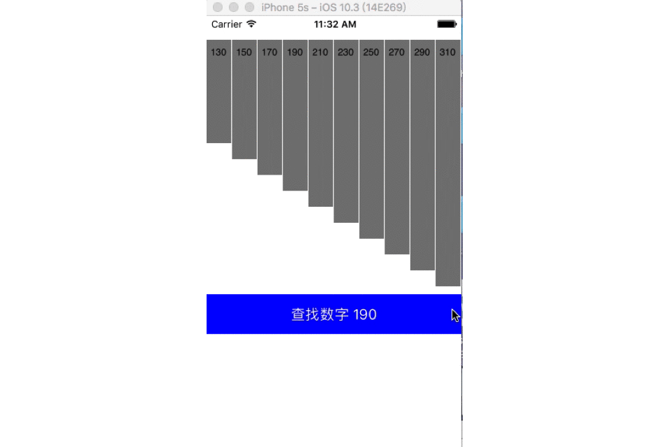
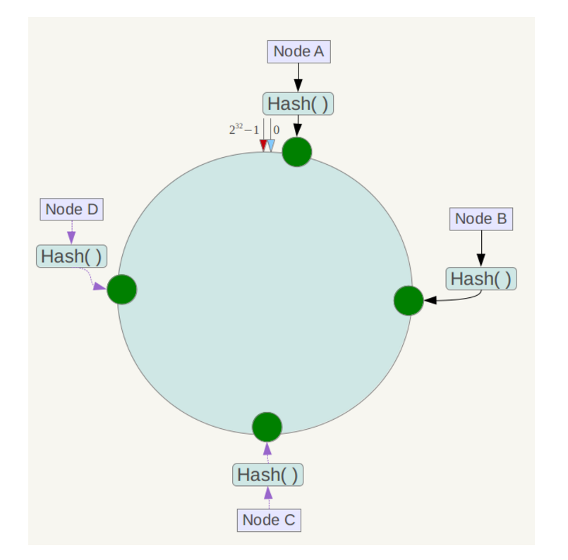
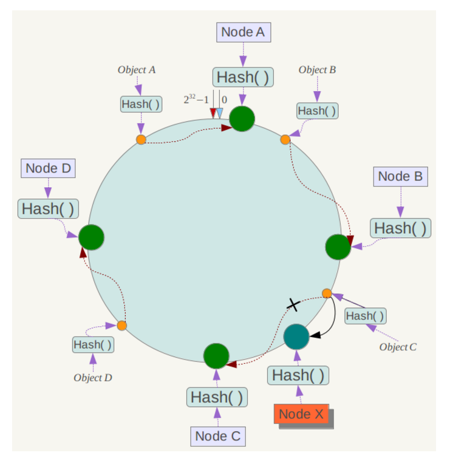

## 数据结构与算法

### 冒泡排序

冒泡排序是一种简单的排序算法。它重复地走访过要排序的数列，依次比较两个元素，如果它们的顺序错误就把它们交换过来。走访数列的工作是重复地进行直到没有再需要交换，也就是说该数列已经排序完成。这个算法的名字由来是因为越小的元素会经由交换慢慢 “浮” 到数列的顶端。

算法描述

- 比较相邻的元素。如果第一个比第二个大，就交换它们两个；
- 对每一对相邻元素作同样的工作，从开始第一对到结尾的最后一对，这样在最后的元素应该会是最大的数；
- 针对所有的元素重复以上的步骤，除了最后一个；
- 重复步骤 1~3，直到排序完成。

动图演示


代码实现

下面的排序算法统一使用的测试代码如下，[源码 GitHub 链接](https://github.com/JourWon/sort-algorithm)


```java
public static void main(String[] args) {
    int[] array = {3, 44, 38, 5, 47, 15, 36, 26, 27, 2, 46, 4, 19, 50, 48};
	// 只需要修改成对应的方法名就可以了
    bubbleSort(array);

    System.out.println(Arrays.toString(array));
}
1234567
/**
 * Description:冒泡排序
 *
 * @param array 需要排序的数组
 * @author JourWon
 * @date 2019/7/11 9:54
 */
public static void bubbleSort(int[] array) {
	if (array == null || array.length <= 1) {
		return;
	}

	int length = array.length;

	// 外层循环控制比较轮数i
	for (int i = 0; i < length; i++) {
		// 内层循环控制每一轮比较次数，每进行一轮排序都会找出一个较大值
		// (array.length - 1)防止索引越界，(array.length - 1 - i)减少比较次数
		for (int j = 0; j < length - 1 - i; j++) {
			// 前面的数大于后面的数就进行交换
			if (array[j] > array[j + 1]) {
				int temp = array[j + 1];
				array[j + 1] = array[j];
				array[j] = temp;
			}
		}
	}

}
1234567891011121314151617181920212223242526272829
```

算法分析

**最佳情况：T (n) = O (n) 最差情况：T (n) = O (n2) 平均情况：T (n) = O (n2)**

### 选择排序

表现**最稳定的排序算法之一**，因为**无论什么数据进去都是 O (n2) 的时间复杂度**，所以用到它的时候，数据规模越小越好。唯一的好处可能就是不占用额外的内存空间了吧。理论上讲，选择排序可能也是平时排序一般人想到的最多的排序方法了吧。

选择排序 (Selection-sort) 是一种简单直观的排序算法。它的工作原理：首先在未排序序列中找到最小（大）元素，存放到排序序列的起始位置，然后，再从剩余未排序元素中继续寻找最小（大）元素，然后放到已排序序列的末尾。以此类推，直到所有元素均排序完毕。

算法描述

n 个记录的直接选择排序可经过 n-1 趟直接选择排序得到有序结果。具体算法描述如下：

- 初始状态：无序区为 R [1…n]，有序区为空；
- 第 i 趟排序 (i=1,2,3…n-1) 开始时，当前有序区和无序区分别为 R [1…i-1] 和 R (i…n）。该趟排序从当前无序区中 - 选出关键字最小的记录 R [k]，将它与无序区的第 1 个记录 R 交换，使 R [1…i] 和 R [i+1…n) 分别变为记录个数增加 1 个的新有序区和记录个数减少 1 个的新无序区；
- n-1 趟结束，数组有序化了。

动图演示


代码实现

下面的排序算法统一使用的测试代码如下，[源码 GitHub 链接](https://github.com/JourWon/sort-algorithm)


```java
public static void main(String[] args) {
    int[] array = {3, 44, 38, 5, 47, 15, 36, 26, 27, 2, 46, 4, 19, 50, 48};
	// 只需要修改成对应的方法名就可以了
    selectionSort(array);

    System.out.println(Arrays.toString(array));
}
1234567
/**
 * Description: 选择排序
 *
 * @param array
 * @return void
 * @author JourWon
 * @date 2019/7/11 23:31
 */
public static void selectionSort(int[] array) {
	if (array == null || array.length <= 1) {
		return;
	}

	int length = array.length;

	for (int i = 0; i < length - 1; i++) {
		// 保存最小数的索引
		int minIndex = i;

		for (int j = i + 1; j < length; j++) {
			// 找到最小的数
			if (array[j] < array[minIndex]) {
				minIndex = j;
			}
		}

		// 交换元素位置
		if (i != minIndex) {
			swap(array, minIndex, i);
		}
	}

}

/**
 * Description: 交换元素位置
 *
 * @param array
 * @param a
 * @param b
 * @return void
 * @author JourWon
 * @date 2019/7/11 17:57
 */
private static void swap(int[] array, int a, int b) {
	int temp = array[a];
	array[a] = array[b];
	array[b] = temp;
}
12345678910111213141516171819202122232425262728293031323334353637383940414243444546474849
```

算法分析

**最佳情况：T (n) = O (n2) 最差情况：T (n) = O (n2) 平均情况：T (n) = O (n2)**

### 快速排序

快速排序的基本思想：通过一趟排序将待排记录分隔成独立的两部分，其中一部分记录的关键字均比另一部分的关键字小，则可分别对这两部分记录继续进行排序，以达到整个序列有序。

算法描述

快速排序使用分治法来把一个串（list）分为两个子串（sub-lists）。具体算法描述如下：

- 从数列中挑出一个元素，称为 “基准”（**pivot**）；
- 重新排序数列，所有元素比基准值小的摆放在基准前面，所有元素比基准值大的摆在基准的后面（相同的数可以到任一边）。在这个分区退出之后，该基准就处于数列的中间位置。这个称为分区（partition）操作；
- 递归地（recursive）把小于基准值元素的子数列和大于基准值元素的子数列排序。

动图演示


代码实现

下面的排序算法统一使用的测试代码如下，[源码 GitHub 链接](https://github.com/JourWon/sort-algorithm)


```java
public static void main(String[] args) {
    int[] array = {3, 44, 38, 5, 47, 15, 36, 26, 27, 2, 46, 4, 19, 50, 48};
	// 只需要修改成对应的方法名就可以了
    quickSort(array);

    System.out.println(Arrays.toString(array));
}
1234567
/**
 * Description: 快速排序
 *
 * @param array
 * @return void
 * @author JourWon
 * @date 2019/7/11 23:39
 */
public static void quickSort(int[] array) {
	quickSort(array, 0, array.length - 1);
}


private static void quickSort(int[] array, int left, int right) {
	if (array == null || left >= right || array.length <= 1) {
		return;
	}
	int mid = partition(array, left, right);
	quickSort(array, left, mid);
	quickSort(array, mid + 1, right);
}


private static int partition(int[] array, int left, int right) {
	int temp = array[left];
	while (right > left) {
		// 先判断基准数和后面的数依次比较
		while (temp <= array[right] && left < right) {
			--right;
		}
		// 当基准数大于了 arr[left]，则填坑
		if (left < right) {
			array[left] = array[right];
			++left;
		}
		// 现在是 arr[right] 需要填坑了
		while (temp >= array[left] && left < right) {
			++left;
		}
		if (left < right) {
			array[right] = array[left];
			--right;
		}
	}
	array[left] = temp;
	return left;
}
1234567891011121314151617181920212223242526272829303132333435363738394041424344454647
```

算法分析

**最佳情况：T (n) = O (nlogn) 最差情况：T (n) = O (n2) 平均情况：T (n) = O (nlogn)**

### 递归

**什么叫递归**

递归函数就是直接或间接调用自身的函数，也就是自身调用自己。

**一般什么时候使用递归？**

递归是常用的编程技术，其基本思想就是 “自己调用自己”，一个使用递归技术的方法即是直接或间接的调用自身的方法。递归方法实际上体现了 “以此类推”、“用同样的步骤重复” 这样的思想。

还有些数据结构如二叉树，结构本身固有递归特性；此外，有一类问题，其本身没有明显的递归结构，但用递归程序求解比其他方法更容易编写程序。

**需满足的两个条件**

1. 有反复执行的过程 (调用自身)
2. 有跳出反复执行过程的条件 (递归出口)

**经典问题：阶乘**

```java
递归阶乘n! = n * (n-1) * (n-2) * ...* 1(n>0)
1
public static Integer recursionMulity(Integer n) {
    if (n == 1) {
        return 1;
    }
    return n * recursionMulity(n - 1);
}
123456
```

**经典问题：不死神兔（斐波那契数列）**

3 个月起每个月都生一对兔子，小兔子长到第三个月后每个月又生一对兔子，假如兔子都不死，问每个月的兔子总数为多少？

分析：首先我们要明白题目的意思指的是每个月的兔子总对数；假设将兔子分为小中大三种，兔子从出生后三个月后每个月就会生出一对兔子，

那么我们假定第一个月的兔子为小兔子，第二个月为中兔子，第三个月之后就为大兔子，那么第一个月分别有 1、0、0，第二个月分别为 0、1、0，

第三个月分别为 1、0、1，第四个月分别为，1、1、1，第五个月分别为 2、1、2，第六个月分别为 3、2、3，第七个月分别为 5、3、5……

兔子总数分别为：1、1、2、3、5、8、13……

于是得出了一个规律，从第三个月起，后面的兔子总数都等于前面两个月的兔子总数之和，即为斐波那契数列。

```java
public static int fib(int mon) {
    if (mon < 2) {
        return 1;
    } else {
        return fib(mon - 1) + fib(mon - 2);
    }
}
1234567
```

### 二分查找

在数组 [130,150,170,190,210,230,250,270,290,310] 中查找数字 190，红色为二分线 (折半线)，灰色为查找区域，黑色为排除区域。

二分查找也称折半查找（Binary Search），它是一种效率较高的查找方法，前提是**数据结构必须先排好序**，时间复杂度可以表示 O (h)=O (log2n)，以 2 为底，n 的对数。其缺点是要求待查表为有序表，且插入删除困难。

**左加右不加，找右缩左，找左缩右**

```java
public class BinarySearch {
    public static void main(String[] args) {
        int[] arr = {5, 12, 23, 43, 66, 98, 100};
        System.out.println(binarySort(arr, 23));
    }

    /**
     * 循环实现二分查找
     *
     * @param arr
     * @param key
     * @return
     */
    public static int binarySearch(int[] arr, int key) {
        //第一个下标
        int low = 0;
        //最后一个下标
        int high = arr.length - 1;
        int mid = 0;
        //防越界
        if (key < arr[low] || key > arr[high] || low > high) {
            return -1;
        }
        while (low <= high) {
            mid = (low + high) >>> 1;
            if (key < arr[mid]) {
                high = mid - 1;
            } else if (key > arr[mid]) {
                low = mid + 1;
            } else {
                return mid;
            }
        }
        return -1;
    }
}
123456789101112131415161718192021222324252627282930313233343536
```

二分查找中中间值的计算

这是一个经典的话题，如何计算二分查找中的中值？大家一般给出了两种计算方法：

- 算法一： `mid = (low + high) / 2`
- 算法二： `mid = low + (high – low)/2`

乍看起来，算法一简洁，算法二提取之后，跟算法一没有什么区别。但是实际上，区别是存在的。算法一的做法，在极端情况下，(low + high) 存在着溢出的风险，进而得到错误的 mid 结果，导致程序错误。而算法二能够保证计算出来的 mid，一定大于 low，小于 high，不存在溢出的问题。

### 一致性 Hash 算法

#### 概述

**一致性 Hash 是一种特殊的 Hash 算法，由于其均衡性、持久性的映射特点，被广泛的应用于负载均衡领域和分布式存储**，如 nginx 和 memcached 都采用了一致性 Hash 来作为集群负载均衡的方案。

**普通的 Hash 函数**最大的作用是**散列**，或者说是将一系列在形式上具有相似性质的数据，打散成随机的、均匀分布的数据。**不难发现，这样的 Hash 只要集群的数量 N 发生变化，之前的所有 Hash 映射就会全部失效**。如果集群中的每个机器提供的服务没有差别，倒不会产生什么影响，但对于分布式缓存这样的系统而言，映射全部失效就意味着之前的缓存全部失效，后果将会是灾难性的。**一致性 Hash 通过构建环状的 Hash 空间**代替线性 Hash 空间的方法解决了这个问题。

良好的分布式 cahce 系统中的一致性 hash 算法应该满足以下几个方面：

- **平衡性 (Balance)**

平衡性是指哈希的结果能够尽可能分布到所有的缓冲中去，这样可以使得所有的缓冲空间都得到利用。很多哈希算法都能够满足这一条件。

- **单调性 (Monotonicity)**

单调性是指如果已经有一些内容通过哈希分派到了相应的缓冲中，又有新的缓冲区加入到系统中，那么哈希的结果应能够保证原有已分配的内容可以被映射到新的缓冲区中去，而不会被映射到旧的缓冲集合中的其他缓冲区。

- **分散性 (Spread)**

在分布式环境中，终端有可能看不到所有的缓冲，而是只能看到其中的一部分。当终端希望通过哈希过程将内容映射到缓冲上时，由于不同终端所见的缓冲范围有可能不同，从而导致哈希的结果不一致，最终的结果是相同的内容被不同的终端映射到不同的缓冲区中。这种情况显然是应该避免的，因为它导致相同内容被存储到不同缓冲中去，降低了系统存储的效率。分散性的定义就是上述情况发生的严重程度。好的哈希算法应能够尽量避免不一致的情况发生，也就是尽量降低分散性。

- **负载 (Load)**

负载问题实际上是从另一个角度看待分散性问题。既然不同的终端可能将相同的内容映射到不同的缓冲区中，那么对于一个特定的缓冲区而言，也可能被不同的用户映射为不同的内容。与分散性一样，这种情况也是应当避免的，因此好的哈希算法应能够尽量降低缓冲的负荷。

- **平滑性 (Smoothness)**

平滑性是指缓存服务器的数目平滑改变和缓存对象的平滑改变是一致的。

#### 一致性 Hash 算法原理

简单来说，一致性哈希将整个哈希值空间组织成一个虚拟的圆环，如假设某哈希函数 H 的值空间为 0-232-1（即哈希值是一个 32 位无符号整形），整个哈希空间环如下：整个空间按顺时针方向组织。0 和 232-1 在零点中方向重合。



接下来使用如下算法定位数据访问到相应服务器：将数据 key 使用相同的函数 Hash 计算出哈希值，并确定此数据在环上的位置，从此位置沿环顺时针 “行走”，第一台遇到的服务器就是其应该定位到的服务器。

例如我们有 Object A、Object B、Object C、Object D 四个数据对象，经过哈希计算后，在环空间上的位置如下：


**下面分析一致性哈希算法的容错性和可扩展性**。现假设 Node C 不幸宕机，可以看到此时对象 A、B、D 不会受到影响，只有 C 对象被重定位到 Node D。一般的，在一致性哈希算法中，如果一台服务器不可用，则受影响的数据仅仅是此服务器到其环空间中前一台服务器（即沿着逆时针方向行走遇到的第一台服务器）之间数据，其它不会受到影响。

下面考虑另外一种情况，如果在系统中增加一台服务器 Node X，如下图所示：



综上所述，一致性哈希算法对于节点的增减都只需重定位环空间中的一小部分数据，具有较好的容错性和可扩展性。

**Java 代码实现**

```java
public class ConsistentHash<T> {

    /**
     * 节点的复制因子,实际节点个数 * numberOfReplicas = 虚拟节点个数
     */
    private final int numberOfReplicas;
    /**
     * 存储虚拟节点的hash值到真实节点的映射
     */
    private final SortedMap<Integer, T> circle = new TreeMap<Integer, T>();

    public ConsistentHash(int numberOfReplicas, Collection<T> nodes) {
        this.numberOfReplicas = numberOfReplicas;
        for (T node : nodes) {
            add(node);
        }
    }

    public void add(T node) {
        for (int i = 0; i < numberOfReplicas; i++) {
            // 对于一个实际机器节点 node, 对应 numberOfReplicas 个虚拟节点
            /*
             * 不同的虚拟节点(i不同)有不同的hash值,但都对应同一个实际机器node
             * 虚拟node一般是均衡分布在环上的,数据存储在顺时针方向的虚拟node上
             */
            String nodestr = node.toString() + i;
            int hashcode = nodestr.hashCode();
            System.out.println("hashcode:" + hashcode);
            circle.put(hashcode, node);

        }
    }

    public void remove(T node) {
        for (int i = 0; i < numberOfReplicas; i++) {
            circle.remove((node.toString() + i).hashCode());
        }
    }


    /**
     * 获得一个最近的顺时针节点,根据给定的key 取Hash
     * 然后再取得顺时针方向上最近的一个虚拟节点对应的实际节点
     * 再从实际节点中取得 数据
     *
     * @param key
     * @return
     */
    public T get(Object key) {
        if (circle.isEmpty()) {
            return null;
        }
        // node 用String来表示,获得node在哈希环中的hashCode
        int hash = key.hashCode();
        System.out.println("hashcode----->:" + hash);
        //数据映射在两台虚拟机器所在环之间,就需要按顺时针方向寻找机器
        if (!circle.containsKey(hash)) {
            SortedMap<Integer, T> tailMap = circle.tailMap(hash);
            hash = tailMap.isEmpty() ? circle.firstKey() : tailMap.firstKey();
        }
        return circle.get(hash);
    }

    public long getSize() {
        return circle.size();
    }

    /**
     * 查看表示整个哈希环中各个虚拟节点位置
     */
    public void testBalance() {
        //获得TreeMap中所有的Key
        Set<Integer> sets = circle.keySet();
        //将获得的Key集合排序
        SortedSet<Integer> sortedSets = new TreeSet<Integer>(sets);
        for (Integer hashCode : sortedSets) {
            System.out.println(hashCode);
        }

        System.out.println("----each location 's distance are follows: ----");
        /*
         * 查看相邻两个hashCode的差值
         */
        Iterator<Integer> it = sortedSets.iterator();
        Iterator<Integer> it2 = sortedSets.iterator();
        if (it2.hasNext()) {
            it2.next();
        }
        long keyPre, keyAfter;
        while (it.hasNext() && it2.hasNext()) {
            keyPre = it.next();
            keyAfter = it2.next();
            System.out.println(keyAfter - keyPre);
        }
    }

    public static void main(String[] args) {
        Set<String> nodes = new HashSet<String>();
        nodes.add("A");
        nodes.add("B");
        nodes.add("C");

        ConsistentHash<String> consistentHash = new ConsistentHash<String>(2, nodes);
        consistentHash.add("D");

        System.out.println("hash circle size: " + consistentHash.getSize());
        System.out.println("location of each node are follows: ");
        consistentHash.testBalance();

        String node = consistentHash.get("apple");
        System.out.println("node----------->:" + node);
    }

}
```