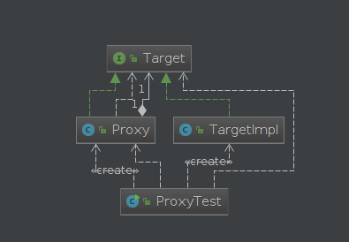
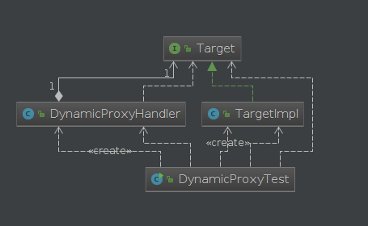
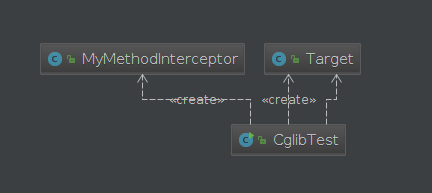
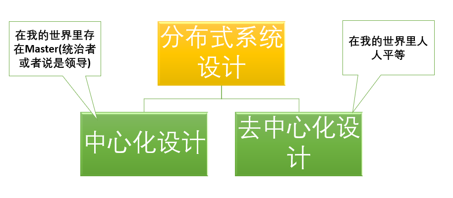
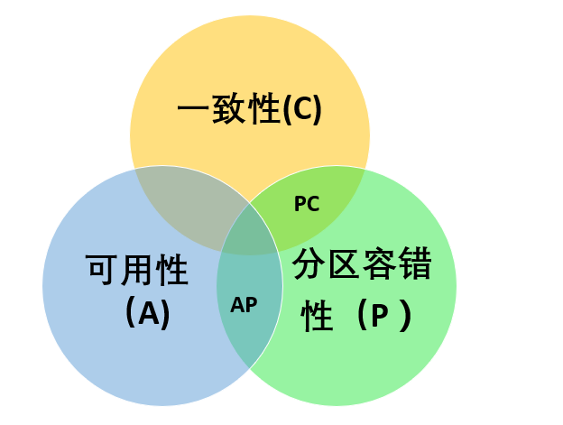
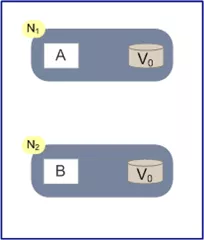
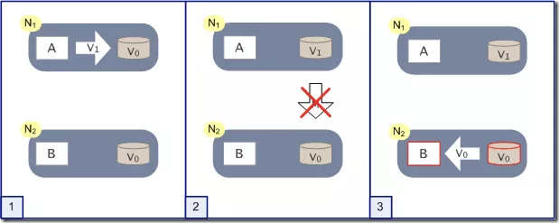
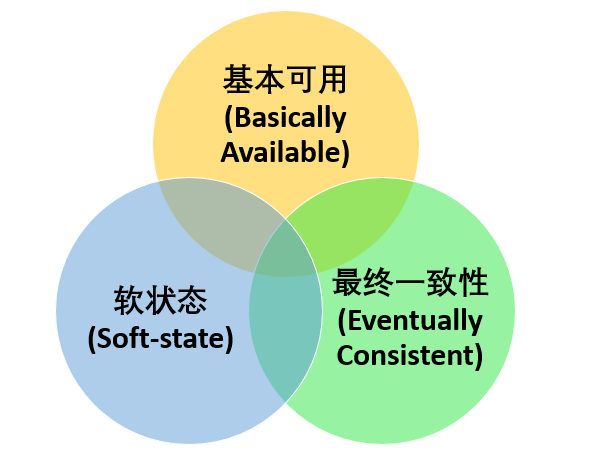

## 架构设计

### 请列举出在 JDK 中几个常用的设计模式？

单例模式（Singleton pattern）用于 Runtime，Calendar 和其他的一些类中。工厂模式（Factory pattern）被用于各种不可变的类如 Boolean，像 Boolean.valueOf，观察者模式（Observer pattern）被用于 Swing 和很多的事件监听中。装饰器设计模式（Decorator design pattern）被用于多个 Java IO 类中。

### 什么是设计模式？你是否在你的代码里面使用过任何设计模式？

设计模式是软件开发人员在软件开发过程中面临的一般问题的解决方案。这些解决方案是众多软件开发人员经过相当长的一段时间的试验和错误总结出来的。设计模式是代码可用性的延伸

设计模式分类：创建型模式，结构型模式，行为型模式

### 静态代理、JDK 动态代理以及 CGLIB 动态代理

代理模式是 java 中最常用的设计模式之一，尤其是在 spring 框架中广泛应用。对于 java 的代理模式，一般可分为：静态代理、动态代理、以及 CGLIB 实现动态代理。

对于上述三种代理模式，分别进行说明。

#### 静态代理

静态代理其实就是在程序运行之前，提前写好被代理方法的代理类，编译后运行。在程序运行之前，class 已经存在。
下面我们实现一个静态代理 demo:



定义一个接口 Target

```java
package com.test.proxy;

public interface Target {

    public String execute();
}
123456
```

TargetImpl 实现接口 Target

```java
package com.test.proxy;

public class TargetImpl implements Target {

    @Override
    public String execute() {
        System.out.println("TargetImpl execute！");
        return "execute";
    }
}
12345678910
```

代理类

```java
package com.test.proxy;

public class Proxy implements Target{

    private Target target;

    public Proxy(Target target) {
        this.target = target;
    }

    @Override
    public String execute() {
        System.out.println("perProcess");
        String result = this.target.execute();
        System.out.println("postProcess");
        return result;
    }
}
123456789101112131415161718
```

测试类:

```java
package com.test.proxy;

public class ProxyTest {

    public static void main(String[] args) {

        Target target = new TargetImpl();
        Proxy p = new Proxy(target);
        String result =  p.execute();
        System.out.println(result);
    }

}
12345678910111213
```

运行结果:

```java
perProcess
TargetImpl execute！
postProcess
execute
1234
```

静态代理需要针对被代理的方法提前写好代理类，如果被代理的方法非常多则需要编写很多代码，因此，对于上述缺点，通过动态代理的方式进行了弥补。

#### 动态代理

动态代理主要是通过反射机制，在运行时动态生成所需代理的 class.



接口

```java
package com.test.dynamic;

public interface Target {

    public String execute();
}
123456
```

实现类

```java
package com.test.dynamic;

public class TargetImpl implements Target {

    @Override
    public String execute() {
        System.out.println("TargetImpl execute！");
        return "execute";
    }
}
12345678910
```

代理类

```java
package com.test.dynamic;


import java.lang.reflect.InvocationHandler;
import java.lang.reflect.Method;

public class DynamicProxyHandler implements InvocationHandler{

    private Target target;

    public DynamicProxyHandler(Target target) {
        this.target = target;
    }

    @Override
    public Object invoke(Object proxy, Method method, Object[] args) throws Throwable {
        System.out.println("========before==========");
        Object result = method.invoke(target,args);
        System.out.println("========after===========");
        return result;
    }
}
12345678910111213141516171819202122
```

测试类

```java
package com.test.dynamic;

import java.lang.reflect.Proxy;

public class DynamicProxyTest {

    public static void main(String[] args) {
        Target target = new TargetImpl();
        DynamicProxyHandler handler = new DynamicProxyHandler(target);
        Target proxySubject = (Target) Proxy.newProxyInstance(TargetImpl.class.getClassLoader(),TargetImpl.class.getInterfaces(),handler);
        String result = proxySubject.execute();
        System.out.println(result);
    }

}
123456789101112131415
```

运行结果：

```java
========before==========
TargetImpl execute！
========after===========
execute
1234
```

无论是动态代理还是静态带领，都需要定义接口，然后才能实现代理功能。这同样存在局限性，因此，为了解决这个问题，出现了第三种代理方式：cglib 代理。

#### cglib 代理

CGLib 采用了非常底层的字节码技术，其原理是通过字节码技术为一个类创建子类，并在子类中采用方法拦截的技术拦截所有父类方法的调用，顺势织入横切逻辑。JDK 动态代理与 CGLib 动态代理均是实现 Spring AOP 的基础。



目标类

```java
package com.test.cglib;

public class Target {

    public String execute() {
        String message = "-----------test------------";
        System.out.println(message);
        return message;
    }
}
12345678910
```

通用代理类

```java
package com.test.cglib;

import net.sf.cglib.proxy.MethodInterceptor;
import net.sf.cglib.proxy.MethodProxy;

import java.lang.reflect.Method;

public class MyMethodInterceptor implements MethodInterceptor{

    @Override
    public Object intercept(Object obj, Method method, Object[] args, MethodProxy proxy) throws Throwable {
        System.out.println(">>>>MethodInterceptor start...");
        Object result = proxy.invokeSuper(obj,args);
        System.out.println(">>>>MethodInterceptor ending...");
        return "result";
    }
}
1234567891011121314151617
```

测试类

```java
package com.test.cglib;

import net.sf.cglib.proxy.Enhancer;

public class CglibTest {

    public static void main(String[] args) {
        System.out.println("***************");
        Target target = new Target();
        CglibTest test = new CglibTest();
        Target proxyTarget = (Target) test.createProxy(Target.class);
        String res = proxyTarget.execute();
        System.out.println(res);
    }

    public Object createProxy(Class targetClass) {
        Enhancer enhancer = new Enhancer();
        enhancer.setSuperclass(targetClass);
        enhancer.setCallback(new MyMethodInterceptor());
        return enhancer.create();
    }

}
1234567891011121314151617181920212223
```

执行结果:

```java
***************
>>>>MethodInterceptor start...
-----------test------------
>>>>MethodInterceptor ending...
result
12345
```

代理对象的生成过程由 Enhancer 类实现，大概步骤如下：

1. 生成代理类 Class 的二进制字节码；
2. 通过 Class.forName 加载二进制字节码，生成 Class 对象；
3. 通过反射机制获取实例构造，并初始化代理类对象。

### 单例模式

单例模式（Singleton Pattern）是 Java 中最简单的设计模式之一。这种类型的设计模式属于创建型模式，它提供了一种创建对象的最佳方式。

**意图**：保证一个类仅有一个实例，并提供一个访问它的全局访问点。

**主要解决**：一个全局使用的类频繁地创建与销毁。

懒汉式，线程安全

**代码实例**：

```java
public class Singleton2 {

    private static Singleton2 instance;

    private Singleton2() {}

    public static synchronized Singleton2 getInstance() {
        if (instance == null) {
            instance = new Singleton2();
        }

        return instance;
    }

}
123456789101112131415
```

饿汉式，线程安全

**代码实例**：

```java
public class Singleton3 {

    private static Singleton3 instance = new Singleton3();

    private Singleton3() {}

    public static Singleton3 getInstance() {
        return instance;
    }

} 
1234567891011
```

双检锁 / 双重校验锁 + volatile 关键字

**代码实例**：

```java
public class Singleton7 {

    private static volatile Singleton7 instance = null;

    private Singleton7() {}

    public static Singleton7 getInstance() {
        if (instance == null) {
            synchronized (Singleton7.class) {
                if (instance == null) {
                    instance = new Singleton7();
                }
            }
        }

        return instance;
    }

}
12345678910111213141516171819
```

### 工厂模式

工厂模式（Factory Pattern）是 Java 中最常用的设计模式之一。这种类型的设计模式属于创建型模式，它提供了一种创建对象的最佳方式。

**意图**：定义一个创建对象的接口，让其子类自己决定实例化哪一个工厂类，工厂模式使其创建过程延迟到子类进行。

**主要解决**：主要解决接口选择的问题。

我们将创建一个 *Shape* 接口和实现 *Shape* 接口的实体类。下一步是定义工厂类 *ShapeFactory*。

*FactoryPatternDemo*，我们的演示类使用 *ShapeFactory* 来获取 *Shape* 对象。它将向 *ShapeFactory* 传递信息（*CIRCLE / RECTANGLE / SQUARE*），以便获取它所需对象的类型。


步骤 1

创建一个接口。

*Shape.java*

```java
public interface Shape {
    void draw();
}
123
```

步骤 2

创建实现接口的实体类。

*Rectangle.java*

```java
public class Rectangle implements Shape {
    @Override
    public void draw() {
        System.out.println("Inside Rectangle::draw() method.");
    }
}
123456
```

*Square.java*

```java
public class Square implements Shape {
    @Override
    public void draw() {
        System.out.println("Inside Square::draw() method.");
    }
}
123456
```

*Circle.java*

```java
public class Circle implements Shape {
    @Override
    public void draw() {
        System.out.println("Inside Circle::draw() method.");
    }
}
123456
```

步骤 3

创建一个工厂，生成基于给定信息的实体类的对象。

*ShapeFactory.java*

```java
public class ShapeFactory {

    //使用 getShape 方法获取形状类型的对象
    public Shape getShape(String shapeType) {
        if (shapeType == null) {
            return null;
        }
        shapeType = shapeType.toLowerCase();

        switch (shapeType) {
            case "circle":
                return new Circle();
            case "rectangle":
                return new Rectangle();
            case "square":
                return new Square();
            default:
                return null;
        }

    }

}
1234567891011121314151617181920212223
```

步骤 4

使用该工厂，通过传递类型信息来获取实体类的对象。

*FactoryPatternDemo.java*

```java
public class FactoryPatternDemo {

    public static void main(String[] args) {
        ShapeFactory shapeFactory = new ShapeFactory();

        //获取 Circle 的对象，并调用它的 draw 方法
        Shape shape1 = shapeFactory.getShape("CIRCLE");
        //调用 Circle 的 draw 方法
        shape1.draw();

        //获取 Rectangle 的对象，并调用它的 draw 方法
        Shape shape2 = shapeFactory.getShape("RECTANGLE");
        //调用 Rectangle 的 draw 方法
        shape2.draw();

        //获取 Square 的对象，并调用它的 draw 方法
        Shape shape3 = shapeFactory.getShape("SQUARE");
        //调用 Square 的 draw 方法
        shape3.draw();
    }

}
12345678910111213141516171819202122
```

步骤 5

验证输出。

```java
Inside Circle::draw() method.
Inside Rectangle::draw() method.
Inside Square::draw() method.
123
```

### 观察者模式

当对象间存在一对多关系时，则使用观察者模式（Observer Pattern）。比如，当一个对象被修改时，则会自动通知它的依赖对象。观察者模式属于行为型模式。

**意图**：定义对象间的一种一对多的依赖关系，当一个对象的状态发生改变时，所有依赖于它的对象都得到通知并被自动更新。

**主要解决**：一个对象状态改变给其他对象通知的问题，而且要考虑到易用和低耦合，保证高度的协作。

实现

观察者模式使用三个类 Subject、Observer 和 Client。Subject 对象带有绑定观察者到 Client 对象和从 Client 对象解绑观察者的方法。我们创建 *Subject* 类、*Observer* 抽象类和扩展了抽象类 *Observer* 的实体类。

*ObserverPatternDemo*，我们的演示类使用 *Subject* 和实体类对象来演示观察者模式。


步骤 1

创建 Subject 类。

*Subject.java*

```java
public class Subject {

    private List<Observer> observers = new ArrayList<>();

    private int state;

    public int getState() {
        return state;
    }

    public void setState(int state) {
        this.state = state;
        notifyAllObservers();
    }

    public void attach(Observer observer) {
        observers.add(observer);
    }

    public void notifyAllObservers() {
        for (Observer observer : observers) {
            observer.update();
        }
    }

}
1234567891011121314151617181920212223242526
```

步骤 2

创建 Observer 类。

*Observer.java*

```java
public abstract class Observer {

    protected Subject subject;

    public abstract void update();

}
1234567
```

步骤 3

创建实体观察者类。

*BinaryObserver.java*

```java
public class BinaryObserver extends Observer {

    public BinaryObserver(Subject subject) {
        this.subject = subject;
        this.subject.attach(this);
    }

    @Override
    public void update() {
        System.out.println("Binary String: "
                + Integer.toBinaryString(subject.getState()));
    }

}
1234567891011121314
```

*OctalObserver.java*

```java
public class OctalObserver extends Observer {

    public OctalObserver(Subject subject){
        this.subject = subject;
        this.subject.attach(this);
    }

    @Override
    public void update() {
        System.out.println( "Octal String: "
                + Integer.toOctalString( subject.getState() ) );
    }

}
1234567891011121314
```

*HexaObserver.java*

```java
public class HexaObserver extends Observer {

    public HexaObserver(Subject subject){
        this.subject = subject;
        this.subject.attach(this);
    }

    @Override
    public void update() {
        System.out.println( "Hex String: "
                + Integer.toHexString( subject.getState() ).toUpperCase() );
    }

}
1234567891011121314
```

步骤 4

使用 *Subject* 和实体观察者对象。

*ObserverPatternDemo.java*

```java
public class ObserverPatternDemo {

    public static void main(String[] args) {
        Subject subject = new Subject();

        new BinaryObserver(subject);
        new HexaObserver(subject);
        new OctalObserver(subject);

        System.out.println("First state change: 15");
        subject.setState(15);
        System.out.println();

        System.out.println("Second state change: 10");
        subject.setState(10);
    }

}
123456789101112131415161718
```

步骤 5

验证输出。

```java
First state change: 15
Binary String: 1111
Hex String: F
Octal String: 17

Second state change: 10
Binary String: 1010
Hex String: A
Octal String: 12
123456789
```

### 装饰器模式

装饰器模式（Decorator Pattern）允许向一个现有的对象添加新的功能，同时又不改变其结构。这种类型的设计模式属于结构型模式，它是作为现有的类的一个包装。

**意图**：动态地给一个对象添加一些额外的职责。就增加功能来说，装饰器模式相比生成子类更为灵活。

**主要解决**：一般的，我们为了扩展一个类经常使用继承方式实现，由于继承为类引入静态特征，并且随着扩展功能的增多，子类会很膨胀。

实现

我们将创建一个 *Shape* 接口和实现了 *Shape* 接口的实体类。然后我们创建一个实现了 *Shape* 接口的抽象装饰类 *ShapeDecorator*，并把 *Shape* 对象作为它的实例变量。

*RedShapeDecorator* 是实现了 *ShapeDecorator* 的实体类。

*DecoratorPatternDemo*，我们的演示类使用 *RedShapeDecorator* 来装饰 *Shape* 对象。


步骤 1

创建一个接口。

*Shape.java*

```java
public interface Shape {

    void draw();

}
12345
```

步骤 2

创建实现接口的实体类。

*Rectangle.java*

```java
public class Rectangle implements Shape {

    @Override
    public void draw() {
        System.out.println("Shape: Rectangle");
    }

}
12345678
```

*Circle.java*

```java
public class Circle implements Shape {

    @Override
    public void draw() {
        System.out.println("Shape: Circle");
    }

}
12345678
```

步骤 3

创建实现了 *Shape* 接口的抽象装饰类。

*ShapeDecorator.java*

```java
public abstract class ShapeDecorator implements Shape {

    protected Shape decoratorShape;

    public ShapeDecorator(Shape decoratorShape) {
        this.decoratorShape = decoratorShape;
    }

    @Override
    public void draw() {
        decoratorShape.draw();
    }
}
12345678910111213
```

步骤 4

创建扩展了 *ShapeDecorator* 类的实体装饰类。

*RedShapeDecorator.java*

```java
public class RedShapeDecorator extends ShapeDecorator {

    public RedShapeDecorator(Shape decoratorShape) {
        super(decoratorShape);
    }

    @Override
    public void draw() {
        decoratorShape.draw();
        setRedBorder(decoratorShape);
    }

    private void setRedBorder(Shape decoratorShape) {
        System.out.println("Border Color: Red");
    }

}
1234567891011121314151617
```

步骤 5

使用 *RedShapeDecorator* 来装饰 *Shape* 对象。

*DecoratorPatternDemo.java*

```java
public class DecoratorPatternDemo {

    public static void main(String[] args) {
        Shape circle = new Circle();
        Shape redCircle = new RedShapeDecorator(new Circle());
        Shape redRectangle = new RedShapeDecorator(new Rectangle());

        System.out.println("Circle with normal border");
        circle.draw();

        System.out.println("\nCircle of red border");
        redCircle.draw();

        System.out.println("\nRectangle of red border");
        redRectangle.draw();

    }

}
12345678910111213141516171819
```

步骤 6

验证输出。

```java
Circle with normal border
Shape: Circle

Circle of red border
Shape: Circle
Border Color: Red

Rectangle of red border
Shape: Rectangle
Border Color: Red
12345678910
```

### 秒杀系统设计

**什么是秒杀**

通俗一点讲就是网络商家为促销等目的组织的网上限时抢购活动

**业务特点**

- 高并发：秒杀的特点就是这样**时间极短**、 **瞬间用户量大**。
- 库存量少：一般秒杀活动商品量很少，这就导致了只有极少量用户能成功购买到。
- 业务简单：流程比较简单，一般都是下订单、扣库存、支付订单
- 恶意请求，数据库压力大

**解决方案**

前端：页面资源静态化，按钮控制，使用答题校验码可以防止秒杀器的干扰，让更多用户有机会抢到

nginx：校验恶意请求，转发请求，负载均衡；动静分离，不走 tomcat 获取静态资源；gzip 压缩，减少静态文件传输的体积，节省带宽，提高渲染速度

业务层：集群，多台机器处理，提高并发能力

redis：集群保证高可用，持久化数据；分布式锁（悲观锁）；缓存热点数据（库存）

mq：削峰限流，MQ 堆积订单，保护订单处理层的负载，Consumer 根据自己的消费能力来取 Task，实际上下游的压力就可控了。重点做好路由层和 MQ 的安全

数据库：读写分离，拆分事务提高并发度

**秒杀系统设计小结**

- 秒杀系统就是一个 “三高” 系统，即**高并发、高性能**和**高可用**的分布式系统
- 秒杀设计原则：**前台请求尽量少，后台数据尽量少，调用链路尽量短，尽量不要有单点**
- 秒杀高并发方法：**访问拦截、分流、动静分离**
- 秒杀数据方法：**减库存策略、热点、异步、限流降级**
- 访问拦截主要思路：通过 CDN 和缓存技术，尽量把访问拦截在离用户更近的层，尽可能地过滤掉无效请求。
- 分流主要思路：通过分布式集群技术，多台机器处理，提高并发能力。

## 分布式

### 分布式概述

#### 分布式

分布式（distributed）是为了解决单个物理服务器容量和性能瓶颈问题而采用的优化手段，将一个业务拆分成不同的子业务，分布在不同的机器上执行。服务之间通过远程调用协同工作，对外提供服务。

该领域需要解决的问题极多，在不同的技术层面上，又包括：分布式缓存、分布式数据库、分布式计算、分布式文件系统等，一些技术如 MQ、Redis、zookeeper 等都跟分布式有关。

从理念上讲，分布式的实现有两种形式：

**水平扩展**：当一台机器扛不住流量时，就通过添加机器的方式，将流量平分到所有服务器上，所有机器都可以提供 相同的服务；

**垂直拆分**：前端有多种查询需求时，一台机器扛不住，可以将不同的业务需求分发到不同的机器上，比如 A 机器处理余票查询的请求，B 机器处理支付的请求。

#### 集群

集群（cluster）是指在多台不同的服务器中部署相同应用或服务模块，构成一个集群，通过负载均衡设备对外提供服务。

两个特点

**可扩展性**：集群中的服务节点，可以动态的添加机器，从而增加集群的处理能力。

**高可用性**：如果集群某个节点发生故障，这台节点上面运行的服务，可以被其他服务节点接管，从而增强集群的高可用性。

两大能力

**负载均衡**：负载均衡能把任务比较均衡地分布到集群环境下的计算和网络资源。

**集群容错**：当我们的系统中用到集群环境，因为各种原因在集群调用失败时，集群容错起到关键性的作用。

#### 微服务

微服务就是很小的服务，小到一个服务只对应一个单一的功能，只做一件事。这个服务可以单独部署运行，服务之间通过远程调用协同工作，每个微服务都是由独立的小团队开发，测试，部署，上线，负责它的整个生命周期。

#### 多线程

多线程（multi-thread）：多线程是指程序中包含多个执行流，即在一个程序中可以同时运行多个不同的线程来执行不同的任务。多线程是为了提高 CPU 的利用率。

#### 高并发

高并发（High Concurrency）是一种系统运行过程中发生了一种 “短时间内遇到大量请求” 的情况，高并发对应的是访问请求，多线程是解决高并发的方法之一，高并发还可以通过分布式，集群，算法优化，数据库优化等方法解决。

### 分布式系统设计理念

#### 分布式系统的目标与要素

分布式系统的目标是提升系统的整体性能和吞吐量另外还要尽量保证分布式系统的容错性（假如增加 10 台服务器才达到单机运行效果 2 倍左右的性能，那么这个分布式系统就根本没有存在的意义）。

即使采用了分布式系统，我们也要尽力运用并发编程、高性能网络框架等等手段提升单机上的程序性能。

#### 分布式系统设计两大思路：中心化和去中心化



**中心化设计**

- **两个角色：** 中心化的设计思想很简单，分布式集群中的节点机器按照角色分工，大体上分为两种角色： **“领导”** 和 **“干活的”**
- **角色职责：** “领导” 通常负责分发任务并监督 “干活的”，发现谁太闲了，就想发设法地给其安排新任务，确保没有一个 “干活的” 能够偷懒，如果 “领导” 发现某个 “干活的” 因为劳累过度而病倒了，则是不会考虑先尝试 “医治” 他的，而是一脚踢出去，然后把他的任务分给其他人。其中微服务架构 **Kubernetes** 就恰好采用了这一设计思路。
- 中心化设计的问题
  1. 中心化的设计存在的最大问题是 “领导” 的安危问题，如果 “领导” 出了问题，则群龙无首，整个集群就奔溃了。但我们难以同时安排两个 “领导” 以避免单点问题。
  2. 中心化设计还存在另外一个潜在的问题，既 “领导” 的能力问题：可以领导 10 个人高效工作并不意味着可以领导 100 个人高效工作，所以如果系统设计和实现得不好，问题就会卡在 “领导” 身上。
- **领导安危问题的解决办法：** 大多数中心化系统都采用了主备两个 “领导” 的设计方案，可以是热备或者冷备，也可以是自动切换或者手动切换，而且越来越多的新系统都开始具备自动选举切换 “领导” 的能力，以提升系统的可用性。

**去中心化设计**

- **众生地位平等：** 在去中心化的设计里，通常没有 “领导” 和 “干活的” 这两种角色的区分，大家的角色都是一样的，地位是平等的，全球互联网就是一个典型的去中心化的分布式系统，联网的任意节点设备宕机，都只会影响很小范围的功能。
- **“去中心化” 不是不要中心，而是由节点来自由选择中心。** （集群的成员会自发的举行 “会议” 选举新的 “领导” 主持工作。最典型的案例就是 ZooKeeper 及 Go 语言实现的 Etcd）
- **去中心化设计的问题：** 去中心化设计里最难解决的一个问题是 **“脑裂” 问题** ，这种情况的发生概率很低，但影响很大。脑裂指一个集群由于网络的故障，被分为至少两个彼此无法通信的单独集群，此时如果两个集群都各自工作，则可能会产生严重的数据冲突和错误。一般的设计思路是，当集群判断发生了脑裂问题时，规模较小的集群就 “自杀” 或者拒绝服务。

#### 分布式与集群的区别是什么？

- **分布式：** 一个业务分拆多个子业务，部署在不同的服务器上
- **集群：** 同一个业务，部署在多个服务器上。比如之前做电商网站搭的 redis 集群以及 solr 集群都是属于将 redis 服务器提供的缓存服务以及 solr 服务器提供的搜索服务部署在多个服务器上以提高系统性能、并发量解决海量存储问题。

### CAP 定理



在理论计算机科学中，CAP 定理（CAP theorem），又被称作布鲁尔定理（Brewer’s theorem），它指出对于一个分布式计算系统来说，不可能同时满足以下三点：

| 选项                              | 描述                                                         |
| --------------------------------- | ------------------------------------------------------------ |
| Consistency（一致性）             | 指数据在多个副本之间能够保持一致的特性（严格的一致性）       |
| Availability（可用性）            | 指系统提供的服务必须一直处于可用的状态，每次请求都能获取到非错的响应（不保证获取的数据为最新数据） |
| Partition tolerance（分区容错性） | 分布式系统在遇到任何网络分区故障的时候，仍然能够对外提供满足一致性和可用性的服务，除非整个网络环境都发生了故障 |

**Spring Cloud 在 CAP 法则上主要满足的是 A 和 P 法则，Dubbo 和 Zookeeper 在 CAP 法则主要满足的是 C 和 P 法则**

CAP 仅适用于原子读写的 NOSQL 场景中，并不适合数据库系统。现在的分布式系统具有更多特性比如扩展性、可用性等等，在进行系统设计和开发时，我们不应该仅仅局限在 CAP 问题上。

**注意：不是所谓的 3 选 2（不要被网上大多数文章误导了）**

现实生活中，大部分人解释这一定律时，常常简单的表述为：“一致性、可用性、分区容忍性三者你只能同时达到其中两个，不可能同时达到”。实际上这是一个非常具有误导性质的说法，而且在 CAP 理论诞生 12 年之后，CAP 之父也在 2012 年重写了之前的论文。

**当发生网络分区的时候，如果我们要继续服务，那么强一致性和可用性只能 2 选 1。也就是说当网络分区之后 P 是前提，决定了 P 之后才有 C 和 A 的选择。也就是说分区容错性（Partition tolerance）我们是必须要实现的。**

## CAP 定理的证明

关于 CAP 这三个特性我们就介绍完了，接下来我们试着证明一下**为什么 CAP 不能同时满足**。



为了简化证明的过程，我们假设整个集群里只有两个 N1 和 N2 两个节点，如下图：

N1 和 N2 当中各自有一个应用程序 AB 和数据库，当系统满足一致性的时候，我们认为 N1 和 N2 数据库中的数据保持一致。在满足可用性的时候，我们认为无论用户访问 N1 还是 N2，都可以获得正确的结果，在满足分区容错性的时候，我们认为无论 N1 还是 N2 宕机或者是两者的通信中断，都不影响系统的运行。

我们假设一种极端情况，假设某个时刻 N1 和 N2 之间的网络通信突然中断了。如果系统**满足分区容错性**，那么显然可以支持这种异常。问题是在此前提下，一致性和可用性是否可以做到不受影响呢？

我们做个假象实验，如下图，突然某一时刻 N1 和 N2 之间的关联断开：



有用户向 N1 发送了请求更改了数据，将数据库从 V0 更新成了 V1。由于网络断开，所以 N2 数据库依然是 V0，如果这个时候有一个请求发给了 N2，但是 N2 并没有办法可以直接给出最新的结果 V1，这个时候该怎么办呢？

这个时候无法两种方法，**一种是将错就错，将错误的 V0 数据返回给用户。第二种是阻塞等待，等待网络通信恢复，N2 中的数据更新之后再返回给用户**。显然前者牺牲了一致性，后者牺牲了可用性。

这个例子虽然简单，但是说明的内容却很重要。在分布式系统当中，CAP 三个特性我们是无法同时满足的，必然要舍弃一个。三者舍弃一个，显然排列组合一共有三种可能。

### BASE 理论

BASE 理论由 eBay 架构师 Dan Pritchett 提出，在 2008 年上被分表为论文，并且 eBay 给出了他们在实践中总结的基于 BASE 理论的一套新的分布式事务解决方案。

**BASE** 是 **Basically Available（基本可用）** 、**Soft-state（软状态）** 和 **Eventually Consistent（最终一致性）** 三个短语的缩写。BASE 理论是对 CAP 中一致性和可用性权衡的结果，其来源于对大规模互联网系统分布式实践的总结，是基于 CAP 定理逐步演化而来的，它大大降低了我们对系统的要求。

#### BASE 理论的核心思想

即使无法做到强一致性，但每个应用都可以根据自身业务特点，采用适当的方式来使系统达到最终一致性。也就是牺牲数据的一致性来满足系统的高可用性，系统中一部分数据不可用或者不一致时，仍需要保持系统整体 “主要可用”。

针对数据库领域，BASE 思想的主要实现是对业务数据进行拆分，让不同的数据分布在不同的机器上，以提升系统的可用性，当前主要有以下两种做法：

- 按功能划分数据库
- 分片（如开源的 Mycat、Amoeba 等）。

由于拆分后会涉及分布式事务问题，所以 eBay 在该 BASE 论文中提到了如何用最终一致性的思路来实现高性能的分布式事务。

#### BASE 理论三要素



##### 1. 基本可用

基本可用是指分布式系统在出现不可预知故障的时候，允许损失部分可用性。但是，这绝不等价于系统不可用。

比如：

- **响应时间上的损失**：正常情况下，一个在线搜索引擎需要在 0.5 秒之内返回给用户相应的查询结果，但由于出现故障，查询结果的响应时间增加了 1~2 秒
- **系统功能上的损失**：正常情况下，在一个电子商务网站上进行购物的时候，消费者几乎能够顺利完成每一笔订单，但是在一些节日大促购物高峰的时候，由于消费者的购物行为激增，为了保护购物系统的稳定性，部分消费者可能会被引导到一个降级页面

##### 2. 软状态

软状态指允许系统中的数据存在中间状态，并认为该中间状态的存在不会影响系统的整体可用性，即允许系统在不同节点的数据副本之间进行数据同步的过程存在延时

##### 3. 最终一致性

最终一致性强调的是系统中所有的数据副本，在经过一段时间的同步后，最终能够达到一个一致的状态。因此，最终一致性的本质是需要系统保证最终数据能够达到一致，而不需要实时保证系统数据的强一致性。