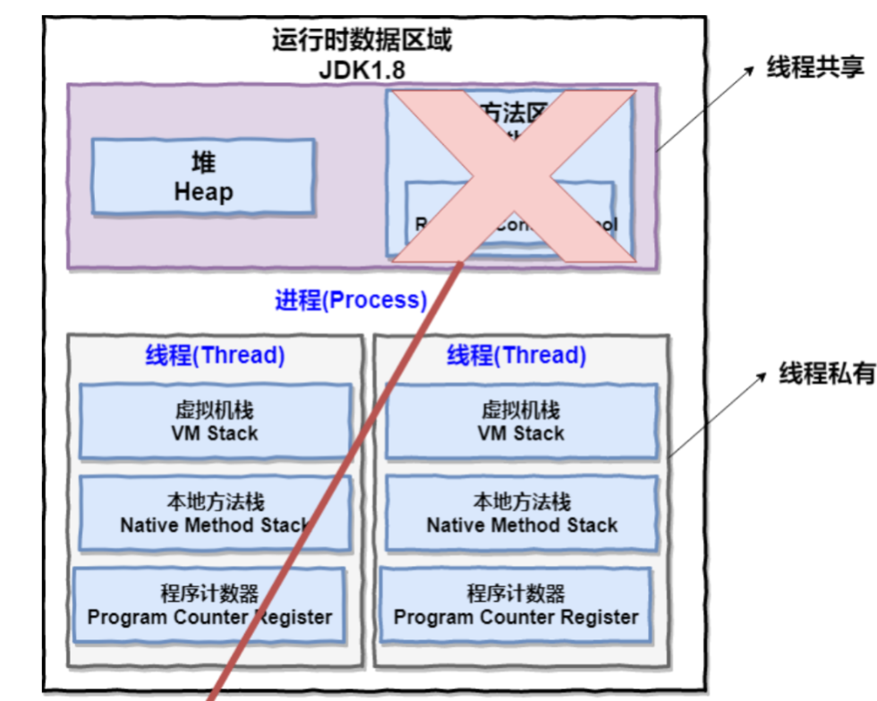
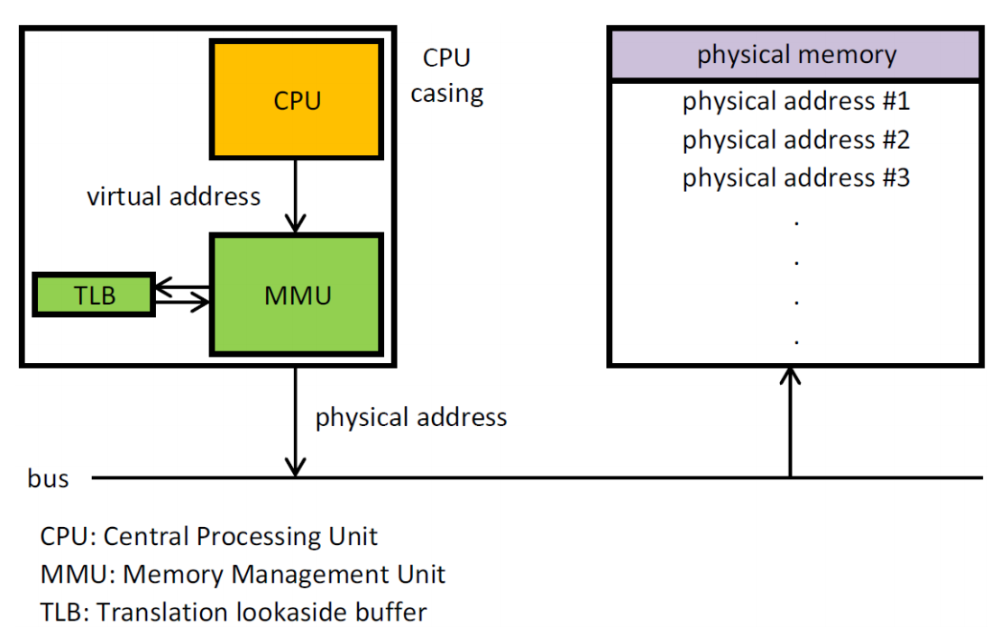

## 操作系统

操作系统（Operating System，简称 OS）是管理计算机硬件与软件资源的程序。本质上是⼀个运⾏在计算机上的软件程序。操作系统存在屏蔽了硬件层的复杂性。

操作系统的内核（Kernel）是操作系统的核⼼部分，它负责系统的内存管理，硬件设备的管理，⽂件系统的管理以及应⽤程序的管理。内核是连接应⽤程序和硬件的桥梁。

## 内核态和用户态

内核态和用户态也可以说是内核空间和用户空间。

内核态：

**可以简单的理解系统态运⾏的进程或程序⼏乎可以访问计算机的任何资源，不受限制。**

 一种**特殊的软件程序**，特殊在哪儿呢？**控制计算机的硬件资源，例如协调CPU资源，分配内存资源，并且提供稳定的环境供应用程序运行**。 

内核态的cpu可以访问内存的所有数据，包括外围设备，例如硬盘，网卡，cpu也可以切换程序。

用户态：

**⽤户态运⾏的进程或可以直接读取⽤户程序的数据。**

所有用户程序都是运行在用户态的，为了使应用程序访问到内核管理的资源例如CPU，内存，I/O。例如： **用户态想要申请一块20K大小的动态内存** ，例如：例如从硬盘读取数据, 或者从键盘获取输入等。内核必须提供一组通用的访问接口，这些接口就叫**系统调用。** 

用户态的cpu只能受限的访问内存，且不允许访问外围设备，占用cpu的能力被剥夺，cpu资源可以被其他程序获取。

**为什么要有用户态和内核态？**

**限制不同的程序之间的访问能力,** 防止他们获取别的程序的内存数据, 或者获取外围设备的数据,。

##### 用户态与内核态的切换

 3种最主要方式 方式 

1、系统调用 

如果我们**调⽤**操作系统提供的**系统态级别的⼦功能**咋办呢？那就需要系统调⽤了！也就是说在我们运⾏的⽤户程序中，凡是与系统态级别的资源有关的操作（如⽂件管理、进程控制、内存管理等)，都必须通过系统调⽤⽅式向操作系统提出服务请求，并由操作系统代为完成。

这些系统调⽤按功能⼤致可分为如下⼏类：

设备管理。完成设备的请求或释放，以及设备启动等功能。

⽂件管理。完成⽂件的读、写、创建及删除等功能。

进程控制。完成进程的创建、撤销、阻塞及唤醒等功能。

进程通信。完成进程之间的消息传递或信号传递等功能。

内存管理。完成内存的分配、回收以及获取作业占⽤内存区⼤⼩及地址等功能。

例如： **用户态想要申请一块20K大小的动态内存**，或者说从硬盘读取数据, 或者从键盘获取输入等。

2、异常 

如果当前进程运行在用户态，如果这个时候发生了异常事件，就会触发切换。例如：缺页异常。 

3、外围设备的中断 

当外设完成用户的请求时，会向CPU发送中断信号。 

其中系统调用可以认为是用户进程主动发起的，异常和外围设备中断则是被动的。 

Linux操作系统就将权限等级分为了2个等级，分别就是内核态和用户态。  **给不同的操作给与不同的“权限”** ，解决操作冲突。

## 进程和线程的区别

##### JVM角度

图中，⼀个进程中可以有多个线程，多个线程共享进程的堆和⽅法区 (JDK1.8 之后的元空间，元空间存在于直接内存中)资源，但是每个线程有⾃⼰的**程序计数器、虚拟机栈和本地⽅法栈**。

**程序计数器**

程序计数器主要有下面两个作用：

1. **字节码解释器**通过改变程序计数器来**依次读取指令**，从而实现代码的流程控制，如：顺序执行、选择、循环、异常处理。
2. 在多线程的情况下，程序计数器用于记录当前线程执行的位置，从而当线程被切换回来的时候能够知道该线程上次运行到哪儿了。程序计数器私有主要是为了**线程切换后能恢复到正确的执行位置**。 

需要注意的是，如果执行的是 **native 方法**，那么程序计数器记录的是 **undefined 地址**，只有执行的是 **Java 代码**时程序计数器记录的才是**下一条指令的地址**。 

**虚拟机栈和本地方法栈为什么是私有的?**

保证线程中的局部变量不被别的线程访问到

##### 操作系统角度

**根本区别**：进程是**操作系统资源分配**的基本单位，而线程是**处理器任务调度和执行**的基本单位

**资源开销**：每个进程都有独立的代码和数据空间（程序上下文），程序之间的切换会有较大的开销；线程可以看做轻量级的进程，同一类线程共享代码和数据空间，每个线程都有自己独立的运行栈和程序计数器（PC），线程之间切换的开销小。

**包含关系**：如果一个进程内至少有一个线程，也可以有多个线程。每个独立的进程有程序运行的入口，出口，线程不能独立执行，必须依存在应用程序中。

**内存分配**：同一进程的线程共享本进程的地址空间和资源，而进程之间的地址空间和资源是相互独立的

## 进程状态

1、创建状态(new)：进程正在被创建，尚未到就绪状态。

2、就绪状态(ready)：进程已处于准备运⾏状态，即进程获得了除了处理器之外的⼀切所需资源，⼀旦得到处理器资源(处理器分配的时间⽚)即可运⾏。

3、运⾏状态(running)：进程正在处理器上上运⾏(单核 CPU 下任意时刻只有⼀个进程处于运⾏状态)。

4、阻塞状态(waiting)：⼜称为等待状态，进程正在等待某⼀事件⽽暂停运⾏如等待某资源为可⽤或等待 IO 操作完成。即使处理器空闲，该进程也不能运⾏。

5、结束状态(terminated)：进程正在从系统中消失。可能是进程正常结束或其他原因中断退出运⾏。

## 进程间的通信⽅式

1、**管道/匿名管道(Pipes)：**⽤于具有亲缘关系的**⽗⼦进程间或者兄弟进程之间的通信**。

2、 **有名管道(Names Pipes) :** 上边的匿名管道由于没有名字，只能⽤于亲缘关系的进程间通信，比较局限。为了克服这个缺点，提出了有名管道。有名管道严格遵循先进先出(first in first out)。有名管道以磁盘⽂件的⽅式存在，**可以实现本机任意两个进程通信**。

3、 **信号(Signal)：**信号是⼀种复杂的通信⽅式，⽤于**通知接收进程某个事件已经发⽣**；

4、 **消息队列(Message Queuing)：**消息队列是消息的链表,具有特定的格式,存放在内存中并由消息队列标识符标识。管道和消息队列的通信数据都是先进先出的原则。与管道（⽆名管道：只存在于内存中的⽂件；命名管道：存在于实际的磁盘介质或者⽂件系统）不同的是**消息队列存放在内核**中，只有在内核重启(即，操作系统重启)或者显示地删除⼀个消息队列时，该消息队列才会被真正的删除。消息队列可以实现消息的随机查询,消息不⼀定要以先进先出的次序读取,也可以按消息的类型读取.⽐ FIFO 更有优势。消息队列克服了信号承载信息量少，管道只能承载⽆格式字节流以及缓冲区⼤⼩受限等缺点。

5、 **信号量(Semaphores)：**信号量是⼀个**计数器**，⽤于**多进程对共享数据的访问**，信号量的意图在于**进程间同步**。这种通信⽅式主要⽤于解决与同步相关的问题并**避免竞争**条件。

6、 **共享内存(Shared memory)：**使得多个进程可以访问同⼀块内存空间，不同进程可以及时看到对⽅进程中对共享内存中数据的更新。这种⽅式**需要依靠某种同步操作，如互斥锁和信号量**等。可以说这是**最有⽤的进程间通信⽅式**。

7、 **套接字(Sockets) :** 此⽅法主要⽤于**在客户端和服务器之间通过⽹络进⾏通信**。**套接字是⽀持 TCP/IP 的⽹络通信的基本操作单元**，可以看做是不同主机之间的进程进⾏双向通信的端点，简单的说就是通信的两⽅的⼀种约定，⽤套接字中的相关函数来完成通信过程。

## 线程间的同步的⽅式

1、**互斥量(Mutex)：**

采⽤互斥对象机制，只有拥有互斥对象的线程才有访问公共资源的权限。因为互斥对象只有⼀个，所以可以保证公共资源不会被多个线程同时访问。**⽐如 Java 中的synchronized 关键词和各种 Lock 都是这种机制。**

2、**信号量(Semphares)：**

它**允许同⼀时刻多个线程访问同⼀资源**，但是需要控制同⼀时刻访问此资源的**最⼤线程数量**。

3、**事件(Event) :**

Wait/Notify：通过**等待与通知**操作的⽅式来保持多线程同步。

## 进程的调度算法

**1、先到先服务(FCFS)调度算法 :** 从**就绪队列中选择⼀个最先进⼊该队列的进程为之分配资源**，使它⽴即执⾏并⼀直执⾏到完成或发⽣某事件⽽被阻塞放弃占⽤ CPU 时再重新调度。

**2、短作业优先(SJF)的调度算法 :** 从就绪队列中选出⼀个**估计运⾏时间最短的进程为之分配资源**，使它⽴即执⾏并⼀直执⾏到**完成**或发⽣某**事件**⽽被阻塞放弃占⽤ CPU 时再重新调度。

**3、时间⽚轮转调度算法 :** 时间⽚轮转调度是⼀种最古⽼，**最简单，最公平且使⽤最⼴的算法**，⼜称 RR(Round robin)调度。**每个进程被分配⼀个时间段，称作它的时间⽚，即该进程允许运⾏的时间。**

**4、多级反馈队列调度算法：**前⾯介绍的⼏种进程调度的算法都有⼀定的局限性。如短进程优先的调度算法，仅照顾了短进程⽽忽略了⻓进程。多级反馈队列调度算法既能使**⾼优先级的作业得到响应⼜能使短作业（进程）迅速完成**。，因⽽它是⽬前被公认的⼀种较好的进程调度算法，可以说是上边几种的**综合**，**UNIX** 操作系统采取的便是这种调度算法。

**5、优先级调度：**为每个流程分配优先级，**优先级高的先执行，相同的按照进队列的顺序即FCFS ⽅式执⾏。**

## 逻辑(虚拟)地址和物理地址

⽐如在 **C 语⾔中，指针⾥⾯存储的数值**就可以理解成为内存⾥的⼀个地址，这个地址也就是我们说的逻辑地址，**逻辑地址由操作系统决定**。**物理地址指的就是内存地址寄存器中的地址。**物理地址是内存单元真正的地址。

## 内存管理

操作系统的内存管理主要负责**内存的分配与回收**（**malloc 函数：申请内存，free 函数：释放内存**）。

**地址转换**也就是将**逻辑地址**转换成相应的**物理地址**等功能也是操作系统内存管理做的事情。

## 内存管理机制

简单分为连续分配管理⽅式和⾮连续分配管理⽅式这两种。

**1、连续分配管理**⽅式是指为⼀个⽤户**程序分配⼀个连续的内存空间**，常⻅的如**块式管理**。

**2、⾮连续分配管理**⽅式允许⼀个程序使⽤的内存分布在离散或者说**不相邻的内存**中，常⻅的如**⻚式管理和段式管理**。

**块式管理：远古时代**的计算机操系统的内存管理⽅式。将内存分为⼏个**固定⼤⼩的块**，**每个块中只包含⼀个进程**。如果程序运⾏需要内存的话，操作系统就分配给它⼀块，如果程序运⾏只需要很⼩的空间的话，分配的这块内存很⼤⼀部分⼏乎被**浪费**了。这些在每个块中未被利⽤的空间，我们称之为**碎⽚**。

**⻚式管理**：把主存分为⼤⼩相等且**固定**的⼀⻚⼀⻚的形式，⻚较⼩，相对**相⽐于块式管理的划分⼒度更⼤**，**提⾼了内存利⽤率，减少了碎⽚**。**⻚式管理通过⻚表对应逻辑地址和物理地址。**

**段式管理**：⻚式管理虽然提⾼了内存利⽤率，但是⻚式管理其中的**⻚实际并⽆任何实际意义**。段式管理把主存分为⼀段段的，每⼀段的空间⼜要⽐⼀⻚的空间⼩很多。但是，最重要的是段是有实际意义的，每个**段定义了⼀组逻辑信息**，例如,有**主程序段 MAIN、⼦程序段X、**数据段 D 及栈段 S 等。段式管理通过**段表**对应逻辑地址和物理地址。

**段⻚式管理机制**：段⻚式管理机制结合了段式管理和⻚式管理的优点。简单来说段⻚式管理机制就是**把主存先分成若⼲段，每个段⼜分成若⼲⻚**，也就是说段⻚式管理机制中**段与段之间以及段的内部的都是离散的**。

## 分⻚机制和分段机制的共同点和区别

共同点：

1、分⻚机制和分段机制都是为了**提⾼内存利⽤率，减少内存碎⽚。**

2、**⻚和段都是离散存储的**，所以两者都是离散分配内存的⽅式。**但是，每个⻚和段中的内存是连续的**。

区别：

1、**⻚的⼤⼩是固定的，由操作系统决定**；**段的⼤⼩不固定，取决于我们当前运⾏的程序**。

2、分⻚仅仅是为了满⾜操作系统内存管理的需求，**页没有什么意思**。⽽**段是逻辑信息的单位**，**在程序中可以体现为代码段**，数据段，能够更好满⾜⽤户的需要。

## 快表和多级⻚表

快表和多级⻚表，这两个东⻄分别解决了⻚表管理中很重要的两个问题：

1、虚拟地址到物理地址的转换速度要快的问题。

2、 解决虚拟地址空间⼤，⻚表也会很⼤的问题。

**快表**

为了解决虚拟地址到物理地址的转换速度，操作系统在**⻚表**⽅案基础之上引⼊了快表来加速虚拟地址到物理地址的转换。

我们可以把**快表**理解为⼀种特殊的**⾼速**缓冲存储器（**缓存**Cache），其中的内容是**⻚表的⼀部分或者全部内容**。**减少对主存的访问次数**，提⾼了访问速率。由于采⽤**⻚表做地址转换，读写内存数据时 CPU 要访问两次主存**。有了快表，有时只要访问⼀次⾼速缓冲存储器，⼀次主存，这样可加速查找并提⾼指令执⾏速度。

使⽤快表之后的地址转换流程是这样的：

**1、根据虚拟地址中的⻚号查快表；**

2、如果该⻚在快表中，直接从快表中读取相应的物理地址；

3、如果该⻚不在快表中，就**访问内存中的⻚表**，再从⻚表中得到物理地址，同时将⻚表中的该映射表项添加到快表中；

4、当快表填满后，⼜要登记新⻚时，就按照⼀定的**淘汰策略**淘汰掉**快表**中的⼀个**⻚**。

快表和我们平时经常在我们开发的系统使⽤的缓存（⽐如 Redis）很像，的确是这样的，操作系统中的很多思想、很多经典的算法，你都可以在我们⽇常开发使⽤的各种⼯具或者框架中找到它们的影⼦。

**多级⻚表**

引⼊多级⻚表的主要⽬的是为了避免把全部⻚表⼀直放在内存中占⽤过多空间，特别是那些根本就不需要的⻚表就不需要保留在内存中。

多级⻚表属于**时间换空间**的典型场景。

具体可以查看下⾯这篇⽂章多级⻚表如何节约内存：https://www.polarxiong.com/archives/%E5%A4%9A%E7%BA%A7%E9%A1%B5%E8%A1%A8%E5%A6%82%E4%BD%95%E8%8A%82%E7%BA%A6%E5%86%85%E5%AD%98.html

为了**提⾼内存的空间效率**，提出了**多级⻚表**的概念。为了加**快地址的转换速度**，提出了**快表**（即 TLB， translation lookaside buffer的简称 ）的概念。

不论是快表还是多级⻚表实际上都利⽤到了程序的**局部性原理**，局部性原理在后⾯的虚拟内存这部分会介绍到。

## CPU 寻址了解吗?为什么需要虚拟地址空间?

**现代处理器**使⽤的是⼀种称为虚拟寻址(Virtual Addressing)的寻址⽅式。**使⽤虚拟寻址，CPU需要将虚拟地址翻译成物理地址，这样才能访问到真实的物理内存。实际上完成虚拟地址转换为物理地址转换的硬件是 CPU 中含有⼀个被称为内存管理单元**（Memory Management Unit,**MMU**）的**硬件**。

为什么要有虚拟地址空间呢？

**为了系统稳定，内存访问管理，假如没有虚拟地址，可能对操作系统造成伤害以及给同时运⾏多个程序造成困难。**

1、⽤户程序可以访问任意内存，寻址内存的每个字节，这样就很容易（有意或者⽆意）破坏操作系统，造成操作**系统崩溃**。

2、想要同时运⾏多个程序特别困难，⽐如你想同时运⾏⼀个微信和⼀个 QQ ⾳乐都不⾏。为什么呢？举个简单的例⼦：微信在运⾏的时候给内存地址 1xxx 赋值后，QQ ⾳乐也同样给内存地址 1xxx 赋值，那么 QQ ⾳乐对内存的赋值就会**覆盖微信之前所赋的值**，这就造成了微信这个程序就会崩溃。

通过虚拟地址访问内存有以下优势：

1、程序可以使⽤⼀系列相邻的虚拟地址来访问物理内存中不相邻的⼤内存缓冲区，**也就是组装散的小内存当做一个大的连续内存来用**。

2、**不同进程**使⽤的虚拟地址**彼此隔离**。**⼀个进程中的代码⽆法更改正在由另⼀进程或操作系统使⽤的物理内存。**

## 虚拟内存 

**虚拟内存**是计算机系统内存管理的一种技术。它使得**应用程序**认为内存有一个**连续完整的地址空间**。而实际上，它通常是被分隔成多个物理**内存碎片**，还有部分暂时存储在外部磁盘存储器上。**使用这种技术的系统使得大型程序的编写变得更容易**，对真正内存。例如：对**RAM的使用也更有效率**。

原理：对虚拟内存的定义是基于对**地址空间的重定义**的，即**把地址空间定义为“连续的虚拟内存地址”**，以借此“**欺骗”程序**，使它们以为自己正在使用一大块的“连续”地址。

现代所有用于一般应用的[操作系统](https://zh.wikipedia.org/wiki/操作系统)都对普通的应用程序使用虚拟内存技术，例如**文字处理软件**，**多媒体播放器**等等。老一些的操作系统，1980年代的[Windows](https://zh.wikipedia.org/wiki/Windows)，等等没有的。

## 局部性原理

可以认为是规律，局部性原理表现在以下两个⽅⾯：

1、**时间局部性**：如果程序中的某条指令⼀旦执⾏，不久以后**该指令可能再次执⾏**；如果**某数据被访问过**，不久以后该数据可能再次被访问。产⽣时间局部性的典型原因，是由于在程序中存在着⼤量的循环操作。

2、**空间局部性**：⼀旦程序访问了某个存储单元，在不久之后，**其附近的存储单元也将被访问**，即程序在⼀段时间内所访问的地址，**可能集中在⼀定的范围之内**，这是因为指令通常是顺序存放、顺序执⾏的，数据也⼀般是以向量、数组、表等形式簇聚存储的。

时间局部性是通过将**近来使⽤**的指令和数据保存到**⾼速缓存存储器**中，并使⽤⾼速缓存的层次结构实现。

**空间局部性通常是使⽤⾼速缓存**，并将预取机制集成到⾼速缓存控制逻辑中实现。

虚拟内存技术实际上就是建⽴了 “内存⼀外存”的两级存储器的结构，利⽤局部性原理实现髙速缓存。

## 虚拟存储器

**基于局部性原理**，在程序装⼊时，可以将程序的⼀部分装⼊内存，⽽将其他部分留在外存，就可以启动程序执⾏。

由于外存往往⽐内存⼤很多，所以我们运⾏的软件的内存⼤⼩实际上是可以⽐计算机系统实际的内存⼤⼩⼤的。

当所访问的信息不在内存时，由操作系统将所需要的部分**调⼊内存**，然后继续执⾏程序。

另⼀⽅⾯，操作系统将内存中暂时不使⽤的内容**换到外存上**，从⽽腾出空间存放将要调⼊内存的信息。

这样，计算机好像为⽤户提供了⼀个**⽐实际内存⼤**的多的存储器——虚拟存储器。

## 虚拟内存的技术实现

**我觉得虚拟内存同样是⼀种时间换空间的策略，你⽤ CPU 的计算时间，⻚的调⼊调出花费的时间，换来了⼀个虚拟的更⼤的空间来⽀持程序的运⾏。**

虚拟内存的实现需要建⽴在**离散分配的内存管理⽅式**的基础上。

虚拟内存的实现有以下三种⽅式：

1、**请求分⻚存储管理**：

建⽴**在分⻚管理之上**，为了⽀持虚拟存储器功能⽽增加了请求调⻚功能和⻚⾯置换功能。请求分⻚是⽬前最常⽤的⼀种实现虚拟存储器的⽅法。请求分⻚存储管理系统中，在作业开始运⾏之前，仅装⼊当前要执⾏的部分段即可运⾏。假如在作业运⾏的过程中发现要访问的⻚⾯不在内存，则由处理器通知操作系统按照对应的⻚⾯置换算法将相应的⻚⾯调⼊到主存，同时操作系统也可以将暂时不⽤的⻚⾯置换到外存中。

2、**请求分段存储管理**：

建⽴在**分段存储管理之上**，增加了请求调段功能、分段置换功能。请求分段储存管理⽅式就如同请求分⻚储存管理⽅式⼀样，在作业开始运⾏之前，仅装⼊当前要执⾏的部分段即可运⾏；在执⾏过程中，可使⽤请求调⼊中断动态装⼊要访问但⼜不在内存的程序段；当内存空间已满，⽽⼜需要装⼊新的段时，根据置换功能适当调出某个段，以便腾出空间⽽装⼊新的段。

3、**请求段⻚式存储管理**

## 请求分⻚存储管理与分⻚存储管理区别

请求分⻚存储管理建⽴在分⻚管理之上。

它们之间的根本区别在于**是否将⼀作业的全部地址空间同时装⼊主存**。**请求分⻚存储管理**不要求将作业全部地址空间同时装⼊主存。基于这⼀点，请求分⻚存储管理可以提供虚存，⽽分⻚存储管理却不能提供虚存。

## ⻚⾯置换算法

**地址映射过程中**，若在⻚⾯中发现所要访问的**⻚⾯不在内存**中，则发⽣**缺⻚中断**。

**缺⻚中断**就是要访问的⻚不在主存，**需要操作系统将其调⼊主存后再进⾏访问**。

当发⽣缺⻚中断时，如果当前内存中并没有空闲的⻚⾯，操作系统就必须在内存选择⼀个⻚⾯将其**移出内存**。

我们可以把**⻚⾯置换算法**看成是淘汰⻚⾯的规则：

**1、OPT ⻚⾯置换算法（最佳⻚⾯置换算法）**：最佳(Optimal, OPT)置换算法所选择的被淘汰⻚⾯将是**以后永不使⽤的**，或者是在最⻓时间内不再被访问的⻚⾯,这样可以保证获得最低的缺⻚率。但由于⼈们⽬前⽆法预知进程在内存下的若千⻚⾯中哪个是未来最⻓时间内不再被访问的，**因⽽该算法⽆法实现**。**⼀般作为衡量其他置换算法的⽅法。**

**2、FIFO（First In First Out）⻚⾯置换算法（先进先出⻚⾯置换算法）** : 总是淘汰最先进⼊内存的⻚⾯，即选择在内存中**驻留时间最久的⻚⾯进⾏淘汰**。

**3、LRU （Least Currently Used）⻚⾯置换算法（最近最久未使⽤⻚⾯置换算法）**：LRU算法赋予每个⻚⾯⼀个访问字段，⽤来记录⼀个⻚⾯⾃上次被访问以来所经历的时间 T，当须淘汰⼀个⻚⾯时，选择现有⻚⾯中其 T 值最⼤的，即**最近最久未使⽤的⻚⾯予以淘汰**。

**4、LFU （Least Frequently Used）⻚⾯置换算法（最少使⽤⻚⾯置换算法）** : 该置换算法选择在之前时期**使⽤最少**的⻚⾯作为淘汰⻚。

# --------------------------------------

## 阿里云存储

## 进程有哪些状态，怎么进入

## 父进程和子进程哪些是共享的

## cas 和 信号量 的区别

## fork, exec 的区别

## exec 和父子进程在资源共享方面的区别

## linux 怎么做进程调度

## 把 nice 值调整后，系统就一定会调度吗

## linux 的启动过程具体是怎么做的

## 多级页表怎么做，优势

## 单机页表是否可以像多级页表一样做

## 空闲物理内存怎么管理的

## 当内存不够时，你新建对象，操作系统发生了哪些过程

## 软硬中断的区别，应用场景

## 中断由什么组成，系统怎么处理的

## 中断的上下步

## DMA 是什么，应用场景

## --------------------------------------

## 零拷贝

**技术是指计算机执行操作时，CPU不需要先将数据从某处内存复制到另一个特定区域。**这种技术通常用于通过**网络传输文件时节省CPU周期和内存带宽**。

## 原理

**操作系统某些组件**（例如驱动程序、**文件系统**和网络协议栈）**若采用零复制技术**，则能增强性能，并更有效地利用系统资源。另外，**零复制操作减少了在用户空间与内核空间之间切换模式的次数**。

举例来说，如果要**读取一个文件并通过网络发送它，传统方式下每个读/写周期都需要复制两次数据和切换两次上下文，而数据的复制都需要依靠CPU。通过零复制技术完成相同的操作，上下文切换减少到两次，并且不需要CPU复制数据。**

**上下文切换**：当用户程序向内核发起系统调用时，CPU 将用户进程从用户态切换到内核态；当系统调用返回时，CPU 将用户进程从内核态切换回用户态。

**CPU 拷贝**：由 CPU 直接处理数据的传送，数据拷贝时会一直占用 CPU 的资源。

**DMA 拷贝**：由 CPU 向 DMA 磁盘控制器下达指令，让 DMA 控制器来处理数据的传送，数据传送完毕再把信息反馈给 CPU，从而减轻了 CPU 资源的占有率。

## 硬件实现

最早的实现为IBM、OS/360，其中一个程序可以指示通道子系统从一个文件或设备复制数据块到另一处，无需先转移数据。

实现零复制的软件通常依靠**基于直接存储器访问（DMA）的复制**，以及**通过内存管理单元（MMU）的内存映射。**这些功能需要特定**硬件的支持**，并通常涉及到特定存储器的对齐。

一种较新的方式为使用**异构系统架构（HSA）**，便于CPU和GPU以及其他处理器传递指针。这需要CPU和GPU使用统一地址空间。

## 程序访问

数种操作系统都通过**特定API**支持文件的零复制。

**Linux内核通过各个系统调用支持零复制**，例如sys/socket.h的sendfile、sendfile64以及splice。它们部分在POSIX中指定，因此也存在于BSD内核或IBM AIX中，部分则是Linux内核API中独有。

Microsoft **Windows通过TransmitFile API支持零复制。**

**Java输入流可以通过java.nio.channels支持零复制。FileChannel的transferTo()方法也可以支持零复制（如果底层操作系统支持）。**

**远程直接内存访问（RDMA）协议深度依赖零复制技术。**

参考

零复制 维基百科[https://zh.wikipedia.org/wiki/%E9%9B%B6%E5%A4%8D%E5%88%B6]

零复制好文相关未参考：https://www.cnblogs.com/rickiyang/p/13265043.html

零复制好文相关未参考：https://www.cnblogs.com/xiaolincoding/p/13719610.html

零复制好文相关未参考：https://juejin.cn/post/6844903949359644680