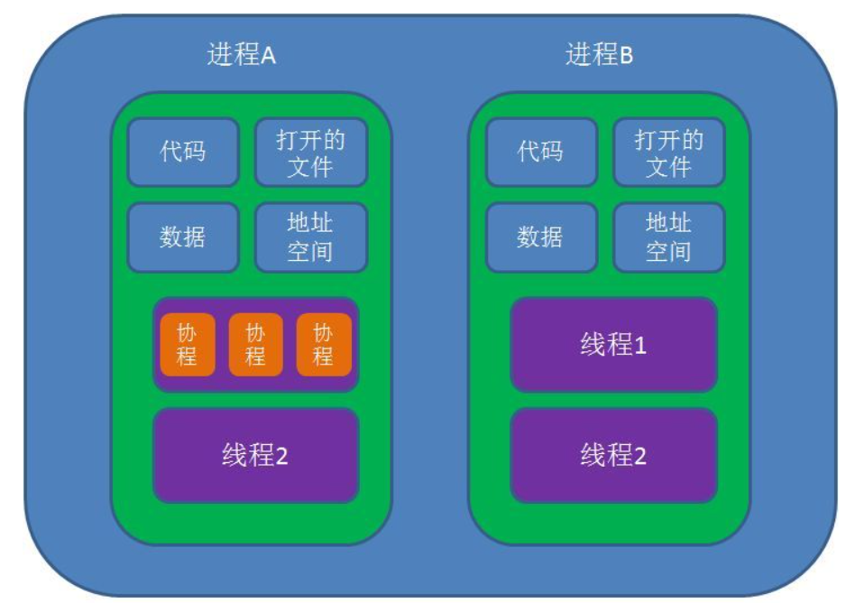

## 进程与线程

### 1. 进程

**进程是资源分配的基本单位**。

**进程控制块** (Process Control Block, PCB) 描述**进程的基本信息和运行状态**，所谓的创建进程和撤销进程，都是指对 **PCB** 的操作。

下图显示了 4 个程序创建了 4 个进程，这 4 个进程可以并发地执行。

<div align="center">  </div><br>
### 2. 线程

**线程是独立调度的基本单位**。

一个进程中可以有多个线程，它们共享进程资源。

**QQ 和浏览器是两个进程**，浏览器进程里面有很多线程，例如 **HTTP 请求线程**、**事件响应线程**、**渲染线程**等等，线程的并发执行使得在浏览器中点击一个新链接从而发起 HTTP 请求时，浏览器还可以响应用户的其它事件。

<div align="center">  </div><br>
### 3. 区别

Ⅰ **拥有资源**

进程是资源分配的基本单位，但是**线程不拥有资源**，线程可以访问隶属进程的资源。

Ⅱ 调度

线程是独立调度的基本单位，在同一进程中，**线程的切换不会引起进程切换**，从**一个进程中的线程切换到另一个进程中的线程**时，会引起**进程切换**。

Ⅲ 系统开销

由于创建或撤销**进程**时，系统都要为之分配或回收资源，如**内存空间、I/O 设备**等，所付出的开销远大于创建或撤销线程时的开销。类似地，在进行进程切换时，涉及当前执行进程 CPU 环境的保存及新调度进程 CPU 环境的设置，而**线程切换**时只需保存和设置**少量寄存器**内容，开销很小。

Ⅳ 通信方面

线程间可以通过**直接读写同一进程中的数据进行通信**，但是**进程通信**需要借助 **IPC（InterProcess Communication）**。

## 协程




**协程（Coroutine，又称微线程），是一种比线程更加轻量级的存在，协程不是被操作系统内核所管理，而完全是由程序所控制（也就是在用户态执行）。 协程之间的切换不需要涉及任何系统调用或任何阻塞调用，不会像线程切换那样消耗资源。**

协程与线程的对比：

- 协程只在一个线程中执行，是子程序之间的切换，发生在**用户态**上。而且，**线程的阻塞状态**是由操作系统**内核**来完成，发生在**内核态**上，因此协程相比线程节省了线程创建和切换的开销
- **协程中不存在同时写变量冲突**，因此，也就不需要用来守卫关键区块的同步性原语，比如互斥锁、信号量等，并且不需要来自操作系统的支持。

**子程序**，或者称为**函数**，在所有语言中都是层级调用，比如A调用B，B在执行过程中又调用了C，C执行完毕返回，B执行完毕返回，最后是A执行完毕。所以**子程序调用是通过栈实现**的，一个线程就是执行一个子程序。子程序调用总是一个入口，一次返回，调用顺序是明确的。而**协程的调用和子程序不同。**

**协程可以比作子程序**，但执行过程中，子程序内部可中断，然后转而执行别的子程序，在适当的时候再返回来继续执行。协程之间的切换不需要涉及任何系统调用或任何阻塞调用。

````java
def A():
    print '1'
    print '2'
    print '3'

def B():
    print 'x'
    print 'y'
    print 'z'
````

  假设由协程执行，在执行A的过程中，可以随时中断，去执行B，B也可能在执行过程中中断再去执行A，结果可能是：1 2 x y 3 z。

### 使用场景

- CPU密集型： 多进程
- IO密集型： 多线程（协程维护成本较高,而且在读写文件方面效率没有显著提升）
- CPU密集和IO密集： 多进程+协程

进程和线程、协程在python中的使用

1、多进程一般使用multiprocessing库，来利用多核CPU，主要是用在**CPU密集型**的程序上，当然生产者消费者这种也可以使用。**多进程的优势就是一个子进程崩溃并不会影响其他子进程和主进程的运行**，但缺点就是不能一次性启动太多进程，会严重影响系统的资源调度，特别是**CPU使用率和负载**。

2、多线程一般是使用threading库，完成一些IO密集型并发操作。**多线程的优势是切换快，资源消耗低，但一个线程挂掉则会影响到所有线程，所以不够稳定。**现实中使用线程池的场景会比较多，具体可参考《[python线程池实现](http://www.cnblogs.com/lxmhhy/p/6032924.html)》。

3、协程一般是使用gevent库，当然这个库用起来比较麻烦，所以使用的并不是很多。相反，协程在tornado的运用就多得多了，使用协程让tornado做到**单线程异步**，据说还能解决C10K的问题。所以协程使用的地方最多的是在web应用上。

协程多与线程进行比较

1、**一个线程可以多个协程**，**一个进程也可以单独拥有多个协程**，这样python中则能使用多核CPU。

2、**线程进程都是同步**机制，而**协程则是异步**

3、协程能保留上一次调用时的状态，每次过程重入时，就相当于进入上一次调用的状态

参考

面试必备：进程,线程和协程：https://zhuanlan.zhihu.com/p/166536738

进程、线程和协程之间的区别和联系：https://blog.csdn.net/daaikuaichuan/article/details/82951084

[进程和线程、协程的区别](https://www.cnblogs.com/lxmhhy/p/6041001.html)

## 同一进程中的线程究竟共享哪些资源

一般的评价标准是：如果某些资源不独享会导致线程运行错误，则该资源就由每个线程独享，而其他资源都由进程里面的所有线程共享。

| 线程共享资源：                        | 线程独享资源：   |
| ------------------------------------- | ---------------- |
| **地址空间**                          | **程序计数器**   |
| **堆、 全局变量（包括全局静态变量）** | **栈、局部变量** |
| **打开的文件**                        | **寄存器**       |
| **子进程**                            | 状态字           |
| **闹铃、信号及信号服务程序**          | 错误返回码       |
| 记账信息                              |                  |

## 进程状态的切换

<div align="center">  </div><br>
- 就绪状态（ready）：等待被调度
- 运行状态（running）
- 阻塞状态（waiting）：等待资源

应该注意以下内容：

- **只有就绪态和运行态可以相互转换**，其它的都是单向转换。
- **就绪状态的进程通过调度算法从而获得 CPU 时间，转为运行状态；**
- **运行状态的进程，在分配给它的 CPU 时间片用完之后就会转为就绪状态**，等待下一次调度。
- **阻塞状态是缺少需要的资源从而由运行状态转换而来，但是该资源不包括 CPU 时间**，缺少 CPU 时间会从运行态转换为**就绪态**。

## 进程调度算法

**不同环境的调度算法目标不同**，因此需要针对不同环境来讨论调度算法。

### 1. 批处理系统

**批处理系统**没有太多的用户操作，在该系统中，调度算法目标是保证**吞吐量和周转时间（从提交到终止的时间）**。

**1.1 先来先服务 first-come first-serverd（FCFS）**  

非抢占式的调度算法，**按照请求的顺序进行调度**。

**有利于长作业**，但**不利于短作业**，因为短作业必须一直等待前面的长作业执行完毕才能执行，而长作业又需要执行很长时间，造成了短作业等待时间过长。

**1.2 短作业优先 shortest job first（SJF）**  

非抢占式的调度算法，**按估计运行时间最短的顺序进行调度**。

**长作业有可能会饿死**，处于一直等待短作业执行完毕的状态。因为如果一直有短作业到来，那么长作业永远得不到调度。

**1.3 最短剩余时间优先 shortest remaining time next（SRTN）**  

最短作业优先的抢占式版本，按剩余运行时间的顺序进行调度。 当一个新的作业到达时，其整个运行时间与**当前进程的剩余时间作比较**。**如果新的进程需要的时间更少，则挂起当前进程，运行新的进程。否则新的进程等待**。

### 2. 交互式系统

**交互式系统**有大量的用户交互操作，在该系统中调度算法的目标是**快速地进行响应**。

**2.1 时间片轮转**  

将所有就绪进程按 **FCFS 的原则排成一个队列**，每次调度时，把 CPU 时间分配给队首进程，该进程可以**执行一个时间片**。当时间片用完时，由**计时器发出时钟中断**，调度程序便停止该进程的执行，并将它**送往就绪队列的末尾**，同时继续**把 CPU 时间分配给队首的进程**。

时间片轮转算法的效率和时间片的大小有很大关系：

- 因为进程切换都要保存进程的信息并且载入新进程的信息，如果**时间片太小**，会导致进程**切换得太频繁**，在进程切换上就会花过多时间。
- 而如果**时间片过长**，那么**实时性**就不能得到保证。

<div align="center">  </div><br>
**2.2 优先级调度**  

为每个进程分配一个优先级，**按优先级进行调度**。

为了防止低优先级的进程永远等不到调度，**可以随着时间的推移增加等待进程的优先级**。

**2.3 多级反馈队列**  

一个进程需要执行 100 个时间片，如果采用时间片轮转调度算法，那么需要交换 100 次。

**多级队列是为这种需要连续执行多个时间片的进程考虑**，它设置了多个队列，**每个队列时间片大小都不同**，例如 1,2,4,8,..。进程在第一个队列没执行完，就会被移到下一个队列。这种方式下，之前的进程只需要交换 7 次。

**每个队列优先权也不同**，**最上面的优先权最高**。因此只有上一个队列没有进程在排队，才能调度当前队列上的进程。

可以将这种调度算法看成是**时间片轮转调度**算法和**优先级调度**算法的结合。

<div align="center">  </div><br>
### 3. 实时系统

实时系统要求一个请求在一个确定时间内得到响应。

分为**硬实时和软实时**，前者必须满足**绝对的截止时间**，后者可以**容忍一定的超时**。

## 进程同步

### 1. 临界区

**对临界资源进行访问的那段代码**称为**临界区**。

为了互斥访问临界资源，每个进程在进入临界区之前，需要先进行检查。

```html
// entry section
// critical section;
// exit section
```

### 2. 同步与互斥

- 同步：多个进程因为合作产生的直接制约关系，使得**进程有一定的先后执行关系**。
- 互斥：多个进程在**同一时刻只有一个进程能进入临界区**。

### 3. 信号量

信号量（Semaphore）是一个整型变量，可以对其执行 down 和 up 操作，也就是常见的 P 和 V 操作。

-   **down**   : 如果信号量大于 0 ，执行 -1 操作；如果信号量**等于 0，进程睡眠**，**等待**信号量**大于 0**；
-   **up**  ：对信号量执行 +1 操作，**唤醒睡眠的进程**让其完成 down 操作。

down 和 up 操作需要被设计成**原语**，**不可分割**，通常的做法是在执行这些操作的时候**屏蔽中断**。

如果信号量的取值只能为 0 或者 1，那么就成为了   **互斥量（Mutex）**  ，**0 表示临界区已经加锁**，**1 表示临界区解锁**。

```c
typedef int semaphore;
semaphore mutex = 1;
void P1() {
    down(&mutex);
    // 临界区
    up(&mutex);
}

void P2() {
    down(&mutex);
    // 临界区
    up(&mutex);
}
```

\<font size=3\>   **使用信号量实现生产者-消费者问题**   \</font\> \</br\>

问题描述：使用一个缓冲区来保存物品，只有缓冲区没有满，生产者才可以放入物品；只有缓冲区不为空，消费者才可以拿走物品。

因为缓冲区属于临界资源，因此需要使用一个**互斥量 mutex** 来控制对缓冲区的互斥访问。

为了同步生产者和消费者的行为，需要记录缓冲区中物品的数量。数量可以使用信号量来进行统计，这里需要使用两个信号量：empty 记录空缓冲区的数量，full 记录满缓冲区的数量。其中，empty 信号量是在生产者进程中使用，当 empty 不为 0 时，生产者才可以放入物品；full 信号量是在消费者进程中使用，当 full 信号量不为 0 时，消费者才可以取走物品。

注意，不能先对缓冲区进行加锁，再测试信号量。也就是说，不能先执行 down(mutex) 再执行 down(empty)。如果这么做了，那么可能会出现这种情况：生产者对缓冲区加锁后，执行 down(empty) 操作，发现 empty = 0，此时生产者睡眠。消费者不能进入临界区，因为生产者对缓冲区加锁了，消费者就无法执行 up(empty) 操作，empty 永远都为 0，导致生产者永远等待下，不会释放锁，消费者因此也会永远等待下去。

```c
#define N 100
typedef int semaphore;
semaphore mutex = 1;
semaphore empty = N;
semaphore full = 0;

void producer() {
    while(TRUE) {
        int item = produce_item();
        down(&empty);
        down(&mutex);
        insert_item(item);
        up(&mutex);
        up(&full);
    }
}

void consumer() {
    while(TRUE) {
        down(&full);
        down(&mutex);
        int item = remove_item();
        consume_item(item);
        up(&mutex);
        up(&empty);
    }
}
```

### 4. 管程

使用**信号量机制**实现的**生产者消费者**问题需要客户端代码做很多控制，而**管程把控制的代码独立出来**，不仅不容易出错，也使得客户端代码调用更容易。

**c 语言不支持管程**，下面的示例代码使用了类 **Pascal 语言**来描述管程。示例代码的管程提供了 insert() 和 remove() 方法，客户端代码通过调用这两个方法来解决生产者-消费者问题。

```pascal
monitor ProducerConsumer
    integer i;
    condition c;

    procedure insert();
    begin
        // ...
    end;

    procedure remove();
    begin
        // ...
    end;
end monitor;
```

管程有一个重要特性：在一个时刻只能有一个进程使用管程。进程在无法继续执行的时候不能一直占用管程，否则其它进程永远不能使用管程。

管程引入了   **条件变量**   以及相关的操作：**wait()** 和 **signal()** 来实现同步操作。对条件变量执行 wait() 操作会导致调用进程阻塞，把管程让出来给另一个进程持有。signal() 操作用于唤醒被阻塞的进程。

<font size=3>  **使用管程实现生产者-消费者问题**  </font><br>

```pascal
// 管程
monitor ProducerConsumer
    condition full, empty;
    integer count := 0;
    condition c;

    procedure insert(item: integer);
    begin
        if count = N then wait(full);
        insert_item(item);
        count := count + 1;
        if count = 1 then signal(empty);
    end;

    function remove: integer;
    begin
        if count = 0 then wait(empty);
        remove = remove_item;
        count := count - 1;
        if count = N -1 then signal(full);
    end;
end monitor;

// 生产者客户端
procedure producer
begin
    while true do
    begin
        item = produce_item;
        ProducerConsumer.insert(item);
    end
end;

// 消费者客户端
procedure consumer
begin
    while true do
    begin
        item = ProducerConsumer.remove;
        consume_item(item);
    end
end;
```

## 经典同步问题

生产者和消费者问题前面已经讨论过了。

### 1. 哲学家进餐问题

<div align="center">  </div><br>
五个哲学家围着一张圆桌，每个哲学家面前放着食物。哲学家的生活有两种交替活动：吃饭以及思考。当一个哲学家吃饭时，需要先拿起自己左右两边的两根筷子，并且一次只能拿起一根筷子。

下面是一种错误的解法，如果所有哲学家同时拿起左手边的筷子，那么所有哲学家都在等待其它哲学家吃完并释放自己手中的筷子，导致死锁。

```c
#define N 5

void philosopher(int i) {
    while(TRUE) {
        think();
        take(i);       // 拿起左边的筷子
        take((i+1)%N); // 拿起右边的筷子
        eat();
        put(i);
        put((i+1)%N);
    }
}
```

为了防止死锁的发生，可以设置两个条件：

- **必须同时拿起左右两根筷子；**
- **只有在两个邻居都没有进餐的情况下才允许进餐。**

```c
#define N 5
#define LEFT (i + N - 1) % N // 左邻居
#define RIGHT (i + 1) % N    // 右邻居
#define THINKING 0
#define HUNGRY   1
#define EATING   2
typedef int semaphore;
int state[N];                // 跟踪每个哲学家的状态
semaphore mutex = 1;         // 临界区的互斥，临界区是 state 数组，对其修改需要互斥
semaphore s[N];              // 每个哲学家一个信号量

void philosopher(int i) {
    while(TRUE) {
        think(i);
        take_two(i);
        eat(i);
        put_two(i);
    }
}

void take_two(int i) {
    down(&mutex);
    state[i] = HUNGRY;
    check(i);
    up(&mutex);
    down(&s[i]); // 只有收到通知之后才可以开始吃，否则会一直等下去
}

void put_two(i) {
    down(&mutex);
    state[i] = THINKING;
    check(LEFT); // 尝试通知左右邻居，自己吃完了，你们可以开始吃了
    check(RIGHT);
    up(&mutex);
}

void eat(int i) {
    down(&mutex);
    state[i] = EATING;
    up(&mutex);
}

// 检查两个邻居是否都没有用餐，如果是的话，就 up(&s[i])，使得 down(&s[i]) 能够得到通知并继续执行
void check(i) {         
    if(state[i] == HUNGRY && state[LEFT] != EATING && state[RIGHT] !=EATING) {
        state[i] = EATING;
        up(&s[i]);
    }
}
```

### 2. 读者-写者问题

允许多个进程同时对数据进行读操作，但是不允许读和写以及写和写操作同时发生。

一个整型变量 count 记录在对数据进行读操作的进程数量，一个互斥量 count_mutex 用于对 count 加锁，一个互斥量 data_mutex 用于对读写的数据加锁。

```c
typedef int semaphore;
semaphore count_mutex = 1;
semaphore data_mutex = 1;
int count = 0;

void reader() {
    while(TRUE) {
        down(&count_mutex);
        count++;
        if(count == 1) down(&data_mutex); // 第一个读者需要对数据进行加锁，防止写进程访问
        up(&count_mutex);
        read();
        down(&count_mutex);
        count--;
        if(count == 0) up(&data_mutex);
        up(&count_mutex);
    }
}

void writer() {
    while(TRUE) {
        down(&data_mutex);
        write();
        up(&data_mutex);
    }
}
```

以下内容由 [@Bandi Yugandhar](https://github.com/yugandharbandi) 提供。

The first case may result Writer to starve. This case favous Writers i.e no writer, once added to the queue, shall be kept waiting longer than absolutely necessary(only when there are readers that entered the queue before the writer).

```c
int readcount, writecount;                   //(initial value = 0)
semaphore rmutex, wmutex, readLock, resource; //(initial value = 1)

//READER
void reader() {
<ENTRY Section>
 down(&readLock);                 //  reader is trying to enter
 down(&rmutex);                  //   lock to increase readcount
  readcount++;                 
  if (readcount == 1)          
   down(&resource);              //if you are the first reader then lock  the resource
 up(&rmutex);                  //release  for other readers
 up(&readLock);                 //Done with trying to access the resource

<CRITICAL Section>
//reading is performed

<EXIT Section>
 down(&rmutex);                  //reserve exit section - avoids race condition with readers
 readcount--;                       //indicate you're leaving
  if (readcount == 0)          //checks if you are last reader leaving
   up(&resource);              //if last, you must release the locked resource
 up(&rmutex);                  //release exit section for other readers
}

//WRITER
void writer() {
  <ENTRY Section>
  down(&wmutex);                  //reserve entry section for writers - avoids race conditions
  writecount++;                //report yourself as a writer entering
  if (writecount == 1)         //checks if you're first writer
   down(&readLock);               //if you're first, then you must lock the readers out. Prevent them from trying to enter CS
  up(&wmutex);                  //release entry section

<CRITICAL Section>
 down(&resource);                //reserve the resource for yourself - prevents other writers from simultaneously editing the shared resource
  //writing is performed
 up(&resource);                //release file

<EXIT Section>
  down(&wmutex);                  //reserve exit section
  writecount--;                //indicate you're leaving
  if (writecount == 0)         //checks if you're the last writer
   up(&readLock);               //if you're last writer, you must unlock the readers. Allows them to try enter CS for reading
  up(&wmutex);                  //release exit section
}
```

We can observe that every reader is forced to acquire ReadLock. On the otherhand, writers doesn’t need to lock individually. Once the first writer locks the ReadLock, it will be released only when there is no writer left in the queue.

From the both cases we observed that either reader or writer has to starve. Below solutionadds the constraint that no thread shall be allowed to starve; that is, the operation of obtaining a lock on the shared data will always terminate in a bounded amount of time.

```source-c
int readCount;                  // init to 0; number of readers currently accessing resource

// all semaphores initialised to 1
Semaphore resourceAccess;       // controls access (read/write) to the resource
Semaphore readCountAccess;      // for syncing changes to shared variable readCount
Semaphore serviceQueue;         // FAIRNESS: preserves ordering of requests (signaling must be FIFO)

void writer()
{ 
    down(&serviceQueue);           // wait in line to be servicexs
    // <ENTER>
    down(&resourceAccess);         // request exclusive access to resource
    // </ENTER>
    up(&serviceQueue);           // let next in line be serviced

    // <WRITE>
    writeResource();            // writing is performed
    // </WRITE>

    // <EXIT>
    up(&resourceAccess);         // release resource access for next reader/writer
    // </EXIT>
}

void reader()
{ 
    down(&serviceQueue);           // wait in line to be serviced
    down(&readCountAccess);        // request exclusive access to readCount
    // <ENTER>
    if (readCount == 0)         // if there are no readers already reading:
        down(&resourceAccess);     // request resource access for readers (writers blocked)
    readCount++;                // update count of active readers
    // </ENTER>
    up(&serviceQueue);           // let next in line be serviced
    up(&readCountAccess);        // release access to readCount

    // <READ>
    readResource();             // reading is performed
    // </READ>

    down(&readCountAccess);        // request exclusive access to readCount
    // <EXIT>
    readCount--;                // update count of active readers
    if (readCount == 0)         // if there are no readers left:
        up(&resourceAccess);     // release resource access for all
    // </EXIT>
    up(&readCountAccess);        // release access to readCount
}

```

## 进程通信

进程同步与进程通信很容易混淆，它们的区别在于：

- 进程同步：控制多个进程按一定顺序执行；
- 进程通信：进程间传输信息。

进程通信是一种手段，而进程同步是一种目的。也可以说，为了能够达到进程同步的目的，需要让进程进行通信，传输一些进程同步所需要的信息。

### 1. 管道

**管道**是通过调用 **pipe 函数创建的，fd[0] 用于读，fd[1] 用于写**。

```c
#include <unistd.h>
int pipe(int fd[2]);
```

它具有以下限制：

- 只支持**半双工通信**（单向交替传输）；
- **只能在父子进程或者兄弟进程中使用**。

<div align="center">  </div><br>
### 2. FIFO

也称为**命名管道**，**去除了管道只能在父子进程中使用的限制**。

```c
#include <sys/stat.h>
int mkfifo(const char *path, mode_t mode);
int mkfifoat(int fd, const char *path, mode_t mode);
```

FIFO 常用于客户-服务器应用程序中，FIFO 用作**汇聚点**，在**客户进程和服务器进程之间传递数据**。

<div align="center">  </div><br>
### 3. 消息队列

相比于 FIFO，消息队列具有以下优点：

- 消息队列可以**独立于读写进程存在**，从而避免了 FIFO 中同步管道的打开和关闭时可能产生的困难；
- **避免了 FIFO 的同步阻塞问题**，不需要进程自己提供**同步方法**；
- **读进程可以根据消息类型有选择地接收消息**，而不像 FIFO 那样只能**默认地接收**。

### 4. 信号量

它是一个**计数器**，用于为**多个进程提供对共享数据对象的访问**。

### 5. 共享存储

允许**多个进程共享**一个给定的**存储区**。因为**数据不需要在进程之间复制**，所以这是**最快**的一种 **IPC**。

**需要使用信号量用来同步**对共享存储的访问。

**多个进程可以将同一个文件映射到它们的地址空间**从而实现共享内存。另外 XSI 共享内存不是使用文件，而是使用内存的匿名段。

### 6. 套接字

**与其它通信机制不同的是，它可用于不同机器间的进程通信。**

## 零拷贝

**技术是指计算机执行操作时，CPU不需要先将数据从某处内存复制到另一个特定区域。**这种技术通常用于通过**网络传输文件时节省CPU周期和内存带宽**。

#### 原理

**操作系统某些组件**（例如驱动程序、**文件系统**和网络协议栈）**若采用零复制技术**，则能增强性能，并更有效地利用系统资源。另外，**零复制操作减少了在用户空间与内核空间之间切换模式的次数**。

举例来说，如果要**读取一个文件并通过网络发送它，传统方式下每个读/写周期都需要复制两次数据和切换两次上下文，而数据的复制都需要依靠CPU。通过零复制技术完成相同的操作，上下文切换减少到两次，并且不需要CPU复制数据。**

**上下文切换**：当用户程序向内核发起系统调用时，CPU 将用户进程从用户态切换到内核态；当系统调用返回时，CPU 将用户进程从内核态切换回用户态。

**CPU 拷贝**：由 CPU 直接处理数据的传送，数据拷贝时会一直占用 CPU 的资源。

**DMA 拷贝**：**由 CPU 向 DMA 磁盘控制器下达指令**，让 DMA 控制器来处理数据的传送，数据传送完毕再把信息反馈给 CPU，从而减轻了 CPU 资源的占有率。

#### 硬件实现

最早的实现为IBM、OS/360，其中一个程序可以指示通道子系统从一个文件或设备复制数据块到另一处，无需先转移数据。

实现零复制的软件通常依靠**基于直接存储器访问（DMA）的复制**，以及**通过内存管理单元（MMU）的内存映射。**这些功能需要特定**硬件的支持**，并通常涉及到特定存储器的对齐。

一种较新的方式为使用**异构系统架构（HSA）**，便于CPU和GPU以及其他处理器传递指针。这需要CPU和GPU使用统一地址空间。

#### 程序访问

数种操作系统都通过**特定API**支持文件的零复制。

**Linux内核通过各个系统调用支持零复制**，例如sys/socket.h的sendfile、sendfile64以及splice。它们部分在POSIX中指定，因此也存在于BSD内核或IBM AIX中，部分则是Linux内核API中独有。

Microsoft **Windows通过TransmitFile API支持零复制。**

**Java输入流可以通过java.nio.channels支持零复制。FileChannel的transferTo()方法也可以支持零复制（如果底层操作系统支持）。**

**远程直接内存访问（RDMA）协议深度依赖零复制技术。**

参考

零复制 维基百科[https://zh.wikipedia.org/wiki/%E9%9B%B6%E5%A4%8D%E5%88%B6]

零复制好文相关未参考：https://www.cnblogs.com/rickiyang/p/13265043.html

零复制好文相关未参考：https://www.cnblogs.com/xiaolincoding/p/13719610.html

零复制好文相关未参考：https://juejin.cn/post/6844903949359644680


