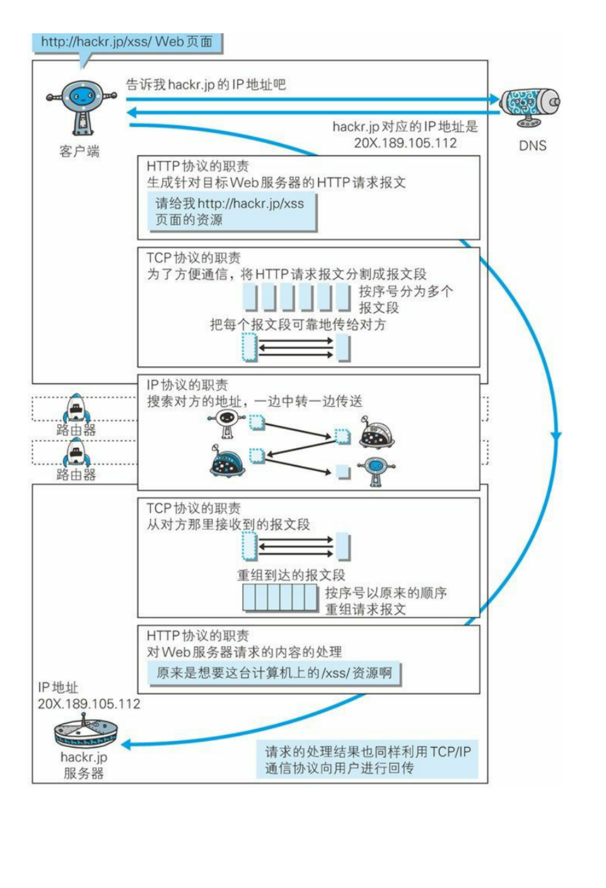
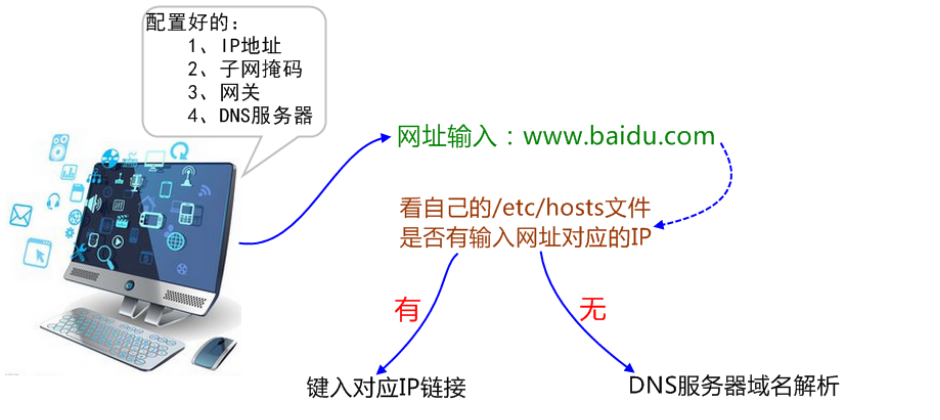

#  OSI 与 TCP/IP 以及五层协议

## 应用层

应用层(application-layer）的任务是通过应⽤进程间的交互来完成特定⽹络应⽤，应⽤层协议定义的是应⽤进程（进程：主机中正在运⾏的程序）间的通信和交互的规则。

应⽤层协议很多，如域名系统DNS，⽀持万维⽹应⽤的HTTP协议，⽀持电⼦邮件的SMTP协议

应⽤层交互的数据单元称为报⽂。

##### 域名系统

域名系统(Domain Name System缩写 DNS，Domain Name被译为域名)是因特⽹的⼀项核⼼服务，可以将域名和IP地址相互映射的⼀个分布式数据库，方便记忆。

IBM 公司的域名是www.ibm.com

##### HTTP协议

互联⽹上应⽤最为⼴泛的⼀种⽹络协议，HTTP 最初的⽬的是为了提供⼀种发布和接收 HTML ⻚⾯的⽅法。

## 运输层

运输层(transport layer)的主要任务就是负责向两台主机进程之间的通信提供通⽤的数据传输服务。

由于⼀台主机可同时运⾏多个线程，因此运输层有**复⽤和分⽤**的功能。所谓复⽤就是指多个**应⽤层进程**可同时使⽤下⾯运输层的**服务**，分⽤和复⽤相反，是运输层把收到的信息分别交付上⾯应⽤层中的相应进程。

网络层只把分组发送到目的主机，但是真正通信的并不是主机而是主机中的进程。  传输层向高层用户屏蔽了下面网络层的核心细节，使得通信看起来简单。

##### UDP 和 TCP 的特点

用户数据报协议 UDP（User Datagram Protocol）是无连接的，尽最大可能交付。

**没有拥塞控制，面向报文（对于应用程序传下来的报文不合并也不拆分，只是添加 UDP 首部），支持一对一、一对多、多对一和多对多的交互通信。**

传输控制协议 TCP（Transmission Control Protocol）是面向连接的，提供可靠交付。

**有流量控制**，**拥塞控制**，提供**全双工通信**，**面向字节流**（把应用层传下来的**报文**看成**字节流**，把**字节流**组织成大小不等的**数据块**），每一条 TCP 连接只能是点对点的（**一对一**）。

## 网络层

在计算机⽹络中进⾏通信的两个计算机之间可能会经过很多个数据链路，也可能还要经过很多通信⼦⽹。

⽹络层的任务就是选择合适的⽹间路由和交换结点，确保数据及时传送。

在发送数据时，⽹络层把运输层产⽣的**报⽂段**或⽤户数据报**封装成分组和包**进⾏传送。

在 **TCP/IP** 体系结构中，由于⽹络层使⽤IP 协议，因此**分组**也叫 IP 数据报，简称**数据报**。

这⾥要注意：

不要把运输层的“⽤户数据报 UDP ”和⽹络层的“ IP 数据报”弄混。

另外，⽆论是哪⼀层的数据单元，都可笼统地⽤“分组”来表示。

这⾥强调指出，⽹络层中的“⽹络”⼆字已经不是我们通常谈到的具体⽹络，⽽是指计算机⽹络体系结构模型中第三层的名称。

互联⽹是由⼤量的异构（heterogeneous）⽹络通过路由器（router）相互连接起来的。互联⽹使⽤的⽹络层协议是⽆连接的⽹际协议（Intert Protocol）和许多路由选择协议，因此互联⽹的⽹络层也叫做⽹际层或IP层。

## 链路层

数据链路层(data link layer)通常简称为链路层。两台主机之间的数据传输，总是在⼀段⼀段的链路上传送的，这就需要使⽤专⻔的链路层的协议。

在两个相邻节点之间传送数据时，**数据链路层将⽹络层交下来的 IP 数据报组装成帧**，在两个相邻节点间的链路上传送帧。每⼀帧包括数据和必要的控制信息（如同步信息，地址信息，差错控制等）。在接收数据时，控制信息使接收端能够知道⼀个帧从哪个⽐特开始和到哪个⽐特结束。这样，数据链路层在收到⼀个帧后，就可从中提出数据部分，上交给⽹络层。控制信息还使接收端能够检测到所收到的帧中有误差错。如果发现差错，数据链路层就简单地丢弃这个出了差错的帧，以避免继续在⽹络中传送下去⽩⽩浪费⽹络资源。如果需要改正数据在链路层传输时出现差错（这就是说，数据链路层不仅要检错，⽽且还要纠错），那么就要采⽤可靠性传输协议来纠正出现的差错。这种⽅法会使链路层的协议复杂些。

## 物理层

**物理层(physical layer)的作⽤是实现相邻计算机节点之间⽐特流的透明传送，尽可能屏蔽掉具体传输介质和物理设备的差异。**

在物理层上所传送的数据单位是⽐特，使其上⾯的数据链路层不必考虑⽹络的具体传输介质是什么。“透明传送⽐特流”表示经实际电路传送后的⽐特流没有发⽣变化，对传送的⽐特流来说，这个电路好像是看不⻅的。在互联⽹使⽤的各种协中最重要和最著名的就是 TCP/IP 两个协议。现在⼈们经常提到的TCP/IP并不⼀定单指TCP和IP这两个具体的协议，⽽往往表示互联⽹所使⽤的整个TCP/IP协议族。

# TCP 三次握⼿和四次挥⼿

## 首部格式

##### UDP 首部格式

首部字段只有 8 个字节，包括源端口、目的端口、长度、检验和。12 字节的伪首部是为了计算检验和临时添加的。 

##### TCP 首部格式

- **序号seq** ：用于对字节流进行编号，**例如序号为 301，表示第一个字节的编号为 301，如果携带的数据长度为 100 字节，那么下一个报文段的序号应为 401。**

- **确认号** ：**期望收到的下一个报文段的序号**。例如 B 正确收到 A 发送来的一个报文段，序号为 501，携带的数据长度为 200 字节，**因此 B 期望下一个报文段的序号为 701**，B 发送给 A 的确认报文段中确认号就为 701。
- **数据偏移** ：指的是数据部分距离报文段起始处的偏移量，**实际上指的是首部的长度**。
- **确认 ACK** ：当 **ACK=1 时确认号字段有效，否则无效**。TCP 规定，在连接建立后所有传送的报文段都必须把 ACK 置 1。
- **同步 SYN** ：在**连接建立时用来同步**序号。当 SYN=1，ACK=0 时表示这是一个连接请求报文段。若对方同意建立连接，则响应报文中 SYN=1，ACK=1。
- **终止 FIN** ：当 FIN=1 时，表示此报文段的发送方的数据已发送完毕，并**要求释放连接**。
- **窗口** ：窗口值作为接收方**让发送方设置其发送窗口的依据**。之所以要有这个限制，是因为接收方的数据缓存空间是有限的。

## TCP 的三次握手

假设 A 为客户端，B 为服务器端。

- 首先 B 处于 LISTEN（监听）状态，等待客户的连接请求。

- A 向 B 发送连接请求报文，SYN=1，ACK=0，选择一个初始的序号 x。

- B 收到连接请求报文，如果同意建立连接，则向 A 发送连接确认报文，SYN=1，ACK=1，确认号为 x+1，同时也选择一个初始的序号 y。

- A 收到 B 的连接确认报文后，还要向 B 发出确认，确认号为 y+1，序号为 x+1。

- B 收到 A 的确认后，连接建立。

##### 为什么要三次握⼿三次握⼿？

为准确⽆误地把数据送达⽬标处，TCP协议采⽤了三次握⼿策略。通过3次握⼿确定了对⽅能正确接收和发送消息。三次握⼿最主要的⽬的就是双⽅确认⾃⼰与对⽅的发送与接收是正常的。

第⼀次握⼿：Client 什么都不能确认；Server 确认了**对⽅发送正常，⾃⼰接收**正常

第⼆次握⼿：Client 确认了：**⾃⼰发送、对方的接收正常，对⽅发送、自己的接收**正常；Server 确认了：对⽅发送正常，⾃⼰接收正常

第三次握⼿：Client 确认了：⾃⼰发送、接收正常，对⽅发送、接收正常；Server 确认了：**⾃⼰发送、对方的接收正常**，对⽅发送、自己的接收正常所以三次握⼿就能确认双发收发功能都正常，缺⼀不可。

##### **第三次握手的原因？**

第三次握手是为了**防止失效的连接请求到达服务器，让服务器错误打开连接。**

客户端发送的连接请求如果在网络中滞留，那么就会隔很长一段时间才能收到服务器端发回的连接确认。客户端等待一个超时重传时间之后，就会重新请求连接。**但是这个滞留的连接请求最后还是会到达服务器，如果不进行三次握手，那么服务器就会打开两个连接。**如果有第三次握手，客户端会忽略服务器之后发送的对滞留连接请求的连接确认，不进行第三次握手，因此就不会再次打开连接。

##### 为什么要传回 SYN？

接收端传回发送端所发送的 SYN 是为了告诉发送端，我接收到的信息**确实就是你所发送的信号了**。

##### 传了 SYN,为啥还要传 ACK？

传了 SYN，证明发送⽅到接收⽅的通道没有问题，但是接收⽅到发送⽅的通道还需要 ACK 信号来进⾏验证。

## TCP 的四次挥手

以下描述不讨论序号和确认号，因为序号和确认号的规则比较简单。并且不讨论 ACK，因为 ACK 在连接建立之后都为 1。

- A 发送连接释放报文，FIN=1。

- B 收到之后发出确认，此时 TCP 属于**半关闭状态，B 能向 A 发送数据但是 A 不能向 B 发送数据。**

- 当 B 不再需要连接时，发送连接释放报文，FIN=1。

- A 收到后发出确认，进入 TIME-WAIT 状态，等待 2 MSL（最大报文存活时间）后释放连接。

- B 收到 A 的确认后释放连接。

**四次挥手的原因**  

**一共发两次 FIN 。**

客户端发送了 FIN 连接释放报文之后，服务器收到了这个报文，就进入了 CLOSE-WAIT 状态。这个状态是为了让服务器端发送还未传送完毕的数据，传送完毕之后，服务器会发送 FIN 连接释放报文。

**TIME_WAIT**  

客户端接收到服务器端的 FIN 报文后进入此状态，此时并不是直接进入 CLOSED 状态，还**需要等待一个时间计时器设置的时间 2MSL**。这么做有两个理由：

- **确保最后一个确认报文能够到达。如果 B 没收到 A 发送来的确认报文，那么就会重新发送连接释放请求报文，A 等待一段时间就是为了处理这种情况的发生。**

- 等待一段时间是为了让本连接持续时间内所产生的所有报文都从网络中消失，**使得下一个新的连接不会出现旧的连接请求报文**。

## TCP 可靠传输

TCP 使用**超时重传**来实现可靠传输：**如果一个已经发送的报文段在超时时间内没有收到确认，那么就重传这个报文段。**

## TCP 滑动窗口

**窗口是缓存的一部分，用来暂时存放字节流。**发送方和接收方各有一个窗口，**接收方通过 TCP 报文段中的窗口字段告诉发送方自己的窗口大小，发送方根据这个值和其它信息设置自己的窗口大小。**

**发送窗口内的字节都允许被发送，接收窗口内的字节都允许被接收。**

##### 发送窗口

如果**发送窗口**左部的字节已经发送并且收到了确认，那么就将发送窗口向右滑动一定距离，直到左部第一个字节不是已发送并且已确认的状态；

##### 接收窗口

接收窗口的滑动类似，接收窗口左部字节已经发送确认并交付主机，就向右滑动接收窗口。

接收窗口只会对窗口内最后一个按序到达的字节进行确认，例如接收窗口已经收到的字节为 {31, 34, 35}，其中 {31} 按序到达，而 {34, 35} 就不是，**因此只对字节 31 进行确认。发送方得到一个字节的确认之后，就知道这个字节之前的所有字节都已经被接收。**

## TCP 流量控制

**流量控制是为了控制发送方发送速率，保证接收方来得及接收。**

**接收方发送的确认报文中的窗口字段可以用来控制发送方窗口大小，从而影响发送方的发送速率。**将窗口字段设置为 0，则发送方不能发送数据。

## TCP 拥塞控制

如果网络出现拥塞，分组将会丢失，此时发送方会继续重传，从而导致网络拥塞程度更高。

因此当出现拥塞时，应当控制发送方的速率。这一点和流量控制很像，但是出发点不同。

**流量控制是为了让接收方能来得及接收，而拥塞控制是为了降低整个网络的拥塞程度。**

TCP 主要通过四个算法来进行拥塞控制：慢开始、拥塞避免、快重传、快恢复。

发送方需要维护一个叫做**拥塞窗口**（**cwnd**）的状态变量，注意拥塞窗口与发送方窗口的区别：**拥塞窗口只是一个状态变量，实际决定发送方能发送多少数据的是发送方窗口。**

为了便于讨论，做如下假设：

- 接收方有足够大的接收缓存，因此不会发生流量控制；
- 虽然 TCP 的窗口基于字节，但是这里设窗口的大小单位为报文段。

### 1. 慢开始与拥塞避免

发送的最初执行**慢开始**，令 cwnd = 1，发送方只能发送 1 个报文段；当收到确认后，将 cwnd 加倍，因此之后发送方能够发送的报文段数量为：2、4、8 ...

注意到**慢开始**每个轮次都将 cwnd 加倍，这样会让 cwnd 增长速度非常快，从而使得发送方发送的速度增长速度过快，网络拥塞的可能性也就更高。设置一个**慢开始门限** ssthresh，当 cwnd \>= ssthresh 时，进入**拥塞避免**，每个轮次只将 cwnd 加 1。

如果出现了**超时**，则令 ssthresh = cwnd / 2，然后重新执行慢开始。

### 2. 快重传与快恢复

**在接收方**，要求每次接收到报文段都应该对最后一个已收到的有序报文段进行**确认**。**例如已经接收到 M1 和 M2，此时收到 M4，应当发送对 M2 的确认。**

**在发送方**，如果收到**三个**重复确认，那么可以知道下一个报文段丢失，此时执行**快重传**，立即重传下一个报文段。**例如收到三个 M2，则 M3 丢失，立即重传 M3。**

在这种情况下，只是**丢失个别报文段**，而**不是网络拥塞**。因此执行**快恢复**，令 ssthresh = cwnd / 2 ，cwnd = ssthresh，注意到此时**直接进入拥塞避免**。

慢开始和快恢复的快慢指的是 cwnd 的设定值，而不是 cwnd 的增长速率。慢开始 cwnd 设定为 1，而快恢复 cwnd 设定为 ssthresh。

# 总结

## TCP 协议如何保证可靠传输？

1、分割排序：

**应⽤数据被分割成 TCP 认为最适合发送的数据块。** TCP 给发送的每⼀个包进⾏**编号**，接收⽅对数据包进⾏**排序**，把有序数据传送给应⽤层。

2、校验和： **TCP 将保持它⾸部和数据的检验和**。这是⼀个端到端的检验和，⽬的是检测数据在传输过程中的任何变化。**如果收到段的检验和有差错，TCP 将丢弃这个报⽂段和不确认收到此报⽂段。**

3、 **流量控制**： TCP 连接的**每⼀⽅都有固定⼤⼩的缓冲空间**，TCP的接收端只允许发送端发送接收端缓冲区能接纳的数据。当接收⽅来不及处理发送⽅的数据，能提示发送⽅降低发送的速率，防⽌包丢失。TCP 使⽤的流量控制协议是可变⼤⼩的滑动窗⼝协议。（**TCP 利⽤滑动窗⼝实现流量控制**）

4、**拥塞控制**：当**⽹络拥塞**时，减少数据的发送。

5、**ARQ协议**：也是为了实现可靠传输的，它的基本原理就是每发完⼀个分组就停⽌发送，等待对⽅确认。在收到确认后再发下⼀个分组。

6、 **超时重传**：当 TCP 发出⼀个段后，它启动⼀个定时器，等待⽬的端确认收到这个报⽂段。如果不能及时收到⼀个确认，将重发这个报⽂段。

## ARQ协议

**ARQ包括停⽌等待ARQ协议和连续ARQ协议**

停⽌等待ARQ协议基本原理就是每发完⼀个分组就停⽌发送，等待对⽅确认（回复ACK）**。如果过了⼀段时间（超时时间后），还是没有收到 ACK 确认，说明没有发送成功，需要重新发送，直到收到确认后再发下⼀个分组**；在停⽌等待协议中，**若接收⽅收到重复分组，就丢弃该分组，但同时还要发送确认。**

连续ARQ协议连续 ARQ 协议可提⾼信道利⽤率。发送⽅维持⼀个发送窗⼝，凡位于发送窗⼝内的分组可以连续发送出去，⽽不需要等待对⽅确认。接收⽅⼀般采⽤累计确认，**对按序到达的最后⼀个分组发送确认**，表明到这个分组为⽌的所有分组都已经正确收到了。

## 在浏览器中输⼊url地址到显示主⻚的过程

1、DNS解析

2、TCP连接

3、发送HTTP请求

4、 服务器处理请求并返回HTTP报⽂

5、浏览器解析渲染⻚⾯

6、连接结束

具体如图：

TCP：

建立TCP服务器链接。

IP：

建立TCP链接时，需要发送数据，使用IP协议，IP协议是网路层协议。

IP是Internet Protocol（网际互连协议）的缩写，是TCP/IP体系中的**网络层**协议。 

设计IP的目的是提高网络的可扩展性 ，IP只为主机提供一种无连接、不可靠的、尽力而为的数据包传输服务。 

OPSF：

IP的数据报表在路由器之间时，路由器进行选择用OPSF协议。 Open Shortest Path First，缩写为 OSPF）是一种基于IP协议的路由协议。

ARP：

路由器与服务器通信时，IP地址转换为MAC地址，需要ARP协议。

**地址解析协议**（英语：Address Resolution Protocol，缩写：**ARP**）是一个通过解析网络层IP地址来找寻数据链路层地址的网络传输协议，它在IPv4中极其重要。 

Http：

建立连接后，用Http协议进行发送请求。

## 协议之间的协作

HTTP ⻓连接,短连接

HTTP协议的⻓连接和短连接，实质上是TCP协议的⻓连接和短连接。

HTTP/1.0中默认使⽤短连接，JavaScript⽂件、图像⽂件、CSS⽂件等，一个资源一个连接。

HTTP/1.1起，默认使⽤⻓连接，⽤以保持连接特性。使⽤⻓连接的HTTP协议，会在响应头加⼊这⾏代码：Connection:keep-alive

长链接它有⼀个保持时间，在不同的服务器软件（如Apache）中设定这个时间。

## HTTP是无状态的协议吗？如何保存⽤户状态?

HTTP 是⼀种不保存状态，即⽆状态（stateless）协议。也就是说 HTTP 协议⾃身不对请求和响应之间的通信状态进⾏保存。用Session， Session 存放在服务器端，那么我们如何实现 Session 跟踪呢？⼤部分情况下，我们都是通过在 Cookie 中附加⼀个 Session ID 来⽅式来跟踪。

## Cookie和Session区别

场景：

Cookie ⼀般⽤来保存⽤户信息，比如token。

Session 的主要作⽤就是通过服务端记录⽤户的状态。典型的场景是购物⻋。

存储位置：

Cookie 数据保存在客户端(浏览器端)，Session 数据保存在服务器端。

安全性：

Session 安全性更⾼

## HTTP 和 HTTPS 的区别

1、端⼝

http默认80，https默认443

2、安全性和资源消耗

HTTP协议运⾏在TCP之上，所有传输的内容都是明⽂，客户端和服务器端都⽆法验证对⽅的身份。

HTTPS是运⾏在SSL/TLS之上的HTTP协议，SSL/TLS 运⾏在TCP之上。所有传输的内容都经过加密，加密采⽤对称加密，但对称加密的密钥⽤服务器⽅的证书进⾏了⾮对称加密。所以说，HTTP 安全性没有 HTTPS⾼，但是 HTTPS ⽐HTTP耗费更多服务器资源。

**对称加密：**

密钥只有⼀个，加密解密为同⼀个密码，且加解密速度快，典型的对称加密算法有DES、AES等；

**⾮对称加密：**

密钥成对出现，加密解密使⽤不同密钥（公钥加密需要私钥解密，私钥加密需要公钥解密），相对对称加密速度慢，典型的⾮对称加密算法有RSA、DSA等。

## DNS域名解析的过程

一、注意：

以[http://www.sina.com.cn/](https://link.zhihu.com/?target=http%3A//www.sina.com.cn/)为例，http是通信使用的协议，[http://sina.com.cn](https://link.zhihu.com/?target=http%3A//sina.com.cn)是**域名**，www是提供服务的机器的名字（**计算机名**），计算机名+域名才是**主机名**，即[http://www.sina.com.cn](https://link.zhihu.com/?target=http%3A//www.sina.com.cn)是**主机名**。 

　　配置IP和主机名时，要记得修改/etc/hosts文件，因为有些应用程序在主机内的进程之间通信的时候，会修改本机的主机名，如果主机名不能正确解析到一个正常的IP地址，那么就会导致进程通信有问题。

**二、过程** 

DNS（Domain Name System，域名系统）

​    1、因特网上作为域名和IP(Internet Protocol Address)地址相互映射的一个**分布式数据库**，能够使用户更方便的访问互联网，而不用去记住能够被机器直接读取的IP数串。

​    2、通过主机名，最终得到该主机名对应的IP地址的过程叫做**域名解析**（或主机名解析）。

​    3、DNS协议运行在**UDP协议**之上，使用**端口号53**。

 

Q：浏览器如何通过域名去查询URL对应的IP（对应服务器地址）呢？

A：

　　1、 检查**浏览器缓存**中是否缓存过该域名对应的IP地址 

　　2、 如果在浏览器缓存中没有找到IP，那么将继续查找**本机系统**是否缓存过IP 

　　3、**路由缓存**：路由器也有DNS缓存。

　　4、  **向本地域名解析服务系统发起域名解析的请求** ，查询www.163.com的DNS请求到达**本地DNS服务器**之后，本地DNS服务器会首先查询它的**缓存记录**，如果缓存中有此条记录，就可以直接返回结果。如果没有，本地DNS服务器还要向DNS**根服务器**进行查询。 

　　5、**根服务器**：根DNS服务器**没有记录**具体的域名和IP地址的对应关系，而是告诉本地DNS服务器，你可以到**域服务器上去继续查询**，并给出**域服务器的地址**。 

​		6、 **本地DNS服务器**继续向**域服务器**发出请求，在这个例子中，请求的对象是.com域服务器。.com域服务器收到请求之后，也不会直接返回域名和IP地址的对应关系，而是**告诉本地DNS服务器**，你的域名的解析服务器的地址。 

​		7、最后，本地DNS服务器向域名的解析服务器发出请求，这时就能收到一个域名和IP地址对应关系。本地DNS服务器不仅要把IP地址**返回**给用户电脑，还要把这个对应关系保存在**缓存**中，以备下次别的用户查询时，可以直接返回结果，加快网络访问。 

 分布式的层次数据库模式 

Q：在网上查到某个网站的IP地址，在自己的浏览器上输入，却为什么连接不上？

A：

　　大的高并发网站可能不止一个IP地址，根据不同的网络他们会有很多的IP来做集群。有的是通过DNS来实现负载均衡，有的是用squid来实现的。

关于DNS解析的TTL参数：

我们在配置DNS解析的时候，有一个参数常常容易忽略，就是DNS解析的TTL参数，Time To Live。TTL这个参数告诉**本地DNS服务器，域名缓存的最长时间**。用阿里云解析来举例，阿里云解析默认的TTL是10分钟，10分钟的含义是，本地DNS服务器对于域名的缓存时间是10分钟，10分钟之后，本地DNS服务器就会删除这条记录，删除之后，如果有用户访问这个域名，就要重复一遍上述复杂的流程。

如果网站已经进入稳定发展的状态，不会轻易更换IP地址，我们完全可以将**TTL设置到协议最大值**，即**24小时**。 

