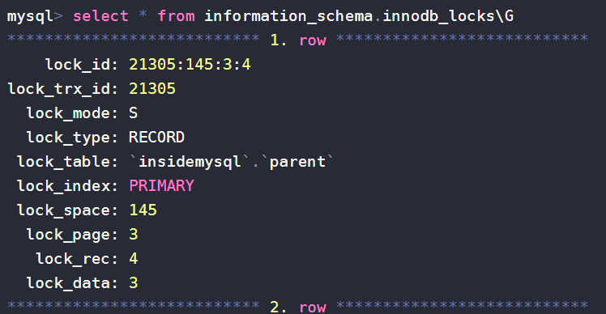
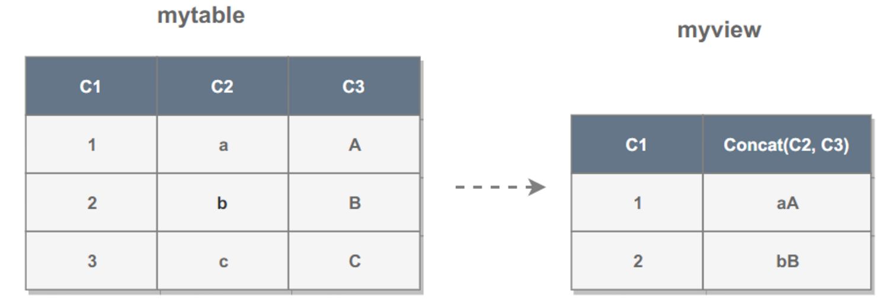
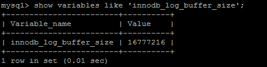
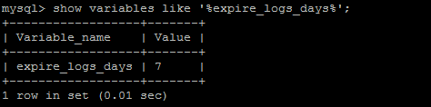
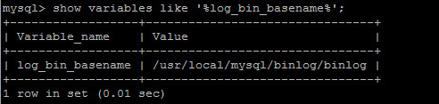
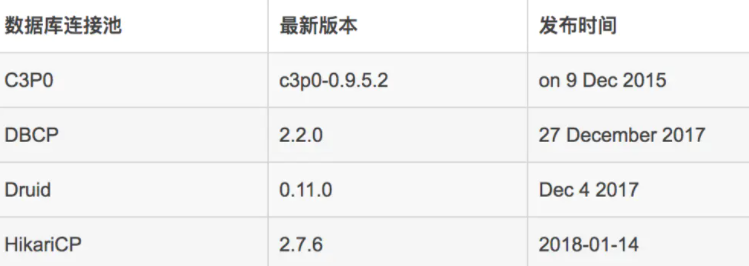

# MySQL
<!-- GFM-TOC -->

* [MySQL](#mysql)
    * [一、索引](#一索引)
        * [B+ Tree 原理](#b-tree-原理)
        * [MySQL 索引](#mysql-索引)
        * [索引优化](#索引优化)
        * [索引的优点](#索引的优点)
        * [索引的使用条件](#索引的使用条件)
    * [二、查询性能优化](#二查询性能优化)
        * [使用 Explain 进行分析](#使用-explain-进行分析)
        * [优化数据访问](#优化数据访问)
        * [重构查询方式](#重构查询方式)
    * [三、存储引擎](#三存储引擎)
        * [InnoDB](#innodb)
        * [MyISAM](#myisam)
        * [比较](#比较)
    * [四、数据类型](#四数据类型)
        * [整型](#整型)
        * [浮点数](#浮点数)
        * [字符串](#字符串)
        * [时间和日期](#时间和日期)
    * [五、切分](#五切分)
        * [水平切分](#水平切分)
        * [垂直切分](#垂直切分)
        * [Sharding 策略](#sharding-策略)
        * [Sharding 存在的问题](#sharding-存在的问题)
    * [六、复制](#六复制)
        * [主从复制](#主从复制)
        * [读写分离](#读写分离)
    * [参考资料](#参考资料)
<!-- GFM-TOC -->

## 一、索引

索引创建和使用：https://blog.csdn.net/moxigandashu/article/details/62426549

优势：①减少了服务器需要扫描的数据量；②帮助服务器避免排序；③将随机IO变为顺序IO。

B+树一个节点有多大16k*n？（一千万条数据，B+树多高？）：https://blog.csdn.net/dl674756321/article/details/102987984

### B+ Tree 原理

#### 1. 数据结构

B Tree 指的是 Balance Tree，也就是**平衡树**。平衡树是一颗**查找树**，并且**所有叶子节点位于同一层**。

**B+ Tree 是基于 B Tree 和叶子节点顺序访问指针进行实现，它具有 B Tree 的平衡性，并且通过顺序访问指针来提高区间查询的性能。**

在 B+ Tree 中，**一个节点中的 key 从左到右非递减排列**，如果某个指针的左右相邻 key 分别是 key<sub>i</sub> 和 key<sub>i+1</sub>，且**不为 null**，则该指针指向节点的所有 key 大于等于 key<sub>i</sub> 且小于等于 key<sub>i+1</sub>。

<div align="center">  </div><br>
#### 2. 操作

进行查找操作时，首先在**根节点进行二分查找**，找到一个 key 所在的指针，然后递归地在指针所指向的节点进行查找。**直到查找到叶子节点**，然后在**叶子节点上进行二分查找**，找出 key 所对应的 data。

插入删除操作会破坏平衡树的平衡性，因此在进行插入删除操作之后，需要对树进行**分裂、合并**、**旋转**等操作来维护平衡性。

#### 3. 与红黑树的比较 

红黑树等平衡树也可以用来实现索引，但是**文件系统及数据库系统**普遍采用 B+ Tree 作为索引结构，这是因为使用 B+ 树访问磁盘数据有更高的性能。 

（一）B+ 树有**更低的树高**

平衡树的**树高** O(h)=O(log<sub>d</sub>N)，其中 d 为每个节点的出度。红黑树的出度为 2，而 B+ Tree 的出度一般都非常大，所以红黑树的树高 h 很明显比 B+ Tree 大非常多。

（二）磁盘访问原理

**操作系统**一般将**内存和磁盘**分割成固定大小的**块**，每一块称为一**页**，**内存与磁盘以页为单位交换数据**。数据库系统将索引的**一个节点的大小设置为页的大小**，使得一次 I/O 就能完全载入一个节点。如果**数据不在同一个磁盘**块上，那么通常需要**移动制动手臂进行寻道**，而制动手臂因为其物理结构导致了移动效率低下，从而增加磁盘数据读取时间。

B+ 树相对于红黑树有**更低的树高**，**进行寻道的次数与树高成正比**，在同一个磁盘块上进行访问只需要很短的**磁盘旋转时间**，所以 B+ 树更适合磁盘数据的读取。

（三）磁盘预读特性

为了减少磁盘 I/O 操作，磁盘往往不是严格按需读取，而是每次都会预读。**预读过程中，磁盘进行顺序读取，顺序读取不需要进行磁盘寻道，并且只需要很短的磁盘旋转时间**，速度会非常快。并且可以利用**预读特性，相邻的节点也能够被预先载入**。 

## 索引存储结构 

#### b树 

（balance tree）和b+树应用在数据库索引，可以认为是m叉的多路平衡查找树，但是从理论上讲，二叉树查找速度和比较次数都是最小的，为什么不用二叉树呢？ 

查询： 

减少IO次数，对于树来说，IO次数就是树的高度，而“矮胖”就是b树的特征之一，**每一层节点的比较会对应一次磁盘IO**，它的每个节点最多包含m个孩子，m称为b树的阶，m的大小取决于磁盘页的大小。 

增加、删除:

范围多路平衡查找树，**一次增加、删除未必导致分裂与合并**，进行自平衡的次数也少。

一个M阶的b树具有如下几个特征：  

1. 定义任意非叶子结点最多只有M个儿子，且M>2；
2. 根结点的儿子数为[2, M]；
3. 除根结点以外的非叶子结点的儿子数为[M/2, M]，向上取整；
4. 非叶子结点的关键字个数=儿子数-1；
5. 所有叶子结点位于同一层；
6. k个关键字把节点拆成k+1段，分别指向k+1个儿子，同时满足查找树的大小关系。

#### b+树

b+树，是b树的一种变体，查询性能更好。m阶的b+树的特征：

1. 有n棵子树的非叶子结点中含有n个关键字（b树是n-1个），这些关键字不保存数据，只用来索引，所有数据都保存在叶子节点（b树是每个关键字都保存数据）。
2. 所有的叶子结点中包含了全部关键字的信息，及指向含这些关键字记录的指针，且叶子结点本身依关键字的大小自小而大顺序链接。
3. 所有的非叶子结点可以看成是索引部分，结点中仅含其子树中的最大（或最小）关键字。
4. 通常在b+树上有两个头指针，一个指向根结点，一个指向关键字最小的叶子结点。
5. 同一个数字会在不同节点中重复出现，根节点的最大元素就是b+树的最大元素。

**B树和B+树的区别**：

1、B+树中只有叶子节点会带有指向记录的指针（ROWID），**一个块中可以容纳更多的索引项**，磁盘页能容纳更多节点元素，更“**矮胖**”，可以降低树的高度；而**B树则所有节点都带有**，在内部节点出现的索引项不会再出现在叶子节点中。

2、B+树中**所有叶子节点都是通过指针连接在一起**，而B树没有，对于范围查找来说，b+树只需遍历叶子节点链表即可，b树却需要重复地**中序遍历**。

3、b+树查询必须查找到叶子节点，b树只要匹配到即可不用管元素位置，因此b+树查找**更稳定**；

**B+树的优点**：

1、内部节点可以存更多索引项

2、叶子节点之间通过指针来连接，范围扫描快速。

**B树的优点**：

对于在**内部节点的数据，可直接得到，不必根据叶子节点来定位。**

### MySQL 索引

索引是在存储引擎层实现的，而不是在服务器层实现的，所以不同存储引擎具有不同的索引类型和实现。 

#### 1. B+Tree 索引 

是**大多数 MySQL 存储引擎的默认索引类型**。

因为不再需要进行全表扫描，只需要对树进行搜索即可，所以查找速度快很多。  

因为 B+ Tree 的有序性，所以除了用于查找，还可以用于排序和分组。 

可以指定多个列作为索引列，多个索引列共同组成键。    

适用于全键值、键值范围和键前缀查找，其中键前缀查找只适用于最左前缀查找。如果不是按照索引列的顺序进行查找，则无法使用索引。

InnoDB 的 B+Tree 索引分为**主索引**和**辅助索引**。**主索引的叶子节点 data 域**记录着**完整的数据记录**，这种索引方式被称为**聚簇索引**。因为无法把数据行存放在两个不同的地方，所以一个表只能有一个聚簇索引。

<div align="center">  </div><br>
**辅助索引的叶子节点的 data 域记录着主键的值**，因此在使用辅助索引进行查找时，需要先查找到主键值，然后再到主索引中进行查找。

<div align="center">  </div><br>
#### 2. 哈希索引

哈希索引能以 O(1) 时间进行查找，但是**失去了有序性**：

- **无法用于排序与分组**；
- 只支持精确查找，无法用于部分查找和**范围查找**。

**InnoDB** 存储引擎有一个特殊的功能叫“**自适应哈希索引**”，当某个索引值被使用的非常频繁时，会在 B+Tree 索引之上再创建一个**哈希索引**，这样就让 B+Tree 索引具有哈希索引的一些优点，比如快速的哈希查找。

#### 3. 全文索引

**MyISAM** 存储引擎支持全文索引，用于**查找文本中的关键词**，而**不是直接比较是否相等**。

查找条件使用 **MATCH AGAINST**，而**不是普通的 WHERE**。

全文索引使用**倒排索引**实现，它记录着**关键词到其所在文档的映射**。

**InnoDB** 存储引擎在 MySQL **5.6.4** 版本中也开始支持全文索引。

#### 4. 空间数据索引

**MyISAM** 存储引擎支持空间数据索引（**R-Tree**），可以用于**地理数据存储**。空间数据索引会从所有维度来索引数据，可以有效地使用任意维度来进行组合查询。

必须使用 GIS 相关的函数来维护数据。

**300w**记录的**7字段左右表**，根据没有索引的列查一条记录，**9秒左右**。创建完索引，**1秒以内**。

## 聚簇索引

**聚簇索引（Clustered Index）就是按照每张表的主键构造一棵B+树**，同时叶子节点中存放的即为整张表的行记录数据。 

举个例子：


《MySQL技术内幕》的作者通过分析工具得到聚簇索引树的大致构造如下： 


#### 聚簇索引树

1、聚簇索引的叶子节点称为**数据页**，每个数据页通过一个双向链表来进行链接，而且数据页按照主键的顺序进行排列。     

2、如图所示，每个数据页上存放的是完整的行记录，而在非数据页的索引页中，存放的仅仅是键值及指向数据页的偏移量，而不是一个完整的行记录。      

#### 创建

1、如果定义了主键，InnoDB会自动使用主键来创建聚簇索引。

2、如果没有定义主键，InnoDB会选择一个唯一的非空索引代替主键。

3、如果没有唯一的非空索引，InnoDB会隐式定义一个主键来作为聚簇索引。

#### 使用 

对于InnoDB表，顺序插入是最快的方式，乱序慢，一般都会定义一个自增的ID列为主键。  

对于InnoDB表，一般定义主键为不可更新，更改耗时，因为将会导致被更新的行移动 。

## 非聚簇索引

**辅助索引**(Secondary Index)， 也叫**非聚簇索引**、**普通索引**。

和聚簇索引相比，**叶子节点中并不包含行记录的全部数据。**

**叶子节点简单记忆为存了当前索引的键值**和主键索引。详细说是除了包含键值以外，每个叶子节点的索引行还包含了一个书签（bookmark），该书签用来告诉InnoDB哪里可以找到与索引相对应的**行数据**。 

##### 区别

聚簇索引的叶**节点就是数据节点**，而非聚簇索引的**叶节点仍然是索引节点，并保留一个链接指向对应数据块**。

**MyISAM的是非聚簇索引**，B+Tree的叶子节点上的data，并不是数据本身，而是数据存放的地址。

**InnoDB使用的是聚簇索引，将主键组织到一棵B+树中，而行数据就储存在叶子节点上**

MySQL **InnoDB一定会建立聚簇索引**，把实际数据行和相关的键值保存在一块，这也决定了一个表只能有一个聚簇索引

- 如果没有创建主键，则会用一个唯一且不为空的索引列做为主键，成为此表的聚簇索引
- 上面二个条件都不满足，InnoDB会自己创建一个虚拟的聚集索引

聚簇索引的         

- **优点**：就是提高数据访问性能。  
- **缺点**：维护索引很昂贵，特别是插入新行或者主键被更新导至要分页(page split)的时候

**聚簇索引和非聚簇索引的区别：叶节点是否存放一整行记录 。**

**插入和删除的区别**

最简单的情况下，插入操作根据索引找到对应的**数据页**，然后通过挪动已有的记录为新数据腾出空间，最后插入数据。如果数据页已满，则需要**拆分数据页**，调整索引指针（且如果表还有**非聚集索引**，还需要更新这些**索引指向新的数据页**）。

而类似于**自增列为聚集索引**的，数据库系统可能并**不拆分数据页**，而只是**简单的新添数据页**。 

## 覆盖索引

覆盖索引（Covering index），只是特定于具体select语录而言的联合索引。而不再需要回表查询啦，就称该联合索引覆盖了这条select语句。 覆盖索引是联合索引之中的更优表现。也就是InnoDB存储引擎支持覆盖索引，即从辅助索引中就可以得到查询的记录，而不需要查询聚簇索引中的记录。 

使用覆盖索引有啥好处？

1、可以减少大量的IO操作

 如果要查询辅助索引中不含有的字段，得先遍历辅助索引，再遍历聚簇索引，而如果要查询的字段值在辅助索引上就有，就不用再查聚簇索引了，这显然会减少IO操作。 

2、 有助于统计 

````sql
CREATE TABLE student (
  id bigint(20) NOT NULL,
  name varchar(255) NOT NULL,
  age varchar(255) NOT NULL,
  school varchar(255) NOT NULL,
  PRIMARY KEY (id)，
  KEY idx_name (name)，
  KEY idx_school_age (school，age)
) ENGINE=InnoDB DEFAULT CHARSET=utf8;
````

例1：

执行： select count(*) from student 

优化器会怎么处理？

遍历聚簇索引和辅助索引都可以统计出结果，但辅助索引要远小于聚簇索引，所以优化器会选择辅助索引来统计。

执行explain命令：  key和Extra显示使用了idx_name这个辅助索引。 


例2：

执行： select *  from student where age   >   10 and age < 15 

因为联合索引idx_school_age的字段顺序是先school再age，按照age做条件查询，结果通常不走索引： 

但是，如果保持条件不变，查询所有字段改为查询条目数： 

执行： select count(*) from student where age   >   10 and age < 15 

优化器会选择这个联合索引： 


## 联合索引

联合索引是指对表上的多个列进行索引。

举个例子：

以下为创建联合索引idx_a_b的示例： 


 联合索引的内部结构： 


1、联合索引也是一棵B+树，其键值数量大于等于2。

2、键值都是排序的，通过叶子节点可以逻辑上顺序的读出所有数据。数据（1,1）（1,2）（2,1）（2,4）（3,1）（3,2）是按照（a，b）先比较a再比较b的顺序排列。

实例分析1：

好处一，方便查询。

基于上面的结构，对于以下查询显然是可以使用（a，b）这个联合索引的：

select * from table where a=xxx and b=xxx ; 

select * from table where a=xxx; 

对于下面的sql是不能使用这个联合索引的，因为叶子节点的b值，1,2,1,4,1,2显然不是排序的。 

select * from table where b=xxx 

实例分析2：

好处二：方便排序。

联合索引的第二个好处是对第二个键值已经做了排序。举个例子： 

````sql
create table buy_log(
    userid int not null,
    buy_date DATE
)ENGINE=InnoDB;

insert into buy_log values(1, '2009-01-01');
insert into buy_log values(2, '2009-02-01');

alter table buy_log add key(userid);
alter table buy_log add key(userid, buy_date);
````

当执行 select * from buy_log where user_id = 2； 时，优化器会选择key(userid)； 

但是当执行:select * from buy_log where user_id = 2 order by buy_date desc;  时，优化器会选择key(userid, buy_date)，因为buy_date是在userid排序的基础上做的排序。 

如果把key（userid,buy_date）删除掉，再执行：  select * from buy_log where user_id = 2 order by buy_date desc;  优化器会选择key（userid），但是对查询出来的结果会进行一次filesort，即按照buy_date重新排下序。所以联合索引的好处在于可以避免filesort排序。 

### 索引优化   

#### 1. 独立的列 

在进行查询时，**索引列不能是表达式的一部分，也不能是函数的参数**，否则无法使用索引。

例如下面的查询不能使用 actor_id 列的索引：

```sql
SELECT actor_id FROM sakila.actor WHERE actor_id + 1 = 5;
```

#### 2. 多列索引

**在需要使用多个列作为条件进行查询时，使用多列索引比使用多个单列索引性能更好**。例如下面的语句中，最好把 actor_id 和 film_id 设置为多列索引。

```sql
SELECT film_id, actor_ id FROM sakila.film_actor
WHERE actor_id = 1 AND film_id = 1;
```

#### 3. 索引列的顺序

**让选择性最强的索引列放在前面。**

**索引的选择性**是指：**不重复的索引值和记录总数的比值。**最大值为 1，此时每个记录都有唯一的索引与其对应。选择性越高，每个记录的区分度越高，查询效率也越高。

例如下面显示的结果中 **customer_id 的选择性比 staff_id 更高，因此最好把 customer_id 列放在多列索引的前面。**

```sql
SELECT COUNT(DISTINCT staff_id)/COUNT(*) AS staff_id_selectivity,
COUNT(DISTINCT customer_id)/COUNT(*) AS customer_id_selectivity,
COUNT(*)
FROM payment;
```

```html
   staff_id_selectivity: 0.0001
customer_id_selectivity: 0.0373
               COUNT(*): 16049
```

#### 4. 前缀索引

**对于 BLOB、TEXT 和 VARCHAR 类型的列，必须使用前缀索引，只索引开始的部分字符。**

**前缀长度的选取需要根据索引选择性来确定。**

前缀索引是一种能使**索引更小**，更快的有效办法。

缺点：

mysql无法使用其前缀索引做**ORDER BY和GROUP BY**，也无法使用前缀索引做**覆盖扫描**。

**使用场景**：

- 字符串列(varchar,char,text等)，需要进行**全字段匹配或者前匹配**。也就是=‘xxx’ 或者 like ‘xxx%'
- **字符串本身可能比较长，而且前几个字符就开始不相同。**比如我们对中国人的姓名使用前缀索引就没啥意义，因为中国人名字都很短，另外对收件地址使用前缀索引也不是很实用，因为一方面收件地址一般都是以XX省开头，也就是说前几个字符都是差不多的，而且收件地址进行检索一般都是like ’%xxx%’，不会用到前匹配。相反对外国人的姓名可以使用前缀索引，因为其字符较长，而且前几个字符的选择性比较高。同样电子邮件也是一个可以使用前缀索引的字段。
- 前一半字符的索引选择性就已经接近于全字段的索引选择性。如果整个字段的长度为20，索引选择性为0.9，而我们对前10个字符建立前缀索引其选择性也只有0.5，那么我们需要**继续加大前缀字符的长度**，但是这个时候前缀索引的优势已经**不明显**，没有太大的建前缀索引的必要了。

参考：

https://www.cnblogs.com/gomysql/p/3628926.html

https://www.cnblogs.com/studyzy/p/4310653.html

#### 5. 覆盖索引

索引包含所有需要查询的字段的值。

具有以下优点：

- **索引通常远小于数据行的大小**，只读取索引能大大减少数据访问量。
- 一些存储引擎（例如 MyISAM）在内存中只缓存索引，而数据依赖于操作系统来缓存。因此，只访问索引可以不使用系统调用（通常比较费时）。
- 对于 InnoDB 引擎，若辅助索引能够覆盖查询，则无需访问主索引。

### 索引的优点

- 大大减少了服务器需要扫描的数据行数。

- 帮助服务器避免进行**排序和分组**，以及**避免创建临时表**（B+Tree 索引是有序的，可以用于 ORDER BY 和 GROUP BY 操作。临时表主要是在排序和分组过程中创建，不需要排序和分组，也就不需要创建临时表）。

- 将**随机 I/O 变为顺序 I/O**（B+Tree **索引是有序**的，会将相邻的数据都存储在一起）。

### 索引的使用条件

- 对于非常小的表、大部分情况下简单的全表扫描比建立索引更高效；
- 对于中到大型的表，索引就非常有效；
- 但是对于特大型的表，建立和维护索引的代价将会随之增长。这种情况下，需要用到一种技术**可以直接区分出需要查询的一组数据**，而不是一条记录一条记录地匹配，例如可以使用**分区技术。**

## Mysql 锁

问题：

**mysql innodb引擎什么时候表锁什么时候行锁？**

**1、InnoDB基于索引的行锁** 

InnoDB行锁是通过**索引**上的索引项来实现的，这一点ＭySQL与Oracle不同，后者是通过在数据中对相应**数据行**加锁来实现的。

**InnoDB**这种行锁实现特点意味者：**只有通过索引条件检索数据，InnoDB才会使用行级锁，否则，InnoDB将使用表锁。**

**在MySQL中，行级锁并不是直接锁记录，而是锁索引。**

**索引分为主键索引和非主键索引两种，如果一条sql语句操作了主键索引，MySQL就会锁定这条主键索引；**

**如果一条语句操作了非主键索引，MySQL会先锁定该非主键索引，再锁定相关的主键索引。** 

在UPDATE、DELETE操作时，MySQL不仅锁定WHERE条件扫描过的所有索引记录，而且会**锁定相邻的键值**，即所谓的next-key locking。

**2、innodb行锁和表锁的情况**

由于InnoDB默认是Row-Level Lock，所以**只有「明确」的指定索引列**，MySQL才会执行Row lock (只锁住被选取的资料例) ，否则MySQL将会执行Table Lock (将整个资料表单给锁住)：

- (明确指定主键，并且有此笔资料，row lock)
  SELECT * FROM products WHERE id='3' FOR UPDATE;
  SELECT * FROM products WHERE id='3' and type=1 FOR UPDATE;
- (明确指定主键，若查无此笔资料，无lock)
  SELECT * FROM products WHERE id='-1' FOR UPDATE;
- **(无主键，table lock)**
  SELECT * FROM products WHERE name='Mouse' FOR UPDATE;
- **(主键不明确，table lock)**
  SELECT * FROM products WHERE id<>'3' FOR UPDATE;
- **(主键不明确，table lock)**
  SELECT * FROM products WHERE id LIKE '3' FOR UPDATE;

**3、有时有索引也会导致表锁的情况**

导致这个的原因第一是sql语句写法问题，没有合理构建和使用索引。
第二个原因是mysql的优化器，使用了索引还不如不用，就会放弃使用行锁，而选择表锁。

4、索引类型对锁类型的影响

主键：众所周知，自带最高效的索引属性

唯一索引：属性值重复率为0，可以作为业务主键

普通索引：属性值重复率大于0，不能作为唯一指定条件

注意：对于普通索引，当“重复率”低时，甚至接近主键或者唯一索引的效果时，依然是行锁；但是如果“重复率”高时，Mysql不会把这个普通索引当做索引，即会造成一个没有索引的SQL，从而形成表锁。

5、锁等待

- 即当一个事务要操作一个资源时，这个资源已经被其它事务先锁定使用，那么后者事务只能等待上一个事务执行完毕释放资源使用权后才能继续操作，而这个等待的过程就是锁等待；
- 如果等待时间过长，超过配置项中的设定的时间，则会报错（锁等待错误）

参考

面试问题之Mysql InnoDB引擎 行锁变表锁：https://www.codenong.com/cs106864142/

mysql innodb引擎什么时候表锁什么时候行锁？：https://blog.csdn.net/Frankltf/article/details/82976493

InnoDB行锁的实现方式：http://www.soolco.com/post/63208_1_1.html

## 死锁案例

https://juejin.cn/post/6844903481833160711#heading-1

**加锁**

如果一条sql语句操作了主键索引，MySQL就会锁定这条主键索引；

如果一条语句操作了非主键索引，MySQL会先锁定该非主键索引，再锁定相关的主键索引。 

死锁例子：

一个表db.tab_test，结构如下： 

id：主键；state：状态；time：时间；索引：idx_1 (state, time)

当“update tab_test set state=1064,time=now() where state=1061 and time < date_sub(now(), INTERVAL 30 minute)”执行时，MySQL会使用idx_1索引，因此首先锁定相关的索引记录，因为idx_1是非主键索引，为执行该语句，MySQL还会锁定主键索引。

假设“update tab_test set state=1067,time=now () where id in (9921180)”几乎同时执行时，本语句首先锁定主键索引，由于需要更新state的值，所以还需要锁定idx_1的某些索引记录。

这样第一条语句锁定了idx_1的记录，等待主键索引，而第二条语句则锁定了主键索引记录，而等待idx_1的记录，这样死锁就产生了。

解决办法

拆分第一条sql，先查出符合条件的主键值，再按照主键更新记录：

select id from tab_test where state=1061 and time < date_sub(now(), INTERVAL 30 minute);

update tab_test state=1064,time=now() where id in(......); 

参考

MySQL死锁及解决方案：https://www.cnblogs.com/uestc2007/p/11978172.html

## **死锁处理**

 MySQL有两种死锁处理方式： 

- 等待，直到超时（innodb_lock_wait_timeout=50s）。
- 发起**死锁检测，主动回滚一条事务**，让其他事务继续执行（innodb_deadlock_detect=on）。**detect**（发现）

**死锁检测**

死锁检测的原理是构建一个**以事务为顶点**、**锁为边的有向图**，判断**有向图**是否**存在环**，存在即有死锁。

检测到死锁之后，**选择插入更新或者删除的行数最少的事务回滚**，基于 INFORMATION_SCHEMA.INNODB_TRX 表中的 trx_weight 字段来判断。 

## 如何避免发生死锁

**收集死锁信息**：

- 利用命令 SHOW ENGINE INNODB STATUS，查看死锁原因。

- 调试阶段开启 innodb_print_all_deadlocks，**收集所有死锁日志。**

select * from information_schema.innodb_lock 



**减少死锁：**

- 保证没有长事务，**减少事务的长度。**
- 操作完之后立即提交事务，特别是在交互式命令行中。
- 如果在用 (SELECT … FOR UPDATE or SELECT … LOCK IN SHARE MODE)，尝试降低隔离级别。
- 最好不要用 (SELECT … FOR UPDATE or SELECT … LOCK IN SHARE MODE)。
- 如果上述都无法解决问题，那么**尝试使用 lock tables t1, t2, t3 锁多张表**

参考

技术池：https://www.jishuchi.com/read/mysql-interview/2824

## text 类型拆表

MySQL 表中有大字段X(例如：text类型)，且字段X不会经常更新，以读为主，请问您是选择拆成子表，还是继续放一起?写出您这样选择的理由。

**拆带来的问题：**连接消耗 + 存储拆分空间；**不拆可能带来的问题**：查询性能；

如果能容忍拆分带来的空间问题，拆的话最好和经常要查询的表的主键在**物理结构上放置在一起(分区) 顺序IO**,减少连接消耗，最后这是一个**文本列再加上一个全文索引来尽量抵消连接消耗**

如果能容忍不拆分带来的查询性能损失的话，上面的方案在某个极致条件下查询肯定会出现问题，建议拆。

## 二、查询性能优化

### 使用 Explain 进行分析

Explain 用来分析 SELECT 查询语句，开发人员可以通过分析 Explain 结果来优化查询语句。

比较重要的字段有：

- **select_type : 查询类型，有简单查询、联合查询、子查询等**
- **key : 使用的索引**
- **rows : 扫描的行数**

### 优化数据访问

#### 1. 减少请求的数据量

- 只返回必要的列：最好不要使用 SELECT * 语句。
- 只返回必要的行：使用 LIMIT 语句来限制返回的数据。
- 缓存重复查询的数据：使用缓存可以避免在数据库中进行查询，特别在要查询的数据经常被重复查询时，缓存带来的查询性能提升将会是非常明显的。

#### 2. 减少服务器端扫描的行数

最有效的方式是使用索引来覆盖查询。

### 重构查询方式

#### 1. 切分大查询

一个大查询如果一次性执行的话，可能一次**锁住很多数据**、占满整个事务日志、耗尽系统资源、阻塞很多小的但重要的查询。

```sql
DELETE FROM messages WHERE create < DATE_SUB(NOW(), INTERVAL 3 MONTH);
```

```sql
rows_affected = 0
do {
    rows_affected = do_query(
    "DELETE FROM messages WHERE create  < DATE_SUB(NOW(), INTERVAL 3 MONTH) LIMIT 10000")
} while rows_affected > 0
```

#### 2. 分解大连接查询

**将一个大连接查询分解成对每一个表进行一次单表查询，然后在应用程序中进行关联**，这样做的好处有：

- **让缓存更高效**。**对于连接查询，如果其中一个表发生变化，那么整个查询缓存就无法使用。而分解后的多个查询，即使其中一个表发生变化，对其它表的查询缓存依然可以使用。**
- 分解成多个单表查询，这些单表查询的**缓存结果**更可能被其它查询使用到，从而减少冗余记录的查询。
- **减少锁竞争**；
- 在**应用层进行连接**，可以更容易**对数据库进行拆分**，从而**更容易做到高性能和可伸缩。**
- 查询本身效率也可能会有所提升。例如下面的例子中，使用 **IN() 代替连接查询**，可以让 MySQL **按照 ID 顺序进行查询**，这可能比随机的连接要更高效。

```sql
SELECT * FROM tag
JOIN tag_post ON tag_post.tag_id=tag.id
JOIN post ON tag_post.post_id=post.id
WHERE tag.tag='mysql';
```

```sql
SELECT * FROM tag WHERE tag='mysql';
SELECT * FROM tag_post WHERE tag_id=1234;
SELECT * FROM post WHERE post.id IN (123,456,567,9098,8904);
```

## 三、存储引擎

### InnoDB

是 MySQL 默认的事务型存储引擎，只有在需要它不支持的特性时，才考虑使用其它存储引擎。

实现了四个标准的隔离级别，默认级别是可重复读（REPEATABLE READ）。**在可重复读隔离级别下，通过多版本并发控制（MVCC）+ Next-Key Locking 防止幻影读。**

**主索引是聚簇索引，在索引中保存了数据，从而避免直接读取磁盘，因此对查询性能有很大的提升。**

内部做了很多**优化**，包括**从磁盘读取数据时采用的可预测性读**、能够加快读操作并且**自动创建的自适应哈希索引**、能够**加速插入操作的插入缓冲区**等。

支持真正的**在线热备份**。其它存储引擎不支持在线热备份，要获取一致性视图需要**停止对所有表的写入**，而在读写混合场景中，停止写入可能也意味着停止读取。

### MyISAM

设计简单，**数据以紧密格式存储**。对于只读数据，或者**表比较小**、可以容忍修复操作，则依然可以使用它。

提供了大量的特性，包括**压缩表、空间数据索引**等。

**不支持事务。**

**不支持行级锁，只能对整张表加锁，读取时会对需要读到的所有表加共享锁，写入时则对表加排它锁。**但在表有读取操作的同时，也可以往表中插入新的记录，这被称为并发插入（CONCURRENT INSERT）。

可以手工或者自动执行检查和修复操作，但是和事务恢复以及崩溃恢复不同，可能导致一些**数据丢失**，而且**修复操作是非常慢**的。

**如果指定了 DELAY_KEY_WRITE 选项**，在每次修改执行完成时，**不会立即将修改的索引数据写入磁盘，而是会写到内存中的键缓冲区，只有在清理键缓冲区或者关闭表的时候才会将对应的索引块写入磁盘**。这种方式可以极大的**提升写入性能**，但是在数据库或者主机**崩溃**时会造成索引损坏，需要**执行修复**操作。

## MyISAM和InnoDB区别

### 比较

- 事务：InnoDB 是事务型的，可以使用 Commit 和 Rollback 语句。
- 并发：MyISAM 只支持表级锁，而 InnoDB 还支持行级锁。
- 外键：InnoDB 支持外键。
- 备份：InnoDB 支持在线热备份。
- 崩溃恢复：**MyISAM**  不支持崩溃后的安全恢复 ，崩溃后发生损坏的概率比 InnoDB 高很多，而且**恢复的速度也更慢**。
- 其它特性：MyISAM 支持**压缩表和空间数据索引**。

MyISAM， MySQL 5.1及之前版本的默认引擎 

在表有读取查询的同时，MyISAM支持往表中插入新纪录。

支持延迟更新索引，极大提升写入性能 

对于不会进行修改的表，支持压缩表，极大减少磁盘空间占用 

## myisam为什么适合读？

InnoDB的MVCC 在查询时候维护费时，比较。

数据块，INNODB 要缓存，MYISAM 只缓存索引块，  这中间还有换进换出的减少；

innodb 寻址要映射到块，再到行，MYISAM 记录的直接是文件的 OFFSET，定位比 INNODB 要快

## 四、数据类型

### 整型

**TINYINT, SMALLINT, MEDIUMINT, INT, BIGINT** 分别使用 8, 16, 24, 32, 64 位存储空间，一般情况下越小的列越好。

INT(11) 中的数字只是规定了交互工具显示字符的个数，**对于存储和计算来说是没有意义的**。

### 浮点数

FLOAT 和 DOUBLE 为浮点类型，DECIMAL 为高精度小数类型。CPU 原生支持浮点运算，但是不支持 DECIMAl 类型的计算，因此 DECIMAL 的计算比浮点类型需要更高的代价。

FLOAT、DOUBLE 和 DECIMAL 都可以指定**列宽**，例如 **DECIMAL(18, 9) 表示总共 18 位，取 9 位存储小数部分**，剩下 9 位存储整数部分。

### 字符串

主要有 CHAR 和 VARCHAR 两种类型，一种是定长的，一种是变长的。

VARCHAR 这种变长类型能够**节省空间**，因为只需要存储必要的内容。但是在执行 UPDATE 时可能会使行变得比原来长，**当超出一个页所能容纳的大小时，就要执行额外的操作**。MyISAM 会将行拆成不同的片段存储，而 InnoDB 则需要**分裂页**来使行放进页内。

在进行**存储和检索**时，会保留 VARCHAR **末尾的空格**，而会删除 CHAR 末尾的空格。

### 时间和日期

MySQL 提供了两种相似的日期时间类型：DATETIME 和 TIMESTAMP。

#### 1. DATETIME

能够保存从 1000 年到 9999 年的日期和时间，精度为秒，使用 **8 字节**的存储空间。

它**与时区无关**。

默认情况下，MySQL 以一种可排序的、无歧义的格式显示 DATETIME 值，例如“2008-01-16 22\<span\>:\</span\>37\<span\>:\</span\>08”，这是 ANSI 标准定义的日期和时间表示方法。

#### 2. TIMESTAMP

**和 UNIX 时间戳相同**，保存从 1970 年 1 月 1 日午夜（格林威治时间）以来的秒数，使用 **4 个字节**，只能表示从 1970 年到 **2038** 年。

它**和时区有关**，也就是说一个时间戳在不同的时区所代表的具体时间是不同的。

MySQL 提供了 FROM_UNIXTIME() 函数把 UNIX 时间戳转换为日期，并提供了 UNIX_TIMESTAMP() 函数把日期转换为 UNIX 时间戳。

默认情况下，如果插入时没有指定 TIMESTAMP 列的值，会将这个值设置为当前时间。

应该尽量使用 **TIMESTAMP**，因为它比 DATETIME **空间效率**更高。

## 五、切分

### 水平切分

水平切分又称为 Sharding，它是将同一个表中的记录拆分到多个结构相同的表中。

当一个表的数据不断增多时，Sharding 是必然的选择，它可以**将数据分布到集群的不同节点上**，从而缓存单个数据库的压力。

<div align="center">  </div><br>
### 垂直切分

垂直切分是将一张表按列切分成多个表，通常是按照列的**关系密集程度进行切分**，也可以利用垂直切分**将经常被使用的列和不经常被使用的列**切分到不同的表中。

在数据库的层面使用垂直切分将按数据库中表的密集程度部署到不同的库中，例如将原来的电商数据库垂直切分成商品数据库、用户数据库等。

<div align="center">  </div><br>
### Sharding 策略

- **哈希**取模：hash(key) % N；
- 范围：可以是 **ID 范围**也可以是**时间范围**；
- **映射**表：使用单独的一个数据库来存储映射关系。

### Sharding 存在的问题

#### 1. 事务问题

使用**分布式事务**来解决，比如 XA 接口。

#### 2. 连接

可以**将原来的连接分解成多个单表查询**，然后在用户程序中进行连接。

#### 3. ID 唯一性

- **使用全局唯一 ID（GUID）**
- **为每个分片指定一个 ID 范围**
- 分布式 ID 生成器 (如 Twitter 的 Snowflake 算法)

## 六、复制

### 主从复制

主要涉及三个线程：**binlog 线程**、**I/O 线**程和 **SQL 线程**。

-   **binlog 线程**  ：负责将主服务器上的数据更改**写入二进制日志**（Binary log）中。
-   **I/O 线程**  ：负责从主服务器上**读取二进制日志**，并写入从服务器的中继日志（Relay log）。
-   **SQL 线程**  ：负责读取**中继日志**，解析出主服务器已经执行的数据更改并在从服务器中**重放**（Replay）。

<div align="center">  </div><br>
**主从一致性校验**

主从一致性校验有多种工具，例如**checksum**、**mysqldiff**、pt-table-checksum等 

### 读写分离

主服务器处理写操作以及实时性要求比较高的读操作，而从服务器处理读操作。

读写分离能提高性能的原因在于：

- 主从服务器负责各自的读和写，极大程度**缓解了锁的争用**；
- 从服务器可以使用 MyISAM，**提升查询性能**以及节约系统开销；
- 增加冗余，提**高可用性**。

读写分离常用代理方式来实现，代理服务器接收应用层传来的读写请求，然后决定转发到哪个服务器。

<div align="center">  </div><br>
## 七、大表优化与分库分表

[Mysql 大表优化](https://mp.weixin.qq.com/s/BMQC2oJlhLoeBDtveXgHpw)

[数据库分库分表那些事](https://www.sohu.com/a/276591312_505779)

## 八、视图

**1、是什么**

视图是虚拟的表，本身不包含数据，数据都存储在原始表中。

**2、创建视图**

```sql
CREATE VIEW myview AS
SELECT C1, Concat(C2, C3)
FROM mytable
WHERE C1 <= 2;
```




**3、有什么用**

- 简化复杂的查询，比如复杂的连接查询；
- 只使用实际表的一部分数据；
- 通过只给用户访问视图的权限，保证数据的安全性；

**4、何时可以更新**

**因为视图不存储数据，所以更新视图需要去更新原始表。如果视图定义只依赖于一个原始表，就很容易进行更新操作。但如果视图定义中有以下操作，那么就不能进行视图的更新：**

- 分组查询
- 连接查询
- 子查询
- Union
- 聚集函数
- DISTINCT
- 计算字段

## 分页原理

limit n,m翻页语法是需要**沿着索引逐项遍历抵达**offset n的，因此**n越大花费的时间越大**。

一般不要用IN，因为IN的执行计划超乎想象的愚蠢，它会拿父查询的每一条记录去执行一次**子查询**，而不是先将子查询生成**临时表**，再与父查询进行匹配。 

## JDCB 连接数据库六步走

1、加载驱动			    Class.forName("oracle.jdbc.driver.OracleDriver"); 

2、获取数据库连接 	DriverManager.getConnection(url,user,password); 

​	+其他三个参数 url =  "jdbc:oracle:thin:@localhost:1521:XE"; 、账号、密码

3、创建statement	 conn.prepareStatement(sql); 

4、执行SQL语句	 	 ResultSet rs  = pst.executeQuery(); 

5、获取结果集			 while (rs.next()) 

6、释放资源（关闭statement和连接） pst.close();  conn.close(); 

**PreparedStatement特点**

1、PreparedStatement能够尽最大可能提高性能。
2、PreparedStatement极大的提高了安全性（防止SQL注入）。 

参考

https://blog.csdn.net/xiaojie119120/article/details/73123759

## 日志

MySQL中有六种日志文件，分别是：

重做日志（redo log）、回滚日志（undo log）。

二进制日志（binlog）、错误日志（errorlog）、慢查询日志（slow query log）、一般查询日志（general log），中继日志（relay log）。

**其中redo log用于保证事务持久性；undo log则是事务原子性和隔离性实现的基础。是InnoDB存储引擎独有的** 

二进制日志也与事务操作有一定的关系。

#### **重做日志（redo log）**

作用：
确保事务的**持久性**。防止在发生故障的时间点，尚有脏页未写入磁盘，**在重启mysql服务的时候，根据redo log进行重做，从而达到事务的持久性这一特性。**

内容：
**物理格式的日志**，数据。

什么时候产生：
**事务开始**之后就产生redo log，redo log的落盘并不是随着事务的提交才写入的，而是**在事务的执行过程中，便开始写入redo log文件中**。

什么时候释放：
当对应事务的**脏页写入到磁盘之后**，redo log的使命也就完成了，重做日志占用的空间就**可以**重用（**被覆盖**）。

对应的物理文件：
　　**默认情况下**，对应的物理文件位于**数据库的data目录下的ib_logfile1&ib_logfile2**
　　innodb_log_group_home_dir 指定日志文件组所在的路径，默认./ ，表示在数据库的数据目录下。
　　innodb_log_files_in_group 指定重做日志文件组中文件的数量，默认2
　　关于文件的大小和数量，由一下两个参数配置
　　innodb_log_file_size **重做日志文件的大小。**
　　innodb_mirrored_log_groups 指定了日志镜像文件组的数量，默认1
重做日志的写入：
前面说了是在事物开始之后逐步写盘的。不一定是事务提交才写入重做日志缓存，原因就是，**重做日志有一个缓存区Innodb_log_buffer**，Innodb_log_buffer的**默认大小为8M**(这里设置的16M)

　　

innodb_log_buffer刷新到磁盘有3种方式
1，Master Thread **每秒一次执行刷新**Innodb_log_buffer到重做日志文件,是Master Thread线程的**定时任务**。
2，即使某个事务还没有提交，每个**事务提交时**会将重做日志刷新到重做日志文件。
3，**当重做日志缓存可用空间 少于一半时**，重做日志缓存被刷新到重做日志文件

#### **回滚日志（undo log）**

作用：
1、保存了事务发生之前的数据的一个版本，可以用于**回滚**。

2、可以提供多版本并发控制下的读（**MVCC**），也即非锁定读。

内容：
**逻辑格式**的日志，sql语句。

什么时候产生：
**事务开始之前，将当前的版本生成undo log**，undo 也会产生 redo 来保证undo log的可靠性。

什么时候释放：
**当事务提交之后，undo log并不能立马被删除，而是放入待清理的链表，由purge线程判断是否由其他事务在使用undo段中表的上一个事务之前的版本信息**，决定是否可以清理undo log的日志空间。

对应的物理文件：
MySQL5.6之前，**undo表**空间位于**共享表**空间的回滚段中，共享表空间的默认的名称是ibdata，位于数据文件目录中。MySQL5.6之后，undo表空间可以配置成**独立的文件**。

其他：
**undo是在事务开始之前保存的被修改数据的一个版本**，产生undo日志的时候，同样会**伴随类似于保护事务持久化机制的redolog的产生。**
**默认**情况下undo文件是保持在**共享表**空间的，也即**ibdatafile**文件中，当数据库中发生一些大的事务性操作的时候，要生成大量的undo信息，默认情况下，也就是undo 日志使用共享表空间的时候，被“撑大”的共享表空间是不会也**不能自动收缩的**。因此，**mysql5.7之后的“独立undo 表空间”的配置**就显得很有必要了。

#### **二进制日志（binlog）**

作用：
　　1，用于复制，在**主从复制**中，从库利用主库上的binlog进行重播，实现主从同步。
　　2，用于数据库的**基于时间点的还原**。
内容：
**逻辑格式的日志**，可以简单认为就是执行过的事务中的**sql语句**。但又不完全是sql语句这么简单，而是包括了执行的sql语句（增删改）**反向的信息**，也就意味着delete对应着delete本身和其反向的insert；update对应着update执行前后的版本的信息；insert对应着delete和insert本身的信息。在使用mysqlbinlog解析binlog之后一些都会真相大白。

什么时候产生：
**事务提交的时候，一次性将事务中的sql语句（一个事物可能对应多个sql语句）按照一定的格式记录到binlog中。**
**在开启了bin_log的情况下，对于较大事务的提交，可能会变得比较慢一些。这是因为binlog是在事务提交的时候一次性写入的造成的。**

什么时候释放：
binlog的默认是**保持时间**由参数expire_logs_days配置，也就是说对于非活动的日志文件，在生成时间超过expire_logs_days配置的天数之后，**过期会被自动删除。**
　　

对应的物理文件：
配置文件的路径为log_bin_basename，**binlog日志文件按照指定大小**，当日志文件达到指定的最大的大小之后，进行**滚动更新，生成新的日志文件。**

　

其他：
1，作用不同：二进制日志的作用之一是还原数据库的，这与redo log很类似。redo log是保证**事务的持久性**的，是**事务层**面的，binlog作为还原的功能，是**数据库层面**的。
2，内容不同：redo log是物理日志，是数据页面的修改之后的物理记录，binlog是逻辑日志，可以简单认为记录的就是sql语句
3，另外，两者日志**产生的时间**，可以**释放的时间**，在可释放的情况下**清理机制**，都是完全不同的。
4，恢复数据时候的效率，**基于物理日志（数据）的redo log恢复数据的效率要高于语句逻辑日志（sql）的binlog**

关于事务提交时，redo log和binlog的写入顺序，为了保证主从复制时候的主从一致，MySQL通过**两阶段提交**过程来完成事务的一致性的，也即redo log和binlog的一致性的，理论上是**先写redo log**，再写binlog，两个日志都提交成功（刷入磁盘），事务才算真正的完成。
　　参考：http://www.cnblogs.com/hustcat/p/3577584.html

参考：

[MySQL中的重做日志（redo log），回滚日志（undo log），以及二进制日志（binlog）](https://www.cnblogs.com/wy123/p/8365234.html)

#### 慢查询日志

指运行时间超过long_query_time值的SQL，则会被记录到慢查询日志中。long_query_time的默认值为10，意思是运行10S以上的语句。默认情况下，Mysql数据库并不启动慢查询日志，需要我们手动来设置这个参数。

一般不建议启动该参数，因为**性能影响**。支持将日志记录写入文件，也支持将日志记录写入数据库表。 

#### **日志分析工具**：mysql dump slow

得到返回记录集最多的10个SQL。

mysqldumpslow -s r -t 10 /database/mysql/mysql06_slow.log

得到访问次数最多的10个SQL

mysqldumpslow -s c -t 10 /database/mysql/mysql06_slow.log

得到按照时间排序的前10条里面含有左连接的查询语句。

mysqldumpslow -s t -t 10 -g “left join” /database/mysql/mysql06_slow.log

另外建议在使用这些命令时结合 | 和more 使用 ，否则有可能出现刷屏的情况。

mysqldumpslow -s r -t 20 /mysqldata/mysql/mysql06-slow.log | more

参考：https://www.cnblogs.com/kerrycode/p/5593204.html

## MySQL 监控

MySQL 你是如何监控你们的数据库的？你们的慢日志都是怎么查询的？

监控的工具有很多，例如zabbix，lepus，我这里用的是**lepus**

# 事务

**脏读**：指读到了其他事务未提交的数据

**不可重复读**：读到了其他事务已提交的数据

不可重复读与**幻读**都是读到其他事务已提交的数据，但是它们针对点不同

不可重复读：update
幻读：delete，insert

# 隔离级别

未提交读 （READ UNCOMMITTED） ：不允许同时进行写操作，但允许其他事务读此行数据 

已提交读（READ COMMITTED）：允许其他事务继续访问该行数据，但是未提交的写事务将会禁止其他事务访问该行，会对该写锁一直保持直到到事务提交. 

可重复读（REPEATABLE READS）： InnoDb的默认隔离级别 

可串行化（Serializable ）：最高的隔离级别，它求在选定对象上的读锁和写锁保持直到事务结束后才能释放，所以能防住上诉所有问题，但因为是串行化的，所以效率较低. 

## MVCC

MVCC：多版本并发控制。MySQL、ORACLE、PostgreSQL等都是使用了以乐观锁为理论基础的MVCC（多版本并发控制）来避免不可重复读和幻读。MVCC的实现没有固定的规范，每个数据库都会有不同的实现方式，这里讨论的是**InnoDB**的MVCC。 

在InnoDB中，会在每行数据后添加两个额外的隐藏的值来实现MVCC，这两个值一个记录这行数据何时被创建，另外一个记录这行数据何时过期（或者被删除）。在实际操作中，存储的并不是时间，而是事务的版本号，每开启一个新事务，**事务的版本号**就会递增。 在可重读Repeatable reads事务隔离级别下：

- SELECT时，读取创建版本号<=当前事务版本号，删除版本号为空或  >  当前事务版本号。
- INSERT时，保存当前事务版本号为行的创建版本号
- DELETE时，保存当前事务版本号为行的删除版本号
- UPDATE时，插入一条新纪录，保存当前事务版本号为行创建版本号，同时保存当前事务版本号到原来删除的行

## Next-Key锁


B+树的所有数据存储在叶子节点上,当有一个新的叫秦寿生的数据进来,一定是排在在这条id=34的数据前面或者后面的,我们如果对前后这个范围进行加锁了,那当然新的秦寿生就插不进来了.

那如果有一个新的范统要插进行呢? 因为范统的前后并没有被锁住,是能成功插入的,这样就极大地提高了数据库的并发能力.


**InnoDB的行锁锁定的是索引**，而不是记录本身，这一点也需要有清晰的认识。故某索引相同的记录都会被加锁，会造成索引竞争，这就需要我们严格设计业务sql，尽可能的使用主键或唯一索引对记录加锁。

索引映射的记录如果存在，加行锁，如果不存在，则会加 next-key lock / gap 锁 / 间隙锁，故InnoDB可以实现事务对某记录的预先占用，如果记录存在，它就是本事务的，如果记录不存在，那它也将是本事务的，只要本是无还在，其他事务就别想占有它。 

参考：

未：[MySQL-InnoDB-MVCC 多版本并发控制](https://segmentfault.com/a/1190000012650596)

### 快照读

我们平时只用使用**select**就是快照读,这样可以减少加锁所带来的开销.

````
select * from table ....
````

### 当前读

对于会对数据修改的操作(update、insert、delete)都是采用当前读的模式。

在执行这几个操作时会**读取最新的记录**，即使是别的事务提交的数据也可以查询到。假设要update一条记录，但是在另一个事务中已经delete掉这条数据并且commit了，如果update就会产生冲突，所以在update的时候需要知道最新的数据。读取的是最新的数据，需要加锁。以下第一个语句需要加共享锁，其它都需要加排它锁。

````
select * from table where ? lock in share mode; 
select * from table where ? for update; 
insert; 
update; 
delete;
````

为什么说可重复读防不住幻读？

RR 级别作为 mysql 事务默认隔离级别，是事务安全与性能的折中，可能也符合二八定律（20%的事务存在幻读的可能，80%的事务没有幻读的风险），我们在正确认识幻读后，便可以根据场景灵活的防止幻读的发生。 

**RR级别幻读例子**：

1、a事务先select，b事务insert确实会加一个gap锁，但是如果b事务commit，这个gap锁就会释放（释放后a事务可以随意操作）
2、a事务再select出来的结果在MVCC下还和第一次select一样
3、接着a事务不加条件地update，这个update会作用在所有行上（包括b事务新加的）
4、a事务再次select就会出现b事务中的新行，并且这个新行已经被update修改了

Mysql官方给的幻读解释是：只要在一个事务中，第二次select多出了row就算幻读， 所以这个场景下，算出现幻读了。


# 索引失效

##### 最左匹配原则

原因：

对于B+树中的联合索引，**每级索引都是排好序的**。  B+ 树会优先比较最左边来确定下一步的指针所搜方向。

如果索引了多列，要遵守最左前缀法则。指的是查询从索引的最左前列开始，并且不跳过索引中的列。

**案例：**

##### 1、**违反最左前缀法则**

对a、b、c列建立联合索引，**where里是b and c 不走、where里是b 不走。**

而where里是a、c 的话走只 a 的那一段索引长度。

**而where里是=a、>b、=c 的话走只 a和b 的那一段索引长度，c的就不走了。就是范围后边的索引不走**

##### 2、运算操作

不要在索引列上进行**运算操作**，索引将失。

比如 where substring(a, 3 , 2 ) ='索引'

##### 3、**字符串不加单引号**

造成索引失效。没有对字符串类型的值加单引号，MySQL的查询优化器，会自动的进行类型转换，造成索引失效。

##### 4、用**or分**割开的条件

如果or前的条件中的列有索引，而后面的列中没有索引，那么涉及的索引都不会被用到。

比如：**a or b	a有索引，b没有建索引，不加其他sql关键字的话sql整体不走索引。**

##### 5、**模糊查询**

以%开头的Like模糊查询，索引失效。

这里说的都是 查询的 多字段，非覆盖索引查询。

如果仅仅是尾部模糊匹配，索引不会失效（开头%）。如果是头部模糊匹配（%开头），索引失效。

解决：

使用**覆盖索引查询**，随便模糊都走索引。

##### 6、**in 走索引， not in 索引失效**。

##### 7、null

索引是可以走的，官方也是这么说的。

**is NULL ， is NOT NULL 有时索引失效，看评估。**

##### 8、评估

如果MySQL**评估**使用索引比全表更慢，则不使用索引。看列值的区别度大不大。

参考

这篇也不错，联合索引ABC的几种索引利用情况：https://blog.csdn.net/houmenghu/article/details/109580196

# SQL优化

好文，未看完： [(2条消息) MySQL优化---常见的性能瓶颈以及Explain详解_sout-CSDN博客_mysql性能瓶颈](https://blog.csdn.net/m2606707610/article/details/103671315) 

##### Explain 结果含义

type：显示的是访问类型:

system > **const** > **eq_ref** > **ref** > fulltext > ref_or_null > index_merge > unique_subquery  > index_subquery > **range** > **index** > ALL

**Extra** 含义：

using index：使用**覆盖索引**的时候就会出现

using where：在查找使用**索引**的情况下，需要**回表**去查询所需的数据

using index condition：查找使用了索引，但是需要回表查询数据

using index、using where：查找使用了索引，但是需要的数据都在索引列中能找到，所以不需要回表查询数据


##### 插入

MySQL一条语句如何写？插入1000条？

1、插入语句常用写法1：插入一条的SQL语句

INSERT INTO 

items(name,city,price,number,picture)  

VALUES

('耐克运动鞋','广州',500,1000,'003.jpg');

2、插入语句常用写法2：插入多条的SQL语句，两者都是建立一个连接。

INSERT INTO 

items(name,city,price,number,picture) 

VALUES

('耐克运动鞋','广州',500,1000,'003.jpg'),

('耐克运动鞋2','广州2',500,1000,'002.jpg');

3、其他优化

- 对于InnoDB，按照**主键顺序插入，因为InnoDB类型的表是按照主键的顺序保存。**

- **关闭唯一性校验**

- **手动提交事务**

##### 排序

所有**不是通过索引直接返回排序结果的排序都叫 FileSort 排序。**

通过有序索引顺序扫描直接返回有序数据为 **using index**，不需要额外排序，操作效率高。这里说的是explain结果中的 **Extra 列**。

总结：

1、通过加索引，where 条件和Order by 使用相同的索引，并且Order By 的顺序和索引顺序相同（多字段排序也要最左前缀的意思）。

**Order by 的字段都是升序，或者都是降序。否则肯定需要额外的操作，这样就会出现FileSort。**

2、**索引优化不掉的FileSort，可以适当提高 sort_buffer_size 和 max_length_for_sort_data 系统变量，来增大排序区的大小，提高排序的效率。或者视情况提示sql直接FileSort 不再先内存排序再转FileSort 。**

##### 优化 group by

不需要排序的 order by null 禁止排序。需要排序的视情况加索引。

##### 优化子查询

多数情况下，子查询是可以被更高效的连接（JOIN）替代，是因为MySQL不需要在内存中创建临时表来完成这个逻辑上需要两个步骤的查询工作。少了步骤，而且explain中的Extra列也会是NULL或者其他更好的情况。

##### 优化OR条件

1、OR之间的**每个条件列都必须用到索引，而且不能使用到复合索引**；如果没有索引，则应该考虑增加索引。

2、SQL改写：

建议使用 union 替换 or，UNION 要优于 OR 。

**UNION 语句的 type 值为 ref，OR 语句的 type 值为 range，可以看到这是一个很明显的差距**

**UNION 语句的 ref 值为 const**，OR 语句的 type 值为 null，const 表示是常量值引用。

##### 优化分页查询

利用索引上完成排序分页操作，最后根据主键关联回原表查询所需要的其他列内容。

SELECT * 

FROM student AS stu ,

​		  (SELECT id FROM student order by id limit 2000000,10)  AS a 

where a.id =stu.id

##### SQL提示

##### 1、IGNORE INDEX

如果用户只是单纯的想让MySQL忽略一个或者多个索引，则可以使用 ignore index

select*fromtb_sellerignoreindex(idx_seller_name)wherename='小米科技';


##### 2、FORCE INDEX

为强制MySQL使用一个特定的索引，可在查询中使用 force index 

SELECT *  FROM student AS stu force index  (idx_a_b)  where ....


##### 3、USE INDEX

在查询语句中表名的后面，添加 use index 来提供希望MySQL去参考的索引列表，就可以让MySQL不再考虑其他可用的索引，适用于索引有多种选择的情况。

## in 和 exists 的用法和区别

mysql 中的 **in 语句是把外表和内表作 hash 连接**，而 **exists 语句是对外表作 loop 循环**，每次 loop 循环再对内表进行查询。一直大家都认为 exists 比 in 语句的效率要高，这种说法其实是不准确的。这个是要区分环境的。

如果查询的两个表大小相当，那么用 in 和 exists 差别不大。
**如果两个表中一个较小，一个是大表，则子查询表大的用 exists，子查询表小的用 in。**


**not in 和 not exists： 如果查询语句使用了 not in，那么内外表都进行全表扫描，没有用到索引；**

**而 not extsts 的子查询依然能用到表上的索引。所以无论那个表大，用 not exists 都比 not in 要快。**

参考：

[精选 36 道 SQL 练习题解析 from（原 50 道 SQL 练习题）](https://blog.csdn.net/artificial_idiots/article/details/106420397)

## Union 和 Union ALL的区别

- 如果使用 UNION ALL，不会合并重复的记录行，二Union相当于自带去重。
- 效率 UNION 高于 UNION ALL

## count()

使用count（列名）当某列出现null值的时候，count（*）仍然会计算，但是count(列名)不会。 

## avg()包含null的计算么？

实际avg()就是sum(comm) /count(comm) 

sum遇见null当0算，count(comm) 不算为null的行。

## having 和 where

使用having字句对分组后的结果进行筛选，语法和where差不多，having + 条件表达式。

group by 字句也和where条件语句结合在一起使用。当结合在一起时，where在前，group by 在后。即先对select xx from xx 的记录集合用 where 进行筛选，然后再使用 group by 对筛选后的结果进行分组 使用having字句对分组后的结果进行筛选。

需要注意having和where的用法区别：

1、having只能用在group by之后，对分组后的结果进行筛选(即使用having的前提条件是分组)。

2、where肯定在group by 之前，即也在having之前。

3、where后的条件表达式里不允许使用聚合函数（count(),sum(),avg(),max(),min()），而having可以。

4、where不能和聚合函数一起使用，以及where不能对表中没有的新生生成列进行过滤，因为select语句执行在where之后。 但是可以通过处理嵌套查询来弥补处理。

当一个查询语句同时出现了where,group by,having,order by的时候，执行顺序和编写顺序是：

- 执行where xx对全表数据做筛选，返回第1个结果集。

- 针对第1个结果集使用group by分组，返回第2个结果集。

- 针对第2个结果集中的每1组数据执行select xx，有几组就执行几次，返回第3个结果集。

- 针对第3个结集执行having xx进行筛选，返回第4个结果集。

- 针对第4个结果集排序。

sql 例子：

完成一个复杂的查询语句，需求如下：
按由高到低的顺序显示个人平均分在70分以上的学生姓名和平均分，为了尽可能地提高平均分，在计算平均分前不包括分数在60分以下的成绩，并且也不计算贱人（jr）的成绩。 

分析：
1、要求显示学生姓名和平均分
select s_name,avg(score) from student

2、计算平均分前不包括分数在60分以下的成绩，并且也不计算贱人（jr）的成绩
where score>=60 and s_name!=’jr’ 

3、显示个人平均分，相同名字的学生（同一个学生）考了多门科目，因此按姓名分组。
group by s_name

4、显示个人平均分在70分以上
having avg(s_score)>=70 

5．按由高到低的顺序
order by avg(s_score) desc

## GROUP BY 

GROUP BY的规定：

1、GROUP BY 后面可以包含多个列，这就是嵌套。

2、如果GROUP BY进行了嵌套，数据将在最后一个分组上进行汇总。

3、GROUP BY子句中列出来的每个列必须是检索列或有效的表达式（但不能是聚集函数），如果在SELECT中使用了表达式，则必须在GROUP BY子句中指定相同的表达式。不能使用别名。

4、除了聚集语句外，SELECT语句中的每一个列都必须在GROUP BY子句中给出。（部分情况不是）

5、如果分组列中有NULL值，则NULL将作为一个分组返回。如果列中有多个NULL，它们将作为一个分组返回。

6、GROUP BY子句必须在WHERE 子句之后，ORDER BY 子句之前。

常规的顺序：SELECT、FROM、WHERE、GROUP BY、HAVING、ORDER BY、LIMIT

## profile的意义以及使用场景

Profile 用来分析 sql 性能的消耗分布情况。当用 explain 无法解决慢 SQL 的时候，需要用profile 来对 sql 进行更细致的分析，**找出 sql 所花的时间大部分消耗在哪个部分，确认 sql的性能瓶颈**。

## ⼤表优化

**读/写分离**

经典的数据库拆分⽅案，主库负责写，从库负责读；

**垂直分区**

根据数据库⾥⾯数据表的相关性进⾏拆分。

**客户端代理**： 分⽚逻辑在应⽤端，封装在jar包中，通过修改或者封装JDBC层来实现。**当当⽹的Sharding-JDBC**、阿⾥的TDDL是两种⽐᫾常⽤的实现。

**中间件代理**：在应⽤和数据中间加了⼀个代理层。分⽚逻辑统⼀维护在中间件服务中。我们现在谈的**Mycat**、360的Atlas、⽹易的DDB等等都是这种架构的实现。

大表优化参考：

https://segmentfault.com/a/1190000006158186


## SQL语句执⾏流程

MySQL 主要分为 **Server 层和引擎层**。

**Server 层**主要包括连接器、查询缓存、分析器、优化器、执行器。

**日志模块**（binlog），这个日志模块所有执行引擎都可以共用,**redolog 只有 InnoDB 有**。

**引擎层**是插件式的，目前主要包括，MyISAM,InnoDB,Memory 等。


SQL 等执行过程分为两类，一类对于**查询**等过程如下：

权限校验---》查询缓存---》分析器---》优化器---》权限校验---》执行器---》引擎

对于**更新**等语句执行流程如下：

分析器----》权限校验----》执行器---》引擎---redo log prepare---》binlog---》redo log commit 

## sql执行顺序

1、from、join、on、where、group by(开始使用select中的别名，后面的语句中都可以使用)、avg,sum.... 、having 、select 、distinct 、order by、limit 

关于sql和MySQL的语句执行顺序：https://blog.csdn.net/u014044812/article/details/51004754

sql语句的执行顺序以及流程（证明）：https://blog.csdn.net/qq_26442553/article/details/79467243

参考：

[一条SQL语句在MySQL中如何执行的](https://mp.weixin.qq.com/s?__biz=Mzg2OTA0Njk0OA==&mid=2247485097&idx=1&sn=84c89da477b1338bdf3e9fcd65514ac1&chksm=cea24962f9d5c074d8d3ff1ab04ee8f0d6486e3d015cfd783503685986485c11738ccb542ba7&token=79317275&lang=zh_CN%23rd)

MySQL优化规范建议：https://mp.weixin.qq.com/s?__biz=Mzg2OTA0Njk0OA==&mid=2247485117&idx=1&sn=92361755b7c3de488b415ec4c5f46d73&chksm=cea24976f9d5c060babe50c3747616cce63df5d50947903a262704988143c2eeb4069ae45420&token=79317275&lang=zh_CN%23rd


## SQL语句执⾏得慢的原因？

一个 SQL 执行的很慢，我们要分两种情况讨论：

1、大多数情况下很正常，偶尔很慢，则有如下原因

(1)、数据库在**刷新脏页**，例如 **redo log 写满了需要同步到磁盘**。

(2)、执行的时候，遇到锁，如**表锁、行锁**。

2、这条 SQL 语句一直执行的很慢，则有如下原因。

(1)、没有用上索引：例如该字段没有索引；由于对字段进行运算、函数操作导致无法用索引。

(2)、数据库选错了**索引**。

https://mp.weixin.qq.com/s?__biz=Mzg2OTA0Njk0OA==&mid=2247485185&idx=1&sn=66ef08b4ab6af5757792223a83fc0d45&chksm=cea248caf9d5c1dc72ec8a281ec16aa3ec3e8066dbb252e27362438a26c33fbe842b0e0adf47&token=79317275&lang=zh_CN%23rd

## 书写⾼质量SQL的30条建议

https://mp.weixin.qq.com/s?__biz=Mzg2OTA0Njk0OA==&mid=2247486461&idx=1&sn=60a22279196d084cc398936fe3b37772&chksm=cea24436f9d5cd20a4fa0e907590f3e700d7378b3f608d7b33bb52cfb96f503b7ccb65a1deed&token=1987003517&lang=zh_CN%23rd

## PageHelper 分页插件源码及原理剖析

实现了 mybatis 的  Interceptor  进行拦截， 内部是动态代理拦截 sql 语句判断 sql 是增、删、改、查，判断返回值是多个，然后根据 page 对象信息拼装 。


实例总结：

原来 PageHelper 的分页功能是通过 Limit 拼接 SQL 实现的。查询效率低的问题也找出来了，那么应该如何解决。

首先分析 SQL 语句，limit 在数据量少或者页数比较靠前的时候查询效率是比较高的。(**单表数据量百万进行测试)**

select * from user where age = 10 limit 1,10; 结果显示 0.43s

当 where 条件后的结果集较大并且页数达到一个量级整个 SQL 的查询效率就十分低下 (哪怕 where 的条件加上了索引也不行)。

select * from user where age = 10 limit 10**0000,10; 结果显示 4.73s**

那有什么解决方案呢？mysql 就不能单表数据量超百万乃至千万嘛？答案是 NO，显然是可以的。

````sql
SELECT a.* FROM  USER a
INNER JOIN   (SELECT id FROM USER WHERE age = 10 LIMIT 100000,10) b 
ON  a.id = b.id;
````

结果 0.53s

完美解决了查询效率问题！！！其中需要对 where 条件增加索引，id 因为是主键自带索引。select 返回减少回表可以提升查询性能，所以采用查询主键字段后进行关联大幅度提升了查询效率。

PageHelper 想要优化需要在拦截器的拼接 SQL 部分进行重构，由于博主能力有限暂未实现。能力较强的读者可以自己进行重构

参考：

https://www.cnblogs.com/jpfss/p/10782341.html


## 设计db连接池

如何设计并实现一个db连接池？：https://juejin.cn/post/6844903853872119822#heading-15

数据库 -- 由数据库连接池引出的三种设计模式：https://www.cnblogs.com/xushuai123/archive/2013/03/31/2992385.html

## 数据库连接池



C3P0已经很久没有更新了。DBCP更新速度很慢，基本处于不活跃状态。

而Druid和HikariCP处于活跃状态的更新中，这就是我们说的二代产品了。 

### 参数

各个种类的连接池各不同，大致这些：

**MaxActive**，连接池的最大数据库连接数。设为0表示无限制。maxActive是最大激活连接数，这里取值为20，表示同时最多有20个数据库连　
**maxIdle** 连接池中最多可空闲maxIdle个连接,maxIdle是最大的空闲连接数，这里取值为20，表示即使没有数据库连接时依然可以保持20空闲的连接，而不被清除，随时处于待命状态
**minIdle** 连接池中最少空闲maxIdle个连接 
**initialSize** 初始化连接数目 
**maxWait** 连接池中连接用完时,新的请求等待时间,毫秒 MaxWait是最大等待秒钟数，这里取值-1，表示无限等待，直到超时为止，也可取值9000，表示9秒后超时。

**removeAbandoned**：  对于建立时间超过removeAbandonedTimeout的连接强制关闭

**removeAbandoned-Timeout** ： 指定连接建立多长时间就需要被强制关闭 

### 连接池类

①从连接池获取或创建可用连接；（DBConnectionPool）

②使用完毕之后，把连接返还给连接池；

③在系统关闭前，断开所有连接并释放连接占用的系统资源；

④还能够处理无效连接（原来登记为可用的连接，由于某种原因不再可用，如超时，通讯问题），并能够限制连接池中的连接总数不低于某个预定值和不超过某个预定值。 

### 连接池管理类

**连接池管理类（DBConnetionPoolManager）是连接池类的外覆类（wrapper），符合单例模式**，即系统中只能有一个连接池管理类的实例。其主要用于对多个连接池对象的管理，具有以下功能：

①装载并注册特定数据库的JDBC驱动程序；

②根据属性文件给定的信息，创建连接池对象；

③为方便管理多个连接池对象，为每一个连接池对象取一个名字，实现连接池名字与其实例之间的映射；

④跟踪客户使用连接情况，以便需要是关闭连接释放资源。连接池管理类的引入主要是为了方便对多个连接池的使用和管理，如系统需要连接不同的数据库，或连接相同的数据库但由于安全性问题，需要不同的用户使用不同的名称和密码。 

实现参考：

https://www.cnblogs.com/aspirant/p/6747238.html

## MySQL两千万数据的大表优化

方案一：优化现有mysql数据库。优点：不影响现有业务，源程序不需要修改代码，成本最低。缺点：有优化瓶颈，数据量过亿就玩完了。

- 1.表、索引
- 2.sql的编写需要注意优化
- 3.分区： 最多只能有1024个分区 、null值会使分区过滤无效、所有分区必须使用相同的存储引擎 
- 4.分表
- 5.分库

 方案二：升级数据库类型，换一种100%兼容mysql的数据库。优点：不影响现有业务，源程序不需要修改代码，几乎不需要做任何操作就能提升数据库性能，缺点：多花钱

 方案三：一步到位，大数据解决方案，更换newsql/nosql数据库。优点：没有数据容量瓶颈，缺点：需要修改源程序代码，影响业务，总成本最高。


参考： [(6 封私信 / 25 条消息) MySQL 对于千万级的大表要怎么优化？ - 知乎 (zhihu.com)](https://www.zhihu.com/question/19719997) 

# 数据类型：

**varchar（100）可以存多少中文字符？**

具体还是要看版本的

**4.0版**本以下：**33个**。

varchar(100)，指的是100字节，如果存放UTF8汉字时，只能存33个（每个汉字3字节）

**5.0版**本以上：

varchar(100)，指的是**100个字符**，无论存放的是**数字、字母**还是UTF8**汉字**（每个汉字3字节），都可以存放100个。MySQL的varchar(n)可以存储的中文字符数和英文字符数是一致的，都是n个字符， INSERT的value字符数超过就报错。 [Err] 1406 - Data too long for column’string’ at row x 

**大表格去参考里查看**

**注意**：

5版本以后char(n) 和 varchar(n) 中括号中 n 代表字符的个数，并不代表字节个数，比如 CHAR(30) 就可以存储 30 个字符。

CHAR 和 VARCHAR 类型类似，但它们保存和检索的方式不同。它们的最大长度和是否尾部空格被保留等方面也不同。在存储或检索过程中不进行大小写转换。

BINARY 和 VARBINARY 类似于 CHAR 和 VARCHAR，不同的是它们包含二进制字符串而不要非二进制字符串。也就是说，它们包含字节字符串而不是字符字符串。这说明它们没有字符集，并且排序和比较基于列值字节的数值值。

BLOB 是一个二进制大对象，可以容纳可变数量的数据。

有 4 种 BLOB 类型：TINYBLOB、BLOB、MEDIUMBLOB 和 LONGBLOB。它们区别在于可容纳存储范围不同。

有 4 种 TEXT 类型：TINYTEXT、TEXT、MEDIUMTEXT 和 LONGTEXT。

对应的这 4 种 BLOB 类型，可存储的最大长度不同，可根据实际情况选择。

## 参考：

[《MySQL技术内幕 InnoDB存储引擎》学习笔记](https://blog.csdn.net/u012006689/article/details/73195837)

**类似菜鸟，数据类型表格：https://www.runoob.com/mysql/mysql-data-types.html**

https://www.cnblogs.com/CoderAyu/p/11525408.html

https://blog.csdn.net/login_sonata/article/details/75268075


## 参考资料

- BaronScbwartz, PeterZaitsev, VadimTkacbenko, 等. 高性能 MySQL[M]. 电子工业出版社, 2013.
- 姜承尧. MySQL 技术内幕: InnoDB 存储引擎 [M]. 机械工业出版社, 2011.
- [20+ 条 MySQL 性能优化的最佳经验](https://www.jfox.info/20-tiao-mysql-xing-nen-you-hua-de-zui-jia-jing-yan.html)
- [服务端指南 数据存储篇 | MySQL（09） 分库与分表带来的分布式困境与应对之策](http://blog.720ui.com/2017/mysql_core_09_multi_db_table2/ "服务端指南 数据存储篇 | MySQL（09） 分库与分表带来的分布式困境与应对之策")
- [How to create unique row ID in sharded databases?](https://stackoverflow.com/questions/788829/how-to-create-unique-row-id-in-sharded-databases)
- [SQL Azure Federation – Introduction](http://geekswithblogs.net/shaunxu/archive/2012/01/07/sql-azure-federation-ndash-introduction.aspx "Title of this entry.")
- [MySQL 索引背后的数据结构及算法原理](http://blog.codinglabs.org/articles/theory-of-mysql-index.html)
- [MySQL 性能优化神器 Explain 使用分析](https://segmentfault.com/a/1190000008131735)
- [How Sharding Works](https://medium.com/@jeeyoungk/how-sharding-works-b4dec46b3f6)
- [大众点评订单系统分库分表实践](https://tech.meituan.com/dianping_order_db_sharding.html)
- [B + 树](https://zh.wikipedia.org/wiki/B%2B%E6%A0%91)
