# Redis
<!-- GFM-TOC -->
* [Redis](#redis)
    * [一、概述](#一概述)
    * [二、数据类型](#二数据类型)
        * [STRING](#string)
        * [LIST](#list)
        * [SET](#set)
        * [HASH](#hash)
        * [ZSET](#zset)
    * [三、数据结构](#三数据结构)
        * [字典](#字典)
        * [跳跃表](#跳跃表)
    * [四、使用场景](#四使用场景)
        * [计数器](#计数器)
        * [缓存](#缓存)
        * [查找表](#查找表)
        * [消息队列](#消息队列)
        * [会话缓存](#会话缓存)
        * [分布式锁实现](#分布式锁实现)
        * [其它](#其它)
    * [五、Redis 与 Memcached](#五redis-与-memcached)
        * [数据类型](#数据类型)
        * [数据持久化](#数据持久化)
        * [分布式](#分布式)
        * [内存管理机制](#内存管理机制)
    * [六、键的过期时间](#六键的过期时间)
    * [七、数据淘汰策略](#七数据淘汰策略)
    * [八、持久化](#八持久化)
        * [RDB 持久化](#rdb-持久化)
        * [AOF 持久化](#aof-持久化)
    * [九、事务](#九事务)
    * [十、事件](#十事件)
        * [文件事件](#文件事件)
        * [时间事件](#时间事件)
        * [事件的调度与执行](#事件的调度与执行)
    * [十一、复制](#十一复制)
        * [连接过程](#连接过程)
        * [主从链](#主从链)
    * [十二、Sentinel](#十二sentinel)
    * [十三、分片](#十三分片)
    * [参考资料](#参考资料)
    <!-- GFM-TOC -->


## 概述

**Mysql单机**一般的配置**并发达到2000**基本就顶天了， mysql的性能会非常差，所以redis基本是现在各大互联网公司的标配。 

Redis 是速度非常快的非关系型（NoSQL）内存键值数据库，可以存储键和五种不同类型的值之间的映射。

键的类型只能为字符串，值支持五种数据类型：字符串、列表、集合、散列表、有序集合。

Redis 支持很多特性，例如将内存中的数据持久化到硬盘中，使用复制来扩展读性能，使用分片来扩展写性能。

## 数据类型

| 数据类型 | 可以存储的值 | 操作 |
| :--: | :--: | :--: |
| STRING | 字符串、整数或者浮点数 | 对整个字符串或者字符串的其中一部分执行操作\</br\> 对整数和浮点数执行自增或者自减操作 |
| LIST | 列表 | 从两端压入或者弹出元素 \</br\> 对单个或者多个元素进行修剪，\</br\> 只保留一个范围内的元素 |
| SET | 无序集合 | 添加、获取、移除单个元素\</br\> 检查一个元素是否存在于集合中\</br\> 计算交集、并集、差集\</br\> 从集合里面随机获取元素 |
| HASH | 包含键值对的无序散列表 | 添加、获取、移除单个键值对\</br\> 获取所有键值对\</br\> 检查某个键是否存在|
| ZSET | 有序集合 | 添加、获取、删除元素\</br\> 根据分值范围或者成员来获取元素\</br\> 计算一个键的排名 |

> [What Redis data structures look like](https://redislabs.com/ebook/part-1-getting-started/chapter-1-getting-to-know-redis/1-2-what-redis-data-structures-look-like/)

### STRING

<div align="center">  </div><br>
```html
> set hello world
OK
> get hello
"world"
> del hello
(integer) 1
> get hello
(nil)
```

### LIST

<div align="center">  </div><br>
```html
> rpush list-key item
(integer) 1
> rpush list-key item2
(integer) 2
> rpush list-key item
(integer) 3

> lrange list-key 0 -1
1) "item"
2) "item2"
3) "item"

> lindex list-key 1
"item2"

> lpop list-key
"item"

> lrange list-key 0 -1
1) "item2"
2) "item"
```

### SET

<div align="center">  </div><br>
```html
> sadd set-key item
(integer) 1
> sadd set-key item2
(integer) 1
> sadd set-key item3
(integer) 1
> sadd set-key item
(integer) 0

> smembers set-key
1) "item"
2) "item2"
3) "item3"

> sismember set-key item4
(integer) 0
> sismember set-key item
(integer) 1

> srem set-key item2
(integer) 1
> srem set-key item2
(integer) 0

> smembers set-key
1) "item"
2) "item3"
```

### HASH

<div align="center">  </div><br>
```html
> hset hash-key sub-key1 value1
(integer) 1
> hset hash-key sub-key2 value2
(integer) 1
> hset hash-key sub-key1 value1
(integer) 0

> hgetall hash-key
1) "sub-key1"
2) "value1"
3) "sub-key2"
4) "value2"

> hdel hash-key sub-key2
(integer) 1
> hdel hash-key sub-key2
(integer) 0

> hget hash-key sub-key1
"value1"

> hgetall hash-key
1) "sub-key1"
2) "value1"
```

### ZSET

<div align="center">  </div><br>
```html
> zadd zset-key 728 member1
(integer) 1
> zadd zset-key 982 member0
(integer) 1
> zadd zset-key 982 member0
(integer) 0

> zrange zset-key 0 -1 withscores
1) "member1"
2) "728"
3) "member0"
4) "982"

> zrangebyscore zset-key 0 800 withscores
1) "member1"
2) "728"

> zrem zset-key member1
(integer) 1
> zrem zset-key member1
(integer) 0

> zrange zset-key 0 -1 withscores
1) "member0"
2) "982"
```

### 使用场景

set  就是普通的已key-value 方式存储数据，可以设置过期时间。时间复杂度为 O(1)，没多执行一个 set 在redis 中就会多一个 key 。

hset 则是以hash 散列表的形式存储。超时时间只能设置在 大 key 上，单个 filed 则不可以设置超时。

总结：

实际的使用过程中应该使用 set 存储单个大文本非结构化数据 hset 则存储结构化数据。

一个 hash 存储一条数据（数据库表，或者对象），一个 filed 则存储 一条数据中的一个属性，value 则是属性对应的值。 filed 太多效率会变低。

参考

Redis 数据类型及应用场景：https://segmentfault.com/a/1190000012212663

redis中hash和string的使用场景：https://www.jianshu.com/p/4537467bb593

Redis 几种数据类型及应用场景：https://juejin.cn/post/6844903951502934030#heading-5

## 数据结构

### 字符串

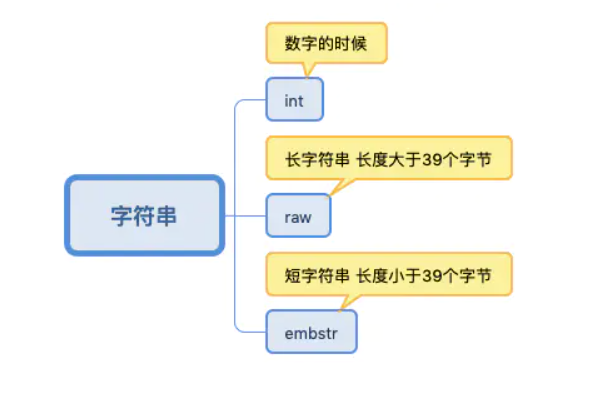

其中：embstr和raw都是由**SDS**动态字符串构成的。长字符串是 raw 类型存储。短字符串是 embstr类型存储。

区别：

raw是分配内存的时候，redisobject和 sds 各分配一块内存，分配两次。

而embstr是redisobject和sds在一块儿内存中。 

### 列表

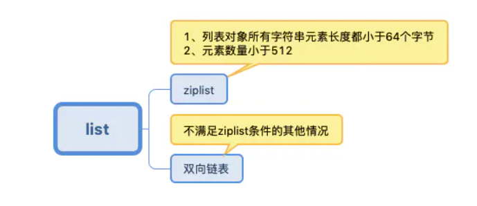

少的时候是压缩链表，多的时候是双向链表。

### hash

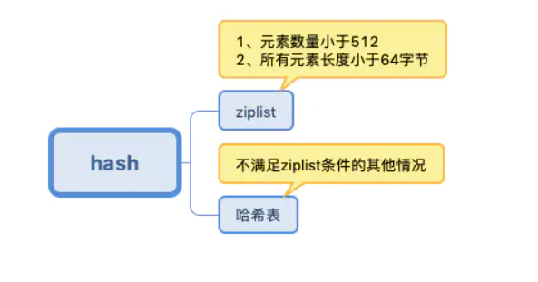

元素少的时候是ziplist，多的时候是哈希表。

redis的哈希表的制作使用的是拉链法 

### set

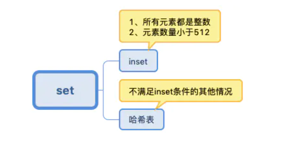

元素少的时候是inset，多的时候是哈希表。

### zset

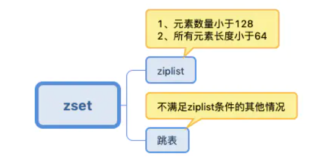

元素少的时候是压缩链表，多的时候是跳表。

### int

就是redis中存放的各种数字 包括一下这种，故意加引号“”的

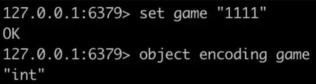

### 双向链表

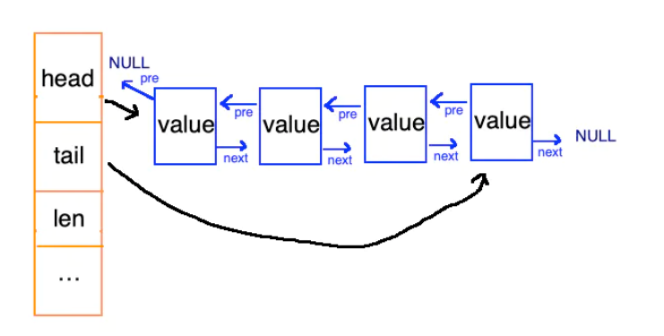

### ziplist

压缩列表。 redis的列表键和哈希键的底层实现之一。此数据结构是为了节约内存而开发的。和各种语言的数组类似，它是由连续的内存块组成的，这样一来，由于内存是连续的，就减少了很多内存碎片和指针的内存占用，进而节约了内存。 

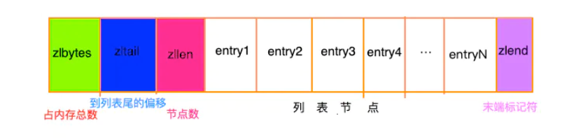

然后文中的entry的结构是这样的： 

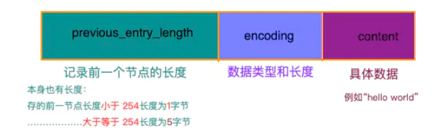

遍历的话是先找到列表尾部元素， 然后再根据ziplist节点元素中的previous_entry_length属性，来逐个向前遍历。

### intset

 整数集合是集合键的底层实现方式之一。 

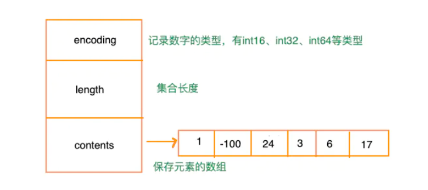

### redis对象

redis中并没有直接使用以上所说的各种数据结构，而是基于一种对象，对象底层再间接的引用上文所说的具体的数据结构。

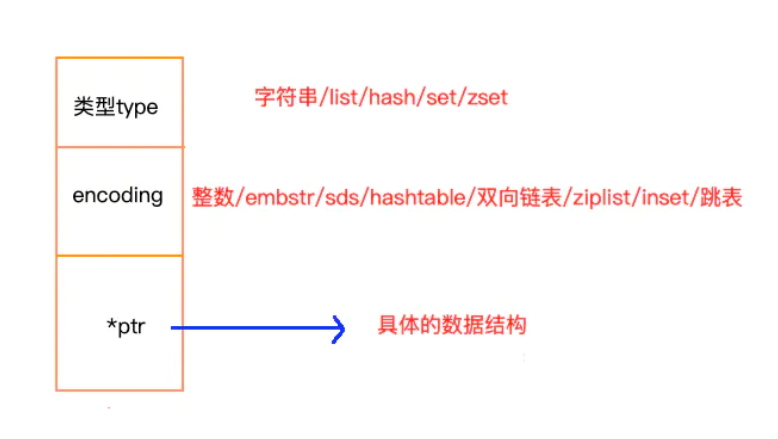

- https://juejin.cn/post/6844904008591605767#heading-13
- https://cloud.tencent.com/developer/article/1539038
- https://juejin.cn/post/6844904004498128903

### sds

**在C语言中，字符串可以用'\0'结尾的char数组标示**。这种简单的字符串表示，在大多数情况下都能满足要求，但是**不能高效的计算length和append数据**。所以Redis自己实现了**SDS**（**简单动态字符串**）的抽象类型。

SDS的数据结构如下：

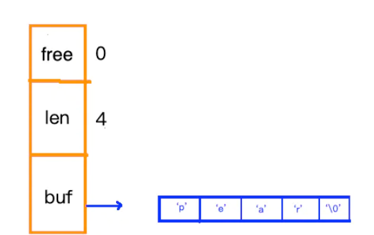


 free：还剩多少空间，len：字符串长度，buf：存放的字符数组。

### 压缩列表

压缩列表是一种数据结构，这种数据结构的功能是将一系列**数据与其编码信息存储在一块连续的内存区域**，这块内存物理上是连续的，逻辑上被分为多个组成部分，其目的是在一定可控的时间复杂读条件下**尽可能的减少不必要的内存开销，从而达到节省内存的效果。**

### 字典

dictht 是一个散列表结构，使用**拉链法**解决哈希冲突。

```c
/* This is our hash table structure. Every dictionary has two of this as we
 * implement incremental rehashing, for the old to the new table. */
typedef struct dictht {
    dictEntry **table;
    unsigned long size;
    unsigned long sizemask;
    unsigned long used;
} dictht;
```

```c
typedef struct dictEntry {
    void *key;
    union {
        void *val;
        uint64_t u64;
        int64_t s64;
        double d;
    } v;
    struct dictEntry *next;
} dictEntry;
```

**Redis 的字典 dict 中包含两个哈希表 dictht**，这是为了方便进行 **rehash** 操作。在**扩容**时，**将其中一个 dictht 上的键值对 rehash 到另一个 dictht 上面**，**完成之后释放空间并交换两个 dictht 的角色。**

```c
typedef struct dict {
    dictType *type;
    void *privdata;
    dictht ht[2];
    long rehashidx; /* rehashing not in progress if rehashidx == -1 */
    unsigned long iterators; /* number of iterators currently running */
} dict;
```

**rehash 操作不是一次性完成**，而是采用**渐进方式**，这是为了避免一次性执行过多的 rehash 操作给服务器带来过大的负担。

渐进式 rehash 通过记录 dict 的 rehashidx 完成，它从 0 开始，然后每执行一次 rehash 都会递增。例如在一次 rehash 中，要把 dict[0] rehash 到 dict[1]，这一次会把 dict[0] 上 table[rehashidx] 的键值对 rehash 到 dict[1] 上，dict[0] 的 table[rehashidx] 指向 null，并令 rehashidx++。

**在 rehash 期间，每次对字典执行添加、删除、查找或者更新操作时，都会执行一次渐进式 rehash。**

**采用渐进式 rehash 会导致字典中的数据分散在两个 dictht 上，因此对字典的查找操作也需要到对应的 dictht 去执行。**

补充：

Redis的字典采用的是一种‘’**单线程渐进式rehash**‘’，这里的单线程是指只有一个线程在扩容，

**而在扩容的同时其他的线程可以并发的进行读写。**

Redis系统后台会定时给予扩容的那个线程**足够的运行时间**，这样不会导致它**饿死**。

过程：

ht[0]，是存放数据的table，作为非扩容时容器。

ht[1]，只有正在进行扩容时才会使用，它也是存放数据的table，**长度为ht[0]的两倍。**

扩容时，单线程A负责把数据从ht[0] copy到ht[1] 中。如果这时有其他线程

进行**读操作**：**会先去ht[0]中找，找不到再去ht[1]中找**。

进行**写操作**：**直接写在ht[1]中**。

进行**删除操作**：与读类似。

当然这过程中会设计到一系列的**锁来保证同步性**，不过这并不是这里介绍的重点。

**ConcurrentHashMap**

ConcurrentHashMap采用的扩容策略为： “**多线程协同式rehash**“。指的是有**多个线程并发的把数据从旧的容器搬运到新的容器中。**

过程：

线程A在扩容把数据从oldTable搬到到newTable，这时其他线程

进行读操作：这个线程知道数据存放在oldTable或是newTable中，直接取即可。

进行**写操作**：如果要写的桶位，已经被线程A搬运到了newTable。那么这个线程知道正在扩容**，它也一起帮着扩容，扩容完成后才进行put操作**。

进行删除操作：与写一致。

------

**Redis字典**对比**ConcurrentHashMap**：

1.扩容所花费的时间对比：

一个单线程渐进扩容，一个多线程协同扩容。在平均的情况下，是ConcurrentHashMap快。这也意味着，扩容时所需要**花费的空间能够更快的进行释放**。

2.读操作，两者的性能相差不多。

3.写操作，Redis的字典**返回更快些**，因为它不像ConcurrentHashMap那样去帮着扩容(当要写的桶位已经搬到了newTable时)，等扩容完才能进行操作。

4.删除操作，与写一样。

所以是选择单线程渐进式扩容还是选择多线程协同式扩容，这个就具体问题具体分析了。

1.如果内存资源吃紧，那么选择后者。

2.如果对于写和删除操作要求迅速，那么可以选择前者。

```c
/* Performs N steps of incremental rehashing. Returns 1 if there are still
 * keys to move from the old to the new hash table, otherwise 0 is returned.
 *
 * Note that a rehashing step consists in moving a bucket (that may have more
 * than one key as we use chaining) from the old to the new hash table, however
 * since part of the hash table may be composed of empty spaces, it is not
 * guaranteed that this function will rehash even a single bucket, since it
 * will visit at max N*10 empty buckets in total, otherwise the amount of
 * work it does would be unbound and the function may block for a long time. */
int dictRehash(dict *d, int n) {
    int empty_visits = n * 10; /* Max number of empty buckets to visit. */
    if (!dictIsRehashing(d)) return 0;

    while (n-- && d->ht[0].used != 0) {
        dictEntry *de, *nextde;

        /* Note that rehashidx can't overflow as we are sure there are more
         * elements because ht[0].used != 0 */
        assert(d->ht[0].size > (unsigned long) d->rehashidx);
        while (d->ht[0].table[d->rehashidx] == NULL) {
            d->rehashidx++;
            if (--empty_visits == 0) return 1;
        }
        de = d->ht[0].table[d->rehashidx];
        /* Move all the keys in this bucket from the old to the new hash HT */
        while (de) {
            uint64_t h;

            nextde = de->next;
            /* Get the index in the new hash table */
            h = dictHashKey(d, de->key) & d->ht[1].sizemask;
            de->next = d->ht[1].table[h];
            d->ht[1].table[h] = de;
            d->ht[0].used--;
            d->ht[1].used++;
            de = nextde;
        }
        d->ht[0].table[d->rehashidx] = NULL;
        d->rehashidx++;
    }

    /* Check if we already rehashed the whole table... */
    if (d->ht[0].used == 0) {
        zfree(d->ht[0].table);
        d->ht[0] = d->ht[1];
        _dictReset(&d->ht[1]);
        d->rehashidx = -1;
        return 0;
    }

    /* More to rehash... */
    return 1;
}
```

### 跳跃表

(1) 由很多层结构组成，**level**是通过一定的**概率随机产生**的；
(2) **每一层**都是一个**有序的链表**，**默认是升序** ；
(3) **最底层**(Level 1)的链表包含所有元素；
(4) 如果一个元素出现在Level i 的链表中，则它在**Level i 之下**的链表**也都会出现**； 
(5) 每个节点包含**两个指针**，一个指向同一链表中的**下一个元素**，一个指向**下面一层**的元素。 

是有序集合 zset 的底层实现之一。

跳跃表是基于多指针有序链表实现的，可以看成多个有序链表。

<div align="center">  </div><br>
在查找时，从上层指针开始查找，找到对应的区间之后再到下一层去查找。下图演示了查找 22 的过程。

<div align="center">  </div><br>
不断地往跳表中插入数据时，如果不更新索引，就有可能出现某2个索引节点之间的数据非常多的情况，在极端情况下，跳表还会**退化成单链表** 。


##### 分析

**实际跳跃表就像是建立了索引，是时间换取空间的思想。**

查找时间复杂度：约为O(log n)，空间复杂度约为 O(n)

如果每次插入都进行重建索引，每次插入数据的时间复杂度变成了 O(n)。 而加入随机等级索引算法维护时，  每层索引中插入元素的时间复杂度 O(1)，所以整个插入的时间复杂度是 O(logn)。 

创建跳跃表时，跳跃表的高度是动态增加的。插入数据时，如果插入的当前层（随机选的）层高高于表高，则**更新表高**。

与红黑树等平衡树相比，跳跃表具有以下优点：

- 按照**范围区间**查找元素（比如查找值在 [100, 356] 之间的数据）！
- 支持无锁操作。

为什么不采用最完美的二分结构？ 

插入节点的情况。当中间插入一个节点，此时的二分结构会被打破，所以需要不断的进行调整。想想平衡树，红黑树复杂的再平衡操作更加复杂。而使用**随机算法**进行**层高选择的方法**也可以实现O(logN)的平均复杂度，而且操作也相对简化的很多。

## 使用场景

### 计数器

可以对 String 进行自增自减运算，从而实现计数器功能。

这个就是redis的incr和decr了，这个是一个原子操作，不用担心并发的问题，不过如果是高并发的情况下，还是要慎重使用。

### 缓存

将热点数据放到内存中，设置内存的最大使用量以及淘汰策略来保证缓存的命中率。

### 查找表

例如 DNS 记录就很适合使用 Redis 进行存储。

查找表和缓存类似，也是利用了 Redis 快速的查找特性。但是查找表的内容不能失效，而缓存的内容可以失效，因为缓存不作为可靠的数据来源。

### 消息队列

List 是一个双向链表，可以通过 lpush 和 rpop 写入和读取消息

不过最好使用 Kafka、RabbitMQ 等消息中间件。

### 会话缓存

可以使用 Redis 来统一存储多台应用服务器的会话信息。

当应用服务器不再存储用户的会话信息，也就不再具有状态，一个用户可以请求任意一个应用服务器，从而更容易实现高可用性以及可伸缩性。

### 分布式锁实现

在分布式场景下，无法使用单机环境下的锁来对多个节点上的进程进行同步。

可以使用 Redis 自带的 SETNX 命令实现分布式锁，除此之外，还可以使用官方提供的 RedLock 分布式锁实现。

### 其它

Set 可以实现交集、并集等操作，从而实现共同好友等功能。

### 排行榜

这个可以使用redis中的zset数据类型，这个数据结构可以排序，不过是从小到大排序的，现实中使用一般是要从大到小排序，注意转一下，比如转位负数 


## Redis 与 Memcached

两者都是非关系型内存键值数据库，主要有以下不同：

### 数据类型

Memcached 仅支持字符串类型，而 Redis 支持五种不同的数据类型，可以更灵活地解决问题。

### 数据持久化

Redis 支持两种持久化策略：RDB 快照和 AOF 日志，而 Memcached 不支持持久化。

### 分布式

Memcached 不支持分布式，只能通过在客户端使用一致性哈希来实现分布式存储，这种方式在存储和查询时都需要先在客户端计算一次数据所在的节点。

Redis Cluster 实现了分布式的支持。

### 内存管理机制

- 在 Redis 中，并不是所有数据都一直存储在内存中，可以将一些很久没用的 value 交换到磁盘，而 Memcached 的数据则会一直在内存中。

- Memcached 将内存分割成特定长度的块来存储数据，以完全解决内存碎片的问题。但是这种方式会使得内存的利用率不高，例如块的大小为 128 bytes，只存储 100 bytes 的数据，那么剩下的 28 bytes 就浪费掉了。

## 键的过期时间

Redis 可以为每个键设置过期时间，当键过期时，会自动删除该键。

对于散列表这种容器，只能为整个键设置过期时间（整个散列表），而不能为键里面的单个元素设置过期时间。

## 数据淘汰策略

可以设置内存最大使用量，当内存使用量超出时，会施行数据淘汰策略。

Redis 具体有 6 种淘汰策略：

| 策略 | 描述 |
| :--: | :--: |
| volatile-lru | 从已设置过期时间的数据集中挑选最近最少使用的数据淘汰 |
| volatile-ttl | 从已设置过期时间的数据集中挑选将要过期的数据淘汰 |
|volatile-random | 从已设置过期时间的数据集中任意选择数据淘汰 |
| allkeys-lru | 从所有数据集中挑选最近最少使用的数据淘汰 |
| allkeys-random | 从所有数据集中任意选择数据进行淘汰 |
| noeviction | 禁止驱逐数据 |

作为内存数据库，出于对性能和内存消耗的考虑，Redis 的淘汰算法实际实现上并非针对所有 key，而是抽样一小部分并且从中选出被淘汰的 key。

使用 Redis 缓存数据时，为了提高缓存命中率，需要保证缓存数据都是热点数据。可以将内存最大使用量设置为热点数据占用的内存量，然后启用 allkeys-lru 淘汰策略，将最近最少使用的数据淘汰。

Redis 4.0 引入了 volatile-**lfu** 和 allkeys-**lfu** 淘汰策略，LFU 策略通过统计**访问频率**，将访问频率最少的键值对淘汰。

## 持久化

Redis 是内存型数据库，为了保证数据在断电后不会丢失，需要将内存中的数据持久化到硬盘上。

### RDB 持久化

将某个时间点的所有数据都存放到硬盘上文件 dump.rdb 中，就是存储某一时间所有数据的快照。也是默认持久方式。

Redis会单独创建（fork）一个子进程来进行持久化，会先将数据写入到一个临时文件中，主进程是不进行任何IO操作的 ，如果数据量很大，保存快照的时间会很长。

Fork就是**复制一个与当前进程一样的进程**。新进程的所有数据（变量、环境变量、程序计数器等）数值都和原进程一 致，但是是一个全新的进程，并作为原进程的**子进程**。 

可以将快照**复制到其它服务器**从而创建具有相同数据的服务器副本。

- 适用于需要进行**大规模数据的恢复**，且对于数据恢复的完整性不是非常敏感。 
- RDB的缺点是最后一次持久化后的数据可能**丢失**。 

### RDB 触发机制？

1、通过执行save或者bgsave命令，**save**是主线程执行的，会**阻塞**redis，**bgsave**是fork出来一个子线程执行，**不会阻塞主线程执行**。

2、通过在redis.conf中配置，如下

```
save 900 1：表示900 秒内如果至少有 1 个 key 的值变化，则保存
save 300 10：表示300 秒内如果至少有 10 个 key 的值变化，则保存
save 60 10000：表示60 秒内如果至少有 10000 个 key 的值变化，则保存
```

redis中会维护两个变量：

一个是dirty，上次save或者bgsave之后，redis执行的**增删改的次数**。

一个是lastsave，上次执行save或者bgsave的**时间**，redis中**周期性操作函数** severCron会每隔**100ms 检查**一下上面的三个条件有没有满足的，有满足的就执行bgsave.

 

### redis在什么条件下不会执行save，或者bgsave?

1、已经在执行save或者bgsave，就不会在执行，为了防止冲突

2、在执行BGREWRITEAOF的时候不能执行bgsave，防止redis负载过高

3、save命令和gbsave不能同时执行

参考：[Redis RDB 持久化方式](https://www.jianshu.com/p/c0e2c54b6519)  ，  [Redis详解（六）------ RDB 持久化](https://www.cnblogs.com/ysocean/p/9114268.html)


### **为什么RDB 要 fork 子进程而不是线程？**

1、通过 fork 生成的**父子进程**会**共享包括内存空间**在内的资源；

2、fork 函数并**不会带来明显的性能开销**，尤其是对内存进行大量的拷贝，它能通过写时拷贝将拷贝内存这一工作推**迟到真正需要的时候**；

- **写时拷贝**（Copy-on-Write）

写时拷贝的出现就是为了解决这一问题，就像我们在这一节开头介绍的，写时拷贝的主要作用就是**将拷贝推迟到写操作真正发生时**，这也就避免了大量无意义的拷贝操作。 

- **子进程**

Unix 和类 Unix 系统中，**fork** 都是一个**进程**用于**创建自己拷贝**的操作，它往往都是被**操作系统内核**实现的**系统调用**，也是操作系统在 *nix 系统中**创建新进程的主要方法**。 

- **fork方法**

在 fork 的 [手册](http://man7.org/linux/man-pages/man2/fork.2.html) 中，我们会发现调用 fork 后的**父子进程会运行在不同的内存空间**中，当 fork 发生时两者的内存空间有着完全**相同的内容**，对内存的写入和修改、文件的映射都是**独立**的，两个进程**不会相互影响**。 

- **fork方法返回值**

当程序调用了 fork 方法之后，我们就可以通过 fork 的返回值确定父子进程，以此来执行不同的操作：

1、fork 函数返回 **0** 时，意味着当前进程是**子进程**；

2、fork 函数返回**非 0** 时，意味着当前进程是**父进程**，**返回值是子进程的 pid**。


**原因**：

首先 fork 之后的子进程是可以获取父进程内存中的数据的，而 fork 带来的额外性能开销相比阻塞主线程也一定是可以接受的。

1、通过 fork 创建的子进程**能够获得和父进程完全相同的内存空间**，**父进程对内存的修改对于子进程是不可见的**，**两者不会相互影响**；

2、通过 fork 创建子进程时**不会立刻触发大量内存的拷贝**，**内存在被修改时会以页为单位进行拷贝**，这也就**避免了大量拷贝内存而带来的性能问题**；

上述两个原因中，一个为**子进程访问父进程**提供了支撑，另一个为**减少额外开销**做了支持，这两者缺一不可。


参考：

真没什么逻辑：https://draveness.me/whys-the-design-redis-bgsave-fork/

### AOF 持久化

**aof保存执行步骤是什么？** 

1、命令追加

redis每次执行增删改操作的时候，都会以协议格式的方式追加到aof**缓存**中

2、文件的写入和同步

write: 根据条件，将aof buf中的数据写入到aof 日志文件中

save: 根据条件，调用 fsync 或 fdatasync 函数，将aof文件保存到磁盘上

 

将写命令添加到 AOF  操作日志文件（Append Only File）的末尾。

使用 AOF 持久化需要设置同步选项 redis.conf的appendfsync选项 ，从而确保写命令同步到磁盘文件上的时机。这是因为对文件进行写入并不会马上将内容同步到磁盘上，而是先存储到缓冲区，然后由操作系统决定什么时候同步到磁盘。有以下同步选项：

| 选项 | 同步频率 |
| :--: | :--: |
| always | 每个写命令都同步 |
| everysec | 每秒同步一次 |
| no | 让操作系统来决定何时同步 |

- always 选项会严重减低服务器的性能。 每次执行一条增删改操作之后，都会执行上面的write和save操作，而且是由**主线程执行**的，会阻塞redis，所以这种方式的效率是最差的，但是是最安全的，如果redis突然挂了，**只会丢失一个事件循环中所产生的命令数据**。 
- everysec 选项比较合适，可以保证系统崩溃时只会丢失一秒左右的数据，并且 Redis 每秒执行一次同步对服务器性能几乎没有任何影响。 每秒执行一次将aof缓存中的数据持久化到磁盘上，**redis会在后台启动一个线程来处理，不会影响主线程**，redis默认是采用这种方式，效率很快，如果redis突然宕机，丢失的数据可能操作2s的数据，为什么是两秒，如图：

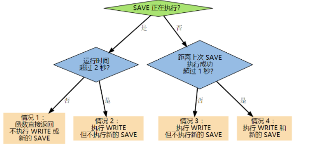


在情况2的时候，由于上次执行的save的事件过长，超过2s，就会导致本次save的操作不会执行，如果这时候redis发生宕机，丢失的数据就会超过2s，参考：[AOF持久化](https://www.jianshu.com/p/1e34fdc51e3b) 

- no 选项并不能给服务器性能带来多大的提升，而且也会增加系统崩溃时数据丢失的数量。

实际不保存的意思，就是说每次调用flushAppendOnlyFile函数，只会执行write操作，并不会执行save操作，这个write操作的执行是主线程执行的，会阻塞，同时下面介绍的3种save操作也会阻塞主线程，那什么时候会把write操作写的aof文件持久化到磁盘呢？ 

1、**关闭redis的aof功能的时候**

2、**关闭redis的时候**

3、系统的写缓存被刷新（可能是缓存已经被写满，或者定期保存操作被执行），这种方式相当于把aof缓存文件持久化到硬盘**交给了操作系统来控制**

参考文章：[Redis AOF 持久化详解](https://juejin.im/post/5d405370e51d4561fa2ebfe8)

**磁盘上的aof文件越来越大，磁盘不够用怎么处理？** 

使用**aof重写机制**，举个例子，set a 1,set a 2 ,set a 3,这三条命令依次执行，其实可以合并成一条命令，就是set a 3。

其实aof重写也是差不多这样，他是直接将redis中保存的key-value转化为命令，为了防止影响主线程，aof重写会新启动一个新的子线程，将这些命令写入到aof重写缓存中，那如果在这个重写的过程，redis中又有新的请求进来怎么处理，答案是直接写入到aof的重新缓存中，整个过程不会影响正常的aof写入，当aof重写完成之后，会给父进程发送信号，父进程会调用一个信号函数做如下工作：

　　1.将aof重写缓存中的内容写入aof文件

　　2.使用新的aof文件替换原来的aof文件

这两个过程由于是主进程完成的，所以会阻塞主进程。

**aof的重写触发时机？**

- AOF重写可以由用户通过调用BGREWRITEAOF**手动触发**。
- 服务器在AOF功能开启的情况下，会维持以下三个变量：
  - 记录当前AOF文件大小的变量aof_current_size。
  - 记录最后一次AOF重写之后，AOF文件大小的变量aof_rewrite_base_size。
  - 增长百分比变量aof_rewrite_perc。
- 每次当serverCron（**服务器周期性操作函数**）函数执行时，它会检查以下条件是否全部满足，如果全部满足的话，就触发自动的AOF重写操作：
  - 没有BGSAVE命令（RDB持久化）/AOF持久化在执行；
  - 没有BGREWRITEAOF在进行；
  - 当前AOF文件大小要大于server.aof_rewrite_min_size（默认为1MB），或者在redis.conf配置了auto-aof-rewrite-min-size大小；
  - 当前AOF文件大小和最后一次重写后的大小之间的比率等于或者等于指定的增长百分比（在配置文件设置了auto-aof-rewrite-percentage参数，不设置默认为100%）

如果前面三个条件都满足，并且当前AOF文件大小比最后一次AOF重写时的大小要大于指定的百分比，那么触发自动AOF重写。

参考文章：[Redis之AOF重写及其实现原理](https://blog.csdn.net/yzj5208/article/details/82083549)

看实际业务场景，建议RDB和AOF都开启。其实RDB更适合做数据的备份，留一后手。AOF出问题了，还有RDB。 

## 事务

一个事务包含了多个命令，服务器在执行事务期间，不会改去执行其它客户端的命令请求。

事务中的多个命令被一次性发送给服务器，而不是一条一条发送，这种方式被称为**流水线**，它可以减少客户端与服务器之间的**网络通信次数从而提升性能**。

Redis 最简单的事务实现方式是使用 **MULTI** 和 **EXEC** 命令将**事务操作包围起来**。

## 事件

Redis 服务器是一个事件驱动程序。

### 文件事件

服务器通过套接字与客户端或者其它服务器进行通信，文件事件就是对套接字操作的抽象。

Redis 基于 Reactor 模式开发了自己的网络事件处理器，使用 I/O 多路复用程序来同时监听多个套接字，并将到达的事件传送给文件事件分派器，分派器会根据套接字 Socket 产生的事件类型调用相应的事件处理器。

<div align="center">  </div><br>
### 时间事件

服务器有一些操作需要在给定的时间点执行，时间事件是对这类定时操作的抽象。

时间事件又分为：

- 定时事件：是让一段程序在指定的时间之内执行一次；
- 周期性事件：是让一段程序**每隔指定时间**就执行一次。

Redis 将所有时间事件都放在一个**无序链表中**，通过遍历整个链表查找出已到达的时间事件，**并调用相应的事件处理器**。

### 事件的调度与执行

服务器需要不断监听文件事件的套接字才能得到待处理的文件事件，但是不能一直监听，否则时间事件无法在规定的时间内执行，因此监听时间应该根据距离现在最近的时间事件来决定。

事件调度与执行由 aeProcessEvents 函数负责，伪代码如下：

```python
def aeProcessEvents():
    # 获取到达时间离当前时间最接近的时间事件
    time_event = aeSearchNearestTimer()
    # 计算最接近的时间事件距离到达还有多少毫秒
    remaind_ms = time_event.when - unix_ts_now()
    # 如果事件已到达，那么 remaind_ms 的值可能为负数，将它设为 0
    if remaind_ms < 0:
        remaind_ms = 0
    # 根据 remaind_ms 的值，创建 timeval
    timeval = create_timeval_with_ms(remaind_ms)
    # 阻塞并等待文件事件产生，最大阻塞时间由传入的 timeval 决定
    aeApiPoll(timeval)
    # 处理所有已产生的文件事件
    procesFileEvents()
    # 处理所有已到达的时间事件
    processTimeEvents()
```

将 aeProcessEvents 函数置于一个循环里面，加上初始化和清理函数，就构成了 Redis 服务器的主函数，伪代码如下：

```python
def main():
    # 初始化服务器
    init_server()
    # 一直处理事件，直到服务器关闭为止
    while server_is_not_shutdown():
        aeProcessEvents()
    # 服务器关闭，执行清理操作
    clean_server()
```

从事件处理的角度来看，服务器运行流程如下：

<div align="center">  </div><br>
## Redis 快的原因 

要明白这个问题，首先要明白redis的线程模型，参考这篇文章：[Redis线程模型](https://www.jianshu.com/p/8f2fb61097b8)，我总结一下这篇文章的核心点如下：

-  **redis可用同时有多个并发**，**使用io多路复用来处理redis的多个socket连接**，当有多个请求进来的时候，直接使用io多路复用**把socket产生的事件放入队列**中，而**不是直接处理**。


以下内容来自知乎一个用户的回答：

举一个例子，模拟一个tcp服务器处理30个客户socket。
假设你是一个老师，让30个学生解答一道题目，然后检查学生做的是否正确，你有下面几个选择： 

1、第一种选择：**按顺序逐个检查**，先检查A，然后是B，之后是C、D。。。这中间如果有一个学生卡主，全班都会被耽误。这种模式就好比，你用循环挨个处理socket，根本不具有并发能力。

2、第二种选择：你**创建30个分身**，每个分身检查一个学生的答案是否正确。 这种类似于为每一个用户创建一个进程或者线程处理连接。

3、第三种选择，你**站在讲台上等，谁解答完谁举手**。这时C、D举手，表示他们解答问题完毕，你下去依次检查C、D的答案，然后继续回到讲台上等。此时E、A又举手，然后去处理E和A。。。 

这种就是**IO复用模型**，**Linux下的select、poll和epoll**就是干这个的。将用户socket对应的fd注册进epoll，然后

**epoll帮你监听哪些socket上有消息到达**，这样就避免了大量的无用操作。此时的socket应该采用**非阻塞模式**。

这样，整个过程**只在调用select、poll、epoll这些调用的时候才会阻塞**，收发客户消息是不会阻塞的，整个进

程或者线程就被充分利用起来，这就是**事件驱动**，所谓的**reactor模式**。

参考：

作者：柴小喵　　　链接：https://www.zhihu.com/question/28594409/answer/52835876
　　　

　　 这个例子中，作者很形象的解释了什么是io多路复用，但是大家注意，大家不要认为第一种选择就是BIO，第二种选择就是NIO。

其实第一种选择相当于BIO + 单线程，第二种选择相当于BIO + 多线程。

说一点题外话，与本文主题无关的，如果想要改成单线程+NIO，和多线程+NIO是什么样子呢？

　　单线程 + NIO：老师下去检查每个学生的答案，如果这个学生还没有做出来，就检查下一个，直到检查到某个学生做完了，就检查他的答案，就这样一直死循环，直到把所有同学的作业检查完为止，这里的**NIO非阻塞就体现在老师不会等那个没有做完的同学**。

　　多线程 + NIO：还是老师去检查同学的作业，如果这个同学没有做完，就下一个，直到检查到一个同学做完，之后就**创建一个分身**去检查这个同学的答案，老师还是继续检查每个同学，直到所有同学的答案都检查完。

　　其实吧，这里的io多路复用，作者是说学生自己报告说自己有没有答案，其实在实际的程序中，并不是学生自己说我有没有做完，而是有一个**代理**，这个**代理代替老师，来监控学生**，如果某个学生有了答案，他就通知老师，之后老师就可以直接来看这个学生的答案，在Linux系统中这个代理往往就是select,poll，epoll。


参考：

https://www.cnblogs.com/gunduzi/p/13138220.html


总的来说就是以下几点：

- **C 语言实现与纯内存操作**，采用单线程，避免了频繁的上下文切换。
- **非阻塞的 IO 多路复用机制**、事件驱动模型（**文件事件处理器**）的配合。
- **高效数据结构**：双向链表linkedlist、压缩列表zipist、跳跃表skiplist、字典dictht 

### Redis 6.0 开始引入多线程

##### redis 6.0 新特性

- 新支持：ACLs, SSL, 客户端缓存
- 新的通信协议：RESP3，旧协议仍然兼容
- 新的模块支持：Modules
- 基于 Modules 构建的消息队列： [Disque](https://github.com/antirez/disque-module )
- 推出官方自己的集群方案：**Cluster Proxy** 
- 内部优化，包括与客户端的交流使用**多线程 IO**

##### 多线程问题

Redis 4.0之后并不是单线程，除了主线程外，它也有后台线程在处理一些较为缓慢的操作，例如清理脏数据、无用连接的释放、大 key 的删除、以及**持久化**等等。 

Redis 6.0 的多线程部分只是用来处理**网络数据的读写、协议解析**，执行命令仍然是单线程顺序执行 。

因为Redis的瓶颈不在内存，而是在网络I/O部分带来CPU的耗时，所以是在网络I/O 这块采用多线程处理。

##### 多线程配置问题

Redis6.0的多线程默认是禁用的，配置多线程数一般推荐要**小于cpu的核心数**。 4核的机器建议设置为2或3个线程，8核的建议设置为6个线程。测试结果， GET/SET 命令在4线程 IO时性能相比单线程是几乎是翻倍。 实际还要看具体场景。 

##### 配置实例

linux 查看核心数量命令： lscpu	得	 CPU(s): 4  等等

redis.conf配置文件：

io-threads-do-reads yes 		开启配置，因为默认多线程是关闭。

io-threads 3	配置核心数为 3

##### IO 多路复用

**多路指的是多个socket连接，复用指的是复用一个线程。**多路复用主要有三种技术：select，poll，epoll。epoll是最新的也是目前最好的多路复用技术。采用多路 I/O 复用技术可以让单个线程高效的处理多个连接请求（尽量减少网络IO的时间消耗)。

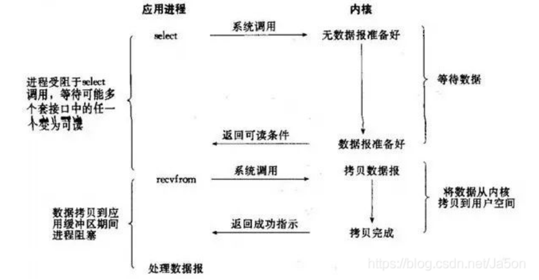


##### Redis6.0多线程的实现机制

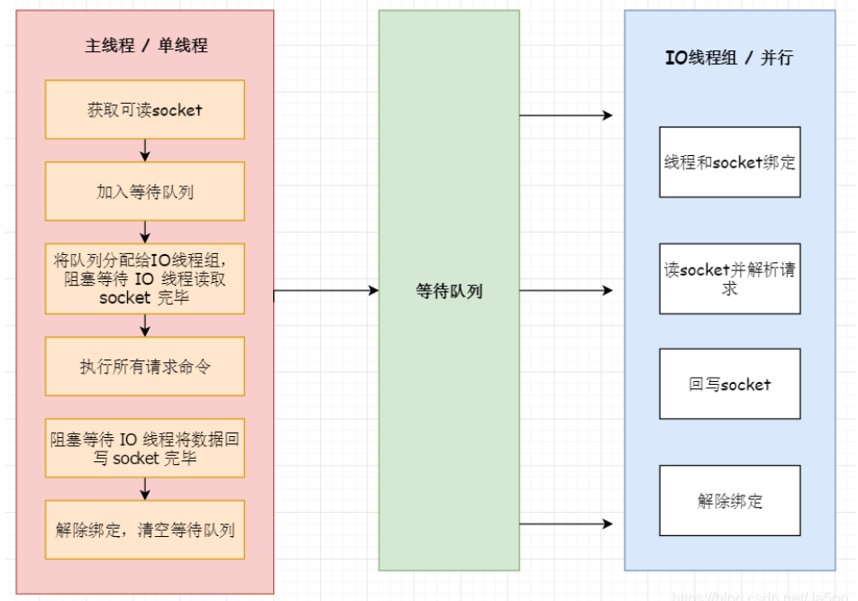

 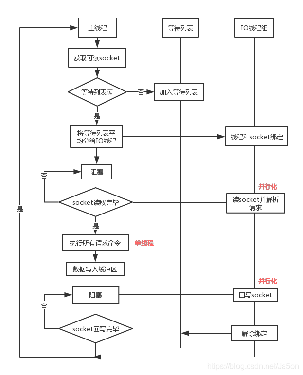 

##### 线程模型概述

通信是通过 socket 来完成的。Redis 内部使用**文件事件处理器** file event handler ，这个**文件事件处理器是单线程**的，所以 Redis 才叫做单线程的模型。它采用 IO 多路复用机制同时监听多个 socket，将产生事件的 socket 压入内存队列中，**事件分派器**根据 socket 上的事件类型来选择对应的**事件处理器**进行处理。 

**IO 线程特点**

1、IO 线程要么同时在读 socket，要么同时在写，不会同时读或写
2、IO 线程只负责读写 socket 解析命令，不负责命令处理 

## FIFO 、LRU、LFU 淘汰算法

当缓存需要被清理时（比如空间占用已经接近临界值了），需要使用某种淘汰算法来决定清理掉哪些数据。

常用的淘汰算法有下面几种：

- FIFO：First In First Out，先进先出。判断被存储的时间，离目前最远的数据优先被淘汰。
- LRU：Least Recently Used，最近最少使用。判断最近被使用的时间，目前最远的数据优先被淘汰。
- LFU：Least Frequently Used，最不经常使用。在一段时间内，数据被使用次数最少的，优先被淘汰。

##### Redis 3.0 的近似 LRU 与优化

Redis使用的是近似LRU算法，通过随机采样法淘汰数据，每次随机出5（默认）个key，从里面淘汰掉最近最少使用的key。当然随机选出的key越多，越接近真正的LRU，这个可以配置值解决， Redis为了实现近似LRU算法，给每个key增加了一个额外增加了一个24bit的字段，用来存储该key最后一次被访问的时间。

Redis3.0对近似LRU算法进行了一些优化。新算法会维护一个候选池（大小为16），就是一个堆，随机选取key放进去，堆顶是时间使用最遥远的，就是会被最先淘汰的，后边再随机选取的key只有更远的才会放进去。

##### 3.0 LRU 问题

热数据顾名思义就是被访问频次叫高的数据，最新访问的数据被当做热数据显然是不合理的。

##### Reids 4.0 新加的 LFU 算法

LFU 一共有两种策略：

> volatile-lfu：在设置了过期时间的key中使用LFU算法淘汰key 
>
> allkeys-lfu：在所有的key中使用LFU算法淘汰数据 

维护一个队列记录所有数据的访问记录， 新加入数据插入到队列尾部（因为引用计数为1）， 队列中的数据被访问后，引用计数增加，队列重新排序，次数相同的按照时间排序。当需要淘汰数据时，将已经排序的列表最后的数据块删除。 

##### 4.0 LFU 算法问题

需要所有数据的计数排序，内存消耗较高。

访问情况是会频繁变化的，一段时间内频繁访问的key，一段时间之后可能会很少被访问到，只增加计数器并排序并不能体现热点数据。

**解决办法**，记录key最后一个被访问的时间，然后随着时间推移，降低计数器。


## 集群的三种模式

主从复制、哨兵模式、内部集群。


## 主从复制

一个master可以有多个slave，即**一主多从**；而slave也可以接受其他slave的连接，形成“**主从链**”层叠状结构。

好处：

- 故障恢复，避免单点故障。但是不自动，是哨兵的基础。
- 读写分离，负载均衡。提高服务器并发量。

### **建立连接**

通过使用 **slaveof host port 命令**来让一个服务器成为另一个服务器的从服务器。

**一个从服务器只能有一个主服务器**，并且不支持主主复制。

### **数据同步**

1. **主服务器创建快照文件**，发送给从服务器，并在发送期间**使用缓冲区记录执行的写命令**。快照文件发送完毕之后，开始向从服务器发送存储在**缓冲区中的写命令**；
2. **从服务器丢弃所有旧数据**，载入主服务器发来的**快照文件**，之后从服务器开始接受主服务器发来的**写命令**；
3. 主服务器**每执行一次写命令**，就向从服务器**发送相同的写命令**。

**完整重同步**

也就是上边同步过程描述的。

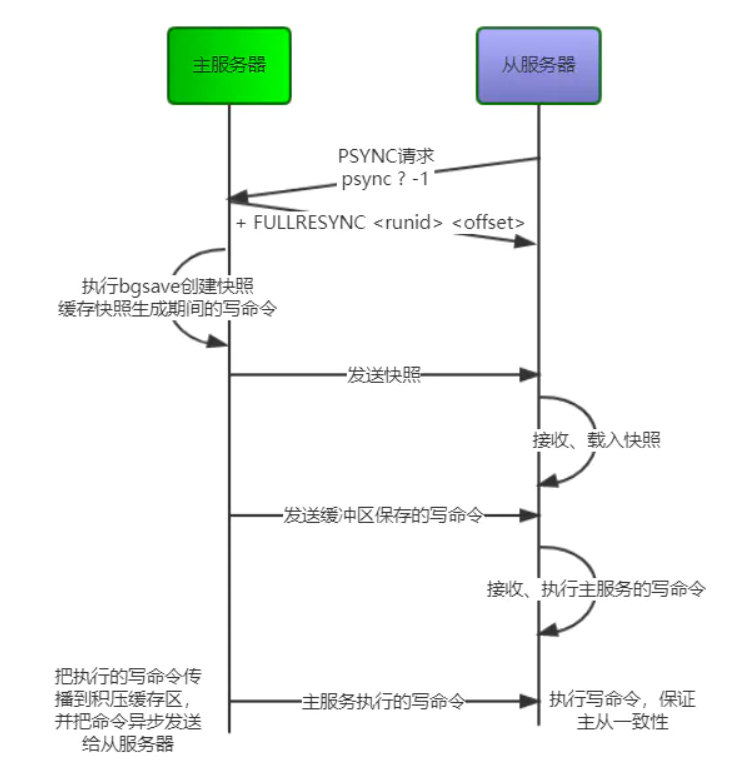

**部分重同步**

就是少了快照这一步，只同步缓存积压的命令。

### 命令传播

命令传播阶段，从服务器会默认以每秒一次的频率向主服务器发送**心跳检测** 。

````
REPLCONF ACK <replication_offset>
````

也就是发送命令，该命令的作用是检测主从服务器的**网络连接状态**，以及**命令是否丢失**。


参考：

图片：https://juejin.cn/post/6844903943764443149#heading-3

https://www.cnblogs.com/kismetv/p/9236731.html

**主从链**

随着负载不断上升，主服务器可能无法很快地更新所有从服务器，或者重新连接和重新同步从服务器将导致系统超载。为了解决这个问题，可以创建一个中间层来分担主服务器的复制工作。中间层的服务器是最上层服务器的从服务器，又是最下层服务器的主服务器。

<div align="center">  </div><br>
## 哨兵模式

Sentinel（哨兵）可以监听集群中的服务器，并在主服务器进入下线状态时，自动从从服务器中选举出新的主服务器。

**主要功能**

- **监控**：Sentinel不断的检查master和slave是否正常的运行。
- **通知**：如果发现某个redis节点运行出现问题，可以通知其他的节点。
- **自动故障转移**：能够进行自动切换。当一个master节点不可用时，能够选举出master，从多个slave中的一个来作为新的master,其它的slave节点会将它所追随的master的地址改为被提升为master的slave的新地址。

**架构图**

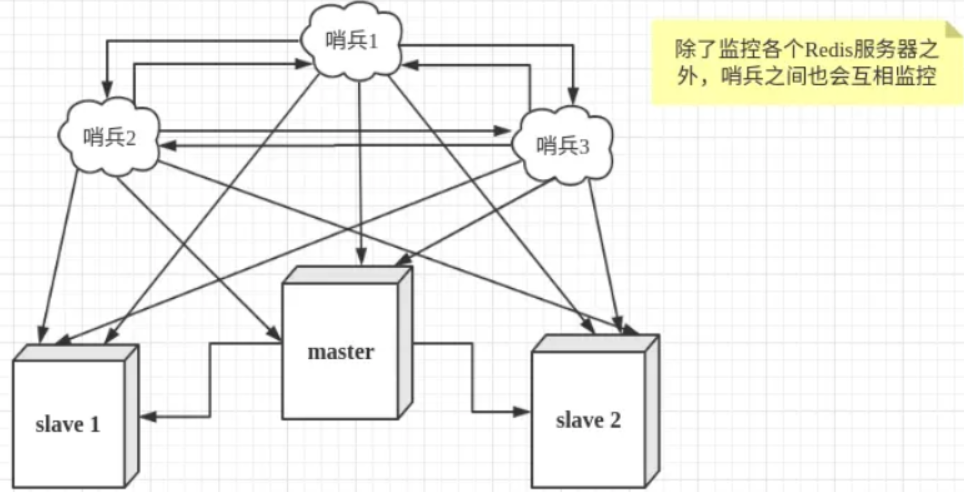


要解释什么是哨兵模式，要从redis的主从模式说起，redis的主从模式就是把上图的所有的哨兵去掉，就变成了主从模式。

主从模式是**主节点负责写请求**，然后**异步的同步给从节点**，然后**从节点负责读请求**，所以在主从架构中redis每个节点保存的数据是相同的，只是数据的同步可能会有一点延迟，那考虑到高可用性，**如果主节点挂了，是没有一个自动选主的机制的**，需要人工来指定一个节点为主节点，然后再恢复成主从结构，所以其实也是**不能做到高可用**。

为了解决主从模式不能高可用的问题，就发明了哨兵模式，**所谓的哨兵模式，就是在原来的主从架构的基础上，又搞了一个集群，哨兵集群**，这个集群会监控redis集群的主节点和从节点的状态，如果发现主节点挂了，就会重新在从节点中选出来一个作为主节点，从而做到高可用。

那哨兵本身是一个集群，那这个集群之间是怎么通信的呢？

哨兵模式既然可以监控redis集群，做到故障转移，哨兵集群又是怎么监控redis集群的呢？

### 工作原理

哨兵集群中的每个节点都会启动**三个定时任务**

- 第一个定时任务： **每个sentinel**节点每隔**1s**向**所有的master、slaver、别的sentinel节点发送一个PING命令**，作用：**心跳检测**
- 第二个定时任务： **每个sentinel每隔2s**都会向**master**的**sentinel:hello**这个**channel**中发送自己掌握的集群信息和自己的一些信息（比如**host,ip,run id**），这个是利用**redis的pub/sub**功能，**每个sentinel节点都会订阅这个channel**，也就是说，每个sentinel节点都可以知道别的sentinel节点掌握的集群信息，作用：**信息交换，了解别的sentinel的信息和他们对于主节点的判断**
- 第三个定时任务： **每个sentinel**节点每隔**10s**都会向**master和slaver发送INFO命令**，作用：**发现最新的集群拓扑结构**

### 哨兵如何判断master宕机

##### 主观下线 

这个就是上面介绍的第一个定时任务做的事情，当sentinel节点向master发送一个PING命令，如果超过own-after-milliseconds（默认是30s，这个在sentinel的配置文件中可以自己配置）时间都没有收到有效回复，不好意思，我就认为你挂了，就是说为的主观下线（SDOWN），修改其flags状态为SRI_S_DOWN 

##### 客观下线

要了解什么是客观下线要先了解几个**重要参数**：

- quorum：如果要**认为**master客观下线，最少需要主观下线的sentinel节点个数。举例：如果**5个sentinel节点**，**quorum = 2**,那**只要2个sentinel主观下线**，就可以判断master**客观下线**
- majority：如果确定了master客观下线了，就要把其中一个slaver切换成master，做这个事情的并不是整个sentinel集群，而**是sentinel集群会选出来一个sentinel节点来做**，那怎么选出来的呢，下面会讲，但是有一个原则就是需要**大多数节点都同意**这个sentinel来做故障转移才可以，这个大多数节点就是这个参数。注意：如果sentinel节点个数5，**quorum=2，majority=3**，那就是**3个节点同意就可以**，如果**quorum=5，majority=3**，这时候**majority=3就不管用了**，需要**5个节点都同意才可以**。
- configuration epoch：这个其实就是version，类似于中国每个皇帝都要有一个年号一样，**每个新的master都要生成一个**自己的configuration epoch，就是一个**编号**


##### 客观下线处理过程

1、**每个主观下线的sentinel节点**都会向**其他sentinel节点**发送 SENTINEL is-master-down-by-addr ip port current_epoch runid	来询问其它sentinel是否同意服务下线。

> ip：主观下线的服务id，port：主观下线的服务端口，
>
> current_epoch：sentinel的纪元编号，
>
> runid： \* 表示检测服务下线状态，如果是sentinel 运行id，表示用来选举领头sentinel

2、每个sentinel收到命令之后，会根据发送过来的ip和端口检查自己判断的结果，如果自己也认为下线了，就会回复，回复包含三个参数：down_state（1表示已下线，0表示未下线），leader_runid（领头sentinal id），leader_epoch（领头sentinel纪元）。由于上面发送的runid参数是*，这里后两个参数先忽略。

3、sentinel收到回复之后，根据quorum的值，判断达到这个值，如果大于或等于，就认为这个master客观下线


##### 选择领头sentinel的过程

　　到现在为止，已经知道了master客观下线，那就需要一个sentinel来负责故障转移，那到底是哪个sentinel节点来做这件事呢？需要通过选举实现，具体的选举过程如下：

1、判断客观下线的sentinel节点向其他节点发送SENTINEL is-master-down-by-addr ip port current_epoch runid（注意：这时的runid是自己的run id，每个sentinel节点都有一个自己运行时id）

2、目标sentinel回复，由于这个选择领头sentinel的过程符合先到先得的原则，举例：sentinel1判断了客观下线，向sentinel2发送了第一步中的命令，sentinel2回复了sentinel1，说选你为领头，这时候sentinel3也向sentinel2发送第一步的命令，sentinel2会直接拒绝回复

3、当sentinel发现选自己的节点个数超过majority（注意上面写的一种特殊情况quorum>majority）的个数的时候，**自己就是领头节点**

4、如果没有一个sentinel达到了majority的数量，等一段时间，**重新选举**。


### 故障转移过程

通过上面的介绍，已经有了领头sentinel，下面就是要做故障转移了，故障转移的一个主要问题和选择领头sentinel问题差不多，到底要选择哪一个slaver节点来作为master呢？按照我们一般的常识，我们会认为哪个slaver中的数据和master中的数据相识度高哪个slaver就是master了，其实哨兵模式也差不多是这样判断的，不过还有别的判断条件，详细介绍如下：

　　在进行选择之前需要先剔除掉一些不满足条件的slaver，这些slaver不会作为变成master的备选

- 剔除列表中已经下线的从服务
- 剔除有5s没有回复sentinel的info命令的slaver
- 剔除与已经下线的主服务连接断开时间超过 down-after-milliseconds*10+master宕机时长的slaver

#### 选主过程

1. 选择优先级最高的节点，通过sentinel配置文件中的replica-priority配置项，这个参数越小，表示优先级越高
2. 如果第一步中的优先级相同，选择offset最大的，offset表示主节点向从节点同步数据的偏移量，越大表示同步的数据越多
3. 如果第二步offset也相同，选择run id较小的

#### 后续事项

　　新的主节点已经选择出来了，并不是到这里就完事了，后续还需要做一些事情，如下

1. 领头sentinel向别的slaver发送slaveof命令，告诉他们新的master是谁谁谁，你们向这个master复制数据
2. 如果之前的master重新上线时，领头sentinel同样会给起发送slaveof命令，将其变成从节点

### 适用场景

一般来说吧，如果redis中**的数据量不是很大都可以使用这种模式**，比如**就几个G的数据**，使用哨兵模式没什么问题。 

### 哨兵模式存在的问题

**1、主节点写压力过大**

由于**只有主节点负责写数据**，如果有大量的写请求的时候，主节点负载太高，有挂掉的风险。

解决办法：使用cluster模式。

**2、主从数据不一致**

这个没办法，异步复制确实会有这个问题，如果系统可以接受这一点延迟，那就没问题，如果一定要没有一点延迟，那就**指定读主库吧**。

**3、集群脑裂**

所谓的集群脑裂，就是一个集群中出现了两个master，这种情况是如何产生的呢？当集群中的master的网络出现了问题，和集群中的slaver和sentinel通信出现问题，但是本身并没有挂，见下图

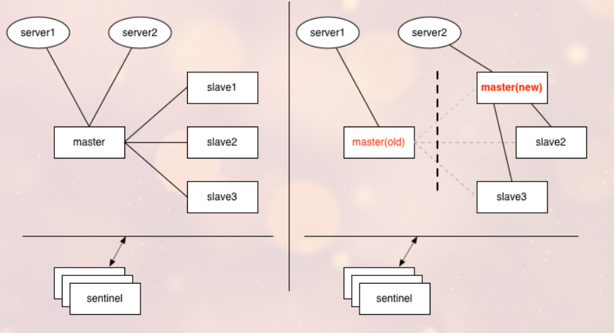

 声明：本图来源：[redis 脑裂等极端情况分析](https://www.cnblogs.com/yjmyzz/p/redis-split-brain-analysis.html)

这时，由于sentinel连接不上master，就会重新选择一个新的slaver变成master，这时候如果client还么有来得及切换，就会把数据写入到原来的那个master中，一旦网络恢复，原来的master就会被变成slaver，从新的master上复制数据，那client向原来的master上写的数据就丢失了。

解决办法：在redis的配置文件中有如下两个配置项

- min-slavers-to-write 1
- min-slavers-max-lag 10

这两个配置项组合在一起配置的意思就是至少有一个slaver和master数据同步延迟不超过10s,如果所有的slaver都超过10s，那master就会拒绝接收请求，为什么加了这两个参数就可以解决问题呢？如果发生脑裂，如果client向旧的master写数据，旧的master不能向别的slaver同步数据，所以client最多只能写10s的数据。这里有些萌新可能就会有问题了，如果发生脑裂的时候，之前集群中的master和一个slaver都与别的slaver和sentinel无法通信了，但是这两个哥们还可以通信，那这个slaver不就可以正常从master同步数据吗，不就满足了上面的两个条件了吗，对，确实会这样^_^，所以你可以把min-slavers-to-write配置大一点

参考：

https://www.cnblogs.com/gunduzi/p/13160448.html#_label1

## 集群模式

Cluster，官方推荐。  Redis Cluster是一种服务器 Sharding 技术，3.0版本开始正式提供。它实现了Redis的分布式存储，也就有说每台Redis节点上存储不同的数据。 


 每一个蓝色的圈都代表着一个redis的服务器节点。它们任意两个节点之间都是相互连通的。客户端可以和任何一个节点相连，然后就可以访问集群中的任意一个节点。对其进行存取和其他操作。 

**集群的数据分片**

集群的数据分片，或者可以理解为数据是怎样分布的。 

Redis 集群没有使用一致性 hash，而是引入了哈希槽【hash slot】的概念。

**特点**

​    ① 使用Redis cluster时，**Master节点的个数至少需要3个**。**每个master可以有任意个slave**。

​    ② 所有的节点都是**一主一从（也可以是一主多从）**。**从库不提供服务，仅作备份**。

​    ④ **支持在线增加、删除节点**。也就是说支持在线扩容。

​    ⑤ **客户端可以连接任意一个主节点进行读写**。

**分布式寻址算法**

- hash 算法（大量缓存重建）

来了一个 key，首先计算 hash 值，然后对节点数取模。然后打在不同的 master 节点上。一旦某一个 master 节点宕机，所有请求过来，都会基于最新的剩余 master 节点数去取模，尝试去取数据。这会导致大部分的请求过来，全部无法拿到有效的缓存，导致大量的流量涌入数据库。 

**一致性 hash 算法**

- 一致性 hash 算法（自动缓存迁移）+ 虚拟节点（自动负载均衡）

将整个 hash 值空间组织成一个虚拟的圆环，整个空间按顺时针方向组织，下一步将各个 master 节点（使用**服务器的 ip** 或主机名）进行 hash。这样就能确定**每个节点在其哈希环上的位置**。 

来了一个 **key**，首先计算 **hash** 值，**并确定此数据在环上的位置**，从此位置沿环**顺时针“行走”**，遇到的第一个 master 节点就是 key 所在位置。 

在一致性哈希算法中，如果一个节点挂了，**受影响的数据仅仅是此节点到环空间前一个节点**（**沿着逆时针方向行走遇到的第一个节点**）之间的数据，其它不受影响。增加一个节点也同理。

一致性哈希算法在**节点太少时**，容易因为节点**分布不均匀**而造成**缓存热点的问题**。为了解决这种热点问题，一致性 hash 算法引入了**虚拟节点机**制，即**对每一个节点计算多个 hash**，每个计算结果位置都放置一个虚拟节点。这样就实现了数据的**均匀分布，负载均衡**。

**hash slot 算法** 

- redis cluster 的 hash slot 算法

redis cluster 有固定的 `16384` 个 hash slot，对每个 `key` 计算 `CRC16` 值，然后对 `16384` 取模，可以获取 key 对应的 hash slot。

redis cluster 中每个 master 都会持有部分 slot，比如有 3 个 master，那么可能每个 master 持有 5000 多个 hash slot。

hash slot 让 node 的增加和移除很简单，增加一个 master，就将其他 master 的 hash slot **移动部分过去**，减少一个 master，就将它的 hash slot **移动到其他 master 上去**。移动 hash slot 的成本是非常低的。

参考：

 Redis 集群模式的工作原理 ：https://cloud.tencent.com/developer/article/1444057

## 分片

分片是将数据划分为多个部分的方法，可以将数据存储到多台机器里面，这种方法在解决某些问题时可以获得线性级别的性能提升。

假设有 4 个 Redis 实例 R0，R1，R2，R3，还有很多表示用户的键 user:1，user:2，... ，有不同的方式来选择一个指定的键存储在哪个实例中。

- 最简单的方式是**范围分片**，例如用户 id 从 0\~1000 的存储到实例 R0 中，用户 id 从 1001\~2000 的存储到实例 R1 中，等等。但是这样需要**维护**一张**映射范围表**，**维护操作代价很高**。
- 还有一种方式是**哈希分片**，使用 CRC32 哈希函数将**键转换为一个数字**，再对实例数量求模就能知道应该存储的实例。

**分片方式**

根据执行**分片的位置**，可以分为三种分片方式：

- 客户端分片：客户端使用**一致性哈希等算法**决定键应当分布到哪个**节点**。

  - 客户端架构的优点是：
    - 应用**直连数据库**，降低外围系统依赖所带来的宕机风险。
    - 集成**成本低**，无需额外运维的组件。

  - 缺点是：
    - 限于只能在数据库访问层上做文章，**扩展性一般**，对于比较复杂的系统可能会力不从心。

- 代理分片：将客户端请求发送到代理上，由代理转发请求到正确的节点上。

  - 代理架构的优点是：
    - 相比客户端，能够处理非常复杂的需求，不受数据库访问层原来实现的限制，**扩展性强**。
  - 缺点是：
    - 需**部署和运维**独立的代理**中间件**，成本高。
    - 应用需经过代理来连接数据库，网络上多了一跳，**性能有损失**且有额外风险。

- 服务器分片：Redis Cluster。


### 槽指派

官方提供的分布式方案。集群内的节点，都会有个数据结构存储整个集群内的节点信息。

redis集群可以被分为**16384**个**存储槽**（其实就是个数组），只有这些槽全被指派了处理的节点的情况下，集群的状态才能是上线状态。 将key作为参数，计算映射对应到具体的处理槽上，在存储槽上操作。通过这种方式，容易实现集群存储的**水平拓展**。 

映射关系处理

````
def slot_number(key):
  return CRC16(key) & 16383
//得到的结果就是槽的序号
````

 槽指派的信息存储方式

````
struct clusterState{//方式一
  clusterNode *slots[16384]
 }

struct clusterNode{//方式二
  unsigned char slots[16384/8]
}
````

**方式一**

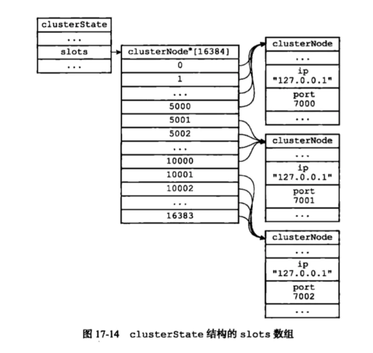

**方式二**

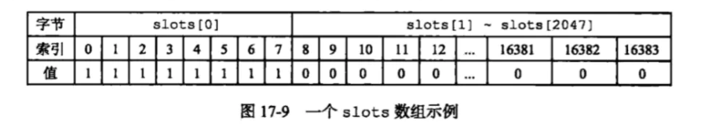

 分两种存储的用处：

- 方式一负责找某个槽是哪个节点负责。
- 方式二判断某一个节点负责哪些槽。

### 重新分片

将已经指派给节点的槽，重新执行新的节点。 

### 故障转移

和哨兵类似的。

**发现故障节点**

集群内的节点会向其他节点**发送PING命令**，检查是否在线。**规定时间回应以及半数怀疑**，再在集群中广播通知其他节点。

**从节点选举** 

集群内部节点之间完成投票选举

**故障的迁移**

新的主节点负责挂掉的节点的所有槽。

**集群模式和哨兵模式的区别**

- 监控者：哨兵模式监控权交给了**哨兵系统**，集群模式中是**服务器节点**自己做监控。
- 故障转移方面：哨兵模式是选举一个leader**哨兵节点**来处理，集群模式是在从节点中选举一个新的**服务器主节点**，来处理故障的转移。


## redis常见java客户端

 **jedis**

最老牌的Java客户端，提供了非常丰富的api，但是有一个问题，就是在多线程使用jedis实例访问redis的时候，是线程不安全的，所以需要使用连接池，每个线程使用不同的jedis实例>

**lettuce**

spring-redis默认的Java客户端，线程安全

**redission**

线程安全，提供了redis的分布式锁实现方式

建议：建议使用lettuce，如果有分布式上的需求，推荐使用redission

## redis分布式锁

简单的实现

加锁：使用setnx lock uuid px 10命令

如果**存在就不操作，如果不存在就设置**，**uuid**的作用用来**区分**是哪个**线程**加的锁，之后为这个**key增加一个过期时间，防止发生死锁**。

　　解锁：我一开始的想法是直接把redis上加锁的lock删除就可以，其实不行，比如：如果A加锁成功，但是由于A执行的时间太长了，导致锁过期了，B获取到了锁，如果A执行完了，准备释放锁，直接把lock删除了，但是这时候A的锁早就不存在了，就会有问题，所以在**解锁**的时候，要**先判断是不是自己加的锁**，**如果是**自己加的锁**再删除**，而且**整个过程要是一个原子操作**，使用**lua脚本**完成，脚本如下：

````
if redis.call("get", KEYS[1]) == ARGV[1]
then
    return redis.call("del", KEYS[1])
else
    return 0
end
````

但是使用redis单节点解锁有一个坏处就是，如果加锁的那个**redis节点挂**了，**可能会出问题**，所以后来redis的作者就提出了**redlock**。

在这篇文章中：http://martin.kleppmann.com/2016/02/08/how-to-do-distributed-locking.html，Martin批评说redis的**redlock**如此实现会有两个问题。

总结：

我个人认为，红锁的实现太锁复杂，因为要让redis的大多数节点都要加锁成功，如果是多线程**并发**的时候，都去竞争锁，会对**redis的性能造成影响**，同时Martin反驳所说的第一点其实是一个很大的问题，并没有很好的解决，所以**推荐使用zookeeper来实现分布式锁**。 

## Redis实现分布式锁

 **1.加锁** 

**setnx（key，1）**当一个线程执行setnx返回1，说明key原本不存在，该线程成功得到了锁，当其他线程执行setnx返回0，说明key已经存在，该线程抢锁失败。 

 **2.解锁** 

**del（key）**释放锁之后，其他线程就可以继续执行setnx命令来获得锁。 

**3.锁超时** 

setnx不支持超时参数，所以需要额外的指令。

**问题：**

**1. setnx和expire的非原子性**

设想一个极端场景，当某线程执行setnx，成功得到了锁：

setnx刚执行成功，还未来得及执行expire指令，节点1 Duang的一声挂掉了。

这样一来，这把锁就没有设置过期时间，变得“长生不老”，别的线程再也无法获得锁了。

怎么解决呢？setnx指令本身是不支持传入超时时间的，**Redis 2.6.12以上版本为set指令增加了可选参数，伪代码如下：set（key，1，30，NX）,这样就可以取代setnx指令**。

**2.超时后使用del 导致误删其他线程的锁**

又是一个极端场景，假如某线程成功得到了锁，并且设置的超时时间是30秒。

如果某些原因导致线程A执行的很慢很慢，过了30秒都没执行完，这时候锁过期自动释放，线程B得到了锁。

随后，线程A执行完了任务，线程A接着执行del指令来释放锁。但这时候线程B还没执行完，**线程A实际上删除的是线程B加的锁**。

怎么避免这种情况呢？**可以在del释放锁之前做一个判断，验证当前的锁是不是自己加的锁。**

至于具体的实现，**可以在加锁的时候把当前的线程ID当做value，并在删除之前验证key对应的value是不是自己线程的ID。**

但是，这样做又隐含了一个新的问题，**if判断和释放锁是两个独立操作，不是原子性**。

我们都是追求极致的程序员，所以这一块要用**Lua脚本**来实现：

````lua
String luaScript = 'if redis.call('get', KEYS[1]) == ARGV[1] then return redis.call('del', KEYS[1]) else return 0 end';

redisClient.eval(luaScript , Collections.singletonList(key), Collections.singletonList(threadId));
````

这样一来，**验证和删除过程就是原子操作了。**

**3.出现并发的可能性**

还是刚才第二点所描述的场景，**虽然我们避免了线程A误删掉key的情况，但是同一时间有A，B两个线程在访问代码块，仍然是不完美的。**

怎么办呢？我们**可以让获得锁的线程开启一个守护线程，用来给快要过期的锁“续航”。**

**当过去了29秒，线程A还没执行完，这时候守护线程会执行expire指令，为这把锁“续命”20秒。守护线程从第29秒开始执行，每20秒执行一次。**

**当线程A执行完任务，会显式关掉守护线程。**

**另一种情况，如果节点1 忽然断电，由于线程A和守护线程在同一个进程，守护线程也会停下。这把锁到了超时的时候，没人给它续命，也就自动释放了。**

## 高并发缓存失效

首页top 10, 由数据库加载到memcache缓存n分钟
微博中名人的content cache, 一旦不存在会大量请求不能命中并加载数据库
需要执行多个IO操作生成的数据存在cache中, 比如查询db多次

问题：大并发缓存失效
在大并发的场合，当cache失效时，大量并发同时取不到cache，会同一瞬间去访问db并回设cache，可能会给系统带来潜在的超负荷风险。我们曾经在线上系统出现过类似故障。 

在load db之前先add一个mutex key(互斥的键), mutex key add成功之后再去做加载db, 如果add失败则sleep之后重试读取原cache数据。为了防止死锁，mutex key也需要设置过期时间。 

参考

（好文）(也包含zk、mc、对比)使用Redis作为分布式锁的一些注意点 ：

https://www.cnblogs.com/gxyandwmm/p/9588383.html


## 参考资料

- Carlson J L. Redis in Action[J]. Media.johnwiley.com.au, 2013.
- [黄健宏. Redis 设计与实现 [M]. 机械工业出版社, 2014.](http://redisbook.com/index.html)
- [REDIS IN ACTION](https://redislabs.com/ebook/foreword/)
- [Skip Lists: Done Right](http://ticki.github.io/blog/skip-lists-done-right/)
- [论述 Redis 和 Memcached 的差异](http://www.cnblogs.com/loveincode/p/7411911.html)
- [Redis 3.0 中文版- 分片](http://wiki.jikexueyuan.com/project/redis-guide)
- [Redis 应用场景](http://www.scienjus.com/redis-use-case/)
- [Using Redis as an LRU cache](https://redis.io/topics/lru-cache)
- [Redis 6.0 新特性-多线程13连问！](https://www.cnblogs.com/madashu/p/12832766.html)
- [RDB 持久化](https://home.cnblogs.com/u/richiewlq/)
- [哨兵与集群](https://www.jianshu.com/p/d6d2325a5ec7)

