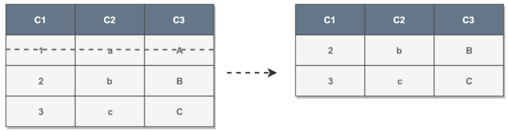
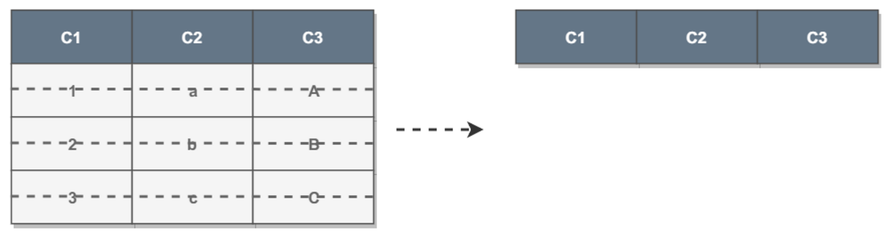
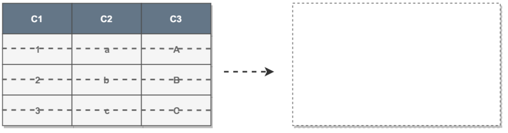

## DELETE、TRUNCATE 和 DROP 比较

DELETE 删除表中 WHERE 语句指定的数据。 

 TRUNCATE  truncate 清空表，相当于删除表中的所有数据。 

DROP 删除表结构。 

三个语句的影响度越来越大。

##### 事务

- DELETE 会被放到日志中以便进行回滚，**可以日志回滚**。
- TRUNCATE 和 DROP 立即生效，**不会放到日志中，也就不支持回滚。**

##### 删除空间

- DELETE 不会减少表和索引占用的空间；
- TRUNCATE 会将表和索引占用的空间恢复到初始值，索引的定义还在。
- DROP 表和索引占用的空间都释放。

##### 耗时

通常来说，影响度越大越耗时，DELETE < TRUNCATE < DROP。