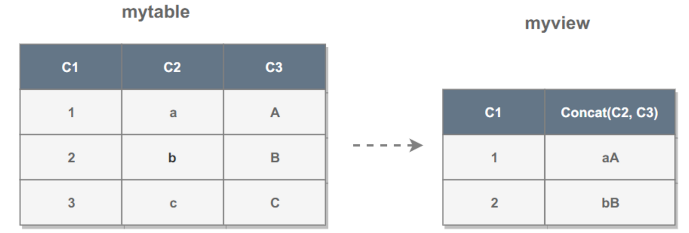

# 1. 是什么

视图是虚拟的表，本身不包含数据，数据都存储在原始表中。

# 2. 创建视图

```sql
CREATE VIEW myview AS
SELECT C1, Concat(C2, C3)
FROM mytable
WHERE C1 <= 2;
```





# 3. 有什么用

- 简化复杂的查询，比如复杂的连接查询；
- 只使用实际表的一部分数据；
- 通过只给用户访问视图的权限，保证数据的安全性；

# 4. 何时可以更新

因为视图不存储数据，所以更新视图需要去更新原始表。如果视图定义只依赖于一个原始表，就很容易进行更新操作。但如果视图定义中有以下操作，那么就不能进行视图的更新：

- 分组查询
- 连接查询
- 子查询
- Union
- 聚集函数
- DISTINCT
- 计算字段