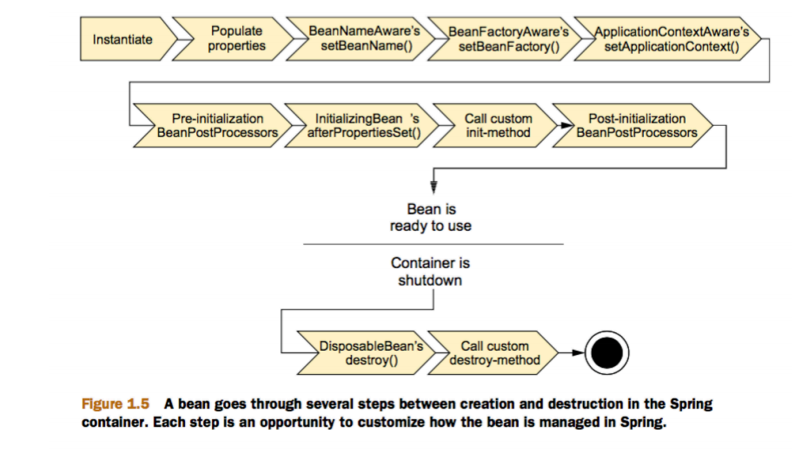
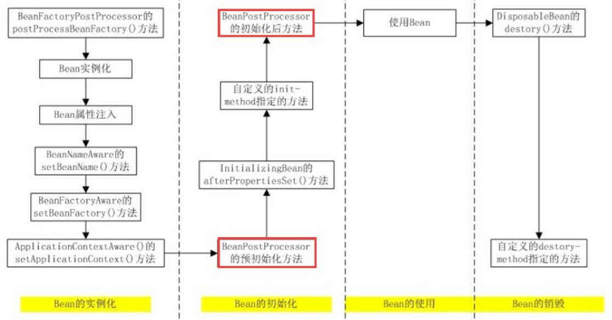
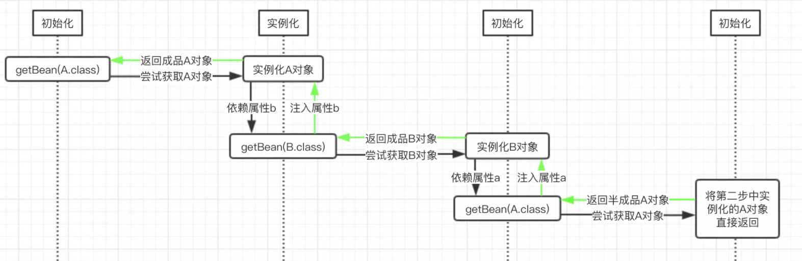

## Spring AOP 动态代理原理

JCSprout：https://github.com/crossoverJie/JCSprout/blob/master/MD/SpringAOP.md

## Spring AOP 注解

 1、开启注解模式

使用`@EnableAspectJAutoProxy`注解，开启注解AOP模式。

````
@Configuration
@EnableAspectJAutoProxy
public class Config {
}
````

2、写AOP配置类

 `@AspectJ` 

开启了上述配置之后，所有**在容器中**，**被`@AspectJ`注解的 bean** 都会被 Spring 当做是 **AOP 配置类**，称为一个 Aspect。 

注意：这里有个要注意的地方，**@AspectJ 注解只能作用于Spring Bean 上面**，所以你用 @Aspect 修饰的类要么是用 **@Component注解修饰**，要么是在 XML中配置过的。 

3、配置 Pointcut (增强的切入点)

```java
// 指定的方法
@Pointcut("execution(* testExecution(..))")
public void anyTestMethod() {}
```
4、配置Advice

**ProceedingJoinPoint pjp**

Aspect 类应该遵守**单一职责**原则，**不要把所有的Advice配置全部写在一个Aspect类里面。** 

````java
@Aspect
@Component
public class GlobalAopAdvice {
    
    @Before("ric.study.demo.aop.SystemArchitecture.dataAccessOperation()")
    public void doAccessCheck() {
        // ... 实现代码
    }
    
    // 这种最灵活，既能做 @Before 的事情，也可以做 @AfterReturning 的事情
    @Around("ric.study.demo.aop.SystemArchitecture.businessService()")
    public Object doBasicProfiling(ProceedingJoinPoint pjp) throws Throwable {
        //  target 方法执行前... 实现代码
        Object retVal = pjp.proceed();
        //  target 方法执行后... 实现代码
        return retVal;
    }
}
````

参考：

Spring AOP 注解：https://juejin.cn/post/6844903987062243341#heading-3

## Spring 中的单例 bean 的线程安全问题了解吗？

当多个线程操作同⼀个对象的时候，对这个对象的⾮静态成员变量的写操作会存在线程安全问题。

常⻅的有两种解决办法：

1、在Bean对象中尽量避免定义可变的成员变量（不太现实）。

2、在类中定义⼀个ThreadLocal成员变量，将需要的可变成员变量保存在 ThreadLocal 中（推荐的⼀种⽅式）。

## Spring 中的 bean ⽣命周期?

Bean 容器找到配置⽂件中 Spring Bean 的定义。

Bean 容器利⽤ Java Reflection API 创建⼀个Bean的实例。

如果涉及到⼀些属性值利⽤set()⽅法设置⼀些属性值。

如果 Bean 实现了BeanNameAware接⼝，调⽤setBeanName()⽅法，传⼊**Bean的名字**。

如果 Bean 实现了BeanClassLoaderAware接⼝，调⽤setBeanClassLoader()⽅法，传⼊**ClassLoader对象的实例**。

与上⾯的类似，如果实现了其他***.Aware接⼝**，就调⽤相应的⽅法。

如果有和加载这个 Bean 的 Spring 容器相关的BeanPostProcessor对象，执⾏**初始化前处理方法postProcessBeforeInitialization()⽅法**

如果Bean实现了InitializingBean接⼝，执⾏afterPropertiesSet()⽅法。

如果 **Bean 在配置⽂件中的定义包含 init-method** 属性，执⾏指定的⽅法。

如果有和加载这个 Bean的 Spring 容器相关的BeanPostProcessor对象，执**⾏初始化后处理postProcessAfterInitialization**()⽅法

当要**销毁 Bean** 的时候，如果 Bean 实现了**DisposableBean**接⼝，执⾏**destroy**()⽅法。

当要销毁 Bean 的时候，如果 Bean 在配置⽂件中的定义包含 **destroy-method** 属性，执⾏指定的⽅法。


图示：




参考：

JCSprout：https://github.com/crossoverJie/JCSprout/blob/master/MD/spring/spring-bean-lifecycle.md

https://www.cnblogs.com/zrtqsk/p/3735273.html

## spring在运行时给Bean怎么修改beanName?

BeanPostProcessor  它是一个接口，定义了两个方法： 

````java
public interface BeanPostProcessor {
	@Nullable //所有bean初始化之前触发该方法
	default Object postProcessBeforeInitialization(Object bean, String beanName) throws BeansException {
		return bean;
	}

	@Nullable //所有bean初始化之后触发该方法
	default Object postProcessAfterInitialization(Object bean, String beanName) throws BeansException {
		return bean;
	}
}
````

执行时期



参考：

https://www.cnblogs.com/hama1993/p/11198310.html


## SpringMVC ⼯作流程

图的⼀个**笔误**的⼩问题：

Spring MVC 的⼊⼝函数也就是前端控制器DispatcherServlet的作⽤是**接收请求，响应结果**。


1、客户端（浏览器）发送请求，直接请求到**DispatcherServlet**。

2、DispatcherServlet根据请求信息调⽤**HandlerMapping处理器映射器**，解析请求对应的**Handler**。

3、解析到对应的**Handler**（也就是我们平常说的**Controller控制器**）后，开始由**HandlerAdapter适配器**处理。

4、**HandlerAdapter会根据Handler来调⽤真正的处理器去处理请求**，并处理相应的业务逻辑。

5、 处理器处理完业务后，会返回⼀个**ModelAndView**对象给视图解析器，Model是返回的数据对象，View是个逻辑上的View。

6、 **ViewResolver视图解析器**会根据逻辑View查找实际的**View视图**。

7、 **DispaterServlet**把返回的Model传给View（**视图渲染**）。

8、 把View返回给请求者（浏览器）


##  Spring 框架中⽤到了哪些设计模式？

1、**⼯⼚**设计模式 : Spring使⽤⼯⼚模式通过**BeanFactory**、**ApplicationContext****创建 bean 对象**。

2、**代理**设计模式 : Spring **AOP** 功能的实现。

3、**单例**设计模式 : Spring 中的 **Bean** 默认都是单例的。

4、**包装器**设计模式 : 我们的项⽬需要连接多个数据库，⽽且不同的客户在每次访问中根据需要会去访问不同的数据库。这种模式让我们可以根据客户的需求能够动态切换不同的数据源。 、

Spring 中用到的包装器模式在类名上含有 **Wrapper或者Decorator**。这些类基本上都是动态地给一个对象添加一些**额外的职责** 

5、**观察者**模式: Spring 事件驱动模型就是观察者模式很经典的⼀个应⽤。

 事件机制的实现需要三个部分,事件源,事件,事件监听器 

 ApplicationEvent 抽象类 **[事件]** 

 ApplicationListener 接口 **[事件监听器]** 

 ApplicationContext 接口 **[事件源]** 

- **ContextStartedEvent**：ApplicationContext **启动后**触发的事件;
- **ContextStoppedEvent**：ApplicationContext **停止后**触发的事件;
- **ContextRefreshedEvent**：ApplicationContext **初始化或刷新**完成后触发的事件;
- **ContextClosedEvent**：ApplicationContext **关闭后**触发的事件。

6、**适配器**模式 :Spring **AOP 的增强**或**通知(Advice)**使⽤到了**适配器模式**，比如 `AdvisorAdapter`  ，**spring MVC** 中也是⽤到了适配器模式**适配Controller**。

Spring预定义的**通知**要通过对应的**适配器**，适配成 **MethodInterceptor** 接口(方法拦截器)类型的对象（如：`MethodBeforeAdviceInterceptor` 负责适配 `MethodBeforeAdvice`）。 

7、**模板方法**模板方法： jdbcTemplate、hibernateTemplate 


参考：

https://blog.csdn.net/caoxiaohong1005/article/details/80039656


## Spring 事务中的隔离级别

TransactionDefinition 接⼝中定义了五个表示隔离级别的常量：

1、TransactionDefinition.ISOLATION_**DEFAULT**: 使⽤后端数据库默认的隔离级别，Mysql默认采⽤的 REPEATABLE_READ隔离级别 Oracle 默认采⽤的 READ_COMMITTED隔离级别

2、TransactionDefinition.ISOLATION_READ_UNCOMMITTED:最低的隔离级别，允许读取尚未提交的数据变更，可能会导致脏读、幻读或不可重复读

3、TransactionDefinition.ISOLATION_READ_COMMITTED: 允许读取并发事务已经提交的数据，可以阻⽌脏读，但是幻读或不可重复读仍有可能发⽣

4、TransactionDefinition.ISOLATION_REPEATABLE_READ: 对同⼀字段的多次读取结果都是⼀致的，除⾮数据是被本身事务⾃⼰所修改，可以阻⽌脏读和不可重复读，但幻读仍有可能发⽣。

5、TransactionDefinition.ISOLATION_SERIALIZABLE: 最⾼的隔离级别，完全服从ACID的隔离级别。所有的事务依次逐个执⾏，这样事务之间就完全不可能产⽣⼲扰，也就是说，该级别可以防⽌脏读、不可重复读以及幻读。但是这将严重影响程序的性能。通常情况下也不会⽤到该级别。

## Spring 事务中哪⼏种事务传播⾏为?

**⽀持当前事务**的情况：

1、TransactionDefinition.PROPAGATION_REQUIRED：如果当前**存在**事务，则**加⼊**该事务；如果当前**没有**事务，则**创建**⼀个新的事务。

2、TransactionDefinition.PROPAGATION_SUPPORTS：如果当前存在事务，则加⼊该事务；如果当前**没有**事务，则**以⾮事务的⽅式继续运⾏**。

3、TransactionDefinition.PROPAGATION_MANDATORY：如果当前存在事务，则加⼊该事务；如果当前没有事务，则**抛出异常**。（mandatory：强制性）

**不⽀持当前事务**的情况：

4、TransactionDefinition.PROPAGATION_REQUIRES_NEW：**创建**⼀个新的事务，如果当前**存在**事务，则把当前事务**挂起**。

5、TransactionDefinition.PROPAGATION_NOT_SUPPORTED：**以⾮事务⽅式运⾏**，如果当前**存在**事务，则把当前事务**挂起**。

6、TransactionDefinition.PROPAGATION_NEVER：以**⾮事务⽅式运⾏**，如果当前**存在**事务，则**抛出异常**。

其他情况：

7、TransactionDefinition.PROPAGATION_NESTED：如果当前**存在**事务，则**创建**⼀个事务作为当前事务的**嵌套**事务来运⾏；如果当前**没有**事务，则**创建**该取值等价于TransactionDefinition.PROPAGATION_REQUIRED。


## @Transactional注解

@Transactional注解中如果不配置rollbackFor属性,那么事物只会在遇到**RuntimeException**的时候才会回滚,加上**rollbackFor=Exception.class,**可以让事物在遇到⾮运⾏时异常时也回滚。

参数：

**timeout**

- 事务的超时时间，单位为秒。

**readOnly**

- 该属性用于设置当前事务是否为只读事务，设置为true表示只读，false则表示可读写，默认值为false。如果一个事务只涉及到只读，可以设置为true。

参考：

很全：https://segmentfault.com/a/1190000022420927

https://www.ibm.com/developerworks/cn/java/j-master-spring-transactional-use/index.html

## 事务失效的情况

**1、数据库引擎不支持事务**

比如： MyISAM  

**2、没有被 Spring 管理**

类没有加@Service，但是方法加了 @Transactional

**3、方法不是 public 的**

以下来自 Spring 官方文档：

> When using proxies, you should apply the @Transactional annotation only to methods with public visibility. If you do annotate protected, private or package-visible methods with the @Transactional annotation, no error is raised, but the annotated method does not exhibit the configured transactional settings. Consider the use of AspectJ (see below) if you need to annotate non-public methods.

大概意思就是 `@Transactional` 只能用于 public 的方法上，否则事务不会失效，如果要用在非 public 方法上，可以开启 `AspectJ` 代理模式。 

**4、自身调用问题**

来看两个示例：

```text
@Service
public class OrderServiceImpl implements OrderService {

    public void update(Order order) {
        updateOrder(order);
    }

    @Transactional
    public void updateOrder(Order order) {
        // update order
    }

}
```

update方法上面没有加 `@Transactional` 注解，调用有 `@Transactional` 注解的 updateOrder 方法，updateOrder 方法上的事务管用吗？

再来看下面这个例子：

```text
@Service
public class OrderServiceImpl implements OrderService {

    @Transactional
    public void update(Order order) {
        updateOrder(order);
    }

    @Transactional(propagation = Propagation.REQUIRES_NEW)
    public void updateOrder(Order order) {
        // update order
    }

}
```

这次在 update 方法上加了 `@Transactional`，updateOrder 加了 `REQUIRES_NEW` 新开启一个事务，那么新开的事务管用么？

这两个例子的答案是：不管用！

原因很简单，**Spring在扫描Bean的时候会自动为标注了`@Transactional`注解的类生成一个代理类（proxy）**,当有注解的方法被调用的时候，**实际上是代理类调用的**，代理类在调用之前会开启事务，执行事务的操作。 但是同类中的方法互相调用，**相当于`this.B()`，**此时的B方法**并非是代理类调用**，而是直接通过原有的Bean直接调用，所以注解会失效。 

因为它们发生了自身调用，就调该类自己的方法，而没有经过 Spring 的代理类，默认只有在外部调用事务才会生效，这也是老生常谈的经典问题了。

这个的解决方案之一就是在的类中注入自己，用注入的对象再调用另外一个方法，这个不太优雅，另外一个可行的方案可以参考《[Spring 如何在一个事务中开启另一个事务？](https://link.zhihu.com/?target=https%3A//mp.weixin.qq.com/s/1TEBnmWynN4nwc6Q-oZfvw)》这篇文章。

**5、数据源没有配置事务管理器**

```text
@Bean
public PlatformTransactionManager transactionManager(DataSource dataSource) {
    return new DataSourceTransactionManager(dataSource);
}
```

如上面所示，当前**数据源若没有配置事务管理器**，那也是白搭！

**6、事务传播行为不支持事务**

来看下面这个例子：

```text
@Service
public class OrderServiceImpl implements OrderService {

    @Transactional
    public void update(Order order) {
        updateOrder(order);
    }

    @Transactional(propagation = Propagation.NOT_SUPPORTED)
    public void updateOrder(Order order) {
        // update order
    }

}
```

**Propagation.NOT_SUPPORTED：** 表示不以事务运行，当前若存在事务则挂起，详细的可以参考《[事务隔离级别和传播机制](https://link.zhihu.com/?target=https%3A//mp.weixin.qq.com/s/RTEMPBB6AFmmdj0uw1SDsg)》这篇文章。

都主动不支持以事务方式运行了，那事务生效也是白搭！

**7、异常在方法内部给catch了，没有抛出去。**

这个也是出现比较多的场景：

```text
// @Service
public class OrderServiceImpl implements OrderService {

    @Transactional
    public void updateOrder(Order order) {
        try {
            // update order
        } catch {

        }
    }

}
```

把异常吃了，然后又不抛出来，事务不回滚。

**8、异常类型不在回滚范围****

上面的例子再抛出一个异常：

```text
// @Service
public class OrderServiceImpl implements OrderService {

    @Transactional
    public void updateOrder(Order order) {
        try {
            // update order
        } catch {
            throw new Exception("更新错误");
        }
    }

}
```

这样事务也是不生效的，因为**默认回滚的是：RuntimeException**，如果你想触发其他异常的回滚，需要在注解上配置一下，如：

```text
@Transactional(rollbackFor = Exception.class)
```

这个配置仅限于 `Throwable` 异常类及其子类。


## Spring解决循环依赖

**对于“prototype”作用域bean, Spring 容器无法完成依赖注入，因为Spring 容器不进行缓 存“prototype”作用域的bean ，因此无法提前暴露一个创建中的bean 。** 

对于单例：

 **一个完整的对象包含两部分 ：当前对象实例化和对象属性的实例化。** 

 **Spring中，对象的实例化是通过反射**实现的， 而对象的属性则是在对象实例化之后通过一定的方式设置的。 




spring对循环依赖的处理有三种情况：

①**构造器的循环依赖：这种依赖spring是处理不了的**，直 接抛出BeanCurrentlylnCreationException异常。

②单例模式下的**setter循环依赖**：通过“三级缓存”处理循环依赖。 

**③非单例循环依赖：无法处理。**


spring单例对象的初始化大略分为三步：

1、createBeanInstance：**实例化**，其实也就是调用对象的**构造方法实例化对象**

2、populateBean：**填充属性**，这一步主要是**多bean的依赖属性进行填充**

**3、initializeBean：调用spring xml中的init 方法。**


三级缓存的作用分别是：

**singletonFactories** ： 进入实例化阶段的单例对象工厂的cache （三级缓存）

**earlySingletonObjects** ：完成实例化但是尚未初始化的，提前暴光的单例对象的Cache （二级缓存）

**singletonObjects**：完成初始化的单例对象的cache（一级缓存）


分析一下“A的某个field或者setter依赖了B的实例对象，同时B的某个field或者setter依赖了A的实例对象”这种循环依赖的情况。A首先完成了初始化的第一步，并且将自己提前曝光到singletonFactories中，此时进行初始化的第二步，发现自己依赖对象B，此时就尝试去get(B)，发现B还没有被create，所以走create流程，B在初始化第一步的时候发现自己依赖了对象A，于是尝试get(A)，尝试一级缓存singletonObjects(肯定没有，因为A还没初始化完全)，尝试二级缓存earlySingletonObjects（也没有），尝试三级缓存singletonFactories，**由于A通过ObjectFactory将自己提前曝光了，所以B能够通过ObjectFactory.getObject拿到A对象(虽然A还没有初始化完全**，但是总比没有好呀)，B拿到A对象后顺利完成了初始化阶段1、2、3，完全初始化之后将自己放入到一级缓存singletonObjects中。此时返回A中，A此时能拿到B的对象顺利完成自己的初始化阶段2、3，最终A也完成了初始化，进去了一级缓存singletonObjects中，而且更加幸运的是，由于B拿到了A的对象引用，所以B现在hold住的A对象完成了初始化。


参考：

https://zhuanlan.zhihu.com/p/84267654

https://juejin.cn/post/6844903806757502984

## spring的IOC底层实现原理 

（1）xml配置文件

（2）dom4j解析xml文件

（3）工厂设计模式

（4）反射

IOC（控制反转）,是思想，将原来在程序中手动创建对象UserService对象的控制权，交由Spring框架管理。

 **IOC容器实际上就是个Map（key，value）,Map 中存放的是各种对象。** 

简单的说，就是创建UserService对象的控制权被反转到Spring框架啦

DI(依赖注入),就是在Spring创建这个对象的过程中，将这个对象所依赖的属性注入进去。 


## Spring中BeanFactory与FactoryBean的区别

- `BeanFactory`是Spring容器的顶层接口，`FactoryBean`更类似于用户自定义的工厂接口
- 他们两个都是个工厂，但`FactoryBean`本质上还是一个Bean，也归`BeanFactory`管理

**BeanFactory是接口**，给具体的IOC容器的实现提供了规范。

**FactoryBean也是接口**，为IOC容器中Bean的实现提供了更加灵活的方式，FactoryBean在IOC容器的基础上给Bean的实现加上了一个简单工厂模式和装饰模式。我们可以在getObject()方法中灵活配置，其实在Spring源码中有很多FactoryBean的实现类。

区别：

BeanFactory是个Factory，也就是IOC容器或对象工厂，FactoryBean是个Bean。在Spring中，**所有的Bean都是由BeanFactory(也就是IOC容器)来进行管理的**。但对FactoryBean而言，**这个Bean不是简单的Bean，而是一个能生产或者修饰对象生成的工厂Bean,它的实现与设计模式中的工厂模式和修饰器模式类似**。 

参考

[BeanFactory 简介以及它 和FactoryBean的区别(阿里面试)](https://www.cnblogs.com/aspirant/p/9082858.html)

[Spring中BeanFactory与FactoryBean的区别](https://juejin.cn/post/6844903967600836621)

## Spring注解实现原理

【Spring如何使用注解机制完成**自动装配**】

Java实例构造时会调用默认父类无参构造方法，Spring正是利用了这一点，让"操作元素的代码"得以执行。 

【两种处理策略】

(1)类级别的注解：如@Component、@Repository、@Controller、@Service以及JavaEE6的@ManagedBean和@Named注解，都是添加在类上面的类级别注解。

Spring容器**根据注解的过滤规则扫描读取注解Bean定义类**，并将其注册到Spring IoC容器中。

(2)类内部的注解：如@Autowire、@Value、@Resource以及EJB和WebService相关的注解等，都是添加在类内部的字段或者方法上的类内部注解。

SpringIoC容器**通过Bean后置注解处理器解析Bean内部的注解。**

参考

[Spring注解实现原理](https://www.cnblogs.com/lsx1993/p/4793124.html)

## @Autowired与@Resource的用法和区别

补充：

参考：作者：秦子轩，链接：https://www.zhihu.com/question/39356740/answer/1297401530

1、处理这2个注解的**BeanPostProcessor**不一样CommonAnnotationBeanPostProcessor是处理

@ReSource注解的AutoWiredAnnotationBeanPostProcessor是处理@AutoWired注解的

**2、@Autowired只按照byType 注入；@Resource默认按byName自动注入，也提供按照byType 注入；**

3、属性：

@Autowired**按类型**装配依赖对象，默认情况下它**要求依赖对象必须存在**，如果**允许null**值，可以设置它**required**属性为false。如果我们想使用按**名称装配**，可以结合@**Qualifier**注解一起使用。

@Resource有两个中重要的属性：**name和type。**

name属性指定byName，如果没有指定name属性，当注解标注在字段上，即**默认取字段的名称作为bean名称寻找**依赖对象，当注解标注在属性的**setter方法**上，即**默认取属性名**作为bean名称寻找依赖对象。

需要注意的是，@Resource如果没有指定name属性，并且按照默认的名称仍然找不到依赖对象时， @Resource注解会**回退**到按类型装配。但**一旦指定了name属性，就只能按名称装配了**。

@Resource装配顺序：
1、如果同时指定了**name和type**，则从Spring上下文中找到唯一匹配的bean进行装配，**找不到则抛出异常**　

2、如果指定了**name**，则从上下文中查找名称（id）匹配的bean进行装配，**找不到则抛出异常**

3、如果指定了**type**，则从上下文中找到类型匹配的唯一bean进行装配，**找不到或者找到多个，都会抛出异常**

4、如果**既没有指定name，又没有指定type**，则自动按照**byName**方式进行装配；如果没有匹配，则**回退**为一个原始类型进行匹配，如果匹配则自动装配；

推荐使用**@Resource注解在字段上，这样就不用写setter方法了**.并且这个注解是属于J2EE的，减少了与Spring的耦合,这样代码看起就比较优雅 。


以下参考：day2的anno_ioc

```java
/**
 * 账户的业务层实现类
 *
 * 曾经XML的配置：
 *  <bean id="accountService" class="com.itheima.service.impl.AccountServiceImpl"
 *        scope=""  init-method="" destroy-method="">
 *      <property name=""  value="" | ref=""></property>
 *  </bean>
 *
 * 用于创建对象的
 *      他们的作用就和在XML配置文件中编写一个<bean>标签实现的功能是一样的
 *      Component:
 *          作用：用于把当前类对象存入spring容器中
 *          属性：
 *              value：用于指定bean的id。当我们不写时，它的默认值是当前类名，且首字母改小写。
 *      Controller：一般用在表现层
 *      Service：一般用在业务层
 *      Repository：一般用在持久层
 *      以上三个注解他们的作用和属性与Component是一模一样。
 *      他们三个是spring框架为我们提供明确的三层使用的注解，使我们的三层对象更加清晰
 *
 *
 * 用于注入数据的
 *      他们的作用就和在xml配置文件中的bean标签中写一个<property>标签的作用是一样的
 *      Autowired:
 *          作用：自动按照类型注入。只要容器中有唯一的一个bean对象类型和要注入的变量类型匹配，就可以注入成功
 *                如果ioc容器中没有任何bean的类型和要注入的变量类型匹配，则报错。
 *                如果Ioc容器中有多个类型匹配时：
 *          出现位置：
 *              可以是变量上，也可以是方法上
 *          细节：
 *              在使用注解注入时，set方法就不是必须的了。
 *      Qualifier:
 *          作用：在按照类中注入的基础之上再按照名称注入。它在给类成员注入时不能单独使用。但是在给方法参数注入时可以（稍后我们讲）
 *          属性：
 *              value：用于指定注入bean的id。
 *      Resource
 *          作用：直接按照bean的id注入。它可以独立使用
 *          属性：
 *              name：用于指定bean的id。
 *      以上三个注入都只能注入其他bean类型的数据，而基本类型和String类型无法使用上述注解实现。
 *      另外，集合类型的注入只能通过XML来实现。
 *
 *      Value
 *          作用：用于注入基本类型和String类型的数据
 *          属性：
 *              value：用于指定数据的值。它可以使用spring中SpEL(也就是spring的el表达式）
 *                      SpEL的写法：${表达式}
 *
 * 用于改变作用范围的
 *      他们的作用就和在bean标签中使用scope属性实现的功能是一样的
 *      Scope
 *          作用：用于指定bean的作用范围
 *          属性：
 *              value：指定范围的取值。常用取值：singleton prototype
 *
 * 和生命周期相关 了解
 *      他们的作用就和在bean标签中使用init-method和destroy-methode的作用是一样的
 *      PreDestroy
 *          作用：用于指定销毁方法
 *      PostConstruct
 *          作用：用于指定初始化方法
 */
@Service("accountService")
//@Scope("prototype")
public class AccountServiceImpl implements IAccountService {

//    @Autowired
//    @Qualifier("accountDao1")
    @Resource(name = "accountDao2")
    private IAccountDao accountDao = null;

    @PostConstruct
    public void  init(){
        System.out.println("初始化方法执行了");
    }

    @PreDestroy
    public void  destroy(){
        System.out.println("销毁方法执行了");
    }

    public void  saveAccount(){
        accountDao.saveAccount();
    }
}
```

## Spring 全配置相关注解

参考：day2的annoioc_withoutxml

```java
/**
 * 该类是一个配置类，它的作用和bean.xml是一样的
 * spring中的新注解
 * Configuration
 *     作用：指定当前类是一个配置类
 *     细节：当配置类作为AnnotationConfigApplicationContext对象创建的参数时，该注解可以不写。
 * ComponentScan
 *      作用：用于通过注解指定spring在创建容器时要扫描的包
 *      属性：
 *          value：它和basePackages的作用是一样的，都是用于指定创建容器时要扫描的包。
 *                 我们使用此注解就等同于在xml中配置了:
 *                      <context:component-scan base-package="com.itheima"></context:component-scan>
 *  Bean
 *      作用：用于把当前方法的返回值作为bean对象存入spring的ioc容器中
 *      属性:
 *          name:用于指定bean的id。当不写时，默认值是当前方法的名称
 *      细节：
 *          当我们使用注解配置方法时，如果方法有参数，spring框架会去容器中查找有没有可用的bean对象。
 *          查找的方式和Autowired注解的作用是一样的
 *  Import
 *      作用：用于导入其他的配置类
 *      属性：
 *          value：用于指定其他配置类的字节码。
 *                  当我们使用Import的注解之后，有Import注解的类就父配置类，而导入的都是子配置类
 *  PropertySource
 *      作用：用于指定properties文件的位置
 *      属性：
 *          value：指定文件的名称和路径。
 *                  关键字：classpath，表示类路径下
 */
//@Configuration
@ComponentScan("com.itheima")
@Import(JdbcConfig.class)
@PropertySource("classpath:jdbcConfig.properties")
public class SpringConfiguration {
}
```

应用

```java
/**
 * 和spring连接数据库相关的配置类
 */
public class JdbcConfig {

    @Value("${jdbc.driver}")
    private String driver;

    @Value("${jdbc.url}")
    private String url;

    @Value("${jdbc.username}")
    private String username;

    @Value("${jdbc.password}")
    private String password;

    /**
     * 用于创建一个QueryRunner对象
     * @param dataSource
     * @return
     */
    @Bean(name="runner")
    @Scope("prototype")
    public QueryRunner createQueryRunner(@Qualifier("ds2") DataSource dataSource){
        return new QueryRunner(dataSource);
    }

    /**
     * 创建数据源对象
     * @return
     */
    @Bean(name="ds2")
    public DataSource createDataSource(){
        try {
            ComboPooledDataSource ds = new ComboPooledDataSource();
            ds.setDriverClass(driver);
            ds.setJdbcUrl(url);
            ds.setUser(username);
            ds.setPassword(password);
            return ds;
        }catch (Exception e){
            throw new RuntimeException(e);
        }
    }

    @Bean(name="ds1")
    public DataSource createDataSource1(){
        try {
            ComboPooledDataSource ds = new ComboPooledDataSource();
            ds.setDriverClass(driver);
            ds.setJdbcUrl("jdbc:mysql://localhost:3306/eesy02");
            ds.setUser(username);
            ds.setPassword(password);
            return ds;
        }catch (Exception e){
            throw new RuntimeException(e);
        }
    }
}
```


