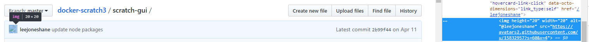
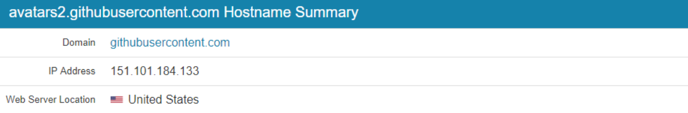

# 解决方法：

下边有详细的解决过程，这里直接说解决方法，修改自己电脑上的 hosts 文件，添加下边的地址映射，都加，解决 GitHub 多种图片显示问题。添加后刷新下网页就可以了。

如果是 Windows

> C:\Windows\System32\drivers\etc\hosts 

如果是 Mac

> mac 修改 hosts: sudo vim /etc/hosts 

````
 # GitHub Start

140.82.113.3      github.com 
140.82.114.20     gist.github.com 


151.101.184.133    assets-cdn.github.com 
151.101.184.133    raw.githubusercontent.com 
151.101.184.133    gist.githubusercontent.com 
151.101.184.133    cloud.githubusercontent.com 
151.101.184.133    camo.githubusercontent.com 
151.101.184.133    avatars0.githubusercontent.com 
199.232.68.133     avatars0.githubusercontent.com 
199.232.28.133     avatars1.githubusercontent.com 
151.101.184.133    avatars1.githubusercontent.com 
151.101.184.133    avatars2.githubusercontent.com 
199.232.28.133     avatars2.githubusercontent.com 
151.101.184.133    avatars3.githubusercontent.com 
199.232.68.133     avatars3.githubusercontent.com 
151.101.184.133    avatars4.githubusercontent.com 
199.232.68.133     avatars4.githubusercontent.com 
151.101.184.133    avatars5.githubusercontent.com 
199.232.68.133     avatars5.githubusercontent.com 
151.101.184.133    avatars6.githubusercontent.com 
199.232.68.133     avatars6.githubusercontent.com 
151.101.184.133    avatars7.githubusercontent.com 
199.232.68.133     avatars7.githubusercontent.com 
151.101.184.133    avatars8.githubusercontent.com 
199.232.68.133     avatars8.githubusercontent.com 
# GitHub End
````


# 解决的过程：

### 一、问题

比如随便打开一个项目，图片都不能显示，头像也没了。

浏览器请求报错`ERR_CERT_COMMON_NAME_INVALID` 就是用一个错误的域名访问了某个节点的 `https` 资源。导致这个错误的原因，基本是：

1. dns 污染
2. host 设置错误
3. 官方更新了 dns，但是 dns 缓存没有被更新，导致错误解析。

### 二、解决过程

主要思路就是使用本地 `hosts` 文件对网站进行域名解析，一般的 `DNS` 问题都可以通过修改 `hosts` 文件来解决，`github` 的 `CDN` 域名被污染问题也不例外，同样可以通过修改 `hosts` 文件解决，将域名解析直接指向 `IP` 地址来绕过 `DNS` 的解析，以此解决污染问题。

#### 2.1 找到 URL

打开 `github` 任意未显示图片的网页，使用元素选择器（`Ctrl+Shift+C`）放在显示不了的图片上，或者在无法显示的图片上右键 - 检查元素，定位到该图片的标签，那么你得到了它的 URL，叫做 `src` 属性。

比如：





在右面把它的网址复制粗来：

```
https://avatars2.githubusercontent.com/u/15832957?s=60&v=4
```

#### 2.2 获取 IP 地址

得到上述网址以后打开 [IPAddress.com](https://www.ipaddress.com/) 这个网站，在搜索框输入它的域名，就是 `https://` 到 `com` 那一部分，俗称二级域名。





其他如果有挂掉的图片一样使用此方法进行一一映射即可。

#### 2.3 修改 hosts

本人使用的是 `windows` 系统，所以打开：`C:\Windows\System32\drivers\etc\hosts`

在文件末尾添加如下映射，这个映射更新日期：**2020年06月20日**

```shell
# GitHub Start 
140.82.113.3      github.com
140.82.114.20     gist.github.com

151.101.184.133    assets-cdn.github.com
151.101.184.133    raw.githubusercontent.com
151.101.184.133    gist.githubusercontent.com
151.101.184.133    cloud.githubusercontent.com
151.101.184.133    camo.githubusercontent.com
151.101.184.133    avatars0.githubusercontent.com
199.232.68.133     avatars0.githubusercontent.com
199.232.28.133     avatars1.githubusercontent.com
151.101.184.133    avatars1.githubusercontent.com
151.101.184.133    avatars2.githubusercontent.com
199.232.28.133     avatars2.githubusercontent.com
151.101.184.133    avatars3.githubusercontent.com
199.232.68.133     avatars3.githubusercontent.com
151.101.184.133    avatars4.githubusercontent.com
199.232.68.133     avatars4.githubusercontent.com
151.101.184.133    avatars5.githubusercontent.com
199.232.68.133     avatars5.githubusercontent.com
151.101.184.133    avatars6.githubusercontent.com
199.232.68.133     avatars6.githubusercontent.com
151.101.184.133    avatars7.githubusercontent.com
199.232.68.133     avatars7.githubusercontent.com
151.101.184.133    avatars8.githubusercontent.com
199.232.68.133     avatars8.githubusercontent.com

# GitHub End
```

然后保存文件就 OK 了，至于无法保存，没有修改权限，鼠标右键 - 属性 - 安全 - 修改权限；或将 `hosts` 文件复制一份，修改之后，复制到原文件夹替换！

#### 2.3 刷新页面

正常到这里再次刷新 GitHub 页面就可以了。

### 三、其他问题

1、DNS 刷新 不及时

可以使用 `ipconfig/flush` 对本地 DNS 缓存进行一次刷新，如果遇到网络异常，可能是 DNS 缓存的问题，刷新一下，步骤：

1. windows 开始→运行→输入：CMD 按回车键，打开命令提示符窗口。
2. 再输入： ipconfig /flushdns 回车，执行命令，可以重建本地 DNS 缓存。

再附上几个命令：

```shell
ipconfig /displaydns # 显示dns缓存 

ipconfig /flushdns # 刷新DNS记录 

ipconfig /renew # 重请从DHCP服务器获得IP 
12345
```

2、github 的 pdf 显示 

这种方法暂时还是不支持 github 的 README 把 pdf 显示出来。


### 四、方法总结

如果图片再次不能显示，只需要及时更新 IP 就行。

解决方法也简单，查找 具体的 域名与 ip 地址，比如 **raw.githubusercontent.com** 的 ip，并将其添加至系统 hosts 文件即可。

### 五、书写格式

README.md 关联图片的图片地址的参考格式： 

````
https://github.com/用户名/repository仓库名/blob/分支名master/图片文件夹名称/***.png or***.jpg 
具体可能会有些许不一致，但会差不多。
````

相对路径的参考格式：

````
 
````


