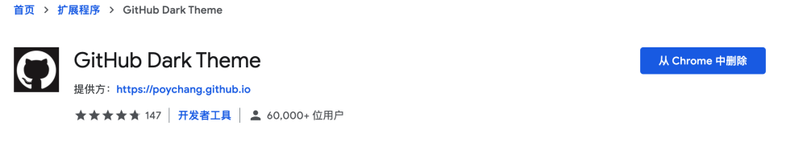

## 1、一键生成 Github 简历

网址：http://resume.github.io/ 

校招的时候，个人信息那里就放了一个在线的 Github 简历 	

比如：输入用户名后，访问：https://resume.github.io/?Code-Jackwen

## 2、个性化 Github 首页

只需要创建一个和你的 Github 账户同名的仓库，然后自定义`README.md`的内容即可。 

## 3、自定义项目徽章

https://shields.io/ 

徽章：静态、动态的都可以，显示仓库的 start 数，等等。

## 4、Github 表情

来这里找：www.webfx.com/tools/emoji-cheat-sheet/

类似于如图：

## 5、高效阅读 Github 项目的源代码

- 5.1 Chrome 插件 Octotree

- 使用了 Octotree 之后网页侧边栏会按照树形结构展示项目，为我们带来 IDE 般的阅读源代码的感受。 

- 

- 5.2 Chrome 插件 SourceGraph

- 5.3 搜索插件简悦，支持各种网站，不止github的浏览转换。

- 

- 5.4 克隆项目到本地

- 5.5 前端项目

- 看的是前端项目的话，还可以考虑使用 https://stackblitz.com/ 这个网站。

- 这个网站会提供一个类似 VS Code 的在线 IDE。

## 6、一键开启 Github 夜间模式

 通过 **GitHub Dark Theme** 这个 Chrome 插件你可以将 Github 的主题变为夜间样式。 

## 7、扩展 Github 的功能

**Enhanced GitHub** 这个 Chrome 插件可以可视化你的 Github 仓库中文件的大小，并可以快速下载单个文件。 

## 8、自动为 Markdown 文件生成目录

通过 VS Code 的 **Markdown Preview Enhanced** 这个插件就可以了。 

## 9、 Github 搜索

Github 搜索技巧不必要记网上那些文章说的各种命令啥的，没啥用。用的最多的还是关键字搜索以及 Github 自带的筛选功能。
