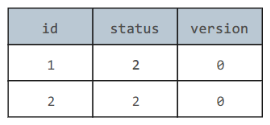

# 知识点：

## 1. 并发控制

##### 事务：

它是一组操作，并且满足 ACID 特性。

多个事务并发执行可以看成是多个任务线程的并发执行，因此并发执行多个事务时，为了保证每个事务都具有 ACID 特性，也同样需要使用并发控制。 


##### 悲观和乐观并发控制

是主要的两种并发控制方法，应该注意到它们都是思想，而不是具体的实现。


## 2、悲观并发控制

### synchronized  实现

Java 中的 synchronized  就是悲观锁思想的体现。

### 数据库中的实现

在数据库管理系统中提供了两种锁：共享锁（S）和排它锁（X），也称为**读锁和写锁**。

- 一个事务对数据 A 加了 X 锁，就可以对 A 进行读取和更新，加锁期间其它事务不能对 A 加任何锁。
- 一个事务对数据 A 加了 S 锁，可以对 A 进行读取操作，但是不能进行更新操作，加锁期间其它事务能对 A 加 S 锁，但是不能加 X 锁。

##### 悲观评价

悲观并发控制能够保证线程安全性，但是无论共享数据是否真的会出现竞争，它都要进行加锁。

而加锁操作需要涉及用户态核心态转换、维护锁计数器和检查是否有被阻塞的线程需要唤醒等操作，代价非常高。

所以悲观并发控制只适合**共享数据经常出现竞争的场景**，但是对于共享数据基本不会出现竞争的场景，它花费了很多不必要的锁开销。 


## 3. 乐观并发控制

针对悲观并发控制对于共享数据基本不会出现竞争的情况下也需要加锁的问题，出现了乐观并发控制。

它保持乐观的态度，认为并发执行过程不会对共享数据出现竞争问题。

它只在修改数据之后检测一下修改期间该共享数据有没有出现竞争问题，也就是说有没有其它线程也同样修改了该共享数据，如果没有则修改成功，如果有则需要重做。 

### CAS 实现

CAS 指令是硬件支持的操作：比较并交换（Compare-and-Swap）。

Java 中的 AtomicInteger 使用 CAS 来实现。

底层要追溯到 unsafe 类，类中很多 native 修饰的方法。

AtomicInteger 的核心代码是 getAndAddInt()，其中 var1 是内存地址 V，getIntVolatile(var1, var2) 得到旧值 A，而 var5 + var4 是新值 B。可以看到在检测到冲突时，AtomicInteger 采用不断重试的方式，直到不再发生冲突为止。 

核心代码：

````java
public final int getAndAddInt(Object var1, long var2, int var4) {
    int var5;
    do {
        var5 = this.getIntVolatile(var1, var2);
    } while(!this.compareAndSwapInt(var1, var2, var5, var5 + var4));
    return var5;
}
````

##### CAS 存在的 ABA 问题

如果一个变量初次读取的时候是 A 值，它的值被改成了 B，后来又被改回为 A，那 CAS 操作就会误认为它从来没有被改变过，这就是 ABA 问题。

##### ABA 问题的解决

J.U.C 包提供了一个带有标记的原子引用类 AtomicStampedReference 来解决这个问题，它可以通过控制变量值的版本来保证 CAS 的正确性。

 

### 版本号实现

在数据库管理系统中，可以为表增加一个 version 列，那么每个记录就可以维护一个版本号，每次修改时版本号加 1。

在对记录进行修改之前先读出 version，并在修改后判断 version 是否发生改变。如果没有发生改变就表示没有发生冲突，执行提交，否则回滚。



```sql
start transaction;
select version from t_goods where id=#{id};
update t_goods set status=2,version=version+1 where id=#{id} and version=version;
commit;
```

# 面试题：

##  Java 中实现线程的主要有哪些方式？

线程有三种方式：

 1、继承 Thread 类，并重写 Thread 类的 run () 方法，创建子类对象（即线程对象），调用线程对象的 start () 方法来启动该线程。


2、实现 Runnable 接口 并重写该接口的 run () 方法，并重写 run () 方法。创建该 Runnable 实现类的实例，并将此实例作为 Thread 的构造函数中的参数来创建 Thread 对象，调用线程对象的 start () 方法来启动该线程。


3、 使用 Callable 和 Future 创建 Callable 接口的实现类，并实现 call () 方法，该方法有返回值；

创建 Callable 实现类的实例，使用 FutureTask 构造函数来包装 Callable 对象，并启动线程；调用 FutureTask 对象的 get () 方法返回子线程执行结束后的返回值。 

### 实现 Callable 接口

与 Runnable 相比，Callable 可以有返回值，返回值通过 FutureTask 进行封装。

```java
public class MyCallable implements Callable<Integer> {
    public Integer call() {
        return 123;
    }
}
```

```java
public static void main(String[] args) throws ExecutionException, InterruptedException {
    MyCallable mc = new MyCallable();
    FutureTask<Integer> ft = new FutureTask<>(mc);
    Thread thread = new Thread(ft);
    thread.start();
    System.out.println(ft.get());
}
```


## 线程不安全的原因？

在操作系统中，线程是不拥有资源的，进程是拥有资源的。而线程是由进程创建的，一个进程可以创建多个线程，这些线程共享着进程中的资源。

其次是内存中变量争用的覆盖情况举例。


## 线程安全如何实现？

## 一、悲观锁

需要将线程挂起，**互斥同步**，悲观锁的具体体现：synchronized 关键字，ReentrantLock Api 。

##### synchronized 的原理？

synchronized 是 JVM 层面的关键字 Java 没有提供这两个字节码的接口，但是 synchronized 会在块的前后调用两个字节码指令，monitorenter 和 monitorexit ，分别代表加锁，解锁，依赖于 monitor 对象，而 wait() 和 notify() 方法也依赖，因此只能在同步代码块或者同步方法中调用。

##### ReentrantLock 和 synchronized 区别？

1、原始构成

ReentrantLock 是 Api 层面，是类，字节码是 new。

synchronized 是 JVM 层面，是关键字，字节码是 monitorenter 和 monitorexit。

2、加锁解锁的用法

synchronize 加锁解锁是隐式的，只要块内的代码执行完，就会释放当前的锁；

ReentrantLock 需要显式的调用 unlock () 方法手动释放，所以经常搭配 try/finally 方法（忘记在 finally 中 unlock 是非常危险的） 

3、等待是否可以等待中断

即在当前持有锁线程长期不释放锁的情况下，正在等待的线程可以选择放弃等待选择处理其他的事情。

ReentrantLock 可以，调用 tryLock（Long timeout，TimeUnit unit）用来设置超时，调用 interrupt（）进行中断。

synchronized 不可以，只有正常运行完或者抛出异常结束。

4、是否公平锁

synchronized 非公平。

ReentrantLock 默认非公平，可以控制构造函数参数实现公平锁，公平锁的吞吐量很受影响，即先来后到，按申请的顺序获得锁。 

5、可以绑定多个条件。

ReentrantLock 可以绑定多种情况 Condition，多线程情况下可以精确唤醒某一个，更为灵活。

synchronized 不可绑定多种情况 Condition，多线程情况唤醒一个线程或者是全部线程，对应 notify、notifyAll 方法。

##### synchronized  使用注意点？

1、读写都加，一种错误的思想是只要对写数据的方法加锁。

2、加锁时将方法中不影响共享状态且执行时间比较长的代码分离出去，以代码块的形式最好提高性能。

3、读操作和写操作必须使用同样的锁对象。

## 二、乐观锁

基于冲突检测的并发策略，不需要将线程挂起，因此又被成为**非阻塞同步**。 

##### CAS

全称 Compare And Swap，通过 Unsafe 类提供。有三个操作数，内存位置、旧的预期值、和新的值；当且仅当内存地址 V 符合预期值 A 时，执行将值更新为新的预期值 B。 存在的问题：“ABA” 情况，即原值为 A，但在检测之前发生了改变，变成了 B，同时也在检测时变回了 A；即不能保证这个值没有被其他线程更改过。 

## 三、无状态对象

无状态对象一定是线程安全的，因为不会影响到其他线程。

## 四、不可变对象 

可以使用 final 修饰的对象保证线程安全，由于 final 修饰的引用型变量 (除 String 外) 不可变是指引用不可变，但其指向的对象是可变的，所以此类必须安全发布，也即不能对外提供可以修改 final 对象的接口。 

## 五、ThreadLocal 

每个 Thread 类中都有一个变量 ThreadLocalMap，默认是为 null 的。它将为每一个线程创立一个该变量的副本。这样线程之间就不存在数据征用的问题了。

ThreadLocal  适用情况？

1、数据库的 Connection 连接。

2、WEB 中的 “一个请求对应一个服务器线程”，生产者 - 消费者问题，不同线程不共享所以对变量改动时就不需要考虑线程间同步的问题。当 web 端采用无状态写法时（比如 stateless session bean 和 spring 默认的 singleton），就可以考虑把一些变量放在 ThreadLocal 中。有两个方法 A 和 B 都要用到变量 userId，又不想传来传去，一个很自然的想法就是把 userId 设为成员变量，但是在无状态时，这样做就很可能有问题，因为多个 request 在同时使用同一个 instance，userId 在不同 request 下值是不一样的，就会出现逻辑错误，但由于同一个 request 下一般都是处于同一个线程，如果放在 ThreadLocal 的话，这个变量就被各个方法共享了，而又不影响其他 request。

