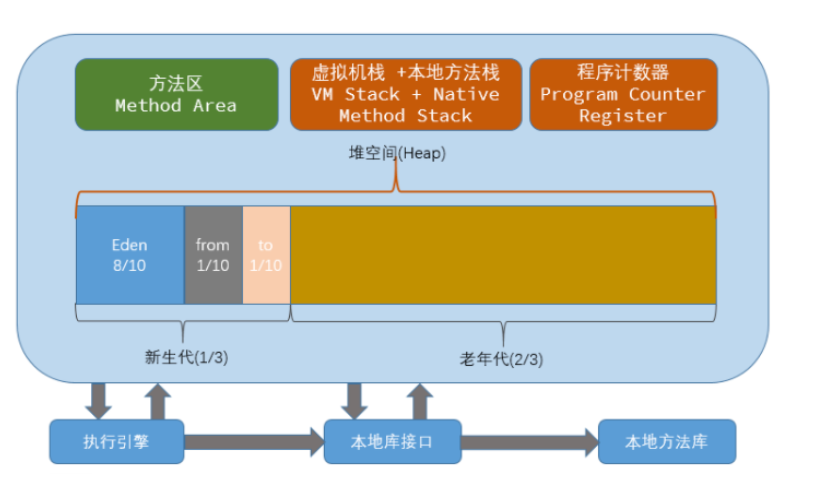
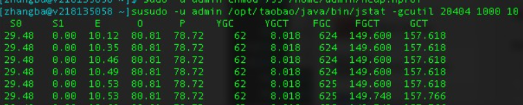
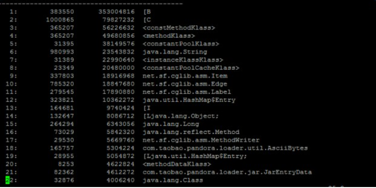

# Java 虚拟机
<!-- GFM-TOC -->
* [Java 虚拟机](#java-虚拟机)
    * [一、运行时数据区域](#一运行时数据区域)
        * [程序计数器](#程序计数器)
        * [Java 虚拟机栈](#java-虚拟机栈)
        * [本地方法栈](#本地方法栈)
        * [堆](#堆)
        * [方法区](#方法区)
        * [运行时常量池](#运行时常量池)
        * [直接内存](#直接内存)
    * [二、垃圾收集](#二垃圾收集)
        * [判断一个对象是否可被回收](#判断一个对象是否可被回收)
        * [引用类型](#引用类型)
        * [垃圾收集算法](#垃圾收集算法)
        * [垃圾收集器](#垃圾收集器)
    * [三、内存分配与回收策略](#三内存分配与回收策略)
        * [Minor GC 和 Full GC](#minor-gc-和-full-gc)
        * [内存分配策略](#内存分配策略)
        * [Full GC 的触发条件](#full-gc-的触发条件)
    * [四、类加载机制](#四类加载机制)
        * [类的生命周期](#类的生命周期)
        * [类加载过程](#类加载过程)
        * [类初始化时机](#类初始化时机)
        * [类与类加载器](#类与类加载器)
        * [类加载器分类](#类加载器分类)
        * [双亲委派模型](#双亲委派模型)
        * [自定义类加载器实现](#自定义类加载器实现)
    * [参考资料](#参考资料)
<!-- GFM-TOC -->


本文大部分内容参考   **周志明《深入理解 Java 虚拟机》**  ，想要深入学习的话请看原书。

## 一、运行时数据区域

###  JVM内存模型图

<div align="center">  </div><br>


参考：

图片：[JVM年轻代，老年代，永久代详解](https://www.cnblogs.com/jichi/p/12580906.html)

### 程序计数器

**记录正在执行**的虚拟机**字节码指令的地址**（如果正在执行的是**本地方法**则为**空**）。

### Java 虚拟机栈

每个 Java **方法**在执行的同时会创建一个**栈帧**用于存储**局部变量表**、**操作数栈**、**常量池引用**等信息。从方法调用直至执行完成的过程，对应着一个栈帧在 Java 虚拟机栈中**入栈**和**出栈**的过程。

<div align="center">  </div><br>
可以通过 **-Xss** 这个虚拟机参数来指定**每个线程的 Java 虚拟机栈内存大小**，在 JDK 1.4 中默认为 256K，而在 JDK **1.5+ 默认为 1M**：

```java
java -Xss2M HackTheJava
```

该区域可能抛出以下异常：

- 当**线程**请求的栈**深度**超过最大值，会抛出 StackOverflowError 异常；
- 栈进行动态扩展时如果无法申请到足够**内存**，会抛出 OutOfMemoryError 异常。

### 本地方法栈

本地方法栈与 Java 虚拟机栈类似，它们之间的区别只不过是本地方法栈为本地方法服务。

**本地方法**一般是用其它语言（**C、C++ 或汇编语言等**）编写的，并且被编译为基于**本机硬件和操作系统的程序**，对待这些方法需要特别处理。

<div align="center">  </div><br>
### 堆

所有**对象都在这里分配内存**，是垃圾收集的主要区域（"**GC 堆**"）。

现代的垃圾收集器基本都是采用分代收集算法，其主要的思想是针对不同类型的对象采取不同的垃圾回收算法。可以将堆分成两块：

- **新生代**（Young Generation）
- **老年代**（Old Generation）

**堆不需要连续内存**，并且可以**动态增加**其内存，增加失败会抛出 **OutOfMemoryError** 异常。

可以通过 **-Xms 和 -Xmx** 这两个虚拟机参数来指定一个程序的**堆内存大小**，第一个参数设置**初始值**，第二个参数设置**最大值**。

```java
java -Xms1M -Xmx2M HackTheJava
```

### 方法区

用于存放已被加载的**类信息**、**常量**、**静态变量**、即时编译器编译后的代码等数据。

**和堆一样不需要连续的内存**，并且可以动态扩展，动态扩展失败一样会抛出 **OutOfMemoryError** 异常。

对这块区域进行垃圾回收的主要目标是对**常量池的回收**和对**类的卸载**，但是一般比较**难实现**。

**HotSpot** 虚拟机把它当成**永久代**来进行垃圾回收。但很难确定永久代的大小，因为它受到很多因素影响，并且每次 Full GC 之后永久代的大小都会改变，所以经常会抛出 OutOfMemoryError 异常。为了更容易管理方法区，从 **JDK 1.8 开始，移除永久代**，并把方法区移至**元空间**，它位于**本地内存中**，而不是虚拟机内存中。

**方法区**是一个 **JVM 规范**，**永久代与元空间**都是其一种**实现方式**。在 **JDK 1.8** 之后，原来永久代的数据被分到了堆和元空间中。**元空间**存储**类的元信息**，**静态变量和常量池**等放入**堆**中。

### 运行时常量池

运行时常量池是**方法区的一部分**。

Class 文件中的常量池（编译器生成的**字面量**和**符号引用**）会在**类加载后被放入这个区域。**

除了在**编译期生成**的常量，还允许**动态生成**，例如 String 类的 intern()。

### 直接内存

在 JDK **1.4 中新引入了 NIO 类**，它可以使用 **Native 函数库直接分配堆外内存**，然后通过 Java 堆里的 **DirectByteBuffer** 对象作为这块内存的引用进行操作。这样能在一些场景中显著提高性能，因为避免了在堆内存和堆外内存来回拷贝数据。

### 新生代、老年代和永久代

**新生代**

主要是用来存放新生的对象。一般占据**堆空间的**1/3**，由于频繁创建对象，所以新生代会频繁触发**MinorGC**进行垃圾回收。 

新生代分为Eden区、ServivorFrom、ServivorTo三个区。

- Eden区：Java新对象的出生地(如果新创建的对象占用内存很大则直接分配给老年代)。当Eden区内存不够的时候就会触发一次MinorGc，对新生代区进行一次垃圾回收。
- ServivorTo：保留了一次MinorGc过程中的幸存者。
- ServivorFrom: 上一次GC的**幸存者**，作为这一次GC的被扫描者。
   当JVM无法为新建对象分配内存空间的时候(Eden区满的时候)，JVM触发MinorGc。因此新生代空间占用越低，MinorGc越频繁。MinorGC一般采用复制算法。


**老年代**

老年代的对象比较稳定，所以MajorGC不会频繁执行。 


**永久代**

 指内存的永久保存区域，主要存放**Class和Meta（元数据）的信息。**
 Class在被加载的时候元数据信息会放入永久区域，但是**GC不会在主程序运行的时候清除永久代的信息**。所以这也导致永久代的信息会随着类加载的增多而膨胀，最终导致OOM。

 注意: 在**Java8中，永久代已经被移除**，被一个称为“元数据区”（**元空间）的区域所取代。** 

 **元空间并不在虚拟机中，而是使用本地内存**

## 二、垃圾收集

垃圾收集主要是针对堆和方法区进行。程序计数器、虚拟机栈和本地方法栈这三个区域属于线程私有的，只存在于线程的生命周期内，线程结束之后就会消失，因此不需要对这三个区域进行垃圾回收。

### 判断一个对象是否可被回收

#### 1. 引用计数算法

为对象添加一个引用计数器，当对象增加一个引用时计数器加 1，引用失效时计数器减 1。引用计数为 0 的对象可被回收。

在两个对象出现循环引用的情况下，此时引用计数器永远不为 0，导致无法对它们进行回收。正是因为循环引用的存在，因此 Java 虚拟机不使用引用计数算法。

```java
public class Test {

    public Object instance = null;

    public static void main(String[] args) {
        Test a = new Test();
        Test b = new Test();
        a.instance = b;
        b.instance = a;
        a = null;
        b = null;
        doSomething();
    }
}
```

在上述代码中，a 与 b 引用的对象实例互相持有了对象的引用，因此当我们把对 a 对象与 b 对象的引用去除之后，由于两个对象还存在**互相之间的引用**，导致两个 Test 对象无法被回收。

#### 2. 可达性分析算法

以 GC Roots 为起始点进行搜索，可达的对象都是存活的，不可达的对象可被回收。

Java 虚拟机使用该算法来判断对象是否可被回收，GC Roots 一般包含以下内容：

- **虚拟机栈**中**局部变量表**中引用的对象
- **本地方法栈**中 **JNI 中引用**的对象
- **方法区**中**类静态属性引用的对象**
- **方法区**中的**常量引用的对象**

<div align="center">  </div><br>
#### 3. 方法区的回收

因为方法区主要存放**永久代对象**，而永久代对象的回收率比新生代低很多，所以在方法区上进行回收性价比不高。

主要是对**常量池的回收**和对**类的卸载**。

为了避免内存溢出，在大量使用**反射和动态代理的场景**都需要虚拟机具备类卸载功能。

**类的卸载条件**很多，需要满足以下三个条件，并且**满足了条件也不一定会被卸载：**

- 该类所有的实例都已经被回收，此时堆中不存在该类的任何**实例**。
- 加载该类的 **ClassLoader** 已经被回收。
- 该类对应的 **Class 对象**没有在任何地方被引用，也就无法在任何地方通过反射访问该类方法。

#### 4. finalize()

类似 C++ 的析构函数，用于关闭外部资源。但是 **try-finally** 等方式可以做得更好，并且该方法运行代价很高，不确定性大，无法保证各个对象的调用顺序，因此最好不要使用。

当一个对象可被回收时，如果需要执行该对象的 finalize() 方法，那么就有**可能在该方法中让对象重新被引用**，从而实现**自救**。**自救只能进行一次**，如果**回收的对象之前调用了 finalize() 方法自救**，后面回收时不会再调用该方法。

### 引用类型

无论是通过引用计数算法判断对象的引用数量，还是通过可达性分析算法判断对象是否可达，判定对象是否可被回收都与引用有关。

Java 提供了四种强度不同的引用类型。

#### 1. 强引用

被强引用关联的对象**不会被回收**。

使用 new 一个新对象的方式来创建强引用。

```java
Object obj = new Object();
```

#### 2. 软引用

被软引用关联的对象**只有在内存不够的情况下才会被回收**。

使用 SoftReference 类来创建软引用。

```java
Object obj = new Object();
SoftReference<Object> sf = new SoftReference<Object>(obj);
obj = null;  // 使对象只被软引用关联
```

#### 3. 弱引用

被弱引用关联的对象**一定会被回收**，也就是说它**只能存活到下一次垃圾回收发生之前**。

使用 WeakReference 类来创建弱引用。

```java
Object obj = new Object();
WeakReference<Object> wf = new WeakReference<Object>(obj);
obj = null;
```

#### 4. 虚引用

又称为幽灵引用或者幻影引用，一个对象是否有虚引用的存在，不会对其生存时间造成影响，也无法通过虚引用得到一个对象。

为一个对象设置虚引用的唯一目的是能在这个对象**被回收时收到一个系统通知**。

使用 PhantomReference 来创建虚引用。

```java
Object obj = new Object();
PhantomReference<Object> pf = new PhantomReference<Object>(obj, null);
obj = null;
```

### 垃圾收集算法

#### 1. 标记 - 清除

<div align="center">  </div><br>
在标记阶段，程序会检查每个对象是否为活动对象，如果是**活动对象**，则程序会在**对象头部打上标记**。

在清除阶段，会进行对象回收并**取消标志位**，另外，还会判断回收后的分块与前一个**空闲分块是否连续**，若连续，会合并这两个分块。回收对象就是把对象作为分块，连接到被称为 “**空闲链表**” 的单向链表，之后进行分配时只需要遍历这个空闲链表，就可以找到分块。

在**分配**时，程序会搜索空闲链表寻找空间大于等于新对象大小 size 的块 block。如果它找到的块等于 size，会直接返回这个分块；如果找到的块大于 size，会将块分割成大小为 size 与 (block - size) 的两部分，返回大小为 size 的分块，并把大小为 (block - size) 的块返回给空闲链表。

不足：

- 标记和清除过程**效率都不高**；
- 会产生大量**不连续**的内存碎片，导致无法给大对象分配内存。

#### 2. 标记 - 整理

<div align="center">  </div><br>
让所有**存活的对象都向一端移动**，然后直接清理掉端边界以外的内存。

优点:

- 不会产生内存碎片

不足:

- 需要移动大量对象，处理**效率比较低**。

#### 3. 复制

<div align="center">  </div><br>
将内存划分为大小相等的两块，每次只使用其中一块，当这一块内存用完了就将还存活的对象复制到另一块上面，然后再把使用过的内存空间进行一次清理。

主要不足是只使用了内存的一半。

现在的商业虚拟机都采用这种收集算法回收新生代，但是并不是划分为大小相等的两块，而是一块较大的 Eden 空间和两块较小的 Survivor 空间，**每次使用 Eden 和其中一块 Survivor**。在回收时，将 Eden 和 Survivor 中还存活着的对象全部复制到另一块 Survivor 上，最后清理 Eden 和使用过的那一块 Survivor。

**HotSpot 虚拟机的 Eden 和 Survivor 大小比例默认为 8:1**，保证了内存的利用率达到 90%。如果每次回收有多于 10% 的对象存活，那么**一块 Survivor 就不够用了**，此时需要依赖于老年代进行**空间分配担保**，也就是借用老年代的空间存储放不下的对象。

#### 4. 分代收集

现在的商业虚拟机采用分代收集算法，它根据对象存活周期将内存划分为几块，不同块采用适当的收集算法。

一般将堆分为新生代和老年代。

- 新生代使用：复制算法
- 老年代使用：标记 - **清除** 或者 标记 - **整理** 算法

### 垃圾收集器

<div align="center">  </div><br>
以上是 HotSpot 虚拟机中的 7 个垃圾收集器，连线表示垃圾收集器可以配合使用。

- 单线程与多线程：单线程指的是垃圾收集器只使用一个线程，而多线程使用多个线程；
- 串行与并行：串行指的是垃圾收集器与用户程序交替执行，这意味着在执行垃圾收集的时候需要停顿用户程序；**并行指的是垃圾收集器和用户程序同时执行**。除了 CMS 和 G1 之外，其它垃圾收集器都是以串行的方式执行。

#### 1. Serial 收集器

<div align="center">  </div><br>
Serial 翻译为串行，也就是说它以串行的方式执行。

它是单线程的收集器，只会使用一个线程进行垃圾收集工作。

它的优点是简单高效，在单个 CPU 环境下，由于没有线程交互的开销，因此拥有最高的单线程收集效率。

它是 Client 场景下的默认新生代收集器，因为在该场景下内存一般来说不会很大。它收集一两百兆垃圾的停顿时间可以控制在一百多毫秒以内，只要不是太频繁，这点停顿时间是可以接受的。

#### 2. ParNew 收集器

<div align="center">  </div><br>
它是 **Serial 收集器的多线程版本**。

它是 Server 场景下默认的新生代收集器，除了性能原因外，主要是因为除了 Serial 收集器，只有它能与 CMS 收集器配合使用。

#### 3. Parallel Scavenge 收集器

**与 ParNew 一样是多线程收集器。**

其它收集器目标是尽可能缩短垃圾收集时用户线程的停顿时间，而它的目标是达到一个可控制的吞吐量，因此它被称为“**吞吐量优先**”收集器。这里的吞吐量指 CPU 用于运行用户程序的时间占总时间的比值。

停顿时间越短就越适合需要与用户交互的程序，良好的响应速度能提升用户体验。而高吞吐量则可以高效率地利用 CPU 时间，尽快完成程序的运算任务，适合在后台运算而不需要太多交互的任务。

**缩短停顿时间是以牺牲吞吐量和新生代空间来换取的**：新生代空间变小，垃圾回收变得频繁，导致吞吐量下降。

可以通过一个开关参数打开 **GC 自适应的调节策略**（GC Ergonomics），就不需要手工指定新生代的大小（-**Xmn**）、Eden 和 Survivor 区的**比例**、晋升老年代对象年龄等细节参数了。虚拟机会根据当前系统的运行情况收集性能监控信息，动态调整这些参数以提供最合适的停顿时间或者最大的吞吐量。

#### 4. Serial Old 收集器

<div align="center">  </div><br>
是 Serial 收集器的老年代版本，也是给 Client 场景下的虚拟机使用。如果用在 Server 场景下，它有两大用途：

- 在 JDK 1.5 以及之前版本（Parallel Old 诞生以前）中与 **Parallel Scavenge 收集器搭配使用**。
- 作为 **CMS 收集器的后备预案，在并发收集发生 Concurrent Mode Failure 时使用**。

#### 5. Parallel Old 收集器

<div align="center">  </div><br>
是 Parallel Scavenge 收集器的老年代版本。

在**注重吞吐量**以及 CPU 资源敏感的场合，都可以优先考虑 Parallel Scavenge 加 Parallel Old 收集器。

#### 6. CMS 收集器

<div align="center">  </div><br>
CMS（Concurrent Mark Sweep），Mark Sweep 指的是**标记 - 清除**算法。

分为以下四个流程：

- 初始标记：**仅仅只是标记一下 GC Roots 能直接关联到的对象**，速度很快，需要**停顿**。
- 并发标记：进行 GC Roots Tracing 的过程，它在整个**回收过程中耗时最长**，**不需要停顿**。
- **重新标记**：为了修正并发标记期间因用户程序继续运作而导致标记产生变动的那一部分对象的标记记录，需要**停顿**。
- 并发清除：不需要停顿。

在整个过程中耗时**最长的并发标记和并发清除过程中，收集器线程都可以与用户线程一起工作，不需要进行停顿**。

具有以下缺点：

- 吞吐量低：**低停顿时间是以牺牲吞吐量为代价的，导致 CPU 利用率不够高。**
- 无法处理**浮动垃圾**，可能出现 Concurrent Mode Failure。浮动垃圾是指并发清除阶段由于用户线程继续运行而产生的垃圾，这部分垃圾只能到**下一次 GC 时才能进行回收**。由于浮动垃圾的存在，因此需要**预留出一部分内存**，意味着 CMS 收集不能像其它收集器那样等待老年代快满的时候再回收。如果预留的内存不够存放浮动垃圾，就会出现 Concurrent Mode Failure，这时虚拟机将临时启用 **Serial Old 来替代 CMS**。
- **标记 - 清除**算法导致的空间碎片，往往出现**老年代空间剩余**，但无法找到足够大连续空间来分配当前对象，不得不提前触发一次 Full GC。

#### 7. G1 收集器

G1（Garbage-First），它是一款**面向服务端应用的垃圾收集器**，在**多 CPU 和大内存的场景下有很好的性能。**HotSpot 开发团队赋予它的使命是未来可以替换掉 CMS 收集器。

堆被分为新生代和老年代，**其它收集器进行收集的范围都是整个新生代或者老年代，而 G1 可以直接对新生代和老年代一起回收。**

<div align="center">  </div><br>
G1 把堆划分成多个大小相等的独立**区域**（**Region**），**新生代和老年代不再物理隔离。**

<div align="center">  </div><br>
通过引入 Region 的概念，从而将原来的一整块内存空间划分成多个的小空间，使得每个小空间可以单独进行垃圾回收。这种划分方法带来了很大的灵活性，使得**可预测的停顿时间**模型成为可能。通过记录**每个 Region 垃圾回收时间**以及**回收所获得的空间**（这两个值是通过**过去回收的经验**获得），并维护一个**优先列表**，每次根据允许的收集时间，优先回收价值最大的 Region。

**每个 Region 都有一个 Remembered Set**，用来**记录该 Region 对象的引用对象所在的 Region**。通过使用 Remembered Set，在做可达性分析的时候就可以**避免全堆扫描**。

<div align="center">  </div><br>
如果不计算**维护 Remembered Set** 的操作，G1 收集器的运作大致可划分为以下几个步骤：

- 初始标记
- **并发标记**：**停，但是短**。
- **最终标记**：为了**修正**在并发标记期间因用户程序继续运作而导致标记产生变动的那一部分标记记录，虚拟机将这段时间对象变化记录在线程的 **Remembered Set Logs** 里面，**最终标记**阶段需要把 Remembered Set Logs 的数据合并到 Remembered Set 中。这阶段需要**停顿**线程，但是可并行执行。
- **筛选回收**：首先对各个 Region 中的**回收价值和成本进行排序**，根据用户所期望的 GC 停顿时间来制定回收计划。此阶段其**实也可以做到与用户程序一起并发执行**，**但是因为只回收一部分 Region**，时间是用户可控制的，而且**停顿用户线程将大幅度提高收集效率**。

具备如下特点：

- 空间整合：**整体来看是基于“标记 - 整理**”算法实现的收集器，从**局部**（两个 Region 之间）上来看是基于“**复制**”算法实现的，这意味着运行期间不会产生内存空间碎片。
- **可预测的停顿**：能让使用者明确指定在一个长度为 M 毫秒的**时间片段内**，消耗在 GC 上的时间不得超过 N 毫秒。

## 三、内存分配与回收策略

###  GC 触发机制 

 **MajorGC和FullGC的区别**（**不要太纠结**）

- Full GC 是清理整个堆空间—包括年轻代和老年代。
- Major GC 是清理老年代。

**MinorGC 触发机制** 

  Eden区满的时候，JVM会触发MinorGC。 

**MajorGC 触发机制**

 1 在进行**MajorGC之前**，**一般**都先进行了一次**MinorGC**，使得有新生代的对象进入老年代，当老年代空间不足时就会触发MajorGC。

 2 当无法找到足够大的连续空间分配给新创建的较大对象时，也会触发**MajorGC**进行垃圾回收腾出空间。


### Minor GC 和 Full GC

- Minor GC：回收新生代，因为新生代对象存活时间很短，因此 Minor GC 会频繁执行，执行的速度一般也会比较快。
- Full GC：回收老年代和新生代，老年代对象其存活时间长，因此 Full GC 很少执行，执行速度会比 Minor GC 慢很多。

### 内存分配策略

#### 1. 对象优先在 Eden 分配

大多数情况下，对象在新生代 Eden 上分配，当 Eden 空间不够时，发起 Minor GC。

#### 2. 大对象直接进入老年代

大对象是指需要连续内存空间的对象，最典型的大对象是那种很长的字符串以及数组。

经常出现大对象会提前触发垃圾收集以获取足够的连续空间分配给大对象。

-XX:PretenureSizeThreshold，大于此值的对象直接在老年代分配，避免在 Eden 和 Survivor 之间的大量内存复制。

#### 3. 长期存活的对象进入老年代

为对象定义年龄计数器，对象在 Eden 出生并经过 Minor GC 依然存活，将移动到 Survivor 中，年龄就增加 1 岁，增加到一定年龄则移动到老年代中。

-XX:MaxTenuringThreshold 用来定义年龄的阈值。

#### 4. 动态对象年龄判定

虚拟机并不是永远要求对象的年龄必须达到 MaxTenuringThreshold 才能晋升老年代，如果在 Survivor 中相同年龄所有对象大小的总和大于 Survivor 空间的一半，则年龄大于或等于该年龄的对象可以直接进入老年代，无需等到 MaxTenuringThreshold 中要求的年龄。

#### 5. 空间分配担保

**复制算法**，在发生 Minor GC 之前，虚拟机先检查**老年代最大可用的连续空间是否大于新生代所有对象总空间**，如果条件成立的话，那么 Minor GC 可以确认是安全的。

如果不成立的话虚拟机会查看 HandlePromotionFailure 的值**是否允许担保失败**，如果允许那么就会继续检查老年代最大可用的连续空间是否大于历次晋升到老年代对象的平均大小，如果**大于**，将尝试着进行一次 **Minor GC**；如果**小于**，或者 HandlePromotionFailure 的值**不允许冒险**，那么就要进行一次 **Full GC**。

### Full GC 的触发条件

对于 Minor GC，其触发条件非常简单，**当 Eden 空间满时，就将触发一次 Minor GC**。而 Full GC 则相对复杂，有以下条件：

#### 1. 调用 System.gc()

只是**建议**虚拟机执行 **Full GC**，但是虚拟机不一定真正去执行。不建议使用这种方式，而是让虚拟机管理内存。

#### 2. 老年代空间不足

老年代空间不足的常见场景为前文所讲的大对象直接进入老年代、长期存活的对象进入老年代等。

为了避免以上原因引起的 Full GC，应当尽量不要创建过大的对象以及数组。除此之外，可以通过 -Xmn 虚拟机参数调大新生代的大小，让对象尽量在新生代被回收掉，不进入老年代。还可以通过 -XX:MaxTenuringThreshold 调大对象进入老年代的年龄，让对象在新生代多存活一段时间。

还有由Eden区、survivor space1（From Space）区向survivor space2（To Space）区**复制时**。

#### 3. 空间分配担保失败

使用**复制算法**的 Minor GC 需要老年代的内存空间作担保，如果**担保失败**会执行一次 Full GC。具体内容请参考上面的第 5 小节。

#### 4. JDK 1.7 及以前的永久代空间不足

**持久代当中没有足够的空间，也会触发Full GC** 

在 JDK 1.7 及以前，HotSpot 虚拟机中的方法区是用永久代实现的，永久代中存放的为一些 Class 的信息、常量、静态变量等数据。

当系统中要加载的类、反射的类和调用的方法较多时，永久代可能会被占满，在未配置为采用 CMS GC 的情况下也会执行 Full GC。如果经过 Full GC 仍然回收不了，那么虚拟机会抛出 java.lang.OutOfMemoryError。

为避免以上原因引起的 Full GC，可采用的方法为增大永久代空间或转为使用 CMS GC。

#### 5. Concurrent Mode Failure

执行 **CMS** GC 的过程中**同时有对象要放入老年代**，而此时老年代空间不足（可能是 GC 过程中**浮动垃圾过多导致暂时性的空间不足**），便会报 Concurrent Mode Failure 错误，并触发 Full GC。

## 四、类加载机制

类是在运行期间**第一次使用时动态加载**的，而**不是一次性加载所有类**。因为如果一次性加载，那么会占用很多的内存。

Java虚拟机把描述类的数据从Class文件加载进内存，并对数据进行校验，转换解析和初始化，最终形成可以被虚拟机直接使用的Java类型，这就是虚拟机的**类加载机制**。

虚拟机设计团队把类加载阶段中的“通过一个类的**全限定名**来获取描述此类的**二进制字节流**”这个动作放到Java虚拟机外部去实现，**以便让应用程序自己决定如何去获取所需要的类**。实现这动作的**代码模块**成为**类加载器**。

### 类的生命周期

<div align="center">  </div><br>
包括以下 7 个阶段：

-   **加载（Loading）**  
-   **验证（Verification）**  
-   **准备（Preparation）**  
-   **解析（Resolution）**  
-   **初始化（Initialization）**  
- 使用（Using）
- 卸载（Unloading）

### 类加载过程

包含了**加载、验证、准备、解析和初始化**这 5 个阶段。

#### 1. 加载

加载是类加载的一个阶段，注意不要混淆。

加载过程完成以下三件事：

- 通过类的完**全限定名称获取定义该类的二进制字节流**。
- 将该**字节流**表示的静态存储**结构转换**为**方法区**的**运行时存储结构**。
- 在内存中生成一个代表该类的 **Class 对象**，作为方法区中该类各种数据的访问入口。


其中二进制字节流可以从以下方式中获取：

- 从 ZIP 包读取，成为 JAR、EAR、WAR 格式的基础。
- 从网络中获取，最典型的应用是 Applet。
- 运行时计算生成，例如动态代理技术，在 java.lang.reflect.Proxy 使用 ProxyGenerator.generateProxyClass 的代理类的二进制字节流。
- 由其他文件生成，例如由 JSP 文件生成对应的 Class 类。

#### 2. 验证

确保 **Class 文件**的字节流中包含的信息符合当前**虚拟机的要求**，并且不会危害虚拟机自身的安全。

#### 3. 准备

类变量是被 static 修饰的变量，准备阶段为类变量分配内存并设置初始值，使用的是**方法区的内存**。

实例变量不会在这阶段分配内存，它会在对象实例化时随着对象一起被分配在堆中。应该注意到，实例化不是类加载的一个过程，**类加载发生在所有实例化操作之前**，并且**类加载只进行一次，实例化可以进行多次。**

**初始值一般为 0 值，例如下面的类变量 value 被初始化为 0 而不是 123。**

```java
public static int value = 123;
```

如果类变量是常量，那么它将初始化为表达式所定义的值而不是 0。例如下面的常量 value 被初始化为 123 而不是 0。

```java
public static final int value = 123;
```

#### 4. 解析

将**常量池的符号引用替换为直接引用**的过程。

其中解析过程在某些情况下可以在初始化阶段之后再开始，这是为了支持 **Java 的动态绑定**。

#### 5. 初始化

初始化阶段才真正开始执行类中定义的 Java 程序代码。**初始化阶段是虚拟机执行类构造器 &lt;clinit\>() 方法的过程。在准备阶段**，类变量已经赋过一次系统要求的初始值，而在初始化阶段，根据程序员通过程序制定的主观计划去初始化类变量和其它资源。

&lt;**clinit\>()** 是由编译器自动收集类中**所有类变量的赋值动作**和**静态语句块中的语句合并产生**的，编译器收集的顺序由语句在源文件中出现的顺序决定。特别注意的是，静态语句块只能访问到定义在它之前的类变量，定义在它之后的类变量**只能赋值**，**不能访问**。例如以下代码：

```java
public class Test {
    static {
        i = 0;                // 给变量赋值可以正常编译通过
        System.out.print(i);  // 这句编译器会提示“非法向前引用”
    }
    static int i = 1;
}
```

由于父类的 &lt;clinit\>() 方法先执行，也就意味着**父类中定义的静态语句块的执行要优先于子类**。例如以下代码：

```java
static class Parent {
    public static int A = 1;
    static {
        A = 2;
    }
}

static class Sub extends Parent {
    public static int B = A;
}

public static void main(String[] args) {
     System.out.println(Sub.B);  // 2
}
```

接口中不可以使用静态语句块，但仍然有类变量初始化的赋值操作，因此接口与类一样都会生成 &lt;clinit\>() 方法。但**接口与类不同的是，执行接口的 &lt;clinit\>() 方法不需要先执行父接口的 &lt;clinit\>() 方法**。**只有当父接口中定义的变量使用时，父接口才会初始化**。另外，**接口的实现类在初始化时也一样不会执行接口的 &lt;clinit\>() 方法。**

**虚拟机会保证**一个类的 &lt;clinit\>() 方法在多线程环境下被正确的加锁和同步，如果多个线程同时初始化一个类，只会有一个线程执行这个类的 &lt;clinit\>() 方法，其它线程都会阻塞等待，直到活动线程执行 &lt;clinit\>() 方法完毕。如果在一个类的 &lt;clinit\>() 方法中有耗时的操作，就可能造成**多个线程阻塞**，在实际过程中此种阻塞很隐蔽。

### 类初始化时机

#### 1. 主动引用

虚拟机规范中并没有强制约束何时进行加载，但是规范严格规定了有且只有下列五种情况必须对类进行初始化（加载、验证、准备都会随之发生）：

- 遇到 **new**、getstatic、putstatic、invokestatic 这四条字节码指令时，如果类**没有进行过初始化**，则**必须先触发其初始化**。最常见的生成这 4 条指令的场景是：使用 new 关键字实例化对象的时候；读取或设置一个类的静态字段（被 final 修饰、已在编译期把结果放入常量池的静态字段除外）的时候；以及调用一个类的静态方法的时候。

- 使用 java.lang.reflect 包的方法对类进行**反射**调用的时候，如果类没有进行初始化，则需要先触发其初始化。

- 当初始化一个类的时候，如果发现其**父类还没有进行过初始化，则需要先触发其父类的初始化。**

- 当虚拟机启动时，用户需要指定一个要执行的**主类**（**包含 main() 方法的那个类**），虚拟机会先初始化这个主类；

- 当使用 JDK 1.7 的动态语言支持时，如果一个 java.lang.invoke.MethodHandle 实例最后的解析结果为 REF_getStatic, REF_putStatic, REF_invokeStatic 的方法句柄，并且这个方法句柄所对应的类没有进行过初始化，则需要先触发其初始化；

#### 2. 被动引用

以上 5 种场景中的行为称为对一个类进行主动引用。除此之外，所有引用类的方式都不会触发初始化，称为被动引用。被动引用的常见例子包括：

- **通过子类引用父类的静态字段，不会导致子类初始化。**

```java
System.out.println(SubClass.value);  // value 字段在 SuperClass 中定义
```

- 通过数组定义来引用类，**不会触发此类的初始化**。该过程会对**数组类进行初始化**，**数组类是一个由虚拟机自动生成的、直接继承自 Object 的子类，其中包含了数组的属性和方法**。

```java
SuperClass[] sca = new SuperClass[10];
```

- **常量在编译阶段会存入调用类的常量池中**，本质上并没有直接引用到定义常量的类，因此**不会触发定义常量的类的初始化。**

```java
System.out.println(ConstClass.HELLOWORLD);
```

### 类与类加载器

**两个类相等，需要类本身相等，并且使用同一个类加载器进行加载。**这是因为每一个类加载器都拥有一个独立的类名称空间。

这里的相等，包括类的 **Class 对象的 equals() 方法**、isAssignableFrom() 方法、**isInstance**() 方法的返回结果为 true，也包括使用 **instanceof** 关键字做对象所属关系判定结果为 **true**。

### 类加载器分类

从 Java 虚拟机的角度来讲，只存在以下两种不同的类加载器：

- **启动类加载器（Bootstrap ClassLoader）**，使用 **C++** 实现，是**虚拟机自身的**一部分；

- 所有**其它类的加载器，使用 Java 实现**，**独立于虚拟机**，**继承自抽象类 java.lang.ClassLoader。**

从 Java 开发人员的角度看，类加载器可以划分得更细致一些：

- 启动类加载器（Bootstrap ClassLoader）此类加载器负责将存放在 **&lt;JRE_HOME\>\lib** 目录中的，或者被 -Xbootclasspath 参数所指定的路径中的，并且**是虚拟机识别**的（仅按照文件名识别，如 rt.jar，名字不符合的类库即使放在 lib 目录中也不会被加载）类库加载到虚拟机内存中。启动类加载器**无法被 Java 程序直接引用，****用户在编写自定义类加载器时，如果需要把加载请求委派给启动类加载器，直接使用 null 代替即可。**

- 扩展类加载器（Extension ClassLoader）这个类加载器是由 ExtClassLoader（sun.misc.Launcher$ExtClassLoader）实现的。它负责将 **&lt;JAVA_HOME\>/lib/ext** 或者被 java.ext.dir 系统变量所**指定路径中的所有类库加载到内存**中，**开发者可以直接使用**扩展类加载器。

- 应用程序类加载器（Application ClassLoader）这个类加载器是由 AppClassLoader（sun.misc.Launcher$AppClassLoader）实现的。由于这个类加载器是 ClassLoader 中的 getSystemClassLoader() 方法的返回值，因此一般称为**系统类加载器**。它负责加载用户类路径（ClassPath）上所指定的类库，**开发者可以直接使用**这个类加载器，如果应用程序中没有自定义过自己的类加载器，一般情况下这个就是程序中默认的类加载器。

### 双亲委派模型

应用程序是由三种类加载器互相配合从而实现类加载，除此之外还可以加入自己定义的类加载器。

下图展示了**类加载器之间的层次关系**，称为双亲委派模型（Parents Delegation Model）。该模型要求除了顶层的启动类加载器外，**其它的类加载器都要有自己的父类加载器**。这里的父子关系一般通过组合关系（Composition）来实现，而不是继承关系（Inheritance）。

<div align="center">  </div><br>
#### 1. 工作过程

一个类加载器首先将类加载请求转发到父类加载器，**只有当父类加载器无法完成时才尝试自己加载。**

#### 2. 好处

使得 **Java 类**随着它的类加载器一起具有一种**带有优先级的层次关系**，从而使得基础类得到统一。

例如 java.lang.**Object** 存放在 **rt.jar** 中，如果编写另外一个 java.lang.Object 并放到 ClassPath 中，程序可以编译通过。由于双亲委派模型的存在，所以在 rt.jar 中的 Object 比在 ClassPath 中的 Object 优先级更高，这是因为 rt.jar 中的 Object 使用的是启动类加载器，而 ClassPath 中的 Object 使用的是应用程序类加载器。rt.jar 中的 Object 优先级更高，那么程序中所有的 Object 都是这个 Object。

#### 3. 实现

以下是抽象类 java.lang.ClassLoader 的代码片段，其中的 loadClass() 方法运行过程如下：先检查类是否已经加载过，如果没有则让父类加载器去加载。当父类加载器加载失败时抛出 ClassNotFoundException，此时尝试自己去加载。

```java
public abstract class ClassLoader {
    // The parent class loader for delegation
    private final ClassLoader parent;

    public Class<?> loadClass(String name) throws ClassNotFoundException {
        return loadClass(name, false);
    }

    protected Class<?> loadClass(String name, boolean resolve) throws ClassNotFoundException {
        synchronized (getClassLoadingLock(name)) {
            // First, check if the class has already been loaded
            Class<?> c = findLoadedClass(name);
            if (c == null) {
                try {
                    if (parent != null) {
                        c = parent.loadClass(name, false);
                    } else {
                        c = findBootstrapClassOrNull(name);
                    }
                } catch (ClassNotFoundException e) {
                    // ClassNotFoundException thrown if class not found
                    // from the non-null parent class loader
                }

                if (c == null) {
                    // If still not found, then invoke findClass in order
                    // to find the class.
                    c = findClass(name);
                }
            }
            if (resolve) {
                resolveClass(c);
            }
            return c;
        }
    }

    protected Class<?> findClass(String name) throws ClassNotFoundException {
        throw new ClassNotFoundException(name);
    }
}
```

### 自定义类加载器实现

以下代码中的 FileSystemClassLoader 是自定义类加载器，**继承**自 java.lang.**ClassLoader**，用于加载文件系统上的类。它首先根据类的**全名**在文件系统上查找类的字节代码文件（**.class 文件**），然后读取该文件内容，最后通过 **defineClass**() 方法来把这些字节代码转换成 java.lang.**Class** 类的实例。

java.lang.ClassLoader 的 **loadClass**() **实现了双亲委派模型的逻辑**，自定义类加载器一般不去重写它，但是**需要重写 findClass()** 方法。

```java
public class FileSystemClassLoader extends ClassLoader {

    private String rootDir;

    public FileSystemClassLoader(String rootDir) {
        this.rootDir = rootDir;
    }

    protected Class<?> findClass(String name) throws ClassNotFoundException {
        byte[] classData = getClassData(name);
        if (classData == null) {
            throw new ClassNotFoundException();
        } else {
            return defineClass(name, classData, 0, classData.length);
        }
    }

    private byte[] getClassData(String className) {
        String path = classNameToPath(className);
        try {
            InputStream ins = new FileInputStream(path);
            ByteArrayOutputStream baos = new ByteArrayOutputStream();
            int bufferSize = 4096;
            byte[] buffer = new byte[bufferSize];
            int bytesNumRead;
            while ((bytesNumRead = ins.read(buffer)) != -1) {
                baos.write(buffer, 0, bytesNumRead);
            }
            return baos.toByteArray();
        } catch (IOException e) {
            e.printStackTrace();
        }
        return null;
    }

    private String classNameToPath(String className) {
        return rootDir + File.separatorChar
                + className.replace('.', File.separatorChar) + ".class";
    }
}
```

### 类加载机制破坏

1、热部署

2、JDBC

### Tomcat

Q：jsp文件的热修改原理

A：如果修改了，但类名还是一样，类加载器会直接取方法区中已经存在的，修改后的jsp是不会重新加载的。那么怎么办呢？我们可以直接卸**载掉这jsp文件的类加载器**，所以你应该想到了，每个jsp文件对应一个唯一的类加载器，**当一个jsp文件修改了，就直接卸载这个jsp类加载器。重新创建类加载器，重新加载jsp文件。** 


Q：Tomcat 如果使用默认的类加载机制行不行？  

A：不行，如果使用默认的类加载器机制，那么是**无法加载两个相同类库的不同版本的**， 默认的累加器是不管你是什么版本的，**只在乎你的全限定类名，并且只有一份**。 


Q：tomcat 违背了java 推荐的双亲委派模型了吗？ 

A：违背了。 tomcat 为了实现**隔离性**，没有遵守这个约定，**每个webappClassLoader加载自己的目录下的class文件，不会传递给父类加载器**。 

**WebappClassLoader**：**各个Webapp私有的类加载器**，加载路径中的class只对当前Webapp可见；


Q：如果tomcat 的 Common ClassLoader 想加载 WebApp ClassLoader 中的类，该怎么办？

A：可以使用**线程上下文类加载器实现**，使用线程上下文加载器，可以让父类加载器请求子类加载器去完成类加载的动作。

参考：

https://blog.csdn.net/dangwanma6489/article/details/80244981


## 排查一下线上OOM的思路

 一般情况都是堆内存不足导致的。其实当线上出现这个问题的时候， 重启了ali-tomcat服务，或者通过-Xms和-Xmx直接调大了堆内存的大小，这也是大多数人临时解决OOM问题的办法。 

实际解决应该围绕JVM的内存使用情况，生成对象分布情况以及GC情况来讨论的。 


#### 查看服务器大概情况

Linux的 **top**命令，查看linux的系统状况，比如**cpu、内存的使用** 。


#### 查看Java进程突然不服务的原因

dmesg可以用来查看**开机之后的系统日志**，其中可以捕捉到一些系统资源与**进程的变化信息**。

**dmesg |grep -E ‘kill|oom|out of memory’** 	来搜索内存溢出的信息挺实用。 

结果可见，内存不足，Java进程被杀死的案发现场清晰可见。

#### 查看JVM状态

 **ps -aux|grep java** 

当服务重新部署后，可以找出当前Java进程的PID

**jstat -gcutil pid interval** 

用于查看当前GC的状态,它对Java应用程序的资源和性能进行实时的命令行的监控，包括了对**Heap size和垃圾回收状况**的监控。 



图中：**Full GC次数**远大于Young GC 。由此可见可能是老年代空间大小不足，导致应用需要频繁Full GC，因为Full GC要将新生代、旧生代、持久代一起进行GC。 

 **jmap -histo:live pid** 

可用统计**存活对象的分布情况**，**从大到小**查看**占据内存最多**的对象。 



 由图上看，Java进程top时发现占用**虚拟内存**5.5G,而**byte[]数组**占用了３G。很有可能它就是凶手！ 

#### dump文件

使用java自带的**jmap命令**，生成 hprof文件。

**jmap -dump:format=b , file=dump.hprof  23322** 

其中23322是当前java**进程的进程号**，可以通过**jps -l**命令查看。


#### 使用工具分析 hprof文件

这里主要使用了２个工具：

第一个是 **MAT**，一个**基于Eclipse的内存分析工具**，它可以快速的计算出在**内存中对象的占用大小**，并可以通过报表直观的查看到可能造成这种结果的对象。

第二个是 **zprofile** (阿里内部工具)。

结果：

当前对内存中有两个类型的对象几乎占满了整个堆内存，一个是byte[]数组，一个是Http11OutputBuffer对象。

查看**details**,发现这两个问题都来自于tomcat。 

#### **原因分析**

正常的get请求tomcat不可能会创建这么大的对象，而且每次创建的byte[]大小都相同，一定是哪里配置了。

突然想起来之前项目有个**导出**功能，如果选择的**条数过多**的话，后台会提示Request header is too large错误，查

阅资料发现是**tomcat对请求头的大小做了限制**，于是我修改了server.xml的配置，将**maxHttpHeaderSize**一点

点调大了，设置为83886080，正好与byte[]数组的大小相同，问题找到了。

将配置删除后，问题就解决了。

参考

https://www.jianshu.com/p/b7e8a9bc4f53

https://blog.csdn.net/qq_16681169/article/details/53296137

（好文） 服务器端使用jstat定位GC问题的有关命令 ：https://www.cnblogs.com/gxyandwmm/p/9650752.html

## JIT工作模式

Java是解释型语言还是编译型语言？

有人说Java是**编译型**的。因为所有的**Java代码都是要编译的**，java不经过编译就无法执行。 

也有人说Java是**解释型**的。因为java代码编译后不能直接运行，它是**解释运行在JVM**上的。

对于C和C++，它们经过一次编译之后，可以由操作系统直接执行，所以它们是编译型语言。

拓展：

编译型的语言包括：C、C++、Delphi、Pascal、Fortran
解释型的语言包括：Java、Basic、javascript

**JIT 简介**

JIT 是 just in time 的缩写, 也就是即时编译编译器。使用即时编译器技术，能够**加速 Java 程序的执行速度**。

首先，我们大家都知道，通常通过 javac 将程序源代码编译，转换成 java 字节码，JVM 通过解释字节码将其翻译成对应的机器指令，逐条读入，逐条解释翻译。

很显然，经过**解释执行**，其执行速度必然会比可执行的二进制字节码程序慢很多。为了提高执行速度，引入了 JIT 技术。**在运行时 JIT 会把翻译过的机器码保存起来，以备下次使用**，因此从理论上来说，采用该 JIT 技术可以接近以前**纯编译技术**。

**JIT 编译过程**

当 JIT 编译启用时（默认是启用的），JVM 读入.class 文件解释后，将其发给 JIT 编译器。JIT 编译器将字节码编译成本机机器代码。


从优化的角度讲，最简单的选择就是使用 **server** 编译器的**分层编译技术**，这将解决大约 90%左右的与编译器直接相关的性能问题。最后，请保证**代码缓存的大小设置的足够大**，这样编译器将会提供最高的编译性能。

参考

https://developer.ibm.com/zh/articles/j-lo-just-in-time/


## 参考资料

- 周志明. 深入理解 Java 虚拟机 [M]. 机械工业出版社, 2011.
- [Chapter 2. The Structure of the Java Virtual Machine](https://docs.oracle.com/javase/specs/jvms/se8/html/jvms-2.html#jvms-2.5.4)
- [Jvm memory](https://www.slideshare.net/benewu/jvm-memory)
[Getting Started with the G1 Garbage Collector](http://www.oracle.com/webfolder/technetwork/tutorials/obe/java/G1GettingStarted/index.html)
- [JNI Part1: Java Native Interface Introduction and “Hello World” application](http://electrofriends.com/articles/jni/jni-part1-java-native-interface/)
- [Memory Architecture Of JVM(Runtime Data Areas)](https://hackthejava.wordpress.com/2015/01/09/memory-architecture-by-jvmruntime-data-areas/)
- [JVM Run-Time Data Areas](https://www.programcreek.com/2013/04/jvm-run-time-data-areas/)
- [Android on x86: Java Native Interface and the Android Native Development Kit](http://www.drdobbs.com/architecture-and-design/android-on-x86-java-native-interface-and/240166271)
- [深入理解 JVM(2)——GC 算法与内存分配策略](https://crowhawk.github.io/2017/08/10/jvm_2/)
- [深入理解 JVM(3)——7 种垃圾收集器](https://crowhawk.github.io/2017/08/15/jvm_3/)
- [JVM Internals](http://blog.jamesdbloom.com/JVMInternals.html)
- [深入探讨 Java 类加载器](https://www.ibm.com/developerworks/cn/java/j-lo-classloader/index.html#code6)
- [Guide to WeakHashMap in Java](http://www.baeldung.com/java-weakhashmap)
- [Tomcat example source code file (ConcurrentCache.java)](https://alvinalexander.com/java/jwarehouse/apache-tomcat-6.0.16/java/org/apache/el/util/ConcurrentCache.java.shtml)
