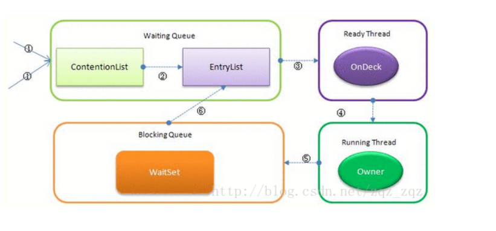

Java里有哪些锁？

- 公平锁/非公平锁
- 可重入锁
- 独享锁/共享锁
- 互斥锁/读写锁
- 乐观锁/悲观锁
- 分段锁
- 偏向锁/轻量级锁/重量级锁
- 自旋锁

# 锁

synchronized会导致争用不到锁的线程进入阻塞状态，所以说它是java语言中一个重量级的同步操纵，被称为重量级锁。为了缓解上述性能问题，JDK 从1.5开始，引入了轻量锁与偏向锁，默认启用了自旋锁，他们都属于乐观锁， 每种锁只有在其特定的场景下，才会有出色的表现 。  


### markword

markword是java对象数据结构中的一部分，这里只做markword的简单介绍，因为对象的markword和java各种类型的锁密切相关。

markword数据的长度在32位和64位的虚拟机（未开启压缩指针）中分别为32bit和64bit，它的最后2bit是锁状态标志位，用来标记当前对象的状态。

| 状态             | 标志位 | 存储内容                             |
| ---------------- | ------ | ------------------------------------ |
| 未锁定           | 01     | 对象哈希码、对象分代年龄             |
| 轻量级锁定       | 00     | 指向锁记录的指针                     |
| 膨胀(重量级锁定) | 10     | 执行重量级锁定的指针                 |
| GC标记           | 11     | 空(不需要记录信息)                   |
| 可偏向           | 01     | 偏向线程ID、偏向时间戳、对象分代年龄 |

 在64位的虚拟机中 MarkWord在对象头结构如下图所示：


所以目前锁状态一种有四种，从级别由低到高依次是：无锁、偏向锁，轻量级锁，重量级锁，锁状态只能升级，不能降级。


参考：

https://segmentfault.com/a/1190000022904663

## 自旋锁

自旋锁原理：

如果持有锁的线程能在很短时间内释放锁资源，那么那些等待竞争锁的线程就不需要做内核态和用户态之间的切换进入阻塞挂起状态，只需要等一等（自旋），就可以获取到锁。


线程自旋是需要消耗cup的，说白了就是让cup在做无用功，如果一直获取不到锁，所以需要设定一个自旋等待的最大时间， 超过等待时间再停止自旋进入阻塞状态。 

##### 适用情景

自旋锁的思想是尽可能的减少线程的阻塞，这对于锁的竞争不激烈，且占用锁时间非常短的代码块来说性能能大幅度的提升，因为自旋的消耗会小于线程阻塞挂起再唤醒的操作的消耗，这些操作会导致线程发生两次上下文切换。 

如果锁的竞争激烈，或者持有锁的线程需要长时间占用锁执行同步块，这时候就不适合使用自旋锁了 。

##### 超时时间

 JVM对于自旋周期的选择，jdk1.5这个限度是一定的写死的，在1.6引入了适应性自旋锁。

适应性自旋锁意味着自旋的时间不在是固定的了，而是由前一次在同一个锁上的自旋时间以及锁的拥有者的状态来决定，基本认为一个线程上下文切换的时间是最佳的一个时间，同时JVM还针对当前CPU的负荷情况做了较多的优化，也就是CPU情况好的时候自旋次数多，反之变少。

1、如果平均负载小于CPUs则一直自旋

2、如果有超过(CPUs/2)个线程正在自旋，则后来线程直接阻塞

3、如果正在自旋的线程发现Owner发生了变化则延迟自旋时间（自旋计数）或进入阻塞

4、如果CPU处于节电模式则停止自旋

5、自旋时间的最坏情况是CPU的存储延迟（CPU A存储了一个数据，到CPU B得知这个数据直接的时间差）

6、自旋时会适当放弃线程优先级之间的差异


JDK1.7后，去掉控制JVM设置自旋次数的参数，由jvm自己控制。


## 偏向锁

Java偏向锁(Biased Locking)是Java6引入的多线程优化。同步锁只有一个线程访问，这个线程被标记，有竞争时，第一个线程被挂起，并消除偏向锁，恢复轻量级锁。

原理：

**如果在运行过程中，同步锁只有一个线程访问，不存在多线程争用的情况，则线程是不需要触发同步的，这种情况下，就会给线程加一个偏向锁。**

**如果在运行过程中，遇到了其他线程抢占锁，则持有偏向锁的线程会被挂起，JVM会消除它身上的偏向锁，将锁恢复到标准的轻量级锁。** 


##### 适应情景

始终只有一个线程在执行同步块，在它没有执行完释放锁之前，没有其它线程去执行同步块，在锁无竞争的情况下使用，一旦有了竞争就升级为轻量级锁，升级为轻量级锁的时候需要撤销偏向锁，撤销偏向锁的时候会导致stop the word操作。

如果线程争用激烈，那么应该禁用偏向锁。 

## 轻量级锁

轻量级锁是由偏向所升级来的，偏向锁运行在一个线程进入同步块的情况下，当第二个线程加入锁争用的时候，偏向锁就会升级为轻量级锁。

## 重量级锁

升级为重量级锁时，锁标志的状态值变为“10”，此时Mark Word中存储的是指向重量级锁的指针，此时等待锁的线程都会进入阻塞状态。 

##### Synchronized

在JDK1.5之前都是使用synchronized关键字保证同步的，Synchronized的作用相信大家都已经非常熟悉了；

它可以把任意一个非NULL的对象当作锁。

1、作用于方法时，锁住的是对象的实例(this)；

2、当作用于静态方法时，锁住的是Class实例，又因为Class的相关数据存储在永久带PermGen（jdk1.8则是metaspace），永久带是全局共享的，因此静态方法锁相当于类的一个全局锁，会锁所有调用该方法的线程；

3、synchronized作用于一个对象实例时，锁住的是所有以该对象为锁的代码块。

##### Synchronized的实现



Synchronized是非公平锁，它有多个队列，当多个线程一起访问某个对象监视器的时候，对象监视器会将这些线程存储在不同的容器中。

1. Contention List：竞争队列，所有请求锁的线程首先被放在这个竞争队列中；
2. Entry List：Contention List中那些有资格成为候选资源的线程被移动到Entry List中；
3. Wait Set：哪些调用wait方法被阻塞的线程被放置在这里；
4. OnDeck：任意时刻，最多只有一个线程正在竞争锁资源，该线程被成为OnDeck；
5. Owner：当前已经获取到所资源的线程被称为Owner；
6. !Owner：当前释放锁的线程。


## 锁对比

| 锁       | 优点                                                         | 缺点                                             | 适用场景                             |
| -------- | ------------------------------------------------------------ | ------------------------------------------------ | ------------------------------------ |
| 偏向锁   | 加锁和解锁不需要额外的消耗，和执行非同步方法比仅存在纳秒级的差距。 | 如果线程间存在锁竞争，会带来额外的锁撤销的消耗。 | 适用于只有一个线程访问同步块场景。   |
| 轻量级锁 | 竞争的线程不会阻塞，提高了程序的响应速度。                   | 如果始终得不到锁竞争的线程使用自旋会消耗CPU。    | 追求响应时间。同步块执行速度非常快。 |
| 重量级锁 | 线程竞争不使用自旋，不会消耗CPU。                            | 线程阻塞，响应时间缓慢。                         | 追求吞吐量。同步块执行速度较长。     |

偏向锁通过对比Mark Word解决加锁问题，避免执行CAS操作。

轻量级锁是通过用CAS操作和自旋来解决加锁问题，避免线程阻塞和唤醒而影响性能。

重量级锁是将除了拥有锁的线程以外的线程都阻塞。 

## 锁的获取流程

在所有的锁都启用的情况下 ，偏向锁是在无锁争用的情况下使用的，没有其它线程会执行该同步块，一旦有了第二个线程的争用，偏向锁就会升级为轻量级锁，如果轻量级锁自旋到达阈值后，没有获取到锁，就会升级为重量级锁，没有获取到锁的线程阻塞挂起，直到持有锁的线程执行完同步块唤醒他们。


**具体一些**：

每⼀个线程在准备获取共享资源时，第⼀步，检查MarkWord⾥⾯是不是放的⾃⼰的ThreadId ,如果是，表示当前线程是处于**偏向锁**。

第⼆步，如果MarkWord不是⾃⼰的ThreadId，锁升级，这时候，⽤CAS来执⾏切换，新的线程根据MarkWord⾥⾯现有的ThreadId，通知之前线程暂停，之前线程将Markword的内容置为空。

第三步，两个线程都把锁对象的HashCode复制到⾃⼰新建的⽤于存储锁的记录空间，接着开始通过CAS操作，把锁对象的MarKword的内容修改为⾃⼰新建的记录空间的地址的⽅式竞争MarkWord。

第四步，第三步中成功执⾏CAS的获得资源，失败的则进⼊⾃旋。

第五步，⾃旋的线程在⾃旋过程中，成功获得资源(即之前获的资源的线程执⾏完成并释放了共享资源)，则整个状态依然处于**轻量级锁**的状态，如果⾃旋失败。

第六步，进⼊**重量级锁**的状态，这个时候，⾃旋的线程进⾏阻塞，等待之前线程执⾏完成并唤醒⾃⼰。


## 公平锁和非公平锁

## 可重入锁和非可重入锁

## 独享锁、共享锁

独享锁也叫排他锁、互斥锁，是指该锁一次只能被一个线程所持有。如果线程T对数据A加上排它锁后，则其他线程不能再对A加任何类型的锁。

获得排它锁的线程即能读数据又能修改数据。JDK中的synchronized和JUC中Lock的实现类就是互斥锁。


共享锁指该锁可被多个线程所持有。如果线程T对数据A加上共享锁后，则其他线程只能对A再加共享锁，不能加排它锁。获得共享锁的线程只能读数据，不能修改数据。

独享锁与共享锁也是通过AQS来实现的，通过实现不同的方法，来实现独享或者共享。


##### ReentrantReadWriteLock 

ReentrantReadWriteLock 两把锁：ReadLock和WriteLock。

ReadLock和WriteLock是靠内部类Sync实现的锁。Sync是AQS的一个子类，这种结构在CountDownLatch、ReentrantLock、Semaphore里面也都存在。 


在ReentrantReadWriteLock里面，读锁和写锁的锁主体都是Sync，但读锁和写锁的加锁方式不一样。

读锁是共享锁，写锁是独享锁。读锁的共享锁可保证并发读非常高效，而读写、写读、写写的过程互斥，因为读锁和写锁是分离的。ReentrantReadWriteLock的并发性相比一般的互斥锁有了很大提升。

AQS源码中的也提到了 int state字段，用来描述有多少线程获持有锁。读写两种需要在一个整型变量state上描述，于是将state变量“按位切割”切分成了两个部分，高16位表示读锁状态（读锁个数），低16位表示写锁状态（写锁个数）。

##### ReentrantLock

ReentrantLock虽然有公平锁和非公平锁两种，但是它们添加的都是独享锁。 

## 锁优化

以上介绍的锁不是我们代码中能够控制的，但是借鉴上面的思想，我们可以优化我们自己线程的加锁操作。

##### 1、减少锁的时间

用代码块的形式缩小同步范围，减少不需要同步的内容。

##### 2、减少锁的粒度

##### ConcurrentHashMap

ConcurrentHashMa 也是空间来换时间。Segment继承自ReenTrantLock，所以每个Segment就是个可重入锁，每个Segment 有一个HashEntry< K,V >数组用来存放数据，put操作时，先确定往哪个Segment放数据，只需要锁定这个Segment，执行put，其它的Segment不会被锁定；所以数组中有多少个Segment就允许同一时刻多少个线程存放数据。

##### LongAdder

LongAdder 实现思路也类似ConcurrentHashMap，LongAdder有一个根据当前并发状况动态改变的Cell数组，Cell对象里面有一个long类型的value用来存储值;

开始没有并发争用的时候或者是cells数组正在初始化的时候，会使用cas来将值累加到成员变量的base上。

在并发争用的情况下，LongAdder会初始化cells数组，在Cell数组中选定一个Cell加锁，数组有多少个cell，就允许同时有多少线程进行修改，最后将数组中每个Cell中的value相加，在加上base的值，就是最终的值；

cell数组还能根据当前线程争用情况进行扩容，初始长度为2，每次扩容会增长一倍，2、4、8这样。直到扩容到大于等于cpu数量就不再扩容，这也就是为什么LongAdder比cas和AtomicInteger效率要高的原因，后面两者都是volatile+cas实现的，他们的竞争维度是1，LongAdder的竞争维度为“Cell个数+1”为什么要+1？因为它还有一个base，如果竞争不到锁还会尝试将数值加到base上；

##### 延伸

DoubleAdder 和 LongAdder 的方法基本类似，只是多了一个转型的方法，其他都一样，就不在介绍那个类了。LongAdder 是在 AtomicLong 的优化版本，但是也无法完全替代 AtomicLong 的用途。


##### 区别

AtomicLong 是基于 CAS 方式自旋更新的；

AtomicLong 包含有原子性的读、写结合的api；LongAdder 没有原子性的读、写结合的api，能保证结果最终一致性。

LongAdder 是把 value 分成若干cell，并发量低的时候，直接 CAS 更新值，成功即结束。

并发量高的情况，CAS更新某个cell值和需要时对cell数据扩容，成功结束；更新失败自旋 CAS 更新 cell值。取值的时候，调用 sum() 方法进行每个cell累加。 

低并发场景AtomicLong 和 LongAdder 性能相似，高并发场景 LongAdder 性能优于 AtomicLong。


##### LinkedBlockingQueue

LinkedBlockingQueue也减少锁粒度的思想，在队列头入队，在队列尾出队，入队和出队使用不同的锁，相对于LinkedBlockingArray只有一个锁效率要高。


##### 读写分离

CopyOnWriteArrayList 、CopyOnWriteArraySet、CopyOnWrite容器即写时复制的容器，读写分离的思想。

通俗的理解是当我们往一个容器添加元素的时候，不直接往当前容器添加，而是先将当前容器进行Copy，复制出一个新的容器，然后新的容器里添加元素，添加完元素之后，再将原容器的引用指向新的容器

这样做的好处是我们可以对CopyOnWrite容器进行并发的读，而不需要加锁，因为当前容器不会添加任何元素，读和写不同的容器。

CopyOnWrite并发容器用于**读多写少**的并发场景，因为，读的时候没有锁，但是对其进行更改的时候是会加锁的，否则会导致多个线程同时**复制出多个副本**，各自修改各自的效率也不高。

##### 读写锁

ReentrantReadWriteLock 是一个读写锁，读操作加读锁，可以并发读，写操作使用写锁，只能单线程写；

##### cas

适用于同步的操作执行速度非常快，并且线程竞争并不激烈。

##### 禁用偏向锁

竞争比较激烈的时候，不但无法提升效率，反而会降低效率，因为多了一个锁升级的过程，这个时候就需要通过-XX:-UseBiasedLocking来禁用偏向锁。


## 锁粗化

锁的粗化则是要增大锁的粒度。

例子：

每次调用stringBuffer.append方法都需要加锁和解锁，如果虚拟机检测到有一系列连串的对同一个对象加锁和解锁操作，就会将其合并成一次范围更大的加锁和解锁操作，即在第一次append方法时进行加锁，最后一次append方法结束后进行解锁。 


## 锁消除

锁消除即删除不必要的加锁操作。根据代码逃逸技术，如果一段代码中，堆上的数据不会逃逸出当前线程，那么可以认为这段代码是线程安全的，不必要加锁。 

比如：单线程执行 StringBuffer的append ()方法，for循环10000次。


## 死锁

Java 死锁 Demo


````java
public class DeadLockDemo {

    private static Object resource1 = new Object();//资源 1
    private static Object resource2 = new Object();//资源 2

    public static void main(String[] args) {
        new Thread(() -> {
            synchronized (resource1) {
                System.out.println(Thread.currentThread() + "get resource1");
                try {
                    Thread.sleep(1000);
                } catch (InterruptedException e) {
                    e.printStackTrace();
                }
                System.out.println(Thread.currentThread() + "waiting getresource2");
                synchronized (resource2) {
                    System.out.println(Thread.currentThread() + "getresource2");
                }
            }
        }, "线程 1").start();
        new Thread(() -> {
            synchronized (resource2) {
                System.out.println(Thread.currentThread() + "get resource2");
                try {
                    Thread.sleep(1000);
                } catch (InterruptedException e) {
                    e.printStackTrace();
                }
                System.out.println(Thread.currentThread() + "waiting getresource1");
                synchronized (resource1) {
                    System.out.println(Thread.currentThread() + "getresource1");
                }
            }
        }, "线程 2").start();
    }
    //输出：
    //Thread[线程 2,5,main]get resource2
    //Thread[线程 1,5,main]get resource1
    //Thread[线程 2,5,main]waiting getresource1
    //Thread[线程 1,5,main]waiting getresource2
}
````

操作系统产⽣死锁必备四个条件：

1、互斥条件：该资源任意⼀个时刻**只由⼀个线程占⽤**。

2、请求与保持条件：⼀个进程因请求资源⽽阻塞时，对已获得的资源**保持不放**。

3、不剥夺条件:线程已获得的资源在末使⽤完之前不能被其他线程强⾏剥夺，**只有⾃⼰使⽤完毕后才释放资源**。

4、 循环等待条件:若⼲进程之间形成⼀种**头尾相接的循环等待资源**关系。

## 如何避免线程死锁?

只要破坏产⽣死锁的四个条件中的其中⼀个就可以了

1、破坏互斥条件：这个条件我们**没有办法破坏**，因为我们⽤锁本来就是想让他们互斥的（临界资源需要互斥访问）。

2、破坏请求与保持条件：**⼀次性申请所有的资源**。

3、破坏不剥夺条件：占⽤部分资源的线程进⼀步申请其他资源时，**如果申请不到，可以主动释放它占有的资源。**

4、破坏循环等待条件：靠按序申请资源来预防。**按某⼀顺序申请资源，释放资源则反序释放**。破坏循环等待条件。

# 参考：

https://blog.csdn.net/zqz_zqz/article/details/70233767

[Java 对象的结构](https://blog.csdn.net/zqz_zqz/article/details/70246212)

https://tech.meituan.com/2018/11/15/java-lock.html