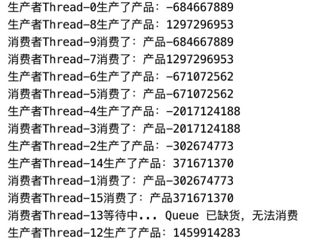

**什么是生产者/消费者模型**

一种重要的模型，基于等待/通知机制。生产者/消费者模型描述的是有一块缓冲区作为仓库，生产者可将产品放入仓库，消费者可以从仓库中取出产品，生产者/消费者模型关注的是以下几个点：

- 生产者生产的时候消费者不能消费
- 消费者消费的时候生产者不能生产
- 缓冲区空时消费者不能消费
- 缓冲区满时生产者不能生产

优点：

1、解耦。

因为多了一个缓冲区，变为了生产者和缓冲区/消费者和缓冲区之间的弱耦合，实际为强耦合变弱耦合。所以生产者和消费者并不直接相互调用，这样生产者或消费者的代码发生变化，都不会对对方产生影响。

2、异步

3、高效

通过配置生消的个数比例平衡速度差异。


实现方法总结：

推荐实现三：使用BlockingQueue来实现生产者-消费者很简洁，这正是利用了BlockingQueue插入和获取数据附加阻塞操作的特性。


## 实现一：wait/notifyAll实现生产者-消费者

 使用Object的wait/notify的消息通知机制； 

````java
public class ProductorConsumerDemo1 {

    public static void main(String[] args) {
        LinkedList linkedList = new LinkedList();
        ExecutorService service = Executors.newFixedThreadPool(15);
        for (int i = 0; i < 5; i++) {
            service.submit(new Productor(linkedList, 8));
        }
        for (int i = 0; i < 10; i++) {
            service.submit(new Consumer(linkedList));
        }
    }

    static class Productor implements Runnable {
        private List<Integer> list;
        private int maxLength;
        public Productor(List list, int maxLength) {
            this.list = list;
            this.maxLength = maxLength;
        }

        @Override
        public void run() {
            while (true) {
                synchronized (list) {
                    try {
                        while (list.size() == maxLength) {
                            System.out.println("生产者" + Thread.currentThread().getName() + "  list以达到最大容量，进行wait");
                            list.wait();
                            System.out.println("生产者" + Thread.currentThread().getName() + "  退出wait");
                        }
                        Random random = new Random();
                        int i = random.nextInt();
                        System.out.println("生产者" + Thread.currentThread().getName() + " 生产数据" + i);
                        list.add(i);
                        list.notifyAll();
                        Thread.sleep(500);
                    } catch (InterruptedException e) {
                        e.printStackTrace();
                    }
                }

            }
        }
    }
    static class Consumer implements Runnable {
        private List<Integer> list;
        public Consumer(List list) {
            this.list = list;
        }
        @Override
        public void run() {
            while (true) {
                synchronized (list) {
                    try {
                        while (list.isEmpty()) {
                            System.out.println("消费者" + Thread.currentThread().getName() + "  list为空，进行wait");
                            list.wait();
                            System.out.println("消费者" + Thread.currentThread().getName() + "  退出wait");
                        }
                        Integer element = list.remove(0);
                        System.out.println("消费者" + Thread.currentThread().getName() + "  消费数据：" + element);
                        list.notifyAll();
                        Thread.sleep(500);
                    } catch (InterruptedException e) {
                        e.printStackTrace();
                    }
                }
            }
        }
    }
}
````

结果输出：

````
生产者pool-1-thread-2 生产数据-703210513
生产者pool-1-thread-2 生产数据-1025434820
生产者pool-1-thread-2 生产数据70070412
生产者pool-1-thread-2 生产数据-598504371
生产者pool-1-thread-2 生产数据-716978999
生产者pool-1-thread-2 生产数据-1175198461
生产者pool-1-thread-2 生产数据-1212912406
生产者pool-1-thread-2 生产数据-332467186
生产者pool-1-thread-2  list以达到最大容量，进行wait
消费者pool-1-thread-15  消费数据：-703210513
消费者pool-1-thread-15  消费数据：-1025434820
消费者pool-1-thread-15  消费数据：70070412
消费者pool-1-thread-15  消费数据：-598504371
消费者pool-1-thread-15  消费数据：-716978999
消费者pool-1-thread-15  消费数据：-1175198461
消费者pool-1-thread-15  消费数据：-1212912406
消费者pool-1-thread-15  消费数据：-332467186
消费者pool-1-thread-15  list为空，进行wait
消费者pool-1-thread-14  list为空，进行wait
消费者pool-1-thread-13  list为空，进行wait
消费者pool-1-thread-11  list为空，进行wait
消费者pool-1-thread-12  list为空，进行wait
消费者pool-1-thread-10  list为空，进行wait
消费者pool-1-thread-9  list为空，进行wait
消费者pool-1-thread-8  list为空，进行wait
消费者pool-1-thread-7  list为空，进行wait
消费者pool-1-thread-6  list为空，进行wait
生产者pool-1-thread-5 生产数据84590545
生产者pool-1-thread-5 生产数据-1631754695
````

## 实现二：await/signalAll实现生产者-消费者

使用Lock中Condition的await/signalAll实现生产者-消费者

````java
public class ProductorConsumerDemo2 {

    private static ReentrantLock lock = new ReentrantLock();
    private static Condition full = lock.newCondition();
    private static Condition empty = lock.newCondition();

    public static void main(String[] args) {
        LinkedList linkedList = new LinkedList();//共享数据存储
        ExecutorService service = Executors.newFixedThreadPool(15);
        for (int i = 0; i < 5; i++) {
            service.submit(new Productor(linkedList, 8, lock));
        }
        for (int i = 0; i < 10; i++) {
            service.submit(new Consumer(linkedList, lock));
        }

    }

    static class Productor implements Runnable {
        private List<Integer> list;
        private int maxLength;
        private Lock lock;
        public Productor(List list, int maxLength, Lock lock) {
            this.list = list;
            this.maxLength = maxLength;
            this.lock = lock;
        }
        
        @Override
        public void run() {
            while (true) {
                lock.lock();
                try {
                    while (list.size() == maxLength) {
                        System.out.println("生产者" + Thread.currentThread().getName() + "  list以达到最大容量，进行wait");
                        full.await();
                        System.out.println("生产者" + Thread.currentThread().getName() + "  退出wait");
                    }
                    Random random = new Random();
                    int i = random.nextInt();
                    System.out.println("生产者" + Thread.currentThread().getName() + " 生产数据" + i);
                    list.add(i);
                    empty.signalAll();
                    Thread.sleep(500);
                } catch (InterruptedException e) {
                    e.printStackTrace();
                } finally {
                    lock.unlock();
                }
            }
        }
    }

    static class Consumer implements Runnable {
        private List<Integer> list;
        private Lock lock;
        public Consumer(List list, Lock lock) {
            this.list = list;
            this.lock = lock;
        }

        @Override
        public void run() {
            while (true) {
                lock.lock();
                try {
                    while (list.isEmpty()) {
                        System.out.println("消费者" + Thread.currentThread().getName() + "  list为空，进行wait");
                        empty.await();
                        System.out.println("消费者" + Thread.currentThread().getName() + "  退出wait");
                    }
                    Integer element = list.remove(0);
                    System.out.println("消费者" + Thread.currentThread().getName() + "  消费数据：" + element);
                    full.signalAll();
                    Thread.sleep(500);
                } catch (InterruptedException e) {
                    e.printStackTrace();
                } finally {
                    lock.unlock();
                }
            }
        }
    }

}

````

结果：

````java
生产者pool-1-thread-1 生产数据-1633842993
生产者pool-1-thread-1 生产数据1337251950
生产者pool-1-thread-1 生产数据1310879631
生产者pool-1-thread-1 生产数据-214297115
生产者pool-1-thread-1 生产数据738937512
生产者pool-1-thread-1 生产数据13060041
生产者pool-1-thread-1 生产数据-957049554
生产者pool-1-thread-1 生产数据-1062017880
生产者pool-1-thread-1  list以达到最大容量，进行wait
生产者pool-1-thread-2  list以达到最大容量，进行wait
生产者pool-1-thread-3  list以达到最大容量，进行wait
生产者pool-1-thread-4  list以达到最大容量，进行wait
生产者pool-1-thread-5  list以达到最大容量，进行wait
消费者pool-1-thread-6  消费数据：-1633842993
消费者pool-1-thread-6  消费数据：1337251950
消费者pool-1-thread-6  消费数据：1310879631
消费者pool-1-thread-6  消费数据：-214297115
消费者pool-1-thread-6  消费数据：738937512
消费者pool-1-thread-6  消费数据：13060041
消费者pool-1-thread-6  消费数据：-957049554
消费者pool-1-thread-6  消费数据：-1062017880
消费者pool-1-thread-6  list为空，进行wait
消费者pool-1-thread-7  list为空，进行wait
消费者pool-1-thread-8  list为空，进行wait
消费者pool-1-thread-9  list为空，进行wait
消费者pool-1-thread-10  list为空，进行wait
消费者pool-1-thread-11  list为空，进行wait
消费者pool-1-thread-12  list为空，进行wait
消费者pool-1-thread-13  list为空，进行wait
消费者pool-1-thread-14  list为空，进行wait
消费者pool-1-thread-15  list为空，进行wait
生产者pool-1-thread-1  退出wait
生产者pool-1-thread-1 生产数据1949864858
生产者pool-1-thread-1 生产数据-1693880970
````


## 实现三：BlockingQueue实现生产者-消费者

由于BlockingQueue内部实现就附加了两个阻塞操作，留给我们需要实现的就更少了。

即当队列已满时，阻塞向队列中插入数据的线程，直至队列中未满；

当队列为空时，阻塞从队列中获取数据的线程，直至队列非空时为止。

可以利用BlockingQueue实现生产者-消费者为题，阻塞队列完全可以充当**共享数据区域**，就可以很好的完成生产者和消费者线程之间的协作。 

##### 版本一：

阻塞队列相比版本二更简单。

````java
public class ProductorConsumerDmoe3 {

    // LinkedBlockingQueue：绑定的容量，如果没有，则为Integer.MAX_VALUE
    private static LinkedBlockingQueue<Integer> queue = new LinkedBlockingQueue<>();

    public static void main(String[] args) {
        ExecutorService service = Executors.newFixedThreadPool(15);
        for (int i = 0; i < 5; i++) {
            service.submit(new Productor(queue));
        }
        for (int i = 0; i < 10; i++) {
            service.submit(new Consumer(queue));
        }
        service.shutdown();
    }
    static class Productor implements Runnable {
        private BlockingQueue queue;
        public Productor(BlockingQueue queue) {
            this.queue = queue;
        }
        @Override
        public void run() {
            try {
                while (true) {
                    Random random = new Random();
                    int i = random.nextInt();
                    System.out.println("生产者" + Thread.currentThread().getName() + "生产数据" + i);
                    queue.put(i);
                    Thread.sleep(1000);
                }
            } catch (InterruptedException e) {
                e.printStackTrace();
            }
        }
    }
    static class Consumer implements Runnable {
        private BlockingQueue queue;
        public Consumer(BlockingQueue queue) {
            this.queue = queue;
        }
        @Override
        public void run() {
            try {
                while (true) {
                    Integer element = (Integer) queue.take();
                    System.out.println("消费者" + Thread.currentThread().getName() + "正在消费数据" + element);
                    Thread.sleep(1000);
                }
            } catch (InterruptedException e) {
                e.printStackTrace();
            }
        }
    }
}
````

结果：

````java
生产者pool-1-thread-2生产数据-1056722868
生产者pool-1-thread-1生产数据-1217947426
生产者pool-1-thread-3生产数据590686437
生产者pool-1-thread-4生产数据1782376429
生产者pool-1-thread-5生产数据1558897279
消费者pool-1-thread-6正在消费数据-1056722868
消费者pool-1-thread-7正在消费数据-1217947426
消费者pool-1-thread-8正在消费数据590686437
消费者pool-1-thread-9正在消费数据1782376429
消费者pool-1-thread-10正在消费数据1558897279
生产者pool-1-thread-4生产数据1977644261
生产者pool-1-thread-3生产数据182370155
消费者pool-1-thread-11正在消费数据1977644261
生产者pool-1-thread-2生产数据949821636
生产者pool-1-thread-5生产数据1931032717
消费者pool-1-thread-13正在消费数据949821636
生产者pool-1-thread-1生产数据873417555
消费者pool-1-thread-14正在消费数据1931032717
消费者pool-1-thread-12正在消费数据182370155
消费者pool-1-thread-15正在消费数据873417555
````

##### 版本二：

总结：里面notifyAll 就不是很好。


pojo类

````java
public class Product  {
    private String name;

    public Product(String name) {
        this.name = name;
    }

    public String getName() {
        return name;
    }

    public void setName(String name) {
        this.name = name;
    }
}
````

测试类

````java
public class Test {
    public static void main(String[] args) {
        Queue<Product> queue = new ArrayDeque<>();

        for (int i = 0; i < 100; i++) {
            new Thread(new Producer(queue, 100)).start();
            new Thread(new Consumer(queue, 100)).start();
        }
    }
}
````

消费者

````java
public class Consumer implements Runnable{
    private Queue<Product> queue;
    private int maxCapacity;

    public Consumer(Queue queue, int maxCapacity) {
        this.queue = queue;
        this.maxCapacity = maxCapacity;
    }

    @Override
    public void run() {
        synchronized (queue) {
            while (queue.isEmpty()) {
                try {
                    System.out.println("消费者" + Thread.currentThread().getName() + "等待中... Queue 已缺货，无法消费");
                    wait();
                    System.out.println("消费者" + Thread.currentThread().getName() + "退出等待");
                } catch (InterruptedException e) {
                    e.printStackTrace();
                }
            }
            if (queue.size() == maxCapacity) {
                queue.notifyAll();
            }

            Product product = queue.poll();
            System.out.println("消费者" + Thread.currentThread().getName() + "消费了：" + product.getName());
        }
    }
}
````

生产者

````java
public class Producer implements Runnable{
    private Queue<Product> queue;
    private int maxCapacity;

    public Producer(Queue queue, int maxCapacity) {
        this.queue = queue;
        this.maxCapacity = maxCapacity;
    }

    @Override
    public void run() {
        synchronized (queue) {
            while (queue.size() == maxCapacity) { //一定要用 while，而不是 if。
                try {
                    System.out.println("生产者" + Thread.currentThread().getName() + "等待中... Queue 已达到最大容量，无法生产");
                    wait();
                    System.out.println("生产者" + Thread.currentThread().getName() + "退出等待");
                } catch (InterruptedException e) {
                    e.printStackTrace();
                }
            }
            if (queue.size() == 0) { //队列里的产品从无到有，需要通知在等待的消费者
                queue.notifyAll();
            }
            Random random = new Random();
            Integer i = random.nextInt();
            queue.offer(new Product("产品"  + i.toString()));
            System.out.println("生产者" + Thread.currentThread().getName() + "生产了产品：" + i.toString());
        }
    }
}
````

结果：




## 相关知识：

## wait()/notify()

`wait()` 和 `notify()` 都是 Java 中的 `Object` 类自带的方法，可以用来实现线程间的通信。

`wait()` 方法是用来让当前线程等待，直到有别的线程调用 `notify()` 将它唤醒，或者我们可以设定一个时间让它自动苏醒。

调用该方法之前，线程必须要获得该对象的对象监视器锁，也就是只能用在加锁的方法下。

**而调用该方法之后，当前线程会释放锁。**（提示：这里很重要，也是方法三版本二代码中用 `while` 而非 `if` 的原因。）

`notify()` 方法只能通知一个线程，如果多个线程在等待，那就唤醒任意一个。

`notifyAll()` 方法是可以唤醒所有等待线程，然后加入同步队列。

## 相关坑点：

 总结：在使用线程的等待通知机制时，一般都要在 `while` 循环中调用 `wait()` 方法。


## 参考：

https://segmentfault.com/a/1190000024444906

https://blog.csdn.net/ThinkWon/article/details/102557126

https://juejin.cn/post/6844903486895865864#heading-1

https://www.cnblogs.com/xrq730/p/4855663.html

[关于BlockingQueue更多细节可以看这篇文章](https://blog.csdn.net/ThinkWon/article/details/102508901)。

