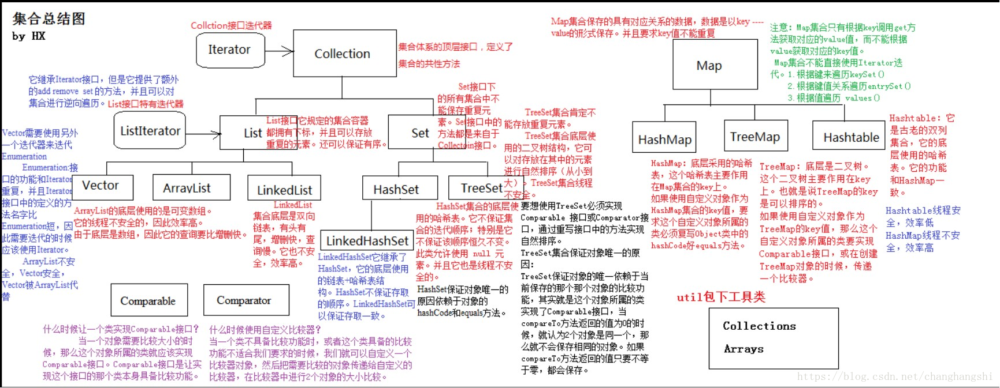
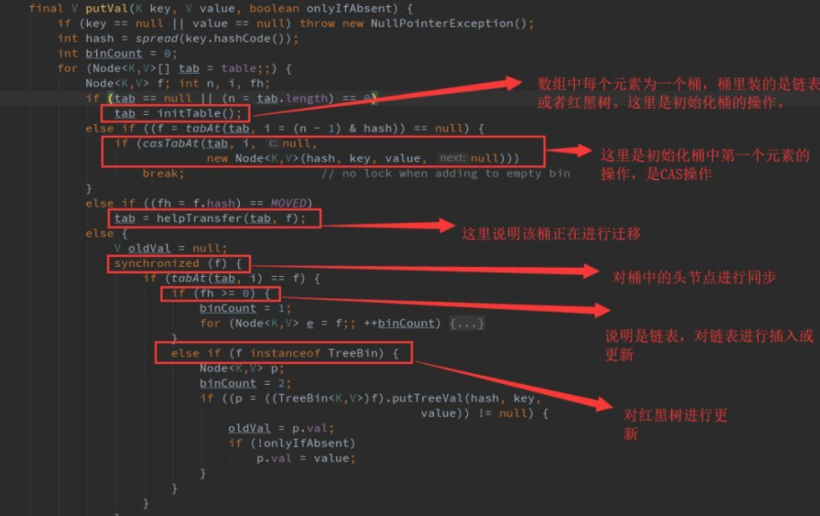

[1、说出ArrayList、Vector、LinkedList 的存储性能和特性？](#1---arraylist-vector-linkedlist----------)

[2、Arraylist 与Vector 区别？](#2-arraylist--vector----)

[3、Arraylist 与 LinkedList 异同](#3-arraylist---linkedlist---)

[**4、在Java中，HashMap是如何工作的？**](#--4--java--hashmap---------)

[null值的处理](#null----)

- [容量、负荷系数和阀值调整](#------------)
- [1.8HashMap](#18hashmap)
- [方法详解：](#-----)
- [树的退化：](#-----)
- [头插法还是尾插法？](#---------)
+ [补充红黑树：](#------)
  - [额外推断：](#-----)
  - [平衡操作：](#-----)

  * [5、HashMap 的长度为什么是2的幂次方](#5-hashmap--------2----)
  * [6、HashMap 和 Hashtable 的区别](#6-hashmap---hashtable----)
  * [7、ConcurrentHashMap线程安全的具体实现方式/底层具体实现](#7-concurrenthashmap------------------)
    + [1.8 ConcurrentHashMap](#18-concurrenthashmap)
    + [为什么不用ReentrantLock而用synchronized ?](#-----reentrantlock--synchronized--)
  * [8、ConcurrentHashMap 和 Hashtable 的区别](#8-concurrenthashmap---hashtable----)
- [更多参考](#----)

<small><i><a href='http://ecotrust-canada.github.io/markdown-toc/'>Table of contents generated with markdown-toc</a></i></small>

先来一张图

### 1、说出ArrayList、Vector、LinkedList 的存储性能和特性？

答：ArrayList 和Vector 都是使用数组方式存储数据，此数组元素数大于实际存储的数据以便增加和插入元素，它们都允许直接按序号索引元素，但是插入元素要涉及数组元素移动等内存操作，所以索引数据快而插入数据慢。Vector 由于使用了synchronized 方法（线程安全），通常性能上较ArrayList 差。而LinkedList 使用双向链表实现存储，按序号索引数据需要进行前向或后向遍历，但是插入数据时只需要记录本项的前后项即可，所以插入速度较快。

 

### 2、Arraylist 与Vector 区别？

1、同步性：Vector 是线程安全的（同步），而ArrayList 是线程序不安全的；
2、数据增长：当需要增长时，Vector 默认增长一倍，而ArrayList 却是一半。

### 3、Arraylist 与 LinkedList 异同

**1. 是否保证线程安全：** ArrayList 和 LinkedList 都是不同步的，也就是不保证线程安全；

**2. 底层数据结构：** Arraylist 底层使用的是Object数组；LinkedList 底层使用的是双向循环链表数据结构；

**3. 插入和删除是否受元素位置的影响：** ① **ArrayList 采用数组存储，所以插入和删除元素的时间复杂度受元素位置的影响。** 比如：执行`add(E e)`方法的时候， ArrayList 会默认在将指定的元素追加到此列表的末尾，这种情况时间复杂度就是O(1)。但是如果要在指定位置 i 插入和删除元素的话（`add(int index, E element)`）时间复杂度就为 O(n-i)。因为在进行上述操作的时候集合中第 i 和第 i 个元素之后的(n-i)个元素都要执行向后位/向前移一位的操作。 ② **LinkedList 采用链表存储，所以插入，删除元素时间复杂度不受元素位置的影响，都是近似 O（1）而数组为近似 O（n）。**

**4. 是否支持快速随机访问：** LinkedList 不支持高效的随机元素访问，而ArrayList 实现了RandmoAccess 接口，所以有随机访问功能。快速随机访问就是通过元素的序号快速获取元素对象(对应于`get(int index)`方法)。

**5. 内存空间占用：** ArrayList的空间浪费主要体现在list列表的结尾会预留一定的容量空间，而LinkedList的空间花费则体现在它的每一个元素都需要消耗比ArrayList更多的空间（因为要存放直接后继和直接前驱以及数据）。

### **4、在Java中，HashMap是如何工作的？**

HashMap在Map.Entry静态内部类实现中存储key-value对。HashMap使用哈希算法，在put和get方法中，它使用hashCode()和equals()方法。当我们通过传递key-value对调用put方法的时候，HashMap使用Key的hashCode()和哈希算法来找出存储key-value对的索引。Entry存储在LinkedList中，所以如果存在entry，它使用equals()方法来检查传递的key是否已经存在，如果存在，它会覆盖value，如果不存在，它会创建一个新的entry然后保存。当我们通过传递key调用get方法时，它再次使用hashCode()来找到数组中的索引，然后使用equals()方法找出正确的Entry，然后返回它的值。

##### null值的处理

允许存储null键，但是null没办法调用 null 的 hashCode() 方法，使用第 0 个桶存放键为 null 的键值对 。

而LinkedHashMap继承HashMap所以也是支持

TreeMap不允许key是null，但是允许value是null

HashTable不允许null值，key和value都不允许

1.8ConcurrentHashMap不允许null键以及null值。直接NullPointerException

##### 容量、负荷系数和阀值调整

分别是capacity、loadFactor、threshold

size这变量不在这里面，他表示实际map中键值对的数量。

HashMap默认的初始容量是16，负荷系数是0.75。

初始化构造方法传个10进去，实际10会变成16。而真实下次扩容前可以存储的数量为16乘以0.75为12。实际容量超过12会扩容为16乘2得32，实际又能存32乘0.75得24。再下一次变64，实际可存48。

**hashCode（）与equals（）的相关规定：**

1. 如果两个对象相等，则hashcode一定也是相同的
2. 如果两个对象相等，则equals方法返回true
3. 两个对象有相同的hashcode值，它们也不一定是相等的
4. 综上，equals方法被覆盖过，则hashCode方法也必须被覆盖
5. hashCode()的默认行为是对堆上的对象产生独特值。如果没有重写hashCode()，则该class的两个对象无论如何都不会相等（即使这两个对象指向相同的数据）。

 **==与equals的区别** ：

equals方法底层默认实现是对两个变量做==，而如果变量类型是基本数据类型则是比较大小是否相等，对于引用类型是比较堆内存地址是否相同。如果equals方法被重写，另说，比如String，是比较俩字符串是否长得一样。

##### 1.8HashMap 

为什么是8 泊松分布的计算公式计算的桶中元素个数和概率的对照表 ，8 的概率小。

##### 方法详解：

final V putVal(int hash, K key, V value, boolean onlyIfAbsent, boolean evict)方法解释

这个方法执行对操作是，先通过hash计算要添加的key准备插入的槽位，如果key是一样的，则根据设置的参数是否执行覆盖，如果相应的槽位是空的话直接插入，如果对应的槽位有值，则判断是红黑树结构还是链表结构，链表的话，判断链表长度是否大于等于8-1，符合就执行treeifyBin()，这个方法判断是否容量小于64，如果小于就执行扩容先不树化，进而执行扩容，如果大于则进行树化操作，对树节点进行添加或者覆盖。

链表的添加比较简单，遍历链表，有就覆盖，没有就尾插法插入最后面。

因此，链表树化的条件有两个， 一个是链表的长度达到8个，一个是数组的长度达到64个 。

final void treeifyBin(Node<K,V>[] tab, int hash)

上边有提到这个方法，它做的事情主要是，判断容量是否小于64，扩容还是准备树化，准备树化就将链表先封装为一个个的树节点，调用 treeify() 进行树节点的调整。

final void treeify(Node<K,V>[] tab)

整个方法的大体的执行是第一次循环会将链表中的第一个节点作为红黑树的根，后面的循环会通过比较链表中的项的hash值，放到树节点的左边或者右边，for循环无直接退出条件，而是if判断当前链表中所有的项都添加到了红黑树后，break。因为添加操作可能会破坏红黑树树的结构，所以最后会做一次balanceInsertion(root, x)；这个方法里面将会进行旋转和颜色变换，具体的原理就是依据红黑树的规则。

resize()方法：

Initializes or doubles table size.  If null, allocates in accord with initial capacity target held in field threshold.
 Otherwise, because we are using power-of-two expansion, the elements from each bin must either stay at same index, or move with a power of two offset in the new table.

初始化或加倍表大小。如果为空，则根据字段阈值中保留的初始容量目标进行分配。

否则，因为我们使用的是二次展开的幂，每个bin中的元素必须保持在相同的索引中，或者在新表中以2的幂次偏

移量移动。

##### 树的退化：

退化的阈值常量值6， 原因要低于 8，但过于接近也会导致频繁的结构变化。 

假设是7，当出现对同一个值的频繁插入删除就会不断转化，同一个元素的频繁添加删除的场景也很多。

不选定低于 6 的退化阈值是因为，红黑树不一定在低元素时效率更好， 还有就是相比链表占用了更多的引用存储空间。一个TreeNode包含左、右、父、还有一个用于删除的prev 4个引用， [Oracle 文档](https://www.v2ex.com/t/'https://docs.oracle.com/javase/specs/jls/se7/html/jls-4.html#jls-4.12.5') 中引用类型初始为 NULL。引用类型跟基础数据类型不一样，内存中除了对象本身之外，还存在一个指向它的引用（指针），指针占用的内存在64位虚拟机上8个字节，如果开启指针压缩是4个字节，默认是开启了的，这个也和虚拟机有关，这里说的是红点虚拟机。 

##### 头插法还是尾插法？

JDK8以前是头插法，JDK8后是尾插法 。 

因为JDK1.7是用单链表进行的纵向延伸，头插法反序设计是因为热点数据的缘故（ 新插入的数据可能会更早用到 ）。当采用头插法时，多线程下扩容，链表一道另一个位置重新头插法，顺序再次反过来，热点数据理论也被破坏，在顺序反过来的过程中出现环形链表死循环问题。

#### 补充红黑树：

红黑树的基本性质简单介绍：

自平衡的二叉查找树 ，查询速度10亿数据进行不到30次比较就能查找到目标。

左右子树未必等高，整体不一定是一个完美平衡二叉查找树，但一定避免二叉查找树退化成单链表

性质1：节点颜色要么红，要么黑。

性质2、3：根节点和每个（NIL）叶子节点是黑色。

性质4：一红必二黑，一黑未必二红。

性质5：任意节点到各个叶子节点的路径，路径中黑色节点数量都相同。

##### 额外推断：

5又可以推出，一个节点有1个黑儿子，那他必然是有两个不定颜色的儿子。

4、5保证任意节点到其每个叶子节点路径长度，最长、最短不会超过2倍。

##### 平衡操作：

左旋、右旋、变色。

@Override
public V merge(K key, V value,BiFunction<? super V, ? super V, ? extends V> remappingFunction)
@Override
public V computeIfAbsent(K key,Function<? super K, ? extends V> mappingFunction)

### 5、HashMap 的长度为什么是2的幂次方

为了能让 HashMap 存取高效，尽量较少碰撞，也就是要尽量把数据分配均匀，每个链表/红黑树长度大致相同。这个实现就是把数据存到哪个链表/红黑树中的算法。

**这个算法应该如何设计呢？**

我们首先可能会想到采用%取余的操作来实现。但是，重点来了：**“取余(%)操作中如果除数是2的幂次则等价于与其除数减一的与(&)操作（也就是说 hash%length==hash&(length-1)的前提是 length 是2的 n 次方）。”** 并且 **采用二进制位操作 &，相对于%能够提高运算效率，这就解释了 HashMap 的长度为什么是2的幂次方。**

 

### 6、HashMap 和 Hashtable 的区别

- **1.线程是否安全：** HashMap 是非线程安全的；HashTable 是线程安全的，内部的方法基本都经过 `synchronized` 修饰。（如果你要保证线程安全的话就使用 ConcurrentHashMap 吧！）；

- **2.效率：** 因为线程安全的问题，HashMap 要比 HashTable 效率高一点。另外，HashTable 基本被淘汰，不要在代码中使用它；

- **3.对Null key 和Null value的支持：** HashMap 中，null 可以作为键，这样的键只有一个，可以有一个或多个键所对应的值为 null。。但是在 HashTable 中 put 进的键值只要有一个 null，直接抛出 NullPointerException。

- **4.初始容量大小和每次扩充容量大小的不同 ：** ①创建时如果不指定容量初始值，Hashtable 默认的初始大小为11，之后每次扩充，容量变为原来的2n+1。HashMap 默认的初始化大小为16。之后每次扩充，容量变为原来的2倍。②创建时如果给定了容量初始值，那么 Hashtable 会直接使用你给定的大小，而 HashMap 会将其扩充为2的幂次方大小。也就是说HashMap 总是使用2的幂作为哈希表的大小，后面会介绍到为什么是2的幂次方。

- **5.底层数据结构：** JDK1.8 以后的 HashMap 在解决哈希冲突时有了较大的变化，当链表长度大于阈值（默认为8）时，将链表转化为红黑树，以减少搜索时间。Hashtable 没有这样的机制。

  

###  7、ConcurrentHashMap线程安全的具体实现方式/底层具体实现

首先将数据分为一段一段的存储，然后给每一段数据配一把锁，当一个线程占用锁访问其中一个段数据时，其他段的数据也能被其他线程访问。
**1.7的ConcurrentHashMap 是由 Segment 数组结构和 HahEntry 数组结构组成。**
Segment 继承了ReentrantLock，所以 Segment 是一种可重入锁，扮演锁的角色。HashEntry 用于存储键值对数据。
一个 ConcurrentHashMap 里包含一个 Segment 数组。Segment 的结构和HashMap类似，是一种数组和链表结构，一个 Segment 包含一个 HashEntry 数组，每个 HashEntry 是一个链表结构的元素，每个 Segment 守护着一个HashEntry数组里的元素，当对 HashEntry 数组的数据进行修改时，必须首先获得对应的 Segment的锁。

关于Segment ，继承了重入锁ReentrantLock，有了锁的功能 

ConcurrentHashMap有3个参数：

1. initialCapacity：初始总容量，默认16
2. loadFactor：加载因子，默认0.75
3. concurrencyLevel：并发级别，默认16

#### 1.8 ConcurrentHashMap 

 和hashmap一样，底层数据结构为数组+链表+红黑树的形式 

// no lock when adding to empty bin：往空桶里面添加是无锁的。直接cas

 数组中的每个元素看成一个桶 ，大部分都是CAS操作，加锁的部分是对桶的头节点进行加锁，并且是代码块的形式，锁粒度很小。 

#### 为什么不用ReentrantLock而用synchronized ?

JVM内部对synchronized优化能够在运行时作出相应的优化措施：锁粗化、锁消除、锁自旋等等。

效率相差不大，且易操作。

### 8、ConcurrentHashMap 和 Hashtable 的区别

ConcurrentHashMap 和 Hashtable 的区别主要体现在实现线程安全的方式上不同。

- **底层数据结构：** JDK1.7的 ConcurrentHashMap 底层采用 **分段的数组+链表** 实现，JDK1.8 采用的数据结构跟HashMap1.8的结构一样，数组+链表/红黑二叉树。Hashtable 和 JDK1.8 之前的 HashMap 的底层数据结构类似都是采用 **数组+链表** 的形式，数组是 HashTable 的主体，链表则是主要为了解决哈希冲突而存在的；
- **实现线程安全的方式（重要）：** ① **在JDK1.7的时候，ConcurrentHashMap（分段锁）** 对整个桶数组进行了分割分段(Segment)，每一把锁只锁容器其中一部分数据，多线程访问容器里不同数据段的数据，就不会存在锁竞争，提高并发访问率。（默认分配16个Segment，比Hashtable效率提高16倍。） **到了 JDK1.8 的时候已经摒弃了Segment的概念，而是直接用 Node 数组+链表+红黑树的数据结构来实现，并发控制使用 synchronized 和 CAS 来操作。（JDK1.6以后 对 synchronized锁做了很多优化）** 整个看起来就像是优化过且线程安全的 HashMap，虽然在JDK1.8中还能看到 Segment 的数据结构，但是已经简化了属性，只是为了兼容旧版本；② **Hashtable(同一把锁)** :使用 synchronized 来保证线程安全，效率非常低下。当一个线程访问同步方法时，其他线程也访问同步方法，可能会进入阻塞或轮询状态，如使用 put 添加元素，另一个线程不能使用 put 添加元素，也不能使用 get，竞争会越来越激烈效率越低。

## 更多参考

[JVM与对象内存](https://juejin.cn/post/6844903873346453518#heading-3)

