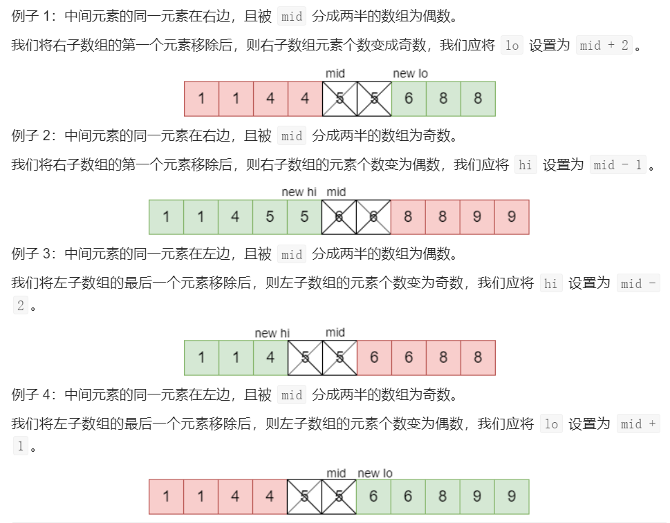

# Leetcode 题解 - 二分查找
<!-- GFM-TOC -->
* [Leetcode 题解 - 二分查找](#leetcode-题解---二分查找)
    * [1. 求开方](#1-求开方)
    * [2. 大于给定元素的最小元素](#2-大于给定元素的最小元素)
    * [3. 有序数组的 Single Element](#3-有序数组的-single-element)
    * [4. 第一个错误的版本](#4-第一个错误的版本)
    * [5. 旋转数组的最小数字](#5-旋转数组的最小数字)
    * [6. 查找区间](#6-查找区间)
<!-- GFM-TOC -->


**正常实现**  

```text
Input : [1,2,3,4,5]
key : 3
return the index : 2
```

```java
public int binarySearch(int[] nums, int key) {
    int l = 0, h = nums.length - 1;
    while (l <= h) {
        int m = l + (h - l) / 2;
        if (nums[m] == key) {
            return m;
        } else if (nums[m] > key) {
            h = m - 1;
        } else {
            l = m + 1;
        }
    }
    return -1;
}
```

**时间复杂度**  

二分查找也称为折半查找，每次都能将查找区间减半，这种折半特性的算法时间复杂度为 O(logN)。

**m 计算**  

有两种计算中值 m 的方式：

- m = (l + h) / 2
- m = l + (h - l) / 2

l + h 可能出现加法溢出，也就是说加法的结果大于整型能够表示的范围。但是 l 和 h 都为正数，因此 h - l 不会出现加法溢出问题。所以，最好使用第二种计算法方法。

**未成功查找的返回值**  

循环退出时如果仍然没有查找到 key，那么表示查找失败。可以有两种返回值：

- -1：以一个错误码表示没有查找到 key
- l：将 key 插入到 nums 中的正确位置

**变种**  

二分查找可以有很多变种，实现变种要注意边界值的判断。例如在一个有重复元素的数组中查找 key 的最左位置的实现如下：

```java
public int binarySearch(int[] nums, int key) {
    int l = 0, h = nums.length;
    while (l < h) {
        int m = l + (h - l) / 2;
        if (nums[m] >= key) {
            h = m;
        } else {
            l = m + 1;
        }
    }
    return l;
}
```

该实现和正常实现有以下不同：

- h 的赋值表达式为 h = m
- 循环条件为 l \< h
- 最后返回 l 而不是 -1

在 nums[m] \>= key 的情况下，可以推导出最左 key 位于 [l, m] 区间中，这是一个闭区间。h 的赋值表达式为 h = m，因为 m 位置也可能是解。

在 h 的赋值表达式为 h = m 的情况下，如果循环条件为 l \<= h，那么会出现循环无法退出的情况，因此循环条件只能是 l \< h。以下演示了循环条件为 l \<= h 时循环无法退出的情况：

```text
nums = {0, 1, 2}, key = 1
l   m   h
0   1   2  nums[m] >= key
0   0   1  nums[m] < key
1   1   1  nums[m] >= key
1   1   1  nums[m] >= key
...
```

当循环体退出时，不表示没有查找到 key，因此最后返回的结果不应该为 -1。为了验证有没有查找到，需要在调用端判断一下返回位置上的值和 key 是否相等。

## 1. 求开方

69\. Sqrt(x) (Easy)

[Leetcode](https://leetcode.com/problems/sqrtx/description/) / [69. x 的平方根](https://leetcode-cn.com/problems/sqrtx/)

```html
Input: 4
Output: 2

Input: 8
Output: 2
Explanation: The square root of 8 is 2.82842..., and since we want to return an integer, the decimal part will be truncated.
```

一个数 x 的开方 sqrt 一定在 0 \~ x 之间，并且满足 sqrt == x / sqrt。可以利用二分查找在 0 \~ x 之间查找 sqrt。

对于 x = 8，它的开方是 2.82842...，最后应该返回 2 而不是 3。在循环条件为 l \<= h 并且循环退出时，h 总是比 l 小 1，也就是说 h = 2，l = 3，因此最后的返回值应该为 h 而不是 l。

```java
//写法1
public class Solution {
    public int mySqrt(int x) {
        int l = 0;
        int r = x;
        while (l <= r) {
            long m = (l + r) / 2;	  //int m = l + (r - l) / 2;
            if (m * m == x)			  //int的话 46341*46341=-2147479015 
                return (int) m;
            else if (m * m < x)
                l = (int) (m + 1);
            else if (m * m > x)
                r = (int) (m - 1);
        }
        return r;
    }
}
//08-4
//03-2
//33-3
//32返回2

//写法2
public class Solution {
    public int mySqrt(int x) {
        if (x <= 1) {
            return x;
        }
        int l = 1, h = x;
        while (l <= h) {
            int mid = l + (h - l) / 2;
            int sqrt = x / mid;
            if (sqrt == mid) {
                return mid;
            } else if (mid > sqrt) {
                h = mid - 1;
            } else {
                l = mid + 1;
            }
        }
        return h;
    }
}
```

## 2. 大于给定元素的最小元素

744\. Find Smallest Letter Greater Than Target (Easy)

[Leetcode](https://leetcode.com/problems/find-smallest-letter-greater-than-target/description/) / [744. 寻找比目标字母大的最小字母](https://leetcode-cn.com/problems/find-smallest-letter-greater-than-target/)

```js
给你一个排序后的字符列表 letters ，列表中只包含小写英文字母。另给出一个目标字母 target，请你寻找在这一有序列表里比目标字母大的最小字母。

在比较时，字母是依序循环出现的。举个例子：
如果目标字母 target = 'z' 并且字符列表为 letters = ['a', 'b']，则答案返回 'a'
 
示例：

输入:
letters = ["c", "f", "j"]
target = "a"
输出: "c"

输入:
letters = ["c", "f", "j"]
target = "c"
输出: "f"

输入:
letters = ["c", "f", "j"]
target = "g"
输出: "j"

输入:
letters = ["c", "f", "j"]
target = "j"  
输出: "c"		 

提示：
letters长度范围在[2, 10000]区间内。
letters 仅由小写字母组成，最少包含两个不同的字母。
目标字母target 是一个小写字母。
```

题目描述：给定一个有序的字符数组 letters 和一个字符 target，要求找出 letters 中大于 target 的最小字符，如果找不到就返回第 1 个字符。

```java
//我的思路，二分查找找target+1的最左边界。
class Solution {
    public char nextGreatestLetter(char[] letters, char target) {
        int n = letters.length;
        int l = 0, h = n - 1;
        while (l <= h) {
            int m = l + (h - l) / 2;
            if (letters[m] < (target+1)) {
                l = m + 1;     
            } else {
                h = m - 1;
            }
        }
        return l < n ? letters[l] : letters[0];//找的是最右边界，但是故意返回l
    }
}

//这个思路是找target的最右边界，但是故意返回l
class Solution {
    public char nextGreatestLetter(char[] letters, char target) {
        int n = letters.length;
        int l = 0, h = n - 1;
        while (l <= h) {
            int m = l + (h - l) / 2;
            if (letters[m] <= target) {
                l = m + 1;     //找到目标值以后，认为这个目标值是小的，继续扩大l向右边找。
            } else {
                h = m - 1;
            }
        }
        return l < n ? letters[l] : letters[0];//找的是最右边界，但是故意返回l
    }
}
```

## 3. 有序数组的 Single Element

540\. Single Element in a Sorted Array (Medium)

[Leetcode](https://leetcode.com/problems/single-element-in-a-sorted-array/description/) / [540. 有序数组中的单一元素](https://leetcode-cn.com/problems/single-element-in-a-sorted-array/)

```js
给定一个只包含整数的有序数组，每个元素都会出现两次，唯有一个数只会出现一次，找出这个数。

示例 1:
输入: [1,1,2,3,3,4,4,8,8]
输出: 2

示例 2:
输入: [3,3,7,7,10,11,11]
输出: 10
注意: 您的方案应该在 O(log n)时间复杂度和 O(1)空间复杂度中运行。
```

题目描述：一个有序数组只有一个数不出现两次，找出这个数。

要求以 O(logN) 时间复杂度进行求解，因此不能遍历数组并进行异或操作来求解，这么做的时间复杂度为 O(N)。

令 index 为 Single Element 在数组中的位置。在 index 之后，数组中原来存在的成对状态被改变。如果 m 为偶数，并且 m + 1 \< index，那么 nums[m] == nums[m + 1]；m + 1 \>= index，那么 nums[m] != nums[m + 1]。

从上面的规律可以知道，如果 nums[m] == nums[m + 1]，那么 index 所在的数组位置为 [m + 2, h]，此时令 l = m + 2；如果 nums[m] != nums[m + 1]，那么 index 所在的数组位置为 [l, m]，此时令 h = m。

因为 h 的赋值表达式为 h = m，那么循环条件也就只能使用 l \< h 这种形式。


#### 思路1：

对二分情况分析：



**复杂度分析**

- 时间复杂度：O(log n)。在每次循环迭代中，我们将搜索空间减少了一半。
- 空间复杂度：O(1)，仅使用了常数空间。

发现即使数组没有经过排序，只要将同一元素放在一起，该算法仍然起作用（例：[10, 10, 4, 4, 7, 11, 11, 12, 12, 2, 2]）。他们的顺序无关紧要，重要的是含有单个元素的子数组元素个数为奇数。

```java
//这个代码，时间还可再优化，看下边。
class Solution {
    public int singleNonDuplicate(int[] nums) {
        int l = 0;
        int h = nums.length - 1;
        while (l < h) {
            int m = l + (h - l) / 2;
            boolean halvesAreEven = (h - m) % 2 == 0;
            if (nums[m + 1] == nums[m]) {
                if (halvesAreEven) {
                    l = m + 2;
                } else {
                    h = m - 1;
                }
            } else if (nums[m - 1] == nums[m]) {
                if (halvesAreEven) {
                    h = m - 2;
                } else {
                    l = m + 1;
                }
            } else {
                return nums[m];
            }
        }
        return nums[l];
    }
}
```

#### 思路2：

是思路1 的优化。

```js
时间复杂度：O(logN/2)=O(logN)。我们仅对元素的一半进行二分搜索。
空间复杂度：O(1)，仅用了常数的空间。
```

在单个元素的后面，则成对的元素变为奇数索引后跟他们的同一元素。说明我们在检索单个元素后面的偶数索引时，其后都没有它的同一元素。因此，我们可以通过偶数索引确定单个元素在左侧还是右侧。

- 奇数长度的数组首尾元素索引都为偶数，因此我们可以将 l 和 h 设置为数组首尾。
- 我们需要确保 m是偶数，如果为奇数，则将其减 1。
- 然后，我们检查 m的元素是否与其后面的索引相同。
- 如果相同，则我们知道 m不是单个元素。且单个元素在 m之后。则我们将 l设置为 m+ 2。
- 如果不是，则我们知道单个元素位于 m，或者在 m之前。我们将 h 设置为 m。不能大范围的改 h。
- 一旦 l==h，则当前搜索空间为 1 个元素，那么该元素为单个元素，我们将返回它。

```java
class Solution {
    public int singleNonDuplicate(int[] nums) {
        int l = 0;
        int r = nums.length - 1;
        while (l < r) {						//退出时l=r
            int m = l + (r - l) / 2;
            if (m % 2 == 1) m--;			//用m++，不好写。[1,1,2,3,3,4,4,8,8]超时。
            if (nums[m] == nums[m + 1]) {   //和下一位比较。
                l = m + 2;
            } else {
                r = m;						//这里是实际改为 r = m - 1;也是能过。	
            }
        }
        return nums[l];
    }
}
```

#### 暴力

注意：只遍历到倒数第二个就可以了，i < nums.length - 1 也防止 if (nums[i] != nums[i + 1]) 的数组越界。

- 时间复杂度：O(n)。我们的线性搜索只查看每个元素一次。
- 空间复杂度：O(1)，只使用了常数的额外空间。

```js
class Solution {
    public int singleNonDuplicate(int[] nums) {
        for (int i = 0; i < nums.length - 1; i+=2) {
            if (nums[i] != nums[i + 1]) {			//i < nums.length - 1
                return nums[i];
            }
        }
        return nums[nums.length - 1];
    }
}
```

## 4. 第一个错误的版本

278\. First Bad Version (Easy)

[Leetcode](https://leetcode.com/problems/first-bad-version/description/) / [278. 第一个错误的版本](https://leetcode-cn.com/problems/first-bad-version/)

题目描述：给定一个元素 n 代表有 [1, 2, ..., n] 版本，在第 x 位置开始出现错误版本，导致后面的版本都错误。可以调用 isBadVersion(int x) 知道某个版本是否错误，要求找到第一个错误的版本。

如果第 m 个版本出错，则表示第一个错误的版本在 [l, m] 之间，令 h = m；否则第一个错误的版本在 [m + 1, h] 之间，令 l = m + 1。

因为 h 的赋值表达式为 h = m，因此循环条件为 l \< h。

```js
示例:
给定 n = 5，并且 version = 4 是第一个错误的版本。
调用 isBadVersion(3) -> false
调用 isBadVersion(5) -> true
调用 isBadVersion(4) -> true
所以，4 是第一个错误的版本。 
```

```java
/* The isBadVersion API is defined in the parent class VersionControl.
      boolean isBadVersion(int version); */
public class Solution extends VersionControl {
    public int firstBadVersion(int n) {
        int l = 1, h = n;
        while (l < h) {
            int mid = l + (h - l) / 2;
            if (isBadVersion(mid)) {  //代表错误
                h = mid;
            } else {     			  //代表正确
                l = mid + 1;
            }
        }
        return l;
    }
}
```

## 5. 旋转数组的最小数字

153\. Find Minimum in Rotated Sorted Array (Medium)

[Leetcode](https://leetcode.com/problems/find-minimum-in-rotated-sorted-array/description/) / [153. 寻找旋转排序数组中的最小值](https://leetcode-cn.com/problems/find-minimum-in-rotated-sorted-array/)

[剑指 Offer 11. 旋转数组的最小数字](https://leetcode-cn.com/problems/xuan-zhuan-shu-zu-de-zui-xiao-shu-zi-lcof/)

[154. 寻找旋转排序数组中的最小值 II](https://leetcode-cn.com/problems/find-minimum-in-rotated-sorted-array-ii/)

```js
示例 1：

输入：nums = [3,4,5,1,2]
输出：1
解释：原数组为 [1,2,3,4,5] ，旋转 3 次得到输入数组。
示例 2：

输入：nums = [4,5,6,7,0,1,2]
输出：0
解释：原数组为 [0,1,2,4,5,6,7] ，旋转 4 次得到输入数组。
示例 3：

输入：nums = [11,13,15,17]
输出：11
解释：原数组为 [11,13,15,17] ，旋转 4 次得到输入数组。
 
提示：
n == nums.length
1 <= n <= 5000
-5000 <= nums[i] <= 5000
nums 原来是一个升序排序的数组，并进行了 1 至 n 次旋转

nums 中的所有整数 互不相同，这点很关键。
```

```java
//其他，针对153题，有重复的过不去。
class Solution {
    public int findMin(int[] nums) {
        int l = 0, h = nums.length - 1;
        while (l < h) {					//注意条件
            int m = l + (h - l) / 2;
            if (nums[m] <= nums[h]) {	//注意这里的小于等于都不敢-1的。
                h = m;
            } else {
                l = m + 1;
            }
        }
        return nums[l];
    }
}
```

下边代码上边的题目都可以过，可以处理掉重复值的问题。

```java
class Solution {
    public int minArray(int[] nums) {
        int l = 0, r = nums.length - 1;
        while (l < r) {								//条件
            int m = (l + r) / 2;
            if (nums[m] > nums[r]) l = m + 1;
            else if (nums[m] < nums[r]) r = m;		//r不敢动
            else if (nums[m] == nums[r]) r--;		//r--这一行处理数组重复值的情况
        }
        return nums[l];
    }
}
```

但是当出现 nums[m] = nums[j] 时，一定有区间 [i, m] 内所有元素相等 或 区间 [m, j] 内所有元素相等（或两者皆满足），可以举例子说明的。对于寻找此类数组的最小值问题，可直接放弃二分查找，而使用**线性查找替代**。

优化版本

```java
class Solution {
    public int minArray(int[] nums) {
        int l = 0, r = nums.length - 1;
        while (l < r) {
            int m = (l + r) / 2;
            if (nums[m] > nums[r]) l = m + 1;
            else if (nums[m] < nums[r]) r = m;
            else if (nums[m] == nums[r]){
                int x = l;
                for(int k = l + 1; k < r; k++) {
                    if(nums[k] < nums[x]) x = k;
                }
                return nums[x];
            }
        }
        return nums[l];
    }
}
```

## 6. 查找区间

34\. Find First and Last Position of Element in Sorted Array

[Leetcode](https://leetcode.com/problems/find-first-and-last-position-of-element-in-sorted-array/) / [34. 在排序数组中查找元素的第一个和最后一个位置](https://leetcode-cn.com/problems/find-first-and-last-position-of-element-in-sorted-array/)

```js
如果数组中不存在目标值 target，返回 [-1, -1]。
进阶：你可以设计并实现时间复杂度为 O(log n) 的算法解决此问题吗？

示例 1：

输入：nums = [5,7,7,8,8,10], target = 8
输出：[3,4]
示例 2：

输入：nums = [5,7,7,8,8,10], target = 6
输出：[-1,-1]
示例 3：

输入：nums = [], target = 0
输出：[-1,-1]
```

题目描述：给定一个有序数组 nums 和一个目标 target，要求找到 target 在 nums 中的第一个位置和最后一个位置。

可以用二分查找找出第一个位置和最后一个位置，但是寻找的方法有所不同，需要实现两个二分查找。

我们将寻找  target 最后一个位置，转换成寻找 target+1 第一个位置，再往前移动一个位置。这样我们只需要实现一个二分查找代码即可。

```java
class Solution {
    public int[] searchRange(int[] nums, int target) {
        int l = helper(nums, target);
        int r = helper(nums, target + 1);
        if (l >= nums.length || nums[l] != target)
            return new int[]{-1, -1};
        return new int[]{l, r - 1};
    }
    int helper(int[] nums, int tar) {	
        int l = 0, r = nums.length - 1;
        while (l <= r) {
            int m = (l + r) / 2;
            if (nums[m] >= tar) r = m - 1;	//找最左边界
            else l = m + 1;
        }
        return l;
    }
}
```


