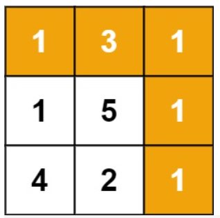
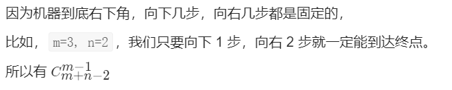
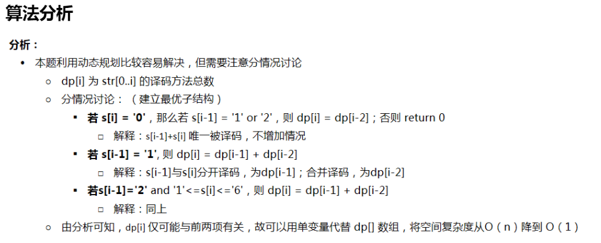

Leetcode 题解 - 动态规划

<!-- GFM-TOC -->
* [Leetcode 题解 - 动态规划](#leetcode-题解---动态规划)
    * [斐波那契数列](#斐波那契数列)
        * [1. 爬楼梯](#1-爬楼梯)
        * [2. 强盗抢劫](#2-强盗抢劫)
        * [3. 强盗在环形街区抢劫](#3-强盗在环形街区抢劫)
        * [4. 信件错排](#4-信件错排)
        * [5. 母牛生产](#5-母牛生产)
    * [矩阵路径](#矩阵路径)
        * [1. 矩阵的最小路径和](#1-矩阵的最小路径和)
        * [2. 矩阵的总路径数](#2-矩阵的总路径数)
    * [数组区间](#数组区间)
        * [1. 数组区间和](#1-数组区间和)
        * [2. 数组中等差递增子区间的个数](#2-数组中等差递增子区间的个数)
    * [分割整数](#分割整数)
        * [1. 分割整数的最大乘积](#1-分割整数的最大乘积)
        * [2. 按平方数来分割整数](#2-按平方数来分割整数)
        * [3. 分割整数构成字母字符串](#3-分割整数构成字母字符串)


递归和动态规划都是将原问题拆成多个子问题然后求解，他们之间最本质的区别是，动态规划保存了子问题的解，避免重复计算。

## 斐波那契数列

### 1. 爬楼梯

70\. Climbing Stairs (Easy)

[Leetcode](https://leetcode.com/problems/climbing-stairs/description/) / [70. 爬楼梯](https://leetcode-cn.com/problems/climbing-stairs/)

题目描述：有 N 阶楼梯，每次可以上一阶或者两阶，求有多少种上楼梯的方法。

定义一个数组 dp 存储上楼梯的方法数（为了方便讨论，数组下标从 1 开始），dp[i] 表示走到第 i 个楼梯的方法数目。

第 i 个楼梯可以从第 i-1 和 i-2 个楼梯再走一步到达，走到第 i 个楼梯的方法数为走到第 i-1 和第 i-2 个楼梯的方法数之和。

<!--<div align="center"></div> <br>-->

<div align="center">  </div><br>
考虑到 dp[i] 只与 dp[i - 1] 和 dp[i - 2] 有关，因此可以只用两个变量来存储 dp[i - 1] 和 dp[i - 2]，使得原来的 O(N) 空间复杂度优化为 O(1) 复杂度。

```java
class Solution {
    public int climbStairs(int n) {
        if (n <= 2) {
            return n;
        }
        int pre2 = 1, pre1 = 2;
        for (int i = 2; i < n; i++) {
            int cur = pre1 + pre2;
            pre2 = pre1;
            pre1 = cur;
        }
        return pre1;
    }
}
```

### 2. 强盗抢劫

198\. House Robber (Easy)

[Leetcode](https://leetcode.com/problems/house-robber/description/) / [198. 打家劫舍](https://leetcode-cn.com/problems/house-robber/)

题目描述：抢劫一排住户，但是不能抢邻近的住户，求最大抢劫量。

定义 dp 数组用来存储最大的抢劫量，其中 dp[i] 表示抢到第 i 个住户时的最大抢劫量。

由于不能抢劫邻近住户，如果抢劫了第 i -1 个住户，那么就不能再抢劫第 i 个住户，所以

<!--<div align="center"></div> <br>-->

<div align="center">  </div><br>
```java
class Solution {
    public int rob(int[] nums) {
        int pre2 = 0, pre1 = 0;
        for (int i = 0; i < nums.length; i++) {
            int cur = Math.max(pre2 + nums[i], pre1);
            pre2 = pre1;
            pre1 = cur;
        }
        return pre1;
    }
}
```

### 3. 强盗在环形街区抢劫

213\. House Robber II (Medium)

[Leetcode](https://leetcode.com/problems/house-robber-ii/description/) / [213. 打家劫舍 II](https://leetcode-cn.com/problems/house-robber-ii/)

```js
这个地方所有的房屋都 围成一圈 ，这意味着第一个房屋和最后一个房屋是紧挨着的。同时，相邻的房屋装有相互连通的防盗系统，如果两间相邻的房屋在同一晚上被小偷闯入，系统会自动报警。
给定一个代表每个房屋存放金额的非负整数数组，计算你 在不触动警报装置的情况下 ，能够偷窃到的最高金额。
#也就是数组是循环的。

示例 1：

输入：nums = [2,3,2]
输出：3
解释：你不能先偷窃 1 号房屋（金额 = 2），然后偷窃 3 号房屋（金额 = 2）, 因为他们是相邻的。
示例 2：

输入：nums = [1,2,3,1]
输出：4
解释：可以先偷窃 1 号房屋（金额 = 1），然后偷窃 3 号房屋（金额 = 3）。偷窃到的最高金额 = 1 + 3 = 4 。
```

```java
class Solution {
    public int rob(int[] nums) {
        if (nums == null || nums.length == 0) {
            return 0;
        }
        int n = nums.length;
        if (n == 1) {
            return nums[0];
        }
        // 先保证n - 2有意义，再处理环形。分别处理0到倒数第二个，1到倒数第一个就是最后一个。处理两次
        return Math.max(rob(nums, 0, n - 2), rob(nums, 1, n - 1));
    }

    private int rob(int[] nums, int first, int last) {
        int pre2 = 0, pre1 = 0;
        for (int i = first; i <= last; i++) {//这里是等于，i <= last
            int cur = Math.max(pre1, pre2 + nums[i]);
            pre2 = pre1;
            pre1 = cur;
        }
        return pre1;
    }
}
```

### 4. 信件错排

题目描述：有 N 个 信 和 信封，它们被打乱，求错误装信方式的数量。

定义一个数组 dp 存储错误方式数量，dp[i] 表示前 i 个信和信封的错误方式数量。

假设第 i 个信装到第 j 个信封里面，而第 j 个信装到第 k 个信封里面。根据 i 和 k 是否相等，有两种情况：

- i==k，交换 i 和 j 的信后，它们的信和信封在正确的位置，但是其余 i-2 封信有 dp[i-2] 种错误装信的方式。由于 j 有 i-1 种取值，因此共有 (i-1)\*dp[i-2] 种错误装信方式。
- i != k，交换 i 和 j 的信后，第 i 个信和信封在正确的位置，其余 i-1 封信有 dp[i-1] 种错误装信方式。由于 j 有 i-1 种取值，因此共有 (i-1)\*dp[i-1] 种错误装信方式。

综上所述，错误装信数量方式数量为：

<!--<div align="center"></div> <br>-->

<div align="center">  </div><br>
因此，D(n) = (n - 1) (D(n - 2) + D(n - 1))，特别地，有D(1) = 0, D(2) = 1。 

参考

力扣会员题目：[Leetcode] 634. Find the Derangement of An Array 解题报告

https://blog.csdn.net/magicbean2/article/details/79112988

优化参考：【Leetcode】634. Find the Derangement of An Array

https://blog.csdn.net/qq_46105170/article/details/113707003

题目

在组合数学中，排列是一组元素的排列，因此没有元素出现在其原始位置。

最初有一个数组，其中包含从1到n的n个整数，按升序排列，您需要找到它可以产生的排列数。

另外，由于答案可能非常大，因此您应该返回输出 mod 109 + 7。


思路：

组合数学中的错排问题。当n个编号元素放在n个编号位置，元素编号与位置编号各不对应的方法数用D(n)表示。

那么D(n-1)就表示n-1个编号元素放在n-1个编号位置，各不对应的方法数，其它类推。推导方法如下：

1、把第n个元素放在某一个位置，比如位置k，那么一共有(n-1)中放法。

2、放编号为k的元素，此时有两种情况：

​	a）把k放到位置n，那么对于剩下的n-2个元素，就一共有D(n-2)种放法；

​	b）第k个元素不放在位置n，这时 k 连同其余的n-2个元素都各有一个位置不能放，所以有D(n-1)种放法。

因此，D(n) = (n - 1) (D(n - 2) + D(n - 1))，特别地，有D(1) = 0, D(2) = 1。于是，这道题目就变成了动态规划。


范例1：

输入：3				2			1

输出：2				1			0

说明：原始数组为[1,2,3]。 这两个排列分别是[2,3,1]和[3,1,2]。

```java
class Solution {
    public static void main(String[] args) {
        System.out.println(findDerangement(3));
    }
    public static int findDerangement(int n) {
        long pre2 = 0, pre1 = 1;
        long ret = (n == 1) ? 0 : 1;
        for (int i = 3; i <= n; ++i) {
            ret = ((i - 1) * (pre1 + pre2)) % 1000000007;
            pre2 = pre1;
            pre1 = ret;
        }
        return (int)ret;
    }
}
```

### 5. 母牛生产

[程序员代码面试指南-P181](#)

题目描述：

假设农场中成熟的母牛每年都会生 1 头小母牛，并且永远不会死。

第一年有 1 只小母牛，从第二年开始，母牛开始生小母牛。

每只小母牛 3 年之后成熟又可以生小母牛。给定整数 N，求 N 年后牛的数量。

第 i 年成熟的牛的数量为：

<!--<div align="center"></div> <br>-->

<div align="center">  </div><br>
参考：https://blog.csdn.net/weixin_30832143/article/details/96741056

```java
public  int cowNums(int n){
    int[] dp=new int [n+1];
    if(n==0)
        return 0;
    if(n==1)
        return 1;
    if(n==2)
        return 2;
    if(n==3)
        return 3;
    dp[0]=0;
    dp[1]=1;
    dp[2]=2;
    dp[3]=3;
    for(int i=4;i<=n;i++){
        dp[i]=dp[i-1]+dp[i-3];
    }
    return dp[n];
}
```

变式参考：[母牛生小牛问题](https://www.cnblogs.com/AndyJee/p/4457411.html)

题目：

一头刚出生的小母牛，4年后生一头小母牛，以后每年生一头，现有一头刚出生的小母牛，问20年后共有多少头牛？

思路：

列举前n年的情况：1、1、1、2、3、4、6、8、11。。。

将规律抽象成公式：F(1)=1	F(2)=1	F(3)=1	**F(n)=F(n-1)+F(n-3)** 

F(n):表示第n年共有多少头牛

F(n-1):表示第n-1年共有多少头牛

F(n-3):表示第(n-3)年出生的母牛在第n年生的小母牛数

```java
// recursive method
int NumOfCow(int n){
    if(n<=3)
        return 1;
    return NumOfCow(n-1)+NumOfCow(n-3);
}

// dynamic programming method
int NumOfCow2(int n){
    int num[n+1];
    for(int i=1;i<=n;i++){
        if(i<=3) num[i]=1;
        else num[i]=num[i-1]+num[i-3];
    }
    return num[n];
}
```

变形：假设母牛只有十年寿命，那么**减去十年前出生的母牛数量即可**。 

参考：LeetCode刷题之动态规划（一）：https://juejin.cn/post/6844904023196172295#heading-5

## 矩阵路径

### 1. 矩阵的最小路径和

64\. Minimum Path Sum (Medium)

[Leetcode](https://leetcode.com/problems/minimum-path-sum/description/) / [64. 最小路径和](https://leetcode-cn.com/problems/minimum-path-sum/)



```js
给定一个包含非负整数的 m x n 网格 grid ，请找出一条从左上角到右下角的路径，使得路径上的数字总和为最小。
说明：每次只能向下或者向右移动一步。

示例 1：
输入：grid = [[1,3,1],
             [1,5,1],
             [4,2,1]]
输出：7
解释：因为路径 1→3→1→1→1 的总和最小。

示例 2：
输入：grid = [[1,2,3],
             [4,5,6]]
输出：12
 
提示：
m == grid.length
n == grid[i].length
1 <= m, n <= 200
0 <= grid[i][j] <= 100
```

题目描述：求从矩阵的左上角到右下角的最小路径和，每次只能**向右和向下**移动。

多开一行数组简化代码

```java
class Solution {
    public int maxValue(int[][] grid) {
        int row = grid.length;
        int column = grid[0].length;
        //dp[i][j]表示从grid[0][0]到grid[i - 1][j - 1]时的最大价值
        int[][] dp = new int[row + 1][column + 1];
        for (int i = 1; i <= row; i++) {
            for (int j = 1; j <= column; j++) {
                dp[i][j] = Math.max(dp[i - 1][j], dp[i][j - 1]) + grid[i - 1][j - 1];
            }
        }
        return dp[row][column];
    }
}
```

```java
public int minPathSum(int[][] grid) {
    if (grid.length == 0 || grid[0].length == 0) {
        return 0;
    }
    int m = grid.length, n = grid[0].length;
    int[] dp = new int[n];
    for (int i = 0; i < m; i++) {
        for (int j = 0; j < n; j++) {
            if (j == 0) {
                dp[j] = dp[j];        // 只能从上侧走到该位置		dp[j]就代表上侧
            } else if (i == 0) {
                dp[j] = dp[j - 1];    // 只能从左侧走到该位置
            } else {
                dp[j] = Math.min(dp[j - 1], dp[j]);			//上测、左侧取最小
            }
            dp[j] += grid[i][j];
        }
    }
    return dp[n - 1];
}
```

类似题目，参考：剑指 47、礼物的最大值，只是改了一下最大值和最小值。上边是一个空间优化。

```java
class Solution {
    public int minPathSum(int[][] grid) {
        if (grid.length == 0 || grid[0].length == 0) {
            return 0;
        }
        int m = grid.length, n = grid[0].length;
        int[] dp = new int[n];
        for (int i = 0; i < m; i++) {
            for (int j = 0; j < n; j++) {
                if(i == 0 && j == 0) continue;				//左上角跳过
                if(i == 0) grid[i][j] += grid[i][j - 1] ;	//第一行dp[i][j]=d[i][j-1]
                else if(j == 0) grid[i][j] += grid[i - 1][j];
                else grid[i][j] += Math.min(grid[i][j - 1], grid[i - 1][j]);
            }
        }
        return grid[m - 1][n - 1];
    }
}
```

原数组不让改变的话，每次只需要上一层的结果的话，空间内存可以再优化一下 。

```java
class Solution {
    public int maxValue(int[][] grid) {
        int[] dp = new int[grid[0].length];
        for (int i = 0; i < grid.length; i++) {
            for (int j = 0; j < grid[0].length; j++) {
                if (j == 0) dp[j] += grid[i][j];//第一列
                else dp[j] = Math.max(dp[j - 1], dp[j]) + grid[i][j];
            }
        }
        return dp[dp.length - 1];
    }
}
```


### 2. 矩阵的总路径数

62\. Unique Paths (Medium)

[Leetcode](https://leetcode.com/problems/unique-paths/description/) / [62. 不同路径](https://leetcode-cn.com/problems/unique-paths/)

题目描述：统计从矩阵左上角到右下角的路径总数，每次只能向右或者向下移动。

<div align="center">  </div><br>
```
输入：m = 3, n = 7
输出：28

输入：m = 3, n = 2
输出：3
解释：
从左上角开始，总共有 3 条路径可以到达右下角。
1. 向右 -> 向下 -> 向下
2. 向下 -> 向下 -> 向右
3. 向下 -> 向右 -> 向下

输入：m = 7, n = 3
输出：28

输入：m = 3, n = 3
输出：6
```

题解

参考：https://leetcode-cn.com/problems/unique-paths/solution/dong-tai-gui-hua-by-powcai-2/

这是个[杨辉三角形](https://www.mathsisfun.com/pascals-triangle.html)，每个位置的路径 = 该位置左边的路径 + 该位置上边的路径 


**排列组合思路**



可以直接用数学公式求解，这是一个组合问题。机器人总共移动的次数 S=m+n-2，向下移动的次数 D=m-1，那么问题可以看成从 S 中取出 D 个位置的组合数量，这个问题的解为 C(S, D)。

```java
public int uniquePaths(int m, int n) {
    int S = m + n - 2;  // 总共的移动次数
    int D = m - 1;      // 向下的移动次数
    long ret = 1;
    for (int i = 1; i <= D; i++) {
        ret = ret * (S - D + i) / i;
    }
    return (int) ret;
}
```

**动态规划** 

我们令dp\[i][j]是到达i，j最多路径

**动态方程:dp\[i][j] = dp\[i-1][j] + dp\[i][j-1]**

注意，对于第一行|dp\[o][j]，或者第一列dp\[i][0]，由于都是在边界，所以只能为1

时间复杂度:O(m * 7)

空间复杂度:O(m * 7)

优化:因为我们每次只需要dp\[i-1][j, dp\[i][j-1]

所以我们只要记录这两个数，直接看代码吧!

```java
class Solution {
    public int uniquePaths(int m, int n) {
        int[][] dp = new int[m][n];
        for (int i = 0; i < n; i++) dp[0][i] = 1;
        for (int i = 0; i < m; i++) dp[i][0] = 1;
        for (int i = 1; i < m; i++) {
            for (int j = 1; j < n; j++) {
                dp[i][j] = dp[i - 1][j] + dp[i][j - 1];
            }
        }
        return dp[m - 1][n - 1];  
    }
}
```

空间优化到O(N)

```java
public int uniquePaths(int m, int n) {
    int[] dp = new int[n];//和列大小一样
    Arrays.fill(dp, 1);
    for (int i = 1; i < m; i++) {
        for (int j = 1; j < n; j++) {
            dp[j] = dp[j] + dp[j - 1];		//dp[j]就代表上边
        }
    }
    return dp[n - 1];
}
```

## 数组区间

### 1. 数组区间和

303\. Range Sum Query - Immutable (Easy)

[Leetcode](https://leetcode.com/problems/range-sum-query-immutable/description/) / [303. 区域和检索 - 数组不可变](https://leetcode-cn.com/problems/range-sum-query-immutable/)

```js
给定一个整数数组  nums，求出数组从索引 i 到 j（i ≤ j）范围内元素的总和，包含 i、j 两点。
实现 NumArray 类：
NumArray(int[] nums) 使用数组 nums 初始化对象
int sumRange(int i, int j) 返回数组 nums 从索引 i 到 j（i ≤ j）范围内元素的总和，包含 i、j 两点（也就是 sum(nums[i], nums[i + 1], ... , nums[j])）

示例：
输入：
["NumArray", "sumRange", "sumRange", "sumRange"]
[[[-2, 0, 3, -5, 2, -1]], [0, 2], [2, 5], [0, 5]]
输出：
[null, 1, -1, -3]

解释：
NumArray numArray = new NumArray([-2, 0, 3, -5, 2, -1]);
numArray.sumRange(0, 2); // return 1 ((-2) + 0 + 3)
numArray.sumRange(2, 5); // return -1 (3 + (-5) + 2 + (-1)) 
numArray.sumRange(0, 5); // return -3 ((-2) + 0 + 3 + (-5) + 2 + (-1))

提示：
0 <= nums.length <= 104
-105 <= nums[i] <= 105
0 <= i <= j < nums.length
最多调用 104 次 sumRange 方法
```

将前缀和数组sums的长度设为n + 1的目的是为了方便计算sumRange(i,j),不需要对i = 0的情况特殊处理。

求区间 i \~ j 的和，可以转换为 sum[j + 1] - sum[i]，其中 **sum[i] 为 0 \~ i - 1 的和。**

此时有：sumRange(i,j)= sums[j + 1] - sums[i]

```java
class NumArray {
    int[] sums;

    public NumArray(int[] nums) {
        int n = nums.length;	// 	      原来nums = [1, 2, 3, 4,  5,  6]
        sums = new int[n + 1];	//构造sums[n+1]值为[0, 1, 3, 6, 10, 15,21]
        for (int i = 0; i < n; i++) {		    	
            //就等于前一个sums和当前的 nums相加。
            //sums[0]不要管,sum[i] 为 0 ~ i - 1 的和
            sums[i + 1] = sums[i] + nums[i];    	
        }
    }
    
    public int sumRange(int i, int j) {	//nums2~nums5 => 3+4+5+6
        return sums[j + 1] - sums[i];	//sums[6]-sums[2] 123456-12
    }
}
```

### 2. 数组中等差递增子区间的个数

413\. Arithmetic Slices (Medium)

[Leetcode](https://leetcode.com/problems/arithmetic-slices/description/) / [413. 等差数列划分](https://leetcode-cn.com/problems/arithmetic-slices/)

```js
如果一个数列至少有三个元素，并且任意两个相邻元素之差相同，则称该数列为#等差数列。
例如，以下数列为等差数列:

数组 A 包含 N 个数，且索引从0开始。数组 A 的一个子数组划分为数组 (P, Q)，P 与 Q 是整数且满足 0<=P<Q<N 。
如果满足以下条件，则称子数组(P, Q)为等差数组：
元素 A[P], A[p + 1], ..., A[Q - 1], A[Q] 是等差的。并且 P + 1 < Q 。
函数要返回数组 A 中所有为等差数组的子数组个数。

示例1:
A = [1, 2, 3, 4]
返回: 3, A 中有三个子等差数组: [1, 2, 3], [2, 3, 4] 以及自身 [1, 2, 3, 4]。

示例2：
A = [0, 1, 2, 3, 4]

return: 6, for 3 arithmetic slices in A:
返回: 6, A 中有三个子等差数组

[0, 1, 2],

[1, 2, 3],
[0, 1, 2, 3],

[0, 1, 2, 3, 4],
[ 1, 2, 3, 4],
[2, 3, 4]

示例3：
输入：[1,2,3,8,9,10]	#输入未必是等差数列
输出：2

示例4：
输入：[1]
输出：0

输入：[-1,-10]
输出：0

输入：[1,2,3]	#(至少3个元素)
输出：1
```

dp[i] 表示以 A[i] 为结尾的等差递增子区间的个数。

当 A[i] - A[i-1] == A[i-1] - A[i-2]，那么 [A[i-2], A[i-1], A[i]] 构成一个等差递增子区间。而且在以 A[i-1] 为结尾的递增子区间的后面再加上一个 A[i]，一样可以构成新的递增子区间。

```js
#dp[2] = 1
    [0, 1, 2]
#dp[3] = dp[2] + 1 = 2
    [0, 1, 2, 3], // [0, 1, 2] 之后加一个 3
    [1, 2, 3]     // 新的递增子区间
#dp[4] = dp[3] + 1 = 3
    [0, 1, 2, 3, 4], // [0, 1, 2, 3] 之后加一个 4
    [1, 2, 3, 4],    // [1, 2, 3] 之后加一个 4
    [2, 3, 4]        // 新的递增子区间
```

综上，在 A[i] - A[i-1] == A[i-1] - A[i-2] 时，dp[i] = dp[i-1] + 1。

因为递增子区间不一定以最后一个元素为结尾，可以是任意一个元素结尾，因此需要返回 dp 数组累加的结果。

```java
class Solution {
    public int numberOfArithmeticSlices(int[] A) {
        if (A == null || A.length == 0) {
            return 0;
        }
        int n = A.length;
        int[] dp = new int[n];
        for (int i = 2; i < n; i++) {
            if (A[i] - A[i - 1] == A[i - 1] - A[i - 2]) {
                dp[i] = dp[i - 1] + 1;
            }
        }
        int total = 0;
        for (int cnt : dp) {
            total += cnt;
        }
        return total;
    }
}
```

dp[i]只和dp[i-1]有关，省去dp数组。

```java
class Solution {
    public int numberOfArithmeticSlices(int[] A) {
        if (A == null || A.length <= 2)
            return 0;
        int rets = 0;
        int ret = 0;
        for (int i = 2; i < A.length; i++)
            if (A[i - 1] - A[i] == A[i - 2] - A[i - 1])		//跨越3个数字校验。
                rets += ++ret;
            else
                ret = 0;				
        return rets;
    }
}
```

## 分割整数

### 1. 分割整数的最大乘积

343\. Integer Break (Medim)

[Leetcode](https://leetcode.com/problems/integer-break/description/) / [343. 整数拆分](https://leetcode-cn.com/problems/integer-break/)

题目描述：For example, given n = 2, return 1 (2 = 1 + 1); given n = 10, return 36 (10 = 3 + 3 + 4).

```js
给定一个正整数 n，将其拆分为至少两个正整数的和，并使这些整数的乘积最大化。 返回你可以获得的最大乘积。

示例 1:

输入: 2
输出: 1
解释: 2 = 1 + 1, 1 × 1 = 1。

示例 2:

输入: 10
输出: 36
解释: 10 = 3 + 3 + 4, 3 × 3 × 4 = 36。

说明: 你可以假设 n 不小于 2 且不大于 58。
```

```java
//题目：剑指 14、剪绳子 两题一样
class Solution {
    public int integerBreak(int n) {
        if(n <= 3) return n - 1;
        int a = n / 3, b = n % 3;
        if(b == 0) return (int)Math.pow(3, a);
        if(b == 1) return (int)Math.pow(3, a - 1) * 4;
        return (int)Math.pow(3, a) * 2;
    }
}
```

```java
//其他
public int integerBreak(int n) {
    int[] dp = new int[n + 1];
    dp[1] = 1;
    for (int i = 2; i <= n; i++) {
        for (int j = 1; j <= i - 1; j++) {
            dp[i] = Math.max(dp[i], Math.max(j * dp[i - j], j * (i - j)));
        }
    }
    return dp[n];
}
```

### 2. 按平方数来分割整数

279\. Perfect Squares(Medium)

[Leetcode](https://leetcode.com/problems/perfect-squares/description/) / [279. 完全平方数](https://leetcode-cn.com/problems/perfect-squares/)

题目描述：For example, given n = 12, return 3 because 12 = 4 + 4 + 4; given n = 13, return 2 because 13 = 4 + 9.

```js
给定正整数 n，找到若干个完全平方数（比如 1, 4, 9, 16, ...）使得它们的和等于 n。你需要让组成和的完全平方数的个数最少。

给你一个整数 n ，返回和为 n 的完全平方数的 最少数量 。

完全平方数 是一个整数，其值等于另一个整数的平方；换句话说，其值等于一个整数自乘的积。
例如，1、4、9 和 16 都是完全平方数，而 3 和 11 不是。
 
示例 1：

输入：n = 12
输出：3 
解释：12 = 4 + 4 + 4
示例 2：

输入：n = 13
输出：2
解释：13 = 4 + 9
 
提示：1 <= n <= 104
```

思路：类似零钱找零 [322. 零钱兑换](https://leetcode-cn.com/problems/coin-change/)

参考 dp 思路，有点复杂。

https://leetcode-cn.com/problems/perfect-squares/solution/hua-jie-suan-fa-279-wan-quan-ping-fang-shu-by-guan/

数学方法：

这道题如果知道数学定理之后，相当于告诉你：

- 任何正整数都可以拆分成不超过4个数的平方和 ---> 答案只可能是1,2,3,4

- 如果一个数最少可以拆成4个数的平方和，则这个数还满足 n = (4^a)*(8b+7) ---> 因此可以先看这个数是否满

  足上述公式，如果不满足，答案就是1,2,3了

- 如果这个数本来就是某个数的平方，那么答案就是1，否则答案就只剩2,3了

- 如果答案是2，即n=a^2+b^2，那么我们可以枚举a，来验证，如果验证通过则答案是2，否则只能是3

参考5种方法的官解：

https://leetcode-cn.com/problems/perfect-squares/solution/wan-quan-ping-fang-shu-by-leetcode/

```java
class Solution {
  public int numSquares(int n) {
    while (n % 4 == 0)						//处理4种情况的，四平方和三平方定理。
      n /= 4;
    if (n % 8 == 7)
      return 4;

    if (this.isSquare(n))					//处理1种情况的
      return 1;
      
    for (int i = 1; i * i <= n; ++i) {		//枚举，检查数字是否可以分解为两个平方的和。 
      if (this.isSquare(n - i * i))
        return 2;
    }
    return 3;								//三平方和定理
  }
    
  protected boolean isSquare(int n) {		//两种情况的
    int sq = (int) Math.sqrt(n);
    return n == sq * sq;
  }
    
}
```

贪心枚举快一些，29ms，88%左右。

下边的是普通dp，43ms，56%

```java
class Solution {
  public int numSquares(int n) {
    int dp[] = new int[n + 1];
    Arrays.fill(dp, Integer.MAX_VALUE);
    // bottom case
    dp[0] = 0;
    // pre-calculate the square numbers.
    int max_square_index = (int) Math.sqrt(n) + 1;
    int square_nums[] = new int[max_square_index];
    for (int i = 1; i < max_square_index; ++i) {
      square_nums[i] = i * i;
    }

    for (int i = 1; i <= n; ++i) {
      for (int s = 1; s < max_square_index; ++s) {
        if (i < square_nums[s])
          break;
        dp[i] = Math.min(dp[i], dp[i - square_nums[s]] + 1);
      }
    }
    return dp[n];
  }
}
```

其他题解：

```java
//182ms,13%
class Solution {
    public int numSquares(int n) {
        List<Integer> squareList = generateSquareList(n);
        int[] dp = new int[n + 1];
        for (int i = 1; i <= n; i++) {
            int min = Integer.MAX_VALUE;
            for (int square : squareList) {
                if (square > i) {
                    break;
                }
                min = Math.min(min, dp[i - square] + 1);
            }
            dp[i] = min;
        }
        return dp[n];
    }

    private List<Integer> generateSquareList(int n) {
        List<Integer> squareList = new ArrayList<>();
        int diff = 3;
        int square = 1;
        while (square <= n) {
            squareList.add(square);
            square += diff;
            diff += 2;
        }
        return squareList;
    }
}
```

### 3. 分割整数构成字母字符串

91\. Decode Ways (Medium)

[Leetcode](https://leetcode.com/problems/decode-ways/description/) / [91. 解码方法](https://leetcode-cn.com/problems/decode-ways/)

题目描述：Given encoded message "12", it could be decoded as "AB" (1 2) or "L" (12).

```js
一条包含字母 A-Z 的消息通过以下映射进行了 编码 ：
'A' -> 1
'B' -> 2
...
'Z' -> 26
要 解码 已编码的消息，所有数字必须基于上述映射的方法，反向映射回字母（可能有多种方法）。例如，"111" 可以将 "1" 中的每个 "1" 映射为 "A" ，从而得到 "AAA" ，或者可以将 "11" 和 "1"（分别为 "K" 和 "A" ）映射为 "KA" 。注意，"06" 不能映射为 "F" ，因为 "6" 和 "06" 不同。
给你一个只含数字的 非空 字符串 num ，请计算并返回 解码 方法的 总数 。
题目数据保证答案肯定是一个 32 位 的整数。

示例 1：

输入：s = "12"
输出：2
解释：它可以解码为 "AB"（1 2）或者 "L"（12）。
示例 2：

输入：s = "226"
输出：3
解释：它可以解码为 "BZ" (2 26), "VF" (22 6), 或者 "BBF" (2 2 6) 。
示例 3：

输入：s = "0"
输出：0
解释：没有字符映射到以 0 开头的数字。含有 0 的有效映射是 'J' -> "10" 和 'T'-> "20" 。由于没有字符，因此没有有效的方法对此进行解码，因为所有数字都需要映射。
示例 4：

输入：s = "06"
输出：0
解释："06" 不能映射到 "F" ，因为字符串开头的 0 无法指向一个有效的字符。 

提示：1 <= s.length <= 100、s 只包含数字，并且可能包含前导零。

"06"、0		 

"1"、"2"、"9"、"10"、"99"、"2101"
1

"11"、"12"、"26"、
2

"1201234"、"226"
3

"1123"
5
```

```java
//评论
/**
    上楼梯的复杂版？推荐
    如果连续的两位数符合条件，就相当于一个上楼梯的题目，可以有两种选法：
        1.一位数决定一个字母
        2.两位数决定一个字母
        就相当于dp(i) = dp[i-1] + dp[i-2];
    如果不符合条件，又有两种情况
        1.当前数字是0：
            不好意思，这阶楼梯不能单独走，
            dp[i] = dp[i-2]
        2.当前数字不是0
            不好意思，这阶楼梯太宽，走两步容易扯着步子，只能一个一个走
            dp[i] = dp[i-1];
*/
class Solution {
    public int numDecodings(String s) {
        int len = s.length();
        if (len == 0) return 0;
        if (s.charAt(0) == '0') return 0;

        int[] dp = new int[len + 1];
        dp[0] = 1;

        for (int i = 0; i < len; i++) {
            //当前数是0
            dp[i + 1] = s.charAt(i) == '0' ? 0 : dp[i];
            //连续两位数符合条件
            if (i > 0 && (s.charAt(i - 1) == '1' ||                     	//1开头
                         (s.charAt(i - 1) == '2' && s.charAt(i) <= '6'))) { //2开头
                dp[i + 1] += dp[i - 1];
            }
        }
        return dp[len];
    }
}
```

```java
//上边的滚动变量版本
class Solution {
    public int numDecodings(String s) {
        int len = s.length();
        if (len == 0) return 0;
        if (s.charAt(0) == '0') return 0;

        int pre = 1;
        int cur=0;
        int prepre=0;
        for (int i = 0; i < len; i++) {
            //当前数是0
            cur = s.charAt(i) == '0' ? 0 : pre;//累加pre是一定的
            //连续两位数符合条件
            if (i > 0 && (s.charAt(i - 1) == '1' ||
             			 (s.charAt(i - 1) == '2' && s.charAt(i) <= '6'))) {
                cur += prepre;//cur再累加prepre
            }
            prepre=pre;
            pre=cur;
        }
        return cur;
    }
}
```

下边参考：

https://leetcode-cn.com/problems/decode-ways/solution/c-wo-ren-wei-hen-jian-dan-zhi-guan-de-jie-fa-by-pr/



```java
//原作者
class Solution {
    int numDecodings(String s) {
        char[] cs = s.toCharArray();
        if (cs[0] == '0') return 0;
        int pre = 1, cur = 1;			//dp[-1] = dp[0] = 1
        for (int i = 1; i < cs.length; i++) {
            int tmp = cur;
            if (cs[i] == '0'){
                if (cs[i - 1] == '1' || cs[i - 1] == '2') cur = pre;
           		else return 0;
            }
            else if (cs[i - 1] == '1' || 
                    (cs[i - 1] == '2' && cs[i] >= '1' && cs[i] <= '6')){
                cur = cur + pre;
            }
            pre = tmp;
        }
        return cur;
    }
}
//没看
//边界处理复杂
class Solution {
    public int numDecodings(String s) {
        int n = s.length(); //记录s【i】之前的译码数量
        int[] dp = new int[n]; //不能译码的情况
        if (s.charAt(0) == '0') return 0;
        dp[0] = 1;
        for (int i = 1; i < n; i++) { //s[i-1]和s[i]被唯一译码的情况
            if (s.charAt(i) != '0') dp[i] += dp[i - 1];
            if (s.charAt(i - 1) == '1' || (s.charAt(i - 1) == '2' && s.charAt(i) <= '6')) 			  {
                if (i - 2 >= 0) dp[i] += dp[i - 2];
                else dp[i]++;
            }
        }
        return dp[n - 1];
    }
}
//没看
//空间复杂度为O（n）的代码，但感觉更清晰易懂些
class Solution {
     int numDecodings(String s) {
        char[] cs = s.toCharArray();
        if(cs[0]=='0') return 0;
        int[] dp =new int[cs.length+1];
        dp[0]=1;dp[1]=1;
        for (int i =1; i < cs.length; i++) {
            if (cs[i] == '0')//1.cs[i]为0的情况
                if (cs[i - 1] == '1' || cs[i - 1] == '2') //cs[i - 1]等于1或2的情况
                    dp[i+1] = dp[i-1];//由于s[1]指第二个下标，对应为dp[2],所以dp的下标要比s大1，故为dp[i+1]
                else
                    return 0;
            else //2.cs[i]不为0的情况
                if (cs[i - 1] == '1' || (cs[i - 1] == '2' && cs[i] <= '6'))//cs[i-1]cs[i]两位数要小于26的情况
                    dp[i+1] = dp[i]+dp[i-1];
                else//其他情况
                    dp[i+1] = dp[i];
        }
        return dp[cs.length];
    }
}
```

```java
//没看
class Solution {
    public int numDecodings(String s) {
        char[] chars = s.toCharArray();
        int len = chars.length;
        if (chars[0] == '0') return 0;
        int[] dp = new int[len+1];
        dp[0] = 1;
        dp[1] = 1;
        for (int i = 1; i < len; i++) {
            if (chars[i] != '0') {
                dp[i+1] = dp[i];
                int x = 10 * (chars[i-1] - '0') + (chars[i] - '0');
                if (x > 9 && x < 27) dp[i+1] = dp[i] + dp[i-1];
            } else {
                int x = 10 * (chars[i-1] - '0') + (chars[i] - '0');
                if (x > 26 || chars[i] == chars[i-1]) return 0;

                dp[i+1] = dp[i-1];
            }
        }
        return dp[len];
    }
}

```

其他题解

```java
public int numDecodings(String s) {
    if (s == null || s.length() == 0) {
        return 0;
    }
    int n = s.length();
    int[] dp = new int[n + 1];
    dp[0] = 1;
    dp[1] = s.charAt(0) == '0' ? 0 : 1; //"06"  dp[0]=1 dp[1]=0		"1" dp[0]=1 dp[1]=1
    for (int i = 2; i <= n; i++) {		//"12"  dp[0]=1 dp[1]=1
        int one = Integer.valueOf(s.substring(i - 1, i));//6	12->2获取字符串第二位。	
        if (one != 0) {
            dp[i] += dp[i - 1];//dp[2]=dp[2]+dp[1]=0+0		dp[2]=dp[2]+dp[1]=0+1
        }
        if (s.charAt(i - 2) == '0') {//"06" 是true
            continue;
        }
        int two = Integer.valueOf(s.substring(i - 2, i));//"12"
        if (two <= 26) {
            dp[i] += dp[i - 2];//dp[2]=dp[2]+dp[0]=1+1=2
        }
    }
    return dp[n];//"1" 就直接返回dp[1]=1		12返回2
}
```
