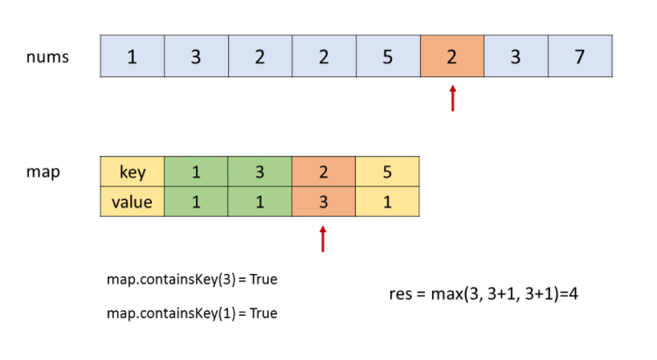

# Leetcode 题解 - 哈希表
<!-- GFM-TOC -->
* [Leetcode 题解 - 哈希表](#leetcode-题解---哈希表)
    * [1. 数组中两个数的和为给定值](#1-数组中两个数的和为给定值)
    * [2. 判断数组是否含有重复元素](#2-判断数组是否含有重复元素)
    * [3. 最长和谐序列](#3-最长和谐序列)
    * [4. 最长连续序列](#4-最长连续序列)
<!-- GFM-TOC -->


哈希表使用 O(N) 空间复杂度存储数据，并且以 O(1) 时间复杂度求解问题。

- Java 中的   **HashSet**   用于存储一个集合，可以查找元素是否在集合中。如果元素有穷，并且范围不大，那么可以用一个布尔数组来存储一个元素是否存在。例如对于只有小写字符的元素，就可以用一个长度为 26 的布尔数组来存储一个字符集合，使得空间复杂度降低为 O(1)。

 Java 中的   **HashMap**   主要用于映射关系，从而把两个元素联系起来。HashMap 也可以用来对元素进行计数统计，此时键为元素，值为计数。和 HashSet 类似，如果元素有穷并且范围不大，可以用整型数组来进行统计。在对一个内容进行压缩或者其它转换时，利用 HashMap 可以把原始内容和转换后的内容联系起来。例如在一个简化 url 的系统中 [Leetcdoe : 535. Encode and Decode TinyURL (Medium)

[Leetcode](https://leetcode.com/problems/encode-and-decode-tinyurl/description/)，利用 HashMap 就可以存储精简后的 url 到原始 url 的映射，使得不仅可以显示简化的 url，也可以根据简化的 url 得到原始 url 从而定位到正确的资源�) / [力扣](https://leetcode-cn.com/problems/encode-and-decode-tinyurl/description/)，利用 HashMap 就可以存储精简后的 url 到原始 url 的映射，使得不仅可以显示简化的 url，也可以根据简化的 url 得到原始 url 从而定位到正确的资源�)


## 1. 数组中两个数的和为给定值

1\. Two Sum (Easy)

[Leetcode](https://leetcode.com/problems/two-sum/description/) / [力扣](https://leetcode-cn.com/problems/two-sum/description/)

可以先对数组进行排序，然后使用双指针方法或者二分查找方法。这样做的时间复杂度为 O(NlogN)，空间复杂度为 O(1)。

用 HashMap 存储数组元素和索引的映射，在访问到 nums[i] 时，判断 HashMap 中是否存在 target - nums[i]，如果存在说明 target - nums[i] 所在的索引和 i 就是要找的两个数。该方法的时间复杂度为 O(N)，空间复杂度为 O(N)，使用空间来换取时间。

```java
public int[] twoSum(int[] nums, int target) {
    HashMap<Integer, Integer> indexForNum = new HashMap<>();
    for (int i = 0; i < nums.length; i++) {
        if (indexForNum.containsKey(target - nums[i])) {
            return new int[]{indexForNum.get(target - nums[i]), i};
        } else {
            indexForNum.put(nums[i], i);
        }
    }
    return null;
}
```

## 2. 判断数组是否含有重复元素

217\. Contains Duplicate (Easy)

[Leetcode](https://leetcode.com/problems/contains-duplicate/description/) / [力扣](https://leetcode-cn.com/problems/contains-duplicate/description/)

```java
public boolean containsDuplicate(int[] nums) {
    Set<Integer> set = new HashSet<>();
    for (int num : nums) {
        set.add(num);
    }
    return set.size() < nums.length;
}
```

## 3. 最长和谐序列

594\. Longest Harmonious Subsequence (Easy)

[Leetcode](https://leetcode.com/problems/longest-harmonious-subsequence/description/) / [力扣](https://leetcode-cn.com/problems/longest-harmonious-subsequence/description/)

```html
示例 1：
输入：nums = [1,3,2,2,5,2,3,7]
输出：5
解释：最长的和谐子序列是 [3,2,2,2,3]

示例 2：
输入：nums = [1,2,3,4]
输出：2

示例 3：
输入：nums = [1,1,1,1]
输出：0
```

和谐序列(或者和谐数组)中最大数和最小数之差正好为 1，应该注意的是序列的元素不一定是数组的连续元素。

### 方法一：枚举

复杂度：时间 O(N*N) ，空间O(1)。

对于当前枚举的元素 x，它可以和 x + 1 组成和谐子序列。

我们再遍历一遍整个数组，找出等于 x 或 x + 1 的元素个数，就可以得到以 x 为最小值的和谐子序列的长度。

```java
public class Solution {
    public int findLHS(int[] nums) {
        int res = 0;
        for (int i = 0; i < nums.length; i++) {
            int cnt = 0;
            boolean flag = false;
            for (int j = 0; j < nums.length; j++) {
                if (nums[j] == nums[i])
                    cnt++;
                else if (nums[j] + 1 == nums[i]) {
                    cnt++;
                    flag = true;//flag必须有，否则，[1,1,1,1]会输出4，但是正确的是0
                }
            }
            if (flag)
                res = Math.max(cnt, res);
        }
        return res;
    }
}
```

### 方法二：哈希计数 + 两次扫描

复杂度：双O(N)

O(N) 的时间遍历下来后，用（HashMap）来存储每个数出现的次数。

再次遍历 HashMap 这样就能在 O(1) 的时间内得到 x 和 x + 1 出现的次数。缺点是进行了两次扫描。

````java
public class Solution {
    public int findLHS(int[] nums) {
        Map<Integer, Integer> dic = new HashMap<>();
        for (int num : nums) {
            dic.put(num, dic.getOrDefault(num, 0) + 1);
        }
        int lst = 0;// 初始一定要是0，处理[1,1,1,1]的情况
        for (int num : dic.keySet()) {
            if (dic.containsKey(num + 1)) {
                lst = Math.max(lst, dic.get(num + 1) + dic.get(num));
            }
        }
        return lst;
    }
}

````

### 方法三：哈希映射 + 单次扫描

我们扫描一次数组，当扫描到元素 x 时，我们首先将 x 加入哈希映射，随后获取哈希映射中 x - 1, x, x + 1 三者出现的次数 u, v, w，那么 u + v 即为 x - 1, x 组成的和谐子序列的长度，v + w 即为 x, x + 1 组成的和谐子序列的长度。

假设数组中最长的和谐子序列的最后一个元素在数组中的位置为 i，那么在扫描到 nums[i] 时，u + v 和 v + w 中一定有一个就是答案。因此这种方法可以找到最长的和谐子序列的长度。



```java
public class Solution {
    public int findLHS(int[] nums) {
        HashMap< Integer, Integer > map = new HashMap < > ();
        int lst = 0;
        for (int num: nums) {
            map.put(num, map.getOrDefault(num, 0) + 1);
            if (map.containsKey(num + 1))
                lst = Math.max(lst, map.get(num) + map.get(num + 1));
            if (map.containsKey(num - 1))
                lst = Math.max(lst, map.get(num) + map.get(num - 1));
        }
        return lst;
    }
}
```

## 4. 最长连续序列

128\. Longest Consecutive Sequence (Hard)

[Leetcode](https://leetcode.com/problems/longest-consecutive-sequence/description/) / [力扣](https://leetcode-cn.com/problems/longest-consecutive-sequence/description/)

```js
给定一个未排序的整数数组 nums ，找出数字连续的最长序列（不要求序列元素在原数组中连续）的长度。
进阶：你可以设计并实现时间复杂度为 O(n) 的解决方案吗？

示例 1：
输入：nums = [100,4,200,1,3,2]
输出：4
解释：最长数字连续序列是 [1, 2, 3, 4]。它的长度为 4。

示例 2：
输入：nums = [0,3,7,2,5,8,4,6,0,1]
输出：9	解释：结果是0到8
```

要求以 O(N) 的时间复杂度求解。

### 方法一：哈希表

思路：实际不是太难，不为 Hard。

外层循环需要 O(n) 的时间复杂度，只有当一个数是连续序列的第一个数的情况下才会进入内层循环，然后在内层循环中匹配连续序列中的数，因此数组中的每个数只会进入内层循环一次。

根据上述分析可知，总时间复杂度为 O(n)，符合题目要求。

```java
class Solution {
    public int longestConsecutive(int[] nums) {
        Set<Integer> set = new HashSet<Integer>();
        for (int num : nums) {
            set.add(num);
        }
        int lst = 0;
        for (int num : set) {
            if (!set.contains(num - 1)) {//从最小的开始计数 123456，只1进入。
                int curNum = num;
                int curLen = 1;
                while (set.contains(curNum + 1)) {
                    curNum += 1;
                    curLen += 1;
                }
                lst = Math.max(lst, curLen);
            }
        }
        return lst;
    }
}
```


### 方法二：动态规划

但是 这个 dp实际跑出的结果比较低。8ms

用哈希表存储每个端点值对应连续区间的长度，若数已在哈希表中，跳过不做处理。

若是新数加入：

- 取出其左右相邻数已有的连续区间长度 left 和 right
- 计算当前数的区间长度为：cur_length = left + right + 1
- 根据 cur_length 更新最大长度 max_length 的值
- 更新区间两端点的长度值

```java
class Solution {
    public int longestConsecutive(int[] nums) {
        int n = nums.length;
        HashMap<Integer, Integer> map = new HashMap<>();
        int res = 0;
        for (int num : nums) {
            if (!map.containsKey(num)) {
                int left = map.get(num - 1) == null ? 0 : map.get(num - 1);
                int right = map.get(num + 1) == null ? 0 : map.get(num + 1);
                int cur = 1 + left + right;
                if (cur > res) {
                    res = cur;
                }
                map.put(num, cur);
                map.put(num - left, cur);	//难理解
                map.put(num + right, cur);
            }
        }
        return res;
    }
}
//参考
//作者：jalan
//链接：https://leetcode-cn.com/problems/longest-consecutive-sequence/solution/dong-tai-gui-hua-python-ti-jie-by-jalan/
```

### 方法三：并查集

// todo

### 方法四：排序

下边这个O(nlogn)，实际提交比较快。

快排加双指针的方法，理论时间复杂度为O(nlogn)，但是实际执行速度很快，

```java
class Solution {
public:
    int longestConsecutive(vector<int>& nums) {
        // [0，0，2，1，3，3，5，4，4，4]
        if(nums.size()==0||nums.size()==1) return nums.size();
        sort(nums.begin(),nums.end());
        // 变成了[0,0,1,2,3,3,4,4,4,5,6]
        int left=0;
        int right=0;
        int res=1;
        int count=0;
        while(right<nums.size()-1){
            // 判断下一个点是否还连续
            if(nums[right]+1==nums[right+1]){
                right++;
            }
            // 避免重复的点，用count来记录连续区间中重复点的次数，最后减去count就行，比如 0，0，1，2，3，3，4，4，4，5，6这种情况中的0,3,4
            else if(nums[right]==nums[right+1]){
                right++;
                count++;
            }
            // 下一个点不再连续，直接更新left和right还有count
            else{
                count=0;
                left=++right;
            }
            // 更新最大区间
            res=max(res,right-left+1-count);
        }
        return res;
    }
};
```

### 其他

```java
public int longestConsecutive(int[] nums) {
    Map<Integer, Integer> countForNum = new HashMap<>();
    for (int num : nums) {
        countForNum.put(num, 1);
    }
    for (int num : nums) {
        forward(countForNum, num);
    }
    return maxCount(countForNum);
}

private int forward(Map<Integer, Integer> countForNum, int num) {
    if (!countForNum.containsKey(num)) {
        return 0;
    }
    int cnt = countForNum.get(num);
    if (cnt > 1) {
        return cnt;
    }
    cnt = forward(countForNum, num + 1) + 1;
    countForNum.put(num, cnt);
    return cnt;
}

private int maxCount(Map<Integer, Integer> countForNum) {
    int max = 0;
    for (int num : countForNum.keySet()) {
        max = Math.max(max, countForNum.get(num));
    }
    return max;
}
```

### 