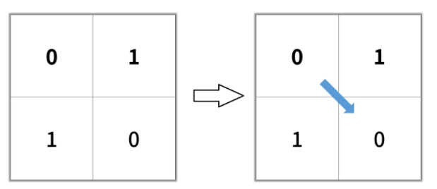
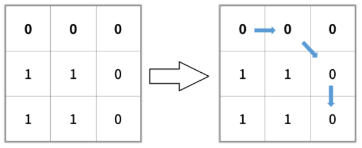
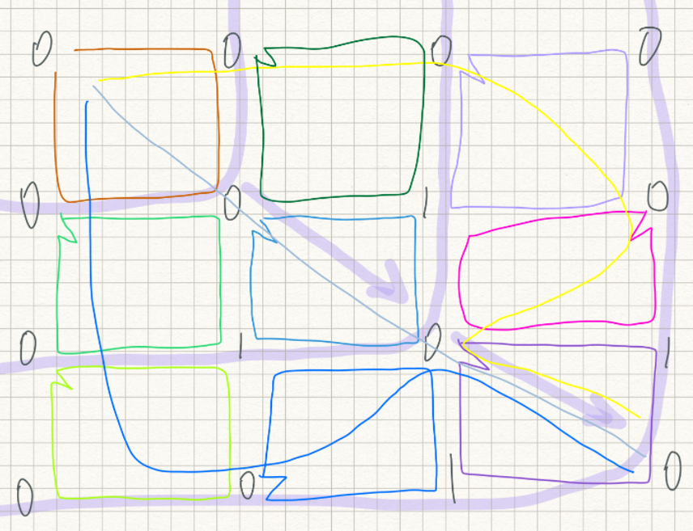
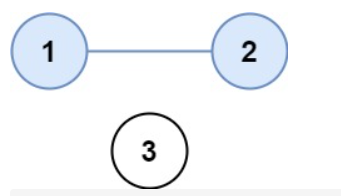
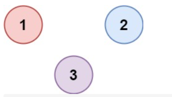
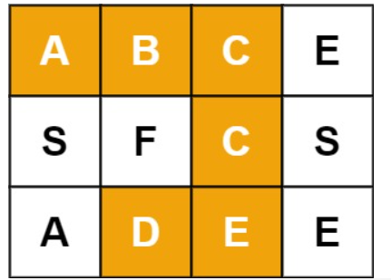
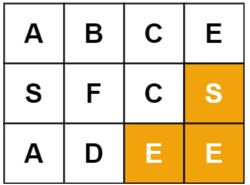
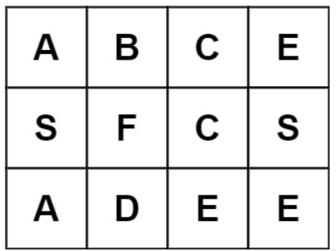
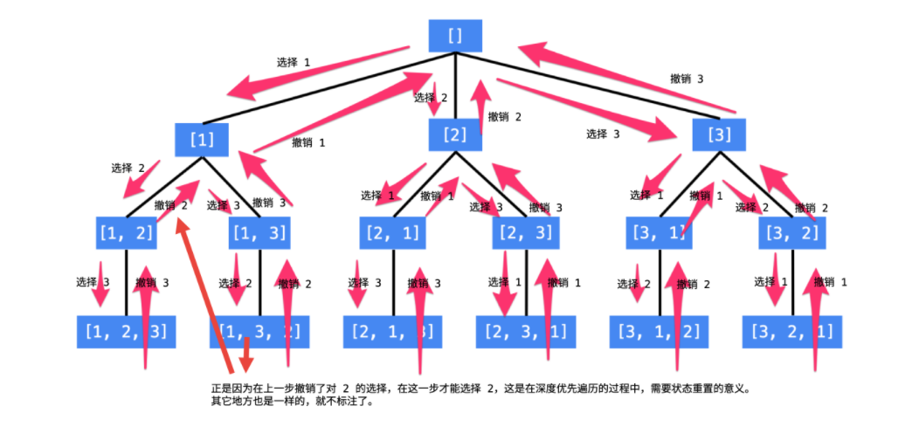
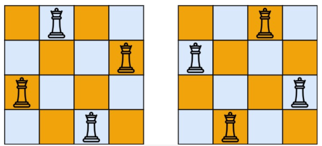

# Leetcode 题解 - 搜索
<!-- GFM-TOC -->
* [Leetcode 题解 - 搜索](#leetcode-题解---搜索)
    * [BFS](#bfs)
        * [1. 计算在网格中从原点到特定点的最短路径长度](#1-计算在网格中从原点到特定点的最短路径长度)
        * [2. 组成整数的最小平方数数量](#2-组成整数的最小平方数数量)
        * [3. 最短单词路径](#3-最短单词路径)
    * [DFS](#dfs)
        * [1. 查找最大的连通面积](#1-查找最大的连通面积)
        * [2. 矩阵中的连通分量数目](#2-矩阵中的连通分量数目)
        * [3. 好友关系的连通分量数目](#3-好友关系的连通分量数目)
        * [4. 填充封闭区域](#4-填充封闭区域)
        * [5. 能到达的太平洋和大西洋的区域](#5-能到达的太平洋和大西洋的区域)
    * [Backtracking](#backtracking)
        * [1. 数字键盘组合](#1-数字键盘组合)
        * [2. IP 地址划分](#2-ip-地址划分)
        * [3. 在矩阵中寻找字符串](#3-在矩阵中寻找字符串)
        * [4. 输出二叉树中所有从根到叶子的路径](#4-输出二叉树中所有从根到叶子的路径)
        * [5. 排列](#5-排列)
        * [6. 含有相同元素求排列](#6-含有相同元素求排列)
        * [7. 组合](#7-组合)
        * [8. 组合求和](#8-组合求和)
        * [9. 含有相同元素的组合求和](#9-含有相同元素的组合求和)
        * [10. 1-9 数字的组合求和](#10-1-9-数字的组合求和)
        * [11. 子集](#11-子集)
        * [12. 含有相同元素求子集](#12-含有相同元素求子集)
        * [13. 分割字符串使得每个部分都是回文数](#13-分割字符串使得每个部分都是回文数)
        * [14. 数独](#14-数独)
        * [15. N 皇后](#15-n-皇后)
<!-- GFM-TOC -->


深度优先搜索和广度优先搜索广泛运用于树和图中，但是它们的应用远远不止如此。

## BFS

<div align="center">  </div><br>
广度优先搜索一层一层地进行遍历，每层遍历都是以上一层遍历的结果作为起点，遍历一个距离能访问到的所有节点。需要注意的是，遍历过的节点不能再次被遍历。

第一层：

- 0 -\> {6,2,1,5}

第二层：

- 6 -\> {4}
- 2 -\> {}
- 1 -\> {}
- 5 -\> {3}

第三层：

- 4 -\> {}
- 3 -\> {}

每一层遍历的节点都与根节点距离相同。设 d<sub>i</sub> 表示第 i 个节点与根节点的距离，推导出一个结论：对于先遍历的节点 i 与后遍历的节点 j，有 d<sub>i</sub> <= d<sub>j</sub>。利用这个结论，可以求解最短路径等   **最优解**   问题：第一次遍历到目的节点，其所经过的路径为最短路径。应该注意的是，使用 **BFS 只能求解无权图的最短路径，无权图是指从一个节点到另一个节点的代价都记为 1。**

在程序实现 BFS 时需要考虑以下问题：

- 队列：用来存储每一轮遍历得到的节点；
- 标记：对于遍历过的节点，应该将它标记，防止重复遍历。

### 1. 计算在网格中从原点到特定点的最短路径长度

1091\. Shortest Path in Binary Matrix(Medium)

[Leetcode](https://leetcode.com/problems/shortest-path-in-binary-matrix/) / [力扣](https://leetcode-cn.com/problems/shortest-path-in-binary-matrix/)

```html
给你一个 n x n 的二进制矩阵 grid 中，返回矩阵中最短 畅通路径 的长度。如果不存在这样的路径，返回 -1 。

二进制矩阵中的 畅通路径 是一条从 左上角 单元格（即，(0, 0)）到 右下角 单元格（即，(n - 1, n - 1)）的路径，该路径同时满足下述要求：

1、路径途经的所有单元格都的值都是 0 。
2、路径中所有相邻的单元格应当在 8 个方向之一 上连通（即，相邻两单元之间彼此不同且共享一条边或者一个角）。
3、畅通路径的长度 是该路径途经的单元格总数。

示例 3：
输入：grid = [[1,0,0],[1,1,0],[1,1,0]]
输出：-1

提示：
n == grid.length
n == grid[i].length
1 <= n <= 100
grid[i][j] 为 0 或 1
```

```js
示例 1：
输入：grid = [[0,1],[1,0]]
输出：2
```



```js
示例 2：
输入：grid = [[0,0,0],[1,1,0],[1,1,0]]
输出：4
```



题目描述：0 表示可以经过某个位置，求解从左上角到右下角的最短路径长度。

```java
class Solution {
    public int shortestPathBinaryMatrix(int[][] grid) {
        int m = grid.length, n = grid[0].length;
        if(grid[0][0]==1 || grid[grid.length-1][grid[0].length-1]==1) return -1;
        grid[0][0] = 1;
        Queue<int[]> q=new LinkedList<>();
        q.add(new int[]{0, 0});
        int len = q.size();										// 队列长度
        int c = 0;												// c要和队列长度比
        int[][] dir = {{1, 0}, {1, 1}, {1,-1}, {0, 1}, 			// 定义八个方向
                       {0, -1}, {-1, 0},{-1, -1}, {-1, 1}};
        int path = 1;											// 定义最短路径长度
        while(!q.isEmpty()){
            int[] data = q.poll();
            int x = data[0];									// x、y代表当前的坐标（x，y）
            int y = data[1];
            if(x == m - 1 && y == n - 1)  return path;			// 先到先返回
            for(int[] d : dir){
                int x1 = x + d[0];								// 移动后的坐标（x1，y1）
                int y1 = y + d[1];
                if(x1 >= 0 && y1 >= 0 && x1 < m && y1 < n && grid[x1][y1] == 0){
                    q.add(new int[]{x1, y1});					// 将可走的步添加进队列
                    grid[x1][y1] = 1;							//标记
                }
            }
            c++;												//计算步数的核心
            if(c == len){	//判断的逻辑是把上次队列存储全部节点处理完毕后，path++
                c = 0;		//len等于这层节点的数量
                path++;
                len = q.size();
            }
        }
        return -1;
    }
}
```

下边这个也是上边的思路好理解一些



```java
class Solution {
     public int shortestPathBinaryMatrix(int[][] grid) {
        int n = grid.length;
        int m = grid[0].length;
        if (grid[0][0] == 1 || grid[n - 1][m - 1] == 1) return -1;
        if (n == 1 && m == 1) return 1;
        int[] dx = new int[]{-1, -1, -1,  0, 0, 1, 1, 1};
        int[] dy = new int[]{-1,  0,  1, -1, 1,-1, 0, 1};
        grid[0][0] = 1;
        Queue<int[]> queue = new LinkedList<>();				//一维数组节点
        queue.add(new int[]{0, 0});
        int count = 0;
        while (!queue.isEmpty()) {
            count++;
            int queueSize = queue.size();
            for (int i = 0; i < queueSize; i++) {				//一层的节点数处理完后
                int[] data = queue.poll();						//count++;
                if (data[0] == n - 1 && data[1] == m - 1) return count;
                for (int j = 0; j < 8; j++) {
                    int x = data[0] + dx[j];
                    int y = data[1] + dy[j];
                    if (x >= 0 && x < n && y >= 0 && y < m && grid[x][y] == 0 ) {
                        queue.add(new int[]{x, y});
                        grid[x][y] = 1;
                    }
                }
            }
        }
        return -1;
    }
}
```

其他

```java
public int shortestPathBinaryMatrix(int[][] grids) {
        if (grids == null || grids.length == 0 || grids[0].length == 0) {
            return -1;
        }
        int[][] direction = {{1, -1}, {1, 0}, {1, 1}, {0, -1}, {0, 1}, {-1, -1}, {-1, 0}, {-1, 1}};
        int m = grids.length, n = grids[0].length;
        Queue<Pair<Integer, Integer>> queue = new LinkedList<>();
        queue.add(new Pair<>(0, 0));
        int pathLength = 0;
        while (!queue.isEmpty()) {
            int size = queue.size();
            pathLength++;
            while (size-- > 0) {
                Pair<Integer, Integer> cur = queue.poll();
                int cr = cur.getKey(), cc = cur.getValue();
                if (grids[cr][cc] == 1) {
                    continue;
                }
                if (cr == m - 1 && cc == n - 1) {
                    return pathLength;
                }
                grids[cr][cc] = 1; // 标记
                for (int[] d : direction) {
                    int nr = cr + d[0], nc = cc + d[1];
                    if (nr < 0 || nr >= m || nc < 0 || nc >= n) {
                        continue;
                    }
                    queue.add(new Pair<>(nr, nc));
                }
            }
        }
        return -1;
    }
```

### 2. 组成整数的最小平方数数量

279\. Perfect Squares (Medium)

[Leetcode](https://leetcode.com/problems/perfect-squares/description/) / [279. 完全平方数](https://leetcode-cn.com/problems/perfect-squares/)

```js
给定正整数 n，找到若干个完全平方数（比如 1, 4, 9, 16, ...）使得它们的和等于 n。
你需要让组成和的完全平方数的个数最少。
给你一个整数 n ，返回#和为 n 的完全平方数的 最少数量 。
完全平方数 是一个整数，其值等于另一个整数的平方；换句话说，其值等于一个整数自乘的积。例如，1、4、9 和 16 都是完全平方数，而 3 和 11 不是。

示例 1：
输入：n = 12
输出：3 
解释：12 = 4 + 4 + 4

示例 2：
输入：n = 13
输出：2
解释：13 = 4 + 9
 
提示：1 <= n <= 104
```

可以将每个整数看成**图**中的一个节点，如果两个整数之差为一个平方数，那么这两个整数所在的节点就有一条边。

要求解最小的平方数数量，就是求解从节点 n 到节点 0 的最短路径。

本题也可以用动态规划求解，在之后动态规划部分中会再次出现。

```java
public int numSquares(int n) {
    List<Integer> squares = generateSquares(n);
    Queue<Integer> queue = new LinkedList<>();
    boolean[] marked = new boolean[n + 1];
    queue.add(n);
    marked[n] = true;
    int level = 0;
    while (!queue.isEmpty()) {
        int size = queue.size();
        level++;
        while (size-- > 0) {
            int cur = queue.poll();
            for (int s : squares) {
                int next = cur - s;
                if (next < 0) {
                    break;
                }
                if (next == 0) {
                    return level;
                }
                if (marked[next]) {
                    continue;
                }
                marked[next] = true;
                queue.add(next);
            }
        }
    }
    return n;
}

/**
 * 生成小于 n 的平方数序列
 * @return 1,4,9,16...
 */
private List<Integer> generateSquares(int n) {
    List<Integer> squares = new ArrayList<>();
    int square = 1;
    int diff = 3;
    while (square <= n) {
        squares.add(square);
        square += diff;
        diff += 2;
    }
    return squares;
}
```

### 3. 最短单词路径

127\. Word Ladder (Medium)

[Leetcode](https://leetcode.com/problems/word-ladder/description/) / [127. 单词接龙](https://leetcode-cn.com/problems/word-ladder/)

```js
字典 wordList 中从单词 beginWord 和 endWord 的 转换序列 是一个按下述规格形成的序列：
1、序列中第一个单词是 beginWord 。
2、序列中最后一个单词是 endWord 。
3、每次转换只能改变一个字母。
4、转换过程中的中间单词必须是字典 wordList 中的单词。
给你两个单词 beginWord 和 endWord 和一个字典 wordList ，找到从 beginWord 到 endWord 的 最短转换序列 中的 单词数目 。如果不存在这样的转换序列，返回 0。
 
示例 1：
输入：beginWord = "hit", endWord = "cog", wordList = ["hot","dot","dog","lot","log","cog"]
输出：5
解释：一个最短转换序列是 "hit" -> "hot" -> "dot" -> "dog" -> "cog", 返回它的长度 5。
i编程o，h变成d，t变成g，d变成c

示例 2：
输入：beginWord = "hit", endWord = "cog", wordList = ["hot","dot","dog","lot","log"]
输出：0
解释：endWord "cog" 不在字典中，所以无法进行转换。

提示：
1 <= beginWord.length <= 10
endWord.length == beginWord.length
1 <= wordList.length <= 5000
wordList[i].length == beginWord.length
beginWord、endWord 和 wordList[i] 由小写英文字母组成
beginWord != endWord
wordList 中的所有字符串 互不相同
```

题目描述：找出一条从 beginWord 到 endWord 的最短路径，每次移动规定为改变一个字符，并且改变之后的字符串必须在 wordList 中。

```js

```

题解

- 无向图中两个顶点之间的最短路径的长度，可以通过广度优先遍历得到；
- 为什么 BFS 得到的路径最短？可以把起点和终点所在的路径拉直来看，两点之间线段最短；
- 已知目标顶点的情况下，可以分别从起点和目标顶点（终点）执行广度优先遍历，直到遍历的部分有交集，是双向广度优先遍历的思想。

### todo

参考：BFS、双向BFS

https://leetcode-cn.com/problems/word-ladder/solution/yan-du-you-xian-bian-li-shuang-xiang-yan-du-you-2/


其他，这个1000+ms，太慢了

```java
public int ladderLength(String beginWord, String endWord, List<String> wordList) {
    wordList.add(beginWord);
    int N = wordList.size();
    int start = N - 1;
    int end = 0;
    while (end < N && !wordList.get(end).equals(endWord)) {
        end++;
    }
    if (end == N) {
        return 0;
    }
    List<Integer>[] graphic = buildGraphic(wordList);
    return getShortestPath(graphic, start, end);
}

private List<Integer>[] buildGraphic(List<String> wordList) {
    int N = wordList.size();
    List<Integer>[] graphic = new List[N];
    for (int i = 0; i < N; i++) {
        graphic[i] = new ArrayList<>();
        for (int j = 0; j < N; j++) {
            if (isConnect(wordList.get(i), wordList.get(j))) {
                graphic[i].add(j);
            }
        }
    }
    return graphic;
}

private boolean isConnect(String s1, String s2) {
    int diffCnt = 0;
    for (int i = 0; i < s1.length() && diffCnt <= 1; i++) {
        if (s1.charAt(i) != s2.charAt(i)) {
            diffCnt++;
        }
    }
    return diffCnt == 1;
}

private int getShortestPath(List<Integer>[] graphic, int start, int end) {
    Queue<Integer> queue = new LinkedList<>();
    boolean[] marked = new boolean[graphic.length];
    queue.add(start);
    marked[start] = true;
    int path = 1;
    while (!queue.isEmpty()) {
        int size = queue.size();
        path++;
        while (size-- > 0) {
            int cur = queue.poll();
            for (int next : graphic[cur]) {
                if (next == end) {
                    return path;
                }
                if (marked[next]) {
                    continue;
                }
                marked[next] = true;
                queue.add(next);
            }
        }
    }
    return 0;
}
```

## DFS

<div align="center">  </div><br>
广度优先搜索一层一层遍历，每一层得到的所有新节点，要用队列存储起来以备下一层遍历的时候再遍历。

而深度优先搜索在得到一个新节点时立即对新节点进行遍历：从节点 0 出发开始遍历，得到到新节点 6 时，立马对新节点 6 进行遍历，得到新节点 4；如此反复以这种方式遍历新节点，直到没有新节点了，此时返回。返回到根节点 0 的情况是，继续对根节点 0 进行遍历，得到新节点 2，然后继续以上步骤。

从一个节点出发，使用 DFS 对一个图进行遍历时，能够遍历到的节点都是从初始节点可达的，DFS 常用来求解这种   **可达性**   问题。

在程序实现 DFS 时需要考虑以下问题：

- 栈：用栈来保存当前节点信息，当遍历新节点返回时能够继续遍历当前节点。可以使用递归栈。
- 标记：和 BFS 一样同样需要对已经遍历过的节点进行标记。

### 1. 查找最大的连通面积

695\. Max Area of Island (Medium)

[Leetcode](https://leetcode.com/problems/max-area-of-island/description/) / [695. 岛屿的最大面积](https://leetcode-cn.com/problems/max-area-of-island/)

```js
给定一个包含了一些 0 和 1 的非空二维数组 grid 。
一个 岛屿 是由一些相邻的 1 (代表土地) 构成的组合，#「相邻」要求两个 1 必须在水平或者竖直方向上相邻。
你可以假设 grid 的四个边缘都被 0（代表水）包围着。
找到给定的二维数组中最大的岛屿面积。(如果没有岛屿，则返回面积为 0 。)

示例 1:
[[0,0,1,0,0,0,0,1,0,0,0,0,0],
 [0,0,0,0,0,0,0,1,1,1,0,0,0],
 [0,1,1,0,1,0,0,0,0,0,0,0,0],
 [0,1,0,0,1,1,0,0,#1,0,1,0,0],
 [0,1,0,0,1,1,0,0,#1,1,1,0,0],
 [0,0,0,0,0,0,0,0,#0,0,1,0,0],
 [0,0,0,0,0,0,0,1,1,1,0,0,0],
 [0,0,0,0,0,0,0,1,1,0,0,0,0]]
对于上面这个给定矩阵应返回 6。注意答案不应该是 11 ，因为岛屿只能包含水平或垂直的四个方向的 1 。

示例：	返回4
[[1,1,0,0,0],
 [1,1,0,0,0],
 [0,0,0,1,1],
 [0,0,0,1,1]]
求的是各个岛屿中最大的一个面积，而不是岛屿个数。

注意: 给定的矩阵grid 的长度和宽度都不超过 50。
```

标准DFS，这个更快。

```java
class Solution {
    public int maxAreaOfIsland(int[][] grid) {
        int res = 0;
        for (int i = 0; i < grid.length; i++) {
            for (int j = 0; j < grid[i].length; j++) {
                if (grid[i][j] == 1) {
                    res = Math.max(res, dfs(i, j, grid));
                }
            }
        }
        return res;
    }
    // 每次调用的时候默认num为1，进入后判断如果不是岛屿，则直接返回0，就可以避免预防错误的情况。
    // 每次找到岛屿，则直接把找到的岛屿改成0，这是传说中的沉岛思想，就是遇到岛屿就把他和周围的全部沉默。
    // ps：如果能用沉岛思想，那么自然可以用朋友圈思想。有兴趣的朋友可以去尝试。
    private int dfs(int i, int j, int[][] grid) {
        if (i < 0 || j < 0 || i >= grid.length || j >= grid[i].length
         || grid[i][j] == 0) {	return 0;  }
        
        grid[i][j] = 0;
        int s = 1;
        s += dfs(i + 1, j, grid);
        s += dfs(i - 1, j, grid);
        s += dfs(i, j + 1, grid);
        s += dfs(i, j - 1, grid);
        return s;

    }
}
```

其他

```java
class Solution {
    private int m, n;
    private int[][] direction = {{0, 1}, {0, -1}, {1, 0}, {-1, 0}};

    public int maxAreaOfIsland(int[][] grid) {
        if (grid == null || grid.length == 0) {
            return 0;
        }
        m = grid.length;
        n = grid[0].length;
        int maxArea = 0;
        for (int i = 0; i < m; i++) {
            for (int j = 0; j < n; j++) {
                maxArea = Math.max(maxArea, dfs(grid, i, j));
            }
        }
        return maxArea;
    }

    private int dfs(int[][] grid, int r, int c) {
        if (r < 0 || r >= m || c < 0 || c >= n || grid[r][c] == 0) {
            return 0;
        }
        grid[r][c] = 0;
        int area = 1;
        for (int[] d : direction) {
            area += dfs(grid, r + d[0], c + d[1]);
        }
        return area;
    }
}
```

### 2. 矩阵中的连通分量数目

200\. Number of Islands (Medium)

[Leetcode](https://leetcode.com/problems/number-of-islands/description/) / [200. 岛屿数量](https://leetcode-cn.com/problems/number-of-islands/)

```html
给你一个由 '1'（陆地）和 '0'（水）组成的的二维网格，请你计算网格中岛屿的数量。
岛屿总是被水包围，并且每座岛屿只能由水平方向和/或竖直方向上相邻的陆地连接形成。
此外，你可以假设该网格的四条边均被水包围。

示例 1：
输入：grid = [
  ["1","1","1","1","0"],
  ["1","1","0","1","0"],
  ["1","1","0","0","0"],
  ["0","0","0","0","0"]
]
输出：1

示例 2：
输入：grid = [
  ["1","1","0","0","0"],
  ["1","1","0","0","0"],
  ["0","0","1","0","0"],
  ["0","0","0","1","1"]
]
输出：3

提示：
m == grid.length
n == grid[i].length
1 <= m, n <= 300
grid[i][j] 的值为 '0' 或 '1'
```

```java
class Solution {
    public int numIslands(char[][] grid) {
        int count = 0;
        for(int i = 0; i < grid.length; i++) {
            for(int j = 0; j < grid[0].length; j++) {
                if(grid[i][j] == '1'){
                    dfs(grid, i, j);
                    count++;
                }
            }
        }
        return count;
    }
    private void dfs(char[][] grid, int i, int j){
        if(i < 0 || j < 0 || i >= grid.length || j >= grid[0].length 
           		 || grid[i][j] == '0') return;
        grid[i][j] = '0';
        dfs(grid, i + 1, j);
        dfs(grid, i, j + 1);
        dfs(grid, i - 1, j);
        dfs(grid, i, j - 1);
    }
}
```

其他，可以将矩阵表示看成一张有向图。

```java
//思路其实一样
class Solution {
    private int m, n;
    private int[][] direction = {{0, 1}, {0, -1}, {1, 0}, {-1, 0}};

    public int numIslands(char[][] grid) {
        if (grid == null || grid.length == 0) {
            return 0;
        }
        m = grid.length;
        n = grid[0].length;
        int islandsNum = 0;
        for (int i = 0; i < m; i++) {
            for (int j = 0; j < n; j++) {
                if (grid[i][j] != '0') {
                    dfs(grid, i, j);
                    islandsNum++;
                }
            }
        }
        return islandsNum;
    }

    private void dfs(char[][] grid, int i, int j) {
        if (i < 0 || i >= m || j < 0 || j >= n || grid[i][j] == '0') {
            return;
        }
        grid[i][j] = '0';
        for (int[] d : direction) {
            dfs(grid, i + d[0], j + d[1]);
        }
    }
}
```

### 3. 好友关系的连通分量数目

547\. Friend Circles (Medium)

[Leetcode](https://leetcode.com/problems/friend-circles/description/) / [547. 省份数量](https://leetcode-cn.com/problems/number-of-provinces/)

```js
有 n 个城市，其中一些彼此相连，另一些没有相连。如果城市 a 与城市 b 直接相连，且城市 b 与城市 c 直接相连，那么城市 a 与城市 c 间接相连。
省份 是一组直接或间接相连的城市，组内不含其他没有相连的城市。
给你一个 n x n 的矩阵 isConnected ，其中 isConnected[i][j] = 1 表示第 i 个城市和第 j 个城市直接相连，而 isConnected[i][j] = 0 表示二者不直接相连。
返回矩阵中 省份 的数量。

提示：
1 <= n <= 200
n == isConnected.length、n == isConnected[i].length、矩阵都是正方形
isConnected[i][j] 为 1 或 0
isConnected[i][i] == 1
isConnected[i][j] == isConnected[j][i]
```

示例 1：



```
输入：
isConnected = 
[[1,1,0], 
 [1,1,0],
 [0,0,1]]
输出：2
```

示例 2：



```
输入：
isConnected = 
[[1,0,0],
 [0,1,0],
 [0,0,1]]
输出：3

输入：
{ {1,1,1},
  {1,1,1},
  {1,1,1} };
输出：1     

输入：
{ {0,0,0},
  {0,0,0},
  {0,0,0} };
输出：3
```

题目描述：好友关系可看成是一个无向图，例第 0 个人与第 1 个人是好友，那么 M\[0][1] 和 M\[1][0] 的值都为 1。

应该找一找图解的，没找到DFS的图解。

```java
class Solution {
    public int findCircleNum(int[][] isConnected) {
        // int[][] isConnected 是无向图的邻接矩阵，n 为无向图的顶点数量
        int n = isConnected.length;
        boolean[] visited = new boolean[n];					//标识的是行，是否访问过。
        int cnt = 0;										//累计遍历过的连通域的数量
        for (int i = 0; i < n; i++) {
            // 若当前顶点 i 未被访问，说明又是一个新的连通域，则遍历新的连通域且cnt+=1.
            if (!visited[i]) { 
                cnt++;
                dfs(i, isConnected, visited);
            }
        }
        return cnt;
    }

    private void dfs(int i, int[][] isConnected, boolean[] visited) {
        visited[i] = true;									// 对当前顶点 i 进行访问标记
        for (int j = 0; j < isConnected.length; j++) {		// 继续遍历与顶点 i 相邻的顶点
            if (isConnected[i][j] == 1 && !visited[j]) {	//这里visited是j
                dfs(j, isConnected, visited);				//这里访问的是j
            }
        }
    }
}
```

BFS、并查集（解法比较典型），解法参考：https://leetcode-cn.com/problems/number-of-provinces/solution/dfs-bfs-bing-cha-ji-3-chong-fang-fa-ji-s-edkl/

### 4. 填充封闭区域

130\. Surrounded Regions (Medium)

[Leetcode](https://leetcode.com/problems/surrounded-regions/description/) / [130. 被围绕的区域](https://leetcode-cn.com/problems/surrounded-regions/)

```js
给你一个 m x n 的矩阵 board ，由若干字符 'X' 和 'O' ，找到所有被 'X' 围绕的区域，并将这些区域里所有的 'O' 用 'X' 填充。

示例 1：
输入：board = 
    [["X","X","X","X"],
     ["X","O","O","X"],
     ["X","X","O","X"],
     ["X","O","X","X"]]

输出：[["X","X","X","X"],
      ["X","X","X","X"],
      ["X","X","X","X"],
      ["X","O","X","X"]]

解释：
被围绕的区间不会存在于边界上，换句话说，任何边界上的 'O' 都不会被填充为 'X'。 
任何不在边界上，或不与边界上的 'O' 相连的 'O' 最终都会被填充为 'X'。
如果两个元素在水平或垂直方向相邻，则称它们是“相连”的。

提示：
m == board.length
n == board[i].length
1 <= m, n <= 200
board[i][j] 为 'X' 或 'O'
```

题目描述：使被 'X' 包围的 'O' 转换为 'X'。思路，先填充最外侧，剩下的就是里侧了。

本题给定的矩阵中有三种元素：

- 字母 `X`；
- 被字母 `X` 包围的字母 `O`；
- 没有被字母 `X` 包围的字母 `O`。

本题要求将所有被字母 X 包围的字母 O都变为字母 X ，但很难判断哪些 O 是被包围的，哪些 O 不是被包围的。

注意到题目解释中提到：任何边界上的 O 都不会被填充为 X。 

我们可以想到，所有的不被包围的 O 都直接或间接与边界上的 O 相连。我们可以利用这个性质判断 O 是否在边界上，具体地说：

- 对于每一个边界上的 O，我们以它为起点，标记所有与它直接或间接相连的字母 O；
- 最后我们遍历这个矩阵，对于每一个字母：
  - 如果该字母被标记过，则该字母为没有被字母 X 包围的字母 O，我们将其还原为字母 O；
  - 如果该字母没有被标记过，则该字母为被字母 X 包围的字母 O，我们将其修改为字母 X。

思路及解法

先把和边界4个方向相连接的所有O 修改为字母 `T`，然后全局遍历，等于T的变成O，等于O的变成X。

其他：DFS、并查集，参考：https://leetcode-cn.com/problems/surrounded-regions/solution/bfsdi-gui-dfsfei-di-gui-dfsbing-cha-ji-by-ac_pipe/

```java
class Solution {
    int r, c;										//全局的行、列
    public void solve(char[][] board) {
        r = board.length;
        if (r == 0) return;
        c = board[0].length;
        for (int i = 0; i < r; i++) {				//最左和最右列
            dfs(board, i, 0);
            dfs(board, i, c - 1);
        }
        for (int j = 1; j < c - 1; j++) {			//第一行和最后一行，分别第二列到倒数第二列。
            dfs(board, 0, j);
            dfs(board, r - 1, j);
        }
        for (int i = 0; i < r; i++) {				//全部遍历
            for (int j = 0; j < c; j++) {
                if (board[i][j] == 'T') {			//等于T的变成O
                    board[i][j] = 'O';
                } else if (board[i][j] == 'O') {	//等于O的变成X
                    board[i][j] = 'X';
                }
            }
        }
    }

    public void dfs(char[][] board, int x, int y) {
        if (x < 0 || x >= r || y < 0 || y >= c || board[x][y] != 'O') {
            return;
        }
        board[x][y] = 'T';							//常规4个方向的标记遍历
        dfs(board, x + 1, y);
        dfs(board, x - 1, y);
        dfs(board, x, y + 1);
        dfs(board, x, y - 1);
    }
}
```

### 5. 能到达的太平洋和大西洋的区域

417\. Pacific Atlantic Water Flow (Medium)

[Leetcode](https://leetcode.com/problems/pacific-atlantic-water-flow/description/) / [417. 太平洋大西洋水流问题](https://leetcode-cn.com/problems/pacific-atlantic-water-flow/)

```js
给定一个 m x n 的非负整数矩阵来表示一片大陆上各个单元格的高度。“太平洋”处于大陆的左边界和上边界，而“大西洋”处于大陆的右边界和下边界。
规定水流只能按照上、下、左、右四个方向流动，且只能从高到低或者在同等高度上流动。
请找出那些水流既可以流动到“太平洋”，又能流动到“大西洋”的陆地单元的坐标。

提示：输出坐标的顺序不重要、m 和 n 都小于150

示例：
给定下面的 5x5 矩阵:
  太平洋 ~   ~   ~   ~   ~ 
       ~  1   2   2   3  (5) *
       ~  3   2   3  (4) (4) *
       ~  2   4  (5)  3   1  *
       ~ (6) (7)  1   4   5  *
       ~ (5)  1   1   2   4  *
          *   *   *   *   * 大西洋
返回:
[[0, 4], [1, 3], [1, 4], [2, 2], [3, 0], [3, 1], [4, 0]] (上图中带括号的单元).
```

左边和上边是太平洋，右边和下边是大西洋，内部的数字代表海拔，海拔高的地方的水能够流到低的地方，求解水能够流到太平洋和大西洋的所有位置。

思路是从海洋开始逆流，如果可以逆流到，就标记为1，然后检查两个海洋都可以逆流到的区域。

BFS ，参考：

https://leetcode-cn.com/problems/pacific-atlantic-water-flow/solution/ni-liu-dfs-yu-bfs-by-fibonacciwh/

```java
class Solution {
    int r, c;							  //定义成全局的，减少dfs函数的形参
    int[][] matrix;
    public List<List<Integer>> pacificAtlantic(int[][] matrix) {
        if (matrix.length == 0 || matrix[0].length == 0) {
            return new ArrayList<>();
        }
        this.r = matrix.length;
        this.c = matrix[0].length;
        this.matrix = matrix;
        int[][] tp = new int[r][c];       //太平洋
        int[][] dx = new int[r][c];       //大西洋
        //从海洋边界开始
//        for (int i = 0; i < r; i++) {
//            for (int j = 0; j < c; j++) {
//                if (i == 0 || j == 0) {
//                    dfs( tp, i, j, matrix[i][j]);
//                }
//                if (i == r - 1 || j == c - 1) {
//                    dfs( dx, i, j, matrix[i][j]);
//                }
//            }
//        }

        for (int i = 0; i < r && i < c; i++) {
            dfs(tp, i, 0, matrix[i][0]);    //最左和最右边列
            dfs(dx, i, c - 1, matrix[i][c - 1]);

            dfs(tp, 0, i, matrix[0][i]);    //最上、最下
            dfs(dx, r - 1, i, matrix[r - 1][i]);
        }
        if (r > c) {           //处理剩余
            for (int i = c; i < r; i++) {
                dfs(tp, i, 0, matrix[i][0]);      //最左和最右边列
                dfs(dx, i, c - 1, matrix[i][c - 1]);
            }
        } else if (r < c) {
            for (int i = r; i < c; i++) {
                dfs(tp, 0, i, matrix[0][i]);            //最上、最下
                dfs(dx, r - 1, i, matrix[r - 1][i]);
            }
        }
        List<List<Integer>> res = new ArrayList<>();
        for (int i = 0; i < r; i++) {
            for (int j = 0; j < c; j++) {
                if (tp[i][j] == 1 && dx[i][j] == 1) {
                    res.add(Arrays.asList(i, j));
                }
            }
        }
        return res;
    }
    private void dfs(int[][] aux, int i, int j, int pre) {
        if (i < 0 || j < 0 || i > r - 1 || j > c - 1
         || aux[i][j] == 1 || matrix[i][j] < pre) { 
            return;        // 流到过的，还有逆流的延伸的要比原来的大。
        }
        aux[i][j] = 1;                              //标记流到过了
        dfs(aux, i - 1, j, matrix[i][j]);
        dfs(aux, i + 1, j, matrix[i][j]);
        dfs(aux, i, j - 1, matrix[i][j]);
        dfs(aux, i, j + 1, matrix[i][j]);
    }
}
```

## Backtracking

Backtracking（回溯）属于 DFS。

- 普通 DFS 主要用在   **可达性问题**  ，这种问题只需要执行到特点的位置然后返回即可。
- 而 Backtracking 主要用于求解   **排列组合**   问题，例如有 { 'a','b','c' } 三个字符，求解所有由这三个字符排列得到的字符串，这种问题在执行到特定的位置返回之后还会继续执行求解过程。

因为 Backtracking 不是立即返回，而要继续求解，因此在程序实现时，需要注意对元素的标记问题：

- 在访问一个新元素进入新的递归调用时，需要将新元素标记为已经访问，这样才能在继续递归调用时不用重复访问该元素；
- 但是在递归返回时，需要将元素标记为未访问，因为只需要保证在一个递归链中不同时访问一个元素，可以访问已经访问过但是不在当前递归链中的元素。

### 1. 数字键盘组合

17\. Letter Combinations of a Phone Number (Medium)

[Leetcode](https://leetcode.com/problems/letter-combinations-of-a-phone-number/description/) / [17. 电话号码的字母组合](https://leetcode-cn.com/problems/letter-combinations-of-a-phone-number/)

<div align="center">  </div><br>
```js
给定一个仅包含数字 2-9 的字符串，返回所有它能表示的字母组合。答案可以按 任意顺序 返回。
给出数字到字母的映射如下（与电话按键相同）。注意 1 不对应任何字母。

示例 1：
输入：digits = "23"
输出：["ad","ae","af","bd","be","bf","cd","ce","cf"]

示例 2：
输入：digits = ""
输出：[]

示例 3：
输入：digits = "2"
输出：["a","b","c"]

提示：
0 <= digits.length <= 4
digits[i] 是范围 ['2', '9'] 的一个数字。
```


字符串不用回溯拼接

```java
class Solution {
    private String mp[] = {" ", "", //0、1，这个位置都无所谓的
     "abc", "def", "ghi", "jkl", "mno", "pqrs", "tuv", "wxyz"};
    private ArrayList<String> res;

    public List<String> letterCombinations(String digits) {
        res = new ArrayList<String>();
        if (digits.equals("")) return res;
        findCombination(digits, 0, "");
        return res;
    }

    private void findCombination(String digits, int idx, String s) {
        if (idx == digits.length()) {
            res.add(s);
            return;
        }
        Character numC = digits.charAt(idx);
        String abc = mp[numC - '0'];
        for (int i = 0; i < abc.length(); i++) {
            String cur = s + abc.charAt(i);
            findCombination(digits, idx + 1, cur);
        }
        return;
    }
}
```

StringBuilder 需要回溯删除

```java
class Solution {
    int len;
    String[] map = new String[]{"abc", "def", "ghi", "jkl", "mno", "pqrs", "tuv", "wxyz"};
    List<String> ans = new ArrayList<>();

    public List<String> letterCombinations(String digits) {
        if ("".equals(digits)) return ans;
        len = digits.length();
        dfs(new StringBuilder(), digits, 0);
        return ans;
    }

    public void dfs(StringBuilder sb, String digits, int idx) {
        if (sb.length() == len) {
            ans.add(sb.toString());
            return;
        }
        char numC = digits.charAt(idx);
        String abc = map[numC - '2'];
        for (int j = 0; j < abc.length(); j++) {
            sb.append(abc.charAt(j));
            dfs(sb, digits, idx + 1);
            sb.deleteCharAt(sb.length() - 1);
        }
    }
}
```

DFS - 队列

```java
class Solution {
    public List<String> letterCombinations(String digits) {
        LinkedList<String> ans = new LinkedList<String>();
        if(digits.isEmpty()) return ans;
        String[] mp = new String[] {"0", "1", "abc", "def", "ghi", "jkl", "mno", "pqrs", "tuv", "wxyz"};
        ans.add("");
        for(int i =0; i<digits.length();i++){
            int x = Character.getNumericValue(digits.charAt(i));
            while(ans.peek().length()==i){
                String cache = ans.remove();
                for(char c : mp[x].toCharArray())
                    ans.add(cache+c);
            }
        }
        return ans;
    }
}
```

### 2. IP 地址划分

93\. Restore IP Addresses(Medium)

[Leetcode](https://leetcode.com/problems/restore-ip-addresses/description/) / [93. 复原 IP 地址](https://leetcode-cn.com/problems/restore-ip-addresses/)

```js
给定一个只包含数字的字符串，用以表示一个 IP 地址，返回所有可能从 s 获得的 有效 IP 地址 。
可以按任何顺序返回答案。
有效 IP 地址 正好由四个整数（每个整数位于 0 到 255 之间组成，且不能含有前导 0），整数之间用 '.' 分隔。
例如："0.1.2.201" 和 "192.168.1.1" 是 有效 IP 地址，但是 "0.011.255.245"、"192.168.1.312" 和 "192.168@1.1" 是 无效 IP 地址。

示例 1：

输入：s = "25525511135"
输出：["255.255.11.135","255.255.111.35"]
示例 2：

输入：s = "0000"
输出：["0.0.0.0"]
示例 3：

输入：s = "1111"
输出：["1.1.1.1"]
示例 4：

输入：s = "010010"
输出：["0.10.0.10","0.100.1.0"]
示例 5：

输入：s = "101023"
输出：["1.0.10.23","1.0.102.3","10.1.0.23","10.10.2.3","101.0.2.3"]

提示：0 <= s.length <= 3000，s 仅由数字组成
```

详细解释版本，6ms，35%

```js
标准回溯,模板
dfs(){
    // 符合条件加入
    if() 
    // 排除不符合条件的情况,停止搜索
    if()
    //做出选择
    for(){
        // 操作数据
        ....

        dfs();//继续搜素

        // 还原数据
        ....
    }
}

dfs(String s,int start,int end,StringBuilder sb,int time)
dfs功能: 截取[start,end) 加入sb, 当截取次数time到4次,且start遍历到尾部时,加入结果集result

作者：jobyterry
链接：https://leetcode-cn.com/problems/restore-ip-addresses/solution/java-biao-zhun-hui-su-fei-chang-rong-yi-6hg9v/
```

```java
class Solution {
    List<String> ret;

    public List<String> restoreIpAddresses(String str) {
        ret = new LinkedList<String>();
        if (str.length() > 12) return ret;//IP地址总长度超了,无法转换返回
        dfs(str, 0, 1, new StringBuilder(), 0);//从截取长度为1开始
        dfs(str, 0, 2, new StringBuilder(), 0);//从截取长度为2开始
        dfs(str, 0, 3, new StringBuilder(), 0);//从截取长度为3开始
        return ret;
    }

    void dfs(String str, int l, int r, StringBuilder sb, int time) {
        // 截取四次,且遍历到尾部,r==l+1防止重复
        if (time == 4 && l == str.length() && r == l + 1) {
            ret.add(sb.toString());
            return;
        }
        if (r > str.length()) return;// 无法截取[l,r) end超了
        if (r - l <= 0 || r - l > 3) return;//无法截取[l,r),每段的长度不能为0,不能大于3
        if (r - l > 1 && str.charAt(l) == '0') return;//当截取长度不是1(若长度为1允许为0),其他情况出现首零,返回
        if (Integer.parseInt(str.substring(l, r)) > 255) return;//大于255,返回

        for (int i = 1; i <= 3; i++) {// 截取 长度 1,2,3 三种情况
            sb.append(str.substring(l, r));//加入
            if (time <= 2) sb.append('.');

            dfs(str, r, r + i, sb, time + 1);//继续裁剪

            if (time <= 2) sb.deleteCharAt(sb.length() - 1);//还原数据的操作
            sb.delete(sb.length() - (r - l), sb.length());
        }
    }
}
```

6ms，35%

```java
class Solution {
    public List<String> restoreIpAddresses(String str) {
        List<String> ret = new ArrayList<>();
        StringBuilder sb = new StringBuilder();
        doRestore(0, sb, ret, str);
        return ret;
    }
    // sb:tempAddress
    // ret:addresses
    private void doRestore(int idx, StringBuilder sb, List<String> ret, String str) {
        if (idx == 4 || str.length() == 0) {
            if (idx == 4 && str.length() == 0) {
                ret.add(sb.toString());
            }
            return;
        }
        for (int i = 0; i < str.length() && i <= 2; i++) {
            if (i != 0 && str.charAt(0) == '0') {
                break;
            }
            String part = str.substring(0, i + 1);
            if (Integer.valueOf(part) <= 255) {
                if (sb.length() != 0) {
                    part = "." + part;
                }
                sb.append(part);
                doRestore(idx + 1, sb, ret, str.substring(i + 1));
                sb.delete(sb.length() - part.length(), sb.length());
            }
        }
    }
}
```

上边的改进版本，2ms，80%

```java
public class Solution {

    public List<String> restoreIpAddresses(String s) {
        int len = s.length();
        List<String> res = new ArrayList<>();
        if (len > 12 || len < 4) {
            return res;
        }
        Deque<String> path = new ArrayDeque<>(4);
        dfs(s, len, 0, 4, path, res);
        return res;
    }

    // residue,需要一个变量记录剩余多少段还没被分割
    private void dfs(String s, int len, int begin, int residue, Deque<String> path, List<String> res) {
        if (begin == len) {
            if (residue == 0) {
                res.add(String.join(".", path));
            }
            return;
        }

        for (int i = begin; i < begin + 3; i++) {
            if (i >= len) {
                break;
            }

            if (residue * 3 < len - i) {
                continue;
            }

            if (judgeIpSegment(s, begin, i)) {
                String currentIpSegment = s.substring(begin, i + 1);
                path.addLast(currentIpSegment);

                dfs(s, len, i + 1, residue - 1, path, res);
                path.removeLast();
            }
        }
    }

    private boolean judgeIpSegment(String s, int left, int right) {
        int len = right - left + 1;
        if (len > 1 && s.charAt(left) == '0') {
            return false;
        }

        int res = 0;
        while (left <= right) {
            res = res * 10 + s.charAt(left) - '0';
            left++;
        }

        return res >= 0 && res <= 255;
    }
}
```

```java
//上边版本的方法解释：
//String.join()
//public static String join(CharSequence delimiter,CharSequence... elements)

//demo1                     
public class Example{  
   public static void main(String args[]){  
    //The first argument to this method is the delimiter
    String str=String.join("^","You","are","Awesome");  
    System.out.println(str);  
   }
}
//You^are^Awesome

//demo1     
public class Example{  
   public static void main(String args[]){  
    //Converting an array of String to the list
    List list<String> = Arrays.asList("Steve", "Rick", "Peter", "Abbey");
    String names = String.join(" | ", list);
    System.out.println(names);
   }
}
//Steve | Rick | Peter | Abbey
```

官解，1ms，99%

```java
class Solution {
    static final int SEG_COUNT = 4;
    List<String> ans = new ArrayList<String>();
    int[] segments = new int[SEG_COUNT];

    public List<String> restoreIpAddresses(String s) {
        segments = new int[SEG_COUNT];
        dfs(s, 0, 0);
        return ans;
    }

    public void dfs(String s, int segId, int segStart) {
        // 如果找到了 4 段 IP 地址并且遍历完了字符串，那么就是一种答案
        if (segId == SEG_COUNT) {
            if (segStart == s.length()) {
                StringBuffer ipAddr = new StringBuffer();
                for (int i = 0; i < SEG_COUNT; ++i) {
                    ipAddr.append(segments[i]);
                    if (i != SEG_COUNT - 1) {
                        ipAddr.append('.');
                    }
                }
                ans.add(ipAddr.toString());
            }
            return;
        }

        // 如果还没有找到 4 段 IP 地址就已经遍历完了字符串，那么提前回溯
        if (segStart == s.length()) {
            return;
        }

        // 由于不能有前导零，如果当前数字为 0，那么这一段 IP 地址只能为 0
        if (s.charAt(segStart) == '0') {
            segments[segId] = 0;
            dfs(s, segId + 1, segStart + 1);
        }

        // 一般情况，枚举每一种可能性并递归
        int addr = 0;
        for (int segEnd = segStart; segEnd < s.length(); ++segEnd) {
            addr = addr * 10 + (s.charAt(segEnd) - '0');
            if (addr > 0 && addr <= 0xFF) {
                segments[segId] = addr;
                dfs(s, segId + 1, segEnd + 1);
            } else {
                break;
            }
        }
    }
}
```


其他，3ms，60%

```java
import java.util.ArrayList;
import java.util.List;

class Solution {
    public List<String> restoreIpAddresses(String s) {
        List<String> ret = new ArrayList<>();
        StringBuilder sb = new StringBuilder();
        doRestore(0, sb, ret, s);
        return ret;
    }
    // sb:tempAddress
    // ret:addresses
    private void doRestore(int k, StringBuilder sb, List<String> ret, String s) {
        if (k == 4 || s.length() == 0) {
            if (k == 4 && s.length() == 0) {
                ret.add(sb.toString());
            }
            return;
        }
        for (int i = 0; i < s.length() && i <= 2; i++) {
            if (i != 0 && s.charAt(0) == '0') {
                break;
            }
            String part = s.substring(0, i + 1);
            if (Integer.valueOf(part) <= 255) {
                if (sb.length() != 0) {
                    part = "." + part;
                }
                sb.append(part);
                doRestore(k + 1, sb, ret, s.substring(i + 1));
                sb.delete(sb.length() - part.length(), sb.length());
            }
        }
    }
}
```

### 3. 在矩阵中寻找字符串

79\. Word Search (Medium)

[Leetcode](https://leetcode.com/problems/word-search/description/) / [79. 单词搜索](https://leetcode-cn.com/problems/word-search/)

```js
给定一个 m x n 二维字符网格 board 和一个字符串单词 word 。
如果 word 存在于网格中，返回 true ；否则，返回 false 。
单词必须按照字母顺序，通过相邻的单元格内的字母构成，其中“相邻”单元格是那些#水平相邻或垂直相邻的单元格。
同一个单元格内的字母不允许被重复使用。

提示：
m == board.length
n = board[i].length
1 <= m, n <= 6
1 <= word.length <= 15
board 和 word 仅由大小写英文字母组成
```

```js
示例 1：
输入：board = [["A","B","C","E"],["S","F","C","S"],["A","D","E","E"]], word = "ABCCED"
输出：true
```



```js
示例 2：
输入：board = [["A","B","C","E"],["S","F","C","S"],["A","D","E","E"]], word = "SEE"
输出：true
```



```js
示例 3：
输入：boar
d = [["A","B","C","E"],["S","F","C","S"],["A","D","E","E"]], word = "ABCB"
输出：false
```



就是搜索的模板题目，没啥难度，其他类似的题目。

[「力扣」第 130 题：被围绕的区域](https://leetcode-cn.com/problems/surrounded-regions/)

[「力扣」第 200 题：岛屿数量](https://leetcode-cn.com/problems/number-of-islands/) 

```java
//68ms,50%
class Solution {
    public boolean exist(char[][] board, String word) {
        for (int i = 0; i < board.length; i++) {
            for (int j = 0; j < board[0].length ; j++) {
                if (dfs(board, i, j, word, 0)) {
                    return true;
                }
            }
        }
        return false;
    }

    private boolean dfs(char[][] board, int i, int j, String word, int idx) {
        if (idx == word.length()) {
            return true;
        }
        if (i < 0 || i >= board.length || j < 0 || j >= board[0].length
         || board[i][j] != word.charAt(idx)) {
            return false;
        }
        char tem = board[i][j];					//临时变量缓存，省去一个布尔数组。
        board[i][j] = '*'; 						//此处覆盖避免来回使用该字母
        boolean ret = dfs(board, i, j + 1, word, idx + 1)
         || dfs(board, i, j - 1, word, idx + 1)
         || dfs(board, i + 1, j, word, idx + 1)
         || dfs(board, i - 1, j, word, idx + 1);
        board[i][j] = tem; //还原
        return ret;
    }
}
```

### 4. 输出二叉树中所有从根到叶子的路径

257\. Binary Tree Paths (Easy)

[Leetcode](https://leetcode.com/problems/binary-tree-paths/description/) / [257. 二叉树的所有路径](https://leetcode-cn.com/problems/binary-tree-paths/)

```html
  1
 /  \
2    3
 \
  5
```

```html
[输入，输出]：["1->2->5", "1->3"]
```

图解：


```java
//2ms,80%
class Solution {
    List<String> paths = new LinkedList<>();
    public List<String> binaryTreePaths(TreeNode root) {
        findPaths(root, "");
        return paths;
    }

    public void findPaths(TreeNode root, String path) {
        if (root == null) return;						// 遇到空树返回
        path += String.valueOf(root.val);				// 否则节点加入路径
        if (root.left == null && root.right == null)    // 叶子节点，路径已完整
            paths.add(path);							//下边的else去掉了。
        path += "->";
        findPaths(root.left, path);						//用的是String拼接，而sb的话要回溯。
        findPaths(root.right, path);
    }
}
```

```java
// StringBuilder 版本，速度没快什么。
class Solution {
    private List<String> res = new ArrayList<>();
    public List<String> binaryTreePaths(TreeNode root) {
        dfs(root, new StringBuilder());
        return res;
    }
    private void dfs(TreeNode root, StringBuilder sb) {
        if (root == null) return;
        sb.append(root.val);
        if (root.left == null && root.right == null) {
            res.add(sb.toString());
            return;
        }
        if (root.left != null) dfs(root.left, new StringBuilder(sb).append("->"));
        if (root.right != null) dfs(root.right, new StringBuilder(sb).append("->"));
    }
}
// StringBuilder 略微不同。
class Solution {
    public List<String> binaryTreePaths(TreeNode root) {
        List<String> paths = new ArrayList<>();
        findPaths(root, "", paths);
        return paths;
    }

    public void findPaths(TreeNode root, String path, List<String> paths) {
        if (root == null) return;
        StringBuffer sb = new StringBuffer(path);
        sb.append(Integer.toString(root.val));
        if (root.left == null && root.right == null) 
            paths.add(sb.toString());  
        sb.append("->");  
        findPaths(root.left, sb.toString(), paths);
        findPaths(root.right, sb.toString(), paths);

    }
}
```

### 5. 排列

46\. Permutations (Medium)

[Leetcode](https://leetcode.com/problems/permutations/description/) / [46. 全排列](https://leetcode-cn.com/problems/permutations/)


```html
[1,2,3] have the following permutations:
[
  [1,2,3],
  [1,3,2],
  [2,1,3],
  [2,3,1],
  [3,1,2],
  [3,2,1]
]
注意，不包含重复元素。
```

```java
//1ms、96%
class Solution {
    int[] nums;
    boolean[] book;
    List<List<Integer>> rets = new ArrayList<>();

    public List<List<Integer>> permute(int[] nums) {
        this.nums = nums;
        this.book = new boolean[nums.length];
        backtracking(new ArrayList<>());
        return rets;
    }

    private void backtracking(List<Integer> ret) {
        if (ret.size() == nums.length) {			//不能是nums.length-1，否则会少一位。
            rets.add(new ArrayList<>(ret));         // 重新构造一个 List
            return;
        }
        for (int i = 0; i < book.length; i++) {
            if (book[i]) continue;
            book[i] = true;           			    // 这里book不晓得怎么用临时变量省去
            ret.add(nums[i]);
            backtracking(ret);
            ret.remove(ret.size() - 1);
            book[i] = false;
        }
    }
}
```

```java
//官解,1ms
//时间、空间：双O(N*N!)
class Solution {
    int len;
    List<List<Integer>> rets = new ArrayList<List<Integer>>();

    public List<List<Integer>> permute(int[] nums) {
        this.len = nums.length;
        ArrayList ret = new ArrayList<Integer>();
        for (int num : nums) {
            ret.add(num);//或者这一步换成操作原数组，弄个int[][]的结果再转List<List<Integer>>
        }
        backtrack(ret, 0);
        return rets;
    }
    void backtrack(List<Integer> ret, int dep) {				 // dep不能动，不能省。
        if (dep == len) rets.add(new ArrayList<Integer>(ret));   // 所有数都填完了
        for (int i = dep; i < len; i++) {
            Collections.swap(ret, dep, i);                       // 动态维护数组
            backtrack(ret, dep + 1);                             // 继续递归填下一个数
            Collections.swap(ret, dep, i);                       // 撤销操作
        }
    }
}

```

优秀详细解（未细看）：https://leetcode-cn.com/problems/permutations/solution/hui-su-suan-fa-python-dai-ma-java-dai-ma-by-liweiw/



```java
//1ms，不回溯写法。
public class Solution {
    int len;
    int[] nums;
    List<List<Integer>> rets = new ArrayList<>();
    public List<List<Integer>> permute(int[] nums) {
        this.len = nums.length;
        this.nums = nums;
        
        if (len == 0) return rets;				// 这行判断必须在this赋值后边
        dfs(new ArrayList<>(),new boolean[len]);
        return rets;
    }

    void dfs(List<Integer> ret,boolean[] book) {
        if (ret.size() == len) {				// 递归深度和len相等
            rets.add(ret);
            return;
        }
        // 3、不用拷贝，因为每一层传递下来的 ret 变量都是新建的
        for (int i = 0; i < len; i++) {
            if (book[i]) continue;
            // 1、每一次尝试都创建新的变量表示当前的"状态"
            List<Integer> curRet = new ArrayList<>(ret);
            curRet.add(nums[i]);

            boolean[] curBook = new boolean[len];
            System.arraycopy(book, 0, curBook, 0, len);
            curBook[i] = true;

            dfs( curRet, curBook);
            // 2、无需回溯
        }
    }
}
```

### 6. 含有相同元素求排列

47\. Permutations II (Medium)

[Leetcode](https://leetcode.com/problems/permutations-ii/description/) / [47. 全排列 II](https://leetcode-cn.com/problems/permutations-ii/)

```js
给定一个可包含重复数字的序列 nums ，按任意顺序 返回所有不重复的全排列。

示例 1：

输入：nums = [1,1,2]
输出：
[[1,1,2],
 [1,2,1],
 [2,1,1]]

示例 2：

输入：nums = [1,2,3]
输出：[[1,2,3],[1,3,2],[2,1,3],[2,3,1],[3,1,2],[3,2,1]]

提示：
1 <= nums.length <= 8、-10 <= nums[i] <= 10、包含重复元素
```

**数组元素可能含有相同的元素**，进行排列时就有可能出现重复的排列，要求重复的排列只返回一个。

在实现上，和 Permutations 不同的是要**先排序**，然后在添加一个元素时，判断这个元素是否等于前一个元素，如果等于，并且前一个元素还未访问，那么就跳过这个元素。

```java
//1ms，代码同样适用于 46.全排列
class Solution {
    int[] nums;
    boolean[] book;
    List<List<Integer>> rets = new ArrayList<>();
    public List<List<Integer>> permuteUnique(int[] nums) {
        this.nums = nums;
        this.book = new boolean[nums.length];
        Arrays.sort(nums);  // 排序
        backtracking(new ArrayList<>() );
        return rets;
    }

    private void backtracking(List<Integer> ret) {
        if (ret.size() == nums.length) {
            rets.add(new ArrayList<>(ret));
            return;
        }
        for (int i = 0; i < book.length; i++) {
            if (book[i]) continue;
            if (i != 0 && nums[i] == nums[i - 1] && !book[i - 1]) 
                continue;  // 防止重复
            book[i] = true;
            ret.add(nums[i]);
            backtracking(ret);
            ret.remove(ret.size() - 1);
            book[i] = false;
        }
    }
}
```

类似题目关联拓展：牛客剑指（包含重复字符的全排列），[字符串的排列](https://www.nowcoder.com/jump/super-jump/word?word=字符串的排列)

```java
import java.util.ArrayList;
import java.util.Arrays;

//输入：a,b,c
//输出：abc,acb,bac,bca,cab和cba。
public class Solution {
    char[] cs;
    private ArrayList<String> ret = new ArrayList<>();

    public ArrayList<String> Permutation(String str) {
        if (str.length() == 0) return ret;
        this.cs = str.toCharArray();
        Arrays.sort(cs);           		// 注意排序
        backtracking(new boolean[cs.length], new StringBuilder());
        return ret;
    }

    private void backtracking(boolean[] book, StringBuilder sb) {
        if (sb.length() == cs.length) {
            ret.add(sb.toString());
            return;
        }
        for (int i = 0; i < cs.length; i++) {
            if (book[i]) continue;
            if (i != 0 && cs[i] == cs[i - 1] && !book[i - 1]) // 保证不重复
                continue;
            book[i] = true;
            sb.append(cs[i]);
            backtracking(book, sb);        //直接传 sb
            sb.deleteCharAt(sb.length() - 1);
            book[i] = false;
        }
    }
}
```

### 7. 组合

77\. Combinations (Medium)

[Leetcode](https://leetcode.com/problems/combinations/description/) / [77. 组合](https://leetcode-cn.com/problems/combinations/)

```html
给定两个整数 n 和 k，返回 1 ... n 中所有可能的 k 个数的组合。

示例:
输入: n = 4, k = 2
输出:
[
  [2,4],
  [3,4],
  [2,3],
  [1,2],
  [1,3],
  [1,4],
]
```

未剪枝版本

详细图解参考：https://leetcode-cn.com/problems/combinations/solution/hui-su-suan-fa-jian-zhi-python-dai-ma-java-dai-ma-/

```java
//20ms,50%
public class Solution {
    public List<List<Integer>> combine(int n, int k) {
        List<List<Integer>> rets = new ArrayList<>();
        if (k <= 0 || n < k) return rets;		//可无
        Deque<Integer> ret = new ArrayDeque<>();//这里方法回溯使用，也可以是ArrayList
        dfs(n, k, 1, ret, rets);				// 从 1 开始是题目的设定
        return rets;
    }

    void dfs(int n, int k, int begin, Deque<Integer> ret, List<List<Integer>> rets) {
        if (ret.size() == k) {					//ret 的长度等于 k
            rets.add(new ArrayList<>(ret));
            return;
        }
        for (int i = begin; i <= n; i++) {		// 遍历可能的搜索起点
            ret.addLast(i);
            dfs(n, k, i + 1, ret, rets);		//组合数不允许出现重复的元素
            ret.removeLast();
        }
    }
}
```

剪枝，非以上版本的剪枝

```java
//1ms,100%
class Solution {
    List<List<Integer>> rets = new ArrayList<>();
    List<Integer> ret = new ArrayList<>();
    public List<List<Integer>> combine(int n, int k) {
        backtracking(1, k, n);
        return rets;
    }

    private void backtracking(int dep, int k, int n) {
        if (k == 0) {
            rets.add(new ArrayList<>(ret));
            return;
        }
        for (int i = dep; i <= n - k + 1; i++) {  // 剪枝
            ret.add(i);
            backtracking(i + 1, k - 1, n);
            ret.remove(ret.size() - 1);
        }
    }
}
```

### 8. 组合求和

39\. Combination Sum (Medium)

[Leetcode](https://leetcode.com/problems/combination-sum/description/) / [39. 组合总和](https://leetcode-cn.com/problems/combination-sum/)

```js
给定一个无重复元素的数组 candidates 和一个目标数 target ，找出 candidates 中所有可以使数字和为 target 的组合。

说明：#candidates 中的数字可以无限制重复被选取。candidate 中的每个元素都是独一无二的。
所有数字（包括 target）都是正整数。解集不能包含重复的组合。 

示例 1：

输入：candidates = [2,3,6,7], target = 7,
所求解集为：
[
  [7],
  [2,2,3]
]
示例 2：

输入：candidates = [2,3,5], target = 8,
所求解集为：
[
  [2,2,2,2],
  [2,3,3],
  [3,5]
]

提示：
1 <= target <= 500
1 <= candidates.length <= 30
1 <= candidates[i] <= 200
```

```java
class Solution {
    public List<List<Integer>> combinationSum(int[] candidates, int tar) {
        List<List<Integer>> rets = new ArrayList<>();
        backtracking(new ArrayList<>(), rets, 0, tar, candidates);
        return rets;
    }

    void backtracking(List<Integer> ret, List<List<Integer>> rets,
                              int start, int tar, int[] nums) {
        if (tar == 0) {
            rets.add(new ArrayList<>(ret));
            return;
        }
        for (int i = start; i < nums.length; i++) {
            if (nums[i] > tar) continue;
            ret.add(nums[i]);
            backtracking(ret, rets, i, tar - nums[i], nums);
            ret.remove(ret.size() - 1);
        }
    }
}
```

### 9. 含有相同元素的组合求和

40\. Combination Sum II (Medium)

[Leetcode](https://leetcode.com/problems/combination-sum-ii/description/) / [40. 组合总和 II](https://leetcode-cn.com/problems/combination-sum-ii/)

```js
给定一个数组 candidates 和一个目标数 target ，找出 candidates 中所有可以使数字和为 target 的组合。

说明：#candidates 中的每个数字在每个组合中只能使用一次。candidates数字存在重复。
所有数字（包括目标数）都是正整数。解集不能包含重复的组合。

示例 1:

输入: candidates = [10,1,2,7,6,1,5], target = 8,
所求解集为:
[
  [1, 7],
  [1, 2, 5],
  [2, 6],
  [1, 1, 6]
]
示例 2:

输入: candidates = [2,5,2,1,2], target = 5,
所求解集为:
[
  [1,2,2],
  [5]
]
```

```java
class Solution {
    public List<List<Integer>> combinationSum2(int[] nums, int tar) {
        List<List<Integer>> rets = new ArrayList<>();
        Arrays.sort(nums);						//排序
        backtracking(new ArrayList<>(), rets, new boolean[nums.length], 0, tar, nums);
        return rets;
    }

    void backtracking(List<Integer> ret, List<List<Integer>> rets,
                      boolean[] book, int start, int tar, int[] nums) {
        if (tar == 0) {
            rets.add(new ArrayList<>(ret));
            return;
        }
        for (int i = start; i < nums.length; i++) {
            if (i != 0 && nums[i] == nums[i - 1] && !book[i - 1]) 
                continue;						//重复跳过
            if (nums[i] > tar) continue;
            ret.add(nums[i]);
            book[i] = true;						//多了book
            backtracking(ret, rets, book, i + 1, tar - nums[i], nums);
            book[i] = false;
            ret.remove(ret.size() - 1);
        }
    }
}
```

### 10. 1-9 数字的组合求和

216\. Combination Sum III (Medium)

[Leetcode](https://leetcode.com/problems/combination-sum-iii/description/) / [216. 组合总和 III](https://leetcode-cn.com/problems/combination-sum-iii/)

```js
找出所有相加之和为 n 的 k 个数的组合。组合中只允许含有 1 - 9 的正整数，并且每种组合中不存在重复的数字。
说明：所有数字都是正整数。解集不能包含重复的组合。 

示例 1:

输入: k = 3, n = 7
输出: [[1,2,4]]
示例 2:

输入: k = 3, n = 9
输出: [[1,2,6], [1,3,5], [2,3,4]]
```

题目表述：从 1-9 数字中选出 k 个数不重复的数，使得它们的和为 n。

```java
class Solution {
    public List<List<Integer>> combinationSum3(int k, int n) {
        List<List<Integer>> rets = new ArrayList<>();
        backtracking(k, n, 1,  new ArrayList<>(), rets);
        return rets;
    }
    private void backtracking(int k, int n, int start,
                              List<Integer> ret, List<List<Integer>> rets) {
        if (k == 0 && n == 0) {
            rets.add(new ArrayList<>(ret));
            return;
        }
        if (k == 0 || n == 0) return;
        for (int i = start; i <= 9; i++) {				//1-9
            ret.add(i);
            backtracking(k - 1, n - i, i + 1, ret, rets);
            ret.remove(ret.size() - 1);
        }
    }
}
```

### 11. 子集

78\. Subsets (Medium)

[Leetcode](https://leetcode.com/problems/subsets/description/) / [78. 子集](https://leetcode-cn.com/problems/subsets/)

```js
给你一个整数数组 nums ，#数组中的元素 互不相同 。
解集 不能 包含重复的子集。返回该数组所有可能的子集（幂集）。你可以按 任意顺序 返回解集。

示例 1：

输入：nums = [1,2,3]
输出：[[],[1],[2],[1,2],[3],[1,3],[2,3],[1,2,3]]
示例 2：

输入：nums = [0]
输出：[[],[0]]

提示：
1 <= nums.length <= 10
-10 <= nums[i] <= 10
```

题目表述：找出集合的所有子集，子集不能重复，[1, 2] 和 [2, 1] 这种子集算重复

```java
//1ms,82%
class Solution {
    public List<List<Integer>> rets(int[] nums) {
        List<List<Integer>> rets = new ArrayList<>();
        List<Integer> ret = new ArrayList<>();
        for (int size = 0; size <= nums.length; size++) {	// 不同的子集大小
            backtracking(0, ret, rets, size, nums); 
        }
        return rets;
    }

    void backtracking(int start, List<Integer> ret, List<List<Integer>> rets,
                              final int size, final int[] nums) {
        if (ret.size() == size) {
            rets.add(new ArrayList<>(ret));
            return;
        }
        for (int i = start; i < nums.length; i++) {
            ret.add(nums[i]);
            backtracking(i + 1, ret, rets, size, nums);
            ret.remove(ret.size() - 1);
        }
    }
}
```

### 12. 含有相同元素求子集

90\. Subsets II (Medium)

[Leetcode](https://leetcode.com/problems/subsets-ii/description/) / [90. 子集 II](https://leetcode-cn.com/problems/subsets-ii/)

```js
给你一个整数数组 nums ，#其中可能包含重复元素
解集 不能 包含重复的子集。请你返回该数组所有可能的子集（幂集）,返回的解集中，子集可以按 任意顺序 排列。

示例 1：

输入：nums = [1,2,2]
输出：[[],[1],[1,2],[1,2,2],[2],[2,2]]
示例 2：

输入：nums = [0]
输出：[[],[0]]

提示：
1 <= nums.length <= 10
-10 <= nums[i] <= 10
```

```java
//1ms,99%
class Solution {
    public List<List<Integer>> subsetsWithDup(int[] nums) {
        Arrays.sort(nums);//排序
        List<List<Integer>> rets = new ArrayList<>();
        List<Integer> ret = new ArrayList<>();
        boolean[] book = new boolean[nums.length];
        for (int size = 0; size <= nums.length; size++) {
            backtracking(0, ret, rets, book, size, nums);
        }
        return rets;
    }

    void backtracking(int start, List<Integer> ret, List<List<Integer>> rets, 
                      boolean[] book, final int size, final int[] nums) {
        if (ret.size() == size) {
            rets.add(new ArrayList<>(ret));
            return;
        }
        for (int i = start; i < nums.length; i++) {
            if (i != 0 && nums[i] == nums[i - 1] && !book[i - 1])
                continue;//去重
            ret.add(nums[i]);
            book[i] = true;//添加book
            backtracking(i + 1, ret, rets, book, size, nums);
            book[i] = false;
            ret.remove(ret.size() - 1);
        }
    }
}
```

### 13. 分割字符串使得每个部分都是回文数

131\. Palindrome Partitioning (Medium)

[Leetcode](https://leetcode.com/problems/palindrome-partitioning/description/) / [131. 分割回文串](https://leetcode-cn.com/problems/palindrome-partitioning/)

```js
给你一个字符串 s，请你将 s 分割成一些子串，使每个子串都是 回文串 。返回 s 所有可能的#分割方案。
回文串 是正着读和反着读都一样的字符串。

示例 1：

输入：s = "aab"
输出：[["a","a","b"],["aa","b"]]
示例 2：

输入：s = "a"
输出：[["a"]]

提示：
1 <= s.length <= 16
s 仅由小写英文字母组成
```

```java
//12ms,40% 少2ms可以到70%
class Solution {
    public List<List<String>> partition(String str) {
        List<List<String>> rets = new ArrayList<>();
        List<String> ret = new ArrayList<>();
        doPartition(str, rets, ret);
        return rets;
    }

    void doPartition(String str, List<List<String>> rets, List<String> ret) {
        if (str.length() == 0) {
            rets.add(new ArrayList<>(ret));
            return;
        }
        for (int i = 0; i < str.length(); i++) {
            if (!isPalindrome(str, 0, i)) continue;
            ret.add(str.substring(0, i + 1));
            doPartition(str.substring(i + 1), rets, ret);
            ret.remove(ret.size() - 1);
        }
    }

    boolean isPalindrome(String str, int begin, int end) {
        while (begin < end) {
            if (str.charAt(begin++) != str.charAt(end--)) {
                return false;
            }
        }
        return true;
    }
}
```

### 14. 数独

37\. Sudoku Solver (Hard)

[Leetcode](https://leetcode.com/problems/sudoku-solver/description/) / [37. 解数独](https://leetcode-cn.com/problems/sudoku-solver/)

<div align="center">  </div><br>
```java
//3ms，%87
class Solution {
    private boolean[][] rowsUsed = new boolean[9][10];
    private boolean[][] colsUsed = new boolean[9][10];
    private boolean[][] cubesUsed = new boolean[9][10];
    private char[][] board;

    public void solveSudoku(char[][] board) {
        this.board = board;
        for (int i = 0; i < 9; i++)
            for (int j = 0; j < 9; j++) {
                if (board[i][j] == '.') {
                    continue;
                }
                int num = board[i][j] - '0';
                rowsUsed[i][num] = true;
                colsUsed[j][num] = true;
                cubesUsed[cubeNum(i, j)][num] = true;
            }
        backtracking(0, 0);
    }

    private boolean backtracking(int row, int col) {
        while (row < 9 && board[row][col] != '.') {
            row = col == 8 ? row + 1 : row;
            col = col == 8 ? 0 : col + 1;
        }
        if (row == 9) {
            return true;
        }
        for (int num = 1; num <= 9; num++) {
            if (rowsUsed[row][num] || colsUsed[col][num] || cubesUsed[cubeNum(row, col)][num]) {
                continue;
            }
            rowsUsed[row][num] = colsUsed[col][num] = cubesUsed[cubeNum(row, col)][num] = true;
            board[row][col] = (char) (num + '0');
            if (backtracking(row, col)) {
                return true;
            }
            board[row][col] = '.';
            rowsUsed[row][num] = colsUsed[col][num] = cubesUsed[cubeNum(row, col)][num] = false;
        }
        return false;
    }

    private int cubeNum(int i, int j) {
        int r = i / 3;
        int c = j / 3;
        return r * 3 + c;
    }
}
```

### 15. N 皇后

51\. N-Queens (Hard)

[Leetcode](https://leetcode.com/problems/n-queens/description/) / [51. N 皇后](https://leetcode-cn.com/problems/n-queens/)

```
n 皇后问题 研究的是如何将 n 个皇后放置在 n×n 的棋盘上，并且使皇后彼此之间不能相互攻击。
给你一个整数 n ，返回所有不同的 n 皇后问题 的解决方案。
每一种解法包含一个不同的 n 皇后问题 的棋子放置方案，该方案中 'Q' 和 '.' 分别代表了皇后和空位。

示例 1：

输入：n = 4
输出：[[".Q..","...Q",
       "Q...","..Q."],
	  ["..Q.","Q...",
	   "...Q",".Q.."]]
解释：如上图所示，4 皇后问题存在两个不同的解法。
示例 2：

输入：n = 1
输出：[["Q"]]
 
提示：1 <= n <= 9、皇后彼此不能相互攻击，也就是说：任何两个皇后都不能处于同一条横行、纵行或斜线上。
```

示例1：




在 n\*n 的矩阵中摆放 n 个皇后，并且每个皇后不能在同一行，同一列，同一对角线上，求所有的 n 皇后的解。

<div align="center">  </div><br>

一行一行地摆放，在确定一行中的那个皇后应该摆在哪一列时，需要用三个标记数组来确定某一列是否合法，这三个标记数组分别为：列标记数组、45 度对角线标记数组和 135 度对角线标记数组。

45 度对角线标记数组的长度为 2 \* n - 1，通过下图可以明确 (r, c) 的位置所在的数组下标为 r + c。

<div align="center">  </div><br>

135 度对角线标记数组的长度也是 2 \* n - 1，(r, c) 的位置所在的数组下标为 n - 1 - (r - c)。

<div align="center">  </div><br>
```java
class Solution {
    private List<List<String>> solutions;
    private char[][] nQueens;
    private boolean[] colUsed;
    private boolean[] diagonals45Used;
    private boolean[] diagonals135Used;
    private int n;

    public List<List<String>> solveNQueens(int n) {
        solutions = new ArrayList<>();
        nQueens = new char[n][n];
        for (int i = 0; i < n; i++) {
            Arrays.fill(nQueens[i], '.');
        }
        colUsed = new boolean[n];
        diagonals45Used = new boolean[2 * n - 1];
        diagonals135Used = new boolean[2 * n - 1];
        this.n = n;
        backtracking(0);
        return solutions;
    }

    private void backtracking(int row) {
        if (row == n) {
            List<String> list = new ArrayList<>();
            for (char[] chars : nQueens) {
                list.add(new String(chars));
            }
            solutions.add(list);
            return;
        }

        for (int col = 0; col < n; col++) {
            int diagonals45Idx = row + col;
            int diagonals135Idx = n - 1 - (row - col);
            if (colUsed[col] || diagonals45Used[diagonals45Idx] || diagonals135Used[diagonals135Idx]) {
                continue;
            }
            nQueens[row][col] = 'Q';
            colUsed[col] = diagonals45Used[diagonals45Idx] = diagonals135Used[diagonals135Idx] = true;
            backtracking(row + 1);
            colUsed[col] = diagonals45Used[diagonals45Idx] = diagonals135Used[diagonals135Idx] = false;
            nQueens[row][col] = '.';
        }
    }
}
```
