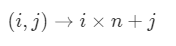
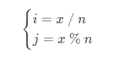
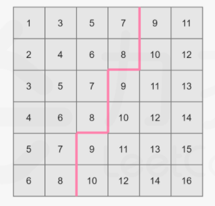
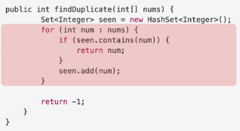

# Leetcode 题解 - 数组与矩阵
<!-- GFM-TOC -->
* [Leetcode 题解 - 数组与矩阵](#leetcode-题解---数组与矩阵)
    * [1. 把数组中的 0 移到末尾](#1-把数组中的-0-移到末尾)
    * [2. 改变矩阵维度](#2-改变矩阵维度)
    * [3. 找出数组中最长的连续 1](#3-找出数组中最长的连续-1)
    * [4. 有序矩阵查找](#4-有序矩阵查找)
    * [5. 有序矩阵的 Kth Element](#5-有序矩阵的-kth-element)
    * [6. 一个数组元素在 [1, n] 之间，其中一个数被替换为另一个数，找出重复的数和丢失的数](#6-一个数组元素在-[1-n]-之间，其中一个数被替换为另一个数，找出重复的数和丢失的数)
    * [7. 找出数组中重复的数，数组值在 [1, n] 之间](#7-找出数组中重复的数，数组值在-[1-n]-之间)
    * [8. 数组相邻差值的个数](#8-数组相邻差值的个数)
    * [9. 数组的度](#9-数组的度)
    * [10. 对角元素相等的矩阵](#10-对角元素相等的矩阵)
    * [11. 嵌套数组](#11-嵌套数组)
    * [12. 分隔数组](#12-分隔数组)
<!-- GFM-TOC -->


## 1. 把数组中的 0 移到末尾

283\. Move Zeroes (Easy)

[Leetcode](https://leetcode.com/problems/move-zeroes/description/) / [283. 移动零](https://leetcode-cn.com/problems/move-zeroes/)

```js
给定一个数组 nums，编写一个函数将所有 0 移动到数组的末尾，同时保持非零元素的相对顺序。

示例:
输入: [0,1,0,3,12]
输出: [1,3,12,0,0]
说明:
必须在原数组上操作，不能拷贝额外的数组。尽量减少操作次数。
```

下边两个都是O(N)时间复杂度

```java
class Solution {
    public void moveZeroes(int[] nums) {
        int idx = 0;
        for (int num : nums) {				//把非0值的，从下标0往后依次赋值。
            if (num != 0) {
                nums[idx++] = num;
            }
        }
        while (idx < nums.length) {			//把是0值的，以及后边的全都赋值为0。
            nums[idx++] = 0;
        }
    }
}
```

这个遍历的要少一些。

```java
class Solution {
	public void moveZeroes(int[] nums) {
		if(nums==null) return;
		int j = 0;								// j指向前面的非零值
		for(int i=0;i<nums.length;i++) {		// i用来找j后边的非0值
			if(nums[i]!=0) {
				int tmp = nums[i];
				nums[i] = nums[j];
				nums[j++] = tmp;
			}
		}
	}
}	
```

## 2. 改变矩阵维度

566\. Reshape the Matrix (Easy)

[Leetcode](https://leetcode.com/problems/reshape-the-matrix/description/) / [566. 重塑矩阵](https://leetcode-cn.com/problems/reshape-the-matrix/)

```js
在MATLAB中，有一个非常有用的函数 reshape，它可以将一个矩阵重塑为另一个大小不同的新矩阵，但保留其原始数据。
给出一个由二维数组表示的矩阵，以及两个正整数r和c，分别表示想要的重构的矩阵的行数和列数。
重构后的矩阵需要将原始矩阵的所有元素以相同的行遍历顺序填充。
如果具有给定参数的reshape操作是可行且合理的，则输出新的重塑矩阵；否则，输出原始矩阵。

示例 1:
输入: 
[[1,2],
 [3,4]]
r = 1, c = 4
输出: 
[[1,2,3,4]]
解释:
行遍历nums的结果是 [1,2,3,4]。新的矩阵是 1 * 4 矩阵, 用之前的元素值一行一行填充新矩阵。

示例 2:
输入: 
[[1,2],
 [3,4]]
r = 2, c = 4
输出: 
[[1,2],
 [3,4]]
解释:
没有办法将 2 * 2 矩阵转化为 2 * 4 矩阵。 所以输出原矩阵。

注意：
给定矩阵的宽和高范围在 [1, 100]。给定的 r 和 c 都是正数。
```


- 时间复杂度：O(rc)。

这里的时间复杂度是在重塑矩阵成功的前提下的时间复杂度，否则当 mn!=rc 时，C++ 语言中返回的是原数组的一份拷贝，本质上需要的时间复杂度为 O(mn)，而其余语言可以直接返回原数组的对象，需要的时间复杂度仅为 O(1)。

- 空间复杂度：O(1)。

这里的空间复杂度不包含返回的重塑矩阵需要的空间。

思路：

将二维数组转化为一位数组



同样地，我们可以将整数 x 映射回其在矩阵中的下标，即 



- 将二维数组 nums 映射成一个一维数组；
- 将这个一维数组映射回 r 行 c 列的二维数组。

```java
class Solution {
    public int[][] matrixReshape(int[][] nums, int r, int c) {
        int m = nums.length, n = nums[0].length;
        if (m * n != r * c) {
            return nums;
        }
        int[][] ret = new int[r][c];
        int idx = 0;									//代表转化为一维数组的下标
        for (int i = 0; i < r; i++) {
            for (int j = 0; j < c; j++) {
                ret[i][j] = nums[idx / n][idx % n];		//映射返回。
                idx++;
            }
        }
        return ret;
    }
}
```

## 3. 找出数组中最长的连续 1

485\. Max Consecutive Ones (Easy)

[Leetcode](https://leetcode.com/problems/max-consecutive-ones/description/) / [485. 最大连续 1 的个数](https://leetcode-cn.com/problems/max-consecutive-ones/)

```js
给定一个二进制数组， 计算其中最大连续 1 的个数。

示例：
输入：[1,1,0,1,1,1]
输出：3
解释：开头的两位和最后的三位都是连续 1 ，所以最大连续 1 的个数是 3.
 
提示：
输入的数组只包含 0 和 1 。输入数组的长度是正整数，且不超过 10,000。
```

- 时间复杂度：O(n)。
- 空间复杂度：O(1)。

动态规划

```java
class Solution {
    public int findMaxConsecutiveOnes(int[] nums) {
        int max = 0, cur = 0;
        for (int x : nums) {
            cur = x == 0 ? 0 : cur + 1;
            max = Math.max(max, cur);
        }
        return max;
    }
}
```

双指针

这个双指针就快，1ms，但是其他的慢些，其他的2ms，3ms，原因难寻。

```java
class Solution {
       public int findMaxConsecutiveOnes(int[] nums) {
        int max = 0, l = 0, r = 0, n = nums.length;
        while (r < n) {
            if (nums[r] == 1) {
                r++;
            } else {
                max = Math.max(max, r - l);
                r++;		//这里，如果r++后边还不是1，l就一直跟随他，l是指向第一个1的。
                l = r;
            }
        }
        return Math.max(max, r - l);	//最后再处理一次。
    }
}
```

## 4. 有序矩阵查找

240\. Search a 2D Matrix II (Medium)

[Leetcode](https://leetcode.com/problems/search-a-2d-matrix-ii/description/) / [力扣](https://leetcode-cn.com/problems/search-a-2d-matrix-ii/description/)

```html
[
   [ 1,  5,  9],
   [10, 11, 13],
   [12, 13, 15]
]
```

```java
public boolean searchMatrix(int[][] matrix, int target) {
    if (matrix == null || matrix.length == 0 || matrix[0].length == 0) return false;
    int m = matrix.length, n = matrix[0].length;
    int row = 0, col = n - 1;								//从右上角开始
    while (row < m && col >= 0) {
        if (target == matrix[row][col]) return true;
        else if (target < matrix[row][col]) col--;
        else row++;
    }
    return false;
}
```

从左下角开始也是可以的。

## 5. 有序矩阵的 Kth Element

378\. Kth Smallest Element in a Sorted Matrix ((Medium))

[Leetcode](https://leetcode.com/problems/kth-smallest-element-in-a-sorted-matrix/description/) / [378. 有序矩阵中第 K 小的元素](https://leetcode-cn.com/problems/kth-smallest-element-in-a-sorted-matrix/)

```js
给你一个 n x n 矩阵 matrix ，其中每行和每列元素均按升序排序，找到矩阵中第 k 小的元素。
请注意，它是 排序后 的第 k 小元素，而不是第 k 个 不同 的元素。题目数据 保证 matrix 中的所有行和列都按 非递减顺序 排列

示例 1：
输入：matrix = [[1,5,9],[10,11,13],[12,13,15]], k = 8
输出：13
解释：矩阵中的元素为 [1,5,9,10,11,12,13,13,15]，第 8 小元素是 13

示例 2：
输入：matrix = [[-5]], k = 1
输出：-5

提示：
1 <= n <= 300
-109 <= matrix[i][j] <= 109
1 <= k <= n2
```

二分查找解法：



```java
public int kthSmallest(int[][] matrix, int k) {
    int m = matrix.length, n = matrix[0].length;
    int lo = matrix[0][0], hi = matrix[m - 1][n - 1];
    while (lo <= hi) {
        int mid = lo + (hi - lo) / 2;
        int cnt = 0;
        for (int i = 0; i < m; i++) {
            for (int j = 0; j < n && matrix[i][j] <= mid; j++) {
                cnt++;
            }
        }
        if (cnt < k) lo = mid + 1;
        else hi = mid - 1;			//另一种是 while (lo < hi)，然后hi = mid;也能过。
    }
    return lo;						
}
```

疑惑是怎么证明lo最后一定是数组中出现过的数，虽然想到的用例都能恰好是。

而如果是 else if( cnt > k ) hi = mid - 1;		else if( cnt== k )  return mid;		

 [[1,5,9],[10,11,13],[12,13,15]] 	

输出： 14 ，这个值原矩阵没有，但是正确结果是13

官方的题解最优但是计算 cnt 更不好懂。

堆解法：

```java
public int kthSmallest(int[][] matrix, int k) {
    int m = matrix.length, n = matrix[0].length;
    PriorityQueue<Tuple> pq = new PriorityQueue<Tuple>();
    for(int j = 0; j < n; j++) pq.offer(new Tuple(0, j, matrix[0][j]));
    for(int i = 0; i < k - 1; i++) { // 小根堆，去掉 k - 1 个堆顶元素，此时堆顶元素就是第 k 的数
        Tuple t = pq.poll();
        if(t.x == m - 1) continue;
        pq.offer(new Tuple(t.x + 1, t.y, matrix[t.x + 1][t.y]));
    }
    return pq.poll().val;
}

class Tuple implements Comparable<Tuple> {
    int x, y, val;
    public Tuple(int x, int y, int val) {
        this.x = x; this.y = y; this.val = val;
    }

    @Override
    public int compareTo(Tuple that) {
        return this.val - that.val;
    }
}
```

排序方法：转换为一维数组，然后排序。

- 时间：N\*N\*logN。对数里的N*N约掉了。
- 空间：N\*N

## 6. 一个数组元素在 [1, n] 之间，其中一个数被替换为另一个数，找出重复的数和丢失的数

645\. Set Mismatch (Easy)

[Leetcode](https://leetcode.com/problems/set-mismatch/description/) / [645. 错误的集合](https://leetcode-cn.com/problems/set-mismatch/)

```js
集合 s 包含从 1 到 n 的整数。不幸的是，因为数据错误，导致集合里面某一个数字复制了成了集合里面的另外一个数字的值，导致集合 丢失了一个数字 并且 有一个数字重复。
给定一个数组 nums 代表了集合 S 发生错误后的结果。
请你找出重复出现的整数，再找到丢失的整数，将它们以数组的形式返回。

示例 1：
输入：nums = [1,2,2,4]
输出：[2,3]

示例 2：
输入：nums = [1,1]
输出：[1,2]

[2, 2]
[2, 1]

[3,2,2]
[2,1]

[2,3,2]
[2,1]

[1,3,3]
[3,2]

[3,3,1]
[3,2]

[1,2,4,4]
[4,3]

[3,3,1]
[3,2]

[1,1]
[1,2]

提示：
2 <= nums.length <= 104
1 <= nums[i] <= 104
```

最直接的方法是先对数组进行排序，这种方法时间复杂度为 O(NlogN)。本题可以 O(N) 的时间复杂度、O(1) 空间复杂度来求解。

主要思想是通过交换数组元素，使得数组上的元素在正确的位置上。

```java
public class Solution {
    public int[] findErrorNums(int[] nums) {
        int dup = -1, missing = 1;
        for (int n: nums) {							// 数组是乱序的
            if (nums[Math.abs(n) - 1] < 0)			// 访问到那个重复数字时。[-1,3,-3]
                dup = Math.abs(n);					// 或者说 [-1,-2,2,4]
            else
                nums[Math.abs(n) - 1] *= -1;		// 第一次访问，没小于0的都变为相反数。
        }											// *= 这个符号中间不能有空格。
        for (int i = 1; i < nums.length; i++) {		// 数组里没0这个元素
            if (nums[i] > 0)						// nums[1]>0 或者说 nums[2]>0
                missing = i + 1;					// 元素值等于索引值1,加1 或者2+1=3
        }
        return new int[]{dup, missing};				// 返回[3,2] 或者 [2, 3]
    }
}

public int[] findErrorNums(int[] nums) {
    for (int i = 0; i < nums.length; i++) {
        while (nums[i] != i + 1 && nums[nums[i] - 1] != nums[i]) {
            swap(nums, i, nums[i] - 1);
        }
    }
    for (int i = 0; i < nums.length; i++) {
        if (nums[i] != i + 1) {
            return new int[]{nums[i], i + 1};
        }
    }
    return null;
}

private void swap(int[] nums, int i, int j) {
    int tmp = nums[i];
    nums[i] = nums[j];
    nums[j] = tmp;
}
```

暴力

- 时间：O(N*N)

```java
public class Solution {
    public int[] findErrorNums(int[] nums) {
        int dup = -1, missing = -1;;
        for (int i = 1; i <= nums.length; i++) {	//必须i=1，i<=，输入[1,1]会出错。
            int count = 0;							//是遍历1到n
            for (int j = 0; j < nums.length; j++) {
                if (nums[j] == i)
                    count++;
            }
            if (count == 2)
                dup = i;
            else if (count == 0)
                missing = i;
            if (dup > 0 && missing > 0)
                break;
        }
        return new int[] {dup, missing};
    }
}
```

计数方法

- 时间、空间：O(N)

首先遍历一遍计次，检查 1 到 n 的每个数字在 map 中出现次数。如果一个数字在 map 中没有出现，它就是缺失数字。如果一个数字的出现了两次，它就是重复数字。

```java
//Map计数
public class Solution {
    public int[] findErrorNums(int[] nums) {
        Map <Integer,Integer> map = new HashMap();
        int dup = -1, missing = 1;
        for (int n: nums) {
            map.put(n, map.getOrDefault(n, 0) + 1);
        }
        for (int i = 1; i <= nums.length; i++) {
            if (map.containsKey(i)) {
                if (map.get(i) == 2)
                    dup = i;
            } else
                missing = i;
        }
        return new int[]{dup, missing};
    }
}
//数组计数
public class Solution {
    public int[] findErrorNums(int[] nums) {
        int[] ret = new int[2];					// 0 存储重复出现的数，1 存储丢失的数
        int[] cnt = new int[nums.length + 1];	//没0不用计数0出现的次数。
        for (int i : nums) {
            if (cnt[i] != 0) {
                ret[0] = i;						// 如果不为 0，则表示该数已经出现过，进行记录
            }
            cnt[i] = 1;
        }
        for (int i = 1; i < cnt.length; i++) {
            if (cnt[i] == 0) {					// 如果为 0 则表示该数没有出现过，进行记录
                ret[1] = i;
                break;
            }
        }
        return ret;
    }
}
```

排序方法

-  时间：O(nlogn) 

## 7. 找出数组中重复的数，数组值在 [1, n] 之间

287\. Find the Duplicate Number (Medium)

[Leetcode](https://leetcode.com/problems/find-the-duplicate-number/description/) / [287. 寻找重复数](https://leetcode-cn.com/problems/find-the-duplicate-number/)

```js
给定一个包含 n + 1 个整数的数组 nums ，其数字都在 1 到 n 之间（包括 1 和 n），可知至少存在一个重复的整数。
假设 nums 只有 一个重复的整数 ，找出 这个重复的数 。
 
示例 1：
输入：nums = [1,3,4,2,2]
输出：2

示例 2：
输入：nums = [3,1,3,4,2]
输出：3
 
提示：
2 <= n <= 3 * 104
nums.length == n + 1
1 <= nums[i] <= n
nums 中 只有一个整数 出现 两次或多次 ，其余整数均只出现 一次

进阶：
如何证明 nums 中至少存在一个重复的数字?
#数组只能读 所以不能排序,不能swap数组下标
#时间复杂度小于 O(n^2) 不能暴力
#空间复杂度 O(1) 不能额外开辟数组
```

要求不能修改数组，也不能使用额外的空间。

二分查找解法：

主要利用 nums = [1,3,4,2,2] 的值都在 1 和 n 之间。

```js
示例 :示例 :下边这个版本的
arr = [1,3,4,2,2] 此时数字在 1 — 5 之间

mid = (1 + 5) / 2 = 3 arr小于等于的3有4个(1,2,2,3)，1到3中肯定有重复的值
mid = (1 + 2) / 2 = 1 arr小于等于的1有1个(1)
mid = (2 + 2) / 2 = 2 arr小于等于的2有1个(3)，2到2中肯定有重复的值
mid = (2 + 1) 退出，所以重复的数是 2 
```

```java
class Solution {
    public int findDuplicate(int[] nums) {
        int l = 1, h = nums.length - 1;     		   //l也可以从0开始	
        while (l <= h) {
            int mid = l + (h - l) / 2;
            int cnt = 0;
            for (int i = 0; i < nums.length; i++) {   //利用cnt间接有序，不需要排序
                if (nums[i] <= mid) cnt++;
            }
            if (cnt > mid) h = mid - 1;   			  //找cnt > mid情况下的最小的mid
            else l = mid + 1;
        }
        return l;
    }
}
```

```js
示例 :下边这个版本的
arr = [1,3,4,2,2] 此时数字在 1 — 5 之间

mid = (1 + 5) / 2 = 3 arr小于等于的3有4个(1,2,2,3)，1到3中肯定有重复的值
mid = (1 + 3) / 2 = 2 arr小于等于的2有3个(1,2,2)，1到2中肯定有重复的值
mid = (1 + 2) / 2 = 1 arr小于等于的1有1个(1)，2到2中肯定有重复的值
所以重复的数是 2 
```

````java
class Solution {
    public int findDuplicate(int[] nums) {
        int l = 1, h = nums.length-1;    
        while (l < h) {					//区别1
            int mid = l + (h - l) / 2;
            int cnt = 0;
            for (int i = 0; i < nums.length; i++) { 
                if (nums[i] <= mid) cnt++;
            }
            if (cnt > mid) h = mid;     //区别2
            else l = mid + 1;			//区别3
        }
        return l;
    }
}
````

双指针解法，类似于有环链表中找出环的入口：

```java
public int findDuplicate(int[] nums) {
    int slow = nums[0], fast = nums[nums[0]];
    while (slow != fast) {
        slow = nums[slow];
        fast = nums[nums[fast]];
    }
    fast = 0;
    while (slow != fast) {
        slow = nums[slow];
        fast = nums[fast];
    }
    return slow;
}
```

哈希表法

- 双O(N)




## 8. 数组相邻差值的个数

667\. Beautiful Arrangement II (Medium)

[Leetcode](https://leetcode.com/problems/beautiful-arrangement-ii/description/) / [力扣](https://leetcode-cn.com/problems/beautiful-arrangement-ii/description/)

```html
Input: n = 3, k = 2
Output: [1, 3, 2]
Explanation: The [1, 3, 2] has three different positive integers ranging from 1 to 3, and the [2, 1] has exactly 2 distinct integers: 1 and 2.
```

题目描述：数组元素为 1\~n 的整数，要求构建数组，使得相邻元素的差值不相同的个数为 k。

让前 k+1 个元素构建出 k 个不相同的差值，序列为：1 k+1 2 k 3 k-1 ... k/2 k/2+1.

```java
public int[] constructArray(int n, int k) {
    int[] ret = new int[n];
    ret[0] = 1;
    for (int i = 1, interval = k; i <= k; i++, interval--) {
        ret[i] = i % 2 == 1 ? ret[i - 1] + interval : ret[i - 1] - interval;
    }
    for (int i = k + 1; i < n; i++) {
        ret[i] = i + 1;
    }
    return ret;
}
```

## 9. 数组的度

697\. Degree of an Array (Easy)

[Leetcode](https://leetcode.com/problems/degree-of-an-array/description/) / [力扣](https://leetcode-cn.com/problems/degree-of-an-array/description/)

```html
Input: [1,2,2,3,1,4,2]
Output: 6
```

题目描述：数组的度定义为元素出现的最高频率，例如上面的数组度为 3。要求找到一个最小的子数组，这个子数组的度和原数组一样。

```java
public int findShortestSubArray(int[] nums) {
    Map<Integer, Integer> numsCnt = new HashMap<>();
    Map<Integer, Integer> numsLastIndex = new HashMap<>();
    Map<Integer, Integer> numsFirstIndex = new HashMap<>();
    for (int i = 0; i < nums.length; i++) {
        int num = nums[i];
        numsCnt.put(num, numsCnt.getOrDefault(num, 0) + 1);
        numsLastIndex.put(num, i);
        if (!numsFirstIndex.containsKey(num)) {
            numsFirstIndex.put(num, i);
        }
    }
    int maxCnt = 0;
    for (int num : nums) {
        maxCnt = Math.max(maxCnt, numsCnt.get(num));
    }
    int ret = nums.length;
    for (int i = 0; i < nums.length; i++) {
        int num = nums[i];
        int cnt = numsCnt.get(num);
        if (cnt != maxCnt) continue;
        ret = Math.min(ret, numsLastIndex.get(num) - numsFirstIndex.get(num) + 1);
    }
    return ret;
}
```

## 10. 对角元素相等的矩阵

766\. Toeplitz Matrix (Easy)

[Leetcode](https://leetcode.com/problems/toeplitz-matrix/description/) / [力扣](https://leetcode-cn.com/problems/toeplitz-matrix/description/)

```html
1234
5123
9512

In the above grid, the diagonals are "[9]", "[5, 5]", "[1, 1, 1]", "[2, 2, 2]", "[3, 3]", "[4]", and in each diagonal all elements are the same, so the answer is True.
```

```java
public boolean isToeplitzMatrix(int[][] matrix) {
    for (int i = 0; i < matrix[0].length; i++) {
        if (!check(matrix, matrix[0][i], 0, i)) {
            return false;
        }
    }
    for (int i = 0; i < matrix.length; i++) {
        if (!check(matrix, matrix[i][0], i, 0)) {
            return false;
        }
    }
    return true;
}

private boolean check(int[][] matrix, int expectValue, int row, int col) {
    if (row >= matrix.length || col >= matrix[0].length) {
        return true;
    }
    if (matrix[row][col] != expectValue) {
        return false;
    }
    return check(matrix, expectValue, row + 1, col + 1);
}
```

## 11. 嵌套数组

565\. Array Nesting (Medium)

[Leetcode](https://leetcode.com/problems/array-nesting/description/) / [力扣](https://leetcode-cn.com/problems/array-nesting/description/)

```html
Input: A = [5,4,0,3,1,6,2]
Output: 4
Explanation:
A[0] = 5, A[1] = 4, A[2] = 0, A[3] = 3, A[4] = 1, A[5] = 6, A[6] = 2.

One of the longest S[K]:
S[0] = {A[0], A[5], A[6], A[2]} = {5, 6, 2, 0}
```

题目描述：S[i] 表示一个集合，集合的第一个元素是 A[i]，第二个元素是 A[A[i]]，如此嵌套下去。求最大的 S[i]。

```java
public int arrayNesting(int[] nums) {
    int max = 0;
    for (int i = 0; i < nums.length; i++) {
        int cnt = 0;
        for (int j = i; nums[j] != -1; ) {
            cnt++;
            int t = nums[j];
            nums[j] = -1; // 标记该位置已经被访问
            j = t;

        }
        max = Math.max(max, cnt);
    }
    return max;
}
```

## 12. 分隔数组

769\. Max Chunks To Make Sorted (Medium)

[Leetcode](https://leetcode.com/problems/max-chunks-to-make-sorted/description/) / [力扣](https://leetcode-cn.com/problems/max-chunks-to-make-sorted/description/)

```html
Input: arr = [1,0,2,3,4]
Output: 4
Explanation:
We can split into two chunks, such as [1, 0], [2, 3, 4].
However, splitting into [1, 0], [2], [3], [4] is the highest number of chunks possible.
```

题目描述：分隔数组，使得对每部分排序后数组就为有序。

```java
public int maxChunksToSorted(int[] arr) {
    if (arr == null) return 0;
    int ret = 0;
    int right = arr[0];
    for (int i = 0; i < arr.length; i++) {
        right = Math.max(right, arr[i]);
        if (right == i) ret++;
    }
    return ret;
}
```
