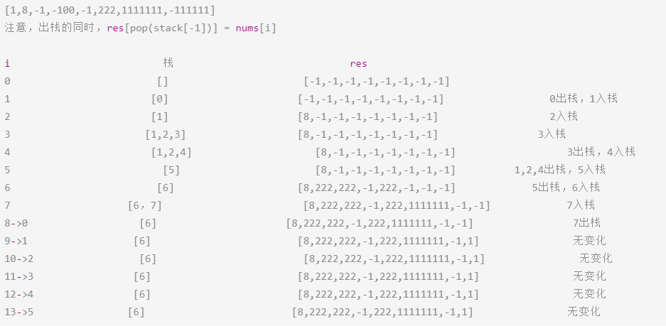

# Leetcode 题解 - 栈和队列
<!-- GFM-TOC -->
* [Leetcode 题解 - 栈和队列](#leetcode-题解---栈和队列)
    * [1. 用栈实现队列](#1-用栈实现队列)
    * [2. 用队列实现栈](#2-用队列实现栈)
    * [3. 最小值栈](#3-最小值栈)
    * [4. 用栈实现括号匹配](#4-用栈实现括号匹配)
    * [5. 数组中元素与下一个比它大的元素之间的距离](#5-数组中元素与下一个比它大的元素之间的距离)
    * [6. 循环数组中比当前元素大的下一个元素](#6-循环数组中比当前元素大的下一个元素)
<!-- GFM-TOC -->


## 1. 用栈实现队列

232\. Implement Queue using Stacks (Easy)

[Leetcode](https://leetcode.com/problems/implement-queue-using-stacks/description/) / [剑指 Offer 09. 用两个栈实现队列](https://leetcode-cn.com/problems/yong-liang-ge-zhan-shi-xian-dui-lie-lcof/)

栈的顺序为后进先出，而队列的顺序为先进先出。使用两个栈实现队列，一个元素需要经过两个栈才能出队列，在经过第一个栈时元素顺序被反转，经过第二个栈时再次被反转，此时就是先进先出顺序。

```java
//实现类中的三个方法
class CQueue {
    public CQueue() {}
    public void appendTail(int value) {}
    public int deleteHead() {}
}
```

题解

```java
class CQueue {
    //一般不选用Stack作栈，而是选用LinkedList， 解释：
    //Stack继承Vector接口，Vector底层是一个Object[]数组，且加同步锁，扩容慢。
    //LinkedList实现了Deque接口，所以Stack能做的事LinkedList都能做,双向链表，扩容容易点。
    LinkedList<Integer> in, out;
    public CQueue() {
        in = new LinkedList<Integer>();
        out = new LinkedList<Integer>();
    }
    public void appendTail(int value) {
        in.addLast(value);
    }
    public int deleteHead() {
        if(!out.isEmpty()) return out.removeLast();
        if(in.isEmpty()) return -1;
        while(!in.isEmpty())
            out.addLast(in.removeLast());
        return out.removeLast();
    }
}
```

## 2. 用队列实现栈

225\. Implement Stack using Queues (Easy)

[Leetcode](https://leetcode.com/problems/implement-stack-using-queues/description/) / [225. 用队列实现栈](https://leetcode-cn.com/problems/implement-stack-using-queues/)

在将一个元素 x 插入队列时，为了维护原来的后进先出顺序，需要让 x 插入队列首部。而队列的默认插入顺序是队列尾部，因此在将 x 插入队列尾部之后，需要让除了 x 之外的所有元素出队列，再入队列。

核心点：

就是在添加的时候，如果队列元素多余1，也就是>=2，那就将新添加元素前面的元素依次出队，再入队。这时，新添加的元素就跑到了队头。

```javascript
队列常用方法：
Queue<Integer> queue = new LinkedList<>();

queue.add(x); 
queue.peek(); 		// peek() 是队列和栈都能通用的方法
queue.remove();		// 返回删除的元素，实际是删除 LinkedList 左边第一个
queue.size();
queue.isEmpty();
```

题解：

```java
class MyStack {

    private Queue<Integer> queue;
    
    public MyStack() { queue = new LinkedList<>(); }

    public void push(int x) {
        queue.add(x);
        int cnt = queue.size();
        while (cnt-- > 1) {				//1、2循环一次变成2、1，再次添加3，循环两次变成3、2、1
            queue.add(queue.remove());
        }
    }

    public int pop() { return queue.remove(); }
    public int top() { return queue.peek(); }
    public boolean empty() { return queue.isEmpty(); }
}
```

## 3. 最小值栈

155\. Min Stack (Easy)

[Leetcode](https://leetcode.com/problems/min-stack/description/) / [面试题30. 包含min函数的栈](https://leetcode-cn.com/problems/bao-han-minhan-shu-de-zhan-lcof/)

```javascript
//定义栈的数据结构，请在该类型中实现一个能够得到栈的最小元素的 min 函数在该栈中.
//实现类中的方法,调用 min、push 及 pop 的时间复杂度都是 O(1)。
class MinStack {
    public MinStack() {}
    public void push(int x) {}
    public void pop() {}
    public int top() {}
    public int min() {}
}
```

对于实现最小值队列问题，可以先将队列使用栈来实现，然后就将问题转换为最小值栈，这个问题出现在 编程之美：3.7。

```java
class MinStack {
    private Stack<Integer> dataStack = new Stack<>();
    private Stack<Integer> minStack = new Stack<>();
    public void push(int node) {
        dataStack.push(node);
        //注意这里的优化,也就是minStack空时候直接先放进去一个，之后有更小的值就放到栈顶。
        minStack.push(minStack.isEmpty() ? node : Math.min(minStack.peek(), node));
    }
    public void pop() {
        dataStack.pop();
        minStack.pop();
    }
    public int top() {
        return dataStack.peek();
    }
    public int min() {
        return minStack.peek();
    }
}
```

## 4. 用栈实现括号匹配

20\. Valid Parentheses (Easy)

[Leetcode](https://leetcode.com/problems/valid-parentheses/description/) / [20. 有效的括号](https://leetcode-cn.com/problems/valid-parentheses/)

```html
给定一个只包括 '('，')'，'{'，'}'，'['，']' 的字符串 s ，判断字符串是否有效。
有效字符串需满足：
左括号必须用相同类型的右括号闭合。
左括号必须以正确的顺序闭合。
 
示例 1：
输入：s = "()"
输出：true

示例 2：
输入：s = "()[]{}"
输出：true

示例 3：
输入：s = "(]"
输出：false

示例 4：
输入：s = "([)]"
输出：false

示例 5：
输入：s = "{[]}"
输出：true
```

```java
//推荐
class Solution {
    public boolean isValid(String s) {
        if (s.isEmpty()) return true;
        Stack<Character> stack = new Stack<>();
        for (char c : s.toCharArray()) {
            if (c == '(')
                stack.push(')');
            else if (c == '{')
                stack.push('}');
            else if (c == '[')
                stack.push(']');
            else if (stack.empty() || c != stack.pop())// stack.empty()处理情 "]"和空栈异常
                return false;
        }
        return stack.empty();
    }
}
//其他
class Solution {
    public boolean isValid(String s) {
        Stack<Character> stack = new Stack<>();
        for (char c : s.toCharArray()) {
            if (c == '(' || c == '{' || c == '[') {
                stack.push(c);
            } else {
                if (stack.isEmpty()) {		//处理："]"
                    return false;
                }
                char cStack = stack.pop();
                boolean b1 = c == ')' && cStack != '(';
                boolean b2 = c == ']' && cStack != '[';
                boolean b3 = c == '}' && cStack != '{';
                if (b1 || b2 || b3) {
                    return false;
                }
            }
        }
        return stack.isEmpty();				//执行String长度次后，空的就是对的。
    }
}

```

## 5. 数组中元素与下一个比它大的元素之间的距离

739\. Daily Temperatures (Medium)

[Leetcode](https://leetcode.com/problems/daily-temperatures/description/) / [739. 每日温度](https://leetcode-cn.com/problems/daily-temperatures/)

```js
请根据每日 气温 列表，重新生成一个列表。对应位置的输出为：要想观测到更高的气温，至少需要等待的天数。如果气温在这之后都不会升高，请在该位置用 0 来代替。

例如:
Input: 	[73, 74, 75, 71, 69, 72, 76, 73]
Output: [ 1,  1,  4,  2,  1,  1,  0,  0]

提示：气温 列表长度的范围是 [1, 30000]。每个气温的值的均为华氏度，都是在 [30, 100] 范围内的整数。
```

在遍历数组时用栈把数组中的数存起来，如果当前遍历的数比栈顶元素来的大，说明栈顶元素的下一个比它大的数就是当前元素。

解法一：

```js
时间复杂度：O(n)，其中 n 是温度列表的长度。正向遍历温度列表一遍，对于温度列表中的每个下标，最多有一次进栈和出栈的操作。
空间复杂度：O(n)，其中 n 是温度列表的长度。需要维护一个单调栈存储温度列表中的下标。

//作者：LeetCode-Solution	有视频讲解
//链接：https://leetcode-cn.com/problems/daily-temperatures/solution/mei-ri-wen-du-by-leetcode-solution/
```

题解：单调栈

顺序遍历，栈里面存的是老元素的下标索引值。本题是  **递减栈** ：栈里只有递减元素。 

本题单调栈解决了求数组中元素与下一个比它大的元素之间的距离的问题。

图解：


上图，单调递减栈，栈底元素最大。

```
单调递减栈
while (!stack.isEmpty()&& temperatures[curIndex] > temperatures[stack.peek()]) {}    
单调递增栈
while (!stack.isEmpty()&& temperatures[curIndex] < temperatures[stack.peek()]) {}   
也可以不严格单调递增
while (!stack.isEmpty()&& temperatures[curIndex] <= temperatures[stack.peek()]) {}  
```


图中下一个处理的是下标为2的75，处于代码中的while循环处。

最后的76、73都在栈里面，出不来了，是最后的默认值0。

```java
class Solution {
    public int[] dailyTemperatures(int[] temperatures) {
        int n = temperatures.length;
        int[] ret = new int[n];
        Stack<Integer> stack = new Stack<>();
        for (int curIndex = 0; curIndex < n; curIndex++) {
            while (!stack.isEmpty()
             && temperatures[curIndex] > temperatures[stack.peek()]) {
                int preIndex = stack.pop();
                ret[preIndex] = curIndex - preIndex;
            }
            stack.push(curIndex);
        }
        return ret;
    }
}
```

解法二：

```js
时间：O(N*N)
空间：O(1)
```

题解：暴力

```java
class Solution {
    public int[] dailyTemperatures(int[] T) {
        int len = T.length;
        int[] ret = new int[len];
        for (int l = 0; l < len; l++) {
            int cur = T[l];
            for (int r = l + 1; r < len; r++) {
                if (T[r] > cur) {
                    ret[l] = r - l;
                    break;
                }
            }
        }
        return ret;
    }
}
```

堆栈问题关联：

- 求解算术表达式的结果（LeetCode 224、227、772、770)
- 求解直方图里最大的矩形区域（LeetCode 84）

## 6. 循环数组中比当前元素大的下一个元素

503\. Next Greater Element II (Medium)

[Leetcode](https://leetcode.com/problems/next-greater-element-ii/description/) / [503. 下一个更大元素 II](https://leetcode-cn.com/problems/next-greater-element-ii/)

```js
给定一个循环数组（最后一个元素的下一个元素是数组的第一个元素），输出每个元素的下一个更大元素。
数字 x 的下一个更大的元素是按数组遍历顺序，这个数字之后的第一个比它更大的数，这意味着你应该循环地搜索它的下一个更大的数。如果不存在，则输出 -1。

示例 1:

输入: [1,2,1]
输出: [2,-1,2]
解释: 第一个 1 的下一个更大的数是 2；
数字 2 找不到下一个更大的数； 
第二个 1 的下一个最大的数需要循环搜索，结果也是 2。
注意: 输入数组的长度不会超过 10000。
```

与 739. Daily Temperatures (Medium) 不同的是，数组是循环数组，并且最后要求的不是距离而是下一个元素。

题解：

例子：



```js
时间复杂度: O(n)，其中 n 是序列的长度。我们需要遍历该数组中每个元素最多 2 次，每个元素出栈与入栈的总次数也不超过 4 次。
空间复杂度: O(n)，其中 n 是序列的长度。空间复杂度主要取决于栈的大小，栈的大小至多为 2n−1。
```

```java
class Solution {
    public int[] nextGreaterElements(int[] nums) {
        int n = nums.length;
        int[] next = new int[n];
        Arrays.fill(next, -1);				//默认值弄好
        Stack<Integer> pre = new Stack<>();
        for (int i = 0; i < n * 2; i++) {	//第二轮处理下栈中残余的大值。
            int num = nums[i % n];
            while (!pre.isEmpty() && num > nums[pre.peek()]) {
                next[pre.pop()] = num;
            }
            if (i < n) {					//只第一轮添加,单调递减栈
                pre.push(i);
            }
        }
        return next;
    }
}
```

其他单调栈题目：

[84. Largest Rectangle in Histogram](https://leetcode-cn.com/problems/largest-rectangle-in-histogram/)

[739. Daily Temperatures](https://leetcode-cn.com/problems/daily-temperatures/)

[1673. Find the Most Competitive Subsequence](https://leetcode-cn.com/problems/find-the-most-competitive-subsequence/)

[496. 下一个更大元素 I](https://leetcode-cn.com/problems/next-greater-element-i/) 