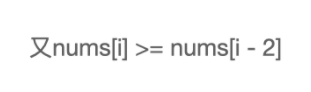

# Leetcode 题解 - 贪心思想
<!-- GFM-TOC -->
* [Leetcode 题解 - 贪心思想](#leetcode-题解---贪心思想)
    * [1. 分配饼干](#1-分配饼干)
    * [2. 不重叠的区间个数](#2-不重叠的区间个数)
    * [3. 投飞镖刺破气球](#3-投飞镖刺破气球)
    * [4. 根据身高和序号重组队列](#4-根据身高和序号重组队列)
    * [5. 买卖股票最大的收益](#5-买卖股票最大的收益)
    * [6. 买卖股票的最大收益 II](#6-买卖股票的最大收益-ii)
    * [7. 种植花朵](#7-种植花朵)
    * [8. 判断是否为子序列](#8-判断是否为子序列)
    * [9. 修改一个数成为非递减数组](#9-修改一个数成为非递减数组)
    * [10. 子数组最大的和](#10-子数组最大的和)
    * [11. 分隔字符串使同种字符出现在一起](#11-分隔字符串使同种字符出现在一起)
<!-- GFM-TOC -->


保证每次操作都是局部最优的，并且最后得到的结果是全局最优的。

## 1. 分配饼干

455\. Assign Cookies (Easy)

[Leetcode](https://leetcode.com/problems/assign-cookies/description/) / [455. 分发饼干](https://leetcode-cn.com/problems/assign-cookies/)

```js
假设你是一位很棒的家长，想要给你的孩子们一些小饼干。但是，每个孩子最多只能给一块饼干。
对每个孩子 i，都有一个胃口值 g[i]，这是能让孩子们满足胃口的饼干的最小尺寸；并且每块饼干 j，都有一个尺寸 s[j] 。如果 s[j] >= g[i]，我们可以将这个饼干 j 分配给孩子 i ，这个孩子会得到满足。
你的目标是尽可能满足越多数量的孩子，并输出这个最大数值。
 
示例 1:
输入: g = [1,2,3], s = [1,1]
输出: 1
解释: 
#g代笔每个孩子的胃口大小，s代笔每个饼干以及大小。
你有三个孩子和两块小饼干，3个孩子的胃口值分别是：1,2,3。
虽然你有两块小饼干，由于他们的尺寸都是1，你只能让胃口值是1的孩子满足。
所以你应该输出1。

示例 2:
输入: g = [1,2], s = [1,2,3]
输出: 2
解释: 
你有两个孩子和三块小饼干，2个孩子的胃口值分别是1,2。
你拥有的饼干数量和尺寸都足以让所有孩子满足。
所以你应该输出2.
 
提示：
1 <= g.length <= 3 * 104
0 <= s.length <= 3 * 104
1 <= g[i], s[j] <= 231 - 1
```

题目描述：每个孩子都有一个满足度 grid，每个饼干都有一个大小 size，只有饼干的大小大于等于一个孩子的满足度，该孩子才会获得满足。求解最多可以获得满足的孩子数量。

1. 给一个孩子的饼干应当尽量小并且又能满足该孩子，这样大饼干才能拿来给满足度比较大的孩子。
2. 因为满足度最小的孩子最容易得到满足，所以先满足满足度最小的孩子。

在以上的解法中，我们只在每次分配时饼干时选择一种看起来是当前最优的分配方法，但无法保证这种局部最优的分配方法最后能得到全局最优解。我们假设能得到全局最优解，并使用反证法进行证明，即假设存在一种比我们使用的贪心策略更优的最优策略。如果不存在这种最优策略，表示贪心策略就是最优策略，得到的解也就是全局最优解。

证明：假设在某次选择中，贪心策略选择给当前满足度最小的孩子分配第 m 个饼干，第 m 个饼干为可以满足该孩子的最小饼干。假设存在一种最优策略，可以给该孩子分配第 n 个饼干，并且 m \< n。我们可以发现，经过这一轮分配，贪心策略分配后剩下的饼干一定有一个比最优策略来得大。因此在后续的分配中，贪心策略一定能满足更多的孩子。也就是说不存在比贪心策略更优的策略，即贪心策略就是最优策略。

<div align="center">  </div><br>
```java
class Solution {
    public int findContentChildren(int[] grid, int[] size) {
        if (grid == null || size == null) return 0;
        Arrays.sort(grid);
        Arrays.sort(size);
        int gi = 0, si = 0;	//g代笔每个孩子的胃口大小，s代笔每个饼干以及大小。
        while (gi < grid.length && si < size.length) {	//孩子吃饱前，饼干发完前。
            if (grid[gi] <= size[si]) {					
                gi++;					//吃饱了换下一个孩子。
            }						
            si++;						//不管饼干是否能满足孩子，换下一个大饼干。会有饼干剩余。
        }
        return gi;
    }
}
```

## 2. 不重叠的区间个数

435\. Non-overlapping Intervals (Medium)

[Leetcode](https://leetcode.com/problems/non-overlapping-intervals/description/) / [435. 无重叠区间](https://leetcode-cn.com/problems/non-overlapping-intervals/)

```js
给定一个区间的集合，移除区间部分区间，使剩余区间互不重叠，找到需要移除区间的#最小数量。
注意:可以认为区间的终点总是大于它的起点。区间 [1,2] 和 [2,3] 的边界相互“接触”，但没有相互重叠。

示例 1:
输入: [ [1,2], [2,3], [3,4], [1,3] ]
输出: 1
解释: 移除 [1,3] 后，剩下的区间没有重叠。

示例 2:
输入: [ [1,2], [1,2], [1,2] ]
输出: 2
解释: 你需要移除两个 [1,2] 来使剩下的区间没有重叠。

示例 3:
输入: [ [1,2], [2,3] ]
输出: 0
解释: 你不需要移除任何区间，因为它们已经是无重叠的了。
```

题目描述：计算让一组区间不重叠所需要移除的区间个数。

**先计算最多能组成的不重叠区间个数，然后用区间总个数减去不重叠区间的个数。**

在每次选择中，区间的结尾最为重要，选择的区间结尾越小，留给后面的区间的空间越大，那么后面能够选择的区间个数也就越大。

按区间的结尾进行排序，每次选择结尾最小，并且和前一个区间不重叠的区间。

```java
class Solution {
    public int eraseOverlapIntervals(int[][] intervals) {
        if (intervals.length == 0) {
            return 0;
        }
        Arrays.sort(intervals, Comparator.comparingInt(o -> o[1]));
        int cnt = 1;
        int end = intervals[0][1];
        for (int i = 1; i < intervals.length; i++) {
            if (intervals[i][0] < end) {
                continue;
            }
            //下一个数组的第一位可以等于、大于，上一个数组的第二位。
            end = intervals[i][1];
            cnt++;
        }
        return intervals.length - cnt;
    }
}
```

使用 lambda 表示式创建 Comparator 会导致算法运行时间过长，如果注重运行时间，可以修改为普通创建 Comparator 语句：

```java
Arrays.sort(intervals, new Comparator<int[]>() {
     @Override
     public int compare(int[] o1, int[] o2) {
         return (o1[1] < o2[1]) ? -1 : ((o1[1] == o2[1]) ? 0 : 1);
     }
});
```

实现 compare() 函数时避免使用 `return o1[1] - o2[1];` 这种减法操作，防止溢出。

## 3. 投飞镖刺破气球

452\. Minimum Number of Arrows to Burst Balloons (Medium)

[Leetcode](https://leetcode.com/problems/minimum-number-of-arrows-to-burst-balloons/description/) / [452. 用最少数量的箭引爆气球](https://leetcode-cn.com/problems/minimum-number-of-arrows-to-burst-balloons/)

```js
在二维空间中有许多球形的气球。对于每个气球，提供的输入是水平方向上，气球直径的开始和结束坐标。
由于它是水平的，所以纵坐标并不重要，因此只要知道开始和结束的横坐标就足够了。开始坐标总是小于结束坐标。

一支弓箭可以沿着 x 轴从不同点完全垂直地射出。在坐标 x 处射出一支箭，若有一个气球的直径的开始和结束坐标为 xstart，xend， 且满足  xstart ≤ x ≤ xend，则该气球会被引爆。可以射出的弓箭的数量没有限制。 弓箭一旦被射出之后，可以无限地前进。我们想找到使得所有气球全部被引爆，所需的弓箭的最小数量。

给你一个数组 points ，其中 points [i] = [xstart,xend] ，返回引爆所有气球所必须射出的#最小弓箭数。

示例 1：
输入：points = [[10,16],[2,8],[1,6],[7,12]]
输出：2
解释：对于该样例，射一次 x = 6 的箭可以射爆 [2,8],[1,6] 两个气球，以及 x = 11 射爆另外两个气球。

示例 2：
输入：points = [[1,2],[3,4],[5,6],[7,8]]
输出：4

示例 3：
输入：points = [[1,2],[2,3],[3,4],[4,5]]
输出：2		解释：两支，x=2，x=4

提示：
0 <= points.length <= 104
points[i].length == 2
-231 <= xstart < xend <= 231 - 1
```

题目描述：气球在一个水平数轴上摆放，可以重叠，飞镖垂直投向坐标轴，使得路径上的气球都被刺破。求解最小的投飞镖次数使所有气球都被刺破。

也是计算不重叠的区间个数，不过和 Non-overlapping Intervals(3.不重叠的区间个数) 的区别在于，[1, 2] 和 [2, 3] 在本题中算是重叠区间。

```java
class Solution {
    public int findMinArrowShots(int[][] points) {
        if (points.length == 0) {
            return 0;
        }
        Arrays.sort(points, Comparator.comparingInt(o -> o[1]));
        int cnt = 1, end = points[0][1];
        for (int i = 1; i < points.length; i++) {
            if (points[i][0] <= end) {	//当前的比之前的end小的或者等于的，都可算作1箭解决。
                continue;
            }
            cnt++;						//记录不重叠次数
            end = points[i][1];
        }
        return cnt;
    }
}
```

## 4. 根据身高和序号重组队列

406\. Queue Reconstruction by Height(Medium)

[Leetcode](https://leetcode.com/problems/queue-reconstruction-by-height/description/) / [406. 根据身高重建队列](https://leetcode-cn.com/problems/queue-reconstruction-by-height/)

```js
假设有打乱顺序的一群人站成一个队列，数组 people 表示队列中一些人的属性（不一定按顺序）。每个 people[i] = [hi, ki] 表示第 i 个人的身高为 hi ，前面 正好 有 ki 个身高大于或等于 hi 的人。

请你重新构造并返回输入数组 people 所表示的队列。返回的队列应该格式化为数组 queue ，其中 queue[j] = [hj, kj] 是队列中第 j 个人的属性（queue[0] 是排在队列前面的人）。

示例 1：
输入：people = [[7,0],[4,4],[7,1],[5,0],[6,1],[5,2]]
输出：[[5,0],[7,0],[5,2],[6,1],[4,4],[7,1]]
解释：
编号为 0 的人身高为 5 ，没有身高更高或者相同的人排在他前面。
编号为 1 的人身高为 7 ，没有身高更高或者相同的人排在他前面。
编号为 2 的人身高为 5 ，有 2 个身高更高或者相同的人排在他前面，即编号为 0 和 1 的人。
编号为 3 的人身高为 6 ，有 1 个身高更高或者相同的人排在他前面，即编号为 1 的人。
编号为 4 的人身高为 4 ，有 4 个身高更高或者相同的人排在他前面，即编号为 0、1、2、3 的人。
编号为 5 的人身高为 7 ，有 1 个身高更高或者相同的人排在他前面，即编号为 1 的人。
因此 [[5,0],[7,0],[5,2],[6,1],[4,4],[7,1]] 是重新构造后的队列。

示例 2：
输入：people = [[6,0],[5,0],[4,0],[3,2],[2,2],[1,4]]
输出：[[4,0],[5,0],[2,2],[3,2],[1,4],[6,0]]
 
提示：
题目数据确保队列可以被重建
1 <= people.length <= 2000
0 <= hi <= 106
0 <= ki < people.length
```

题目描述：一个学生用两个分量 (h, k) 描述，h 表示身高，k 表示排在前面的有 k 个学生的身高比他高或者和他一样高。

为了使插入操作不影响后续的操作，身高较高的学生应该先做插入操作，否则身高较小的学生原先正确插入的第 k 个位置可能会变成第 k+1 个位置。

身高 h 降序、个数 k 值升序，然后将某个学生插入队列的第 k 个位置中。

````java
解题思路：先排序再插入（先排队再插队）
1.排序规则：按照先H高度降序，H相同，按照K个数升序排序
2.遍历排序后的数组，根据K插入到K的位置上
核心思想：高个子先站好位，矮个子插入到K位置上，前面肯定有K个高个子，矮个子再插到前面也满足K的要求
// [7,0], [7,1], [6,1], [5,0], [5,2], [4,4]
// 再一个一个插入。
// [7,0]
// [7,0], [7,1]
// [7,0], [6,1], [7,1]
// [5,0], [7,0], [6,1], [7,1]
// [5,0], [7,0], [5,2], [6,1], [7,1]
// [5,0], [7,0], [5,2], [6,1], [4,4], [7,1]
时间复杂度：O(n^2)，其中 n 是数组 people 的长度。我们需要 O(nlogn) 的时间进行排序，随后需要 O(n^2) 的时间遍历每一个人并将他们放入队列中。由于前者在渐近意义下小于后者，因此总时间复杂度为 O(n^2)。
空间复杂度：O(logn)，即为排序需要使用的栈空间。
````

```java
class Solution {
    public int[][] reconstructQueue(int[][] people) {
        Arrays.sort(people, (o1, o2) -> o1[0] == o2[0] ? o1[1] - o2[1] : o2[0] - o1[0]);
        LinkedList<int[]> list = new LinkedList<>();
        for (int[] p : people) {
            list.add(p[1], p);// add(int index, E element)
        }
        return list.toArray(new int[list.size()][2]);//2不写也行。
    }
}
```

## 5. 买卖股票最大的收益

121\. Best Time to Buy and Sell Stock (Easy)

[Leetcode](https://leetcode.com/problems/best-time-to-buy-and-sell-stock/description/) / [121. 买卖股票的最佳时机](https://leetcode-cn.com/problems/best-time-to-buy-and-sell-stock/)

```js
给定一个数组 prices ，它的第 i 个元素 prices[i] 表示一支给定股票第 i 天的价格。
你只能选择 某一天 买入这只股票，并选择在 未来的某一个不同的日子 卖出该股票。设计一个算法来计算你所能获取的最大利润。
返回你可以从这笔交易中获取的最大利润。如果你不能获取任何利润，返回 0 。

示例 1：
输入：[7,1,5,3,6,4]
输出：5
解释：在第 2 天（股票价格 = 1）的时候买入，在第 5 天（股票价格 = 6）的时候卖出，最大利润 = 6-1 = 5 。
     注意利润不能是 7-1 = 6, 因为卖出价格需要大于买入价格；同时，你不能在买入前卖出股票。

示例 2：
输入：prices = [7,6,4,3,1]
输出：0
解释：在这种情况下, 没有交易完成, 所以最大利润为 0。

提示：
1 <= prices.length <= 105
0 <= prices[i] <= 104
```

题目描述：一次股票交易包含买入和卖出，只进行一次交易，求最大收益。

只要记录前面的最小价格，将这个最小价格作为买入价格，然后将当前的价格作为售出价格，查看当前收益是不是最大收益。

```java
class Solution {
    public int maxProfit(int[] prices) {
        int n = prices.length;
        if (n == 0) return 0;
        int min = prices[0];
        int max = 0;
        for (int i = 1; i < n; i++) {
            min = Math.max(min, prices[i]);			//最好用if判断来找最值，Math函数性能低。
            max = Math.max(max, prices[i] - min);
        }
        return max;
    }
}
```


## 6. 买卖股票的最大收益 II

122\. Best Time to Buy and Sell Stock II (Easy)

[Leetcode](https://leetcode.com/problems/best-time-to-buy-and-sell-stock-ii/description/) / [122. 买卖股票的最佳时机 II](https://leetcode-cn.com/problems/best-time-to-buy-and-sell-stock-ii/)

```js
给定一个数组，它的第 i 个元素是一支给定股票第 i 天的价格。
设计一个算法来计算你所能获取的最大利润。你可以尽可能地完成更多的交易（多次买卖一支股票）。
注意：你不能同时参与多笔交易（你必须在再次购买前出售掉之前的股票）。

示例 1:
输入: [7,1,5,3,6,4]
输出: 7
解释: 在第 2 天（股票价格 = 1）的时候买入，在第 3 天（股票价格 = 5）的时候卖出, 这笔交易所能获得利润 = 5-1 = 4 。
随后，在第 4 天（股票价格 = 3）的时候买入，在第 5 天（股票价格 = 6）的时候卖出, 这笔交易所能获得利润 = 6-3 = 3 。

示例 2:
输入: [1,2,3,4,5]
输出: 4
解释: 在第 1 天（股票价格 = 1）的时候买入，在第 5 天 （股票价格 = 5）的时候卖出, 这笔交易所能获得利润 = 5-1 = 4 。
注意你不能在第 1 天和第 2 天接连购买股票，之后再将它们卖出。因为这样属于同时参与了多笔交易，你必须在再次购买前出售掉之前的股票。
     
示例 3:
输入: [7,6,4,3,1]
输出: 0
解释: 在这种情况下, 没有交易完成, 所以最大利润为 0。
 
提示：
1 <= prices.length <= 3 * 10 ^ 4
0 <= prices[i] <= 10 ^ 4
```

题目描述：可以进行多次交易，多次交易之间不能交叉进行，可以进行多次交易。

对于 [a, b, c, d]，如果有 a \<= b \<= c \<= d ，那么最大收益为 d - a。而 d - a = (d - c) + (c - b) + (b - a) ，因此当访问到一个 prices[i] 且 prices[i] - prices[i-1] \> 0，那么就把 prices[i] - prices[i-1] 添加到收益中。

```java
class Solution {
    public int maxProfit(int[] prices) {
        int profit = 0;
        for (int i = 1; i < prices.length; i++) {
            if (prices[i] > prices[i - 1]) {
                profit += (prices[i] - prices[i - 1]);
            }
        }
        return profit;
    }
}
```


## 7. 种植花朵

605\. Can Place Flowers (Easy)

[Leetcode](https://leetcode.com/problems/can-place-flowers/description/) / [605. 种花问题](https://leetcode-cn.com/problems/can-place-flowers/)

```js
假设有一个很长的花坛，一部分地块种植了花，另一部分却没有。可是，花不能种植在相邻的地块上，它们会争夺水源，两者都会死去。
给你一个整数数组  flowerbed 表示花坛，由若干 0 和 1 组成，其中 0 表示没种植花，1 表示种植了花。另有一个数 n ，能否在不打破种植规则的情况下种入 n 朵花？能则返回 true ，不能则返回 false。
	
示例 1：
输入：flowerbed = [1,0,0,0,1], n = 1
输出：true

示例 2：
输入：flowerbed = [1,0,0,0,1], n = 2
输出：false
 
提示：
1 <= flowerbed.length <= 2 * 104
0 <= n <= flowerbed.length
flowerbed[i] 为 0 或 1，flowerbed 中不存在相邻的两朵花
```

题目描述：flowerbed 数组中 1 表示已经种下了花朵。花朵之间至少需要一个单位的间隔，求解是否能种下 n 朵花。

```java
class Solution {
    public boolean canPlaceFlowers(int[] flowerbed, int n) {
        int len = flowerbed.length;
        int cnt = 0;
        for (int i = 0; i < len && cnt < n; i++) {				//cnt < n 剪枝
            if (flowerbed[i] == 1) continue;
            int pre = i == 0 ? 0 : flowerbed[i - 1];			//防止一下开始下标越界。
            int next = i == len - 1 ? 0 : flowerbed[i + 1];		//防止一下末尾下标越界。
            if (pre == 0 && next == 0) {						//pre next 
                cnt++;
                flowerbed[i] = 1;								//cur
            }
        }
        return cnt >= n;
    }
}
```

## 8. 判断是否为子序列

392\. Is Subsequence (Medium)

[Leetcode](https://leetcode.com/problems/is-subsequence/description/) / [392. 判断子序列](https://leetcode-cn.com/problems/is-subsequence/)

```html
给定字符串 s 和 t ，判断 s 是否为 t 的子序列。
字符串的一个子序列是原始字符串删除一些（也可以不删除）字符而不改变剩余字符相对位置形成的新字符串。（例如，"ace"是"abcde"的一个子序列，而"aec"不是）。

进阶：
如果有大量输入的 S，称作 S1, S2, ... , Sk 其中 k >= 10亿，你需要依次检查它们是否为 T 的子序列。在这种情况下，你会怎样改变代码？

致谢：特别感谢 @pbrother 添加此问题并且创建所有测试用例。

示例 1：
输入：s = "abc", t = "ahbgdc"
输出：true

示例 2：
输入：s = "axc", t = "ahbgdc"
输出：false

提示：
0 <= s.length <= 100
0 <= t.length <= 10^4
两个字符串都只由小写字符组成。
```

```java
class Solution {
    public boolean isSubsequence(String s, String t) {
        int index = -1;
        for (char c : s.toCharArray()) {
            index = t.indexOf(c, index + 1);		//从0开始比对找，返回找到的下标。
            if (index == -1) {						//下回从新的下标往后找。
                return false;						//找不到时，返回的是-1.
            }
        }
        return true;
    }
}
```

双指针

```java
class Solution {
    public boolean isSubsequence(String s, String t) {
        int n = s.length(), m = t.length();
        int i = 0, j = 0;
        while (i < n && j < m) {
            if (s.charAt(i) == t.charAt(j)) {
                i++;
            }
            j++;
        }
        return i == n;
    }
}
```

## 9. 修改一个数成为非递减数组

665\. Non-decreasing Array (Easy)

[Leetcode](https://leetcode.com/problems/non-decreasing-array/description/) / [665. 非递减数列](https://leetcode-cn.com/problems/non-decreasing-array/)

```js
给你一个长度为 n 的整数数组，请你判断在 最多 改变 1 个元素的情况下，该数组能否变成一个非递减数列。
我们是这样定义一个非递减数列的： 
对于数组中任意的 i (0 <= i <= n-2)，总满足 nums[i] <= nums[i + 1]。

示例 1:
输入: nums = [4,2,3]
输出: true
解释: 你可以通过把第一个4变成1来使得它成为一个非递减数列。

示例 2:                                                  
输入: nums = [4,2,1]
输出: false
解释: 你不能在只改变一个元素的情况下将其变为非递减数列。

提示：
1 <= n <= 10 ^ 4
- 10 ^ 5 <= nums[i] <= 10 ^ 5
```

题目描述：判断一个数组是否能只修改一个数就成为非递减数组。

在出现 nums[i] \< nums[i - 1] 时，需要考虑的是应该修改数组的哪个数，使得本次修改能使 i 之前的数组成为非递减数组，并且 **不影响后续的操作**。

**优先考虑令 nums[i - 1] = nums[i]，因为如果修改 nums[i] = nums[i - 1] 的话，那么 nums[i] 这个数会变大，就有可能比 nums[i + 1] 大，从而影响了后续操作。**

**还有一个比较特别的情况就是 nums[i] \< nums[i - 2]，修改 nums[i - 1] = nums[i] 不能使数组成为非递减数组，只能修改 nums[i] = nums[i - 1]。**

用例分析：

第①个用例，我们可以 `把 4 调小到 <= 2` 或者 `把 2 调大到 4、5` ，使数组有序。 


第②个用例，我们可以 `把 4 调小到 1、2` 或者 `把 2 调大到 4、5` ，使数组有序。 





第③个用例，我们必须 `把 2 调大到 4、5`，才能使数组有序，我们不能把 4 调整为一个 `<= 2` 的数字，因为 4 前面的元素是 3. 


其实只是当发现有下降的时候，多判断了一次 `nums[i]` 和 `nums[i - 2]`，本身没那么难。 

只是判断是否只是存在一次非递增的思路是错误解法，会不通过测试用例 `[3,4,2,3]` 。仔细一想还真是，虽然该数组中只出现了一次下降，但是无论调整其中的一个数字都不能得到一个单调上升的数组。 

```java
class Solution {
    public boolean checkPossibility(int[] nums) {
        int cnt = 0;
        for (int i = 1; i < nums.length && cnt < 2; i++) {
            if (nums[i] >= nums[i - 1]) {
                continue;
            }
            cnt++;
            if (i - 2 >= 0 && nums[i] < nums[i - 2]) {
                nums[i] = nums[i - 1];
            } else {
                nums[i - 1] = nums[i];      //一般情况
            }
        }
        return cnt <= 1;
    }
}
```

## 10. 子数组最大的和

53\. Maximum Subarray (Easy)

[Leetcode](https://leetcode.com/problems/maximum-subarray/description/) / [53. 最大子序和](https://leetcode-cn.com/problems/maximum-subarray/)

```js
给定一个整数数组 nums ，找到一个具有最大和的连续子数组（子数组最少包含一个元素），返回其最大和。

示例 1：
输入：nums = [-2,1,-3,4,-1,2,1,-5,4]
输出：6
解释：连续子数组 [4,-1,2,1] 的和最大，为 6 。

示例 2：
输入：nums = [-1]
输出：-1

提示：
1 <= nums.length <= 3 * 104
-105 <= nums[i] <= 105
进阶：如果你已经实现复杂度为 O(n) 的解法，尝试使用更为精妙的 分治法 求解。
```

```java
class Solution {
    public int maxSubArray(int[] nums) {
        if (nums == null || nums.length == 0) {
            return 0;
        }
        int preSum = nums[0];
        int maxSum = preSum;
        for (int i = 1; i < nums.length; i++) {
            preSum = preSum > 0 ? preSum + nums[i] : nums[i];
            maxSum = Math.max(maxSum, preSum);
        }
        return maxSum;
    }
}
```

## 11. 分隔字符串使同种字符出现在一起

763\. Partition Labels (Medium)

[Leetcode](https://leetcode.com/problems/partition-labels/description/) / [763. 划分字母区间](https://leetcode-cn.com/problems/partition-labels/)

```js
字符串 S 由小写字母组成。我们要把这个字符串划分为尽可能多的片段，同一字母最多出现在一个片段中。
返回一个表示每个字符串片段的长度的列表。

示例：
输入：S = "ababcbacadefegdehijhklij"
输出：[9,7,8]
解释：
划分结果为 "ababcbaca", "defegde", "hijhklij"。
每个字母最多出现在一个片段中。
像 "ababcbacadefegde", "hijhklij" 的划分是错误的，因为划分的片段数较少。

提示：S的长度在[1, 500]之间。S只包含小写字母 'a' 到 'z' 。
```

```js
思路: 3ms
要创建一个长度为26的数组，用来存放每个小写字母最后一次出现的位置
创建start、end属性来存放起始和结束下标;
```

```java
class Solution {
    public List<Integer> partitionLabels(String S) {
        int[] mp = new int[26];    		  //char -> char在S中最后一次出现的索引
        int len = S.length();
        List<Integer> subList = new ArrayList<>();
        int end = 0;
        int start = 0;
        for (int i = 0; i < len; i++) {
            mp[S.charAt(i) - 'a'] = i;    //'a'就对应在数组下标0
        }

        for (int i = 0; i < len; i++) {   //"ababcbaca", "defegde", "hijhklij"
            end = Math.max(end, mp[S.charAt(i) - 'a']);
            if (end == i) {				  //说明所有的重复元素到此截止
                subList.add(end + 1 - start);	
                start = end + 1;		  //9、7、8
            }
        }
        return subList;
    }
}
```

其他，速度慢。5ms

```java
public List<Integer> partitionLabels(String S) {
    int[] lastIndexsOfChar = new int[26];
    for (int i = 0; i < S.length(); i++) {
        lastIndexsOfChar[char2Index(S.charAt(i))] = i;
    }
    List<Integer> partitions = new ArrayList<>();
    int firstIndex = 0;
    while (firstIndex < S.length()) {
        int lastIndex = firstIndex;
        for (int i = firstIndex; i < S.length() && i <= lastIndex; i++) {
            int index = lastIndexsOfChar[char2Index(S.charAt(i))];
            if (index > lastIndex) {
                lastIndex = index;
            }
        }
        partitions.add(lastIndex - firstIndex + 1);
        firstIndex = lastIndex + 1;
    }
    return partitions;
}

private int char2Index(char c) {
    return c - 'a';
}
```
