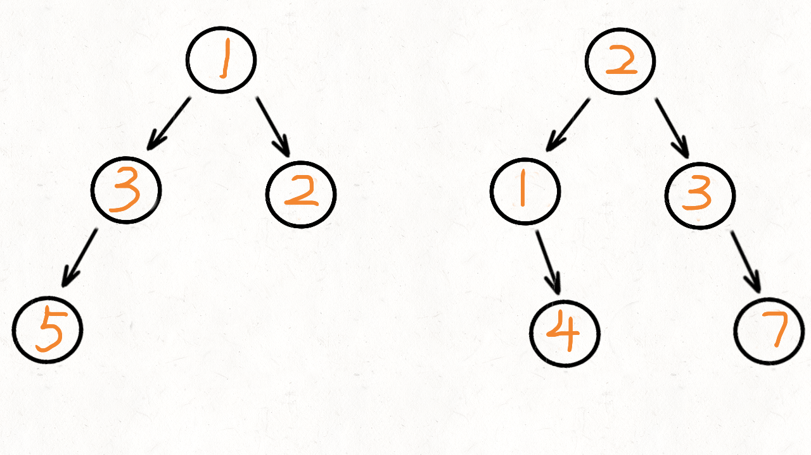

## Leetcode 题解 - 树 - 入门

<!-- GFM-TOC -->

* [Leetcode 题解 - 树](#leetcode-题解---树)
  * [递归](#递归)
    * [1. 树的高度](#1-树的高度)
    * [2. 平衡树](#2-平衡树)
    * [3. 两节点的最长路径](#3-两节点的最长路径)
    * [4. 翻转树](#4-翻转树)
    * [5. 归并两棵树](#5-归并两棵树)
    * [6. 判断路径和是否等于一个数](#6-判断路径和是否等于一个数)
    * [7. 统计路径和等于一个数的路径数量](#7-统计路径和等于一个数的路径数量)
    * [8. 子树](#8-子树)
    * [9. 树的对称](#9-树的对称)
    * [10. 最小路径](#10-最小路径)
    * [11. 统计左叶子节点的和](#11-统计左叶子节点的和)
    * [12. 相同节点值的最大路径长度](#12-相同节点值的最大路径长度)
    * [13. 间隔遍历](#13-间隔遍历)
    * [14. 找出二叉树中第二小的节点](#14-找出二叉树中第二小的节点)
  * [层次遍历](#层次遍历)
    * [1. 一棵树每层节点的平均数](#1-一棵树每层节点的平均数)
    * [2. 得到左下角的节点](#2-得到左下角的节点)
  * [前中后序遍历](#前中后序遍历)
    * [1. 非递归实现二叉树的前序遍历](#1-非递归实现二叉树的前序遍历)
    * [2. 非递归实现二叉树的后序遍历](#2-非递归实现二叉树的后序遍历)
    * [3. 非递归实现二叉树的中序遍历](#3-非递归实现二叉树的中序遍历)

## 递归

一棵树要么是空树，要么有两个指针，每个指针指向一棵树。树是一种递归结构，很多树的问题可以使用递归来处理。

### 1. 树的高度

104\. Maximum Depth of Binary Tree (Easy)

[Leetcode](https://leetcode.com/problems/maximum-depth-of-binary-tree/description/) / [104. 二叉树的最大深度](https://leetcode-cn.com/problems/maximum-depth-of-binary-tree/)

```java
public int maxDepth(TreeNode root) {
    if (root == null) return 0;
    return Math.max(maxDepth(root.left), maxDepth(root.right)) + 1;
}
```

### 2. 平衡树

110\. Balanced Binary Tree (Easy)

[Leetcode](https://leetcode.com/problems/balanced-binary-tree/description/) / [110. 平衡二叉树](https://leetcode-cn.com/problems/balanced-binary-tree/)

```html
    3
   / \
  9  20
    /  \
   15   7
```

平衡树左右子树高度差都小于等于 1

```java
class Solution {
    private boolean b = true;					//初始为true

    public boolean isBalanced(TreeNode root) {
        maxDepth(root);
        return b;
    }

    public int maxDepth(TreeNode root) {
        if (root == null) return 0;
        int l = maxDepth(root.left);
        int r = maxDepth(root.right);
        if (Math.abs(l - r) > 1) b = false;		//额外判下，差值是否大于1
        return 1 + Math.max(l, r);
    }
}
```

### 3. 两节点的最长路径

543\. Diameter of Binary Tree (Easy)

[Leetcode](https://leetcode.com/problems/diameter-of-binary-tree/description/) / [543. 二叉树的直径](https://leetcode-cn.com/problems/diameter-of-binary-tree/)

给定一棵二叉树，你需要计算它的直径长度。一棵二叉树的直径长度是任意两个结点路径长度中的最大值。

这条路径可能穿过也可能不穿过根结点。

```js
示例 :
          1
         / \
        2   3
       / \     
      4   5    
返回 3, 它的长度是路径 [4,2,1,3] 或者 [5,2,1,3]。注意：两结点之间的路径长度是以它们之间#边的数目。
```

```java
private int max = 0;

public int diameterOfBinaryTree(TreeNode root) {
    dep(root);
    return max;
}

private int dep(TreeNode root) {
    if (root == null) return 0;
    int l = dep(root.left);
    int r = dep(root.right);
    max = Math.max(max, l + r);
    return Math.max(l, r) + 1;
}
```

### 4. 翻转树

226\. Invert Binary Tree (Easy)

[Leetcode](https://leetcode.com/problems/invert-binary-tree/description/) / [226. 翻转二叉树](https://leetcode-cn.com/problems/invert-binary-tree/)

缓存交换

```java
public TreeNode invertTree(TreeNode root) {
    if (root == null) return null;
    TreeNode left = root.left;  // 后面的操作会改变 left 指针，因此先保存下来
    root.left = invertTree(root.right);
    root.right = invertTree(left);
    return root;
}
```

先序交换

```java
class Solution {
    public TreeNode invertTree(TreeNode root) {
        if (root == null) return null;
        swap(root);
        invertTree(root.left);
        invertTree(root.right);
        return root;
    }
    private void swap(TreeNode root) {
        TreeNode t = root.left;
        root.left = root.right;
        root.right = t;
    }
}
```

### 5. 归并两棵树

617\. Merge Two Binary Trees (Easy)

[Leetcode](https://leetcode.com/problems/merge-two-binary-trees/description/) / [617. 合并二叉树](https://leetcode-cn.com/problems/merge-two-binary-trees/)

```js
Input:
       Tree 1                     Tree 2
          1                         2
         / \                       / \
        3   2                     1   3
       /                           \   \
      5                             4   7

Output:
         3
        / \
       4   5
      / \   \
     5   4   7
```

```java
class Solution {
   public TreeNode mergeTrees(TreeNode t1, TreeNode t2) {
        if (t1 == null && t2 == null) return null;			//不写能跑通
        if (t1 == null) return t2;
        if (t2 == null) return t1;
        TreeNode root = new TreeNode(t1.val + t2.val);		//递归构造树
        root.left = mergeTrees(t1.left, t2.left);
        root.right = mergeTrees(t1.right, t2.right);
        return root;
    }
}
```

BFS 图解： [动画演示 递归+迭代 617.合并二叉树 - 合并二叉树 - 力扣（LeetCode） (leetcode-cn.com)](https://leetcode-cn.com/problems/merge-two-binary-trees/solution/dong-hua-yan-shi-di-gui-die-dai-617he-bing-er-cha-/) 

1 动图

  

```java
//时间：O(min(m,n))，只有当节点都不为空时才会合并，因此被访问到的节点数不会超过较小的二叉树的节点数。
//空间：O(min(m,n))，递归的层数，不会超过树的最大高度，最坏，树为链表。
class Solution {
    public TreeNode mergeTrees(TreeNode t1, TreeNode t2) {
        if(t1==null || t2==null) return t1==null? t2 : t1;
        LinkedList<TreeNode> q = new LinkedList<>();
        q.add(t1);					
        q.add(t2);
        while(!q.isEmpty()) {
            TreeNode r1 = q.remove();
            TreeNode r2 = q.remove();
            r1.val += r2.val;							//把树合并到t1上
            //如果r1和r2的左子树都不为空，就放到队列中
            //如果r1的左子树为空，就把r2的左子树挂到r1的左子树上
            if(r1.left!=null && r2.left!=null){			//和递归思路类似
                q.add(r1.left);
                q.add(r2.left);
            }
            else if(r1.left==null) {
                r1.left = r2.left;
            }
            if(r1.right!=null && r2.right!=null) {      //对于右子树也是一样的
                q.add(r1.right);
                q.add(r2.right);
            }
            else if(r1.right==null) {
                r1.right = r2.right;
            }
        }
        return t1;
    }
}

```

### 6. 判断路径和是否等于一个数

Leetcdoe : 112. Path Sum (Easy)

[Leetcode](https://leetcode.com/problems/path-sum/description/) / [112. 路径总和](https://leetcode-cn.com/problems/path-sum/)

```js
输入：sum = 22
              5
             / \
            4   8
           /   / \
          11  13  4
         /  \      \
        7    2      1
输出：true 解释：5->4->11->2 ，sum：22	//这个路径是根节点到叶子节点。
```

路径和定义为从 root 到 leaf 的所有节点的和。

```java
//展开版本
public boolean hasPathSum(TreeNode root, int sum) {
    if (root == null) return false;
    if (root.left == null && root.right == null //到底了
        && root.val == sum) return true;		//和diff一样了
    
    int diff = sum - root.val; //Difference 差值。 remainder 剩余，余数。
    
    boolean l = hasPathSum(root.left, diff);
    boolean r = hasPathSum(root.right,diff);
    return l || r;								//其中一个true就可以
}
```

```java
//浓缩
public boolean hasPathSum(TreeNode root, int sum) {
    if (root == null) return false;
    if (root.left == null && root.right == null && root.val == sum) return true;
    return hasPathSum(root.left, sum - root.val) || 
           hasPathSum(root.right, sum - root.val);
}
```

类似题目：剑指 34. 二叉树中和为某一值的路径，拓展是输出所有符合的结果

```java
示例:
给定如下二叉树，以及目标和 sum = 22，
      5
     / \
    4   8
   /   / \
  11  13  4
 /  \    / \
7    2  5   1

返回:
[
   [5，4，11，2]，
   [5，8，4，5]
]
提示：
节点总数 <= 10000
```

题解：双O(n)

```java
class Solution {
    LinkedList<List<Integer>> res = new LinkedList<>();
    //存储每个合适的子结果
    LinkedList<Integer> path = new LinkedList<>(); 
    
    public List<List<Integer>> pathSum(TreeNode root, int sum) {
        recur(root, sum);
        return res;
    }
    void recur(TreeNode root, int tar) {
        if(root == null) return;
        
        path.add(root.val);
        tar -= root.val;
        
        if(tar == 0 && root.left == null && root.right == null)
            res.add(new LinkedList(path));
        //先序遍历
        recur(root.left, tar);
        recur(root.right, tar);
        path.removeLast();//回溯 必须做。
    }
}
```

### 7. 统计路径和等于一个数的路径数量

437\. Path Sum III (Easy)

[Leetcode](https://leetcode.com/problems/path-sum-iii/description/) / [437. 路径总和 III](https://leetcode-cn.com/problems/path-sum-iii/)

```html
root = [10,5,-3,3,2,null,11,3,-2,null,1], sum = 8
      10
     /  \
    5   -3
   / \    \
  3   2   11
 / \   \
3  -2   1
Return 3. The paths that sum to 8 are:
1.  5 -> 3
2.  5 -> 2 -> 1
3. -3 -> 11
```

- 本题可以用**前缀和**，路径不一定以 root 开头，不一定以 leaf 结尾，但是必须连续向下。这种需要三重递归。

```java
//31ms、45%
class Solution {
    public int pathSum(TreeNode root, int sum) {
        if (root == null) return 0;
        int ret = dfs(root, sum);   		 //以父节点为起始
        int l = pathSum(root.left, sum);     //以左儿子为起始
        int r = pathSum(root.right, sum);    //以右儿子为起始
        return ret + l + r;     			 //结果是三个起点的和
    }
    int dfs(TreeNode root, int sum) {
        if (root == null) return 0;
        int cnt = root.val == sum ? 1 : 0;
        int diff = sum - root.val;
        return cnt + dfs(root.left, diff) + dfs(root.right, diff);
    }
}
```

一样的思路，青睐下边这个写法。

```java
class Solution {
    public int pathSum(TreeNode root, int sum) {
        if (root == null) return 0;
        int ret = dfs(root, sum);
        int l = pathSum(root.left, sum);
        int r = pathSum(root.right, sum);
        return ret + l + r;
    }
    public int dfs(TreeNode root, int sum) {
        if (root == null) return 0;
        sum = sum - root.val;
        int cnt = sum == 0 ? 1 : 0;
        return cnt + dfs(root.left, sum) + dfs(root.right, sum);
    }
}
```

前缀和 

[对前缀和解法的一点解释 - 路径总和 III - 力扣（LeetCode） (leetcode-cn.com)](https://leetcode-cn.com/problems/path-sum-iii/solution/dui-qian-zhui-he-jie-fa-de-yi-dian-jie-s-dey6/) 

**前缀和定义**

一个节点的前缀和就是该节点到根之间的路径和。 

          1					
         /  \
        2    3
       / \    \
      4   5    6
     / \   \
    7   8   9
    
    节点4的前缀和为：1 + 2 + 4 = 7
    节点8的前缀和：1 + 2 + 4 + 8 = 15
    节点9的前缀和：1 + 2 + 5 + 9 = 17
假如题目给定数值为 5

```js
 					 1
                    / 
                   2    
                  / 
                 3   
                / 
               4  
```

节点1的前缀和为: 1
节点3的前缀和为: 1 + 2 + 3 = 6

prefix(3) - prefix(1) == 5
所以 节点1 到 节点3 之间有一条符合要求的路径( 2 --> 3 )

prefix(3) - prefix(1) == 5 转化为：ret += map.getOrDefault(curSum - tar, 0);

意思是，遍历到当前层我们判断有没有 prefix(3) - 5 等于 prefix(1) 的，prefix(1)在前面遍历的时，要加入map的

思路：

遍历整颗树一次，**记录每个节点的前缀和**，查询该节点的祖先节点中符合条件的个数，将个数量加到最终结果上。

**HashMap存的是什么**

HashMap的key是前缀和， value是该前缀和的节点数量，记录数量是因为有出现复数路径的可能。 

比如说：下图树中，前缀和为1的节点有两个: 1, 0，所以路径和为2的路径数就有两条: 0 --> 2, 2


```js
      1
     / 
    0
   /
  2
```
**恢复状态的意义**

由于题目要求：路径方向必须是向下的（只能从父节点到子节点）

当我们讨论两个节点的前缀和差值时，有一个前提：一个节点必须是另一个节点的祖先节点，换句话说，当我们把一个节点的前缀和信息更新到map里时，它应当只对其子节点们有效。

举个例子，下图中有两个值为2的节点（A, B)。


```js
      0
     /  \
    A:2  B:2
   / \    \
  4   5    6
 / \   \
7   8   9
```
当我们遍历到最右方的节点6时，对于它来说，此时的前缀和为2的节点只该有B, 因为从A向下到不了节点6(A并不是节点6的祖先节点)。

如果我们不做状态恢复，当遍历右子树时，左子树中A的信息仍会保留在map中，那此时节点6就会认为A, B都是可追溯到的节点，从而产生错误。

状态恢复代码的作用就是： 在遍历完一个节点的所有子节点后，将其从map中除去。

```java
//3ms、99%
class Solution {
    public int pathSum(TreeNode root, int sum) {
        Map<Integer, Integer> map = new HashMap<>();
        map.put(0, 1);			   	   // 前缀和为0的一条路径
        return dfs(root, map, sum, 0); // 前缀和的递归回溯思路
    }

    int dfs(TreeNode root,final Map<Integer, Integer> map,final int tar, int curSum) {
        if (root == null) return 0;
        int ret = 0;
        curSum += root.val; 		
        ret += map.getOrDefault(curSum - tar, 0);
        map.put(curSum, map.getOrDefault(curSum, 0) + 1);	
        int l = dfs(root.left, map, tar, curSum);			//也可以写成ret累加
        int r = dfs(root.right, map, tar, curSum);			
        ret = ret + l + r;
        map.put(curSum, map.get(curSum) - 1);
        return ret;
    }
}
```

```js
如果没有这个初始化，map.put(0, 1);	
输入：22
      5
	 /  \
   	4    8
   /    / \
  11   13   4
 /  \	   / \
7    2    5   1
输出：1
预期：3
```

### 8. 子树

572\. Subtree of Another Tree (Easy)

[Leetcode](https://leetcode.com/problems/subtree-of-another-tree/description/) / [572. 另一个树的子树](https://leetcode-cn.com/problems/subtree-of-another-tree/)

```js
Given tree s:	 	 Given tree t:
     3				 	   4
    / \	                  / \
   4   5                 1   2
  / \			
 1   2
Return true, because t has the same structure and node values with a subtree of s.

Given tree s:		Given tree t:
     3					 4
    / \					/ \
   4   5			   1   2
  / \
 1   2
    /
   0
Return false. #因为 null 也得匹配，准确来说，树t 的 1、2节点还有两个4个null值需要匹配！
```

```java
//7ms、80%
public class Solution {
    boolean isSubtree(TreeNode rootA, TreeNode rootB) {
        if (rootA == null || rootA == null) return false;
        return verify(rootA, rootB) || 
            	isSubtree(rootA.left, rootB) || 
            	isSubtree(rootA.right, rootB);
    }
    boolean verify(TreeNode A, TreeNode B) {
        if (A == null && B == null) return true;
        if (B == null || A == null || A.val != B.val) return false;
        return verify(A.left, B.left) && verify(A.right, B.right);
    }
}
```

### 9. 树的对称

101\. Symmetric Tree (Easy)

[Leetcode](https://leetcode.com/problems/symmetric-tree/description/) / [101. 对称二叉树](https://leetcode-cn.com/problems/symmetric-tree/)

```js
    1
   / \
  2   2
 / \ / \
3  4 4  3
```

```java
class Solution {
    public boolean isSymmetric(TreeNode root) {
        if (root == null) return true;
        return isSymmetric(root.left, root.right);
    }
    boolean isSymmetric(TreeNode t1, TreeNode t2) {
        if (t1 == null && t2 == null) return true;
        if (t1 == null || t2 == null) return false;
        if (t1.val != t2.val) return false;
        return isSymmetric(t1.left, t2.right) && isSymmetric(t1.right, t2.left);
    }
}
```

### 10. 最小路径

111\. Minimum Depth of Binary Tree (Easy)

[Leetcode](https://leetcode.com/problems/minimum-depth-of-binary-tree/description/) / [力扣](https://leetcode-cn.com/problems/minimum-depth-of-binary-tree/description/)

求树的根节点到叶子节点的最小路径长度

- 叶子节点的定义是左孩子和右孩子都为 null 时叫做叶子节点
- 当 root 节点左右孩子都为空时，返回 1
- 当 root 节点左右孩子有一个为空时，返回不为空的孩子节点的深度
- 当 root 节点左右孩子都不为空时，返回左右孩子较小深度的节点值

```java
//第一版
class Solution {
    public int minDepth(TreeNode root) {
        if(root == null) return 0;
        //这道题递归条件里分为三种情况
        //1.左孩子和有孩子都为空的情况，说明到达了叶子节点，直接返回1即可
        if(root.left == null && root.right == null) return 1;
        //2.如果左孩子和右孩子其中一个为空，那么需要返回比较大的那个孩子的深度        
        int m1 = minDepth(root.left);
        int m2 = minDepth(root.right);
        //这里其中一个节点为空，说明m1和m2有一个必然为0，所以可以返回m1 + m2 + 1;
        if(root.left == null || root.right == null) return m1 + m2 + 1;
        
        //3.最后一种情况，也就是左右孩子都不为空，返回最小深度+1即可
        return Math.min(m1,m2) + 1; 
    }
}
//代码可以进行简化，当左右孩子为空时 m1 和 m2 都为 0
//可以和情况 2 进行合并，即返回 m1+m2+1
//简化后代码
class Solution {
    public int minDepth(TreeNode root) {
        if(root == null) return 0;
        int m1 = minDepth(root.left);
        int m2 = minDepth(root.right);
        //1.如果左孩子和右孩子有为空的情况，直接返回m1+m2+1
        //2.如果都不为空，返回较小深度+1
        return root.left == null || 
            root.right == null ? m1 + m2 + 1 : Math.min(m1,m2) + 1;
    }
}
//其他
public int minDepth(TreeNode root) {
    if (root == null) return 0;
    int left = minDepth(root.left);
    int right = minDepth(root.right);
    if (left == 0 || right == 0) return left + right + 1;
    return Math.min(left, right) + 1;
}
//if else
class Solution {
    public int minDepth(TreeNode root) {
        if (root == null) return 0;
        else if (root.left == null) return minDepth(root.right) + 1;
        else if (root.right == null) return minDepth(root.left) + 1;
        else return Math.min(minDepth(root.left), minDepth(root.right)) + 1;
    }
}

//bfs
//当我们找到一个叶子节点时，直接返回这个叶子节点的深度。广度优先搜索的性质保证了最先搜索到的叶子节点的深度一定最小。
class Solution {
    class QueueNode {
        TreeNode node;
        int depth;

        public QueueNode(TreeNode node, int depth) {
            this.node = node;
            this.depth = depth;
        }
    }

    public int minDepth(TreeNode root) {
        if (root == null) {
            return 0;
        }

        Queue<QueueNode> queue = new LinkedList<QueueNode>();
        queue.offer(new QueueNode(root, 1));
        while (!queue.isEmpty()) {
            QueueNode nodeDepth = queue.poll();
            TreeNode node = nodeDepth.node;
            int depth = nodeDepth.depth;
            if (node.left == null && node.right == null) {
                return depth;
            }
            if (node.left != null) {
                queue.offer(new QueueNode(node.left, depth + 1));
            }
            if (node.right != null) {
                queue.offer(new QueueNode(node.right, depth + 1));
            }
        }

        return 0;
    }
}
//bfs作者：LeetCode-Solution
//链接：https://leetcode-cn.com/problems/minimum-depth-of-binary-tree/solution/er-cha-shu-de-zui-xiao-shen-du-by-leetcode-solutio/
```

参考

原题：111、二叉树的最小深度：https://leetcode-cn.com/problems/minimum-depth-of-binary-tree/

题解：https://leetcode-cn.com/problems/minimum-depth-of-binary-tree/solution/li-jie-zhe-dao-ti-de-jie-shu-tiao-jian-by-user7208/

### 11. 统计左叶子节点的和

404\. Sum of Left Leaves (Easy)

[Leetcode](https://leetcode.com/problems/sum-of-left-leaves/description/) / [力扣](https://leetcode-cn.com/problems/sum-of-left-leaves/description/)

```html
    3
   / \
  9  20
    /  \
   15   7

There are two left leaves in the binary tree, with values 9 and 15 respectively. 
Return 24.
在这个二叉树中，有两个左叶子，分别是 9 和 15，所以返回 24
```

```java
//官解评论
class Solution {
    public int sumOfLeftLeaves(TreeNode root) {
        if (root == null) return 0;

        int left = sumOfLeftLeaves(root.left);	 //左子树返回结果
        int right = sumOfLeftLeaves(root.right); //右子树返回结果
        
        int leftval = root.left != null && 
            root.left.left == null && root.left.right == null ? root.left.val : 0;

        return left + right + leftval;// 20里返回15是0+0+15   3里返回9和15是9+15+0    
    }
}
//其他
public int sumOfLeftLeaves(TreeNode root) {
    if (root == null) return 0;
    if (isLeaf(root.left)) return root.left.val + sumOfLeftLeaves(root.right);
    return sumOfLeftLeaves(root.left) + sumOfLeftLeaves(root.right);
}

private boolean isLeaf(TreeNode node){
    if (node == null) return false;
    return node.left == null && node.right == null;
}
```

### 12. 相同节点值的最大路径长度

687\. Longest Univalue Path (Easy) 中等

[Leetcode](https://leetcode.com/problems/longest-univalue-path/) / [力扣](https://leetcode-cn.com/problems/longest-univalue-path/)

```html
给定一个二叉树，找到最长的路径，这个路径中的每个节点具有相同值。 这条路径可以经过也可以不经过根节点。
注意：两个节点之间的路径长度由它们之间的边数表示。

本题中，路径被定义为一条从树中任意节点出发，达到任意节点的序列。该路径至少包含一个节点，且不一定经过根节点。

示例1
输入：
              5
             / \
            4   5
           / \   \
          1   1   5
输出：2

示例2
输入：
			 1
            / \
           4   5
          / \   \
         4   4   5

输出：2
```

```java
//官解
class Solution {
    int ans;

    public int longestUnivaluePath(TreeNode root) {
        ans = 0;
        arrowLength(root);
        return ans;
    }

    public int arrowLength(TreeNode node) {
        if (node == null) return 0;
        int left = arrowLength(node.left);
        int right = arrowLength(node.right);

        int arrowLeft = 0, arrowRight = 0;

        if (node.left != null && node.left.val == node.val) {
            arrowLeft = left;    //累加左节点
            arrowLeft++;
        }
        if (node.right != null && node.right.val == node.val) {
            arrowRight = right;  //累加右节点
            arrowRight++;
        }
        ans = Math.max(ans, arrowLeft + arrowRight);  //刷新最大值
        return Math.max(arrowLeft, arrowRight);//向上返回较大的。
    }
}
//其他
private int path = 0;

public int longestUnivaluePath(TreeNode root) {
    dfs(root);
    return path;
}

private int dfs(TreeNode root){
    if (root == null) return 0;
    int left = dfs(root.left);
    int right = dfs(root.right);
    
    int leftPath = root.left != null && root.left.val == root.val ? left + 1 : 0;
    int rightPath = root.right != null && root.right.val == root.val ? right + 1 : 0;
    path = Math.max(path, leftPath + rightPath);
    return Math.max(leftPath, rightPath);
}
```

类似题目：[124. 二叉树中的最大路径和](https://leetcode-cn.com/problems/binary-tree-maximum-path-sum/) (困难)

### 13. 间隔遍历

337\. House Robber III (Medium)

[Leetcode](https://leetcode.com/problems/house-robber-iii/description/) / [力扣](https://leetcode-cn.com/problems/house-robber-iii/description/)

```html
337. 打家劫舍 III
在上次打劫完一条街道之后和一圈房屋后，小偷又发现了一个新的可行窃的地区。这个地区只有一个入口，我们称之为“根”。 除了“根”之外，每栋房子有且只有一个“父“房子与之相连。一番侦察之后，聪明的小偷意识到“这个地方的所有房屋的排列类似于一棵二叉树”。 如果两个直接相连的房子在同一天晚上被打劫，房屋将自动报警。
计算在不触动警报的情况下，小偷一晚能够盗取的最高金额。

示例 1:
输入: [3,2,3,null,3,null,1]

     3
    / \
   2   3
    \   \ 
     3   1

输出: 7 
解释: 小偷一晚能够盗取的最高金额 = 3 + 3 + 1 = 7.

示例 2:
输入: [3,4,5,1,3,null,1]

     3
    / \
   4   5		//4+5为最大
  / \   \ 
 1   3   1

输出: 9
解释: 小偷一晚能够盗取的最高金额 = 4 + 5 = 9.
```

思路参考

https://leetcode-cn.com/problems/house-robber-iii/solution/san-chong-fang-fa-jie-jue-shu-xing-dong-tai-gui-hu/

**4 个孙子偷的钱 + 爷爷的钱 VS 两个儿子偷的钱 哪个组合钱多，就当做当前节点能偷的最大钱数。这就是动态规划里面的最优子结构** 

```java
//解法一
class Solution {
    public int rob(TreeNode root) {
        if (root == null) return 0;

        int money = root.val;		//父节点的钱
        if (root.left != null) { 	//左儿子的俩孙子
            money += (rob(root.left.left) + rob(root.left.right));
        }
		//继续累加 money
        if (root.right != null) {	//右儿子的俩孙子
            money += (rob(root.right.left) + rob(root.right.right));
        }
		// 4个孙子偷的钱+爷爷的钱 VS 两个儿子偷的钱
        return Math.max(money, rob(root.left) + rob(root.right));
    }
}
//解法二：HashMap存树节点和树节点钱的映射，当记忆缓存，优化子问题计算。
class Solution {
    public int rob(TreeNode root) {
        HashMap<TreeNode, Integer> mem = new HashMap<>();
        return robInternal(root, mem);
    }
    public int robInternal(TreeNode root, HashMap<TreeNode, Integer> mem) {
        if (root == null) return 0;
        if (mem.containsKey(root)) return mem.get(root);
        int money = root.val;

        if (root.left != null) {
            money += (robInternal(root.left.left, mem) + robInternal(root.left.right, mem));
        }
        if (root.right != null) {
            money += (robInternal(root.right.left, mem) + robInternal(root.right.right, mem));
        }
        int result = Math.max(money,
                      robInternal(root.left, mem) + robInternal(root.right, mem));
        
        mem.put(root, result);
        return result;
    }
}
//解法三 用时很短
class Solution {
    public int rob(TreeNode root) {
        int[] result = robInternal(root);
        return Math.max(result[0], result[1]);
    }
    public int[] robInternal(TreeNode root) {
        if (root == null) return new int[2];
        int[] result = new int[2];

        int[] left = robInternal(root.left);
        int[] right = robInternal(root.right);

        result[0] = Math.max(left[0], left[1]) + Math.max(right[0], right[1]);
        result[1] = left[0] + right[0] + root.val;

        return result;
    }
}
//其他	这个超时的
public int rob(TreeNode root) {
    if (root == null) return 0;
    int val1 = root.val;
    if (root.left != null) val1 += rob(root.left.left) + rob(root.left.right);
    if (root.right != null) val1 += rob(root.right.left) + rob(root.right.right);
    int val2 = rob(root.left) + rob(root.right);
    return Math.max(val1, val2);
}
```

### 14. 找出二叉树中第二小的节点

671\. Second Minimum Node In a Binary Tree (Easy)

[Leetcode](https://leetcode.com/problems/second-minimum-node-in-a-binary-tree/description/) / [力扣](https://leetcode-cn.com/problems/second-minimum-node-in-a-binary-tree/description/)

```html
给定一个非空特殊的二叉树，每个节点都是正数，并且每个节点的子节点数量只能为 2 或 0。

如果一个节点有两个子节点的话，那么该节点的值等于两个子节点中较小的一个。
更正式地说，root.val = min(root.left.val, root.right.val) 总成立。
给出这样的一个二叉树，你需要输出所有节点中的第二小的值。如果第二小的值不存在的话，输出 -1 。

Input:
   2
  / \
 2   5
    / \
    5  7

Output: 5

示例：
一父两子全是2，返回-1，因为不存在倒数第二大。
```

一个节点要么具有 0 个或 2 个子节点，如果有子节点，那么根节点是最小的节点。

```java
//参考我的思路，简单粗暴。  结果：100 60  实际上空间差不多一样的。
class Solution {
    int min = Integer.MAX_VALUE;
    int ret = Integer.MAX_VALUE;
    boolean b = true;
    public int findSecondMinimumValue(TreeNode root) {
        find(root);//看树的节点是不是全一样，一样返回-1
        if (b) return -1;
        find1(root);//找最小值
        find2(root);//找次小值
        return ret;
    }
    public void find1(TreeNode root) {
        if (root == null) return;
        if (root.val < min) {
            min = root.val;
            b = false;
        }
        find1(root.left);
        find1(root.right);
    }
    public void find2(TreeNode root) {
        if (root == null) return;
        if (root.val < ret && root.val != min) ret = root.val;
        find2(root.left);
        find2(root.right);
    }
    public void find(TreeNode root) {
        if (root == null) return;
        find(root.left);
        find(root.right);
        if (root.left != null && root.val != root.left.val || 
            root.right != null && root.val != root.right.val ||
            root.left != null && root.right != null && root.left.val != root.right.val) {
            b = false;
        }
    }
}
//思路不明 来自官解评论
class Solution {
   public int findSecondMinimumValue(TreeNode root) {
        if (root == null) return -1;
        return help(root, root.val);
    }

    private int help(TreeNode root, int min) {

        if (root == null) return -1;
        if (root.val > min) return root.val;

        int left = help(root.left, min);
        int right = help(root.right, min);

        if (left == -1) return right;
        if (right == -1) return left;
        
        return Math.min(left, right);
    }
}

//其他
public int findSecondMinimumValue(TreeNode root) {
    if (root == null) return -1;
    if (root.left == null && root.right == null) return -1;
    
    int leftVal = root.left.val;
    int rightVal = root.right.val;
    
    if (leftVal == root.val) leftVal = findSecondMinimumValue(root.left);
    if (rightVal == root.val) rightVal = findSecondMinimumValue(root.right);
    
    if (leftVal != -1 && rightVal != -1) return Math.min(leftVal, rightVal);
    if (leftVal != -1) return leftVal;
    
    return rightVal;
}
```

类似参考：[100. 相同的树](https://leetcode-cn.com/problems/same-tree/)

判断树 p 和 q 是否是完全一样

```java
class Solution {
    public boolean isSameTree(TreeNode p, TreeNode q) {
        if (p == null && q == null) {
            return true;
        } else if (p == null || q == null) {
            return false;
        } else if (p.val != q.val) {
            return false;
        } else {
            return isSameTree(p.left, q.left) && isSameTree(p.right, q.right);
        }
    }
}
//作者：LeetCode-Solution   bfs太长了
//链接：https://leetcode-cn.com/problems/same-tree/solution/xiang-tong-de-shu-by-leetcode-solution/
```


## 层次遍历

使用 BFS 进行层次遍历。不需要使用两个队列来分别存储当前层的节点和下一层的节点，因为在开始遍历一层的节点时，当前队列中的节点数就是当前层的节点数，只要控制遍历这么多节点数，就能保证这次遍历的都是当前层的节点。

### 1. 一棵树每层节点的平均数

637\. Average of Levels in Binary Tree (Easy)

[Leetcode](https://leetcode.com/problems/average-of-levels-in-binary-tree/description/) / [力扣](https://leetcode-cn.com/problems/average-of-levels-in-binary-tree/description/)

```java
public List<Double> averageOfLevels(TreeNode root) {
    List<Double> ret = new ArrayList<>();
    if (root == null) return ret;
    Queue<TreeNode> queue = new LinkedList<>();
    queue.add(root);
    while (!queue.isEmpty()) {
        int cnt = queue.size();
        double sum = 0;
        for (int i = 0; i < cnt; i++) {
            TreeNode node = queue.poll();
            sum += node.val;
            if (node.left != null) queue.add(node.left);
            if (node.right != null) queue.add(node.right);
        }
        ret.add(sum / cnt);
    }
    return ret;
}
```

### 2. 得到左下角的节点

513\. Find Bottom Left Tree Value (Easy)

[Leetcode](https://leetcode.com/problems/find-bottom-left-tree-value/description/) / [力扣](https://leetcode-cn.com/problems/find-bottom-left-tree-value/description/)

```html
Input:

        1
       / \
      2   3
     /   / \
    4   5   6
       /
      7

Output:
7
```

```java
public int findBottomLeftValue(TreeNode root) {
    Queue<TreeNode> queue = new LinkedList<>();
    queue.add(root);
    while (!queue.isEmpty()) {
        root = queue.poll();
        if (root.right != null) queue.add(root.right);
        if (root.left != null) queue.add(root.left);
    }
    return root.val;
}
```

## 前中后序遍历

```html
    1
   / \
  2   3
 / \   \
4   5   6
```

- 层次遍历顺序：[1 2 3 4 5 6]
- 前序遍历顺序：[1 2 4 5 3 6]
- 中序遍历顺序：[4 2 5 1 3 6]
- 后序遍历顺序：[4 5 2 6 3 1]

层次遍历使用 BFS 实现，利用的就是 BFS 一层一层遍历的特性；而前序、中序、后序遍历利用了 DFS 实现。

前序、中序、后序遍只是在对节点访问的顺序有一点不同，其它都相同。

① 前序

```java
void dfs(TreeNode root) {
    visit(root);
    dfs(root.left);
    dfs(root.right);
}
```

② 中序

```java
void dfs(TreeNode root) {
    dfs(root.left);
    visit(root);
    dfs(root.right);
}
```

③ 后序

```java
void dfs(TreeNode root) {
    dfs(root.left);
    dfs(root.right);
    visit(root);
}
```

### 1. 非递归实现二叉树的前序遍历

144\. Binary Tree Preorder Traversal (Medium)

[Leetcode](https://leetcode.com/problems/binary-tree-preorder-traversal/description/) / [力扣](https://leetcode-cn.com/problems/binary-tree-preorder-traversal/description/)

```java
public List<Integer> preorderTraversal(TreeNode root) {
    List<Integer> ret = new ArrayList<>();
    Stack<TreeNode> stack = new Stack<>();
    stack.push(root);
    while (!stack.isEmpty()) {
        TreeNode node = stack.pop();
        if (node == null) continue;
        ret.add(node.val);
        stack.push(node.right);  // 先右后左，保证左子树先遍历
        stack.push(node.left);
    }
    return ret;
}
```

### 2. 非递归实现二叉树的后序遍历

145\. Binary Tree Postorder Traversal (Medium)

[Leetcode](https://leetcode.com/problems/binary-tree-postorder-traversal/description/) / [力扣](https://leetcode-cn.com/problems/binary-tree-postorder-traversal/description/)

前序遍历为 root -\> left -\> right，后序遍历为 left -\> right -\> root。可以修改前序遍历成为 root -\> right -\> left，那么这个顺序就和后序遍历正好相反。

```java
public List<Integer> postorderTraversal(TreeNode root) {
    List<Integer> ret = new ArrayList<>();
    Stack<TreeNode> stack = new Stack<>();
    stack.push(root);
    while (!stack.isEmpty()) {
        TreeNode node = stack.pop();
        if (node == null) continue;
        ret.add(node.val);
        stack.push(node.left);
        stack.push(node.right);
    }
    Collections.reverse(ret);
    return ret;
}
```

### 3. 非递归实现二叉树的中序遍历

94\. Binary Tree Inorder Traversal (Medium)

[Leetcode](https://leetcode.com/problems/binary-tree-inorder-traversal/description/) / [力扣](https://leetcode-cn.com/problems/binary-tree-inorder-traversal/description/)

```java
public List<Integer> inorderTraversal(TreeNode root) {
    List<Integer> ret = new ArrayList<>();
    if (root == null) return ret;
    Stack<TreeNode> stack = new Stack<>();
    TreeNode cur = root;
    while (cur != null || !stack.isEmpty()) {
        while (cur != null) {
            stack.push(cur);
            cur = cur.left;
        }
        TreeNode node = stack.pop();
        ret.add(node.val);
        cur = node.right;
    }
    return ret;
}
```

## 